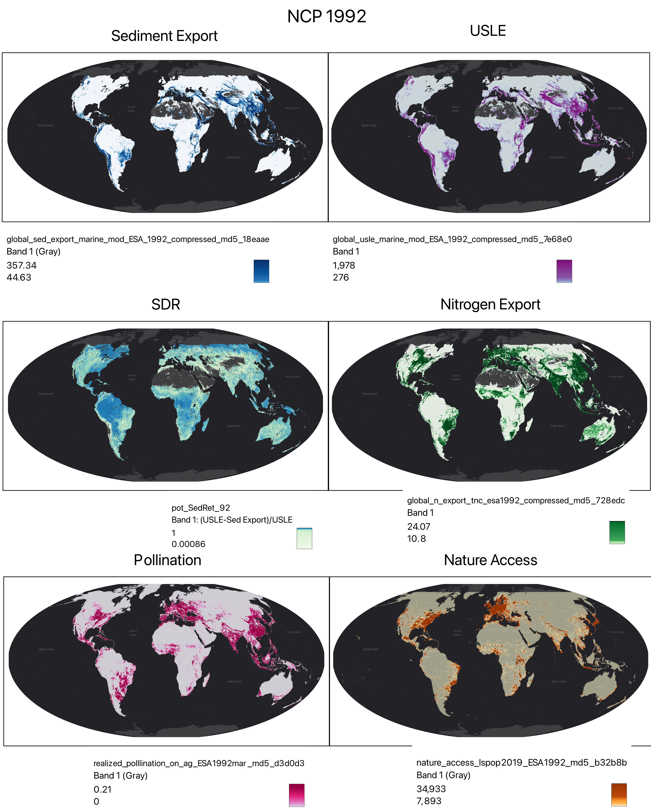
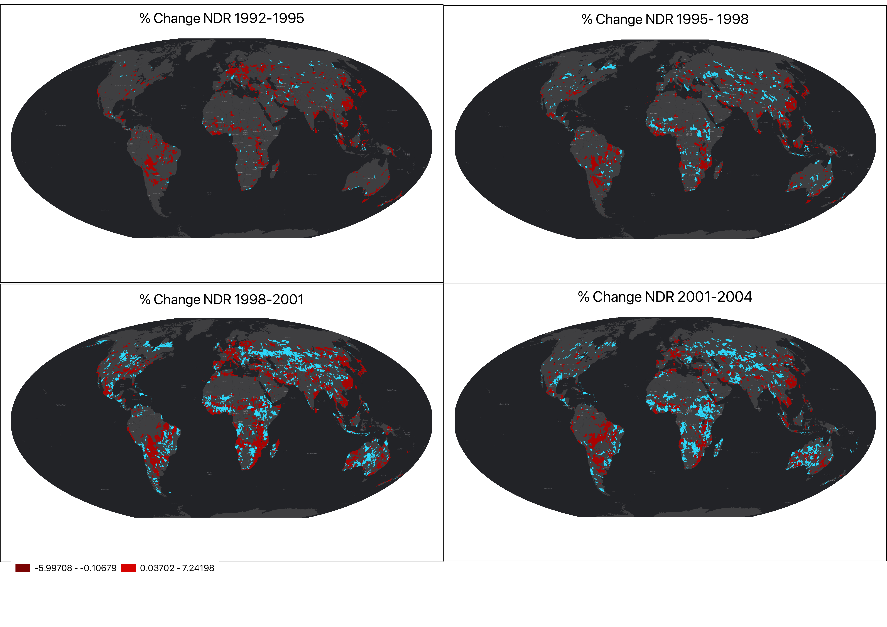

README
================
Jeronimo Rodriguez Escobar

# Overview

Working version of a structured workflow for extracting, analyzing, and
visualizing **zonal summary statistics** from global **ecosystem service
(ES)** and **land cover (LC)** raster datasets. The analysis focuses on
detecting spatial and temporal change using multiple modeling outputs
and spatial aggregation levels (e.g., countries, income groups, basins).

The core of this workflow is built around the R package
[`exactextractr`](https://github.com/isciences/exactextractr), which
allows for efficient zonal statistics operations between raster and
vector data. More recent additions to the workflow include:

- Temporal analysis of **Nitrogen Delivery Ratio (NDR)** using modeled
  global outputs from 1992–2004.
- Systematic **land cover change analysis** using square contingency
  matrices and change components from the
  [`diffeR`](https://cran.r-project.org/package=diffeR) package,
  following the approach proposed by Pontius and Santacruz.
- Use of reclassified global land cover maps (ESA 300m) into **natural**
  and **transformed** classes.
- Modular, parallelized processing over large vector datasets (e.g.,
  16,000+ basins at HydroBASINS level 6).

These tools and methods are designed to enable rapid and reproducible
summaries of change in ES provision and land cover composition across
any defined spatial units — from countries and continents to basins and
sub-basins.

### Key Capabilities

- Temporal analysis of **Nitrogen Delivery Ratio (NDR)** using modeled
  outputs from 1992–2004.
- Land cover change detection using ESA 300m global maps reclassified
  into **natural vs. transformed**.
- Application of **change metrics** to land cover matrices.
- Fully parallelized, reusable functions for batch analysis over
  multiple spatial units
- Modular and reproducible architecture for application to any polygon
  layer (countries, income groups, basins, etc.).

# Objectives

- Extract and standardize zonal summary statistics for ES rasters using
  `exactextractr`.
- Compute multi-year percentage changes in ES provision (e.g.,
  1992–2020).
- Compute **land cover change matrices** and summarize **gain, loss,
  persistence, exchange**, and other components using `diffeR`.
- Merge all statistics into the input vector files and export for
  visualization or further analysis.
- Provide reusable functions and scalable workflows.

# Input Data

- Raster datasets are stored in the `input_ES/` folder.
- Polygon vector datasets are stored in the `vector/` folder and include
  country boundaries, income groupings, WWF biomes, and HydroBASINS
  levels 6 and 7.

## Modeled Ecosystem Services

1.  **Nitrogen Export**  
    [InVEST
    NDR](https://naturalcapitalproject.stanford.edu/software/invest):
    kg/pixel/year

2.  **Sediment Retention**  
    [InVEST
    SDR](https://naturalcapitalproject.stanford.edu/software/invest):
    ton/pixel/year

3.  **Soil Erosion**  
    Derived from the *Revised Universal Soil Loss Equation*
    [USLE](https://storage.googleapis.com/releases.naturalcapitalproject.org/invest-userguide/latest/en/sdr.html)

4.  **Pollination**  
    [InVEST Pollination
    Model](https://naturalcapitalproject.stanford.edu/software/invest):
    People fed on habitat

5.  **Coastal Protection**  
    [InVEST Coastal
    Vulnerability](https://naturalcapitalproject.stanford.edu/software/invest):
    Unitless vulnerability index

6.  **Nature Access**  
    [Distance-to-nature
    dataset](https://github.com/springinnovate/distance-to-hab-with-friction):
    Population within 1 hour

7.  Sediment Retention Service: $$
    \text{Potential Sediment Retention} = \frac{\text{USLE} - \text{Export}}{\text{USLE}}
    $$

8.  Costal Protection

## Input Services

<div style="display: flex; gap: 10px;">




</div>

------------------------------------------------------------------------

## Land Cover Layers

Global land cover maps are based on ESA 300m layers. These are
reclassified into:

- Class 1: Transformed
- Class 2: Natural

Currently, the land cover change analysis includes 8 modeled time
points. A simplified two-class system is used to ensure tractability for
now, with plans to expand into finer class differentiation.

# Workflow

## 1. Load Overlay Polygon Data

Polygon datasets are stored in the `vector/` directory in `.gpkg` format
and include:

- Countries and territories
- Continents
- World Bank regions
- Income groups
- WWF biomes
- HydroBASINS (Levels 6 & 7)

Layers are dissolved externally (e.g., in QGIS) to ensure topology and
attribute consistency.

## 2. Load Raster Data

Raster inputs are located in `input_ES/`. These represent global ES
models for 1992 and 2020 (and intermediate years for NDR). Relative path
to the specifc sub directories and routines to list and load the input
data are included in the Rmd notebooks.

## 3. Compute Raster Differences

Temporal changes are computed by subtracting raster values between years
(e.g., `ES_2020 - ES_1992`) to generate bi-temporal **difference
rasters**.

<div style="display: flex; gap: 10px;">


</div>

## 4. Extract Zonal Statistics

Zonal statistics (mean, sum, stdev) are extracted using
`exactextractr::exact_extract()` and joined back to the polygons.

Zonal statistics are extracted: - Directly from the **ES rasters** (per
year) - Directly from the **difference rasters**

The two approaches produce nearly identical results, although extracting
from difference rasters may be more robust.

## 5.

Calculate by temporal % of change *This needs to be expanded/refined*

The % of change in NDR at the hydroshed level for 5 different time
points (1992,1995,1998,2001 and 2004) are mapped here: *All values*:
<p div style="display: flex; gap: 10px;">

</div>

*Top/bottom values*

<p div style="display: flex; gap: 10px;">

</div>

## 6. Land Cover Change Detection

For the land cover component, ESA 300m land cover maps were reclassified
into two categories:

- **1 = Transformed**
- **2 = Natural**

**Contingency matrix extraction**: - For each polygon, a square matrix
is computed using `diffeR::crosstabm()` that compares land cover at time
`t` and time `t+1`. - This results in a 2x2 matrix representing
stability and transition between classes.

``` r
diffeR::crosstabm(comp = r1, ref = r2, percent = TRUE)
```

Then we summarize components of change following the method by Pontius &
Santacruz (2014) using:

``` r
diffeR::diffTablej(tab, analysis = "change", digits = 3)
```

The following metrics are computed for each class and overall:

- **Gain**: % of area gained by the class
- **Persistence**: % that remained in the same class
- **Loss**: % of area lost to another class
- **Quantity**: Overall change due to size differences
- **Exchange**: Swaps between classes that cancel out
- **Shift**: Residual change not explained by Quantity or Exchange

These metrics are produced for each **polygon** and each **temporal
transition** (e.g., 1992–1995, 1995–1998, …).

Each basin and year transition receives 3 rows (one per class +
Overall). Here’s an example of the output before pivoting:

### Example Output Table (Long Format)

| Category | Gain  | Persistence | Loss  | Quantity | Exchange | Shift | HYBAS_ID   | year_step |
|----------|-------|-------------|-------|----------|----------|-------|------------|-----------|
| 1        | 0.004 | 0.441       | 0.000 | 0.004    | 0.000    | 0.000 | 1070000010 | 1995_1992 |
| 2        | 0.000 | 99.555      | 0.004 | 0.004    | 0.000    | 0.000 | 1070000010 | 1995_1992 |
| Overall  | 0.004 | 99.996      | 0.004 | 0.004    | 0.000    | 0.000 | 1070000010 | 1995_1992 |

### Pivot and Append

- The long-format output is pivoted into wide format, e.g.:

<!-- -->

    Gain_1_1995_1992, Gain_2_1995_1992, Gain_Overall_1995_1992, ..., Shift_Overall_2004_2001

- These metrics are joined back to the polygon dataset and exported
  using `st_write()`.

- To avoid clutter, each layer is saved separately in the `.gpkg` file
  (e.g., `"lcc_change_metrics"`), preserving existing datasets.

# Usage

Clone the repository:

``` bash
git clone https://github.com/springinnovate/global_NCP.git
```

Then, open any of the `Rmd` notebooks:

- `notebooks/zonal_stats.Rmd` \# for standard 1992-2020 data extraction.
  6 services
- `notebooks/zonal_stats_hs.Rmd` \# for multitemporal extraction.
  Applied to modeled nitrogen layers
- `notebooks/LC_change.Rmd` \# for extraction of LC change metrics
- `notebooks/visualizations.Rmd` \# data postprocessing and
  visualizations

Data folders:

- Raster files: `input_ES/`
- Polygon files: `vector/`

All file paths in the scripts are set up relative to the project root
and should work locally.

``` r
lcc_metrics_wide <- lcc_metrics_df %>%
  pivot_wider(
    id_cols = c(HYBAS_ID),
    names_from = c(Category, year_step),
    values_from = c(Gain, Persistence, Loss, Quantity, Exchange, Shift),
    names_glue = "{.value}_{Category}_{year_step}"
  )
```

Join to polygons and export:

``` r
basins_export <- left_join(basins, lcc_metrics_wide, by = "HYBAS_ID")
st_write(basins_export, "vector/basins.gpkg", layer = "lcc_change_metrics", append = FALSE)
```

------------------------------------------------------------------------

# Visualization & Interpretation

Bar plots and faceted maps are created using `ggplot2`. Changes can be
visualized per service or per transition.


Additional interpretation tools include:

- Top/bottom change filters by service or region
- Longitudinal comparisons across basins
- Potential use in equity/distributional analyses

|  |
|----|
| \# Notes on Scalability |
| \- All processing steps can be parallelized using `mclapply()` (Unix-based systems only). - Designed for batch-processing thousands of polygon units (e.g., HydroBASINS level 6 and 7). |
| \# Future Directions |
| \- Add more refined LC classes and extend beyond binary classification - Integrate InVEST model output pipelines for continuous updates - Automate report generation with `rmarkdown::render()` - Integrate a Shiny dashboard or QGIS-compatible plugin |

# License

MIT License

# Developer

**Jeronimo Rodriguez-Escobar**

For questions or contributions, please [open an
issue](https://github.com/springinnovate/global_NCP/issues) or submit a
pull request.
