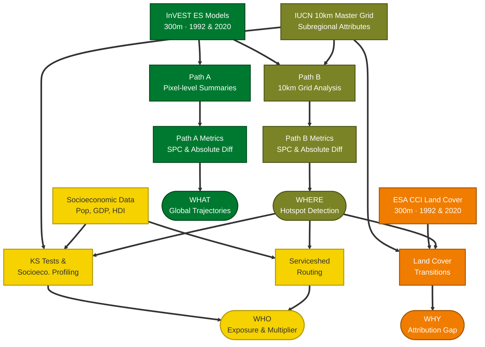

# README

Jeronimo Rodriguez Escobar
Affiliation: Global Science, WWF
Supervisor: Becky Chaplin-Kramer
Version: v1.3.4
Last updated: 2026-06-20

# Executive Summary

This workflow brings together global data on ecosystem services, land cover, and people to help us understand where nature is changing, who is affected, and where action is most needed. It combines data processing, change detection, and hotspot mapping in a way that is transparent and reproducible.

**Why does it matter?**
By identifying areas of rapid change or high importance, this pipeline supports better decision-making for conservation, policy, and sustainable development.

## Quick Start: Running the Full Pipeline

### Prerequisites
- Docker (for Python component)
- R (4.0+) with required packages (see `/environment.yml` for conda environment)
- Access to global_ncp data directory (external; set `GLOBAL_NCP_DATA` environment variable)

### Data Preparation (One-Time Setup)

The analysis pipelines require a clean, canonical 10km grid file. This is handled entirely by a pure-Python workflow which builds an enriched grid without geometry errors.

#### Grid Preparation using Python (Recommended)

This script creates a clean grid file guaranteed to be compatible with the downstream Python pipelines.

```bash
# Ensure you are using the correct Python environment
python Python_scripts/build_master_grid.py
```

### Running the Python Stage (Raster-based Zonal Statistics)

```bash
# Pull Docker image
docker pull therealspring/global_ncp-computational-environment:latest

# Run the raster-based zonal stats pipeline inside the Docker container:
docker run -it --rm \
  -v $(pwd):/workspace \
  -v /path/to/global_ncp/data:/data \
  -w /workspace \
  therealspring/global_ncp-computational-environment:latest /bin/bash

# Inside container, execute zonal summaries (services, then beneficiaries, then coastal):
python Python_scripts/summary_pipeline_landgrid.py --data-root /data analysis_configs/services_slim.yaml
python Python_scripts/summary_pipeline_landgrid.py --data-root /data analysis_configs/beneficiaries_slim.yaml
python Python_scripts/summary_pipeline_landgrid.py --data-root /data analysis_configs/c_protection_synth.yaml
```

### Running the R/Quarto Analysis Chain

Execute the following Quarto notebooks **in order** from the repository root:

```bash
# Full sequential analysis
quarto render analysis/process_data.qmd
quarto render analysis/hotspot_extraction.qmd
quarto render analysis/hotspot_synthesis.qmd
quarto render analysis/KS_tests_hotspots.qmd
```

### Rasterizing the Outputs

After the analysis chain is complete, run the bash script to rasterize the hotspot output geometries to 10km GeoTiffs using GDAL:

```bash
bash scripts/gdal_rasterize_hotspots.sh
```

Or render the full book (includes all chapters):

```bash
quarto render
```

Output files will be saved to:
- `processed/` – Intermediate GeoPackage and data files
- `outputs/plots/` – Generated visualizations and maps


---

## Interactive Book Output

Rendering the book (`quarto render docs/manuscript`) produces a self-contained HTML book with interactive tables in **Chapter 4 (WHERE — Hotspot Geography)**. No R session or data connection is required to use them — all queries run entirely in the browser.

### Three table types

| Tab | What it shows | Key filter columns |
|---|---|---|
| **Hotspot Area Coverage** | Hotspot cells, % area, and relative intensity for every service × geographic unit (country, WB region, biome, income group) | Grouping, Service, Geographic Unit |
| **Compound Risk Summary** | Mean overlapping services and % multi-service cells per unit | Grouping, Geographic Unit |
| **Country × Biome (Cross-dimensional)** | Hotspot stats for every *country–biome–service* combination (3,553 rows, ≥1 hotspot cell) | Country, Biome, WB Region, Income Group, Service |

### How to use the tables

- **Filter**: type in the box below any column header — partial match, case-insensitive
- **Compare multiple values**: use `|` as OR within any text column — e.g. `Brazil|Indonesia` shows both countries; `Mangrov|Flooded` shows two biomes; `Pollin|C_Risk` shows two services
- **Sort**: click any column header to toggle ascending / descending; numeric columns sort numerically
- **Combine**: multiple column filters stack — e.g. `Brazil|Indonesia` in Country + `Mangroves` in Biome + sort Relative Intensity ↓ compares the two countries' Mangrove burden directly
- **Page size**: selector at bottom-left — 10 / 25 / 50 / 100 rows
- **Global search**: box at top-right searches across all columns simultaneously

### Example queries

```
# Which biomes in Brazil have the highest Pollination hotspot burden?
→ Country filter: "Brazil" | Service filter: "Pollination" | sort Relative Intensity ↓

# Compare Brazil vs Indonesia Mangrove burden across all services:
→ Country filter: "Brazil|Indonesia" | Biome filter: "Mangroves" | sort Relative Intensity ↓

# How does coastal risk compare across all countries in Sub-Saharan Africa?
→ WB Region filter: "Sub-Saharan" | Service filter: "C_Risk" | sort Relative Intensity ↓

# Which services are failing most in low-income tropical countries?
→ Income Group filter: "Low income" | Biome filter: "Tropical" | sort Relative Intensity ↓

# Full profile of South Korea — all biomes and services ranked:
→ Country filter: "South Korea" | sort Relative Intensity ↓
```

**Relative Intensity** is the key metric: values > 1 (shown in red) mean that unit hosts more hotspot area than its land share predicts; values < 1 (shown in blue) mean under-represented. A value of 4.78, for example, means nearly 5× the expected concentration.

### Technical note

The cross-dimensional table is built at book-render time from `hotspots_global_pct.gpkg` (225K cells, ~86 MB). The R chunk is cached — first render takes ~5 seconds for the GeoPackage load + pivot; subsequent renders are instant unless the source data changes. Requires the `reactable` R package (`install.packages("reactable")`).

---

- **AOO**: Area of Occupancy. A standard 10 km equal-area grid used for spatial analysis.
- **ES**: Ecosystem Services. Benefits people obtain from nature (e.g., pollination, coastal protection).
- **Hotspot**: A grid cell showing unusually high or low relative change in ecosystem services (the extreme 5% tail of the distribution).
- **KS Analysis**: Kolmogorov-Smirnov test, a statistical method used here to compare the socioeconomic profiles of hotspots vs. non-hotspots.
- **Zonal Statistics**: Calculations that summarize high-resolution raster data within the boundaries of polygons (grid cells or regions).

# Overview

Working version of a structured workflow for extracting, analyzing, and visualizing **zonal summary statistics** from global raster datasets including **ecosystem service (ES)**, **land cover (LC)**, and socioeconomic (beneficiary) layers. The analysis is built around the IUCN AOO **10 km equal-area grid** (land-only) enriched with country/region/biome attributes, with outputs aggregated to countries, regions, income groups, and biomes.

The core extraction workflow uses Python (`taskgraph` + `exactextract`) for zonal summaries; R/Quarto is used for consolidation, change calculations, hotspot extraction, and KS tests.

For a detailed technical description of the pipeline, see the project's official documentation in the `/docs` directory, particularly `docs/methodology.md` and `docs/runbook.md`.

### Pipeline Architecture


```mermaid
%%{init: {'flowchart': {'rankSpacing': 55, 'nodeSpacing': 30}}}%%
flowchart TB
    RawES["InVEST ES Models\n300m · 1992 & 2020"]
    RawGrid["IUCN 10km Master Grid\nSubregional Attributes"]
    RawLC["ESA CCI Land Cover\n300m · 1992 & 2020"]
    RawSoc["Socioeconomic Data\nPop, GDP, HDI"]

    IntA["Path A\nPixel-level Summaries"]
    MathA["Path A Metrics\nSPC & Absolute Diff"]

    IntB["Path B\n10km Grid Analysis"]
    MathB["Path B Metrics\nSPC & Absolute Diff"]

    MathLC["Land Cover\nTransitions"]
    MathSoc["KS Tests &\nSocioeco. Profiling"]
    MathBenef["Serviceshed\nRouting"]

    P1(["WHAT\nGlobal Trajectories"])
    P2(["WHERE\nHotspot Detection"])
    P3(["WHY\nAttribution Gap"])
    P4(["WHO\nExposure & Multiplier"])

    RawES ==> IntA & IntB
    RawGrid ==> IntB & MathLC & MathSoc
    RawLC ==> MathLC
    RawSoc ==> MathSoc & MathBenef

    IntA ==> MathA ==> P1
    IntB ==> MathB ==> P2

    P2 ==> MathLC & MathSoc & MathBenef
    MathLC ==> P3
    MathSoc ==> P4
    MathBenef ==> P4

    classDef c_what fill:#007930,stroke:#004D1E,stroke-width:2px,color:#FFF;
    classDef c_where fill:#7B8327,stroke:#515619,stroke-width:2px,color:#FFF;
    classDef c_why fill:#F07D00,stroke:#A85700,stroke-width:2px,color:#FFF;
    classDef c_who fill:#F5D200,stroke:#B39900,stroke-width:2px,color:#333;

    class RawES,IntA,MathA,P1 c_what;
    class RawGrid,IntB,MathB,P2 c_where;
    class RawLC,MathLC,P3 c_why;
    class RawSoc,MathSoc,MathBenef,P4 c_who;
```

## Repository Structure

The project is organized into the following key directories. For detailed technical documentation, refer to the files within the `/docs` directory.

*   `/analysis/`: Contains the **active** Quarto notebooks for data processing, synthesis, and interpretation. This is where the main narrative of the analysis lives.

*   `/notebooks/`: An **archive** for legacy or completed notebooks from previous analysis phases. This keeps the `/analysis/` directory clean and focused on current work.

*   `/R/`: Contains the core, reusable R functions for the project. This directory is structured like an R package source directory.

*   `/scripts/`: Contains standalone utility scripts for specific, often automated, tasks like map generation or monitoring long-running jobs.

*   `/docs/`: Contains all project documentation, including the detailed methodology, runbooks, and data dictionaries. This is the single source of truth for project context.

*   `/outputs/`: Contains generated plots, maps, and other visual outputs from the analysis. This directory is in `.gitignore`.

# Objectives

-   Extract and standardize zonal summary statistics for ES rasters.
-   Compute bi-temporal changes in ES provision (e.g., 1992–2020).
-   Generate land cover change matrices and synthesize metrics like gain, loss, and persistence.
-   Support hotspot detection using top/bottom thresholds or directional logic.
-   Enable exploratory visualization and plotting using `ggplot2` or `tmap`.
-   Assess the distribution of hotspots across services, locations, and demographics using statistical analysis (e.g., KS tests), going beyond simple visualization.

# Input Data

## Polygon Layers / Grid

-   **IUCN AOO 10 km equal-area grid (land-only)**: stored under `vector_basedata/`, enriched with country, income group, WB/UN regions, continent, WWF biome.
-   Country boundaries and regional lookups (income, WB/UN regions, continent) under `vector_basedata/`.
-   WWF Biomes and Ecoregions.

## Raster Layers

Stored under the external data root (`raw/`), include:

-   InVEST-modeled ecosystem services for 1992 and 2020
-   ESA 300m land cover products (reclassified into binary: Transformed/Natural)
-   Global gridded socioeconomic datasets (e.g., GDP, HDI, population density)

## Modeled Ecosystem Services

Eight variables modeled with InVEST at 300m resolution, 1992 and 2020, split into two tiers as of
the 2026-08 retention/protection redesign. All rasters pre-normalised to per-hectare units before
extraction; ratio/index services are dimensionless and exempt from area correction.

**The 5 hotspot-defining services** (retention/protection *amounts* — the paper's actual variable
set; a hotspot is the most intense 5% decline in provision for any one of these):

| # | Service | Variable | Type |
|---|---|---|---|
| 1 | Nitrogen Retention | `N_retention` | Volumetric (kg N/ha retained) |
| 2 | Sediment Retention | `Sed_retention` | Volumetric (ton/ha retained; USLE − sediment export) |
| 3 | Coastal Protection | `C_Prot_service` | Risk reduction attributable to habitat (Rt_nohab_all − Rt) |
| 4 | Pollination | `Pollination` | Index |
| 5 | Nature Access | `Nature_Access` | Index (equidistant projection) |

**3 proportional ratio forms**, plus their export/risk raw inputs — not hotspot-defining, not
reported directly in the paper (used only as computational inputs to the ratios), but still
present in the data and individually tested/plotted in several places (e.g. KS-test distributions):

| # | Variable | Type |
|---|---|---|
| `N_Ret_Ratio` | Nitrogen retention ratio | Ratio (0–1) |
| `Sed_Ret_Ratio` | Sediment retention ratio | Ratio (0–1) |
| `C_Risk_Red_Ratio` | Coastal risk reduction ratio | Ratio (Rt_ratio, 0–1) |
| `N_export`, `Sed_export`, `C_Risk` | Export/risk residuals | Raw inputs to the ratios above only |

**Canonical variable names, columns, and direction are defined in exactly one place**:
`R/service_config.R` (`SERVICE_AMOUNTS`, `SERVICE_RATIOS`, `SERVICE_LEGACY_RAW`, and the
`service_canonical_lookup()`/`hotspot_direction_lists()` accessors). Every analysis notebook and
mapping script sources this instead of redefining the list locally — three independent copies
drifted out of sync in 2026-08-31 before this consolidation; see `docs/pipeline_reference.md`
(row B7) for that incident. **Do not add a new hardcoded service list anywhere else in this
repo** — extend `R/service_config.R` and let consumers pick it up.

## Land Cover Layers

ESA 300m maps reclassified as:

-   **Class 1**: Transformed
-   **Class 2**: Natural

Land cover change metrics (gain, loss, persistence, etc.) are derived using `diffeR::crosstabm()` and `diffeR::difftablej()` following Pontius & Santacruz (2014). These include:

-   Gain / Loss
-   Persistence
-   Quantity / Exchange / Shift

Metrics are computed for each class and overall and then reshaped into wide format.

::: {.cell layout-align="center"}
&lt;img src="output_maps/OriginalServices_chg_1992_2020.png" width="60%"/&gt;
:::

# Pipeline Usage (Python)

The `summary_pipeline_landgrid.py` script executes batch zonal summaries using
`taskgraph` inside a Docker container. Inputs are defined in YAML files under
`analysis_configs/` (e.g., `services_slim.yaml`, `beneficiaries_slim.yaml`,
`c_protection_synth.yaml`) and point to the canonical IUCN AOO 10 km vector grid
(`landgrid_1_clean_enriched_4326.gpkg`) plus the raw raster inputs. **Do not use
`AOOGrid_10x10km_land_4326_clean.gpkg`** — that grid is deprecated (no longer on disk) and was the
root cause of a real bug (see `docs/runbook.md`'s Prerequisite section and the LCC striping-bug
investigation); all current configs already reference the correct grid.

To execute:

``` bash
docker pull therealspring/global_ncp-computational-environment:latest

# Linux/macOS
docker run -it --rm \
  -v $(pwd):/workspace \
  -v /home/jeronimo/data/global_ncp:/data \
  -w /workspace \
  therealspring/global_ncp-computational-environment:latest /bin/bash

# Windows
docker run -it --rm ^
  -v %CD%:/workspace ^
  -v C:\path\to\global_ncp\data:/data ^
  -w /workspace ^
  therealspring/global_ncp-computational-environment:latest /bin/bash
```

Then, run the workflow:

``` bash
python Python_scripts/summary_pipeline_landgrid.py --data-root /data analysis_configs/services_slim.yaml
python Python_scripts/summary_pipeline_landgrid.py --data-root /data analysis_configs/beneficiaries_slim.yaml
python Python_scripts/summary_pipeline_landgrid.py --data-root /data analysis_configs/c_protection_synth.yaml
```

Each raster-vector combo is processed in parallel, using `exactextract` for
zonal summaries. Results are cached and returned quickly on reruns.

If you change grids or configs, clear the workspace cache (or set a new
workspace dir) to avoid stale taskgraph outputs:

``` bash
rm -f summary_pipeline_workspace_ha/*.gpkg
rm -f summary_pipeline_workspace_ha/taskgraph_data.db
```

``` bash
# requires GLOBAL_NCP_DATA to be set (e.g., /home/jeronimo/data/global_ncp)
COASTAL_INCLUDE_CH=1 python Python_scripts/rasterize_coastal.py
```

``` bash
# identify outputs (services = older, beneficiaries = newer)
ls -lt summary_pipeline_workspace_ha/*.gpkg

OUT_DIR=/home/jeronimo/data/global_ncp/interim
TS=$(date +%Y%m%d_%H%M%S)

SERV_SRC=/home/jeronimo/projects/global_NCP/summary_pipeline_workspace_ha/&lt;services_file&gt;.gpkg
ogr2ogr -wrapdateline -datelineoffset 180 \
  "$OUT_DIR/10k_grid_synth_serv_${TS}.gpkg" "$SERV_SRC"

BEN_SRC=/home/jeronimo/projects/global_NCP/summary_pipeline_workspace_ha/&lt;beneficiaries_file&gt;.gpkg
ogr2ogr -wrapdateline -datelineoffset 180 \
  "$OUT_DIR/10k_grid_synth_benef_${TS}.gpkg" "$BEN_SRC"

# coastal protection summary (single output in workspace)
COAST_SRC=/home/jeronimo/projects/global_NCP/summary_pipeline_workspace_ha/&lt;coastal_file&gt;.gpkg
ogr2ogr -wrapdateline -datelineoffset 180 \
  "$OUT_DIR/10k_grid_synth_coastal_${TS}.gpkg" "$COAST_SRC"

# Naming convention: synthesis outputs start with "10k_"
```
### Adding New Data (Variables, Years, Services)

The pipeline is designed to be highly modular and extensible. To add new continuous raster data to the analysis in the future:
1. **Add to Config:** Add the new raster path to the appropriate YAML config (or create a new one).
2. **Run Python Extraction:** Run `python Python_scripts/summary_pipeline_landgrid.py` with your config. This drops a new spatial GPKG into the workspace.
3. **R Consolidation:** Run `analysis/process_data.qmd`. It will automatically grab the latest extractions from the workspace, strip their geometries, and seamlessly `left_join` them to the canonical grid using the stable `fid` row identifier. 

**Important Manual Steps in `process_data.qmd`:**
- **New Variables:** Add new Python output column names to the `rename_list` (for services) or `benef_keep` list (for socioeconomics) so they are retained. Look for the `[MANUAL UPDATE REQUIRED]` blocks in the script.
- **Multiple Years:** The pipeline performs a bi-temporal comparison by automatically finding the minimum (T0) and maximum (T1) years in your columns. If you have 3+ years (e.g., 1992, 2015, 2020) and want to compare 2015 to 2020, you must explicitly drop the 1992 columns in `process_data.qmd` before the `compute_change` function is called.

# Active R Analysis Workflow

The R/Quarto analysis workflow is conducted through a series of notebooks in the `analysis/` directory. These scripts should be **executed in the following order** to ensure data dependencies are met. The workflow implements the **WHAT → WHERE → WHY → WHO** framework (see pipeline architecture above).

## Core R Analysis Chain (Execution Order)

1. **`build_master_grid.py`** – **Data Preparation & Baseline Setup**
   - Loads raw zonal statistics from Python pipeline outputs
   - Prepares and validates the canonical 10km IUCN AOO grid with subregional attributes
   - Creates baseline data structures for downstream analysis
   - Output: Intermediate processed data files

2. **`process_data.qmd`** – **WHAT: Global Ecosystem Service Trajectories**
   - Consolidates base zonal statistics (1992 & 2020 values)
   - Calculates bi-temporal change: absolute difference and Symmetric Percentage Change (SPC)
   - Produces the canonical `processed/10k_change_calc.gpkg` file (used by all downstream steps)
   - Generates global trajectory summaries and bar charts
   - **Key Output:** `10k_change_calc.gpkg`

3. **`LC_change*.qmd`** – **Land Cover Change Processing** (optional preprocessing)
   - `LC_change_preparation.qmd`: Prepares ESA CCI reclassified land cover data
   - `LC_change.qmd`: Computes land cover transition matrices and derived metrics (gain, loss, persistence)
   - `LC_change_rasters.qmd`, `LC_change_granular.qmd`, `viz_granular_lcc.qmd`: Detailed LCC visualizations

4. **`hotspot_extraction.qmd`** – **WHERE: Hotspot Detection (Top/Bottom 5%)**
   - Reads `10k_change_calc.gpkg` from Process Data step
   - Identifies hotspots using relative thresholds (extreme 5% of SPC distribution)
   - Exports hotspot vector layers to `processed/hotspots/`
   - Generates bar plots, violin plots, and distribution summaries by subregion
   - **Key Outputs:** Hotspot GPKGs, diagnostic plots

5. **`hotspot_synthesis.qmd`** – **WHERE & WHO: Hotspot Intensity & Population Exposure**
   - Calculates hotspot coverage (area statistics), relative intensity, and multi-service "hotness"
   - Integrates socioeconomic data (population density, GDP, HDI)
   - Exports summary tables: `hotspot_area_stats.csv`, `hotspot_pop_exposure.csv`
   - Produces clustering plots and heatmaps
   - **Key Outputs:** Summary statistics tables, clustering visualizations

6. **`KS_tests_hotspots.qmd`** – **WHO: Socioeconomic Profiling & Attribution Analysis**
   - Performs Kolmogorov-Smirnov (KS) tests on hotspot vs. non-hotspot populations
   - Compares socioeconomic profiles (population, GDP, HDI, built area, etc.)
   - Generates KS test plots and statistical summaries
   - Links ecosystem service hotspots to drivers (land cover conversion, urbanization)

## Data Flow Summary

```
Python Pipeline (Docker)
    ↓
    → summary_pipeline_landgrid.py
    → Outputs: Zonal summaries (1992 & 2020 rasters × 10km grid)
    ↓
R Analysis Chain (Sequential)
    ↓
    process_data.qmd [creates 10k_change_calc.gpkg]
    ↓
    hotspot_extraction.qmd [hotspot identification]
    ↓
    hotspot_synthesis.qmd [intensity & exposure]
    ↓
    KS_tests_hotspots.qmd [socioeconomic profiling]
    ↓
Final Outputs: Maps, summary tables, KS test plots, manuscript figures
    ↓
Validation: scripts/audit_claims.R [verifies key paper claims against outputs]
```

## For Complete Technical Details

See the project runbook for detailed methodology and validation notes:

*   **`docs/runbook.md`** – Full execution guide and validation procedures
*   **`docs/methodology.md`** – Technical explanation of two-path analysis structure
*   **`analysis/README.md`** – Archive policy and notebook scoping

# Pipeline Scalability & Extensibility

The current analysis applies this pipeline at global scale with two temporal snapshots (1992, 2020), a 100 km² grid, and globally-applied InVEST default parameters. These are **implementation choices for a global proof-of-concept**, not architectural constraints. The pipeline is designed to be flexible along all of these dimensions:

## Spatial resolution
The hotspot extraction, synthesis, and subregional analysis infrastructure is resolution-agnostic. Replacing the 100 km² global grid with a finer-resolution regional grid (e.g., 1 km² for a river basin or country study) requires only new Python zonal statistics inputs — all downstream R analysis and reporting steps work without modification. Finer resolution would directly address the site-level planning limitation of the current global analysis.

## Temporal coverage
The pipeline's dual-pathway structure already handles arbitrary numbers of time points. The `process_data.qmd` notebook identifies T0 and T1 automatically from available columns; adding a third or fourth year (e.g., 2000, 2010) requires populating those columns from new InVEST model runs. Multi-temporal analysis is a documented future task in `analysis/hotspot_extraction.qmd`.

## Geographic scope
The same pipeline can be run on a regional study area (Amazon basin, Southeast Asia, West Africa coastal zone, etc.) with locally-calibrated InVEST inputs. Regional applications benefit from site-specific parameterization that is not feasible at global scale, yielding more defensible biophysical outputs. The subregional filtering infrastructure (`filter_multidim()`, regional CSV subsets, and the parameterized report template) was designed to support exactly this kind of targeted analysis.

## Additional services
Any InVEST output — or output from another biophysical model — can be added as a new service column. Add the raster path to the Python YAML config, run the extraction, and update the `rename_list` in `process_data.qmd`. **Also add the new service to `R/service_config.R`** (name, column prefix, good direction) — this is the one place every analysis notebook and mapping script reads the service list from; a service added only to `rename_list` will extract correctly but never be recognized as hotspot-eligible anywhere downstream. The hotspot identification, synthesis, and reporting steps then handle the expanded service set automatically.

## Quick reference: what to change for a regional high-resolution application

| Component | Global (current) | Regional adaptation |
|---|---|---|
| Grid | IUCN AOO 100 km², global | Custom polygon grid at target resolution |
| InVEST inputs | Global default parameters | Locally calibrated biophysical tables |
| Temporal snapshots | 1992, 2020 | Any available model years |
| Services | 8 global services | Any InVEST or compatible model outputs |
| Socioeconomic data | Global gridded datasets | National/regional census or survey data |
| Hotspot threshold | 5% global percentile | Adjustable via `pct_cutoff` in `HOTS_CFG` |

See `docs/runbook.md` for the full execution guide and `docs/methodology.md` for the analytical framework.

---

# External Data: Critical Natural Assets (Chaplin-Kramer et al. 2022)

Used in the Colombia country-report work (`scripts/mapping/make_colombia_critical_assets_map.R`
and related). This repo only holds the **aggregated** raster
(`data/external/critical_natural_assets/local_NCP_all_targets/local_NCP_land_all_targets_md5_7ccece.tif`).

**Source (verified 2026-08-19)**: paper's own OSF data repository, `https://osf.io/r5xz7/`
(cited in the paper's Data Availability statement, nature.com/articles/s41559-022-01934-5) — not
a Dryad repository despite the hashed filenames suggesting one. That OSF project's `data/NCP
layers/` folder holds the **individual per-service "realized" rasters** (pollination, coastal
protection, nitrogen retention ×2 buffer distances, sediment deposition ×2 buffer distances,
nature access ×4 urban/rural × 60/360min variants) plus a `potential service layers` subfolder
(theoretical-maximum versions; two of those three files are 2-3GB each). None of the individual
layers are downloaded into this repo yet — see `docs/HANDOFF_2026-08-19.md` for the direct
per-file OSF download links if/when they're needed.

Methodology (from the OSF project's own README): 14 NCP layers (12 local-scale + 2 global-scale:
carbon storage, moisture recycling) at ~2km resolution, compiled by Rachel Neugarten and Becky
Chaplin-Kramer, optimized with the R package `prioritizr` on an Eckert IV equal-area grid at
multiple resolutions (1/5/10/100km). "Critical" cells sustain 90% of total current NCP magnitude;
headline finding is that this covers only 30% of global land area for the 12 local NCPs (44% if
the 2 global NCPs are included).

---

# Future Directions

-   **Multi-temporal analysis:** Extend to 3+ snapshots (e.g., 1992, 2000, 2010, 2020) to capture trajectories, recovery events, and rate of change — not just net difference.
-   **Regional high-resolution applications:** Apply the pipeline to priority regions (Amazon, SE Asia, West Africa) at 1–10 km resolution with locally calibrated InVEST inputs.
-   **Attribution strengthening:** Factorial InVEST experiments (fixed climate / varying land cover, and vice versa) to partition the attribution gap between land-use-driven and climate-driven change.
-   **Population exposure by region and biome:** Extend `hotspot_pop_exposure.csv` to stratify by `region_wb`, `WWF_biome`, and country (currently income-group only; requires full synthesis re-run on adequate hardware).
-   **Extend temporal coverage:** Incorporate intermediate years to characterize change trajectories rather than single bi-temporal snapshots.
-   **Normalize values:** Explore population-weighted or area-normalized exposure metrics alongside absolute counts.

::: {.callout-tip icon="true"}
## Open Technical Tasks

1.  **Adapt analysis for multi-temporal data:** Adapt hotspot_extraction.qmd to handle 3+ time points.
2.  **Quantify hotspot vs. non-hotspot change:** Develop a method to show the share of total change occurring within vs. outside hotspots (stacked bar approach).
:::

## License

This project is licensed under the Apache License 2.0.

# Contributors

-   Jeronimo Rodriguez Escobar
-   Richard P. Sharp

For contributions or issues, open a GitHub issue or submit a pull request.