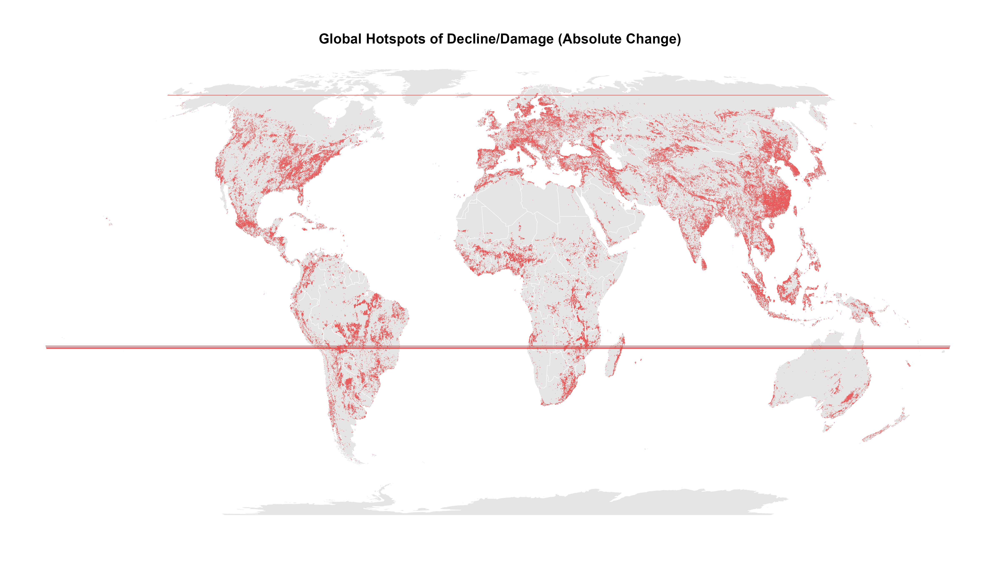
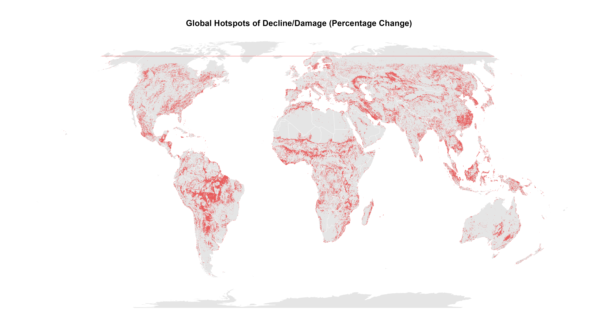
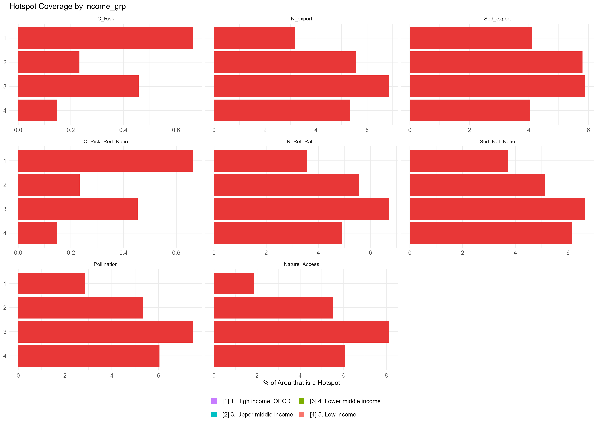
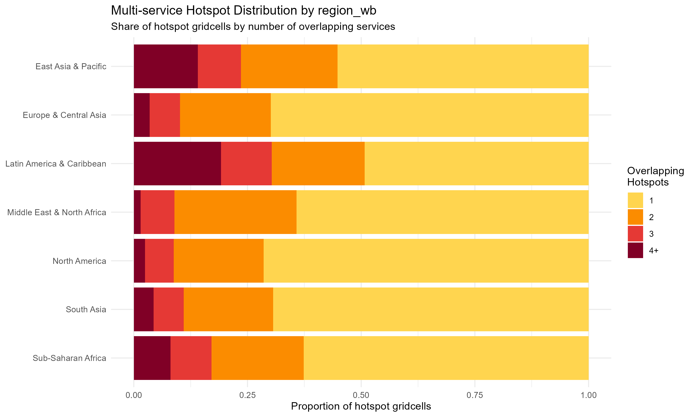
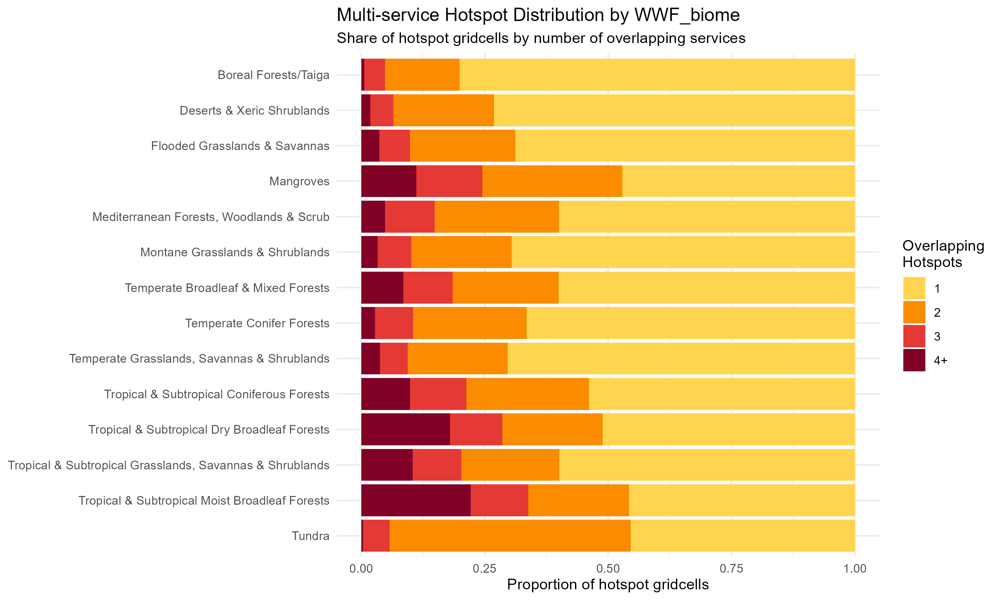
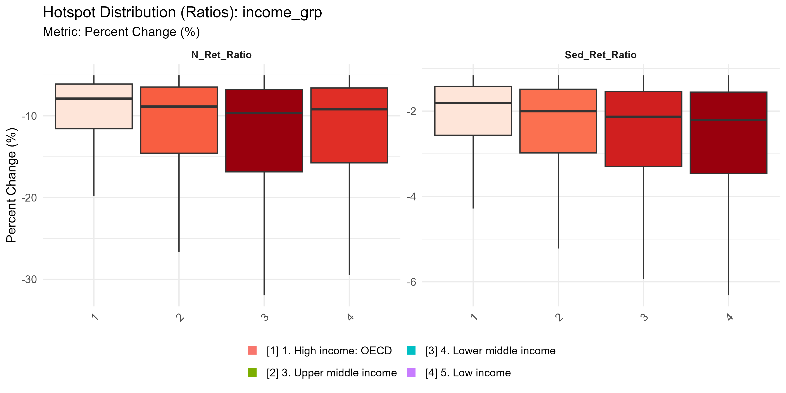

# Geographic Analysis (WHERE) {#sec-where}

Having established the global trajectories in the previous chapter, we now shift our focus to local extremes. Where is ecosystem service provision changing the most rapidly relative to local baselines?

We identify **Hotspots** as the top and bottom 5% of all 10km grid cells globally for each service, based on the Symmetric Percentage Change (SPC) metric. This approach normalizes for the vastly different baseline sizes of ecosystems across the globe, allowing us to highlight the most intense local landscape shifts.

## The Hotspot Landscape

The following maps provide a "first look" at the global distribution of these extreme changes.

### First Look: Absolute Hotspots
*(Where the largest total volumes of services were lost or gained)*

{#fig-map-abs width=100%}

### First Look: Percentage Hotspots (Intensity)
*(Where the most intense changes occurred relative to local baselines)*

{#fig-map-pct width=100%}

## Hotspot Coverage and Relative Intensity

How much of each region's land area is experiencing an ecosystem service hotspot? And is that region disproportionately burdened compared to the global average?

### Hotspot Coverage by Income Group

{#fig-cov-income width=100%}

### Hotspot Relative Intensity by Income Group
*(Values > 1 indicate a region has more hotspot area than expected given its total size)*

{#fig-rel-income width=100%}

## Compound Risk: Multi-Service Hotspots ("Hotness")

A single declining service is a concern; multiple co-occurring declines represent severe compound risk. We refer to the count of overlapping negative hotspots in a single 10km cell as its "Hotness".

### Compound Risk Map

{#fig-hotness-map width=100%}

### Hotness Distribution by World Bank Region

{#fig-hotness-wb width=100%}

### Hotness Distribution by WWF Biome

{#fig-hotness-biome width=100%}

## Hotspot Distribution Details (Boxplots)

To understand the spread of extreme values within these hotspots, we look at their distribution across different regions.

### Volumetric Services by Income Group

{#fig-box-vol width=100%}

### Coastal & Ratio Services by Income Group

{#fig-box-coastal width=100%}

{#fig-box-ratio width=100%}

## Summary Statistics

The following tables provide the exact numerical breakdown of the hotspot spatial extraction.

```{r load-tables}
#| include: false
library(readr)
library(here)
library(knitr)
source(here::here("R", "paths.R"))

# Load the area stats (intensity)
area_stats <- read_csv(
  file.path(data_dir(), "processed", "tables", "hotspot_area_stats.csv"),
  show_col_types = FALSE
)

# Load the multiservice stats (hotness)
hotness_stats <- read_csv(
  file.path(data_dir(), "processed", "tables", "hotspot_multiservice_stats.csv"),
  show_col_types = FALSE
)
```

### Hotspot Area Statistics

```{r}
#| label: tbl-area
#| echo: false
kable(head(area_stats, 10), caption = "Hotspot Area Coverage (Top 10 Rows)")
```

### Hotness Overview

```{r}
#| label: tbl-hotness
#| echo: false
kable(head(hotness_stats, 10), caption = "Compound Risk Summary (Top 10 Rows)")
```

## Key Takeaways

*(This section is reserved for the final interpretation phase. It will synthesize the core findings from the spatial distribution, intensity, and compound risk charts above.)*
