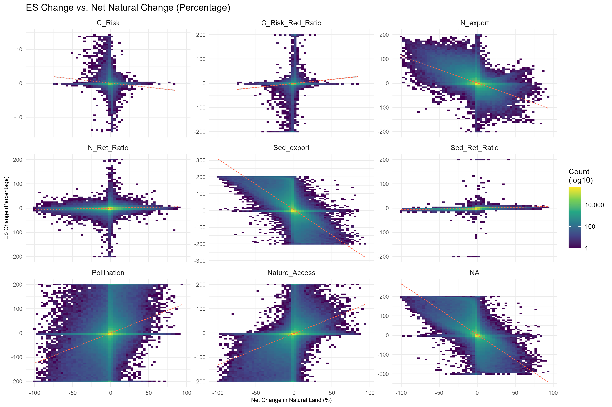
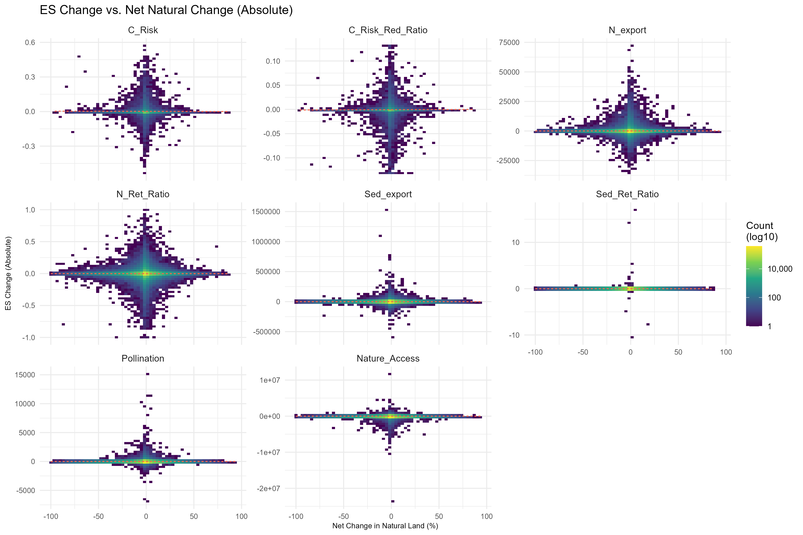

# Understanding Drivers (WHY) {#sec-why}

```{r setup}
#| include: false
library(dplyr)
library(readr)
library(here)

source(here::here("R", "paths.R"))

# Load the LCC overlap stats
lcc_pct <- read_csv(
  file.path(data_dir(), "processed", "tables", "lcc_es_hotspot_overlap_pct.csv"),
  show_col_types = FALSE
)
```

## The Attribution Gap

To explain *why* hotspots occur, we integrate Land Cover Change (LCC) metrics derived from our ESA/C3S data. Instead of simple net change, we look at the gross loss of natural land to determine how much of the ecosystem service decline is directly linked to land conversion versus underlying degradation.

### Overlap Heatmaps

The heatmaps below show what percentage of ecosystem service hotspots geographically overlap with the top 5% of land cover conversion (e.g., deforestation, urbanization).

{width=100%}

{width=100%}

### Correlation Scatterplots

The following scatterplots show the relationship between net natural land change and ecosystem service change.

{width=100%}

{width=100%}

