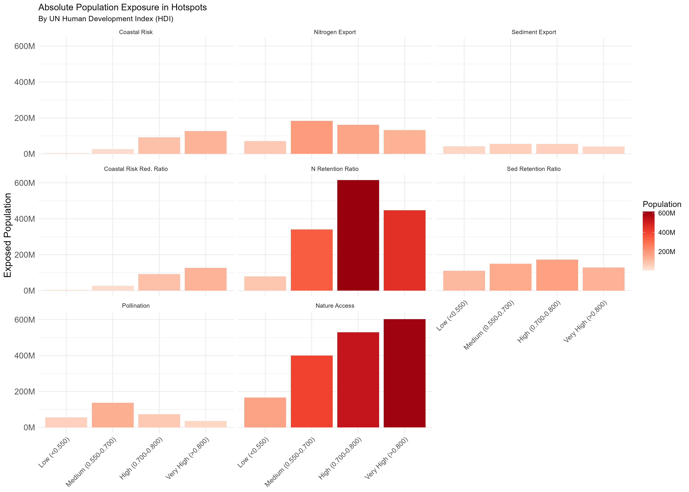
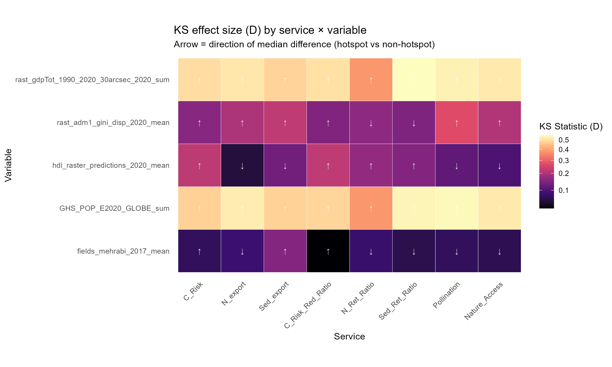

# Socioeconomic Analysis (WHO) {#sec-who}

```{r setup}
#| include: false
library(dplyr)
library(readr)
library(here)

source(here::here("R", "paths.R"))

# Load the population exposure stats
pop_exposure <- read_csv(
  file.path(data_dir(), "processed", "tables", "hotspot_pop_exposure.csv"),
  show_col_types = FALSE
)

ks_results <- read_csv(
  file.path(data_dir(), "processed", "tables", "ks_results_hot_vs_non.csv"),
  show_col_types = FALSE
)
```

## Absolute Population Exposure

How many people are directly living within the top 5% areas of ecosystem service decline? The charts below break down the exposed population by World Bank Income Group and the UN Human Development Index (HDI).

{width=100%}

{width=100%}

## Relative Socioeconomic Shift

We perform two-sample Kolmogorov-Smirnov (KS) tests to determine if the socioeconomic profiles of ecosystem service "hotspots" are statistically different from the background landscape. 

{width=100%}

{width=100%}