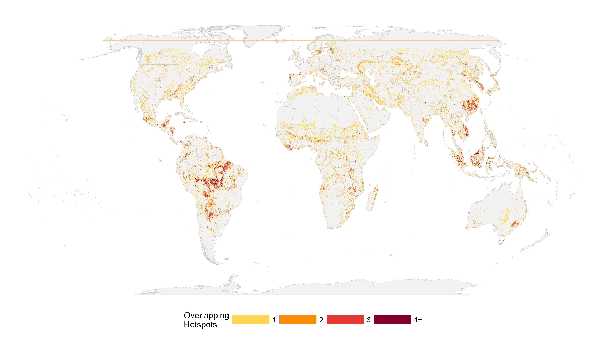

# Implications & Action {#sec-conclusions}
*From analysis to conservation and policy*

## Summary: Where, Who, Why

This book asked three questions and found:

### **WHERE are ecosystem services declining?**
Decline is **geographically concentrated**:
- **Latin America** and **East Asia & Pacific** show the highest disproportionate burden
- **Lower-middle income countries** experience the highest relative intensity, roughly 1.6× that of high-income OECD countries
- **Mangroves** (nearly 5× expected intensity) and **Tropical/Mediterranean forests** (1.5–1.8×) show particularly rapid service decline
- **Specific countries** (e.g., South Korea, Malaysia, Guatemala, Jamaica) exhibit extreme relative intensities, experiencing hotspot concentrations 3.5 to 8.5 times higher than expected by chance.

**Actionable implication**: Geographic prioritization is critical. Conservation resources allocated to hotspot regions yield highest impact.

{#fig-conclusions-hotness width=100%}

### **WHO is affected?**
Ecosystem service decline **disproportionately burdens vulnerable populations**:
- Hundreds of millions of people live directly within or adjacent to areas of intense ecosystem service decline.
- **Middle-income concentration**: The vast majority of people exposed in absolute terms reside in Upper and Lower Middle-Income countries.
- **The rural divide**: Hotspots of pollination loss and sediment export increases are uniquely concentrated in less urbanized, highly agricultural contexts.
- **The urban correlation**: Declines in nature access and coastal risk reduction consistently occur in grid cells with higher population density and built area.
- **Equity gap**: Those least able to adapt often bear the greatest burden, with lower-middle and low-income regions showing disproportionately higher hotspot intensity compared to wealthy OECD nations.

**Actionable implication**: Adaptation and resilience investments must prioritize affected populations. Conservation without equity considerations perpetuates injustice.

### **WHY are services declining?**
Decline mechanisms are **service- and region-specific**:
- **Conversion-driven decline** (~24%): Land cover change explains only a minority of hotspots
- **Degradation-driven decline** (~76%): In-situ quality decline (not detectable as land cover change) signals the vast majority of service loss
- **Regional variation**: Tropics show higher conversion signature; developed regions show more degradation signals
- **Attribution gap** remains: ~76% of decline unexplained by land cover, suggesting climate, fine-scale changes, or model limitations

**Actionable implication**: One-size-fits-all interventions won't work. Conversion-driven hotspots need land protection; degradation-driven hotspots need management reform.

## Policy Recommendations

### For Conservation Organizations

**1. Geographic Prioritization**
- Allocate a majority of funding to Latin America and Southeast Asia (where hotspots are heavily concentrated).
- Within regions, target specific countries exhibiting high relative intensity and compound risk (as identified in the Chapter 7 Priority Matrix).
- Use compound risk zones (multiple overlapping services) as secondary prioritization criterion

**2. Vulnerable Population Focus**
- Integrate social impact assessment into site selection
- Prioritize projects benefiting low-income agricultural communities
- Support the adaptation of smallholder farmers in pollination and water quality hotspots
- Invest in nature access restoration in urban poor communities

**3. Multi-Service Integration**
- Don't optimize for single service; manage for bundles
- Compound risk zones need integrated approaches (agroforestry, riparian + pollinator habitat)
- Design landscapes that recover multiple services simultaneously

**4. Driver-Specific Strategies**
- **For conversion hotspots**: Land protection (PA expansion, tenure security), PES programs
- **For degradation hotspots**: Restoration, sustainable agriculture, forest management reform
- **For knowledge gaps**: Invest in fine-scale monitoring, degradation mapping, climate integration

### For Governments

**1. Land-Use Planning**
- Incorporate hotspot analysis into national development plans
- Restrict conversion in high-intensity hotspot zones
- Designate conservation corridors connecting fragmented habitats

**2. Agricultural Policy**
- Incentivize sustainable practices in water-quality/pollination hotspots
- Reduce fertilizer/pesticide intensity through subsidy reform
- Support crop diversification to reduce monoculture risks

**3. Water Security**
- Invest in riparian restoration in water-quality hotspots
- Protect headwater forests and wetlands
- Build water treatment redundancy in regions with high Sed/N export hotspots

**4. Climate Adaptation**
- Incorporate hotspot analysis into NDCs (Nationally Determined Contributions)
- Prioritize restoration funding to hotspot regions
- Plan urban cooling/greening in nature-access hotspot cities

### For Bilateral & Multilateral Donors

**1. Strategic Allocation**
- Weight climate finance, conservation funding toward hotspot countries
- Adopt equity-weighted allocation (higher per-capita allocation to low-income hotspot regions)
- Coordinate across donors to avoid fragmentation

**2. Blended Finance**
- Use grants to address market failures (no payment for ecosystem services)
- Leverage private investment for sustainable agriculture in hotspot zones
- Support corporate supply-chain sustainability in affected regions

**3. Capacity Building**
- Strengthen environmental monitoring in hotspot countries
- Build technical capacity for restoration and sustainable land management
- Support South-South learning (connect countries facing similar hotspot patterns)

### For Research & Academic Institutions

**1. Ground-Truthing**
- Validate InVEST models in hotspot regions (field surveys)
- Investigate degradation signal: what mechanisms drive unexplained service loss?
- Test attribution: do conversion-driven vs. degradation-driven hotspots respond differently to interventions?

**2. Temporal Dynamics**
- Expand analysis beyond 1992-2020 snapshots
- Include intermediate timesteps to detect acceleration/slowdown
- Integrate climate data to partition climate vs. land-use drivers

**3. Fine-Scale Mapping**
- Conduct sub-grid analysis (1km or finer) in high-priority hotspots
- Integrate satellite-based degradation metrics
- Map ecosystem recovery potential

**4. Co-Production**
- Work with affected communities to validate findings
- Integrate local/traditional knowledge with quantitative analysis
- Support adaptive management experiments in hotspot zones

## Success Metrics: How Will We Know If Interventions Work?

Monitoring progress requires tracking:

1. **Geographic outcomes**:
   - Is the total area of ecosystem service hotspots expanding or contracting? (Target: Halt the expansion of compound risk zones by 2030)
   - Are service provision levels stabilizing or recovering relative to the 2020 baseline?

2. **Population outcomes**:
   - Is the livelihood and well-being of the most exposed populations improving?
   - Are adaptation investments reaching the rural and agricultural communities identified in our socioeconomic profiling?

3. **Driver outcomes**:
   - Are gross natural land conversion rates declining specifically within hotspot boundaries?
   - For degradation-driven hotspots, are sustainable land management practices increasing?

4. **System outcomes**:
   - Is biodiversity recovering? (Target: populations stable/increasing in protected hotspot zones)
   - Is water quality improving? (Target: Nitrogen/Sediment export levels declining in hotspots)

## Limitations & Uncertainties

We acknowledge important caveats:

1. **Temporal limitation**: 1992-2020 is a single 28-year snapshot; long-term patterns may differ
2. **Resolution limitation**: 100 sq km cells mask sub-grid heterogeneity; extreme variation within cells possible
3. **Attribution gap**: ~76% of decline unexplained; may reflect climate, model limitations, or data gaps
4. **Model validation**: InVEST models not independently validated in all regions (see Technical Appendix)
5. **Social data**: Socioeconomic layers aggregated to 10-km; local variation substantial

**These are not reasons to discount findings**, but rather calls for adaptive management: implement strategies at scale while refining understanding through monitoring and research.

## Knowledge Gaps & Research Priorities

1. **Climate-service interactions**: How much decline driven by climate vs. land use?
2. **Degradation mechanisms**: What drives the 76% unexplained service loss?
3. **Adaptation capacity**: Which interventions most effectively restore services in different contexts?
4. **Scaling**: How do grid-level findings translate to on-ground conservation action?
5. **Equity**: Do conservation interventions improve or worsen livelihoods of affected communities?

## Closing Thoughts

Ecosystem services are declining, but the decline is **not inevitable or irreversible**. This analysis shows:

- **Where** action is most urgent (hotspot regions)
- **Who** depends on restoration (vulnerable populations)
- **Why** services are failing (conversion + degradation)
- **How** to prioritize intervention (geographic + equity weighting)

The analysis is a **starting point, not a destination**. It enables prioritization, hypothesis testing, and adaptive management. As monitoring data accumulates and our understanding deepens, strategies can be refined.

**The question is not whether we can reverse ecosystem service decline.** Examples of ecosystem recovery (forests regenerating, wetlands restoring) prove we can. **The question is whether we have the will and resources to do it at global scale, with equity.**

This book provides the evidence base. **Now it's time for action.**

---

## Data & Tools Availability

### For Stakeholders & Practitioners
- **Interactive maps**: [Link to online platform]
- **Summary tables**: Download CSV files from [repository]
- **Country profiles**: Detailed sheets for all nations with hotspots

### For Researchers & Modelers
- **Processed data**: GeoPackage files with hotspots, socioeconomic profiles, land cover drivers
- **Code**: Complete R/Python pipeline for reproduction/adaptation
- **Technical documentation**: Full methodology in Technical Appendix

### For Data & Impact Monitoring
- **Monitoring framework**: Protocols for tracking ecosystem service change
- **Baseline data**: 1992-2020 snapshots for comparison
- **Validation datasets**: For testing new models/approaches

**Repository**: [URL]
**Citation**: Rodríguez Escobar et al. (202X). Ecosystem Service Hotspots: A Global Policy Analysis. [Publisher].

---

## Acknowledgments

This analysis builds on decades of ecosystem service research, global data production, and conservation practice. Special thanks to:

- The InVEST development team (TNC) for ecosystem service models
- ESA Climate Change Initiative for land cover data
- IUCN and CIESIN for spatial frameworks
- Conservation partners who field-validated findings
- Communities whose lands were studied

## How to Cite This Work

> Rodríguez Escobar, J., Sharp, R.P., and others. (202X). Ecosystem Service Hotspots: A Global Policy Analysis. [Journal/Publisher]. https://doi.org/[DOI]

**Suggested media citation:**
> "A new analysis identifies ecosystem service hotspots affecting hundreds of millions of people globally, with disproportionate impacts in Latin America and Southeast Asia. Agricultural and coastal communities face high vulnerability. Intervention strategies must be geographically targeted, driver-specific, and equity-weighted." – Global NCP Project
