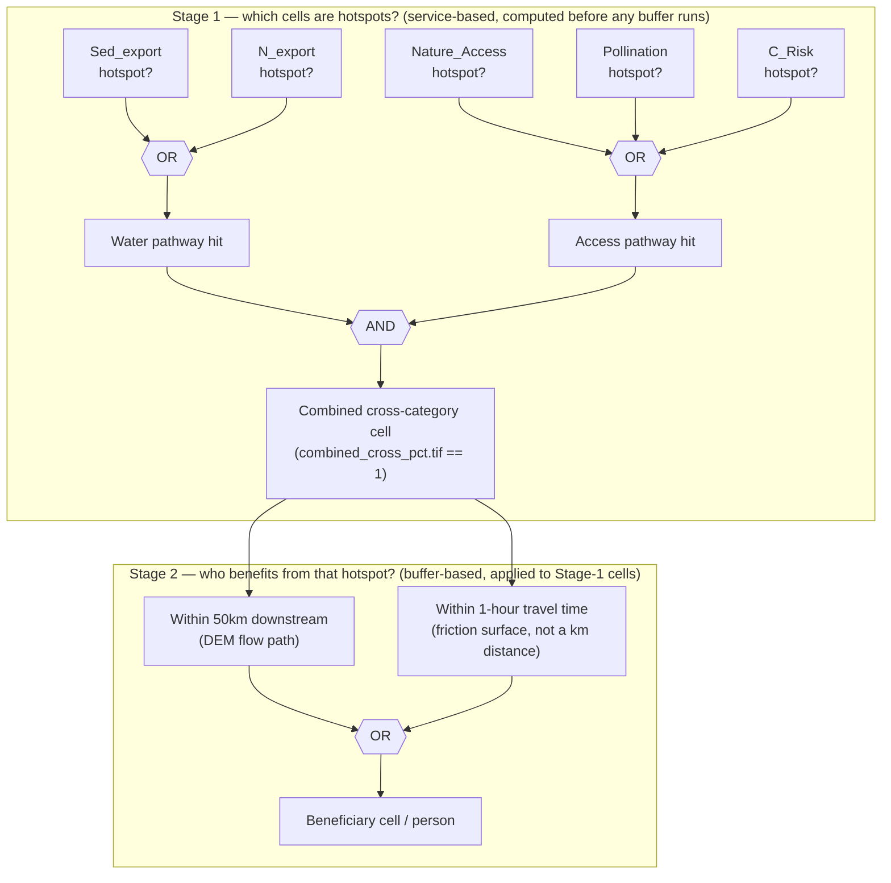

The shared folder (`Global NCP Time Series > 10km Grid Analysis > hotspots_rasters/`) originally
had files from two different, unrelated batches sitting side by side with similar names, which
caused real confusion about which files were used for the beneficiary rerun. Resolved as of
2026-08-06 (see below) — kept as a reference for what's in that folder and why.

## The two batches in that folder

**Jul 28 batch — the current, correct 5-service hotspot redesign. This is what the beneficiary rerun used.**

| File | What it is |
|---|---|
| `hotspot_count_pct.tif` / `hotspot_count_abs.tif` | Total count (1-5) of the 5 kept services for which a cell is a hotspot |
| `count_water_pct.tif` / `count_water_abs.tif` | Count (0-2) of water services (Nitrogen Export, Sediment Export) for which a cell is a hotspot. "Water overlap hotspot" = value >= 1 |
| `count_access_pct.tif` / `count_access_abs.tif` | Count (0-3) of access-type services (Nature Access, Pollination, Coastal Risk) for which a cell is a hotspot. "Access overlap hotspot" = value >= 1 |
| `combined_cross_pct.tif` / `combined_cross_abs.tif` | 1 = hotspot for at least one water service **and** at least one access-type service simultaneously; 0 = hotspot cell that doesn't meet that condition (water-only or access-only) |

All 8: 10km resolution, EPSG:8857 (Equal Earth), Byte type, **nodata = 255** (not 0 — a raster
value of 0 is a real, meaningful "hotspot cell, but not for this category," not "no data").

**May 27 batch — moved to `hotspots_rasters/single_service_hotspot_rasters/` (2026-08-06).**
`Sed_export_pct.tif`, `N_Ret_Ratio_pct.tif`, `N_export_pct.tif`, and similar single-service files
are leftover from the *previous* 8-service definition (before Nitrogen/Sediment Retention Ratio
and Coastal Risk Reduction Ratio were dropped). They predate the redesign the beneficiary rerun
is for — moved out of the main folder into their own subfolder so they can't be confused with the
current batch again.

## `pct` vs `abs` — RESOLVED

Both metrics were originally uploaded on Jul 28 in the same folder, with nothing marking one as
"the one to use" — a real gap on my end. Verified directly against all 7 of Rich's
actual analysis configs (`data/jeronimo_2026_07_beneficiaries_analysis_configs/*.yaml`), not just
his chat summary:

| Category | Raster actually used |
|---|---|
| Water overlap | `count_water_pct.tif` |
| Access overlap | `count_access_pct.tif` |
| Combined cross-category | `combined_cross_pct.tif` |
| Hotspot count, 1+ through 5+ (all 5 tiers) | `hotspot_count_pct_2026_07_29_18_49_00.tif` |

**Every category used `pct`. None used `abs`.** This matches the intended convention (pct for the
main text, abs as an annex/supplement benchmark) and matches what this repo's own percent-area
analysis already used — everything is internally consistent, no rework needed.

- **`pct`** = hotspots defined by Symmetric Percentage Change (relative change, 1992-2020) — the
  primary metric used throughout the paper and book.
- **`abs`** = hotspots defined by absolute change — secondary, kept for consistency with the
  existing 8-service convention, goes in the supplement/annex, not the main text.

## Numbers to cross-check against (pct metric)

189,927 total 5-service hotspot cells; 110,756 water-overlap; 127,172 access-overlap; 48,001
combined cross-category. (abs metric, for reference: 191,759 / 111,436 / 125,726 / 45,403 — close
but not identical, as expected.)

## Synthesis matrix — which categories exist, and which Becky's Phase 4 report actually used

The 5 tracked services split into two pathway groups:

| Service | Pathway |
|---|---|
| N_export, Sed_export | Water |
| Nature_Access, Pollination, C_Risk | Access |

Two **independent** axes of "how bad," not one — this is the source of most confusion:

**Axis A — which pathway(s)** (buffer = only that pathway's reach, except combined, which gets both):

| Category | Definition | Buffer applied |
|---|---|---|
| Water-overlap | Hotspot in ≥1 of the 2 water services | Downstream 50km only |
| Access-overlap | Hotspot in ≥1 of the 3 access services | Travel-time only |
| Combined cross-category | Water-overlap **and** access-overlap at the same cell | Downstream + travel-time (union) |

**Axis B — how many services total**, regardless of pathway (0–5 of the 5 services hit at once):

| Tier | Definition | Buffer applied |
|---|---|---|
| 1+ / 2+ / 3+ / 4+ / 5 (all) | Hotspot in ≥N of all 5 services | Downstream + travel-time (union), all tiers |

### Two-stage logic, worked example (combined cross-category)

Easy to conflate "which services" with "which buffer" since both stages have their own AND/OR —
they're independent, applied one after the other, not three separate conditions:

Stage 1 is our own hotspot-extraction output (`extract_hotspots_5service.R`), finished before Rich's
buffer tool ever runs. Stage 2 is entirely Rich's tool, applied only to the cells Stage 1 already
flagged. The water-overlap and access-overlap categories are just Stage 1 alone, using only their
own single buffer type in Stage 2 (no OR needed — only one input). The 1-5 tiers replace Stage 1's
water/access logic with "≥N of all 5 services," but keep the same Stage-2 downstream-OR-travel-time
union.

**Becky's Phase 4 ask (`docs/hotspot_redesign_plan.md`, Phase 4 section) tested exactly 3 of these
8 categories**: `combined_cross_category`, `tier_3plus`, `tier_4plus` — the three she named. Water-
overlap, access-overlap, and tiers 1+/2+/5+ exist and were zonal-extracted this week too (for
validation, and for country-level population cuts — see `docs/applications/
colombia_capability_portfolio.md`), but were not part of what went to Becky.

### Raw inputs, sourced directly from Rich's 8 configs (`data/jeronimo_2026_07_beneficiaries_analysis_configs/*.yaml`)

Shared across all 8 configs, unchanged between them:

| Input | Value | Note |
|---|---|---|
| Pixel size | 0.008333333° (30 arcsec) | matches the source hotspot rasters |
| Population source | `landscan-global-2023.tif` (LandScan Global 2023) | **different dataset** from `GHS_POP_E2020_GLOBE_sum`, the population variable used in the Phase 4 HDI/Gini/GDP test — two separate population products across the two analyses, not a duplicate reference |
| Travel-time source | `friction_surface_2019_...tif` | global friction surface |
| DEM | `astgtm_compressed.tif` (ASTER GDEM) | confirms the downstream mask is flow-path-based, not radial |
| Subwatershed layer | `merged_lev06.shp` (HydroSHEDS level 6) | same confirmation |
| `buffer_size_m: 5000` | present in every config | not referenced by either mask's own params — unconfirmed what it does, not guessed at |

Per-folder condition raster, threshold expression, and which masks were actually computed:

| # | Folder | Condition raster | Expression | Masks |
|---|---|---|---|---|
| 1 | `water_overlap_downstream` | `count_water_pct.tif` | `value > 0` | downstream_50k only |
| 2 | `access_overlap_travel_time` | `count_access_pct.tif` | `value > 0` | travel-time only |
| 3 | `combined_cross_category` | `combined_cross_pct.tif` | `value == 1` | both, OR'd |
| 4 | `hotspot_count_1plus` | `hotspot_count_pct_...tif` | `value > 0` | both, OR'd |
| 5 | `hotspot_count_2plus` | same | `value > 1` | both, OR'd |
| 6 | `hotspot_count_3plus` | same | `value > 2` | both, OR'd |
| 7 | `hotspot_count_4plus` | same | `value > 3` | both, OR'd |
| 8 | `hotspot_count_5plus` | same | `value > 4` | both, OR'd |

**Which 3 went into Becky's Phase 4 report, and why**: folders 3, 6, 7 — `combined_cross_category`,
`hotspot_count_3plus`, `hotspot_count_4plus`. Selection reason is exactly one thing: those are the
three categories Becky named in her Slack ask, quoted at the top of the report. Nothing else
determined it.

**Union vs. intersection — applies to 6 of the 8 folders, not just combined-cross.** Folders 1 and 2
only ever have one mask each, so "union" is trivially identical to that single mask — no real
question there. Folders 3 and 4–8 all combine two *different* masks (downstream + travel-time) via
OR, which means the same question applies to all of them: union counts anyone reached by *either*
buffer, while intersection (AND) would count only people reached by *both* — a materially smaller,
stricter population. Checked empirically for combined-cross (2026-08-07): intersection area is
only 43% the size of the union area (10.28% of land vs. 23.65% for the union) — not a rounding
difference. Not yet checked for the 3+/4+ tiers used in the actual report; worth doing before
finalizing how "people reached" is described anywhere external.

**Standing caution, confirmed the hard way this session**: don't assume two rasters that describe
"the same" analysis share pixel dimensions. `full_raster_extent_downstream_50k_coverage.tif` has
15,881 rows; the travel-time and union files in the same folder have 16,113. Comparing them by raw
pixel index instead of geographic bounds silently reads two different latitudes as "the same" row —
same failure family as this project's known vector/grid-ID bugs, just showing up in raster form.
Any raster-to-raster comparison in this project needs `rasterio.windows.from_bounds`-style
alignment, never index assumptions — cell/pixel counts can vary between files even when the actual
geography doesn't.

## Folder cleanup

Done (2026-08-06): the May 27 single-service files were moved into
`hotspots_rasters/single_service_hotspot_rasters/`, out of the main folder, so a future handoff
doesn't hit the same ambiguity.
