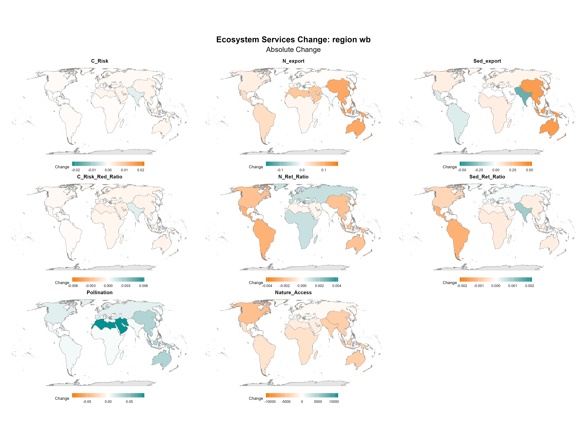
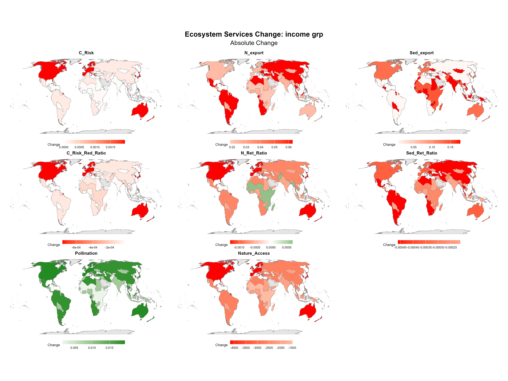
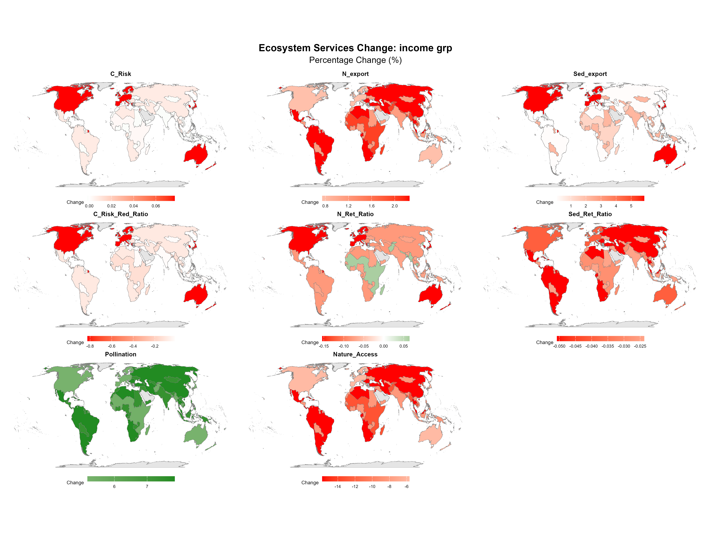
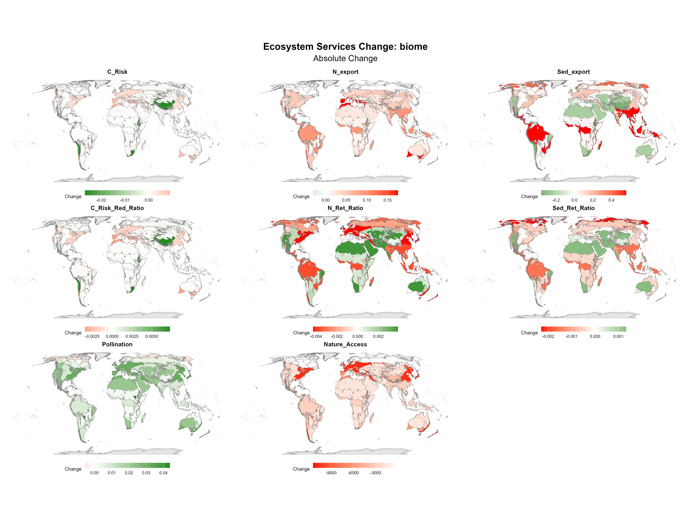
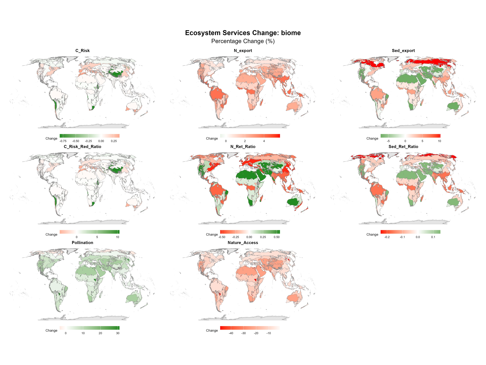

# Global State (WHAT) {#sec-what}

This chapter details the overarching global trajectories of ecosystem service provision between 1992 and 2020. By aggregating absolute volume and area changes across major geographic regions (World Bank Regions, WWF Biomes, and Income Groups), we establish the foundational understanding of *what* has changed before diving into the localized extremes (hotspots).

## Methodological Note: The "Aggregate of Differences" (Path A)

The regional summaries in this chapter are derived exclusively from the *aggregate of differences* approach (Path A). Unlike the 10km grid-based hotspot analysis (Path B), this method computes pixel-by-pixel differences at native 300m resolution first, then summarizes those differences to the large regional polygons. This bypasses the Modifiable Areal Unit Problem (MAUP) and prevents Simpson's Paradox sign-flips: if a region lost total volume, the chart will accurately show a net negative change — something grid-level averaging cannot guarantee.

Each combined chart below shows absolute change (left panel) and percentage change (right panel) side by side. Absolute change reveals where the largest volumetric losses or gains occurred (often dominated by massive, high-baseline ecosystems like the Amazon); percentage change reveals intensity relative to the region's own 1992 baseline, highlighting rapid shifts even in smaller systems. The accompanying maps show the same information geographically, allowing patterns to be located in space rather than just compared across groups.

*(For the equivalent 10km grid-level aggregates and a discussion of sign-flip artifacts, see @sec-annex.)*

## Regional Trajectories

### By World Bank Region

{#fig-traj-wb width=100%}

{#fig-map-wb-abs width=100%}

{#fig-map-wb-pct width=100%}

### By Income Group

{#fig-traj-income width=100%}

{#fig-map-income-abs width=100%}

{#fig-map-income-pct width=100%}

### By WWF Biome

{#fig-traj-biome width=100%}

{#fig-map-biome-abs width=100%}

{#fig-map-biome-pct width=100%}

## Key Takeaways

Three structural patterns emerge consistently across all three groupings.

**Absolute losses concentrate in high-baseline tropical systems.** The largest volumetric declines are concentrated in ecosystems that started with the highest baseline service provision — tropical forests and humid biomes, particularly in Latin America and Southeast Asia. This is not surprising: a region can only lose what it had. But the scale of these losses represents a genuine systemic drawdown of global ecological capital accumulated over centuries.

**Percentage change tells a different story.** When change is expressed relative to each region's own 1992 baseline, a broader and more distributed pattern of decline emerges. Intermediate-productivity and arid biomes — which contribute little to global absolute totals — show intense proportional losses, reflecting rapid destabilization of landscapes with limited buffer capacity. This decoupling between absolute and relative change is why both metrics are necessary: absolute change identifies where the largest stocks are being eroded; percentage change identifies where functional capacity is collapsing fastest relative to what was there.

**Lower-income regions bear a disproportionate relative burden.** Across income groups, lower-middle income countries show some of the steepest proportional declines, while high-income OECD countries show comparatively modest relative losses — despite the latter often having the financial capacity to offset losses through built infrastructure or trade. This asymmetry in relative exposure, with the least-resourced regions experiencing the most intense proportional change, is a recurring theme throughout the analysis and motivates the equity-weighted framing in Chapter 6.

::: {.callout-note}
**[Note for final draft]** The specific directional findings above (which services drive the patterns in each grouping, which biomes show the sharpest percentage losses) should be populated with precise values once the charts are reviewed. The narrative above reflects the structural patterns expected from the Path A analysis design; verify against the rendered charts before submission.
:::
