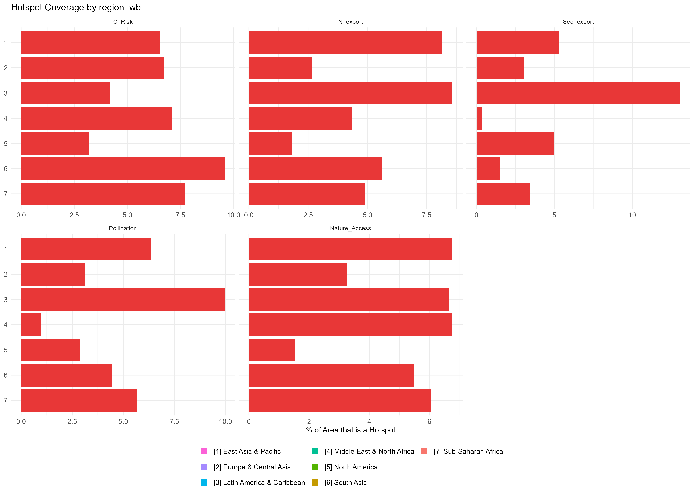
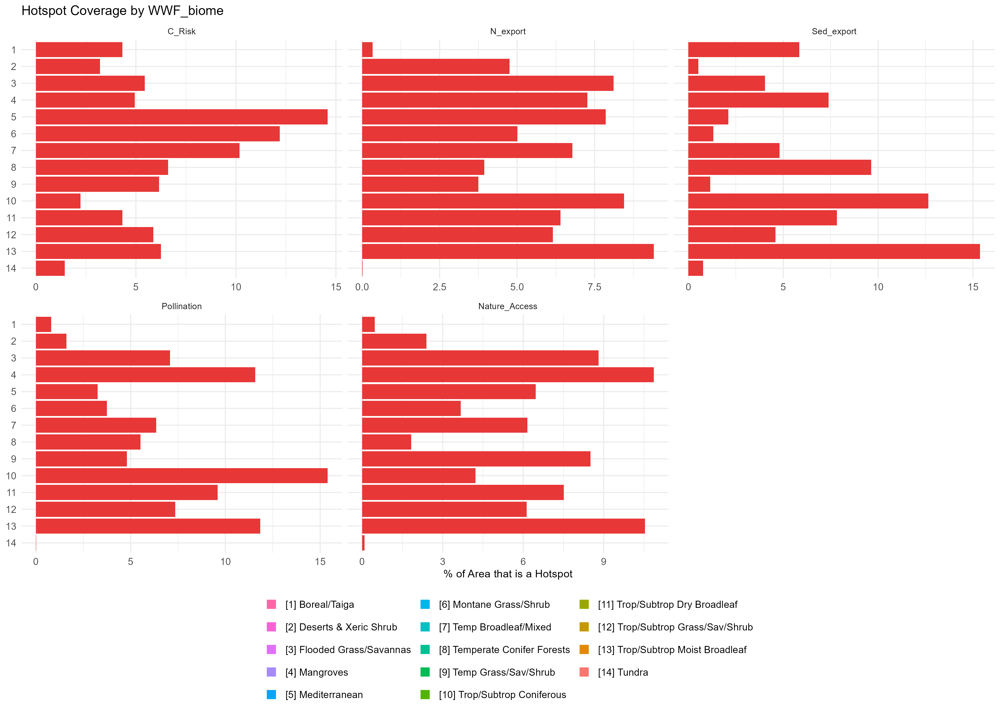
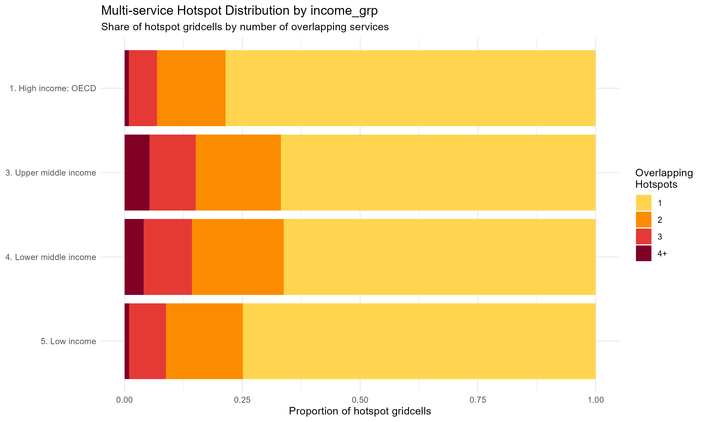
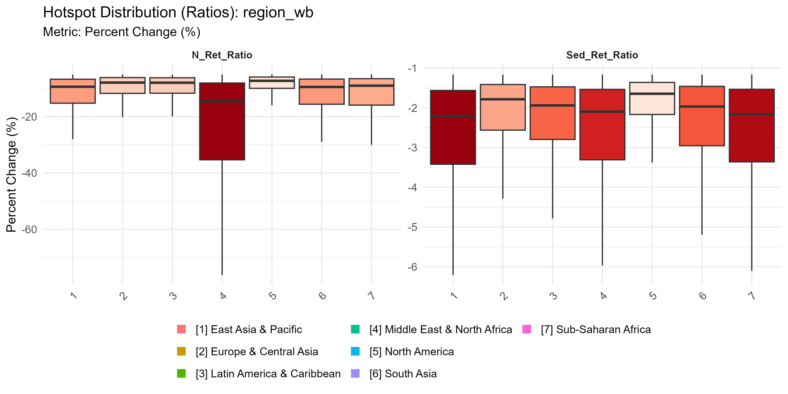
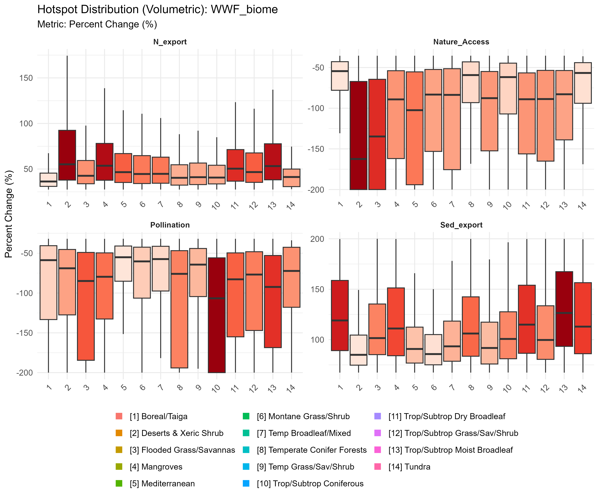
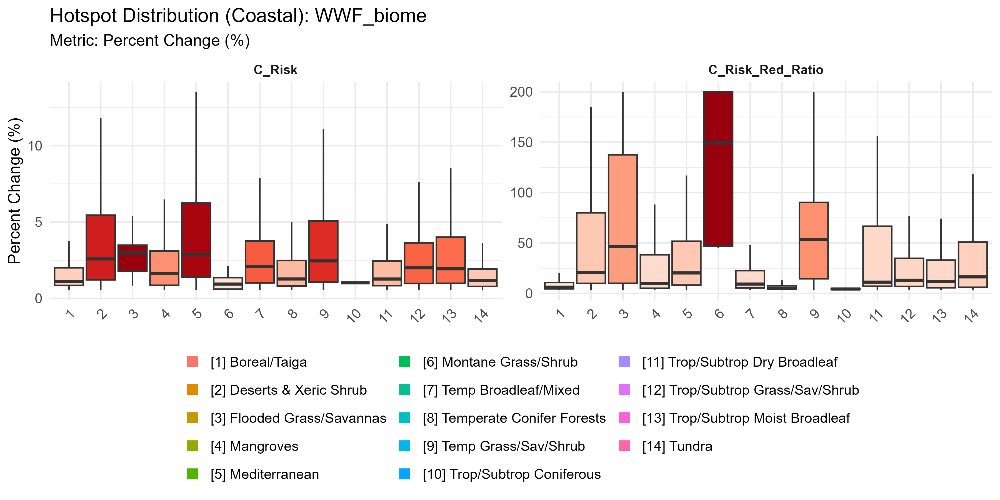
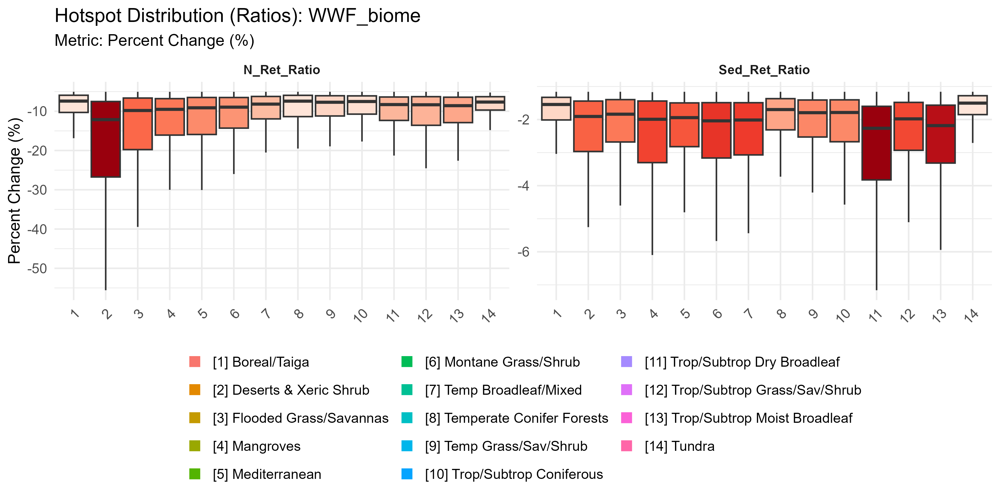

# Geographic Analysis (WHERE) {#sec-where}

Building on the global trajectories in the previous chapter, focus now shifts to *where* ecosystem service provision is changing most intensely. Rather than asking where the largest total volumes were lost (which would simply highlight the world's most expansive ecosystems), we ask: where is change most severe *relative to the local baseline*?

We identify **Hotspots** as the top 5% of all 10km grid cells globally by rank for each service, based on the magnitude of detrimental or beneficial Symmetric Percentage Change (SPC). By using a rank-based relative threshold, this approach places a small degraded grassland on equal footing with a large forest — any cell that experiences the most intense local change qualifies, regardless of its absolute service volume.

::: {.callout-note}
The absolute hotspot map — where the largest *total volumes* of services changed — is not shown here because it is dominated by a handful of high-baseline ecosystems (Amazon, Congo Basin, Southeast Asian forests). This size-bias is precisely what SPC was designed to overcome; showing that map would contradict the core analytical choice.
:::

## Global Hotspot Distribution

The map below shows the global distribution of percentage-based hotspots — the cells experiencing the most intense relative shifts in each service between 1992 and 2020.

{#fig-map-pct width=100%}

## Hotspot Coverage and Relative Intensity

How much of each region's land area falls within a hotspot? And does that region carry a disproportionate burden relative to its global share of land area? Values greater than 1.0 in the relative intensity charts indicate a region is hosting more hotspot area than would be expected by chance given its size.

::: {.panel-tabset}

### By Income Group

{width=100%}

{width=100%}

### By World Bank Region

{width=100%}

{width=100%}

### By WWF Biome

{width=100%}

{width=100%}

:::

## Compound Risk: Multi-Service Hotspots

A single declining service is a concern; multiple co-occurring declines in the same grid cell represent severe compound risk — populations that lose several services simultaneously face compounding adaptive challenges. We refer to the count of overlapping negative hotspots in a single 10km cell as its **Hotness**.

### Global Compound Risk Map

{#fig-hotness-map width=100%}

### Hotness Distribution by Region

::: {.panel-tabset}

### By World Bank Region

{#fig-hotness-wb width=100%}

### By Income Group

{#fig-hotness-income width=100%}

### By WWF Biome

{#fig-hotness-biome width=100%}

:::

## Hotspot Magnitude by Service Type

The previous section established *where* hotspots are concentrated and which groups bear a disproportionate share. This section asks a complementary question: within those hotspot cells, how severe is the change? A region can have many hotspots that are moderately degraded, or few hotspots that are severely degraded — the geographic distribution alone cannot distinguish these cases.

::: {.callout-note}
**How to read these charts**

Each chart shows the distribution of Symmetric Percentage Change (SPC) values **for hotspot cells only** (the top 5% most intense globally, per service) within each analytical group.

- **The box** spans the interquartile range (IQR: 25th–75th percentile of hotspot intensities within the group)
- **The median line** = the typical intensity of a hotspot cell in that group
- **Whiskers** extend to 1.5× IQR; points beyond are individual outlier cells
- **Color intensity** scales with median severity — darker red = more severe change
- **Wide box** = high variability: some cells near the top-5% threshold, others far beyond it; hotspot severity is not uniform within the group
- **Narrow box** = hotspot intensities are consistently high throughout the group
- **Important**: all cells shown are already in the global top 5% — even the "lightest" boxes represent severe change relative to the rest of the world

Direction of change differs by service: negative SPC = declining provision (worse for Pollination, Nature Access, retention ratios); positive SPC = increasing export/risk (worse for N_export, Sed_export, C_Risk).
:::

::: {.panel-tabset}

### By Income Group

![Volumetric services (N/Sed export, Pollination, Nature Access) — SPC distribution of hotspot cells by income group. Lower-middle income [3] shows the most intense and variable hotspots for Nature Access and Pollination, consistent with the KS typology finding that these services co-occur with lower HDI and higher inequality.](../../../outputs/plots/boxplots_unified/income_grp/boxplots_volumetric_pct.png){width=100%}

{width=100%}

{width=100%}

### By World Bank Region

![Volumetric services — SPC distribution of hotspot cells by World Bank region. Latin America & Caribbean [3] shows the widest and most intense boxes for Nature Access and Pollination — hotspot severity is both high and highly variable, with some cells approaching complete functional loss (SPC near −200%).](../../../outputs/plots/boxplots_unified/region_wb/boxplots_volumetric_pct.png){width=100%}

{width=100%}

{width=100%}

### By WWF Biome

{width=100%}

{width=100%}

{width=100%}

:::

## Summary Statistics

Each table below is fully filterable and sortable:

- **Filter**: type in the box below any column header — partial match, case-insensitive
- **Compare multiple values**: use `|` as OR in any text column — e.g. `Brazil|Indonesia` shows both; `Mangrov|Flooded` shows both biomes; `Pollin|C_Risk` shows two services
- **Sort**: click any column header to toggle ascending / descending; numeric columns sort numerically
- **Combine**: filters and sort stack — e.g. `Brazil|Indonesia` in Country + `Mangroves` in Biome + sort Relative Intensity ↓ compares both countries' Mangrove burden directly
- **Page size**: selector at bottom-left — 10 / 25 / 50 / 100 rows

```{r load-tables}
#| include: false
#| cache: true
library(readr)
library(dplyr)
library(tidyr)
library(sf)
library(knitr)
source("../../../R/paths.R")

has_reactable <- requireNamespace("reactable", quietly = TRUE)
if (has_reactable) {
  library(reactable)
  # OR-filter: separate terms with | (e.g. "Brazil|Indonesia" matches either)
  .or_filter <- JS("function(rows, columnId, filterValue) {
    const terms = filterValue.split('|').map(t => t.trim().toLowerCase()).filter(t => t.length > 0);
    if (terms.length === 0) return rows;
    return rows.filter(row => {
      const val = String(row.values[columnId] || '').toLowerCase();
      return terms.some(t => val.includes(t));
    });
  }")
}

# ── one-dimensional summary tables ──────────────────────────────────────────
area_stats <- read_csv(
  file.path(data_dir(), "processed", "tables", "hotspot_area_stats.csv"),
  show_col_types = FALSE
)

hotness_stats <- read_csv(
  file.path(data_dir(), "processed", "tables", "hotspot_multiservice_stats.csv"),
  show_col_types = FALSE
)

area_tbl <- area_stats %>%
  select(grouping_var, service, group, n_total, n_hot, pct_area, pct_share, expected_share, relative_intensity) %>%
  rename(
    Grouping                 = grouping_var,
    Service                  = service,
    `Geographic Unit`        = group,
    `Total Cells`            = n_total,
    `Hotspot Cells`          = n_hot,
    `% Hotspot Area`         = pct_area,
    `% Global Hotspot Share` = pct_share,
    `Expected Share (%)`     = expected_share,
    `Relative Intensity`     = relative_intensity
  ) %>%
  mutate(across(where(is.double), ~ round(.x, 2))) %>%
  arrange(desc(`Relative Intensity`))

hotness_tbl <- hotness_stats %>%
  select(grouping, group, mean_hotspots, pct_multi, n_pixels) %>%
  rename(
    Grouping                    = grouping,
    `Geographic Unit`           = group,
    `Mean Overlapping Services` = mean_hotspots,
    `% Multi-Service Cells`     = pct_multi,
    `Total Cells`               = n_pixels
  ) %>%
  mutate(across(where(is.double), ~ round(.x, 3))) %>%
  arrange(desc(`Mean Overlapping Services`))

# ── cross-dimensional table: country × biome × service ──────────────────────
.svc_cols <- c("C_Risk", "C_Risk_Red_Ratio", "Pollination", "Nature_Access",
               "Sed_export", "N_export", "N_Ret_Ratio", "Sed_Ret_Ratio")

.sql <- paste0(
  "SELECT grid_fid, nev_name, WWF_biome, region_wb, income_grp, ",
  paste(.svc_cols, collapse = ", "),
  " FROM hotspots_global_pct"
)

.gpkg <- file.path(data_dir(), "processed", "hotspots", "pct", "global",
                   "hotspots_global_pct.gpkg")

cells <- st_read(.gpkg, query = .sql, quiet = TRUE) %>%
  st_drop_geometry()

# pivot to long: one row per cell × service
cells_long <- cells %>%
  pivot_longer(cols = all_of(.svc_cols), names_to = "Service", values_to = "is_hot") %>%
  mutate(is_hot = as.integer(!is.na(is_hot) & is_hot > 0))

# global totals per service (denominator for relative intensity)
.global <- cells_long %>%
  group_by(Service) %>%
  summarise(global_n_hot   = sum(is_hot),
            global_n_total = n(), .groups = "drop")

cross_tbl <- cells_long %>%
  group_by(Country = nev_name, Biome = WWF_biome, `WB Region` = region_wb,
           `Income Group` = income_grp, Service) %>%
  summarise(n_hot   = sum(is_hot),
            n_total = n(), .groups = "drop") %>%
  left_join(.global, by = "Service") %>%
  mutate(
    `% Hotspot Area`       = round(n_hot / n_total * 100, 1),
    `% of Global Hotspots` = round(n_hot  / global_n_hot   * 100, 2),
    `Expected Share (%)`   = round(n_total / global_n_total * 100, 2),
    `Relative Intensity`   = round(
      (n_hot / global_n_hot) / (n_total / global_n_total), 2)
  ) %>%
  filter(!is.na(Country), !is.na(Biome), !is.na(Service), n_hot > 0) %>%
  select(Country, Biome, `WB Region`, `Income Group`, Service,
         `Hotspot Cells` = n_hot, `Total Cells` = n_total,
         `% Hotspot Area`, `% of Global Hotspots`,
         `Expected Share (%)`, `Relative Intensity`) %>%
  arrange(desc(`Relative Intensity`))
```

::: {.panel-tabset}

### Hotspot Area Coverage

**Relative Intensity** > 1 means a unit hosts more hotspot area than its land share would predict. Default: sorted by Relative Intensity descending across all groupings — type `income_grp`, `region_wb`, `wwf_biome`, or `nev_name` in the Grouping filter to narrow.

```{r}
#| label: tbl-area
#| echo: false
if (has_reactable) {
  reactable(
    area_tbl,
    filterable        = TRUE,
    searchable        = TRUE,
    defaultSorted     = list("Relative Intensity" = "desc"),
    defaultPageSize   = 25,
    showPageSizeOptions = TRUE,
    pageSizeOptions   = c(10, 25, 50, 100),
    striped           = TRUE,
    highlight         = TRUE,
    compact           = TRUE,
    columns = list(
      `Grouping`                 = colDef(minWidth = 110, filterMethod = .or_filter),
      `Service`                  = colDef(minWidth = 140, filterMethod = .or_filter),
      `Geographic Unit`          = colDef(minWidth = 160, filterMethod = .or_filter),
      `Total Cells`              = colDef(format = colFormat(separators = TRUE), minWidth = 100),
      `Hotspot Cells`            = colDef(format = colFormat(separators = TRUE), minWidth = 110),
      `% Hotspot Area`           = colDef(format = colFormat(suffix = "%", digits = 2), minWidth = 110),
      `% Global Hotspot Share`   = colDef(format = colFormat(suffix = "%", digits = 2), minWidth = 150),
      `Expected Share (%)`       = colDef(format = colFormat(suffix = "%", digits = 2), minWidth = 130),
      `Relative Intensity`       = colDef(
        minWidth = 130,
        style = function(value) {
          color <- if (is.numeric(value) && value > 1) "#8b1a1a" else "#1a5276"
          list(color = color, fontWeight = "bold")
        }
      )
    )
  )
} else {
  kable(head(area_tbl, 25), caption = "Hotspot Area Coverage — install `reactable` for interactive filtering")
}
```

### Compound Risk Summary

**Mean Overlapping Services** = average number of services simultaneously in hotspot in each cell. Higher values signal more severe compound risk. Default: sorted descending across all groupings.

```{r}
#| label: tbl-hotness
#| echo: false
if (has_reactable) {
  reactable(
    hotness_tbl,
    filterable        = TRUE,
    searchable        = TRUE,
    defaultSorted     = list("Mean Overlapping Services" = "desc"),
    defaultPageSize   = 25,
    showPageSizeOptions = TRUE,
    pageSizeOptions   = c(10, 25, 50, 100),
    striped           = TRUE,
    highlight         = TRUE,
    compact           = TRUE,
    columns = list(
      `Grouping`                    = colDef(minWidth = 110, filterMethod = .or_filter),
      `Geographic Unit`             = colDef(minWidth = 160, filterMethod = .or_filter),
      `Mean Overlapping Services`   = colDef(format = colFormat(digits = 3), minWidth = 175),
      `% Multi-Service Cells`       = colDef(format = colFormat(suffix = "%", digits = 2), minWidth = 155),
      `Total Cells`                 = colDef(format = colFormat(separators = TRUE), minWidth = 100)
    )
  )
} else {
  kable(hotness_tbl, caption = "Compound Risk Summary — install `reactable` for interactive filtering")
}
```

### Country × Biome (Cross-dimensional)

Filter by multiple dimensions simultaneously. Use `|` in any column to compare multiple values at once — e.g. `Brazil|Indonesia` in **Country** + `Mangroves` in **Biome** shows both countries' Mangrove hotspots side by side, sorted by Relative Intensity so you can rank them directly. **Relative Intensity** > 1 (red) means over-represented vs. global baseline for that service. Only combinations with ≥1 hotspot cell are shown (3,553 rows).

```{r}
#| label: tbl-cross
#| echo: false
if (has_reactable) {
  reactable(
    cross_tbl,
    filterable        = TRUE,
    searchable        = TRUE,
    defaultSorted     = list("Relative Intensity" = "desc"),
    defaultPageSize   = 25,
    showPageSizeOptions = TRUE,
    pageSizeOptions   = c(10, 25, 50, 100),
    striped           = TRUE,
    highlight         = TRUE,
    compact           = TRUE,
    columns = list(
      Country              = colDef(minWidth = 140, filterMethod = .or_filter),
      Biome                = colDef(minWidth = 200, filterMethod = .or_filter),
      `WB Region`          = colDef(minWidth = 160, filterMethod = .or_filter),
      `Income Group`       = colDef(minWidth = 140, filterMethod = .or_filter),
      Service              = colDef(minWidth = 140, filterMethod = .or_filter),
      `Hotspot Cells`      = colDef(format = colFormat(separators = TRUE), minWidth = 110),
      `Total Cells`        = colDef(format = colFormat(separators = TRUE), minWidth = 100),
      `% Hotspot Area`     = colDef(format = colFormat(suffix = "%", digits = 1), minWidth = 115),
      `% of Global Hotspots` = colDef(format = colFormat(suffix = "%", digits = 2), minWidth = 145),
      `Expected Share (%)`   = colDef(format = colFormat(suffix = "%", digits = 2), minWidth = 130),
      `Relative Intensity`   = colDef(
        minWidth = 130,
        style = function(value) {
          color <- if (is.numeric(value) && value > 1) "#8b1a1a" else "#1a5276"
          list(color = color, fontWeight = "bold")
        }
      )
    )
  )
} else {
  kable(head(cross_tbl, 25),
        caption = "Cross-dimensional hotspot summary — install `reactable` for interactive filtering")
}
```

:::

## Summary

::: {.callout-note}
**Five structural patterns from the hotspot geography analysis:**

1. **Burden is not proportional to land area.** The relative intensity charts show that many regions host far more hotspot area than their land share would predict — Sub-Saharan Africa, South Asia, and parts of Latin America consistently exceed 1.0 across multiple services.

2. **Lower-middle income countries carry the sharpest per-unit burden.** This income group shows the highest relative hotspot intensity across most services — holding roughly 1.6 times the share of hotspots, relative to its land area, that high-income OECD countries do — making it the single most important socioeconomic risk group in geographic terms.

3. **Biomes diverge sharply.** Mangroves stand out, holding roughly 5 times more hotspot area than their global extent would predict, followed by tropical and Mediterranean forests (50–80% more than expected). By contrast, boreal forests, deserts, and tundra hold less hotspot area than their extent would predict — suggesting that the speed of tropical ecosystem change far outpaces what biome area alone would predict.

4. **Compound risk (Hotness) follows the same tropical gradient.** Cells experiencing simultaneous decline in multiple services concentrate in tropical forest and savanna biomes rather than distributing randomly across the hotspot map. This geographic co-occurrence of multi-service failure defines the highest-urgency zones for intervention.

5. **Hotspot magnitude varies by service and region.** The boxplots above show that hotspot cells are not uniform — some regions or biomes show tightly clustered SPC values (moderate, consistent change) while others show long right tails (a small number of cells with very large functional shifts). This heterogeneity matters for prioritization: the same relative intensity score can mask very different underlying dynamics.
:::
