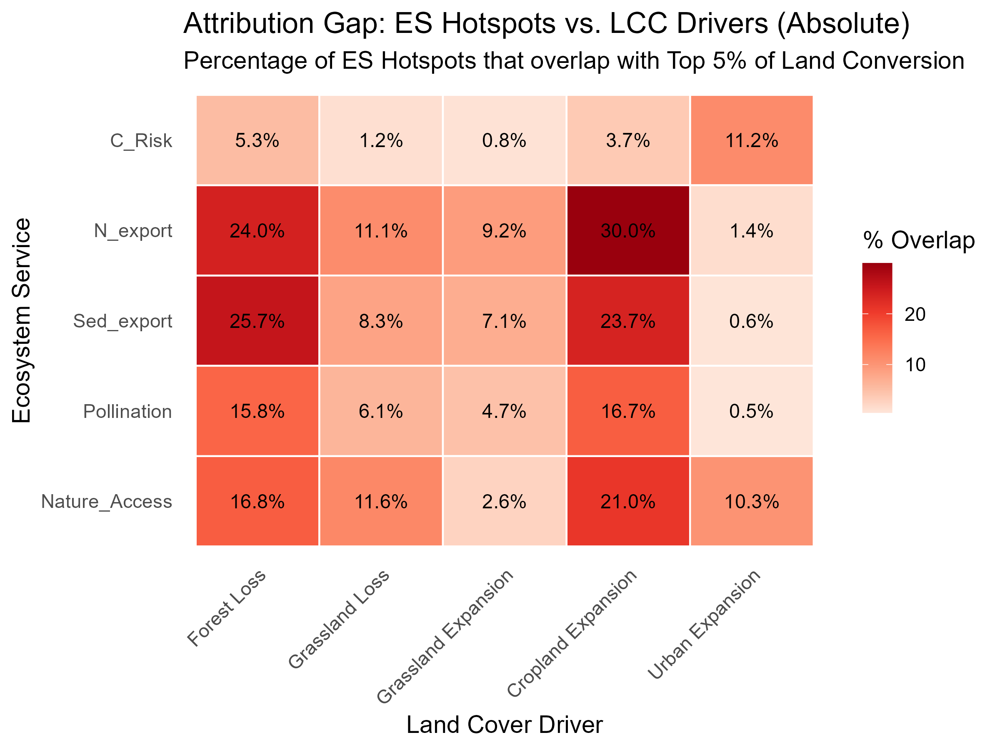

# Understanding Drivers (WHY) {#sec-why}

```{r setup}
#| include: false
library(dplyr)
library(readr)
library(knitr)

source("../../../R/paths.R")

has_reactable <- requireNamespace("reactable", quietly = TRUE)
if (has_reactable) {
  library(reactable)
  .or_filter <- JS("function(rows, columnId, filterValue) {
    const terms = filterValue.split('|').map(t => t.trim().toLowerCase()).filter(t => t.length > 0);
    if (terms.length === 0) return rows;
    return rows.filter(row => {
      const val = String(row.values[columnId] || '').toLowerCase();
      return terms.some(t => val.includes(t));
    });
  }")
}

lcc_pct <- read_csv(
  file.path(data_dir(), "processed", "tables", "lcc_es_hotspot_overlap_pct.csv"),
  show_col_types = FALSE
) %>%
  select(-metric) %>%
  rename(
    Service                   = service,
    `LCC Driver`              = driver,
    `ES Hotspot Cells (total)` = n_es_hotspots,
    `Overlapping Cells`       = n_overlap,
    `% Overlap`               = pct_overlap
  ) %>%
  mutate(`% Overlap` = round(`% Overlap`, 2)) %>%
  arrange(desc(`% Overlap`))
```

## The Attribution Gap

To explain *why* hotspots occur, we integrated Land Cover Change (LCC) metrics derived from ESA CCI and C3S land cover products (see Chapter 2 — Attribution Analysis: Land Cover Change Methodology for data sources, reclassification scheme, and the diffeR co-occurrence framework). In brief, we performed a spatial overlay between the finalized ecosystem service hotspot grids and five LCC driver layers — Forest Loss, Crop Expansion, Urban Expansion, Grassland Gain, and Grassland Loss — at 300-meter resolution.

Both ES hotspots and land cover conversion hotspots are defined using the same threshold — the top 5% of their respective distributions within the same 10km equal-area grid. Under spatial independence, this design would predict only ~5% co-occurrence by chance. The observed rate of **24%** is therefore approximately 4–5× above random expectation, confirming a genuine spatial association between extreme ecosystem service decline and extreme land cover conversion where it occurs.

Nevertheless, **76% of ES hotspot cells do not co-occur with extreme land cover conversion at 300-meter resolution**, constituting the attribution gap. This does not imply those cells experienced zero land cover change — many may have undergone moderate conversion below the top-5% threshold. It shows that the most severe ecosystem service declines are predominantly not located in the same cells as the most severe categorical conversions.

The magnitude of this gap challenges the assumption that macro-scale land conversion serves as an adequate proxy for ecosystem service change. We note, however, that this analysis identifies **spatial co-occurrence** between hotspots and LCC drivers, not causal attribution. An important structural constraint is that ESA CCI land cover data serves simultaneously as a primary input to the InVEST biophysical models and as the basis for the LCC overlay. This endogeneity means the gap cannot be interpreted as an independent empirical partition between degradation-driven and conversion-driven change. We present the 76% figure as a directional signal warranting further investigation rather than as a definitive mechanism assignment.

### Plausible Mechanisms Behind the Gap

Two mechanisms could generate large attribution gaps without requiring detectable categorical transitions:

1. **Upstream routing cascades**: A cell's land cover classification may remain mapped as "Forest" across both temporal snapshots, while agricultural conversion or clearance upstream fundamentally alters the hydrologic routing matrix. The resulting sediment or nutrient load overwhelms downslope filtering capacity, triggering a functional hotspot without any land-cover change recorded at the hotspot cell itself.
2. **Climate forcing**: Independent of land-use change, multi-decadal shifts in rainfall intensity and erosivity propagate through the InVEST routing architecture and shift modeled service outputs into extreme percentiles without a corresponding categorical land transition.

Disentangling these hypotheses rigorously would require controlled factorial experiments—holding climate inputs constant while varying land cover, or vice versa—that are beyond the scope of the current analysis. The policy implication nonetheless holds: conservation strategies focused exclusively on preventing categorical deforestation may be insufficient if functional decline is occurring in areas that appear structurally intact by satellite observation.

### Driver Overlap Statistics

The table below shows, for each service × driver combination, what percentage of that service's hotspot cells co-occur with the top 5% of that driver. **These are per-driver figures, not the 24% total**: a single hotspot cell may overlap with multiple drivers simultaneously, so the union across all five drivers (24%) exceeds any individual driver column. Use `|` in Service or LCC Driver to compare multiple values at once (e.g. `Pollin|N_export` or `Forest|Crop`).

```{r driver-table}
#| echo: false
if (has_reactable) {
  reactable(
    lcc_pct,
    filterable        = TRUE,
    searchable        = TRUE,
    defaultSorted     = list("% Overlap" = "desc"),
    defaultPageSize   = 20,
    showPageSizeOptions = TRUE,
    pageSizeOptions   = c(10, 20, 40),
    striped           = TRUE,
    highlight         = TRUE,
    compact           = TRUE,
    columns = list(
      Service                    = colDef(minWidth = 155, filterMethod = .or_filter),
      `LCC Driver`               = colDef(minWidth = 140, filterMethod = .or_filter),
      `ES Hotspot Cells (total)` = colDef(format = colFormat(separators = TRUE), minWidth = 165),
      `Overlapping Cells`        = colDef(format = colFormat(separators = TRUE), minWidth = 135),
      `% Overlap`                = colDef(format = colFormat(suffix = "%", digits = 2), minWidth = 100)
    )
  )
} else {
  kable(lcc_pct, caption = "Ecosystem Service Hotspots vs. Land Cover Conversion Drivers")
}
```

### Overlap Heatmaps

The heatmaps below show what percentage of ecosystem service hotspots geographically overlap with the top 5% of land cover conversion (e.g., deforestation, urbanization).

{width=100%}

{width=100%}

### Correlation Scatterplot

::: {.callout-warning}
**Design decision open — flag for Becky / next revision.**

This scatterplot uses **Net Natural Change** on the X-axis, which is derived from the binary Natural / Transformed reclassification of ESA CCI (not the five-driver breakdown shown in the heatmap above). This makes the X-axis coarser and less interpretable than the per-driver overlap analysis: a cell with net zero change could have lost forest and gained cropland in equal measure, or had no change at all — the binary metric cannot distinguish these.

Two open questions before finalising this figure:
1. **Replace X-axis with a per-driver metric?** Showing Forest Loss (or Crop Expansion) on X vs. a single service on Y — per-service panels — would be more analytically targeted and match the heatmap framing. Requires generating new plots.
2. **Or drop entirely?** The heatmap already summarises co-occurrence more cleanly. A scatterplot adds value primarily if it shows a regression / trend, which runs into the endogeneity caveat (ESA CCI is both InVEST input and attribution overlay). If retained, it should be clearly labelled as exploratory.

The absolute-change version has been removed; the percentage (SPC) version below is the only one shown, as it is the scale-invariant unit used throughout the hotspot analysis.
:::

{width=100%}

## Key Takeaways

::: {.callout-note}
**Five findings on why hotspots occur:**

1. **The 24% co-occurrence is a real signal, not noise.** Under spatial independence, two 5% tails would overlap by chance in only ~5% of cells. The observed 24% overlap between ES hotspots and extreme LCC hotspots is ~4–5× above that random baseline, confirming genuine spatial coupling where conversion and service decline co-occur.

2. **The 76% gap does not mean 76% of cells had no land cover change.** It means those cells did not co-occur with *extreme* (top 5%) conversion. Many will have experienced moderate conversion below the threshold. The claim is about co-occurrence of extremes, not absence of any disturbance.

3. **Per-driver overlaps are modest and individually small (1–5%).** Forest Loss is consistently the strongest single driver (up to ~4.5% for coastal services), but no single driver accounts for more than a fraction of hotspot cells. The 24% total is the union across all five drivers — it reflects cumulative pressure from multiple conversion types, not dominance by any one.

4. **Endogeneity constrains interpretation.** ESA CCI land cover data is simultaneously a primary input to InVEST's biophysical models and the basis for the LCC attribution overlay. The 76% gap therefore cannot be treated as an independent empirical partition between degradation-driven and conversion-driven change. It is a directional signal, not a mechanism assignment.

5. **The policy implication holds regardless of mechanism.** Whether the 76% reflects upstream routing cascades, sub-pixel degradation, climate forcing, or their combination, the practical consequence is the same: conservation strategies that rely exclusively on detecting and preventing categorical deforestation will miss the majority of ecosystem service decline occurring in structurally intact but functionally impaired landscapes.
:::
