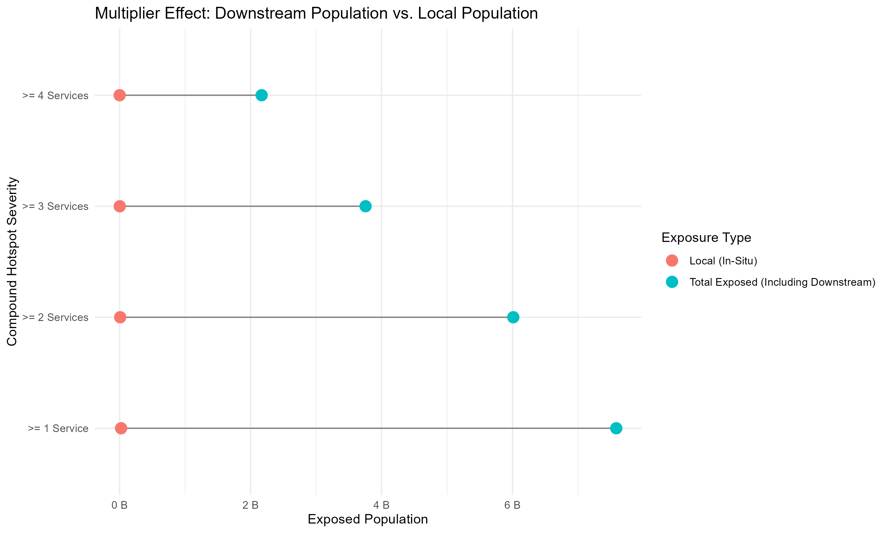
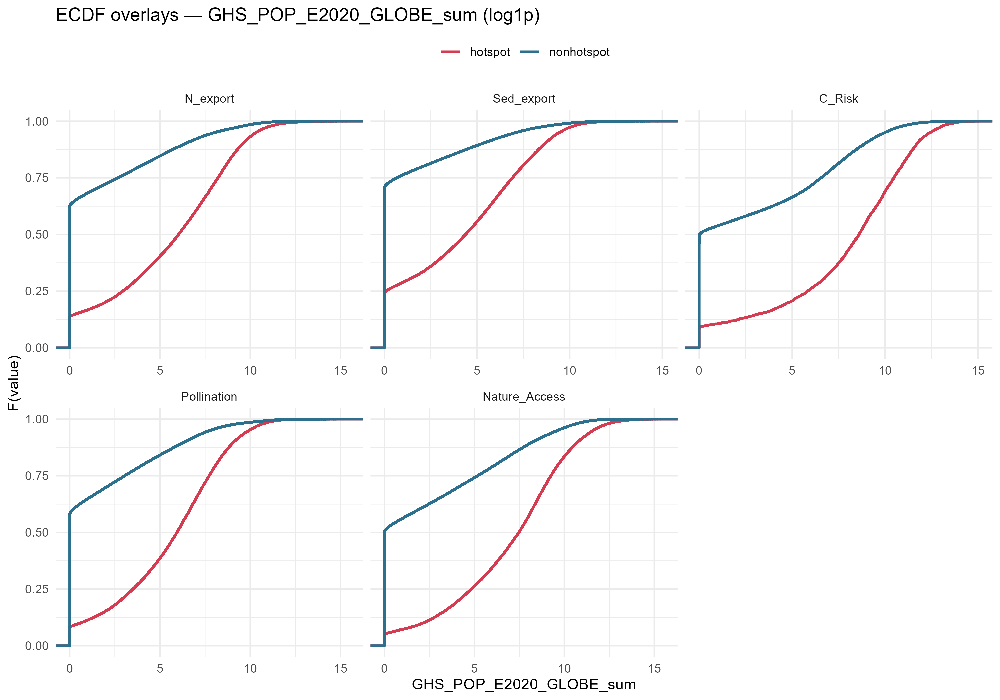
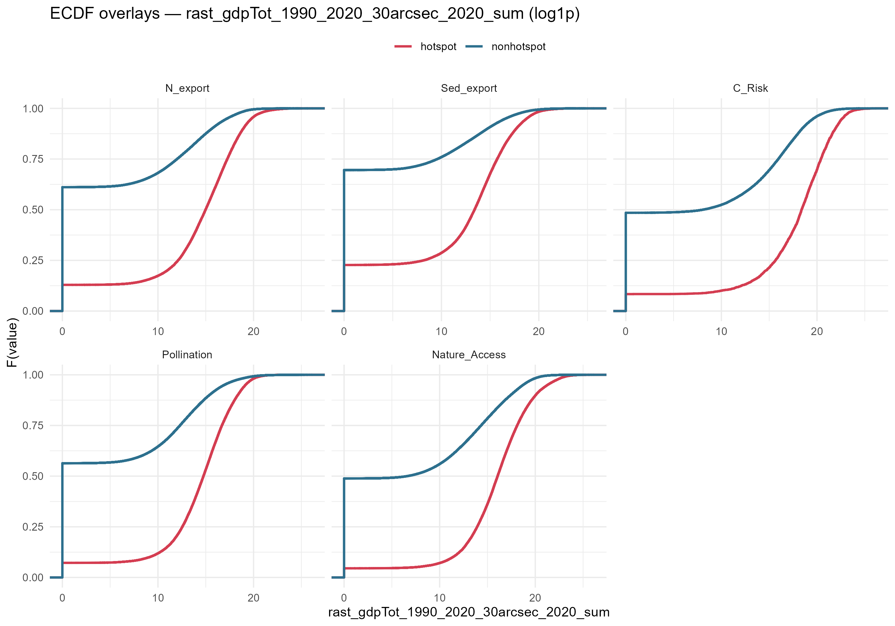
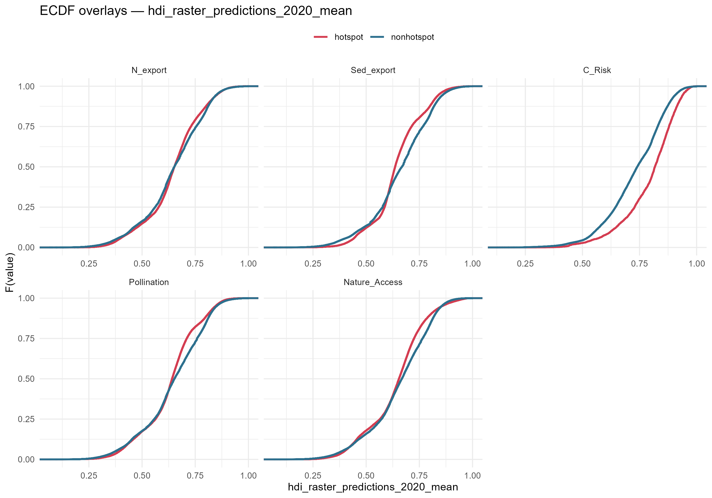
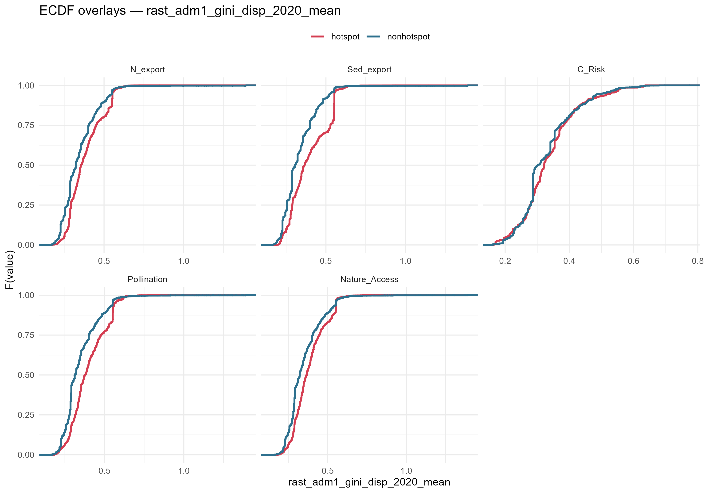

# Socioeconomic Analysis (WHO) {#sec-who}

```{r setup}
#| include: false
library(dplyr)
library(readr)

source("../../../R/paths.R")

# Load the population exposure stats
pop_exposure <- read_csv(
  file.path(data_dir(), "processed", "tables", "hotspot_pop_exposure.csv"),
  show_col_types = FALSE
)

ks_results <- read_csv(
  file.path(data_dir(), "processed", "tables", "ks_results_hot_vs_non.csv"),
  show_col_types = FALSE
)
```

::: {.callout-note}
**Unit of analysis: grid cells, not social units.**
Throughout this chapter, "populations" refers to individuals aggregated within 100 km² equal-area grid cells — defined entirely by their location and the socioeconomic characteristics of their cell (population density, GDP, HDI, Gini coefficient). The analysis does not observe social units such as communities, households, or ethnic groups, and cannot make claims about social cohesion, governance structures, or lived experience. Characterisations of "exposed populations" or "populations bearing disproportionate burden" are statistical descriptions of grid-cell-level aggregates, not sociological claims. Whether the spatial patterns identified here translate into differentiated social impacts requires validation with community-level data — a direction flagged for future work. ⚠️ *Flag for Becky: is this caveat sufficient, or should we recommend a specific approach for community-level validation?*
:::

## Absolute Population Exposure

How many people are directly living within the top 5% areas of ecosystem service decline? The charts below break down the exposed population by World Bank Income Group and the UN Human Development Index (HDI).

::: {.panel-tabset}

### By Income Group

{width=100%}

### By HDI

{width=100%}

:::

## In-Situ vs. Downstream Exposure (Servicesheds)

For compound hotspots (areas experiencing overlapping ecosystem service declines), the impact extends beyond the immediate grid cell. We calculated the "multiplier effect" of these hotspots by comparing the local (in-situ) population with the total population exposed through downstream hydrological flow or physical access pathways.

Incorporating connectivity substantially expands the population at risk. **1,212 million people** (1.2 billion) live directly within 10km grid cells that are hotspots for 2 or more services simultaneously. Those same cells are connected through downstream flow and physical access pathways to a combined **6,011 million people** in total — a connectivity multiplier of approximately **5×**. For areas with 3 or more overlapping service declines, the in-situ population is **445 million**, connected to 3,756 million total — a multiplier of approximately **8×**. These multipliers reflect the functional connectivity between upstream ecosystem processes and distant beneficiaries through servicesheds.

::: {.callout-important}
**Data traceability for these numbers — computed and verified 2026-06-22**

All population figures in this section are derived from two sources: (1) the global hotspot GeoPackage (`hotspots_global_pct.gpkg`) which carries a `hotspot_count` field per cell recording how many of the 8 services identify that cell as a hotspot (top 5% of SPC change); and (2) the canonical analysis grid (`10k_change_calc.gpkg`) which carries `GHS_POP_E2020_GLOBE_sum` — the GHSL-POP 2020 population summed within each 10km² cell.

| Measure | Filter | Cells | Population |
|---|---|---|---|
| In-situ, any hotspot service | `hotspot_count ≥ 1` | 225,113 | **3,065 M** |
| In-situ, compound hotspot | `hotspot_count ≥ 2` | 85,599 | **1,212 M** |
| In-situ, 3+ services | `hotspot_count ≥ 3` | 41,025 | **445 M** |
| Connected, 2+ (union: downstream + access) | beneficiary analysis | — | **6,011 M** |
| Connected, 3+ (union) | beneficiary analysis | — | **3,756 M** |
| Connected, all (union) | beneficiary analysis | — | **7,584 M** |

**Multiplier computation:** connectivity multiplier = union population ÷ in-situ population for the same set of cells. For 2+ compound cells: 6,011 M ÷ 1,212 M ≈ **5×**. For 3+ cells: 3,756 M ÷ 445 M ≈ **8×**.
:::


{width=100%}

## The Multiplier Effect: Absolute Population Exposure

Beyond characterising *who* lives near hotspots, we must quantify the *absolute number* of people who depend on them — including those connected through downstream hydrological flow or travel access. **3,065 million people** (3.1 billion) reside within at least one hotspot grid cell at 10km resolution (see Data Traceability callout above for derivation).

However, the benefits of nature extend far beyond the cell in which they are generated. Using a high-performance spatial extraction pipeline, we analyzed two distinct beneficiary pathways for all 250,000+ hotspot cells combined:

1.  **Hydrological Beneficiaries:** People living downstream within the same watershed relying on upstream regulation.
2.  **Access-Based Beneficiaries:** People who can reach the hotspot within a defined travel time, reflecting cultural, recreational, and non-timber provisioning services.

Our analysis reveals that approximately **7.6 billion people** (7,584 million) benefit from these hotspots through at least one of these pathways — nearly the entire global population. Crucially, when expanding our analysis from **Local Residents** (3,065 million) to **Connected Beneficiaries**, the affected population more than doubles depending on the pathway of service delivery.

By tracing down-gradient hydrological flow paths, we identify **6,409 million** downstream beneficiaries reliant on these impaired upstream grids. When evaluating the access-based travel footprint (populations relying on nature access and wild pollination within reachable distances), the reliant population expands to **7,390 million** individuals. This reveals a profound **Multiplier Effect**: the total connected population (7,584 million) is approximately **2.5×** larger than the in-situ local residents (3,065 million), and the access-based population is 1.15 times larger than populations living directly downstream alone.

This "multiplier effect" varies significantly by region, socioeconomic context, and biome, as shown in the tabs below.

::: {.panel-tabset}

### By WB Region

{width=100%}

### By Income Group

{width=100%}

### By WWF Biome

{width=100%}

:::

## Relative Socioeconomic Shift

We perform two-sample Kolmogorov-Smirnov (KS) tests to determine if the socioeconomic profiles of ecosystem service "hotspots" are statistically different from the background landscape. 

{width=100%}

{width=100%}

## Distributional Profiles (ECDF Overlays)

The KS heatmap and Cliff's Delta charts show *how strongly* and *in which direction* hotspot distributions depart from background. The ECDF (Empirical Cumulative Distribution Function) plots below reveal the *shape* of those differences — where in the distribution the gap opens, how wide it is, and whether it is consistent across all quantiles.

**How to read these plots:** In each panel, **red = hotspot cells**, **blue = median-background cells** (47.5th–52.5th percentile of ES change — the "business-as-usual" landscape). The x-axis is the socioeconomic variable value; the y-axis is the fraction of cells at or below that value. The key landmark is **where each curve crosses y = 0.5** — that is the median. When the red curve sits to the **right** of the blue curve at y = 0.5, hotspot cells have higher values; when it sits to the **left**, hotspot cells have lower values. The width of the horizontal gap between the two curves at any given y-level is proportional to Cliff's Delta.

### Population and GDP: A Universal Signal

The population and GDP signals are the clearest in the dataset — and the reason why is structural. More than half of all 10 km background cells contain **zero people** (wilderness, dryland, uninhabited terrain). As a result, the blue ECDF curve makes a **steep vertical jump right at x = 0** on the log₁₊ scale: a large mass of background cells all piled at the same zero value. The red curve for hotspot cells, by contrast, starts rising gradually from much lower cumulative probabilities — far fewer hotspot cells are uninhabited. The red curve then lies **consistently and far to the right** of the blue curve across the entire distribution, not just at the median.

Hotspot cell population medians range from ~78 people per cell (Sed_export) to ~6,033 (C_Risk_Red_Ratio), against a background median of essentially zero for most services. Cliff's Delta spans **+0.47 to +0.66** across services — meaning if you draw one random hotspot cell and one random background cell, the hotspot cell has more people roughly **74–83% of the time**. GDP tells the same story with similar magnitude (+0.49 to +0.67).

The practical implication is clear without any close reading of the curves: the gap is large, it opens immediately at the left tail, and it persists to the right tail.

{width=100%}

{width=100%}

### HDI: A Small Effect That Changes Direction by Service

HDI is where interpretation requires more care. Unlike population, **HDI has no zeros** — every inhabited cell has a value between roughly 0.3 and 0.9, so all distributions heavily overlap. The curves sit close together, and the gap between red and blue at the median is measured in hundredths of an HDI point, not orders of magnitude. The direction of that gap — not its size — is the signal.

The table below gives the actual median HDI values for each service:

| Service | Hotspot median HDI | Background median HDI | Cliff's Delta | Direction |
|---|---|---|---|---|
| C_Risk | **0.817** | 0.744 | **+0.30** | Rightward — more developed |
| C_Risk_Red_Ratio | **0.816** | 0.743 | **+0.29** | Rightward — more developed |
| N_Ret_Ratio | **0.664** | 0.617 | **+0.19** | Slight rightward |
| Sed_Ret_Ratio | **0.650** | 0.612 | **+0.18** | Slight rightward |
| Pollination | 0.641 | **0.653** | −0.06 | Slight leftward — less developed |
| Nature_Access | 0.654 | **0.667** | −0.07 | Slight leftward — less developed |
| Sed_export | 0.636 | **0.667** | −0.08 | Slight leftward — less developed |
| N_export | 0.652 | **0.653** | −0.01 | Negligible |

**Coastal services (C_Risk, C_Risk_Red_Ratio):** The red curves sit visibly to the right — hotspot cells have a median HDI of 0.817 vs 0.744 for background, a 7-point difference. At y = 0.5, the red curve crosses at a clearly higher x than the blue. Cliff's Delta of +0.30 means hotspot cells have higher HDI about 65% of the time. This is the largest HDI effect in the dataset, and it is perceptible in the plot.

**Terrestrial provisioning and export services (Pollination, Nature_Access, N_export, Sed_export):** These curves are where the visual subtlety is greatest. The difference at the median ranges from 0.001 (N_export: 0.652 vs 0.653) to 0.031 (Sed_export: 0.636 vs 0.667). On the plot, **the red and blue curves for these services will appear nearly on top of each other** — you will not easily see left versus right without squinting at the median crossing. The effect is real (it passes the statistical test because n ≈ 67,000 hotspot cells), but it is not visually dramatic. What it means ecologically: terrestrial service declines tilt slightly toward less-developed contexts, but the global footprint of these services is large enough that hotspot cells span the full HDI range.

**Retention ratio services (N_Ret_Ratio, Sed_Ret_Ratio):** Intermediate and positive — red sits slightly right of blue (median difference of ~4–5 HDI points), more visible than the terrestrial group but less than coastal. Fix your eye at y = 0.5 and the red curve crosses at a marginally higher x than blue.

**Reading tip:** In the HDI ECDF plot, rather than trying to judge the overall shape of each curve, isolate the horizontal gap between each red–blue pair **at y = 0.5**. You will see: (1) a clear rightward gap for the two coastal curves; (2) slight rightward gaps for the two retention curves; (3) near-zero or imperceptible gaps for the four terrestrial curves.

{width=100%}

### GINI: Larger Effects, and a Reversal That Defines the Third Typology

The GINI plot is more legible than HDI because the effects are larger, and the **direction reversal between terrestrial and retention services** is the most important pattern in the entire socioeconomic analysis.

| Service | Hotspot median GINI | Background median GINI | Cliff's Delta | Direction |
|---|---|---|---|---|
| Pollination | **0.378** | 0.315 | **+0.30** | Rightward — more unequal |
| Sed_export | **0.366** | 0.305 | **+0.30** | Rightward — more unequal |
| N_export | **0.354** | 0.322 | **+0.22** | Rightward — more unequal |
| Nature_Access | **0.365** | 0.322 | **+0.22** | Rightward — more unequal |
| C_Risk | 0.321 | 0.305 | +0.07 | Negligible |
| C_Risk_Red_Ratio | 0.321 | 0.302 | +0.07 | Negligible |
| Sed_Ret_Ratio | 0.359 | **0.401** | **−0.11** | Leftward — *less* unequal |
| N_Ret_Ratio | 0.346 | **0.388** | **−0.17** | Leftward — *less* unequal |

**Terrestrial provisioning services (Pollination, Sed_export, N_export, Nature_Access):** The red curves sit clearly to the right — a 6-point GINI difference at the median for Pollination (0.378 vs 0.315). This is the most visually legible effect in the GINI plot. Hotspot cells for these services are concentrated in **higher-inequality** contexts. Combined with the (very slight) leftward HDI shift, the portrait of the terrestrial typology is: service losses in areas that are simultaneously somewhat less developed *and* more unequal — less capacity to adapt, less safety net.

**Coastal services (C_Risk, C_Risk_Red_Ratio):** Red and blue curves nearly overlap in GINI (1.6-point difference at median, Cliff's Delta only +0.07). The coastal typology is defined by *high HDI*, not by any particular inequality pattern.

**Retention ratio services (N_Ret_Ratio, Sed_Ret_Ratio):** This is the surprising result. The red curves shift **to the left** — hotspot cells have *lower* GINI than background (N_Ret_Ratio: 0.346 vs 0.388, a 4-point difference in the opposite direction from terrestrial services). At y = 0.5 in the GINI plot, the retention-ratio red curves cross at a clearly *lower* x than their blue pairs. This means declining water-retention efficiency is concentrated in **more equal** contexts — a pattern consistent with intensive but relatively homogeneous agricultural regions (parts of Western Europe, East Asia, temperate North America), where broad-based farming subsidies or land tenure systems reduce income inequality even as diffuse nutrient and sediment loads erode ecosystem function.

The retention typology therefore does not fit either of the other two: it is *not* the "poor and unequal" pattern of terrestrial services, and it is *not* the "wealthy coastline" pattern of coastal services. It occupies a distinct third position in the HDI–GINI space.

{width=100%}

### Putting It Together

The three typologies are most clearly distinguished by reading HDI and GINI together:

| Typology | HDI shift | GINI shift | What it means |
|---|---|---|---|
| **Coastal** (C_Risk, C_Risk_Red_Ratio) | +0.29–0.30 (rightward) | ~0 (negligible) | Higher development; inequality irrelevant |
| **Terrestrial provisioning** (Pollination, N/Sed export, Nature Access) | −0.01 to −0.08 (slight leftward) | +0.22–0.30 (rightward) | Slightly less developed; substantially more unequal |
| **Retention ratios** (N_Ret_Ratio, Sed_Ret_Ratio) | +0.18–0.19 (slight rightward) | −0.11 to −0.17 (leftward) | Moderately developed; distinctly *more* equal |

These typologies reflect spatial co-occurrence between ecosystem service decline and socioeconomic context, not causal attribution. They provide a framework for targeting policy attention and structuring future analyses that explicitly model the pathways connecting land-use pressure, service change, and human welfare.

### A Note on Population's Two Roles in This Analysis

A fair question about this chapter is whether population is doing double duty — defining which cells count as hotspots in the first place, and then being "rediscovered" as a correlate of those same hotspots. The honest answer is that it depends on the service, and it's worth being explicit about the two distinct ways population enters this pipeline.

**For seven of the eight services** (Pollination, Nitrogen and Sediment Export and Retention Ratios, Coastal Risk and Coastal Risk Reduction Ratio), the underlying InVEST models are purely biophysical — they simulate a physical flux or process (nutrient loading, sediment delivery, wave energy attenuation) with no population input at all. Hotspot status for these services is defined entirely from the modeled service value; population density, GDP, and HDI only enter afterward, in this chapter's KS-test comparison of hotspot cells against a background sample. For these seven services, there is no circularity: population is not part of the hotspot definition, only a post-hoc covariate tested against it.

**Nature Access is the exception.** Its InVEST model is inherently population-weighted — the raw 1992 and 2020 input rasters both blend land-cover-derived habitat accessibility with a LandScan population layer (fixed at its 2019 vintage in both years). So a Nature Access hotspot is, by construction, partly about where people are. Critically, though, because the *same* 2019 population layer underlies both the 1992 and 2020 snapshots, the Symmetric Percentage Change that defines a Nature Access hotspot isolates the land-cover-driven shift in accessibility — it does not reflect population redistribution over time, since population is held fixed across both years being differenced. A Nature Access hotspot is defined by "accessible habitat changed a lot near a fixed population," not "population changed a lot."

**A separate, real limitation remains: coarse-resolution confounding.** Even where population is not part of the hotspot definition, land conversion and population density can co-occur at the 10km grid scale for reasons unrelated to any direct relationship between them — both concentrate, for instance, in agricultural frontiers and peri-urban transition zones. This means some of the "hotspots sit in denser, more economically active landscapes" signal in this chapter could partly reflect shared coarse-grid geography rather than an independent socioeconomic pattern. This is a Modifiable Areal Unit Problem (MAUP)-adjacent concern, not a data-circularity one, and finer-resolution replication would be the way to test how much of the signal survives at smaller grain.

## Summary

::: {.callout-note}
**Five findings on who is exposed:**

1. **Scale depends on how you count.** The in-situ count of **distinct individuals** living within any hotspot grid cell is **3,065 million (~3.1 billion)**. When all connectivity pathways are included (downstream + access), the total rises to **7.6 billion** — nearly the entire world population. See the Data Traceability callout above for the full derivation.

2. **Connectivity multiplies exposure by 2.5–8× depending on compound risk.** The downstream + access pathway analysis raises the potentially affected population from 3,065 million (in-situ, all hotspot cells) to ~7.6 billion globally. For compound hotspot cells (2+ services), the in-situ population of 1,212 million connects to 6,011 million through servicesheds — a multiplier of approximately **5×**. For cells with 3+ overlapping declines (445 million in-situ), the multiplier is approximately **8×**. This reflects the functional connectivity between upstream ecosystem processes and distant beneficiaries.

3. **Population density and GDP elevation are universal.** All eight services show hotspot cells with higher population and GDP than the median background — a consistent, large-magnitude signal across the full distribution (not just the tails). The world's hotspots are not wilderness: they are embedded in human landscapes.

4. **Three distinct socioeconomic typologies emerge from HDI and GINI patterns:**
   - *Coastal services* (C_Risk, C_Risk_Red_Ratio): co-occur with *higher* HDI — declines are concentrated in developed, densely settled coastlines.
   - *Terrestrial provisioning services* (Pollination, Nature Access, N/Sed export): co-occur with *lower* HDI and *higher* GINI — losses fall on less-developed, more unequal contexts with limited adaptive capacity.
   - *Retention ratio services* (N_Ret_Ratio, Sed_Ret_Ratio): near-neutral or slight positive HDI shift, but *lower* GINI than background — a third, structurally distinct pattern.

5. **The equity implication is not symmetric across services.** The terrestrial service typology — where the most people depend on pollination and water quality — is precisely the typology concentrated in lower-HDI, higher-inequality settings. The populations least able to substitute or adapt bear the largest relative burden.
:::
