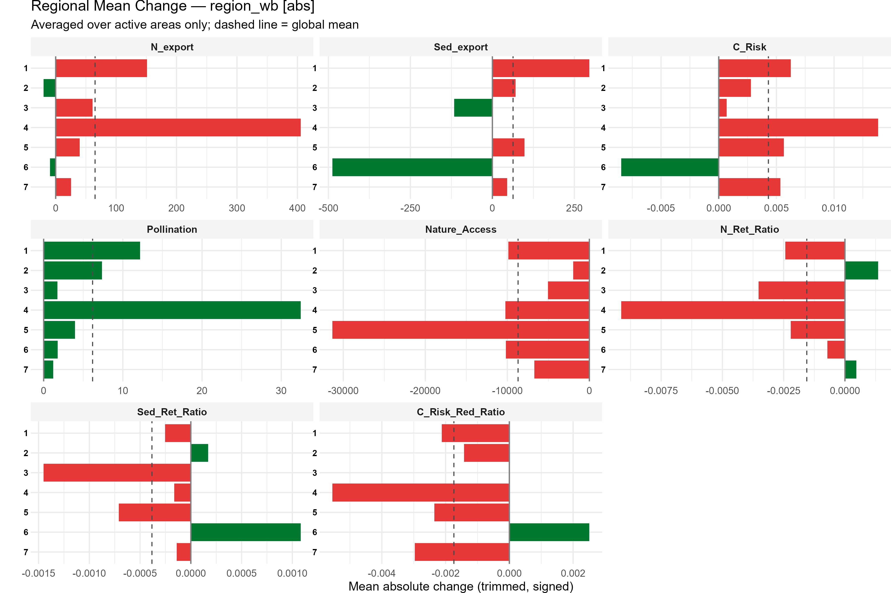
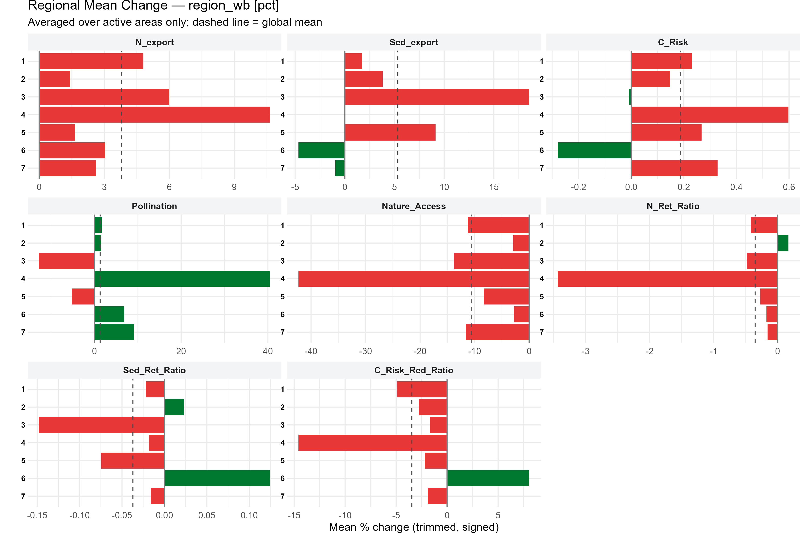
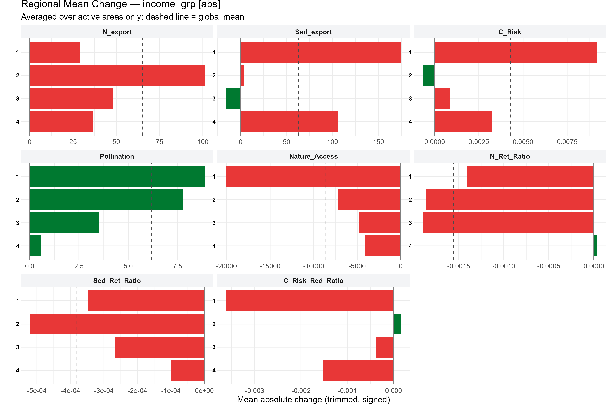
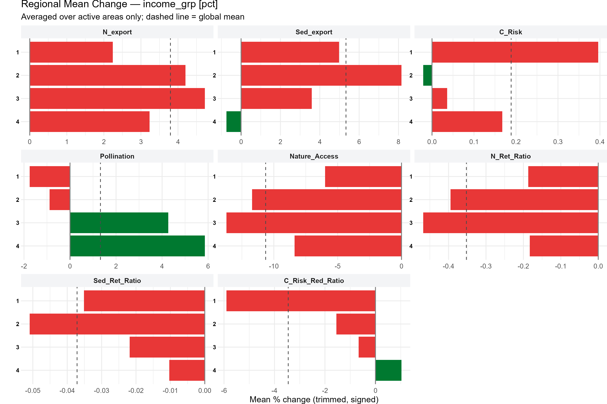
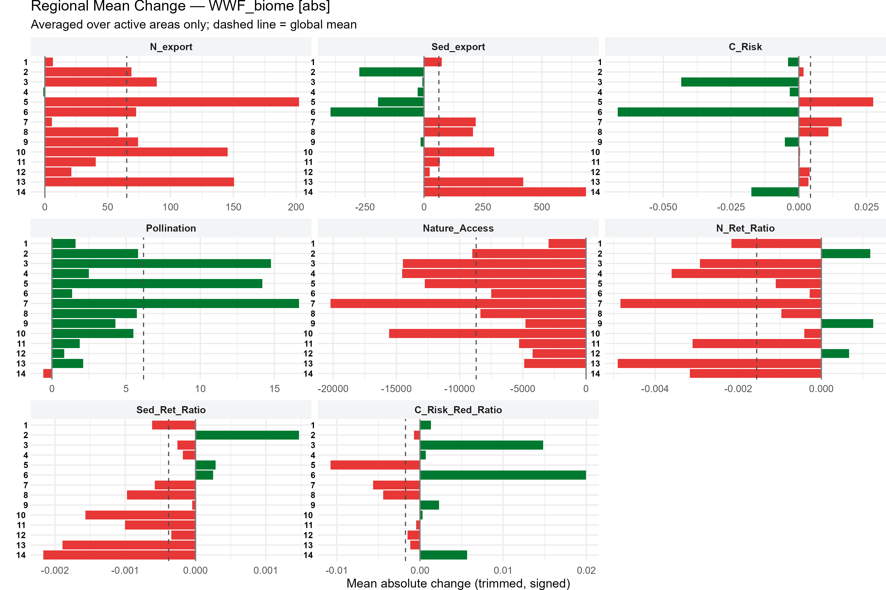
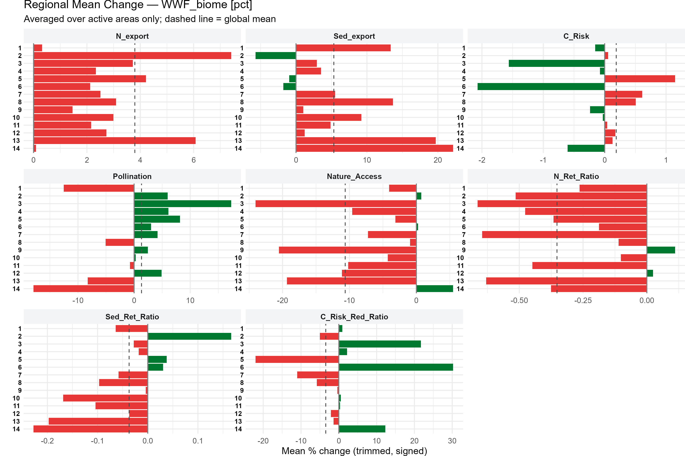

# Technical Appendix: Methodology & Analytical Framework {#sec-annex}

This document details the overarching methodology, spatial framework, and computational architecture used in the Global NCP project to analyze changes in ecosystem service provision between 1992 and 2020.

---

## 1. Data Preparation & Spatial Foundations

Before calculating any changes or identifying hotspots, the underlying spatial and thematic data must be standardized.

### Unit Standardization (Per Hectare)
To ensure that comparisons of ecosystem service provision are meaningful across the globe, all volumetric services (e.g., Nitrogen Export, Sediment Export) are standardized to a **per-hectare** basis. This step corrects for the geometric distortion of raster pixels in unprojected coordinate systems.

*   **Volumetric Variables:** Converted to `Unit / ha` by dividing the raw pixel value by a corresponding pixel area raster (`esa_pixel_area_ha_...`). This calculation is performed *before* any zonal statistics or spatial aggregation occurs.
*   **Ratios & Indices:** Left in their native units (e.g., 0-1 ratios, unitless indices) as area normalization does not apply.

This ensures that all downstream zonal statistics reflect physical densities that are comparable across regions.

### Canonical Master Grid Generation
Due to severe performance and geometry-validity bottlenecks encountered when performing massive spatial joins natively in R (the `sf` package), the creation of the canonical 100 sq km master grid was migrated to a hybrid QGIS-Python workflow.

1.  **Landmass Masking:**
    *   The original global `AOOGrid` and Biomes layer were loaded into a desktop GIS (QGIS).
    *   The WWF Biomes layer was dissolved to create a single global landmass polygon.
    *   A "Select by Location" operation isolated all grid cells intersecting the landmass.
    *   The selection was exported as `landgrid_1.gpkg`.
2.  **Geometry Cleaning:**
    *   To resolve minor topological errors (e.g., self-intersecting rings caused by clipping at coastlines and the dateline), the geometries were validated and cleaned, resulting in `landgrid_1_clean.gpkg`.
3.  **Attribute Enrichment (Python):**
    *   The final stage is handled by `Python_scripts/build_master_grid.py`.
    *   This script performs a highly optimized, centroid-based spatial join to map WWF Biomes, Country, UN/World Bank Regions, and Income Group attributes (from the `ee_correspondence` dataset) onto the grid.
    *   It inherently handles geometry validation (`buffer(0).make_valid()`) and deduplication, outputting the final, analysis-ready `landgrid_1_clean_enriched.gpkg`.

#### Grid Cell Attrition (1.5M to 1.3M cells)
While the canonical master grid initially contains 1,522,073 terrestrial cells, the final number of evaluated cells in the hotspot pipeline drops to approximately 1,302,099. This ~14% reduction is intentional and expected. During the spatial extraction phase, any grid cells that lack complete underlying raster data coverage across all baseline variables (for both 1992 and 2020) are systematically dropped when calculating temporal changes. Common causes for this lack of data include:
*   **Coastal Mismatch:** Raster boundaries from different sources (e.g., ESA CCI vs InVEST models) often handle complex coastlines and small island archipelagos differently, leading to NoData (`NA`) values in those cells.
*   **High Latitude Extents:** Some rasters do not cover extreme polar latitudes.
*   **Modeling Constraints:** Certain biophysical models may fail to resolve valid outputs in edge-case topographies.
By dropping these cells, we guarantee that the final analysis compares a mathematically sound, 1-to-1 footprint of cells that contain complete, valid, non-NA data for all required services across both time periods.

*Note: The legacy R script `analysis/prepare_data.qmd` and standalone cleaning utilities like `clean_grid.py` were fully deprecated in v1.3.4 in favor of this Python workflow.*

### Grid Geometry & Reprojection Effects

*   **Geographic vs. Projected Grids:** The original analysis grid is defined in a geographic coordinate system (WGS 84, EPSG:4326). When reprojected into an equal-area system (like Equal Earth, EPSG:8857) for analysis, the shapes of the cells stretch and tilt to preserve their area on a flat map.
*   **Bounding Box vs. True Area:** As a result, measuring the `width` and `height` of a reprojected grid cell's bounding box will **not** yield 10km x 10km. 
*   **Area is the Invariant:** A validation script (`Python_scripts/verify_grid_area.py`) measured the true geometric area of the reprojected grid cells, definitively confirming that each cell has an area of **100 km²** (10km x 10km).

### Data Preparation: Coastal Risk & Protection
The Coastal Risk and Protection datasets are originally provided as high-resolution vector line geometries representing discrete coastal locations. 

To ensure mathematical robustness, a specialized pre-processing workflow was utilized:

1. **Vector Joining & Ratio Calculation:** The script `Python_scripts/coastal_protection_join.py` merges the 1992 and 2020 coastal point layers based on their exact spatial locations. It calculates the absolute differences and proportional risk reduction ratios natively in the vector domain to prevent floating-point interpolation errors.
2. **Rasterization:** The script `Python_scripts/rasterize_coastal.py` safely "burns" these pre-calculated point values into high-resolution continuous rasters.
3. **Grid Extraction:** The resulting coastal rasters are ingested by the standard pipeline. This calculates the mean coastal risk metrics for each 100 sq km grid cell strictly through raster-vector overlap, completely bypassing C-level geometric intersection crashes.

---

## 2. The Dual-Pathway Analysis Structure

Global spatial analysis often suffers from scale artifacts (like the Modifiable Areal Unit Problem). To accurately answer both "What happened globally?" and "Where are the local hotspots?", this project splits the analysis into two parallel workflows.

### Path A: True Regional Trajectories (The "WHAT")
This path is designed to generate summary statistics for large macro-regions (e.g., Biomes, World Bank Regions) bypassing the 100 sq km grid entirely.

*   **Workflow:** The `zonal_stats_toolkit` extracts the base year (1992) and future year (2020) rasters directly to the large regional polygons.
*   **Metrics:** Once the total regional volume/mean is established for both years, we calculate the Absolute Change and Symmetric Percentage Change (SPC) directly from those regional totals.
*   **Why this matters:** It is mathematically impossible to calculate percentage change from a "difference raster." By extracting the true regional baselines first, we ensure our regional percentage changes are sound. We use the outputs of this path for the main text's regional trajectory charts (the "WHAT" section).

### Path B: Grid-Level Change Calculation (The Hotspot Path)
This is the canonical pathway for identifying localized extremes (hotspots) and assessing population exposure. The key distinction here is that **spatial aggregation to the grid precedes differencing**.

*   **Workflow:** 
    1. **Independent Aggregation:** The Python pipeline aggregates the raw 1992 and 2020 rasters to the 100 sq km grid cells independently.
    2. **Grid-Level Differencing:** `analysis/process_data.qmd` computes Absolute and Symmetric Percentage Change (SPC) between the 1992 and 2020 columns for each grid cell.
    3. **Hotspot Extraction:** `analysis/hotspot_extraction.qmd` identifies hotspots (extreme 5% of change) based on these grid cells.
    4. **Synthesis:** `analysis/hotspot_synthesis.qmd` aggregates these localized hotspots to calculate regional enrichment scores, coverage, and affected populations.
*   **Use Case:** This path answers the "WHERE", "WHY", and "WHO". Its regional averages are reserved for the **Annex** due to MAUP/Simpson's paradox artifacts (explained below).

### Addressing Aggregation Divergence (Simpson's Paradox)

When we average the cell-level changes from Path B up to regional scales, we sometimes observe a phenomenon related to Simpson's Paradox and the Modifiable Areal Unit Problem (MAUP): **Sign-Flips**.

A "sign-flip" occurs when a region shows a negative *Absolute Change* but a positive *Symmetric Percentage Change* (SPC) for the same service. 

This is not an error; it reveals a specific geographic narrative:
*   **Mean Absolute Change** is heavily weighted by a few high-volume grid cells (e.g., massive, dense forests). If those highly productive cells lose a large volume of a service, the regional absolute average turns negative.
*   **Mean Symmetric Percentage Change** treats every 10km community equally, regardless of its baseline volume. It highlights widespread, low-intensity dynamics. 

A sign-flip indicates that the *total volume* of the service in the region is decreasing (driven by heavy localized losses), but the *spatial footprint* of minor expansions or local service gains is spreading across a large number of low-baseline cells.

## 10km Grid Regional Aggregations

The following charts display the regional summaries calculated via Path B. Compare these with the Path A charts in @sec-what to observe the subtle differences introduced by the 10km spatial aggregation framework.

### By World Bank Region (10km Aggregation)

{#fig-annex-abs-wb width=100%}

{#fig-annex-pct-wb width=100%}

### By Income Group (10km Aggregation)

{#fig-annex-abs-inc width=100%}

{#fig-annex-pct-inc width=100%}

### By WWF Biome (10km Aggregation)

{#fig-annex-abs-biome width=100%}

{#fig-annex-pct-biome width=100%}
