# Abstract

Ecosystem services—the ecological processes and structural configurations through which natural ecosystems sustain and fulfill human life—are declining globally, but their spatial concentration, affected populations, and underlying driving mechanisms remain poorly understood. We analyze overarching regional trajectories and localized changes for eight distinct biophysical service variables across 1.30 million 100 $\text{km}^2$ equal-area grid cells worldwide between 1992 and 2020. Combining InVEST (Integrated Valuation of Ecosystem Services and Tradeoffs) biophysical models, European Space Agency Climate Change Initiative (ESA CCI) land cover records, and gridded socioeconomic covariates, we identify 252,215 unique grid cells experiencing at least one extreme ecosystem service decline hotspot (defined as the extreme 5% of relative change values calculated via Symmetric Percentage Change per service). 

Our analysis reveals three primary systemic trends: (1) geographic clustering of multi-service hotspots predominantly within Latin America and the East Asia-Pacific regions; (2) a profound "multiplier effect" in human exposure, where highly localized declines cascade to affect over 7.6 billion connected beneficiaries (96.7% of the evaluated global population) via downstream and travel-access dependencies, with lower-middle-income nations experiencing 1.6 times higher localized intensity than high-income countries; and (3) a wide spatial attribution gap where approximately 76% of identified hotspots exhibit no co-occurrence with extreme (top 5%) land cover conversion at 300-meter resolution. This attribution gap is consistent with mechanisms operating below the threshold of 300m satellite classification—including sub-pixel degradation, upstream routing cascades, and climate forcing—but the current analytical design cannot partition their relative contributions; disentangling them would require controlled factorial experiments beyond the scope of this analysis. These findings call for targeted, context-specific conservation strategies that account for geographic concentration, compounding downstream exposure, and drivers beyond categorical deforestation.

**Keywords:** Ecosystem services, Spatial hotspots, Land-use change, Socioeconomic profiling, Nature futures, Global assessment

---

# Introduction

## Ecosystem Services at Risk
Ecosystem services represent the structural components, biophysical functions, and ecological processes through which natural landscapes generate direct and indirect benefits for human societies (Daily et al., 2009). Despite their foundational role in supporting global economic stability, food security, and climate resilience, critical landscape functions; including wild pollination, hydrological regulation, and coastal risk mitigation—are undergoing unprecedented systemic declines worldwide (Millennium Ecosystem Assessment, 2005; IPBES, 2019). Current estimates indicate that upwards of 1.1 billion vulnerable individuals rely directly on local ecosystem configurations for their immediate subsistence and natural resource-based livelihoods (Chaplin-Kramer et al., 2019; Fedele et al., 2021). However, the localized geographic configurations of these changes, alongside the precise demographic characteristics of vulnerable populations, remain under-characterized at the global scale.

## Spatial Prioritization Challenge
Developing effective conservation and mitigation frameworks is fundamentally constrained by a compounding set of resource, institutional, and informational bottlenecks (Daily et al., 2009; Chaplin-Kramer et al., 2019). Conservation investments and climate adaptation funds are inherently finite and must be optimally allocated; however, the challenge extends beyond financial scarcity. Decision-makers lack comparable, high-resolution global metrics capable of diagnosing where ecosystem service capacity is declining most acutely (WHERE), which segments of human society are most exposed (WHO), and what biophysical or anthropogenic mechanisms drive observed losses (WHY) (Crossman et al., 2013; Naidoo et al., 2008; Willcock et al., 2023).

This diagnostic gap can result in misallocated resource flows, as broad national or continental aggregations can obscure the unequal distribution of environmental burdens across communities (Bullard, 1990). Without a standardized, high-resolution baseline tracking change through time, effective landscape-level intervention remains difficult to target. A reproducible global assessment connecting biophysical service models with satellite observations and fine-scale demographic grids can support spatially targeted conservation finance and land management decisions. This approach also provides the spatial diagnostics needed to advance Gross Ecosystem Product (GEP) accounting within the Natural Capital Project framework and to inform international biodiversity platforms such as IPBES [add sources].

## Research Objectives
This study addresses four structurally linked research questions:

1. What are the overarching global and macro-regional trajectories of absolute and relative ecosystem service change?
2. Where are the localized hotspots of extreme ecosystem service decline geographically concentrated?
3. Who is directly exposed to these localized declines, and how does human vulnerability scale when transitioning from local in-situ populations to connected downstream serviceshed beneficiaries?
4. What proportion of localized ecosystem service decline spatially co-occurs with satellite-detected land cover conversion, and what mechanisms might explain the remaining cells where no such transition is detectable at 300m resolution?

---

# Methods

## Data Sources and Study Design
To evaluate global ecosystem dynamics, we established a 28-year temporal scope spanning between 1992 and 2020. This specific window was selected to leverage the maximum continuous historical baseline provided by the European Space Agency Climate Change Initiative (ESA CCI) land cover time series (ESA, 2017), allowing us to capture long-term landscape trajectories. The spatial scope encompasses all terrestrial landmasses, initially partitioned into a standardized equal-area master grid of 1,522,073 cells ($100\text{ km}^2$ each), utilizing the IUCN Area of Occupancy (Murray, 2017) structural grid. During the spatial data extraction pipeline, grid cells that lacked complete underlying raster data coverage (e.g., due to raster extents not fully covering coastal margins, small islands, or specific regions across all 1992 and 2020 baseline variables) were systematically dropped when calculating temporal changes. This exclusion ensured that our analysis only compared cells with consistent, non-NA biophysical data across both time periods, resulting in a final evaluated sample of 1,302,099 viable cells out of the original 1.52 million. [double check, for the specific case of pollination, I had to create a mask with all valid values fror both dates, and reclass as zero, to avoid NA values in the difference calculation. This is a special case, and I should clarify it in the methods.]

### Biophysical Modeling of Ecosystem Services
We used eight simulated continuous ecosystem service variables modeled at a native 300-meter spatial resolution using the InVEST (Integrated Valuation of Ecosystem Services and Tradeoffs) biophysical software suite (Sharp et al., 2020). To ensure comparisons of volumetric ecosystem services (those expressed in absolute physical units such as kilograms of nutrient or tons of sediment) remain physically meaningful across latitudes, we standardized all extensive variables to a per-hectare basis prior to grid aggregation. Intensive variables (e.g., risk indices and retention ratios) were retained in their native dimensionless index units. Additionally, coastal risk indices were calculated natively in the vector domain before rasterization to prevent floating-point interpolation errors along complex shorelines. The modeled suite targets three core thematic areas of human-nature interdependence:

1. **Local & Habitat Services:** *Nature access* (modeled as a spatial proxy of human proximity to intact natural habitat matrices) and *pollination* (evaluated as landscape-level habitat suitability and foraging range support for wild pollinator guilds).
2. **Coastal Risk Mitigation:** *Coastal protection* (simulated as absolute open-ocean wave energy attenuation by marine and coastal vegetative barriers) and the *coastal risk reduction ratio* (the proportional reduction in socio-ecological vulnerability directly mitigated by the presence of protective coastal habitats).
3. **Hydrological Regulation:** *Nitrogen export* (total annual nutrient loading delivered to surface waterways), *nitrogen retention ratio* (the fraction of total nutrient load filtered by the landscape before reaching waterways), *sediment export* (total annual sediment yield reaching stream networks), and the *sediment retention ratio* (the fraction of potentially mobilized sediment retained on-slope by vegetative structure). Both retention ratios were derived directly from the InVEST NDR and SDR model outputs. The *sediment retention ratio* is computed as:

$$\text{SedRet} = \frac{\text{USLE} - \text{SedExport}}{\text{USLE}}$$

where USLE (Universal Soil Loss Equation) represents the potential erosion rate—already encoding external rainfall erosivity (R factor) and slope steepness (LS factor)—while SedExport is the fraction of that potential erosion actually delivered to downstream waterways. Normalizing by USLE isolates the landscape's structural retention capacity (i.e., the effect of vegetative cover, root systems, and surface roughness) from regional climatic and topographic variation. The *nitrogen retention ratio* is computed as:

$$\text{NRet} = \frac{N_{\text{retained}}}{N_{\text{retained}} + N_{\text{export}}}$$

where the denominator ($N_{\text{retained}} + N_{\text{export}}$) equals the total modeled nutrient load generated by the landscape. Normalizing by total load isolates the biological filtration efficiency of the landscape (riparian buffers, wetland interception, vegetative uptake) from confounds introduced by varying absolute fertilizer inputs or precipitation-driven leaching across agricultural contexts. In both cases, a declining ratio value—even absent changes in absolute export volumes—signals degradation of the landscape's intrinsic water-regulating function, making retention ratios more sensitive indicators of functional loss than export metrics alone.

### Ancillary Datasets and Harmonization
To cross-examine biophysical changes with external socioeconomic and land-use drivers, we compiled and harmonized a suite of global gridded covariates to the 10-km IUCN grid template. Population exposure was extracted from the Global Human Settlement Layer (GHSL-POP), localized urban footprints from GHSL-BUILT, gross domestic product from the World Bank gridded economic layers, human development metrics from Sherman et al. (2026), who provide machine-learning-downscaled gridded HDI predictions at 10-km resolution, and agricultural landscape metrics (plot size) from Mehrabi et al. (2022).

The 300-meter ESA CCI land cover dataset serves a dual role within this pipeline: as a primary input driving the underlying InVEST biophysical models and as the baseline for the downstream spatial attribution analysis. Full methodology for land cover change calculation is described in @sec-methods-lcc below. National boundaries, income groups, supranational regions, and cross-cutting global biomes were subsequently integrated via an expert-reviewed correspondence table (`ee_correspondence`).

## Analysis Pipeline

### Regional Trajectories versus Grid-Level Hotspots
The analytical workflow implements a dual-pathway structure designed to assess distinct scales of landscape modification. To evaluate broad, systemic macro-regional trajectories (the "WHAT"), we computed pixel-by-pixel modifications across the native 300-meter modeled rasters, aggregating the differences to different geographic groupings (global biomes,  World Bank income classes and regions as well as individual countries ), extracting large-scale trends across major earth systems. 

 The modeled biophysical rasters were spatially aggregated via zonal statistics to the 10-km equal-area grid *prior* to executing per-cell change calculations in order to isolate the localized intensities of environmental decline (the "WHERE") between the baseline (1992) and final (2020) year. This dual framework ensures that intense localized declines are not  erased or muted by broad regional averaging.

```{mermaid}
%%| label: fig-workflow
%%| fig-cap: "Analytical workflow. Node color denotes research pillar: green (WHAT), olive (WHERE), orange (WHY), yellow (WHO). Path A produces global trajectories; Path B hotspots feed attribution analysis and two parallel WHO branches — socioeconomic profiling and off-site serviceshed routing."
%%{init: {'flowchart': {'rankSpacing': 55, 'nodeSpacing': 30}}}%%
flowchart TB
    RawES["<b>InVEST ES Models</b><br/><i>300m · 1992 & 2020</i>"]
    RawGrid["<b>IUCN 10km Master Grid</b><br/><i>Vector + Subregional Attributes</i>"]
    RawLC["<b>ESA CCI Land Cover</b><br/><i>300m · 1992 & 2020</i>"]
    RawSoc["<b>Socioeconomic Data</b><br/><i>Pop, GDP, HDI</i>"]

    IntA["<b>Path A</b><br/>Pixel-level Zonal Summaries"]
    MathA["<b>Path A Metrics</b><br/>SPC & Absolute Difference"]

    IntB["<b>Path B</b><br/>10km Grid Zonal Summaries"]
    MathB["<b>Path B Metrics</b><br/>SPC & Absolute Difference"]

    MathLC["<b>Land Cover Transitions</b><br/>Contingency Matrices per Cell"]
    MathSoc["<b>KS Tests &amp; Socioeco. Profiling</b><br/>Grid Aggregation"]
    MathBenef["<b>Serviceshed Routing</b><br/>Downstream Flow + Travel-Access"]

    P1(["<b>WHAT</b><br/>Global Trajectories"])
    P2(["<b>WHERE</b><br/>Hotspot Detection"])
    P3(["<b>WHY</b><br/>Attribution Gap"])
    P4(["<b>WHO</b><br/>Exposure &amp; Multiplier"])

    RawES ==> IntA & IntB
    RawGrid ==> IntB & MathLC & MathSoc
    RawLC ==> MathLC
    RawSoc ==> MathSoc & MathBenef

    IntA ==> MathA ==> P1
    IntB ==> MathB ==> P2

    P2 ==> MathLC & MathSoc & MathBenef
    MathLC ==> P3
    MathSoc ==> P4
    MathBenef ==> P4

    classDef c_what fill:#007930,stroke:#004D1E,stroke-width:2px,color:#FFF;
    classDef c_where fill:#7B8327,stroke:#515619,stroke-width:2px,color:#FFF;
    classDef c_why fill:#F07D00,stroke:#A85700,stroke-width:2px,color:#FFF;
    classDef c_who fill:#F5D200,stroke:#B39900,stroke-width:2px,color:#333;

    class RawES,IntA,MathA,P1 c_what;
    class RawGrid,IntB,MathB,P2 c_where;
    class RawLC,MathLC,P3 c_why;
    class RawSoc,MathSoc,MathBenef,P4 c_who;
```
```

### Zonal Summaries and Symmetric Percentage Change (SPC)
Per-cell absolute changes within the 10-km grid were computed as:

$$\Delta S = S_{2020} - S_{1992}$$

To calculate relative changes through time without introducing severe scale errors or mathematical inflation near zero-baselines, we utilized Symmetric Percentage Change (SPC):

$$SPC = \frac{S_{2020} - S_{1992}}{(|S_{2020}| + |S_{1992}|) / 2} \times 100$$

SPC treats gains and losses symmetrically and bounds all resulting outputs strictly between $-200\%$ and $+200\%$. This bound effectively dampens the artificial distortions and division-by-zero errors that standard relative change equations generate when baseline landscape capacities ($S_{1992}$) approach zero (Berry & Ayers, 2006).

### Hotspot Identification
Ecosystem service change hotspots are defined as the extreme 5% of grid cells by rank for relative change (SPC) values per service type over the 28-year period. Directionality was customized to match environmental degradation across distinct service architectures: for services where an increase denotes landscape damage (e.g., *Nitrogen Export*, *Sediment Export*), the upper 5% of grid cells by rank was extracted; for services where a decrease signifies loss of function (e.g., *Pollination*, *Nature Access*, *Retention Ratios*), the lower 5% of grid cells by rank was utilized. Utilizing a rank-based percentile rather than rigid, arbitrary absolute thresholds guarantees complete comparability across disparate biophysical variables measured in fundamentally different units (e.g., kilograms of exported nutrient versus dimensionless protection ratios), ensuring that hotspots represent the most extreme local deviations regardless of the underlying metric scale (Berry & Ayers, 2006).

### Socioeconomic Profiling and Spatial Statistics
To statistically isolate the human dimensions of these hotspots, we compared the underlying distributions of socioeconomic covariates inside hotspot cells against a balanced background landscape utilizing two-sample Kolmogorov-Smirnov (KS) tests:

$$D = \max_x |F_{\text{hotspot}}(x) - F_{\text{non-hotspot}}(x)|$$

Given the very large sample size of our global grid ($n \approx 1.5\text{ million}$ cells),  which artificially inflates standard $p$-values and overstates trivial statistical differences  (Lin et al., 2013), we utilized Cliff's Delta ($\delta$) non-parametric effect-size metrics to evaluate the true practical magnitude and direction of the socioeconomic distributions (Cliff, 1993). 
To mitigate sample size imbalances and interference from regions experiencing extreme opposite trajectories (i.e., substantial service gains), hotspots were compared strictly against a matched counterfactual background representing the "business-as-usual" median landscape (the 47.5th to 52.5th percentiles of continuous change), adapting geographic control selection frameworks designed for large spatial observations (Andam et al., 2008). All $p$-values were subsequently adjusted using a Benjamini-Hochberg False Discovery Rate (FDR) correction to strictly control Type I error propagation across multiple simultaneous testing dimensions (Benjamini & Hochberg, 1995).

### Land Cover Change {#sec-methods-lcc}

Land cover data were sourced from two temporally contiguous products within the ESA classification lineage: ESA Climate Change Initiative (CCI) Land Cover v2.0.7 for the 1992 baseline (Defourny et al., 2017; ESA, 2017) and the Copernicus Climate Change Service (C3S) Global Land Cover v2.1.1 for the 2020 endpoint, both at 300m resolution. [**Note** The two products share the same FAO Land Cover Classification System (LCCS) legend and are designed for temporal consistency; however, a minor processing-chain discontinuity exists at the 2015/2016 version boundary and is acknowledged as a potential source of classification inconsistency at that seam].

The original 37-class LCCS legend was reclassified to nine simplified functional classes (Table @tbl-lcc-reclass). Flooded tree classes (ESA codes 160, 170) were mapped to Forest rather than Wetland to retain mangrove and swamp forest within the natural-habitat category.

| Class | Label | ESA LCCS source codes |
|---|---|---|
| 1 | Cropland | 10, 11, 12, 20, 30, 40 |
| 2 | Forest | 50–100, 160, 170 |
| 3 | Grassland / Shrubland | 110–130 |
| 4 | Sparse vegetation | 140–153 |
| 5 | Wetland | 180 |
| 6 | Urban / Built-up | 190 |
| 7 | Bare land | 200–202 |
| 8 | Water | 210 |
| 9 | Snow / Ice | 220 |

: Reclassification from ESA LCCS 37-class legend to 9 simplified classes. {#tbl-lcc-reclass}

Three conversion drivers were extracted per 10km grid cell using the `diffeR` R package (Pontius, 2022; Pontius & Millones, 2011): gross forest loss (class 2 transitioning to any other class), cropland expansion (gain of class 1), and urban expansion (gain of class 6).

### Spatial Attribution Analysis
To assess spatial co-occurrence between ecosystem service decline and land cover conversion, we overlaid the finalized ES hotspot grids against the three driver metrics derived in @sec-methods-lcc. *Land cover conversion hotspots* were defined as the top 5% of grid cells by gross conversion magnitude per driver — matching the ES hotspot threshold, so that the most intense ecosystem service losses are compared against equally intense land cover conversions rather than any marginal change. The *attribution gap* is the proportion of ES hotspot cells that fall outside the top 5% of all LCC drivers combined; a large gap indicates that severe ES decline does not systematically co-occur with the most intense land cover conversion. Two structural constraints bound this interpretation: first, ESA CCI land cover serves simultaneously as a primary InVEST model input and as the attribution overlay, so the gap is a spatial co-occurrence signal rather than an independent causal partition between degradation-driven and conversion-driven change; second, InVEST outputs for 1992 and 2020 embed concurrent shifts in climate-forcing inputs alongside land cover change, so the analysis cannot separate climate-driven from land-use-driven components.

---

# Results

## Global and Regional Trajectories
The aggregated regional analysis shows a decoupling between absolute volumetric changes and relative functional shifts. Continental summaries show large absolute volume losses concentrated within expansive, high-baseline tropical forest biomes, representing a systemic drawdown of global ecological capital. Concurrently, evaluating percentage changes across intermediate or arid biomes reveals widespread, low-magnitude landscape transitions that point to a generalized destabilization of global landscape regulation functions over the 28-year window.

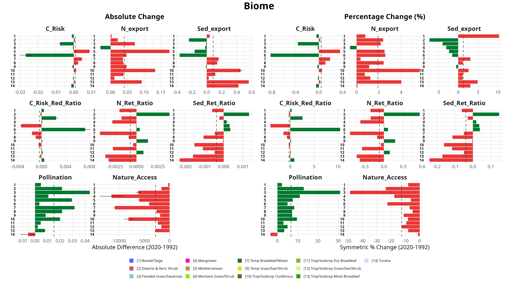{#fig-regional-trajectories .quarto-figure-center}

### Geographic Distribution by Biome

The maps below illustrate the spatial distribution of these trajectories across global biomes, highlighting relative shifts in ecosystem service provision alongside absolute volumetric change.

{#fig-faceted-biome-pct .quarto-figure-center width="100%"}

{#fig-faceted-biome-abs .quarto-figure-center width="100%"}

## Global Hotspot Distribution
At the grid scale, we identified 252,215 unique cells experiencing at least one extreme ecosystem service hotspot (19.37% of evaluated cells). These zones exhibit intense geographic clustering. When evaluated across ecological contexts, Mangroves stand out as the most severely impacted biome: coastal risk service hotspots are concentrated at approximately 15× the expected intensity given their global area (C_Risk: 15.25×; C_Risk_Red_Ratio: 15.19×), while terrestrial services such as pollination and nature access show approximately 2× the expected intensity. Averaged across all eight services, Mangroves experience roughly 5× the expected hotspot intensity—though this aggregate masks a strongly bimodal distribution driven by extreme coastal vulnerability. (Detailed geographic breakdowns of these epicenters by World Bank Region—where Latin America and East Asia dominate—and by Income Group are provided in the Annex).

::: {#fig-hotspot-dist}
{width="100%"}

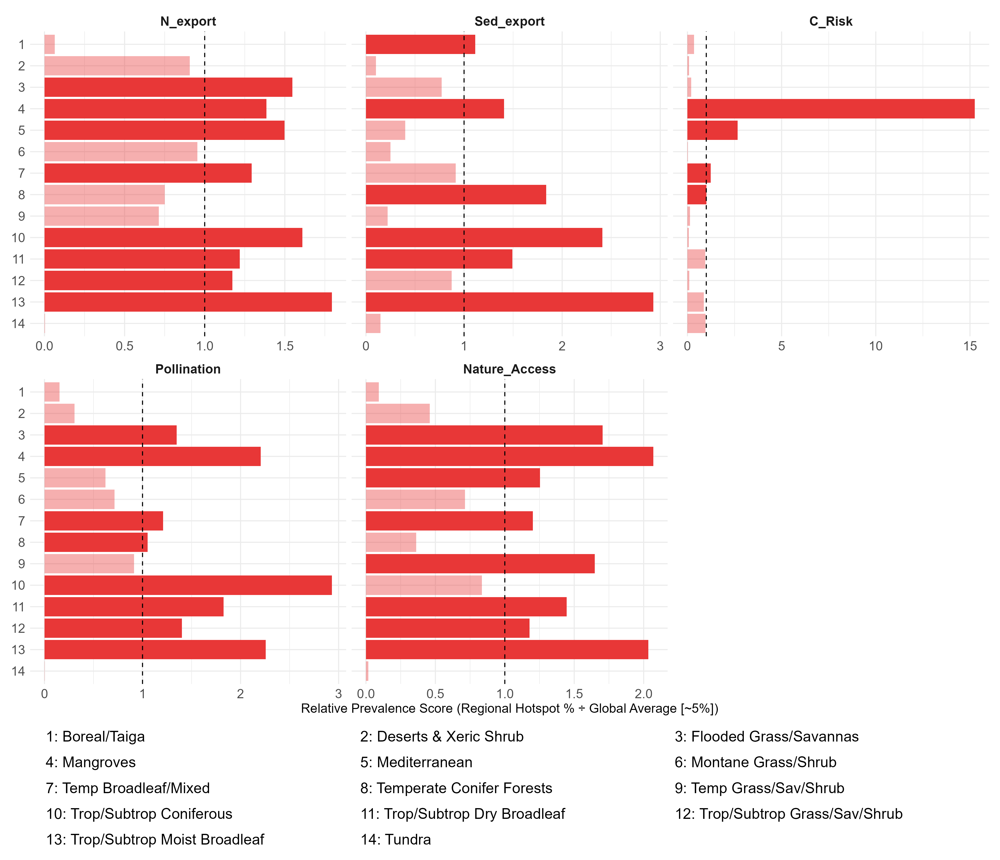{width="100%"}

{width="100%"}

Global Compound Risk (Hotness) and Relative Intensity. The map (top) shows the count of overlapping negative hotspots per 10km cell. The middle panel shows disproportionate biome burden; the bottom panel shows that lower-middle income countries bear the highest compound risk intensity relative to their land area.
:::

### Hotspot Magnitude by Biome
Beyond identifying where hotspots are, we analyze the magnitude of change within them. The Symmetric Percentage Change (SPC) show significant variation across both ecosystem services and biophysical contexts. The variation highlights how different ecological foundations experience relative extremes. (Analysis of magnitude variation across socioeconomic strata is available in the Annex).

::: {#fig-boxplots-biome}
{width="100%"}

{width="100%"}

Distribution of Hotspot Magnitudes. The boxplots show the distribution of Symmetric Percentage Change (SPC) values for cells identified as hotspots, broken down by biome. This highlights how the intensity of change within hotspots varies across different ecological contexts.
:::

## Socioeconomic Profiling: KS Diagnostics
{#fig-socioeconomic-context .quarto-figure-center}

The spatial KS tests reveal that 39 out of 40 service-by-covariate combinations (97.5%) show highly significant distributional differences between hotspot and background populations ($p < 0.05$ after strict FDR correction). The single non-significant result is Coastal Risk Reduction Ratio versus agricultural plot intensity (C_Risk_Red_Ratio × fields_mehrabi; $p_{\text{adj}} = 0.48$; Cliff’s Delta ≈ 0.001), indicating genuine decoupling — not a sample size issue — between coastal protection hotspots and small-plot agricultural landscapes.

Two characteristics are universal across all service types: hotspot cells consistently occur in areas with higher population density (Cliff’s Delta: +0.47 to +0.66) and higher total GDP (+0.49 to +0.67) than the matched background landscape (@tbl-cliffs-delta). These are structural features of where ecosystem services matter to human populations, not distinguishing properties of any particular service type.

The service-specific typology emerges from the **direction** of HDI and income inequality (GINI) enrichment, which diverge markedly across service categories:

* **Higher-development typology — Coastal services:** *Coastal Protection* and *Coastal Risk Reduction Ratio* hotspots occur in distinctly higher-HDI contexts (CD: +0.29 to +0.30), consistent with economically developed coastal zones where built infrastructure and urban expansion are the most plausible drivers of habitat loss.
* **Lower-development, higher-inequality typology — Terrestrial provisioning and export services:** *Pollination*, *Nature Access*, *Sediment Export*, and *Nitrogen Export* hotspots are associated with lower HDI (CD: −0.01 to −0.08) and markedly higher income inequality (GINI CD: +0.22 to +0.30), indicating that communities most exposed to these declines tend to live in less economically developed, more unequal contexts.
* **Intermediate typology — Hydrological retention ratios:** *Nitrogen Retention Ratio* and *Sediment Retention Ratio* hotspots show moderately higher HDI (+0.18 to +0.19) alongside notably *lower* GINI (−0.11 to −0.18), a distinct pattern that neither of the above typologies captures.

Notably, agricultural plot intensity (fields_mehrabi) does not distinguish these typologies: Cliff’s Delta values are near zero across all services (range: −0.09 to +0.11). Pollination — the service most intuitively linked to agricultural contexts — shows a near-zero, slightly negative agricultural enrichment (CD = −0.008), and the provisioning services that make up the "lower-development" typology are differentiated by inequality and HDI context, not by farm-structure characteristics.

```{r}
#| label: tbl-cliffs-delta
#| tbl-cap: "Cliff’s Delta effect sizes for hotspot versus matched background cells across all service-covariate combinations. Positive values indicate hotspot cells have higher covariate values; negative values indicate lower. Asterisks denote FDR-adjusted significance (\\*\\*\\* p<0.001, \\*\\* p<0.01, \\* p<0.05, ns p≥0.05)."
#| echo: false

library(dplyr)
library(tidyr)
library(readr)
source("../../R/paths.R")

ks_raw <- read_csv(
  file.path(data_dir(), "processed", "tables", "ks_results_hot_vs_non.csv"),
  show_col_types = FALSE
)

var_labels <- c(
  GHS_POP_E2020_GLOBE_sum                  = "Population",
  rast_gdpTot_1990_2020_30arcsec_2020_sum  = "GDP (total)",
  hdi_raster_predictions_2020_mean         = "HDI",
  rast_adm1_gini_disp_2020_mean            = "GINI",
  fields_mehrabi_2017_mean                 = "Field size"
)

service_order <- c("C_Risk", "C_Risk_Red_Ratio",
                   "N_Ret_Ratio", "Sed_Ret_Ratio",
                   "Pollination", "Nature_Access", "Sed_export", "N_export")

cd_wide <- ks_raw %>%
  filter(var %in% names(var_labels)) %>%
  mutate(
    Variable = var_labels[var],
    sig = case_when(
      p_adj < 0.001 ~ "***",
      p_adj < 0.01  ~ "**",
      p_adj < 0.05  ~ "*",
      TRUE          ~ "ns"
    ),
    cell = paste0(sprintf("%+.2f", round(cliffs_delta, 2)), sig)
  ) %>%
  select(service, Variable, cell) %>%
  pivot_wider(names_from = Variable, values_from = cell) %>%
  filter(service %in% service_order) %>%
  arrange(match(service, service_order)) %>%
  rename(Service = service) %>%
  select(Service, Population, `GDP (total)`, HDI, GINI, `Field size`)

if (requireNamespace("knitr", quietly = TRUE)) {
  knitr::kable(cd_wide, align = c("l", rep("c", 5)))
}
```

::: {#fig-ks-diagnostics}
{width="100%"}

{width="100%"}

Socioeconomic profiling of hotspots. The KS statistic heatmap (top) quantifies the magnitude of difference between hotspot and background populations, while the Cliff's Delta plot (bottom) shows the direction of that difference.
:::

## Population Exposure and the Serviceshed Multiplier Effect
We estimate that approximately 7.6 billion people (7,596.0 million)—representing 96.7% of the global population as captured in the GHSL-POP 2020 dataset—live within, or depend directly upon, the spatial footprint of these hotspots or their connected servicesheds. While upper-middle-income countries encompass the largest absolute volume of exposed citizens, lower-middle-income countries experience the highest relative hotspot intensity—experiencing an exposure profile roughly 1.6 times more severe than OECD nations. Low-income populations account for approximately 12.4% of the total affected people.

Crucially, when expanding our analysis from Local Residents (5,286.2 million people living directly within hotspots) to Connected Beneficiaries further away, we observe variations depending on the pathway of service delivery. By tracing down-gradient hydrological flow paths, we identify 6,420.1 million downstream beneficiaries reliant on these affected upstream locations. When evaluating the access-based travel footprint (populations relying on nature access and wild pollination within reachable distances), the reliant population expands to 7,401.2 million individuals. This reveals a profound Multiplier Effect: the vulnerable population balloons by nearly 1.4x when accounting for physical access, and is 1.15 times larger globally than populations living directly downstream. This multiplier underscores how highly localized environmental degradation cascades into extensive regional vulnerabilities, extending far beyond the immediate demographic footprint (Brauman et al., 2007; Keeler et al., 2012).

To evaluate how this multiplier behaves under escalating ecological failure, we grouped the populations by their localized **Compound Risk**—ranging from cells experiencing at least one service decline up to those facing catastrophic, simultaneous failure of four or more services. The purpose of this aggregated analysis is to test whether intense, overlapping environmental crises remain geographically contained. 

The resulting Compound Risk dumbbell chart (plotted on a logarithmic scale) unequivocally demonstrates that they do not. Even in the rarest, most severely degraded landscapes ($\ge 4$ overlapping hotspots), the number of Connected Beneficiaries remains logarithmically larger than the in-situ Local Residents. The persistent multiplier gap across all risk tiers shows that compounding environmental decline projects systemic vulnerabilities far down-gradient and across broader travel networks, threatening populations that do not reside within the degraded zones themselves. 

::: {#fig-multiplier-compound}
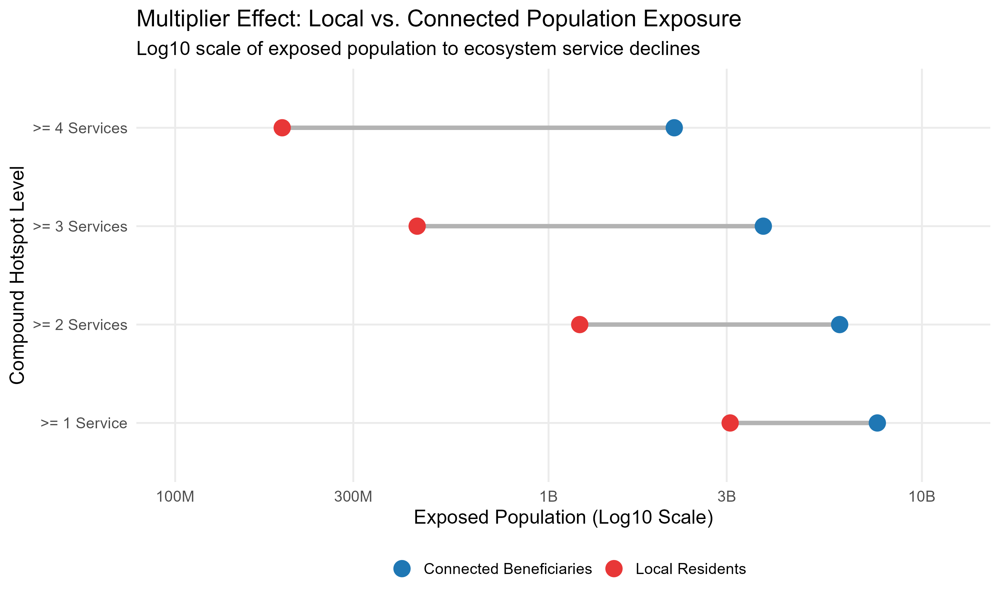{width="100%"}

Serviceshed Multiplier Effect by Compound Risk. The chart tracks how population exposure scales logarithmically across locations experiencing 1, 2, 3, or 4+ simultaneous ecosystem service declines. (Detailed multiplier breakdowns faceted by Biome and Income Group are available in the Annex).
:::

## The Spatial Attribution Gap
To assess whether extreme ecosystem service decline co-occurs with extreme land cover conversion, we compared ES hotspot cells (top 5% of SPC change per service) against land cover conversion hotspot cells (top 5% of gross conversion magnitude per driver) within the same 10km equal-area grid. This symmetric threshold design is critical to interpreting the result: under spatial independence, only ~5% of ES hotspot cells would be expected to fall within LCC hotspot zones by chance. The observed co-occurrence of **24%** is therefore approximately 4–5× above random expectation, confirming a real spatial association between extreme ecosystem service decline and extreme land cover conversion where it does occur. The dominant co-occurring transitions are forest conversion (19.8%), cropland expansion (19.0%), and grassland loss (7.7%)—individual percentages sum above 24% because many cells coincide with multiple transition types simultaneously.

Nevertheless, the remaining **76% of ES hotspot cells do not co-occur with extreme land cover conversion** at 300m resolution, constituting a substantial spatial attribution gap. This does not imply those cells experienced zero land cover change; some may have undergone moderate conversion below the top-5% threshold. What it shows is that the most severe ecosystem service declines are not predominantly located in the same cells as the most severe categorical conversions. The gap is consistent with mechanisms that produce functional decline without triggering a categorical reclassification in the same cell at 300m: sub-pixel in-situ degradation, upstream routing cascades from conversion in adjacent cells, and climate-driven shifts in model inputs. Whether this reflects sub-pixel degradation, upstream routing cascades, climate-forcing, or some combination cannot be determined from this co-occurrence analysis alone; the Discussion addresses what controlled experiments would be required to partition these contributions.

```{r}
#| label: tbl-attribution-drivers
#| tbl-cap: "Dominant Land Cover Transitions Intersecting Ecosystem Service Hotspots"
#| echo: false

driver_overlap <- data.frame(
  `Land Cover Transition` = c("Forest Conversion", "Cropland Expansion", "Grassland Loss", "Attribution Gap (No Extreme LCC Co-occurrence)"),
  `Overlap with Hotspots` = c("19.8%", "19.0%", "7.7%", "76.0%"),
  check.names = FALSE
)
if (requireNamespace("DT", quietly = TRUE)) {
  DT::datatable(
    driver_overlap,
    options = list(dom = 't', paging = FALSE, searching = TRUE),
    rownames = FALSE
  )
} else {
  knitr::kable(driver_overlap, align = c("l", "r"))
}
```
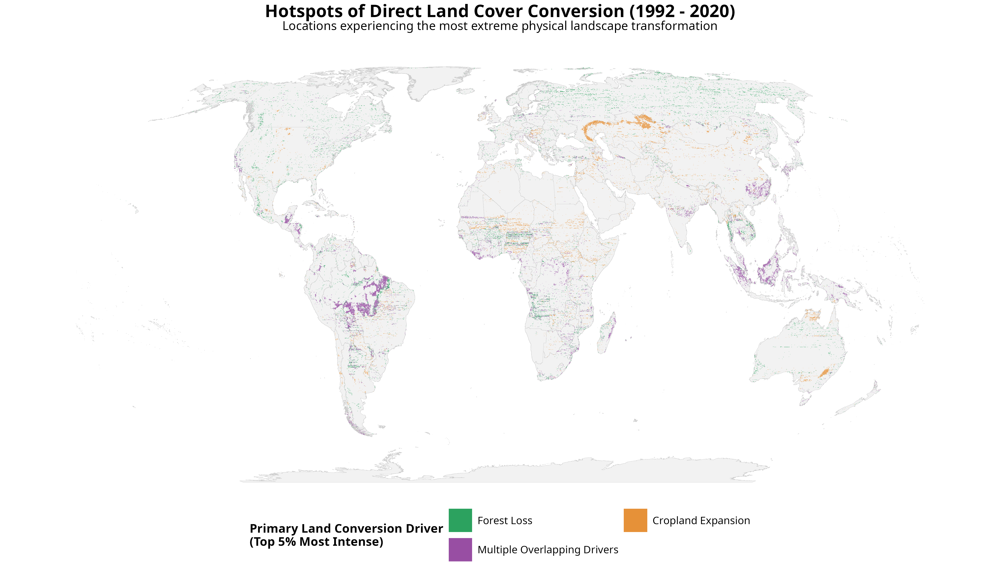{#fig-lcc-drivers .quarto-figure-center width="100%"}

::: {#fig-attribution-comparison layout-ncol=2}
{width="100%"}

{width="100%"}

Visualizing the Spatial Attribution Gap. The map on the left shows the total footprint of extreme ecosystem service decline. The map on the right isolates only the locations where those service declines spatially intersect with severe land cover conversion. The stark difference between the two footprints visually demonstrates the 76% attribution gap.
:::

{#fig-attribution-gap .quarto-figure-center}

---

# Discussion

## Geographic Clustering Enables Prioritization
The intense geographic concentration of hotspots within Latin America and East Asia shows that global ecosystem service decline is highly non-uniform, identifying clear priorities for conservation investment. Targeted interventions in high-intensity nations—such as South Korea, Malaysia, Guatemala, and Jamaica—can maximize conservation return on investment. However, because hotspot configurations vary significantly by service type, uniform conservation frameworks are unlikely to perform; interventions must be tailored to the specific service profiles of each sub-region.

## Differentiated Vulnerability Tiers
Socioeconomic profiling confirms that global environmental decline operates through distinct exposure pathways that cannot be managed uniformly. All hotspot types are concentrated in areas with substantially higher population density and total GDP than the matched background landscape (Cliff's Delta: +0.47 to +0.67), demonstrating that ecosystem service decline is not confined to remote or sparsely populated areas. The divergence emerges along development and inequality dimensions: coastal service hotspots (loss of coastal protection and risk buffering) occur disproportionately in higher-HDI settings (CD: +0.29 to +0.30), consistent with more economically developed zones where built infrastructure expansion is the plausible driver of habitat displacement. By contrast, terrestrial provisioning and export service hotspots (pollination decline, nature access loss, nitrogen and sediment export increases) cluster in lower-HDI, higher-inequality contexts (HDI CD: −0.01 to −0.08; GINI CD: +0.22 to +0.30), indicating that the populations most exposed to these losses tend to be less economically developed and more socially vulnerable. Conservation strategies must therefore be calibrated to these distinct socioeconomic realities rather than assuming a uniform exposure profile.

## Attribution Analysis: Land Cover Change as a Partial Explanatory Signal

Seventy-six percent of hotspot cells do not co-occur with extreme (top 5%) land cover conversion at 300-meter resolution—many may still have undergone moderate LCC below that threshold. This finding challenges the assumption that macro-scale land conversion serves as an adequate proxy for ecosystem service change and suggests that mechanisms including sub-pixel degradation, upstream routing cascades, and climate forcing contribute substantially to observed functional decline even where categorical reclassification cannot be detected. We emphasize, however, that this attribution analysis identifies **spatial co-occurrence** between hotspots and LCC drivers, not causal attribution. An important structural limitation is that ESA CCI land cover data serves simultaneously as a primary input to the InVEST biophysical models and as the basis for the LCC overlay analysis. This endogeneity means the gap cannot be interpreted as an independent empirical partition between degradation-driven and conversion-driven change.

::: {.callout-important}
**[QUESTION FOR BECKY — required before submission]**

The sentence above says this finding "challenges the assumption that macro-scale land conversion serves as an adequate proxy for ecosystem service change." This assumption is real and widely held in conservation policy (REDD+, 30×30, many area-based targets implicitly treat preventing land conversion as equivalent to protecting services; IPBES 2019 names LCC as the dominant ES driver), but **we never establish it in our Introduction and cite no one who makes it**. Two options:

**Option A — Drop the rhetorical framing.** Replace "challenges the assumption that…" with a direct policy statement: *"is consistent with the view that land cover monitoring alone is insufficient for detecting ecosystem service decline."* Safer, stays in our own data.

**Option B — Earn it explicitly.** Add 1–2 sentences to the Introduction establishing that land conversion is the dominant assumed driver (cite IPBES 2019, possibly a REDD+ evaluation paper), then the Discussion sentence is defensible and the finding reads as a genuine contribution. Stronger, but picks a fight we need to be ready to back up in review.

**My instinct is Option B — but which papers do you think are the right citations here? Is there a specific REDD+ or area-based-targets paper you'd point to?**
:::

With that constraint acknowledged, we identify two plausible mechanisms that could generate large attribution gaps without requiring detectable categorical transitions:

1. **Upstream Routing Cascades:** A cell's land cover classification may remain mapped as "Forest" across both temporal snapshots, while agricultural conversion or clearance upstream fundamentally alters the hydrologic routing matrix. The resulting sediment or nutrient load overwhelms downslope filtering capacity, triggering a functional hotspot of decline without any land-cover change recorded at the hotspot cell itself.
2. **Climate Forcing:** InVEST's sediment (SDR) and nutrient (NDR) models take rainfall erosivity—a measure of the kinetic energy delivered to the soil surface by precipitation events—as a direct input (the R factor in the Universal Soil Loss Equation). If precipitation intensity increased in a cell between 1992 and 2020, the 2020 model run produces higher sediment and nutrient export regardless of whether the land cover classification changed. A cell that appears stable in the categorical land-cover record can therefore generate a hotspot-level decline in modeled service provision purely through shifts in the precipitation regime (IPCC, 2021; Nearing et al., 2004). This mechanism is independent of land use and operates without leaving any detectable signal in the 300m ESA CCI classification.

::: {.callout-important}
**[QUESTION FOR BECKY — required before submission]**

Were the InVEST SDR/NDR runs for 1992 and 2020 performed with the **same** climate inputs (e.g., a single long-term-average WorldClim rainfall erosivity raster applied to both years), or with **era-specific** climate data for each year (e.g., year-matched CHELSA or ERA5 precipitation)?

**Why this matters:** If climate inputs were fixed, the Climate Forcing hypothesis above is weaker—both model runs see the same R factor, so precipitation changes cannot directly explain the attribution gap. We should then soften or remove the climate forcing mechanism from the Discussion, or restrict it to an indirect pathway. If climate inputs varied by era, the current framing is correct and the factorial experiment caveat is essential.

See `analysis/WORKLOG.md` entry 2026-06-19 for context.
:::

These hypotheses are plausible given InVEST's known sensitivity to upstream routing in hydrological services, but the current design cannot distinguish between them. The comparison embedded in this analysis—InVEST outputs driven by 1992 conditions versus outputs driven by 2020 conditions—conflates land-cover change with any concurrent shifts in climate forcing, including changes in precipitation intensity and erosivity that propagate through the routing architecture without requiring any categorical land transition. We therefore cannot rule out that the attribution gap is substantially or predominantly explained by climate-driven shifts in model inputs rather than sub-pixel degradation. Isolating these contributions would require controlled factorial experiments—running InVEST with fixed 1992 climate inputs against 2020 land cover, and vice versa—that are beyond the scope of this global assessment and constitute an explicit priority for future work. We present the attribution gap as a structured directional signal warranting targeted investigation, not a definitive mechanism assignment. The policy implication nonetheless stands: conservation strategies focused exclusively on preventing categorical deforestation may be insufficient if functional decline operates through pathways that land-cover mapping cannot detect.

## Limitations

**InVEST model applicability at global scale.** The biophysical models used here—developed and maintained by the Natural Capital Project (Sharp et al., 2020; Chaplin-Kramer et al., 2019)—were designed and validated primarily for local to regional applications where site-specific parameterization is feasible. Applying them globally without spatially explicit calibration data introduces uncertainty whose magnitude varies by service. Coastal protection (C_Risk) and nature access are structurally more robust at this scale; hydrological retention ratios (N_Ret_Ratio, Sed_Ret_Ratio) depend on routing parameterizations that carry larger uncertainty in globally-applied defaults. We do not interpret absolute modeled values as ground-truth estimates of service provision; rather, we interpret relative rankings and temporal changes in the context of what the models are designed to capture—the direction and approximate magnitude of biophysical change under land-use and climate drivers. Model ensemble approaches (Willcock et al., 2023) represent an important future direction for quantifying this structural uncertainty.

**Spatial resolution and scale of inference.** The 100 km² analysis grid supports identification of geographic patterns and regional priorities but cannot resolve site-level heterogeneity. Results are appropriate for strategic conservation planning and international policy discussions, but should not be used to identify specific sites for intervention without local-scale validation. Additionally, the Modifiable Areal Unit Problem (MAUP) means that aggregation at 100 km² may dampen or shift apparent hotspot boundaries relative to finer-resolution analyses.

**Temporal discretization.** Comparing two discrete snapshots (1992 and 2020) masks intermediate dynamics, including non-linear trajectories, recovery events, and oscillations. The analysis captures net directional change over the study period; it cannot characterize rate, timing, or reversibility of change.

**Attribution analysis as co-occurrence, not causal partition.** As discussed above, the spatial overlay between hotspots and LCC drivers identifies co-occurrence, not causation. The endogeneity of ESA CCI land cover as both an InVEST input and an attribution overlay means the attribution gap is a structured signal, not an independent empirical validation of a specific mechanism. Disentangling land-use-driven from climate-driven change within the InVEST framework would require controlled factorial experiments that are beyond the scope of this analysis and represent an explicit direction for future work.

**Socioeconomic data and population exposure.** Population exposure estimates use 2020 population grids applied to 1992–2020 ES change footprints, creating a temporal mismatch in which current populations are attributed to historical change zones. Income group and HDI classifications reflect 2020 boundaries; reclassifications over the study period are not captured. The analysis reports absolute population exposure; relative exposure (i.e., proportion of a group's population within hotspots) provides complementary information that warrants future investigation.

---

# Conclusions
This global assessment combines high-resolution biophysical models, multi-decadal satellite land cover records, and gridded socioeconomic layers to map where ecosystem service decline is most acute. Our findings show that loss is geographically concentrated in Latin America and East Asia, identifying clear priorities for international conservation investment. Socio-ecological vulnerability is deeply stratified: higher-development coastal communities and lower-development, higher-inequality populations facing terrestrial service losses represent distinct exposure profiles requiring different policy responses, and localized decline cascades substantially—reaching 6.4 billion downstream beneficiaries and expanding 1.15× further when travel-based nature access is included.

Finally, the finding that 76% of hotspot cells do not co-occur with extreme land cover conversion—those cells may still have moderate LCC, but it does not reach the top 5% threshold—suggests that strategies focused exclusively on preventing categorical deforestation may be insufficient; functional decline is occurring in areas that do not register as the most severe conversion zones by satellite observation. Whether this reflects sub-pixel degradation, upstream hydrological routing effects, climate-driven forcing, or some combination thereof remains an open empirical question that the current analytical design cannot resolve; disentangling these mechanisms is an explicit priority for future research building on this framework.

The global scope of this analysis is an implementation choice rather than an architectural constraint. The same open-source pipeline is directly reusable for regional analyses—targeting areas such as the Amazon basin, Southeast Asia, or sub-Saharan Africa—with locally-calibrated InVEST inputs and higher-resolution rasters, yielding greater spatial fidelity than global defaults provide. Additional time points and service variables can be incorporated by extending the extraction and synthesis steps without modifying the core pipeline structure, making multi-temporal and multi-service analyses tractable as data availability improves.

While this paper focuses on macro-regional patterns, the spatial extraction pipeline developed here—aggregating millions of 300m grid observations into multidimensional group-level summaries—provides an open-source foundation adaptable to locally-focused, equity-centered policy applications.

---

# References

- Andam, K. S., Ferraro, P. J., Pfaff, A., Sanchez-Azofeifa, G. A., & Robalino, J. A. (2008). Measuring the effectiveness of protected area networks in reducing deforestation. *Proceedings of the National Academy of Sciences*, 105(42), 16089–16094.
- Benjamini, Y., & Hochberg, Y. (1995). Controlling the false discovery rate: A practical and powerful approach to multiple testing. *Journal of the Royal Statistical Society: Series B (Methodological)*, 57(1), 289–300.
- Berry, D. A., & Ayers, G. D. (2006). Symmetrized percent change for treatment comparisons. *The American Statistician*, 60(1), 27-31.
- Cliff, N. (1993). Dominance statistics: Ordinal analyses to answer ordinal questions. *Psychological Bulletin*, 114(3), 494–509.
- Crossman, N. D., Burkhard, B., Nedkov, S., Willemen, L., Petz, K., Palomo, I., ... & Bagstad, K. J. (2013). A blueprint for mapping and modelling ecosystem services. *Ecosystem Services*, 4, 4–14. https://doi.org/10.1016/j.ecoser.2013.02.001
- Brauman, K. A., Daily, G. C., Duarte, T. K. E., & Mooney, H. A. (2007). The nature and value of ecosystem services: an hydrological perspective. *Annual Review of Environment and Resources*, 32(1), 67-98.
- Chaplin-Kramer, R., Sharp, R. P., Mandle, L., Sim, S., Johnson, J. A., Mueller, I., ... & Daily, G. C. (2019). Global modeling of nature’s contributions to people. *Science*, 366(6462), 255-258.
- Daily, G. C., Polasky, S., Goldstein, J., Kareiva, P. M., Mooney, H. A., Pejchar, L., ... & Shallenberger, R. (2009). Mainstream conservation into practical decisions. *Frontiers in Ecology and the Environment*, 7(1), 21-28.
- European Space Agency (ESA). (2017). *Climate Change Initiative (CCI) Land Cover Maps*. https://climate.esa.int/en/projects/land-cover/
- Fedele, G., Donatti, C. I., Bornacelly, I., & Hole, D. G. (2021). Nature-dependent people: Mapping human direct reliance on ecosystem services globally. *Global Environmental Change*, 71, 102368.
- IPBES. (2019). *Global assessment report on biodiversity and ecosystem services of the Intergovernmental Science-Policy Platform on Biodiversity and Ecosystem Services*. IPBES secretariat, Bonn, Germany.
- IPCC. (2021). *Climate Change 2021: The Physical Science Basis. Contribution of Working Group I to the Sixth Assessment Report of the Intergovernmental Panel on Climate Change* (Masson-Delmotte, V., et al., Eds.). Cambridge University Press. https://doi.org/10.1017/9781009157896
- Nearing, M. A., Pruski, F. F., & O'Neal, M. R. (2004). Expected climate change impacts on soil erosion rates: A review. *Journal of Soil and Water Conservation*, 59(1), 43–50.
- Keeler, B. L., Polasky, S., Brauman, K. A., Johnson, J. A., Finlay, J. C., O'Neill, A., ... & Dalzell, B. (2012). Linking water quality and human well-being on a global scale. *Proceedings of the National Academy of Sciences*, 109(45), 18619-18624.
- Millennium Ecosystem Assessment. (2005). *Ecosystems and Human Well-being: Synthesis*. Island Press, Washington, DC.
- Lin, M., Lucas, H. C., & Shmueli, G. (2013). Too big to fail: Large samples and the p-value problem. Information Systems Research, 24(4), 905-917.
- Murray, N. (2017). Global 10 x 10-km grids suitable for use in IUCN Red List of Ecosystems assessments (vector and raster format) (p. 135013975 Bytes) [Dataset]. figshare. https://doi.org/10.6084/M9.FIGSHARE.4653439
- Naidoo, R., Balmford, A., Costanza, R., Fisher, B., Green, R. E., Lehner, B., ... & Ricketts, T. H. (2008). Global mapping of ecosystem services and conservation priorities. *Proceedings of the National Academy of Sciences*, 105(28), 9495–9500. https://doi.org/10.1073/pnas.0707823105
- Pontius, R. G., & Millones, M. (2011). Death to Kappa: birth of quantity disagreement and allocation disagreement for accuracy assessment. *International Journal of Remote Sensing*, 32(15), 4407-4429.
- Pontius Jr, R. G. (2022). Metrics That Make a Difference: How to Analyze Change and Error. Springer International Publishing. https://doi.org/10.1007/978-3-030-70765-1.
- Sharp, R., Douglass, J., Wolny, S., Arkema, K., Bernhardt, J., Bierbower, W., ... & Wyatt, K. (2020). *InVEST User’s Guide*. The Natural Capital Project, Stanford University, University of Minnesota, World Wildlife Fund, and The Nature Conservancy.
- Sherman, L., Proctor, J., Druckenmiller, H., Tapia, H., & Hsiang, S. (2026). [Gridded HDI predictions]. *Nature Communications*. https://doi.org/10.1038/s41467-026-68805-6 [**Full title and DOI to be verified by co-authors before submission**]
- Sullivan, G. M., & Feinn, R. (2012). Using effect size—or why the p value is not enough. Journal of Graduate Medical Education, 4(3), 279-282.
- Vancutsem, C., Achard, F., Pekel, J. F., Vieilledent, G., Carboni, S., Simonetti, D., ... & Eva, H. D. (2021). Long-term (1990–2019) forest degradation and deforestation in the moist tropics of South Asia, Southeast Asia and Latin America. *Nature*, 591(7848), 115-122.
- Willcock, S., Hooftman, D., Balbi, S., Blanchard, R., Dawson, T. P., Hickler, T., ... & Bullock, J. M. (2023). Model ensembles of ecosystem services fill global certainty and capacity gaps. *Science Advances*, 9(1), eadd0141. https://doi.org/10.1126/sciadv.add0141

---

# Annex: Supplemental Figures

This annex contains supplemental figures that provide additional detail and context for the analyses presented in the main body of the paper.

## Regional Trajectories by World Bank Region

::: {#fig-annex-wb-trajectories layout-ncol=1}


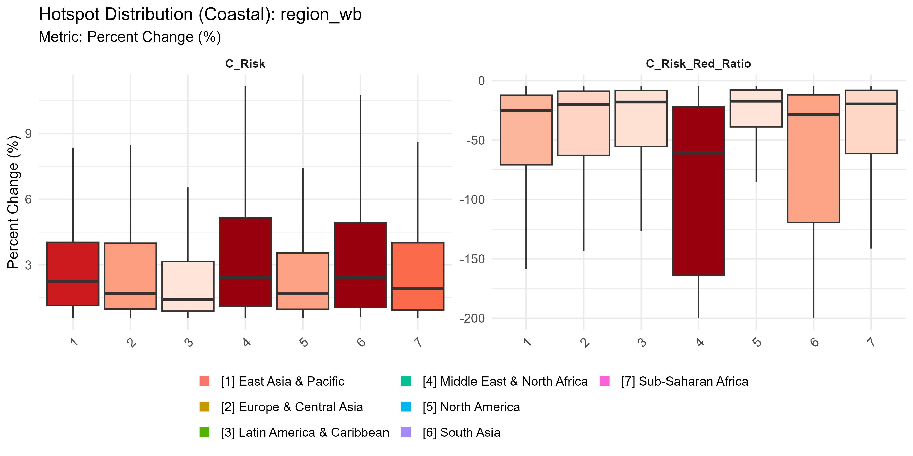
:::

```{r}
#| label: tbl-regional-intensity
#| tbl-cap: "Relative Intensity of Ecosystem Service Hotspots by World Bank Region"
#| echo: false

region_data <- data.frame(
  `World Bank Region` = c("Latin America & Caribbean", "East Asia & Pacific", "South Asia", "Sub-Saharan Africa", "Europe & Central Asia"),
  `Relative Intensity (Enrichment)` = c("1.40×", "1.30×", "0.80×", "0.78×", "0.65×"),
  check.names = FALSE
)
if (requireNamespace("DT", quietly = TRUE)) {
  DT::datatable(
    region_data,
    options = list(dom = 't', paging = FALSE, searching = TRUE),
    rownames = FALSE
  )
} else {
  knitr::kable(region_data, align = c("l", "c"))
}
```

## Regional Trajectories by Income Group

::: {#fig-annex-inc-trajectories layout-ncol=1}
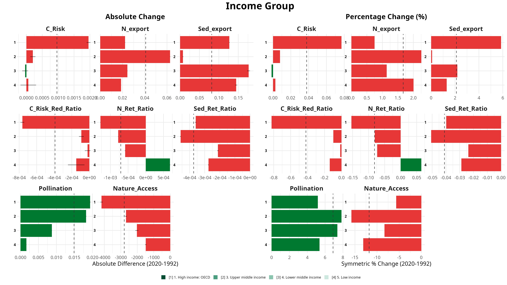


:::

## Geographic Distribution by Country

::: {#fig-annex-country-trajectories layout-ncol=1}
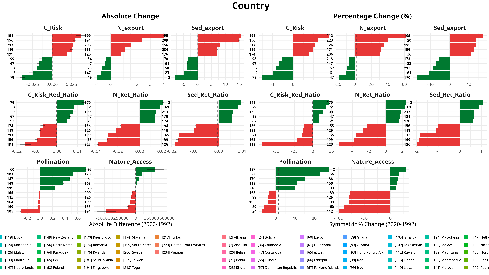

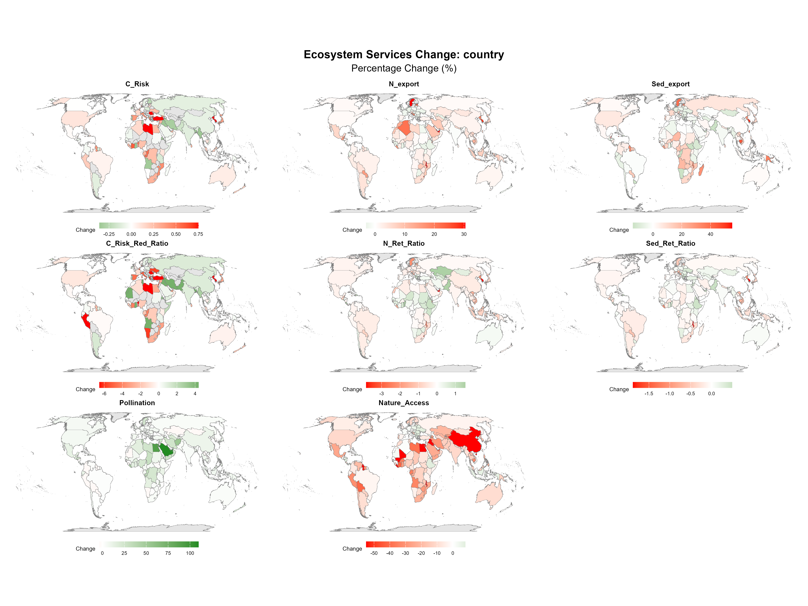

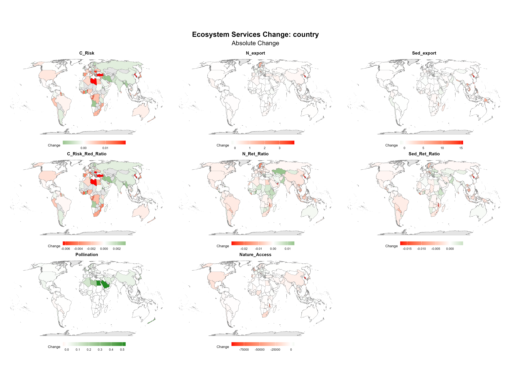
:::

## Serviceshed Multiplier Effect Breakdowns

::: {#fig-annex-multiplier layout-ncol=1}
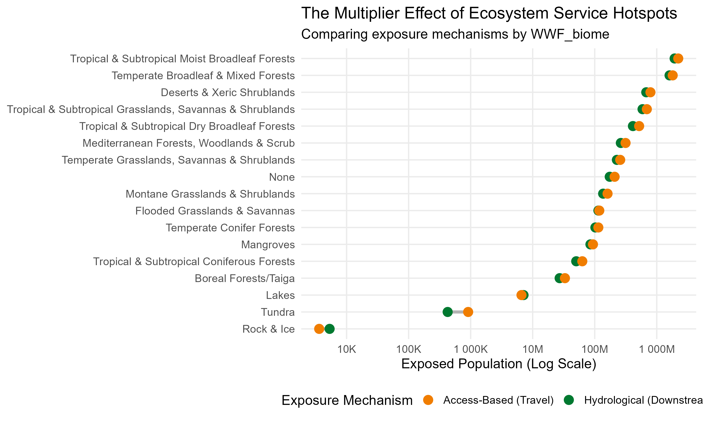

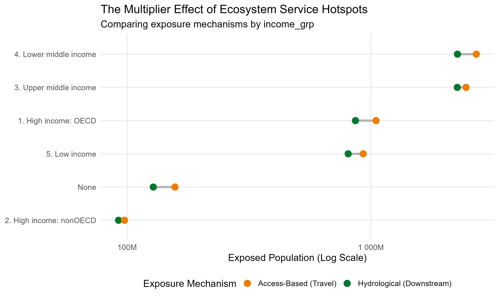
:::