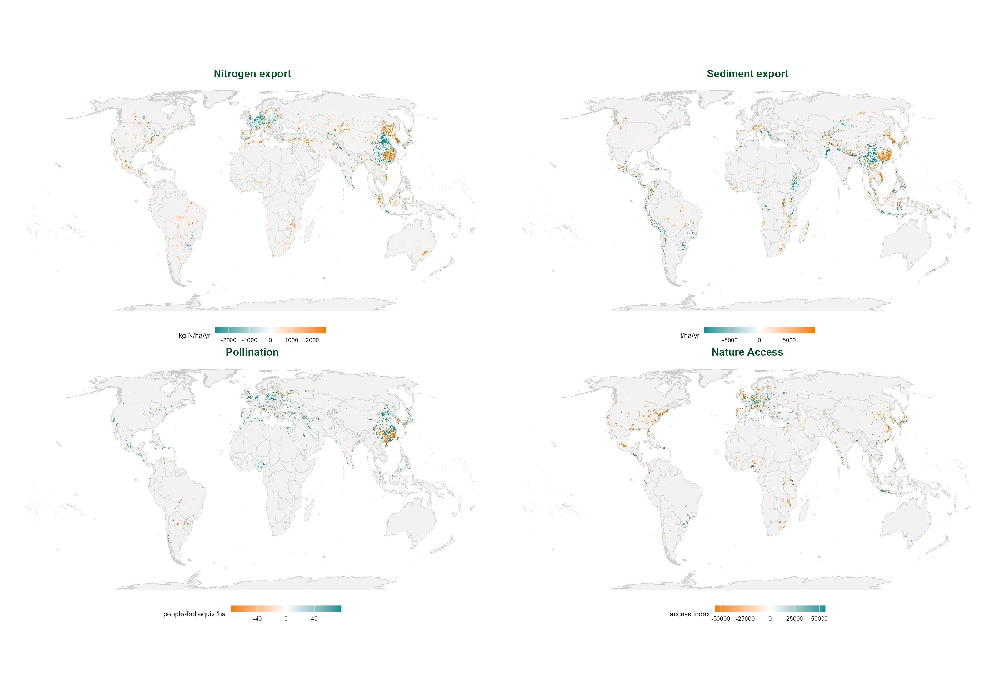
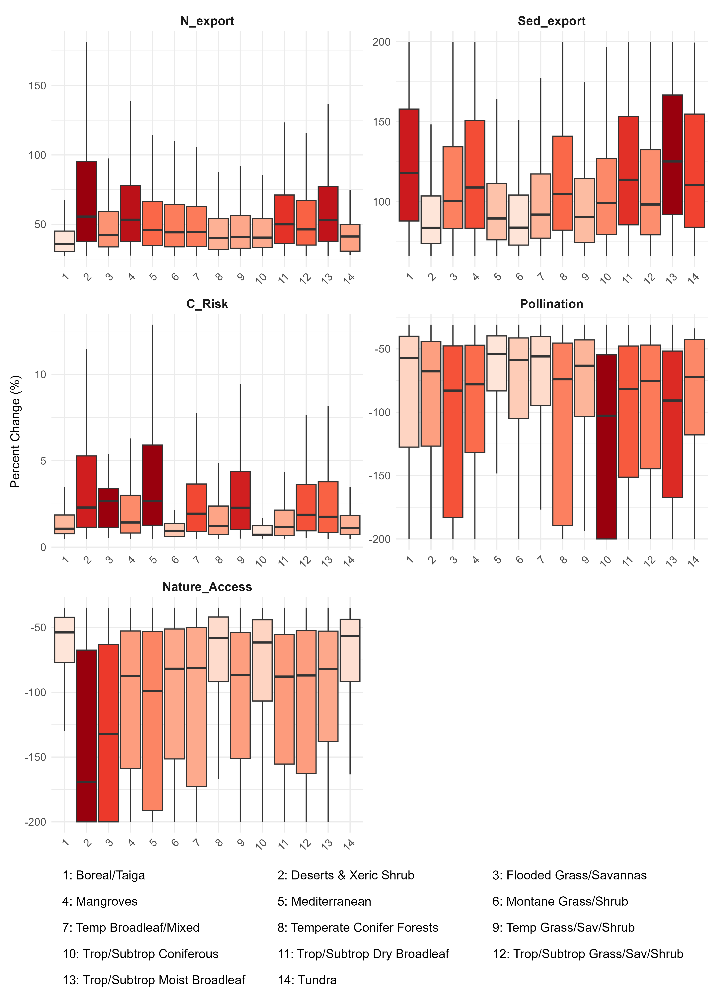
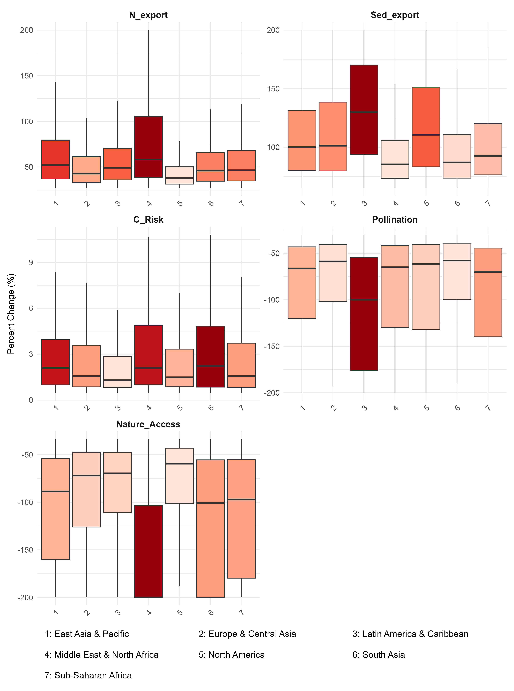
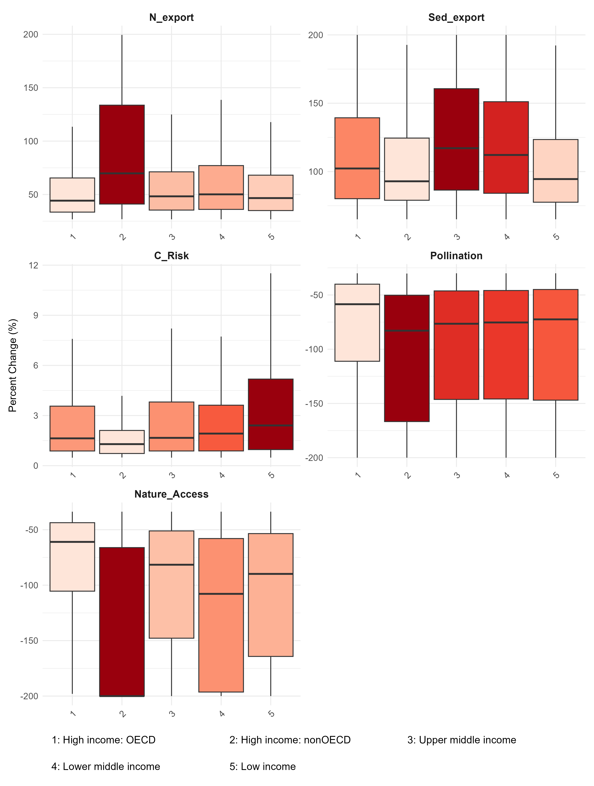

::: {.content-visible when-format="docx"}
# Global Change in Ecosystem Services: Hotspots of Decline, Exposure, and Attribution {.unnumbered}

### 5-Service Redesign Draft — IN PROGRESS, not for circulation {.unnumbered}

**Jerónimo Rodríguez Escobar, Becky Chaplin-Kramer, Richard P. Sharp, Stephen Polasky, Justin Johnson, [Additional Authors TBD]**

<!-- Manual title block, docx-only: quarto's docx writer doesn't render YAML title/subtitle/
author as visible body text the way html does (confirmed 2026-09-02) -- without this, the
document opens with no visible title at all. HTML gets its title block from the YAML directly,
so this stays docx-only to avoid a duplicate heading there. -->

> **A note on this draft's formatting:** throughout this document, shaded blocks in italic gray text — like this one — are questions, open items, or notes to reviewers, not part of the paper itself. The regular (non-shaded, non-italic) text below is the actual manuscript.
:::

> **Note:** **Status (2026-09-03): reverted to export/risk framing — Becky overrode Steve's retention/protection suggestion, Path B rerun complete under the reverted definition.**
>
> **Settled, again**: nitrogen, sediment, and coastal are defined as export/risk *residuals*
> (Nitrogen Export, Sediment Export, Coastal Risk) — the pre-2026-08-28 scheme — not retention/protection amounts. Becky's stated reasoning (Slack, 2026-09-02): "the change in export is the thing people actually experience," and a retention amount can shift because of what happens on *other* pixels upstream/downstream, which is confusing to interpret. Retention/reduction ratios return to a secondary/context role, same as before Steve's suggestion — never part of the hotspot definition either way.
>
> **Updated to match**: `R/service_config.R` (the single source of truth every downstream script reads from) flipped back; the full Path B chain — hotspot extraction, spatial synthesis, KS diagnostics, attribution-gap — rerun end to end under the reverted definition; every map/figure that depends on the service list regenerated. Methods (Biophysical Modeling, Hotspot Identification exclusion rationale), Global Pattern of Change, Global Hotspot Distribution, Hotspot Magnitude by Biome, Socioeconomic Profiling/KS Diagnostics, Discussion, Conclusions, and the Annex Spatial Attribution Gap section now carry real numbers from this reverted rerun (189,932 hotspot cells, 63.3% attribution gap, real regional/biome/income intensity figures — see `docs/pipeline_reference.md` and `docs/manuscript/becky_steve_feedback_plan.md`'s "REVERSAL" section for the full derivation and history).
>
> **No longer `[TBD]`**: the Abstract's multiplier-effect figure (billions of connected beneficiaries) is filled in and confirmed current — Rich's existing beneficiary-buffer output was run against the export/risk hotspot definition, which the reversal restores exactly, so it needs no rerun (see the Population Exposure section's own note). **Still thin**: Section 4.1's narrative text (the paragraphs around the Global Pattern of Change map) — the map itself is current, the prose around it hasn't had the "substantially expand the narrative" pass Becky/SP19 asked for. The mangroves absolute-vs-relative decoupling explanation (a finding, not yet a sentence in the paper) is also still outstanding.
>
> **Still blocked**: Figure 2 and its region/income-group/country siblings — those need pixel-level ("Path A") rasters; conveniently, that figure was never updated to the retention framing in the first place, so it already reflects export/risk and needs no further change for *this* reversal, only fresher raw rasters from Rich (a separate, still-open request). The new risk/service map grid Becky requested is also still blocked, on a pollination-sufficiency data question sent to Becky/Justin 2026-08-21, not yet answered. Per-service model-mechanics detail (Nature Access, Pollination, Coastal Risk in Methods) is still thin — legitimate to write without Becky's input (public InVEST methodology, not run-specific parameters) but not yet done. The aggregate hotspot rasters sent toward Rich (`hotspot_count`, water/access/combined_cross) still reflect the retention/protection set and need regenerating under the reverted definition — no rush, per the plan doc, since Rich doesn't need them right now.
>
> **Still genuinely open, needs a live conversation with Becky, not resolved here**: sediment retention vs. retention-ratio tradeoffs, and "directionality ambiguity" in the change signal — Becky's own point that a pixel's export/retention change can reflect redistribution (upstream/downstream shift) rather than a real local net gain/loss. Not guessed at in this text.

# Abstract {.unnumbered}

> **Warning:** **Updated 2026-09-03, following the reversion to export/risk framing.** All four
> headline figures below are now real, computed from the reverted Path B rerun (`docs/pipeline_reference.md`
> has the full derivation of each). The multiplier-effect figure is Rich's existing beneficiary-buffer
> output, confirmed current: it was run against the export/risk hotspot definition, which the reversal
> restores exactly, so no rerun on his side was needed.

The majority of ecosystem services, the contributions that nature makes to human well-being, are declining globally. We analyze regional trajectories and localized changes for five biophysical service variables — nitrogen export, sediment export, coastal risk, pollination, and nature access — across 1.30 million 100 km² equal-area grid cells worldwide between 1992 and 2020. Combining InVEST (Integrated Valuation of Ecosystem Services and Tradeoffs) biophysical models, European Space Agency Climate Change Initiative (ESA CCI) land cover records, and gridded socioeconomic covariates, we identify 189,932 grid cells experiencing at least one extreme ecosystem service decline hotspot (defined as the most intense 5% of grid cells by rank for relative change, calculated via Symmetric Percentage Change per service).

Our analysis reveals three primary systemic trends: (1) geographic clustering of multi-service hotspots predominantly within Latin America and the Caribbean and East Asia and Pacific; (2) a "multiplier effect" in human exposure, where highly localized declines cascade to affect over 7.6 billion connected beneficiaries (96.7% of the evaluated global population) via downstream and travel-access dependencies, with lower-middle-income nations experiencing roughly 1.8 times higher localized intensity than high-income OECD countries; and (3) a wide spatial attribution gap, where approximately 63.3% of identified hotspots show no co-occurrence with extreme (top 5%) land cover conversion at 300-meter resolution — indicating that categorical land-cover monitoring, while a reliable signal where it is present, is insufficient on its own for comprehensively tracking ecosystem service decline. These findings call for targeted, context-specific conservation strategies that account for geographic concentration, compounding downstream exposure, and drivers beyond categorical deforestation.

**Keywords:** Ecosystem services, Spatial hotspots, Land-use change, Socioeconomic profiling, Nature futures, Global assessment

---

# Introduction

Ecosystem services represent the structural components, biophysical functions, and ecological processes through which ecosystems generate benefits for human societies (Daily et al., 2009). Despite their foundational role in supporting global economic stability, food security, climate resilience, human health and well-being, ecosystem services are undergoing systemic declines worldwide (Millennium Ecosystem Assessment, 2005; IPBES, 2019; Brauman et al., 2020), with declining provision falling disproportionately on populations with limited adaptive capacity (Millennium Ecosystem Assessment, 2005; IPBES, 2019; Fedele et al., 2021). 

Prior global assessments (Millennium Ecosystem Assessment, 2005; IPBES, 2019; Brauman et al., 2020; Chaplin-Kramer et al., 2019; Fedele et al., 2021) have established that ecosystem services are declining and that this decline threatens human well-being. But to date, no study has provided a quantitative global analysis of trends in ecosystem services using consistent data and methods. Related recent work (Kim et al., 2024; Peng et al., 2023) relies on reconstructed historical data or an aggregate supply-demand balance framing, rather than directly observed measurement. This paper addresses that gap directly. We analyze global and regional trajectories of ecosystem service change using consistent data and methods spanning 1992–2020, and show a declining trend in the services assessed. We confirm that decline concentrates geographically rather than occurring uniformly, and quantify the scale of that concentration, identifying local hotspots of decline and measuring how disproportionately they cluster across ecological, economic, and political groupings. We show who is most exposed to these declines: populations with limited adaptive capacity. Finally, we assess why declines occur, testing what share of ecosystem service decline co-occurs with detectable land cover conversion, and what that implies about the limits of land cover monitoring as a proxy for ecosystem service health.

This study addresses four structurally linked research questions:

1. **WHAT** — What are the global and macro-regional trajectories of ecosystem service provision change between 1992 and 2020?
2. **WHERE** — Where is decline most geographically concentrated, and which regions and income groups bear disproportionate exposure?
3. **WHO** — Which socioeconomic contexts are most associated with intense ES decline, and how does the scale of exposure change when downstream and travel-connected beneficiaries are included?
4. **WHY are ecosystem services declining** — What proportion of Ecosystem service decline co-occurs with with satellite-detected land cover conversion, and what other mechanisms might explain the remaining cells where no such transition is detectable at 300m resolution?

---

# Methods

## Data Sources and Study Design
We evaluate global trends in ecosystem services from 1992 to 2020. This time period was selected to use the maximum continuous historical baseline provided by the European Space Agency Climate Change Initiative (ESA CCI) land cover time series (ESA, 2017), allowing us to capture long-term landscape trajectories. The spatial scope encompasses all terrestrial landmasses, partitioned into the IUCN Area of Occupancy grid (Murray, 2017): a standardized, equal-area grid of 1.3 million cells (100 km² each). Grid cells classified as permanent ice, open ocean, or inland water bodies were excluded from the terrestrial analysis, leaving 1,372,621 valid land cells out of the original 1,522,073-cell land grid.

### Biophysical Modeling of Ecosystem Services
InVEST uses land cover, climate, and biophysical parameters to simulate ecosystem service supply via process-based models; each service is modeled independently, producing continuous rasters at 300m resolution (Sharp et al., 2020).

> **Important:** **model run provenance:** the 300m InVEST rasters used here are not generic model
> outputs — they were produced for a specific project or set of projects, likely in partnership with TNC . We need to clarify:
>
> 1. What is the exact provenance of the 1992 and 2020 InVEST rasters? Were these the same runs
>    underlying Chaplin-Kramer et al. (2019), a direct extension, or a new set of runs?
> 2. Who produced them and under what project/partnership? Is there a specific dataset citation or data paper we should reference in addition to the InVEST User's Guide?
> 3. Do the model runs use fixed or era-specific climate inputs for 1992 vs. 2020? (This also affects the attribution analysis interpretation — see the related, more specific question about the SDR/NDR R-factor in the Discussion's land-cover-monitoring section.)
>
> The citation structure may need to be: InVEST software (Sharp et al., 2020) + specific model
> run/dataset (TNC/NatCap project citation TBD). This also responds to Steve's comment that this section needs more per-service methodological detail: the reason the retention ratios currently get real formulas while the other services don't is that this project received the finished InVEST rasters rather than configuring and running those models directly — we can add real per-service model mechanics from the published InVEST documentation, but I still need the specific run parameters/version used here.

> **Important:** **Updated 2026-09-03, reverted.** Export/risk-residual framing for nitrogen, sediment, and coastal is settled — again — per Becky's override of Steve's retention/protection suggestion (see the Status note above). All three services' data were already computed under this framing before the brief 2026-08-28 to 09-02 detour, so nothing needed re-deriving at the raw-data level; the Path B (10km-grid) hotspot/KS-test/attribution rerun under the reverted definition is complete — real numbers now exist (see `docs/pipeline_reference.md`). Not yet reflected: the Abstract's multiplier-effect figure (blocked on Rich) and Figure 2/Annex trajectory maps (blocked on separate pixel-level rasters, Path A, and — helpfully — never migrated to the retention framing in the first place, so no reversal is needed there).

We model five ecosystem services at a native 300-meter spatial resolution using the InVEST (Integrated Valuation of Ecosystem Services and Tradeoffs) biophysical software suite (Sharp et al., 2020): *nature access* (a spatial proxy of human proximity to intact natural habitat matrices), *pollination* (landscape-level habitat suitability and foraging range support for wild pollinator guilds), *coastal risk* (a point-level coastal vulnerability index computed in the vector domain from marine and coastal exposure data), *nitrogen export* (total annual nutrient loading delivered to surface waterways), and *sediment export* (total annual sediment yield reaching stream networks). These five define the hotspot-detection variable set: for nitrogen and sediment export and coastal risk, an *increase* denotes landscape damage and defines the hotspot direction; for pollination and nature access, a *decrease* does. To ensure comparisons of volumetric services (those expressed in absolute physical units, such as kilograms of nutrient or tons of sediment) remain physically meaningful across latitudes, we standardized all extensive variables to a per-hectare basis prior to grid aggregation; intensive variables (risk and ratio indices) were retained in their native dimensionless units.

Three additional ratio variables — *nitrogen retention ratio*, *sediment retention ratio*, and *coastal risk reduction ratio* — are modeled from the same InVEST NDR, SDR, and coastal vulnerability runs, and are used in the broader change analysis rather than the hotspot definition itself. The *sediment retention ratio* is computed as:

$$\text{SedRet} = \frac{\text{USLE} - \text{SedExport}}{\text{USLE}}$$

where USLE (Universal Soil Loss Equation) represents the potential erosion rate — a function of rainfall erosivity (R), slope steepness (LS), soil erodibility (K), and a land-cover-dependent cover-management factor (C) that rises when forest converts to cropland or pasture — while SedExport is the fraction of that potential erosion actually delivered to downstream waterways. Normalizing by USLE controls for both the site's physical erosion potential (climate, slope, soil) and the erosion pressure introduced by land-cover conversion itself, isolating the landscape's marginal retention efficiency. The *nitrogen retention ratio* is computed as:

$$\text{NRet} = \frac{N_{\text{retained}}}{N_{\text{retained}} + N_{\text{export}}}$$

where the denominator ($N_{\text{retained}} + N_{\text{export}}$) equals the total modeled nutrient load generated by the landscape. Normalizing by total load isolates the biological filtration efficiency of the landscape (riparian buffers, wetland interception, vegetative uptake) from confounds introduced by varying absolute fertilizer inputs or precipitation-driven leaching across agricultural contexts. The *coastal risk reduction ratio* is defined analogously, as the proportional reduction in coastal risk attributable to the presence of protective coastal habitats.

> **Note:** **Why export, not the retention amount — a real finding that supports this choice, not just Becky's stated preference.** A brief 2026-08-28 to 09-02 redesign used the *retention amount* (e.g. `USLE - SedExport`) as the hotspot-defining variable instead of export directly, before being reverted (see Status note). While that framing was active, we found that USLE is not land-cover-independent (see the C-factor note above), so an increase in the sediment retention *amount* can reflect rising erosion pressure from land conversion rather than improved retention capacity — not an edge case: decomposing Brazil's national total change in that amount, 95% traced to rising USLE and only 5% to an actual decline in delivered sediment export, concentrated almost entirely in the Tropical & Subtropical Moist Broadleaf Forest biome (the Amazon proper). Exporting the raw delivered load directly, as this paper now does, sidesteps that ambiguity entirely — an increase in sediment or nitrogen export is a direct, unambiguous physical signal, not a difference of two land-cover-sensitive terms. This is a concrete, evidenced version of Becky's own stated objection to the retention framing (a retention change can reflect what happened elsewhere on the landscape, not a clean local signal), not merely consistent with it. Nitrogen export/retention is not subject to the specific USLE artifact (InVEST models nitrogen under a fixed "current" fertilizer-load scenario applied to both years), but shares the same general logic for reporting the direct flow rather than a derived residual.

### Ancillary Datasets and Harmonization
To cross-examine biophysical changes with external socioeconomic and land-use drivers, we compiled and harmonized a suite of global gridded covariates to the 10-km IUCN grid template. Population was extracted from the Global Human Settlement Layer (GHSL-POP), built-up surface area — a proxy for urban land conversion and settlement density — from GHSL-BUILT (Schiavina et al., 2023), gross domestic product from a downscaled global gridded GDP per capita dataset (Kummu et al., 2025), human development metrics from Sherman et al. (2026), who provide machine-learning-downscaled gridded Human Development Index (HDI) predictions at 10-km resolution, and agricultural landscape metrics (plot size) from Mehrabi et al. (2021).

The 300-meter ESA CCI land cover dataset serves a dual role within this pipeline: as a primary input driving the underlying InVEST biophysical models and as the baseline for the downstream spatial attribution analysis. Full methodology for land cover change calculation is described in @sec-methods-lcc below. National boundaries, income groups, supranational regions, and cross-cutting global biomes were subsequently integrated via an expert-reviewed correspondence table (`ee_correspondence`), provided by co-author Justin Johnson (NatCap TEEMs, University of Minnesota).

> **Important:** **Correspondence table provenance — needs a real citation, not just an attribution:** `ee_correspondence`
> was shared directly with me by Justin  as a finished GeoPackage, not accompanied by a paper, dataset DOI, or version note. I understand it to be a table he has developed and refined over an extended period at NatCap TEEMs, but I do not know its precise data sources, build methodology, or version history well enough to cite it properly.
>
> **Possible lead, not yet confirmed (2026-08-28)**: a data inventory spreadsheet lists a
> `gtap_invest_seals_2023_04_21` bucket entry labeled "Canonical countries (Justin)" pointing to
> `ee_r264_correspondence.gpkg` (`https://storage.googleapis.com/gtap_invest_seals_2023_04_21/cartographic/ee/ee_r264_correspondence.gpkg`)
> — name matches closely enough that this may be the same table, but there may be a newer version
> than what's cited in that inventory; needs verifying directly with Justin before citing, not
> assumed to be current.
>
> **Questions for Justin:**
>
> 1. Is there a citable reference for this table — a paper, a Zenodo/figshare dataset DOI, or an internal  technical note — or how should I cite it?
> 2. What is its provenance (source boundary/classification datasets, build date or version, any   known limitations) — enough for a one- or two-sentence methodological description here?
> 3. Should we archive the exact version used in this analysis somewhere citable (e.g. an OSF/Zenodo deposit tied to this paper), given ii only have it as a file with no version control?

## Analysis Pipeline

### Dual-Pathway Analytical Design {#sec-methods-pipeline}

The analysis uses two parallel spatial pathways because *how much has ES provision changed regionally?* and *where is that change most concentrated?* require different aggregation orders.

**Path A (pixel-level)** compares each 300m pixel between 1992 and 2020, then sums results to any grouping (biome, income group, country). Every gain and loss is captured at native resolution; sub-regional heterogeneity is not averaged away before the comparison is made. Path A underpins the WHAT analysis.

**Path B (10km equal-area grid)** aggregates the same 300m rasters to ~1.3 million equal-area cells (IUCN AOO grid, 100 km² per cell) *before* computing change. Ranking locations against the global distribution requires fixed spatial units — an individual 300m pixel cannot serve this role. The equal-area projection ensures each cell covers 100 km² regardless of latitude. Path B underpins the WHERE, WHO, and WHY analyses.

When Path B cell-level values are averaged further to broad regions, cells with large absolute ES volumes dominate the absolute change metric while numerous low-baseline cells dominate the percentage metric, sometimes producing divergent or opposite regional signals for the same service. This is a consequence of the Modifiable Areal Unit Problem (Openshaw, 1984; Fotheringham & Wong, 1991) and manifests across scales as Simpson's Paradox (Simpson, 1951). Regional summaries from Path B are therefore confined to the supplementary material; the WHAT section uses Path A exclusively.

All ES service rasters were pre-normalised to per-hectare units prior to extraction, except Coastal Risk — an InVEST output expressed per linear metre of shoreline rather than per unit area, for which no area correction is applicable. Grid-cell values therefore represent mean per-hectare rates (or per-metre shore rates for the coastal service) within each 100 km² cell; the mean aggregation statistic was used uniformly across all services for consistency and comparability.

```{mermaid}
%%| label: fig-workflow
%%| fig-cap: "Analytical workflow. Node color denotes research pillar: green (WHAT), olive (WHERE), orange (WHY), yellow (WHO). Path A produces global trajectories; Path B hotspots feed attribution analysis and two parallel WHO branches — socioeconomic profiling and off-site serviceshed routing."
%%{init: {'flowchart': {'rankSpacing': 55, 'nodeSpacing': 30}}}%%
flowchart TB
    RawES["<b>InVEST ES Models</b><br/><i>300m · 1992 & 2020</i>"]
    RawGrid["<b>IUCN 10km Master Grid</b><br/><i>Vector + Subregional Attributes</i>"]
    RawLC["<b>ESA CCI Land Cover</b><br/><i>300m · 1992 & 2020</i>"]
    RawSoc["<b>Socioeconomic Data</b><br/><i>Pop, GDP, HDI</i>"]

    IntA["<b>Path A</b><br/>Pixel-level Zonal Summaries"]
    MathA["<b>Path A Metrics</b><br/>SPC & Absolute Difference"]

    IntB["<b>Path B</b><br/>10km Grid Zonal Summaries"]
    MathB["<b>Path B Metrics</b><br/>SPC & Absolute Difference"]

    MathLC["<b>Land Cover Transitions</b><br/>Contingency Matrices per Cell"]
    MathSoc["<b>KS Tests &amp; Socioeco. Profiling</b><br/>Grid Aggregation"]
    MathBenef["<b>Serviceshed Routing</b><br/>Downstream Flow + Travel-Access"]

    P1(["<b>WHAT</b><br/>Global Trajectories"])
    P2(["<b>WHERE</b><br/>Hotspot Detection"])
    P3(["<b>WHY</b><br/>Attribution Gap"])
    P4(["<b>WHO</b><br/>Exposure &amp; Multiplier"])

    RawES ==> IntA & IntB
    RawGrid ==> IntB & MathLC & MathSoc
    RawLC ==> MathLC
    RawSoc ==> MathSoc & MathBenef

    IntA ==> MathA ==> P1
    IntB ==> MathB ==> P2

    P2 ==> MathLC & MathSoc & MathBenef
    MathLC ==> P3
    MathSoc ==> P4
    MathBenef ==> P4

    classDef c_what fill:#007930,stroke:#004D1E,stroke-width:2px,color:#FFF;
    classDef c_where fill:#7B8327,stroke:#515619,stroke-width:2px,color:#FFF;
    classDef c_why fill:#F07D00,stroke:#A85700,stroke-width:2px,color:#FFF;
    classDef c_who fill:#F5D200,stroke:#B39900,stroke-width:2px,color:#333;

    class RawES,IntA,MathA,P1 c_what;
    class RawGrid,IntB,MathB,P2 c_where;
    class RawLC,MathLC,P3 c_why;
    class RawSoc,MathSoc,MathBenef,P4 c_who;
```
```

### Zonal Summaries and Symmetric Percentage Change (SPC)
Per-cell absolute changes within the 10-km grid were computed as:

$$\Delta S = S_{2020} - S_{1992}$$

To calculate relative changes through time without introducing severe scale errors or mathematical inflation near zero-baselines, we utilized Symmetric Percentage Change (SPC):

$$SPC = \frac{S_{2020} - S_{1992}}{(|S_{2020}| + |S_{1992}|) / 2} \times 100$$

SPC treats gains and losses symmetrically and bounds all resulting outputs strictly between $-200\%$ and $+200\%$. This bound effectively dampens the artificial distortions and division-by-zero errors that standard relative change equations generate when baseline landscape capacities ($S_{1992}$) approach zero (Berry & Ayers, 2006).

### Hotspot Identification

> **Note:** **As of 2026-09-03**: this subsection reflects the reverted export/risk framing
> (a brief 2026-08-28 to 09-02 detour used retention/protection amounts instead — see the Status
> note at the top of this document). The exclusion rationale below predates and survives that
> detour unchanged: it was the settled rationale before Steve's suggestion and is again now. See
> `docs/manuscript/becky_steve_feedback_plan.md`'s "REVERSAL" section for the full history.

Ecosystem service change hotspots are defined as the most intense 5% of grid cells by rank for relative change (SPC) values, computed separately for five services: *Nitrogen Export*, *Sediment Export*, *Coastal Risk*, *Pollination*, and *Nature Access*. Directionality was customized to match environmental degradation across distinct service architectures: for services where an increase denotes landscape damage (*Nitrogen Export*, *Sediment Export*, *Coastal Risk*), the upper 5% of grid cells by rank was extracted; for services where a decrease signifies loss of function (*Pollination*, *Nature Access*), the lower 5% of grid cells by rank was utilized. Utilizing a rank-based percentile rather than rigid, arbitrary absolute thresholds guarantees complete comparability across disparate biophysical variables measured in fundamentally different units, ensuring that hotspots represent the most intense local deviations regardless of the underlying metric scale (Berry & Ayers, 2006).

We restrict hotspot detection to these five services and exclude the corresponding retention and reduction ratios (Nitrogen Retention Ratio, Sediment Retention Ratio, Coastal Risk Reduction Ratio) from the hotspot definition itself, for two reasons. First, export and retention of the same pollutant are not statistically independent signals: including both as separate hotspot criteria would risk a single underlying change in nutrient or sediment dynamics registering as two distinct hotspot flags rather than one. Second, an increasing retention ratio does not unambiguously indicate local ecological improvement — because the ratio depends jointly on the landscape's own filtering capacity and the total pollutant load arriving from upstream, a rising ratio can reflect increased upstream inputs rather than improved local function, a distinction that would require substantial additional explanation to interpret correctly within the main hotspot analysis. Retention and reduction ratios remain part of the broader change analysis presented in this paper; they simply do not factor into hotspot detection itself.

### Socioeconomic Profiling and Spatial Statistics
To characterise the socioeconomic context of hotspot cells, we compared distributions of four covariates (population density, GDP, HDI, and Gini coefficient) inside hotspot cells against a background of typical stable conditions using two-sample Kolmogorov-Smirnov (KS) tests:

$$D = \max_x |F_{\text{hotspot}}(x) - F_{\text{non-hotspot}}(x)|$$

With per-test sample sizes reaching well over 60,000 grid cells (hotspot vs. background, combined across all 25 tests: minimum ~1,000, median ~66,400, maximum ~68,600), even negligibly small differences produce statistically significant $p$-values (Lin et al., 2013). We therefore used Cliff's Delta ($\delta$) as the primary effect-size measure, which quantifies the practical magnitude and direction of distributional differences independently of sample size (Cliff, 1993). Background cells were restricted to the median 5% of each service's change distribution (47.5th–52.5th percentile), representing typical stable landscape conditions, and avoids confounding the hotspot comparison with cells at the opposite extreme (areas of large service gain) and isolates what is distinctive about acute decline against the business-as-usual baseline. All $p$-values were adjusted using Benjamini-Hochberg False Discovery Rate correction to control Type I error across 25 simultaneous tests (the 5 hotspot-defining services × 5 covariates — ratios are excluded from this analysis, matching their exclusion from the hotspot definition itself; Benjamini & Hochberg, 1995). 24 of the 25 combinations remained significant after correction, confirming that the socioeconomic signal is robust and not an artefact of multiple testing.

### Land Cover Change {#sec-methods-lcc}

Land cover data were sourced from two temporally contiguous products within the ESA classification lineage: ESA Climate Change Initiative (CCI) Land Cover v2.0.7 for the 1992 baseline (Defourny et al., 2017; ESA, 2017) and the Copernicus Climate Change Service (C3S) Global Land Cover v2.1.1 for the 2020 endpoint, both at 300m resolution.

The original 37-class LCCS legend was reclassified to nine simplified functional classes (Table @tbl-lcc-reclass). Flooded tree classes (ESA codes 160, 170) were mapped to Forest rather than Wetland to retain mangrove and swamp forest within the natural-habitat category.

| Class | Label | ESA LCCS source codes |
|---|---|---|
| 1 | Cropland | 10, 11, 12, 20, 30, 40 |
| 2 | Forest | 50–100, 160, 170 |
| 3 | Grassland / Shrubland | 110–130 |
| 4 | Sparse vegetation | 140–153 |
| 5 | Wetland | 180 |
| 6 | Urban / Built-up | 190 |
| 7 | Bare land | 200–202 |
| 8 | Water | 210 |
| 9 | Snow / Ice | 220 |

: Reclassification from ESA LCCS 37-class legend to 9 simplified classes. {#tbl-lcc-reclass}

Five conversion drivers were extracted per 10km grid cell using the `diffeR` R package (Pontius, 2022; Pontius & Millones, 2011): gross forest loss (class 2 transitioning to any other class), cropland expansion (gain of class 1), urban expansion (gain of class 6), and gross grassland loss and grassland gain (class 3 transitions).

### Spatial Attribution Analysis
To assess spatial co-occurrence between ecosystem service decline and land cover conversion, we overlaid the finalized ES hotspot grids against the five driver metrics derived in @sec-methods-lcc. *Land cover conversion hotspots* were defined as the top 5% of grid cells by gross conversion magnitude per driver — matching the ES hotspot threshold, so that the most intense ecosystem service losses are compared against equally intense land cover conversions rather than any marginal change. The *attribution gap* is the proportion of ES hotspot cells that fall outside the top 5% of all five LCC drivers combined (i.e., outside their cell-level union); a large gap indicates that severe ES decline does not systematically co-occur with the most intense land cover conversion.

The comparison operates on ranked binary overlays rather than raw values: ES hotspot status is derived from modelled continuous service provision (SPC), while LCC conversion hotspot status is derived from observed categorical land cover transitions (Pontius contingency matrix gross conversion area). Both are independently reduced to binary spatial maps at an equivalent 5% threshold before any comparison — making the co-occurrence test agnostic to the differing underlying measurement systems, since at the point of comparison both sides are equivalent binary maps of spatial extremes within their respective global distributions.

> **Important:** **[FOR BECKY — methodological validation needed]**
>
> The spatial co-occurrence design described above compares hotspots derived from two fundamentally different variable types: modelled continuous ES provision (SPC) vs. observed categorical land cover transitions (Pontius contingency matrix). The justification — that both are independently reduced to binary ranked maps at an equivalent threshold before comparison — seems defensible, but we are not confident this design has explicit precedent in the ES attribution literature.
>
> **Questions:**
> 1. Is there a published methodological basis for comparing ranked intensities from continuous modelled variables against ranked intensities from categorical transition data? (Relevant literatures may include conservation biology hotspot overlap methods, spatial epidemiology co-occurrence designs, or ES attribution studies.)
> 2. Should this design be validated against a null model (e.g., what % overlap would be expected by chance if the two maps were spatially independent)? We currently cite the ~5% random-chance baseline implicitly, but a formal null test may be warranted.
> 3. Who in your network would be best placed to advise on this? It may warrant a brief expert consultation before submission.

Two structural constraints bound this interpretation: first, ESA CCI land cover serves simultaneously as a primary InVEST model input and as the attribution overlay, so the gap is a spatial co-occurrence signal rather than an independent causal partition between degradation-driven and conversion-driven change; second, InVEST outputs for 1992 and 2020 embed concurrent shifts in climate-forcing inputs alongside land cover change, so the analysis cannot separate climate-driven from land-use-driven components.

---

# Results

## Global and Regional Trajectories
The aggregated regional analysis shows a decoupling between absolute volumetric changes and relative functional shifts. Continental summaries show large absolute volume losses concentrated within expansive, high-baseline tropical forest biomes, representing a systemic drawdown of global ecological capital. Concurrently, evaluating percentage changes across intermediate or arid biomes reveals widespread, low-magnitude landscape transitions that point to a generalized destabilization of global landscape regulation functions over the 28-year window.

{#fig-regional-trajectories .quarto-figure-center}

> **Important:** **Placeholder, 2026-09-03 — stale for a different reason now.** This is a Path A
> (300m pixel-level) product, generated in a separate sibling repository (`zonal_stats_toolkit`,
> not part of this codebase). It already reflects the export/risk service definitions (Nitrogen
> Export, Sediment Export, Coastal Risk) now used throughout the Methods — the 2026-08-28 to 09-02
> retention/protection detour never propagated to this figure, so the reversal (see Status note)
> requires no change here. The remaining staleness is unrelated to service framing: I still need
> fresher raw 300m rasters — USLE, sediment export, nitrogen export/retention, 1992 and 2020 — to
> regenerate this at current data quality. Asked Rich for these; once received, will rerun
> `zonal_stats_toolkit` and regenerate the figure. Treat as an illustrative placeholder until this
> note is removed.

### Global Pattern of Change

> **Note:** **Replaced 2026-08-20, per Becky and Steve's review**. The previous version of this subsection showed only biome-aggregated choropleth maps that were obscuring the pixel-level pattern the rest of the paper's zone summaries are built from. Region, income, and biome breakdowns now apply only to Figure 2 and the Annex bar charts, not to maps.

The maps below show change at the 10km grid, for four of the five services. Coastal risk is omitted here for visibility reasons (see note above), not excluded from the underlying analysis.

Both absolute change (native units) and percentage change (SPC) are shown; the two can diverge sharply, discussed further below in the context of regional patterns (see Discussion, @sec-methods-pipeline).

{#fig-global-pattern-abs .quarto-figure-center width="100%"}

{#fig-global-pattern-pct .quarto-figure-center width="100%"}

Sediment export is reported directly, so an increase in a cell is unambiguously the hotspot-relevant direction: more sediment reaching waterways (see Limitations for how this differs from the retention *ratio*, reported elsewhere as secondary context).

## Global Hotspot Distribution
At the grid scale, we identified 189,932 unique cells experiencing at least one ecosystem service hotspot (14.6% of evaluated cells). These zones exhibit intense geographic clustering (@fig-hotspot-map). When evaluated across ecological contexts, Mangroves stand out as the most severely impacted biome (@fig-hotspot-intensity-biome): coastal risk hotspots occupy over 15 times more area than Mangroves' share of global land would account for (relative intensity, C_Risk: 15.25×), while terrestrial services occupy roughly double what their land share would account for (Pollination: 2.21×; Nature Access: 2.07×), and nitrogen and sediment export each occupy roughly 1.4 times more (Sed_export: 1.41×; N_export: 1.39×). Averaged across all five hotspot-defining services, Mangroves hold roughly 4.5 times more hotspot area than expected given their size — the next most-affected biome (Tropical & Subtropical Moist Broadleaf Forests) averages only 2.0× — though this aggregate masks a strongly bimodal distribution driven by intense coastal vulnerability. Income groups show a comparable pattern (@fig-hotspot-intensity-income): lower-middle-income countries carry the highest compound risk intensity relative to their land area. (Relative intensity throughout this section is a biome's, region's, or income group's share of global hotspot cells divided by its share of global land area — 1.0 means its burden matches its size; detailed geographic breakdowns of these epicenters by World Bank Region—where Latin America and East Asia dominate—and by Income Group are provided in the Annex).

{#fig-hotspot-map .quarto-figure-center width="100%"}

{#fig-hotspot-intensity-biome .quarto-figure-center width="100%"}

{#fig-hotspot-intensity-income .quarto-figure-center width="100%"}

### Hotspot Magnitude by Biome
Beyond identifying where hotspots are, we analyze the magnitude of change within them. Symmetric Percentage Change (SPC) values vary substantially across both ecosystem services and biophysical contexts — see the Annex for the equivalent breakdown across socioeconomic strata.

{#fig-boxplots-biome .quarto-figure-center width="100%"}

## Socioeconomic Profiling: KS Diagnostics
{#fig-socioeconomic-context .quarto-figure-center}

The spatial KS tests reveal that 24 out of 25 service-by-covariate combinations (96%) show highly significant distributional differences between hotspot and background populations ($p < 0.05$ after strict FDR correction). The one non-significant result involves coastal risk against agricultural plot intensity (C_Risk × fields_mehrabi; $p_{\text{adj}} = 0.44$; Cliff's Delta ≈ 0.001) — indicating genuine decoupling, not a sample size issue, between coastal risk hotspots and small-plot agricultural landscapes.

Two characteristics are universal across all five services: hotspot cells consistently occur in areas with higher population density (Cliff’s Delta: +0.53 to +0.64) and higher total GDP (+0.52 to +0.64) than the matched background landscape (@tbl-cliffs-delta). These are structural features of where ecosystem services matter to human populations, not distinguishing properties of any particular service type.

The service-specific typology emerges from the **direction and magnitude** of HDI and income inequality (GINI) enrichment, which diverges across services:

* **Higher-development — Coastal risk:** hotspots occur in distinctly higher-HDI contexts (CD: +0.29), alongside a comparatively modest rise in income inequality (GINI CD: +0.08) — consistent with economically developed coastal zones where built infrastructure and urban expansion are the most plausible drivers of exposure.
* **Lower-development, higher-inequality — Nitrogen export, sediment export, pollination, and nature access:** hotspots for all four are associated with substantially higher income inequality (GINI CD: +0.22 to +0.30) and a same-direction, more variable HDI association (CD: −0.01 to −0.08) — indicating that populations most exposed to these declines tend to live in more unequal, and generally less economically developed, contexts. Nitrogen export's HDI association is the weakest of the four (CD: −0.01, essentially neutral); sediment export's is the strongest (CD: −0.08).

Notably, agricultural plot intensity (fields_mehrabi) does not cleanly distinguish these typologies the way HDI and GINI do: Cliff's Delta values are small relative to the ~0.6 population/GDP effect sizes across all five services (range: −0.06 to +0.12). Sediment export is the partial exception (CD = +0.12, the largest of the five, though still an order of magnitude below the universal population/GDP effect). Pollination — the service most intuitively linked to agricultural contexts — shows a near-zero agricultural enrichment (CD = 0.01), and nature access is differentiated by inequality and HDI context, not by farm-structure characteristics (CD = −0.06).

```{r}
#| label: tbl-cliffs-delta
#| tbl-cap: "Cliff’s Delta effect sizes for hotspot versus matched background cells across all service-covariate combinations. Positive values indicate hotspot cells have higher covariate values; negative values indicate lower. Asterisks denote FDR-adjusted significance (\\*\\*\\* p<0.001, \\*\\* p<0.01, \\* p<0.05, ns p≥0.05)."
#| echo: false

library(dplyr)
library(tidyr)
library(readr)
source("../../R/paths.R")

ks_raw <- read_csv(
  file.path(data_dir(), "processed", "tables", "ks_results_hot_vs_non.csv"),
  show_col_types = FALSE
)

var_labels <- c(
  GHS_POP_E2020_GLOBE_sum                  = "Population",
  rast_gdpTot_1990_2020_30arcsec_2020_sum  = "GDP (total)",
  hdi_raster_predictions_2020_mean         = "HDI",
  rast_adm1_gini_disp_2020_mean            = "GINI",
  fields_mehrabi_2017_mean                 = "Field size"
)

# REVERSAL (2026-09-03): back to the export/risk service list (R/service_config.R's
# SERVICE_AMOUNTS, flipped back after Becky overrode Steve's retention/protection suggestion --
# see the Status note and becky_steve_feedback_plan.md). Earlier this had drifted silently more
# than once (found 2026-09-02: read_csv/pivot_wider drop rows that don't match `filter(service
# %in% service_order)` with no error, so a stale list here renders a wrong-looking-fine table).
# This paper doesn't load R/service_config.R (no devtools::load_all() here), so hardcoded
# directly -- keep in sync with that file's SERVICE_AMOUNTS order if services ever change.
service_order <- c("N_export", "Sed_export", "C_Risk", "Pollination", "Nature_Access")

cd_wide <- ks_raw %>%
  filter(var %in% names(var_labels)) %>%
  mutate(
    Variable = var_labels[var],
    sig = case_when(
      p_adj < 0.001 ~ "***",
      p_adj < 0.01  ~ "**",
      p_adj < 0.05  ~ "*",
      TRUE          ~ "ns"
    ),
    cell = paste0(sprintf("%+.2f", round(cliffs_delta, 2)), sig)
  ) %>%
  select(service, Variable, cell) %>%
  pivot_wider(names_from = Variable, values_from = cell) %>%
  filter(service %in% service_order) %>%
  arrange(match(service, service_order)) %>%
  rename(Service = service) %>%
  select(Service, Population, `GDP (total)`, HDI, GINI, `Field size`)

if (requireNamespace("knitr", quietly = TRUE)) {
  knitr::kable(cd_wide, align = c("l", rep("c", 5)))
}
```

::: {#fig-ks-diagnostics}
{width="100%"}

{width="100%"}

Socioeconomic profiling of hotspots. The KS statistic heatmap (top) quantifies the magnitude of difference between hotspot and background populations, while the Cliff's Delta plot (bottom) shows the direction of that difference.
:::

## Population Exposure and the Serviceshed Multiplier Effect

> **Important:** **Current as of 2026-09-03, confirmed.** The beneficiary/serviceshed figures below (7.6 billion connected, 3,065 million in-situ, 2.5×) come from Rich's downstream-hydrological and travel-time beneficiary buffer pipeline, run against the export/risk hotspot definition — the same definition this paper uses again after the retention/protection detour and its reversal. Rich already produced these coverage masks and beneficiary rasters; since the reversal restores the exact framing they were built against, no rerun on his side is needed and none has been requested. These numbers are treated as final, not placeholder.

This serviceshed approach—identifying not only where ecosystem services are supplied but who depends on them, whether locally or through downstream and access-connected pathways—follows the supply-demand-beneficiary framework established in the ecosystem services literature (Burkhard et al., 2012), applied here using an InVEST-based approach consistent with prior beneficiary-explicit assessments (Mandle et al., 2017).

We estimate that approximately 7.6 billion people (7,596.0 million)—representing 96.7% of the global population as captured in the GHSL-POP 2020 dataset—live within, or depend directly upon, the spatial footprint of these hotspots or their connected servicesheds. While upper-middle-income countries exhibit the largest absolute volume of exposed citizens, lower-middle-income countries experience the highest relative hotspot intensity — roughly 1.8 times the land-area-normalized intensity of high-income OECD countries. Low-income populations account for approximately 12.4% of the total affected people.

When expanding the analysis from Local Residents (**3,065 million distinct people** living directly within at least one hotspot grid cell) to Connected Beneficiaries further away, we observe variations depending on the pathway of service delivery. By tracing down-gradient hydrological flow paths, we identify 6,409 million downstream beneficiaries reliant on these affected upstream locations. When evaluating the access-based travel footprint (populations relying on nature access and wild pollination within reachable distances), the reliant population expands to 7,390 million individuals. This reveals a Multiplier Effect: the total connected population (7,584 million) is approximately 2.5 times larger than the in-situ local residents, and the access-based population is 1.15 times larger than populations living directly downstream alone. This multiplier underscores how highly localized environmental degradation cascades into extensive regional vulnerabilities, extending far beyond the immediate demographic footprint (Brauman et al., 2007; Keeler et al., 2012).

To evaluate how this multiplier behaves under escalating ecological failure, we grouped the populations by their localized **Compound Risk**—ranging from cells experiencing at least one service decline up to those facing catastrophic, simultaneous failure of four or more services. The purpose of this aggregated analysis is to test whether intense, overlapping environmental crises remain geographically contained. 

The resulting Compound Risk dumbbell chart (plotted on a logarithmic scale) demonstrates that they do not. Even in the rarest, most severely degraded landscapes ($\ge 4$ overlapping hotspots), the number of Connected Beneficiaries remains logarithmically larger than the in-situ Local Residents. The persistent multiplier gap across all risk tiers shows that compounding environmental decline projects systemic vulnerabilities far down-gradient and across broader travel networks, threatening populations that do not reside within the degraded zones themselves. 

{#fig-multiplier-compound .quarto-figure-center width="100%"}

---

# Discussion

## Geographic Clustering Enables Prioritization
Decision-makers have lacked comparable, high-resolution global metrics capable of diagnosing where ecosystem service capacity is declining most acutely, which segments of human society are most exposed, and what mechanisms drive observed losses (Crossman et al., 2013; Naidoo et al., 2008; Willcock et al., 2023). This diagnostic gap can result in misallocated resource flows, as broad national or continental aggregations can obscure the unequal distribution of environmental burdens across communities (Bullard, 1990). The findings below show what a standardized, high-resolution baseline makes possible.

The intense geographic concentration of hotspots within Latin America and East Asia shows that global ecosystem service decline is highly non-uniform, identifying clear priorities for conservation investment. Targeted interventions in high-intensity nations—such as South Korea, Malaysia, Guatemala, and Jamaica—can maximize conservation return on investment. However, because hotspot configurations vary significantly by service type, uniform conservation frameworks are unlikely to perform; interventions must be tailored to the specific service profiles of each sub-region.

This concentration is visible not only in binary hotspot classification but in the underlying continuous change surface, and illustrates why this analysis defines hotspots using Symmetric Percentage Change (SPC) rather than absolute change (@sec-methods-pipeline, @fig-global-pattern-abs, @fig-global-pattern-pct). Sediment export offers a clear case: in absolute terms, the Amazon shows only a modest signal, dwarfed by naturally high-erosion terrain in Southeast Asia; in percentage terms, the ordering reverses, and the Amazon becomes the single largest visible pattern globally, because its comparatively low historical baseline means the same physical change registers as far larger relative to what was already there. Prioritization depends on exactly this normalization — flagging disproportionate, fast-emerging change against each location's own baseline, not simply wherever the largest physical volumes occur. Under an absolute-change criterion, a shift of this magnitude in the Amazon would not have been flagged as unusual at all, undermining the kind of targeting this section argues the analysis enables.

Beyond conservation targeting, this same spatial diagnostic capability provides a foundation for emerging natural-capital accounting efforts — including Gross Ecosystem Product (GEP) accounting within the Natural Capital Project framework and the System of Environmental-Economic Accounting (SEEA) — and can inform international biodiversity platforms such as IPBES [add sources].

Kim et al. (2024), a multi-model ensemble spanning 1900–2050, is among the closest prior global, multi-decade ecosystem service trends work identified. Unlike that study, our historical record (1992–2020) is built from directly observed satellite land cover paired with process-based biophysical modeling rather than reconstructed land-use and climate hindcasting, and we identify spatial hotspots, downstream and travel-connected beneficiary exposure, and land-cover-conversion attribution — none of which that or comparable global-scale studies provide.

A second close comparator, Peng et al. (2023), assesses global ecosystem-service balance — supply
(a Costanza-tradition equivalent-factor-table value index, NPP-corrected) minus demand (population,
GDP, and land-use intensity) — at county level for 2000, 2010, and 2020. It differs from this
paper's approach in three specific ways: it aggregates services into a single composite value index
rather than reporting per-service physical metrics; it operates at county level, with the authors
themselves flagging grid-scale analysis as needed future work ("we can experiment with grid-scale
in ESs balance measurement in the future"); and its demand-side measure conflates potential and
actual demand, an uncertainty the authors acknowledge directly. Our supply-only, grid-cell-resolution,
process-based design is not exposed to any of the three. Full notes on both comparators and
the other cited sources are in `docs/manuscript/literature_review_novelty_claim.ris`.

## Differentiated Vulnerability Tiers
Socioeconomic profiling confirms that global environmental decline operates through distinct exposure pathways that cannot be managed uniformly. All five services are concentrated in areas with substantially higher population density and total GDP than the matched background landscape (Cliff's Delta: +0.52 to +0.64). The divergence emerges along development and inequality dimensions: coastal risk hotspots occur in distinctly higher-HDI contexts (HDI CD: +0.29) with a comparatively modest rise in inequality (GINI CD: +0.08), consistent with economically developed coastal zones where built infrastructure expansion is the plausible driver of exposure. By contrast, nitrogen export, sediment export, pollination, and nature access hotspots all cluster in higher-inequality contexts (GINI CD: +0.22 to +0.30) alongside a same-direction, more variable HDI association (CD: −0.01 to −0.08), indicating that the populations most exposed to these losses tend to be more socially vulnerable and, in most cases, less economically developed. Conservation strategies must therefore be calibrated to these distinct socioeconomic realities rather than assuming a uniform exposure profile.

## The Sufficiency of Land Cover Monitoring as a Proxy for ES Provision Change

*Full co-occurrence analysis, table, and maps in the Supplement (Spatial Attribution Gap: Land Cover Co-occurrence Analysis) — presented there for comparison, not as a causal attribution result. Full numbers (overlap rate, risk ratio, per-driver range) are in the Results section above and the Supplement table; not repeated here.*

Categorical land cover conversion is a reliable signal of ES-hotspot co-occurrence where it is present — every driver tested shows a strong positive association, with no offsetting or negative case — but its reach is limited: 63.3% of hotspot cells show no co-occurrence with any of the five drivers at the top-5% threshold. This is consistent with land cover monitoring being informative where it fires, but insufficient on its own for comprehensively tracking ecosystem service provision change. We emphasize that this identifies **spatial co-occurrence**, not causal attribution: ESA CCI land cover is simultaneously an input to the InVEST models and the basis for this overlay, so the gap is a structured signal, not an independent empirical partition between degradation-driven and conversion-driven change.

Two mechanisms could plausibly generate this gap without requiring a detectable categorical land-cover transition:

1. **Upstream Routing Cascades:** a cell's land cover may remain mapped as "Forest" across both snapshots while conversion upstream alters the hydrologic routing matrix, overwhelming downslope filtering capacity and triggering a functional decline with no local land-cover change recorded.
2. **Climate Forcing:** InVEST's sediment (SDR) and nutrient (NDR) models take rainfall erosivity as a direct input (the R factor in the Universal Soil Loss Equation); if precipitation intensity increased in a cell between 1992 and 2020, the 2020 run produces higher export regardless of land cover, leaving no signal in the ESA CCI classification.

Both are plausible given InVEST's known sensitivity to routing and climate inputs, but this design cannot distinguish between them or from sub-pixel degradation — that would require controlled factorial experiments (fixed 1992 climate against 2020 land cover, and vice versa), beyond this paper's scope and an explicit priority for future work. We present the gap, and the strong driver-consistent association beneath it, as a structured directional signal warranting targeted investigation, not a mechanism assignment. The policy implication stands regardless: strategies focused exclusively on categorical deforestation will miss the majority of ES decline, since functional decline predominantly operates through pathways land-cover mapping cannot detect — even though, where it does detect intense conversion, it is a trustworthy signal.

> **Note — two open questions for Becky, both affect how this section should read:**
>
> 1. We currently state the finding conservatively ("consistent with the view that LC monitoring is insufficient"). A stronger version would cite that land conversion monitoring is a widely-used ES-health proxy (IPBES 2019, REDD+ literature) to make this an explicit contribution against that prior — do you have a specific citation for that framing?
> 2. **Required before submission:** were the InVEST SDR/NDR runs for 1992 and 2020 performed with the same climate inputs, or era-specific ones (e.g., year-matched CHELSA/ERA5)? If fixed, the Climate Forcing mechanism above is weaker (both runs see the same R factor) and should be softened or removed from the Discussion. See `analysis/WORKLOG.md`, 2026-06-19 entry, for context.

## Limitations

**InVEST model applicability at global scale.** The biophysical models used here—developed and maintained by the Natural Capital Project (Sharp et al., 2020; Chaplin-Kramer et al., 2019)—were designed and validated primarily for local to regional applications where site-specific parameterization is feasible. Applying them globally without spatially explicit calibration data introduces uncertainty whose magnitude varies by service. Coastal risk (C_Risk) and nature access are structurally more robust at this scale; hydrological retention ratios (N_Ret_Ratio, Sed_Ret_Ratio) depend on routing parameterizations that carry larger uncertainty in globally-applied defaults. We do not interpret absolute modeled values as ground-truth estimates of service provision; rather, we interpret relative rankings and temporal changes in the context of what the models are designed to capture—the direction and approximate magnitude of biophysical change under land-use and climate drivers. Model ensemble approaches (Willcock et al., 2023) represent an important future direction for quantifying this structural uncertainty.

**Spatial resolution and scale of inference.** The 100 km² analysis grid supports identification of geographic patterns and regional priorities but cannot resolve site-level heterogeneity. Results are appropriate for strategic conservation planning and international policy discussions, but should not be used to identify specific sites for intervention without local-scale validation. Additionally, the Modifiable Areal Unit Problem (MAUP) means that aggregation at 100 km² may dampen or shift apparent hotspot boundaries relative to finer-resolution analyses.

**Sediment retention *amount*, read alongside export, can move for reasons unrelated to local retention capacity.** Because it inherits USLE's land-cover-dependent demand term (see Methods), an increase can reflect intensifying land conversion generating more erosion for the landscape to intercept, rather than any gain in ecological function — the dominant driver (95% of the total change) behind an apparent sediment retention gain in Brazil, concentrated in the Amazon proper. This is one reason this paper reports sediment export directly as the hotspot-defining variable rather than the derived amount. The retention *ratio*, reported elsewhere in this paper as secondary context, is structurally immune to this specific artifact (dividing by USLE cancels the demand-side term), but readers comparing it against the export-based hotspot maps should keep this asymmetry in mind. Nitrogen export/retention does not share this vulnerability (fixed fertilizer-load scenario across years); coastal risk has not yet been checked.

**Temporal discretization.** Comparing two discrete snapshots (1992 and 2020) masks intermediate dynamics, including non-linear trajectories, recovery events, and oscillations. The analysis captures net directional change over the study period; it cannot characterize rate, timing, or reversibility of change.

**Attribution analysis as co-occurrence, not causal partition.** As discussed above, the spatial overlay between hotspots and LCC drivers identifies co-occurrence, not causation. The endogeneity of ESA CCI land cover as both an InVEST input and an attribution overlay means the attribution gap is a structured signal, not an independent empirical validation of a specific mechanism. Disentangling land-use-driven from climate-driven change within the InVEST framework would require controlled factorial experiments that are beyond the scope of this analysis and represent an explicit direction for future work.

**Socioeconomic data and population exposure.** Population exposure estimates use 2020 population grids applied to 1992–2020 ES change footprints, creating a temporal mismatch in which current populations are attributed to historical change zones. Income group and HDI classifications reflect 2020 boundaries; reclassifications over the study period are not captured. The analysis reports absolute population exposure; relative exposure (i.e., proportion of a group's population within hotspots) provides complementary information that warrants future investigation.

**Population's role in hotspot definition versus exposure profiling.** 4 of the 5 hotspot-defining services are purely biophysical InVEST models with no population input; hotspot status for these is defined entirely from modeled service values, and population/GDP/HDI enter only afterward as covariates in the socioeconomic profiling (KS tests above). Nature Access is the exception: its InVEST inputs blend land-cover-derived accessibility with a LandScan population layer held at a fixed 2019 vintage in both the 1992 and 2020 snapshots. Because the same population layer underlies both years, the change signal defining a Nature Access hotspot isolates land-cover-driven shifts in accessibility rather than population redistribution — but the service is population-linked by construction in a way the other four are not. Separately, at the 10km grid scale, land conversion and population density can co-occur for reasons unrelated to any direct relationship between them (e.g., shared concentration in agricultural or peri-urban transition zones), so some of the socioeconomic profiling signal may reflect coarse-grid spatial confounding (a MAUP-adjacent concern) rather than an independent pattern; finer-resolution replication would help isolate how much of the signal survives at smaller grain.

---

# Conclusions
This assessment tracks 28 years of ecosystem service provision change across five biophysical services and 1.3 million equal-area grid cells worldwide. By combining InVEST biophysical models, satellite land cover records, and gridded socioeconomic layers within a temporally explicit, spatially comparable framework, we characterize where change is most severe, which populations and socioeconomic contexts face the greatest exposure, and how observed decline relates to land cover conversion — three questions that spatially aggregated or single-service analyses cannot address simultaneously. Our findings show that loss is geographically concentrated in Latin America and East Asia, identifying clear priorities for international conservation investment. Socio-ecological vulnerability is deeply stratified: higher-development coastal populations and lower-development, higher-inequality populations facing terrestrial service losses represent distinct exposure profiles requiring different policy responses, and localized decline cascades substantially beyond the immediate footprint: 3.1 billion people live directly within hotspot cells, while connected beneficiaries through downstream hydrological pathways and travel access reach approximately 7.6 billion — nearly the entire global population, and roughly 2.5 times the in-situ total

Finally, the finding that 63.3% of hotspot cells do not co-occur with intense land cover conversion from any of five drivers combined—despite the 36.7% that do overlap representing a strong, highly significant positive association present for every individual driver (risk ratio 7.3 for the union, equivalently odds ratio 10.9; risk ratios 4.3–94.6 per driver)—suggests that strategies focused exclusively on preventing categorical deforestation will be insufficient for the majority of cases; functional decline is occurring in areas that do not register as the most severe conversion zones by satellite observation, even though land-cover conversion, where it is detected at this intensity, is a reliable indicator of ES-hotspot co-occurrence. Whether the remaining gap reflects sub-pixel degradation, upstream hydrological routing effects, climate-driven forcing, or some combination thereof remains an open empirical question that the current analytical design cannot resolve; disentangling these mechanisms is an explicit priority for future research building on this framework.

The global scope of this analysis is an implementation choice rather than an architectural constraint. The same open-source pipeline is directly reusable for regional analyses—targeting areas such as the Amazon basin, Southeast Asia, or sub-Saharan Africa—with locally-calibrated InVEST inputs and higher-resolution rasters, yielding greater spatial fidelity than global defaults provide. Additional time points and service variables can be incorporated by extending the extraction and synthesis steps without modifying the core pipeline structure, making multi-temporal and multi-service analyses tractable as data availability improves.

While this paper focuses on macro-regional patterns, the spatial extraction pipeline developed here—aggregating millions of 300m grid observations into multidimensional group-level summaries—provides an open-source foundation adaptable to locally-focused, equity-centered policy applications.

---

# References

- Andam, K. S., Ferraro, P. J., Pfaff, A., Sanchez-Azofeifa, G. A., & Robalino, J. A. (2008). Measuring the effectiveness of protected area networks in reducing deforestation. *Proceedings of the National Academy of Sciences*, 105(42), 16089–16094.
- Benjamini, Y., & Hochberg, Y. (1995). Controlling the false discovery rate: A practical and powerful approach to multiple testing. *Journal of the Royal Statistical Society: Series B (Methodological)*, 57(1), 289–300.
- Berry, D. A., & Ayers, G. D. (2006). Symmetrized percent change for treatment comparisons. *The American Statistician*, 60(1), 27-31.
- Burkhard, B., Kroll, F., Nedkov, S., & Müller, F. (2012). Mapping ecosystem service supply, demand and budgets. *Ecological Indicators*, 21, 17-29. https://doi.org/10.1016/j.ecolind.2011.06.019
- Cliff, N. (1993). Dominance statistics: Ordinal analyses to answer ordinal questions. *Psychological Bulletin*, 114(3), 494–509.
- Crossman, N. D., Burkhard, B., Nedkov, S., Willemen, L., Petz, K., Palomo, I., ... & Bagstad, K. J. (2013). A blueprint for mapping and modelling ecosystem services. *Ecosystem Services*, 4, 4–14. https://doi.org/10.1016/j.ecoser.2013.02.001
- Brauman, K. A., Daily, G. C., Duarte, T. K. E., & Mooney, H. A. (2007). The nature and value of ecosystem services: an hydrological perspective. *Annual Review of Environment and Resources*, 32(1), 67-98.
- Brauman, K. A., Garibaldi, L. A., Polasky, S., Aumeeruddy-Thomas, Y., Brancalion, P. H. S., DeClerck, F., ... & Verma, M. (2020). Global trends in nature's contributions to people. *Proceedings of the National Academy of Sciences*, 117(51), 32799-32805.
- Chaplin-Kramer, R., Sharp, R. P., Mandle, L., Sim, S., Johnson, J. A., Mueller, I., ... & Daily, G. C. (2019). Global modeling of nature’s contributions to people. *Science*, 366(6462), 255-258.
- Daily, G. C., Polasky, S., Goldstein, J., Kareiva, P. M., Mooney, H. A., Pejchar, L., ... & Shallenberger, R. (2009). Mainstream conservation into practical decisions. *Frontiers in Ecology and the Environment*, 7(1), 21-28.
- European Space Agency (ESA). (2017). *Climate Change Initiative (CCI) Land Cover Maps*. https://climate.esa.int/en/projects/land-cover/
- Fedele, G., Donatti, C. I., Bornacelly, I., & Hole, D. G. (2021). Nature-dependent people: Mapping human direct use of nature for basic needs across the tropics. *Global Environmental Change*, 71, 102368.
- Fotheringham, A. S., & Wong, D. W. S. (1991). The modifiable areal unit problem in multivariate statistical analysis. *Environment and Planning A*, 23(7), 1025–1044.
- IPBES. (2019). *Global assessment report on biodiversity and ecosystem services of the Intergovernmental Science-Policy Platform on Biodiversity and Ecosystem Services*. IPBES secretariat, Bonn, Germany.
- IPCC. (2021). *Climate Change 2021: The Physical Science Basis. Contribution of Working Group I to the Sixth Assessment Report of the Intergovernmental Panel on Climate Change* (Masson-Delmotte, V., et al., Eds.). Cambridge University Press. https://doi.org/10.1017/9781009157896
- Nearing, M. A., Pruski, F. F., & O'Neal, M. R. (2004). Expected climate change impacts on soil erosion rates: A review. *Journal of Soil and Water Conservation*, 59(1), 43–50.
- Peng, Y., Chen, W., Pan, S., Gu, T., & Zeng, J. (2023). Identifying the driving forces of global ecosystem services balance, 2000–2020. *Journal of Cleaner Production*, 426, 139019.
- Keeler, B. L., Polasky, S., Brauman, K. A., Johnson, J. A., Finlay, J. C., O'Neill, A., ... & Dalzell, B. (2012). Linking water quality and human well-being on a global scale. *Proceedings of the National Academy of Sciences*, 109(45), 18619-18624.
- Kim, H., et al. (2024). Global trends and scenarios for terrestrial biodiversity and ecosystem services from 1900 to 2050. *Science*, 384(6694). https://doi.org/10.1126/science.adn3441
- Kummu, M., Kosonen, M., & Masoumzadeh Sayyar, S. (2025). Downscaled gridded global dataset for gross domestic product (GDP) per capita PPP over 1990–2022. *Scientific Data*, 12, 178. https://doi.org/10.1038/s41597-025-04487-x
- Millennium Ecosystem Assessment. (2005). *Ecosystems and Human Well-being: Synthesis*. Island Press, Washington, DC.
- Lin, M., Lucas, H. C., & Shmueli, G. (2013). Too big to fail: Large samples and the p-value problem. Information Systems Research, 24(4), 905-917.
- Mandle, L., Wolny, S., Bhagabati, N., Helsingen, H., Hamel, P., Bartlett, R., ... & De Mel, M. (2017). Assessing ecosystem service provision under climate change to support conservation and development planning in Myanmar. *PLOS ONE*, 12(9), e0184951. https://doi.org/10.1371/journal.pone.0184951
- Mehrabi, Z., McDowell, M. J., Ricciardi, V., Levers, C., Martinez, J. D., Mehrabi, N., Wittman, H., Ramankutty, N., & Jarvis, A. (2021). The global divide in data-driven farming. *Nature Sustainability*, 4(2), 154–160. https://doi.org/10.1038/s41893-020-00631-0
- Murray, N. (2017). Global 10 x 10-km grids suitable for use in IUCN Red List of Ecosystems assessments (vector and raster format) (p. 135013975 Bytes) [Dataset]. figshare. https://doi.org/10.6084/M9.FIGSHARE.4653439
- Naidoo, R., Balmford, A., Costanza, R., Fisher, B., Green, R. E., Lehner, B., ... & Ricketts, T. H. (2008). Global mapping of ecosystem services and conservation priorities. *Proceedings of the National Academy of Sciences*, 105(28), 9495–9500. https://doi.org/10.1073/pnas.0707823105
- Openshaw, S. (1984). *The Modifiable Areal Unit Problem*. Concepts and Techniques in Modern Geography, 38. Geo Books, Norwich.
- Pontius, R. G., & Millones, M. (2011). Death to Kappa: birth of quantity disagreement and allocation disagreement for accuracy assessment. *International Journal of Remote Sensing*, 32(15), 4407-4429.
- Pontius Jr, R. G. (2022). Metrics That Make a Difference: How to Analyze Change and Error. Springer International Publishing. https://doi.org/10.1007/978-3-030-70765-1.
- Schiavina, M., Melchiorri, M., Pesaresi, M., Politis, P., Freire, S., Maffenini, L., Florio, P., Ehrlich, D., Goch, K., Carioli, A., Uhl, J., Tommasi, P., & Kemper, T. (2023). *GHSL Data Package 2023*. Publications Office of the European Union, Luxembourg. https://doi.org/10.2760/098587
- Sharp, R., Douglass, J., Wolny, S., Arkema, K., Bernhardt, J., Bierbower, W., ... & Wyatt, K. (2020). *InVEST User’s Guide*. The Natural Capital Project, Stanford University, University of Minnesota, World Wildlife Fund, and The Nature Conservancy.
- Sherman, L., Proctor, J., Druckenmiller, H., Tapia, H., & Hsiang, S. (2026). Global high-resolution estimates of the UN Human Development Index using satellite imagery and machine learning. *Nature Communications*, 17, 1315. https://doi.org/10.1038/s41467-026-68805-6
- Simpson, E. H. (1951). The interpretation of interaction in contingency tables. *Journal of the Royal Statistical Society, Series B*, 13, 238–241.
- Sullivan, G. M., & Feinn, R. (2012). Using effect size—or why the p value is not enough. Journal of Graduate Medical Education, 4(3), 279-282.
- Vancutsem, C., Achard, F., Pekel, J. F., Vieilledent, G., Carboni, S., Simonetti, D., ... & Eva, H. D. (2021). Long-term (1990–2019) forest degradation and deforestation in the moist tropics of South Asia, Southeast Asia and Latin America. *Nature*, 591(7848), 115-122.
- Willcock, S., Hooftman, D., Balbi, S., Blanchard, R., Dawson, T. P., Hickler, T., ... & Bullock, J. M. (2023). Model ensembles of ecosystem services fill global certainty and capacity gaps. *Science Advances*, 9(1), eadd0141. https://doi.org/10.1126/sciadv.add0141

---

# Annex: Supplemental Figures

This annex contains supplemental figures that provide additional detail and context for the analyses presented in the main body of the paper.

## Spatial Attribution Gap: Land Cover Co-occurrence Analysis

> **Note:** **Moved to Supplement 2026-08-20, per Becky and Steve's review.** This analysis identifies where
> intense ecosystem service decline spatially co-occurs with intense land cover conversion. It is
> presented here **for comparison only** — the two phenomena being co-located does not establish
> that one causes the other, and where a change *happens* is not necessarily where it *accrues* as
> a downstream change in service provision. Treat the numbers below as a descriptive spatial
> relationship, not a causal or attribution claim.
>
> **Numbers below corrected 2026-07-24** (a many-to-one crosswalk-join bug was inflating cell
> counts — see WORKLOG 2026-07-24). **Known follow-up, not yet done:** the same bug may still
> affect `analysis/hotspot_extraction.qmd`'s per-service driver-overlap table and some
> driver-hotspot maps in this section — re-verify those specific figures/table before treating them
> as final.

To assess whether intense ecosystem service decline co-occurs with intense land cover conversion, we compared ES hotspot cells (top 5% of SPC change per service) against land cover conversion hotspot cells (top 5% of gross conversion magnitude per driver) within the same 10km equal-area grid. Because five distinct drivers each contribute a 5% tail, and these tails substantially overlap each other in space (forest clearing and cropland expansion, for instance, concentrate on the same deforestation frontiers), their union covers **9.0%** of the global grid — not the naive ~5% that spatial independence of a single driver would predict. This union is the correct chance baseline against which to judge co-occurrence with ES hotspots.

Against that baseline, ES hotspot cells overlap with the LCC driver union at a rate of **36.7%** — a risk ratio of **7.3** relative to the 5.0% background rate observed among non-hotspot cells (equivalently, odds ratio 10.9, 95% CI 10.81–11.08; *p* < 0.001 on n > 1.51 million cells, and here the large sample size is not doing the work — the effect size itself is large). At the top-5% severity threshold, ES hotspots co-occur with intense land cover conversion at a rate well above background.

This positive association holds for every individual driver (@tbl-attribution-drivers), from Grassland Gain (risk ratio 4.3, the weakest) to Cropland Expansion (risk ratio 94.6, the strongest). There is no offsetting or mixed-sign pattern across drivers — every driver points the same direction.

Even so, the remaining **63.3% of ES hotspot cells do not co-occur with any intense land cover conversion driver**. This does not imply those cells experienced zero land cover change; some may have undergone moderate conversion below the top-5% threshold. What it shows is that even a strong co-occurrence relationship — present for every driver we tested — only reaches about a third of the most severe ecosystem service declines. The gap is consistent with mechanisms that produce functional decline without triggering a categorical reclassification in the same cell: sub-pixel in-situ degradation, upstream routing cascades from conversion in adjacent cells, and climate-driven shifts in model inputs. Whether this reflects sub-pixel degradation, upstream routing cascades, climate-forcing, or some combination cannot be determined from this co-occurrence analysis alone.

```{r}
#| label: tbl-attribution-drivers
#| tbl-cap: "Land Cover Conversion Drivers Intersecting Ecosystem Service Hotspots, and Risk Relative to Background"
#| echo: false

driver_overlap <- data.frame(
  `Land Cover Driver` = c("Forest Loss", "Urban Expansion", "Grassland Gain", "Grassland Loss", "Cropland Expansion", "Union (any of 5 drivers)", "Attribution Gap (Below Top-5% LCC Threshold)"),
  `% of ES Hotspots Overlapping` = c("19.1%", "2.5%", "9.5%", "10.0%", "19.6%", "36.7%", "63.3%"),
  `Risk Ratio vs. Background` = c("24.8", "5.2", "4.3", "4.7", "94.6", "7.3", "—"),
  check.names = FALSE
)
# DT::datatable() is an HTML-only interactive widget -- silently degrades to a raw,
# monospaced ASCII-table dump inside one Word table cell in docx output, found 2026-09-02
# rendering a docx for Steve. Plain kable() renders as a proper native table in every format.
knitr::kable(driver_overlap, align = c("l", "r", "r"))
```

> **Note:** **Reading the "Risk Ratio vs. Background" column (@tbl-attribution-drivers)**
>
> Risk ratio compares plain probabilities: (rate of overlap with that driver among ES hotspot cells) ÷ (rate of overlap among background, non-hotspot cells). A value of 1.0 means no association; a value of 7.3 (the union row) means ES hotspot cells are 7.3 times more likely to sit inside the five-driver conversion union than a randomly chosen non-hotspot cell. The same union comparison can equivalently be expressed as an odds ratio (10.9, 95% CI 10.81–11.08) — a related statistic that compares odds rather than probabilities, and comes out larger than the risk ratio once the outcome (36.7% overlap) is no longer rare. We report risk ratio throughout as the primary, more directly interpretable effect size; the odds ratio is noted here for readers who expect it from standard contingency-table analysis.

{#fig-lcc-drivers .quarto-figure-center width="100%"}

::: {#fig-attribution-comparison layout-ncol=2}
{width="100%"}

{width="100%"}

Comparing the two footprints. The map on the left shows the total footprint of intense ecosystem service decline (189,932 cells). The map on the right shows the total footprint of intense land cover conversion from any of five drivers (136,468 cells) — it is not filtered to ES-hotspot status. The two footprints overlap substantially where they overlap at all (36.7% of ES hotspot cells fall inside the conversion footprint, against a 5.0% background rate), but the conversion footprint is considerably smaller than the ES-decline footprint, which is why 63.3% of ES hotspots fall outside it.
:::

{#fig-attribution-gap .quarto-figure-center}

## Regional Trajectories by World Bank Region

::: {#fig-annex-wb-trajectories layout-ncol=1}



:::

```{r}
#| label: tbl-regional-intensity
#| tbl-cap: "Relative Intensity of Ecosystem Service Hotspots by World Bank Region"
#| echo: false

# REVERSAL (2026-09-03): recomputed under the reverted export/risk service list. Note the
# ranking has flipped back from the retention/protection-era table (which had East Asia &
# Pacific leading, 1.20x) to Latin America & Caribbean leading again (1.58x) -- both were real,
# correctly-computed numbers for their respective service definitions, not a bug either time.
region_data <- data.frame(
  `World Bank Region` = c("Latin America & Caribbean", "East Asia & Pacific", "Sub-Saharan Africa", "South Asia", "Europe & Central Asia", "North America", "Middle East & North Africa"),
  `Relative Intensity (Enrichment)` = c("1.58×", "1.21×", "0.81×", "0.76×", "0.64×", "0.56×", "0.53×"),
  check.names = FALSE
)
# DT::datatable() is an HTML-only interactive widget -- silently degrades to a raw,
# monospaced ASCII-table dump inside one Word table cell in docx output, found 2026-09-02
# rendering a docx for Steve. Plain kable() renders as a proper native table in every format.
knitr::kable(region_data, align = c("l", "c"))
```

## Regional Trajectories by Income Group

::: {#fig-annex-inc-trajectories layout-ncol=1}



:::

## Geographic Distribution by Country

::: {#fig-annex-country-trajectories layout-ncol=1}

:::

## Serviceshed Multiplier Effect Breakdowns

::: {#fig-annex-multiplier layout-ncol=1}


:::