::: {.content-visible when-format="docx"}
# Global Change in Ecosystem Services: Hotspots of Decline and Who Is Exposed {.unnumbered}

**Jerónimo Rodríguez Escobar, Becky Chaplin-Kramer, Richard P. Sharp, Stephen Polasky, Justin Johnson, [Additional Authors TBD]**

<!-- Manual title block, docx-only: quarto's docx writer doesn't render YAML title/subtitle/
author as visible body text the way html does (confirmed 2026-09-02) -- without this, the
document opens with no visible title at all. HTML gets its title block from the YAML directly,
so this stays docx-only to avoid a duplicate heading there. -->

> **A note on this draft's formatting:** throughout this document, shaded blocks in italic gray text — like this one — are questions, open items, or notes to reviewers, not part of the paper itself. The regular (non-shaded, non-italic) text below is the actual manuscript.
:::


# Abstract {.unnumbered}


The majority of ecosystem services, the contributions that nature makes to human well-being, are declining globally. We analyze regional trajectories and localized changes for five biophysical service variables — nitrogen export, sediment export, coastal risk, pollination, and nature access — across 1.30 million 100 km² equal-area grid cells worldwide between 1992 and 2020. Combining InVEST (Integrated Valuation of Ecosystem Services and Tradeoffs) biophysical models, European Space Agency Climate Change Initiative (ESA CCI) land cover records, and gridded socioeconomic covariates, we identify 189,932 grid cells experiencing at least one extreme ecosystem service decline hotspot (defined as the most intense 5% of grid cells by rank for relative change, calculated via Symmetric Percentage Change per service).

Our analysis shows both an overall average trend in ecosystem service provision and the spatial pattern behind it: on average, nitrogen and sediment export rose over the study period (by 1.6% and 1.4%), while access to nature fell (by 8.7%, and in every biome and region, most steeply in Flooded Grasslands & Savannas and in the Middle East & North Africa); coastal risk and pollination show more complex, spatially mixed patterns. Multi-service hotspots cluster geographically, predominantly within the Latin America & Caribbean and East Asia & Pacific regions, and are disproportionately frequent in lower-middle-income countries: relative to land area, about 2.4 times as frequent as in high-income OECD countries across the four land-based services. Second, our analysis reveals a "multiplier effect" in human exposure: hotspots occupy 14.6% of the evaluated land area, yet through downstream and travel-access dependencies they affect about 7.6 billion connected beneficiaries (96.5% of the global population). These findings call for targeted, context-specific conservation strategies that account for geographic concentration and compounding downstream exposure.

::: {.content-visible when-format="html"}
> **Sources:** trend numbers are SPC of summed regional totals from the current rasters. 14.6% =
> 189,932 hotspot cells / 1,302,099 grouped cells; against the 1,372,621 cells in Methods it would
> be 13.8% (pick one denominator). 2.4x = mean relative prevalence over the four land-based services,
> lower-middle 1.38 / high-income OECD 0.585 (coastal risk separately 0.81 vs 1.08), from
> `hotspot_area_stats.csv` as rebuilt by `analysis/rebuild_hotspot_area_stats.R`.
:::

**Keywords:** Ecosystem services, Spatial hotspots, Land-use change, Socioeconomic profiling, Nature futures, Global assessment

---

# Introduction

Ecosystem services represent the structural components, biophysical functions, and ecological processes through which ecosystems generate benefits for human societies (Daily et al., 2009). Despite their foundational role in supporting global economic stability, food security, climate resilience, human health and well-being, ecosystem services are undergoing systemic declines worldwide (Millennium Ecosystem Assessment, 2005; IPBES, 2019; Brauman et al., 2020), with declining provision falling disproportionately on populations with limited adaptive capacity (Millennium Ecosystem Assessment, 2005; IPBES, 2019; Fedele et al., 2021). 

Prior global assessments (Millennium Ecosystem Assessment, 2005; IPBES, 2019; Brauman et al., 2020; Chaplin-Kramer et al., 2019; Fedele et al., 2021) have established that ecosystem services are declining and that this decline threatens human well-being. But to date, no study has provided a quantitative global analysis of trends in ecosystem services using consistent data and methods. Two recent studies come closest. Kim et al. (2024) model global ecosystem service trends from 1900 to 2050 with a multi-model ensemble driven by reconstructed land use and climate. Peng et al. (2023) map the balance between ecosystem service supply, expressed as a single composite value index, and demand at county level for 2000, 2010 and 2020. Neither combines observed satellite land cover with per-service process models at grid resolution, nor links where change concentrates to the people exposed to it. This paper addresses that gap. We analyze global and regional trajectories of ecosystem service change using consistent data and methods spanning 1992–2020, and show a declining trend in the services assessed. We confirm that decline concentrates geographically rather than occurring uniformly, and quantify the scale of that concentration, identifying local hotspots of decline and measuring how disproportionately they cluster across ecological, economic, and political groupings. We show who is most exposed to these declines: populations with limited adaptive capacity. Finally, we show that land cover change alone is not enough to track change in ecosystem service provision: most hotspots show no intense land cover conversion in the same place.

This study addresses three linked research questions:

1. **WHAT** — What are the global and macro-regional trajectories of ecosystem service provision change between 1992 and 2020?
2. **WHERE** — Where is decline most geographically concentrated, and which regions and income groups bear disproportionate exposure?
3. **WHO** — Which socioeconomic contexts are most associated with intense ES decline, and how does the scale of exposure change when downstream and travel-connected beneficiaries are included?

---

# Results

Using an integrated pipeline combining InVEST biophysical models, ESA CCI land-cover records, and gridded socioeconomic covariates across 1.30 million 10-km grid cells worldwide (Materials and Methods) [ do we need to add sources / references here for the data and methods?], we characterize the overall trajectory of change per service and where it concentrates (WHAT/WHERE), then profile the socioeconomic contexts most exposed to it (WHO).

## Global and Regional Trajectories
We track change in two forms. Absolute change ($\Delta S = S_{2020} - S_{1992}$) is the amount of service gained or lost, in each service's own units. Relative change, expressed as symmetric percentage change (SPC), is the amount gained or lost, measured against what the place provided over the period (Methods). The two metrics answer different questions. Absolute change shows where the largest quantities moved, so it is dominated by places with high baseline provision, such as tropical forests. SPC shows where a place gained or lost the largest share of what it had, so small changes in places with little provision can rank as high as a large change in a place with a large baseline level. SPC is our primary metric and the basis of the hotspot definition. It is comparable across services measured in different units, remains defined and bounded even where 1992 provision is near zero, and the proportional loss of a place's own capacity is what the people and ecosystems that depend on it experience. For biomes, regions and income groups, relative change is the SPC of the group's total. Because the two measures can rank places differently, we report both for the trajectories below, and test how much the hotspot set changes when it is defined by absolute change instead (@tbl-hotspot-metric-overlap).

Aggregated across all evaluated pixels, the five services changed in different directions and at different magnitudes between 1992 and 2020: nitrogen export rose 1.6% and sediment export 1.4%, nature access fell 8.7%, pollination rose 6.9%, and coastal risk changed by less than 0.1%. The export and nature access trends point in the direction the hotspot analysis treats as adverse; pollination, measured as realized pollination on agriculture (Methods), moved in the favourable direction.

Biome-level aggregates show where these averages concentrate, and whether the answer depends on measuring change in relative or absolute terms. Percentages below are relative change; absolute change per unit area is shown in @fig-regional-trajectories. For nitrogen export, absolute change and SPC mostly agree. Tropical & Subtropical Coniferous Forests and Tropical & Subtropical Moist Broadleaf Forests have the largest relative increases (+5.7% and +4.0%) and the second- and third-largest absolute increases per unit area. The largest absolute increase is in Mediterranean Forests, Woodlands & Scrub, which ranks fourth in relative terms (+2.5%). Sediment export and nature access follow a differnet pattern. Sediment export rose most in relative terms in Boreal Forests/Taiga (+10.3%), a biome with a low baseline, while the largest absolute increase per unit area occurred in Tropical & Subtropical Moist Broadleaf Forests, with a smaller relative increase (+4.9%). Nature access fell in every biome, most steeply in relative terms in Flooded Grasslands & Savannas (−48.6%), Deserts & Xeric Shrublands (−23.6%) and Montane Grasslands & Shrublands (−22.5%), while the largest absolute losses per unit area occurred in Mangroves and Temperate Broadleaf & Mixed Forests, where a smaller share of a much larger baseline was lost (−17.6% and −7.0%). Flooded Grasslands & Savannas is also the biome with the largest pollination gain on both measures (+31.0%), so the steepest loss of nature access and the largest gain in realized pollination occur in the same biome.

Regional and income-group aggregates show the same dependence on the measure. Nitrogen export rose most in the Middle East & North Africa on both measures (+5.8%) and was essentially flat in Europe & Central Asia and South Asia (−0.1% each). Sediment export rose most in East Asia & Pacific on both measures (+3.9%) and fell in South Asia (−3.0%) and Latin America & Caribbean (−1.4%). Nature access declined in every region, most in relative terms in the Middle East & North Africa (−20.2%), East Asia & Pacific (−16.3%) and Sub-Saharan Africa (−16.2%), while the largest absolute loss per unit area occurred in North America, with a smaller relative loss (−10.6%). Pollination rose in every region, most in the Middle East & North Africa on both measures (+20.0%). Across income groups, the two measures point to different groups for most services: sediment export rose most in relative terms in high-income OECD countries (+5.9%) but most in absolute terms in lower-middle-income countries (relative change +2.2%), and nature access fell most in relative terms in upper-middle-income countries (−15.8%) but most in absolute terms in high-income OECD countries (relative change −5.7%).

::: {.content-visible when-format="html"}
> **Sources:** Path A aggregates in `outputs/plots/output_plots_diff/{biome,region_wb,income_grp}_map_data.csv`
> (N export and N retention ratio from the 2026-10-01 reruns). Relative change is the SPC of each group's
> totals, not the mean of per-cell SPC. Global figures: SPC of summed regional totals.
:::

{#fig-regional-trajectories .quarto-figure-center}

::: {.content-visible when-format="html"}
> Figures by `scripts/mapping/make_combined_diffs.R` from the map_data CSVs above.
:::

### Global Pattern of Change


The maps below show change at the 10km grid for four of the five services. Coastal risk, which exists only along the coast and is too thin to see at this scale, is shown separately (@fig-coastal-risk).

Both absolute change (native units) and percentage change (SPC) are shown; the two can diverge sharply, discussed further below in the context of regional patterns (see Discussion, @sec-methods-pipeline).

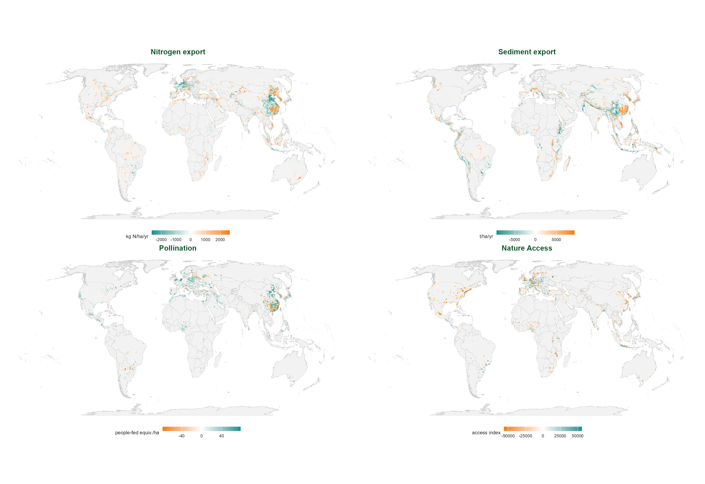{#fig-global-pattern-abs .quarto-figure-center width="100%"}

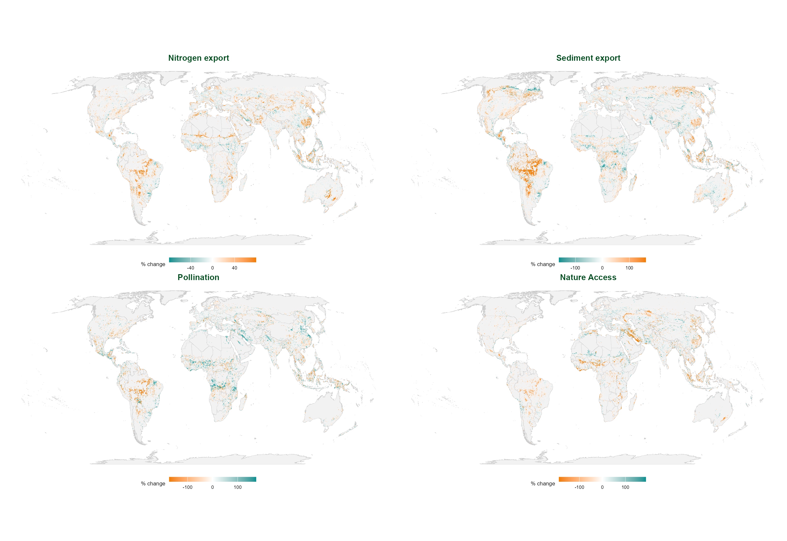{#fig-global-pattern-pct .quarto-figure-center width="100%"}

Sediment export is reported directly, so an increase in a cell is unambiguously the hotspot-relevant direction: more sediment reaching waterways (see Limitations for how this differs from the retention *ratio*, reported elsewhere as secondary context).

Coastal risk is computed at points along the coastline, which are averaged to the 10 km grid for the rest of the analysis. @fig-coastal-risk shows the points themselves. Coastal risk changed at 63,494 of 1.37 million points (4.6%), and changes are small, within about ±18% SPC. Increases and decreases are spread along most coastlines in similar numbers (23,591 points rose and 21,111 fell by at least 1%). The panels show densely populated coasts where risk mostly rose (New York and New Jersey, the Nile delta, Istanbul and the Sea of Marmara, Manila Bay) and two where it mostly fell (the Pearl River delta and the Gulf of Kutch).

{#fig-coastal-risk .quarto-figure-center width="100%"}

::: {.content-visible when-format="html"}
> **Note (2026-10-05):** points from `data/coastal_risk_tnc_esa1992_2020_20251224_013825.gpkg`
> (the `_ch.gpkg` variant has its 2020 column out of row order and must not be used); figure by
> `scripts/mapping/make_coastal_risk_zooms.R`. Panels chosen by the population (GHS-POP 2020) in
> 5-degree boxes where coastal risk rose (A–D, one per continent) or fell (E–F) by 1% or more.
:::

## Global Hotspot Distribution
At the grid scale, 189,932 cells (14.6% of evaluated cells) are a hotspot for at least one service, and they cluster strongly in space (@fig-hotspot-map). To compare groups of different size, we use relative prevalence: a group's share of hotspot cells divided by its share of the area where the service is modelled. A value of 1 means a group holds as many hotspots as its size would predict; 2 means twice as many.

For the four land-based services, Tropical & Subtropical Moist Broadleaf Forests have the highest relative prevalence among biomes (@fig-hotspot-intensity-biome): 2.4 on average, and 3.1 for sediment export. Tropical & Subtropical Coniferous Forests follow (2.0), then Mangroves (1.8), where pollination and nature access reach 2.3 and 2.1. Among income groups (@fig-hotspot-intensity-income), lower-middle-income countries hold 15.6% of the land but 21% of hotspot cells (25% for nature access), while high-income OECD countries hold 25% of the land and 15% of hotspot cells, so per unit area hotspots are about 2.4 times as frequent in lower-middle-income countries. Breakdowns by World Bank region are in the Supplementary Material.

Coastal risk exists only along the coast, so its relative prevalence is measured against coastal cells and reported by region and income group (@fig-coastal-prevalence); a coastal cell's biome describes the land behind it rather than the coast. Coastal risk hotspots are over-represented in South Asia (1.8), Sub-Saharan Africa (1.4) and on low-income coasts (1.3), and under-represented in North America (0.6). Unlike the land-based services, they are slightly over-represented on high-income OECD coasts (1.1) and under-represented on lower-middle-income coasts (0.8).

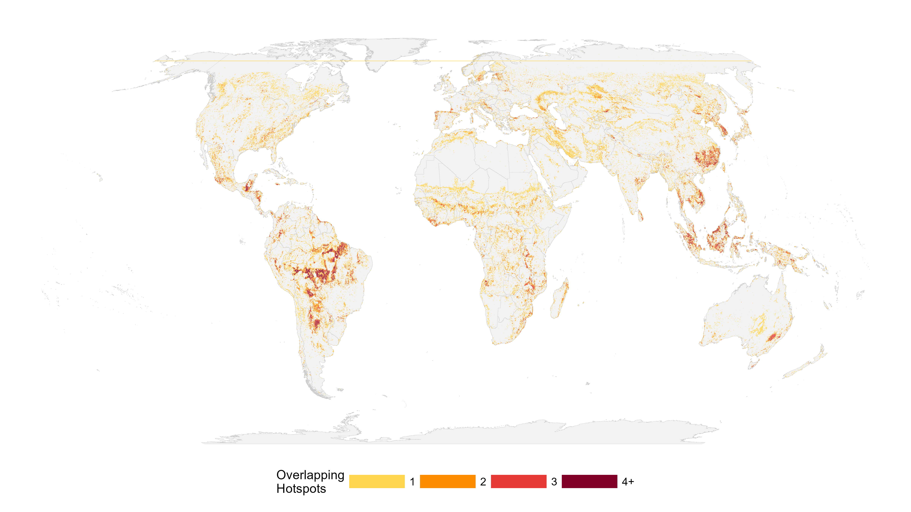{#fig-hotspot-map .quarto-figure-center width="100%"}

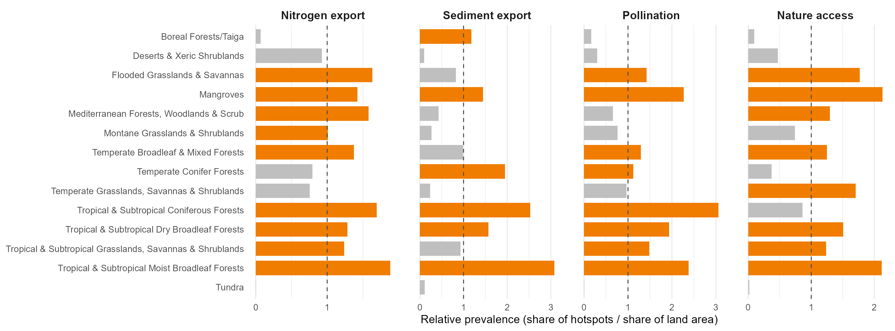{#fig-hotspot-intensity-biome .quarto-figure-center width="100%"}

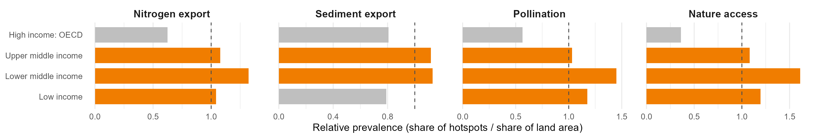{#fig-hotspot-intensity-income .quarto-figure-center width="100%"}

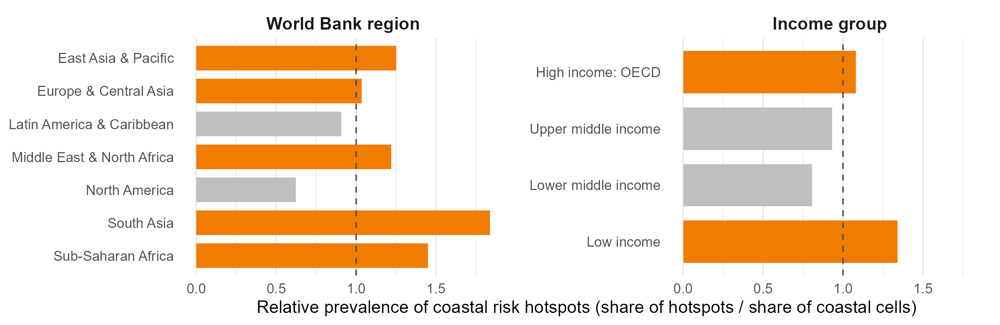{#fig-coastal-prevalence .quarto-figure-center width="75%"}

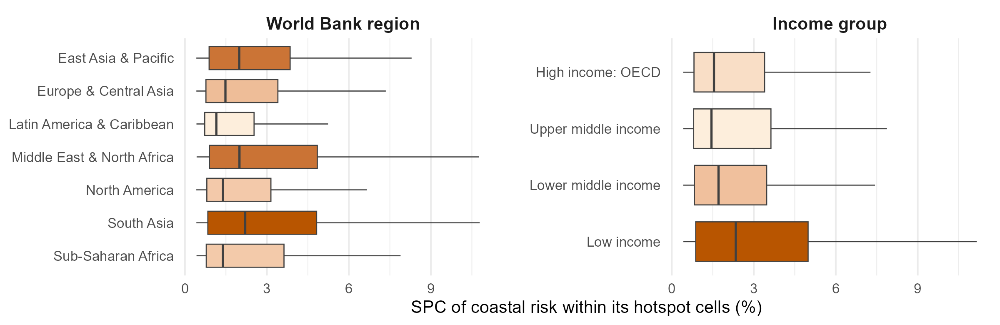{#fig-coastal-boxplots .quarto-figure-center width="75%"}

### Hotspot Magnitude by Biome
Beyond identifying the location of the hotspots, we analyze the magnitude of change within them. The patterns of Symmetric Percentage Change (SPC) values vary substantially across both the assessed services and the biophysical contexts — see the Supplementary Material for the equivalent breakdown across socioeconomic strata.

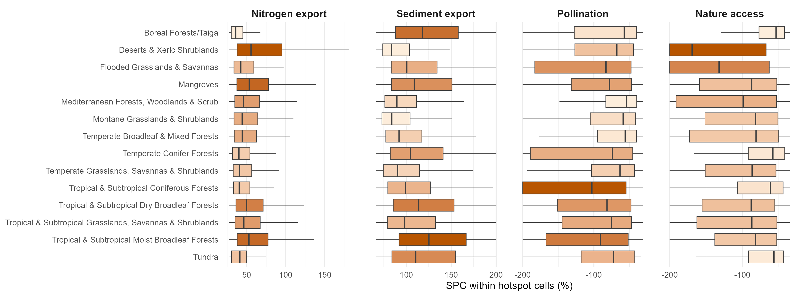{#fig-boxplots-biome .quarto-figure-center width="100%"}

## Socioeconomic Profiling: WHO is exposed to ecosystem service decline? 
{#fig-socioeconomic-context .quarto-figure-center}

Hotspots and the landscapes around them differ in their socioeconomic profile for 24 of the 25 combinations of service and socioeconomic variable (Methods; test statistics in @fig-ks-heatmap). The one exception is coastal risk and agricultural field size, where hotspot and background cells are essentially indistinguishable.

Two characteristics are universal across all five services: hotspot cells consistently occur in areas with higher population density (Cliff’s Delta: +0.53 to +0.64) and higher total GDP (+0.52 to +0.64) than the matched background landscape (@tbl-cliffs-delta). Because this holds for every service, population and GDP do not distinguish the services from one another.

The service-specific typology emerges from the direction and magnitude of HDI and income inequality (GINI) enrichment, which diverges across services:

* Higher-development — Coastal risk: hotspots occur in distinctly higher-HDI contexts (CD: +0.29), alongside a modest rise in income inequality (GINI CD: +0.08).
* Lower-development, higher-inequality — Nitrogen export, sediment export, pollination, and nature access: hotspots for all four are associated with substantially higher income inequality (GINI CD: +0.22 to +0.30) and a same-direction, more variable HDI association (CD: −0.01 to −0.08). Nitrogen export's HDI association is the weakest of the four (CD: −0.01, essentially neutral); sediment export's is the strongest (CD: −0.08).

Agricultural field size does not separate the services the way HDI and GINI do: Cliff's Delta values are small compared to the ~0.6 of population and GDP across all services (range: −0.06 to +0.12). Sediment export has the largest value (CD = +0.12), pollination (CD = 0.01) and nature access (CD = −0.06) are close to zero.

```{r}
#| label: tbl-cliffs-delta
#| tbl-cap: "Cliff’s Delta effect sizes for hotspot versus matched background cells across all service-covariate combinations. Positive values indicate hotspot cells have higher covariate values; negative values indicate lower. Asterisks denote FDR-adjusted significance (\\*\\*\\* p<0.001, \\*\\* p<0.01, \\* p<0.05, ns p≥0.05)."
#| echo: false

library(dplyr)
library(tidyr)
library(readr)
source("../../R/paths.R")

ks_raw <- read_csv(
  file.path(data_dir(), "processed", "tables", "ks_results_hot_vs_non.csv"),
  show_col_types = FALSE
)

var_labels <- c(
  GHS_POP_E2020_GLOBE_sum                  = "Population",
  rast_gdpTot_1990_2020_30arcsec_2020_sum  = "GDP (total)",
  hdi_raster_predictions_2020_mean         = "HDI",
  rast_adm1_gini_disp_2020_mean            = "GINI",
  fields_mehrabi_2017_mean                 = "Field size"
)

# REVERSAL (2026-09-03): back to the export/risk service list (R/service_config.R's
# SERVICE_AMOUNTS, flipped back after Becky overrode Steve's retention/protection suggestion --
# see the Status note and becky_steve_feedback_plan.md). Earlier this had drifted silently more
# than once (found 2026-09-02: read_csv/pivot_wider drop rows that don't match `filter(service
# %in% service_order)` with no error, so a stale list here renders a wrong-looking-fine table).
# This paper doesn't load R/service_config.R (no devtools::load_all() here), so hardcoded
# directly -- keep in sync with that file's SERVICE_AMOUNTS order if services ever change.
service_order <- c("N_export", "Sed_export", "C_Risk", "Pollination", "Nature_Access")

cd_wide <- ks_raw %>%
  filter(var %in% names(var_labels)) %>%
  mutate(
    Variable = var_labels[var],
    sig = case_when(
      p_adj < 0.001 ~ "***",
      p_adj < 0.01  ~ "**",
      p_adj < 0.05  ~ "*",
      TRUE          ~ "ns"
    ),
    cell = paste0(sprintf("%+.2f", round(cliffs_delta, 2)), sig)
  ) %>%
  select(service, Variable, cell) %>%
  pivot_wider(names_from = Variable, values_from = cell) %>%
  filter(service %in% service_order) %>%
  arrange(match(service, service_order)) %>%
  rename(Service = service) %>%
  select(Service, Population, `GDP (total)`, HDI, GINI, `Field size`)

if (requireNamespace("knitr", quietly = TRUE)) {
  knitr::kable(cd_wide, align = c("l", rep("c", 5)))
}
```


## Population Exposure and the Serviceshed Multiplier Effect

::: {.content-visible when-format="html"}
> Serviceshed numbers come from the beneficiary pipeline (downstream hydrological and travel-time
> buffers) run on the export/risk hotspot set used throughout this paper.
:::

We count both the people living inside hotspot cells and those connected to them through downstream flows or travel access (Methods). We estimate that approximately 7.6 billion people (7,584 million), 96.5% of the global population in the GHSL-POP 2020 dataset, live within, or depend directly upon, the spatial footprint of these hotspots or their connected servicesheds. Upper-middle-income countries have the most people living inside hotspot cells (1,250 million), and lower-middle-income countries the most connected beneficiaries (2,785 million). Low-income countries account for about 13% of the total affected people.

::: {.content-visible when-format="html"}
> **Sources:** local residents and connected beneficiaries by income group from
> `outputs/tables/multiplier_summary_income_grp.csv`; 7,584 M = union of >=1 service in
> `outputs/tables/exposure_comparison.csv`; 96.5% = 7,584 / 7,855.5 M GHSL 2020 total; low-income
> share 974.5 / 7,584 M = 12.9%; land and hotspot shares from `hotspot_area_stats.csv`.
:::

Local residents number 3,065 million people living in at least one hotspot cell. Connected beneficiaries depend on the pathway of service delivery. By tracing down-gradient hydrological flow paths, we identify 6,409 million downstream beneficiaries reliant on these affected upstream locations. When evaluating the access-based travel footprint (populations relying on nature access and wild pollination within reachable distances), the reliant population expands to 7,390 million individuals. The total connected population (7,584 million) is approximately 2.5 times the in-situ local residents, and the access-based population is 1.15 times the population living directly downstream.

We also grouped populations by the number of overlapping hotspots in their cell, from at least one service up to four or more. Connected beneficiaries exceed local residents at every level, including the rarest cells with four or more overlapping hotspots.

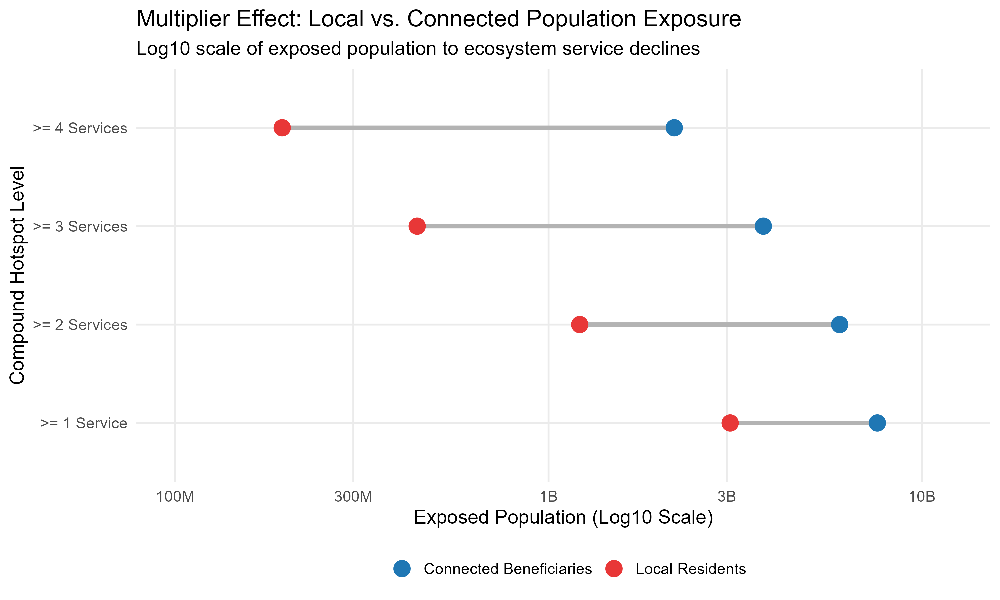{#fig-multiplier-compound .quarto-figure-center width="100%"}

---

# Discussion

## Geographic Clustering Enables Prioritization
Decision-makers have lacked comparable, high-resolution global metrics capable of diagnosing where ecosystem service capacity is declining most acutely, which segments of human society are most exposed, and what mechanisms drive observed losses (Crossman et al., 2013; Naidoo et al., 2008; Willcock et al., 2023). This diagnostic gap can result in misallocated resource flows, as broad national or continental aggregations can obscure the unequal distribution of environmental burdens across communities (Bullard, 1990). The findings below show what a standardized, high-resolution baseline makes possible.

The intense geographic concentration of hotspots within Latin America and East Asia shows that global ecosystem service decline is highly non-uniform, identifying clear priorities for conservation investment. Targeted interventions in high-intensity nations—such as South Korea, Malaysia, Guatemala, and Jamaica—can maximize conservation return on investment. However, because hotspot configurations vary significantly by service type, uniform conservation frameworks are unlikely to perform; interventions must be tailored to the specific service profiles of each sub-region.

This concentration is visible not only in binary hotspot classification but in the underlying continuous change surface, and illustrates why this analysis defines hotspots using Symmetric Percentage Change (SPC) rather than absolute change (@sec-methods-pipeline, @fig-global-pattern-abs, @fig-global-pattern-pct). Sediment export offers a clear case: in absolute terms, the Amazon shows only a modest signal, dwarfed by naturally high-erosion terrain in Southeast Asia; in percentage terms, the ordering reverses, and the Amazon becomes the single largest visible pattern globally, because its comparatively low historical baseline means the same physical change registers as far larger relative to what was already there. Prioritization should rely  on this normalization — flagging disproportionate, fast-emerging change against each location's own baseline, not simply wherever the largest physical volumes occur. Under an absolute-change criterion, a shift of this magnitude in the Amazon would not have been flagged as unusual at all, undermining the kind of targeting this section argues the analysis enables.

The global trends also need to be read against what each variable measures. Pollination is realized pollination on agriculture, the pollinator-dependent crop production supported by nearby habitat. It can rise because pollinator-dependent cropland expands next to remaining habitat, not necessarily because pollinator habitat improves. Flooded Grasslands & Savannas, where nature access fell most steeply and realized pollination rose most, fits that reading: cropland expanding into landscapes that still retain enough habitat to pollinate it.

These maps could also inform ecosystem accounting, such as the UN System of Environmental-Economic Accounting for ecosystems (United Nations et al., 2021), and global assessments such as those of IPBES (IPBES, 2019).

## People in More Unequal Places Are More Exposed to Ecosystem Service Decline
Hotspots of decline for the four land-based services fall disproportionately where income inequality is higher. For each of them, hotspot cells have higher inequality than the surrounding landscape (Cliff's Delta +0.22 to +0.30), and per unit area they are about 2.4 times as frequent in lower-middle-income as in high-income OECD countries. This is not simply a matter of population or wealth: hotspots of all five services sit in more populated, higher-GDP places (Cliff's Delta +0.52 to +0.64), so those variables do not distinguish one service from another, whereas inequality does. Human development, measured by HDI, adds little for the land-based services (Cliff's Delta −0.01 to −0.08).

Coastal risk is the exception. Its hotspots sit in higher-HDI places (Cliff's Delta +0.29) with only a small rise in inequality (+0.08), and they are slightly over-represented on high-income OECD coasts (1.1). They are also over-represented on low-income coasts (1.3) and in South Asia (1.8), so coastal exposure is not confined to wealthier coasts. Development along already-built coastlines may explain part of the high-HDI association, but we did not test this.

These associations describe where decline and inequality coincide, not that one causes the other. They do mean that the people most exposed to the decline of land-based services live disproportionately in more unequal and lower-middle-income settings, which is where planning for ecosystem services and for development most need to meet.

Exposure also extends well beyond the hotspot cells themselves. Connected beneficiaries outnumber local residents by about 2.5 to 1, and they do so at every level of hotspot overlap, so localized decline reaches people who do not live where it occurs, through downstream flows and travel to nature (Brauman et al., 2007; Keeler et al., 2012).

## Understanding the Drivers of Change Needs a Different Analysis

Knowing where ecosystem services decline is only part of what decision-makers need; acting on it also requires knowing why. We looked for a land cover signal behind the hotspots by comparing them with the most intense land cover conversion over the same period (Supplementary Material). Where conversion is intense, it does co-occur with hotspots of every service, but most hotspot cells (63%) show no intense conversion in the same cell, and part of the overlap that does exist reflects both processes concentrating in the same regions rather than in the same cells (@tbl-attribution-null).

The lack of a local signal is expected from how the models work. In the sediment and nutrient models, the effect of a land cover change accumulates along flow paths, so conversion upstream can change export far downstream in cells whose own land cover did not change. Pollination and nature access likewise depend on habitat within foraging or travel distance, not only in the cell itself. A cell-by-cell overlay cannot capture these connections. Inputs other than land cover, such as rainfall erosivity in the sediment model, could also change export without any land cover change, if the 1992 and 2020 runs used different climate inputs.

Attributing change to its drivers would therefore need a different analysis: one that follows the flow paths and travel distances the models use, or that reruns the models holding land cover or climate fixed to separate their effects. We see this as a priority for future work. Until then, land cover maps alone are not enough to track where ecosystem services are declining.

::: {.content-visible when-format="html"}
> **Open question for Becky (required before submission):** were the InVEST SDR/NDR runs for 1992 and
> 2020 performed with the same climate inputs, or era-specific ones? If fixed, drop the rainfall
> erosivity sentence above.
:::

## Limitations

**InVEST model applicability at global scale.** The biophysical models used here—developed and maintained by the Natural Capital Project (Sharp et al., 2020; Chaplin-Kramer et al., 2019)—were designed and validated primarily for local to regional applications where site-specific parameterization is feasible. Applying them globally without spatially explicit calibration data introduces uncertainty whose magnitude varies by service. Coastal risk and nature access are structurally more robust at this scale; nitrogen and sediment export depend on routing and parameter defaults that carry larger uncertainty when applied globally. We do not interpret absolute modeled values as ground-truth estimates of service provision; rather, we interpret relative rankings and temporal changes in the context of what the models are designed to capture—the direction and approximate magnitude of biophysical change. Model ensemble approaches (Willcock et al., 2023) represent an important future direction for quantifying this structural uncertainty.

**Spatial resolution and scale of inference.** The 100 km² analysis grid supports identification of geographic patterns and regional priorities but cannot resolve site-level heterogeneity. Results are appropriate for strategic conservation planning and international policy discussions, but should not be used to identify specific sites for intervention without local-scale validation. Additionally, the Modifiable Areal Unit Problem (MAUP) means that aggregation at 100 km² may dampen or shift apparent hotspot boundaries relative to finer-resolution analyses.

**Temporal discretization.** Comparing two discrete snapshots (1992 and 2020) masks intermediate dynamics, including non-linear trajectories, recovery events, and oscillations. The analysis captures net directional change over the study period; it cannot characterize rate, timing, or reversibility of change.

**Proportional versus absolute change in hotspot definition.** The partial overlap between hotspots defined by proportional (SPC) and absolute change (@tbl-hotspot-metric-overlap) suggests that places losing the largest share of their own service capacity and places losing the largest amounts are often different; characterizing where and why these two criteria diverge is a direction for future work.

**Coastal cells outside the grouping layers.** About 40% of coastal risk hotspots (45% for biomes) fall in coastal cells that the region, income-group and biome layers do not cover, mostly on the coastal edge. Coastal risk results by region and income group therefore rest on about 60% of its hotspots.

**Socioeconomic data and population exposure.** Population exposure estimates use 2020 population grids applied to 1992–2020 ES change footprints, creating a temporal mismatch in which current populations are attributed to historical change zones. Income group and HDI classifications reflect 2020 boundaries; reclassifications over the study period are not captured. The analysis reports absolute population exposure; relative exposure (i.e., proportion of a group's population within hotspots) provides complementary information that warrants future investigation.

**Population's role in hotspot definition versus exposure profiling.** Four of the five hotspot-defining services are purely biophysical InVEST models with no population input; hotspot status for these is defined entirely from modeled service values, and population/GDP/HDI enter only afterward as covariates in the socioeconomic profiling. Nature Access is the exception: its InVEST inputs blend land-cover-derived accessibility with a LandScan population layer held at a fixed 2019 vintage in both the 1992 and 2020 snapshots. Because the same population layer underlies both years, the change signal defining a Nature Access hotspot isolates land-cover-driven shifts in accessibility rather than population redistribution — but the service is population-linked by construction in a way the other four are not.

---

# Conclusions
This assessment tracks 28 years of change in five ecosystem services across 1.3 million equal-area grid cells worldwide, combining InVEST models, satellite land cover and gridded socioeconomic data in one consistent framework. Change is uneven. Hotspots of decline concentrate in Latin America & Caribbean and East Asia & Pacific, and for the land-based services they are about 2.4 times as frequent per unit area in lower-middle-income as in high-income OECD countries. People in more unequal places are more exposed to the decline of land-based services, while coastal risk hotspots sit in higher-development places but are also over-represented on low-income coasts. Exposure also reaches well beyond the hotspots: 3.1 billion people live in hotspot cells, and about 7.6 billion, nearly the entire global population, are connected to them through downstream flows or travel access.

Land cover change alone is not enough to track change in ecosystem service provision: most hotspots show no intense land cover conversion in the same cell (Supplementary Material). Explaining these changes and attributing them to their drivers is left for future work. One simple test is whether the overlap increases when conversion is counted in neighbouring cells rather than only in the same cell.

A broader result runs through the analysis: the answer to each question depends on how change is measured and aggregated. Proportional and absolute change select partly different hotspots. The regions, biomes and income groups with the largest change differ depending on whether change is measured relative to baseline or in absolute terms per unit area. These differences are not inconsistencies to be resolved by choosing one measure. They show that a global aggregate is one lens among several, and that a credible assessment of ecosystem service change needs to state its metric, baseline, grouping and scale, and to show how sensitive its conclusions are to each.

The framework built for this assessment makes those choices explicit and repeatable. Its global scope is an implementation choice rather than an architectural constraint: the same open-source pipeline aggregates millions of 300 m observations into summaries for any set of groupings (regions, biomes, income groups, countries or custom units), for proportional or absolute change, and at different spatial scales, and the same checks, such as hotspot sensitivity to the change metric and null models of co-occurrence, apply to each. It is directly reusable for regional analyses, such as the Amazon basin, Southeast Asia or sub-Saharan Africa, with locally calibrated InVEST inputs and higher-resolution rasters, and additional time points and services can be added by extending the extraction and synthesis steps without changing the core pipeline. This makes it a foundation for repeated global assessments as data improve, and for locally focused, equity-centered policy applications.

---

# Methods

The analysis compares two snapshots of five modelled ecosystem services, 1992 and 2020, measures their change, identifies the places where each service declined most, and relates those places to the people who live in or depend on them (@fig-workflow).

```{mermaid}
%%| label: fig-workflow
%%| fig-cap: "Analytical workflow. Path A measures change at 300 m and sums it to regions, biomes and income groups (WHAT). Path B measures change on the 10 km grid and identifies hotspots (WHERE), which feed socioeconomic profiling and the population exposure analysis (WHO)."
%%{init: {'flowchart': {'rankSpacing': 55, 'nodeSpacing': 30}}}%%
flowchart TB
    RawES["<b>InVEST ES Models</b><br/><i>300m · 1992 & 2020</i>"]
    RawGrid["<b>IUCN 10km Master Grid</b><br/><i>Vector + Subregional Attributes</i>"]
    RawSoc["<b>Socioeconomic Data</b><br/><i>Pop, GDP, HDI, Gini</i>"]

    IntA["<b>Path A</b><br/>Pixel-level Zonal Summaries"]
    MathA["<b>Path A Metrics</b><br/>SPC & Absolute Difference"]

    IntB["<b>Path B</b><br/>10km Grid Zonal Summaries"]
    MathB["<b>Path B Metrics</b><br/>SPC & Absolute Difference"]

    MathSoc["<b>Socioeconomic Profiling</b><br/>Hotspot vs. Background"]
    MathBenef["<b>Serviceshed Routing</b><br/>Downstream Flow + Travel Access"]

    P1(["<b>WHAT</b><br/>Global Trajectories"])
    P2(["<b>WHERE</b><br/>Hotspot Detection"])
    P4(["<b>WHO</b><br/>Exposure"])

    RawES ==> IntA & IntB
    RawGrid ==> IntB & MathSoc
    RawSoc ==> MathSoc & MathBenef

    IntA ==> MathA ==> P1
    IntB ==> MathB ==> P2

    P2 ==> MathSoc & MathBenef
    MathSoc ==> P4
    MathBenef ==> P4

    classDef c_what fill:#007930,stroke:#004D1E,stroke-width:2px,color:#FFF;
    classDef c_where fill:#7B8327,stroke:#515619,stroke-width:2px,color:#FFF;
    classDef c_who fill:#F5D200,stroke:#B39900,stroke-width:2px,color:#333;

    class RawES,IntA,MathA,P1 c_what;
    class RawGrid,IntB,MathB,P2 c_where;
    class RawSoc,MathSoc,MathBenef,P4 c_who;
```

## Study Period and Spatial Units

The study period, 1992 to 2020, is the longest continuous record of the European Space Agency Climate Change Initiative (ESA CCI) land cover time series (ESA, 2017), which drives the ecosystem service models. Results are summarized on the IUCN Area of Occupancy grid (Murray, 2017), an equal-area grid of 100 km² cells. Excluding permanent ice, open ocean and inland water leaves 1,372,621 land cells out of 1,522,073.

## Ecosystem Service Models

The five services were modelled with the InVEST suite (Sharp et al., 2020) at 300 m resolution for 1992 and 2020:

- *Nitrogen export*: annual nitrogen load delivered to streams (InVEST nutrient delivery ratio model, NDR).
- *Sediment export*: annual sediment load delivered to streams (InVEST sediment delivery ratio model, SDR).
- *Coastal risk*: a coastal vulnerability index computed at points along the coastline from coastal habitats and exposure (InVEST coastal vulnerability model).
- *Pollination*: realized pollination on agriculture, the pollinator-dependent crop production supported by wild pollinator habitat within foraging range, in equivalent people fed per hectare.
- *Nature access*: a spatial index of people's proximity to natural habitat.

An increase is adverse for nitrogen export, sediment export and coastal risk, and a decrease is adverse for pollination and nature access. Services expressed as amounts were converted to per-hectare values before aggregation; the index-type services were kept in their native units.

The same NDR, SDR and coastal vulnerability runs also give three ratios that are shown in the change figures but not used to define hotspots: the nitrogen retention ratio, $N_{\text{retained}} / (N_{\text{retained}} + N_{\text{export}})$; the sediment retention ratio, $(\text{USLE} - \text{SedExport}) / \text{USLE}$, where USLE is potential soil loss from the Universal Soil Loss Equation; and the coastal risk reduction ratio, the proportional reduction in coastal risk attributable to coastal habitats.

::: {.content-visible when-format="html"}
> **Open (model run provenance):** which project produced the 1992 and 2020 InVEST rasters (same runs as
> Chaplin-Kramer et al. 2019, an extension, or new runs)? Is there a dataset citation besides the InVEST
> User's Guide? Were climate inputs fixed or era-specific? Per-service model detail can be expanded from
> the InVEST documentation once the run parameters and version are known.
>
> **Why export rather than the retention amount:** USLE is not independent of land cover, so a rise in
> the sediment retention amount (USLE minus export) can reflect rising erosion pressure from land
> conversion rather than better retention. In Brazil, 95% of the national change in that amount traced
> to rising USLE and 5% to lower export.
:::

## Socioeconomic and Boundary Data

Socioeconomic variables were summarized on the same grid: population from the Global Human Settlement Layer (GHSL-POP 2020), gross domestic product from Kummu et al. (2025), the Human Development Index from Sherman et al. (2026), income inequality (subnational Gini coefficient of disposable income), and agricultural field size from Mehrabi et al. (2021). Countries, income groups, World Bank regions and WWF biomes were assigned to grid cells through a correspondence table provided by co-author Justin Johnson (NatCap TEEMs, University of Minnesota).

::: {.content-visible when-format="html"}
> **To verify before submission:** the Gini source (`rast_adm1_gini_disp_2020`; likely the Kummu group's
> subnational Gini dataset, not yet confirmed) and a citable reference for the correspondence table
> (`ee_correspondence`; possibly `ee_r264_correspondence.gpkg` in the `gtap_invest_seals_2023_04_21`
> bucket; ask Justin for a citation, provenance and whether to archive the version used).
:::

## Measuring Change {#sec-methods-pipeline}

Change is measured in two ways, because the two questions it answers need different orders of aggregation. **Path A** compares each 300 m pixel between 1992 and 2020 and then sums the differences to regions, biomes, income groups and countries; it is used for the regional and global trajectories. **Path B** first averages each service to the 10 km grid and then computes change per cell; ranking places against each other needs fixed, equal-area units, so Path B is used for hotspots, socioeconomic profiling and exposure. Grid-cell values are means of the 300 m pixels in each cell, or, for coastal risk, of the coastal points in each cell.

Absolute change is $\Delta S = S_{2020} - S_{1992}$. Relative change is the symmetric percentage change,

$$SPC = \frac{S_{2020} - S_{1992}}{(|S_{2020}| + |S_{1992}|) / 2} \times 100,$$

which treats gains and losses symmetrically, is bounded between −200% and +200%, and stays defined where 1992 provision is close to zero (Berry & Ayers, 2006). For groups of cells, SPC is computed from the group's summed 1992 and 2020 totals rather than by averaging per-cell SPC, which would weight every cell equally regardless of how much service it provides. Averaging per-cell values to regions can give different, even opposite, regional signals for the same service, a form of the modifiable areal unit problem (Openshaw, 1984; Fotheringham & Wong, 1991) and of Simpson's paradox (Simpson, 1951); this is why regional trajectories use Path A.

## Hotspot Identification

For each service, hotspots are the 5% of grid cells with the most adverse SPC: the highest values for nitrogen export, sediment export and coastal risk, and the lowest for pollination and nature access. Cells with no change are never hotspots. A rank-based threshold makes hotspots comparable across services measured in different units. Because SPC is measured against each cell's own baseline, hotspots mark where a service changed most relative to what the cell provided in 1992, not where the largest amounts changed.

Ranking by absolute change instead keeps about half of the hotspot cells: from 97% for coastal risk and 57% for nitrogen export to 43% for nature access, 35% for pollination and 32% for sediment export (@tbl-hotspot-metric-overlap). Sediment export and pollination hotspots fall mostly in cells with low baseline provision, where a modest absolute change is a large share of local capacity. We use SPC as the primary criterion because the proportional loss of a place's own capacity is what the people and ecosystems that depend on it experience, and report the absolute-change comparison as a sensitivity analysis.

The retention and reduction ratios are not used to define hotspots, for two reasons. Export and retention of the same pollutant are not independent, so counting both would register one change twice. And a rising retention ratio does not necessarily mean better local function, because the ratio also depends on the load arriving from upstream.

::: {.content-visible when-format="html"}
> Overlap table from `analysis/hotspot_metric_overlap.R` on the production hotspot sets
> (`data/processed/hotspots/{pct,abs}/global/`).
:::

## Socioeconomic Profiling

For each service, we compared the distribution of five variables (population, GDP, HDI, Gini and field size) in hotspot cells with that in background cells, using two-sample Kolmogorov–Smirnov tests,

$$D = \max_x |F_{\text{hotspot}}(x) - F_{\text{background}}(x)|.$$

Background cells are the middle 5% of each service's change distribution (47.5th to 52.5th percentile), which represent typical, stable conditions and keep cells with large gains out of the comparison. With up to about 68,000 cells per group, even negligible differences are statistically significant (Lin et al., 2013), so we report Cliff's Delta as the measure of effect size and direction (Cliff, 1993). *p*-values across the 25 tests (five services × five variables) were adjusted with the Benjamini–Hochberg false discovery rate correction (Benjamini & Hochberg, 1995).

## Population Exposure and Servicesheds

To identify not only where services are supplied but who depends on them, we follow the supply–demand–beneficiary framework of the ecosystem services literature (Burkhard et al., 2012), applied with an InVEST-based approach consistent with prior beneficiary-explicit assessments (Mandle et al., 2017). Local residents are the people (GHSL-POP 2020) living inside hotspot cells. Connected beneficiaries also include people linked to hotspot cells downstream along hydrological flow paths, for the water-related services, or within travel distance, for nature access and pollination. People are counted once even when they are connected to several hotspots.

---

# References

- Andam, K. S., Ferraro, P. J., Pfaff, A., Sanchez-Azofeifa, G. A., & Robalino, J. A. (2008). Measuring the effectiveness of protected area networks in reducing deforestation. *Proceedings of the National Academy of Sciences*, 105(42), 16089–16094.
- Anderson, B. J., Armsworth, P. R., Eigenbrod, F., Thomas, C. D., Gillings, S., Heinemeyer, A., Roy, D. B., & Gaston, K. J. (2009). Spatial covariance between biodiversity and other ecosystem service priorities. *Journal of Applied Ecology*, 46(4), 888-896. https://doi.org/10.1111/j.1365-2664.2009.01666.x
- Benjamini, Y., & Hochberg, Y. (1995). Controlling the false discovery rate: A practical and powerful approach to multiple testing. *Journal of the Royal Statistical Society: Series B (Methodological)*, 57(1), 289–300.
- Berry, D. A., & Ayers, G. D. (2006). Symmetrized percent change for treatment comparisons. *The American Statistician*, 60(1), 27-31.
- Burkhard, B., Kroll, F., Nedkov, S., & Müller, F. (2012). Mapping ecosystem service supply, demand and budgets. *Ecological Indicators*, 21, 17-29. https://doi.org/10.1016/j.ecolind.2011.06.019
- Cliff, N. (1993). Dominance statistics: Ordinal analyses to answer ordinal questions. *Psychological Bulletin*, 114(3), 494–509.
- Crossman, N. D., Burkhard, B., Nedkov, S., Willemen, L., Petz, K., Palomo, I., ... & Bagstad, K. J. (2013). A blueprint for mapping and modelling ecosystem services. *Ecosystem Services*, 4, 4–14. https://doi.org/10.1016/j.ecoser.2013.02.001
- Brauman, K. A., Daily, G. C., Duarte, T. K. E., & Mooney, H. A. (2007). The nature and value of ecosystem services: an hydrological perspective. *Annual Review of Environment and Resources*, 32(1), 67-98.
- Brauman, K. A., Garibaldi, L. A., Polasky, S., Aumeeruddy-Thomas, Y., Brancalion, P. H. S., DeClerck, F., ... & Verma, M. (2020). Global trends in nature's contributions to people. *Proceedings of the National Academy of Sciences*, 117(51), 32799-32805.
- Chaplin-Kramer, R., Sharp, R. P., Mandle, L., Sim, S., Johnson, J. A., Mueller, I., ... & Daily, G. C. (2019). Global modeling of nature’s contributions to people. *Science*, 366(6462), 255-258.
- Daily, G. C., Polasky, S., Goldstein, J., Kareiva, P. M., Mooney, H. A., Pejchar, L., ... & Shallenberger, R. (2009). Mainstream conservation into practical decisions. *Frontiers in Ecology and the Environment*, 7(1), 21-28.
- European Space Agency (ESA). (2017). *Climate Change Initiative (CCI) Land Cover Maps*. https://climate.esa.int/en/projects/land-cover/
- Fedele, G., Donatti, C. I., Bornacelly, I., & Hole, D. G. (2021). Nature-dependent people: Mapping human direct use of nature for basic needs across the tropics. *Global Environmental Change*, 71, 102368.
- Fortin, M.-J., & Dale, M. R. T. (2005). *Spatial Analysis: A Guide for Ecologists*. Cambridge University Press.
- Fotheringham, A. S., & Wong, D. W. S. (1991). The modifiable areal unit problem in multivariate statistical analysis. *Environment and Planning A*, 23(7), 1025–1044.
- Gotelli, N. J., & Graves, G. R. (1996). *Null Models in Ecology*. Smithsonian Institution Press.
- IPBES. (2019). *Global assessment report on biodiversity and ecosystem services of the Intergovernmental Science-Policy Platform on Biodiversity and Ecosystem Services*. IPBES secretariat, Bonn, Germany.
- IPCC. (2021). *Climate Change 2021: The Physical Science Basis. Contribution of Working Group I to the Sixth Assessment Report of the Intergovernmental Panel on Climate Change* (Masson-Delmotte, V., et al., Eds.). Cambridge University Press. https://doi.org/10.1017/9781009157896
- Nearing, M. A., Pruski, F. F., & O'Neal, M. R. (2004). Expected climate change impacts on soil erosion rates: A review. *Journal of Soil and Water Conservation*, 59(1), 43–50.
- Peng, Y., Chen, W., Pan, S., Gu, T., & Zeng, J. (2023). Identifying the driving forces of global ecosystem services balance, 2000–2020. *Journal of Cleaner Production*, 426, 139019.
- Keeler, B. L., Polasky, S., Brauman, K. A., Johnson, J. A., Finlay, J. C., O'Neill, A., ... & Dalzell, B. (2012). Linking water quality and human well-being on a global scale. *Proceedings of the National Academy of Sciences*, 109(45), 18619-18624.
- Kim, H., et al. (2024). Global trends and scenarios for terrestrial biodiversity and ecosystem services from 1900 to 2050. *Science*, 384(6694). https://doi.org/10.1126/science.adn3441
- Kummu, M., Kosonen, M., & Masoumzadeh Sayyar, S. (2025). Downscaled gridded global dataset for gross domestic product (GDP) per capita PPP over 1990–2022. *Scientific Data*, 12, 178. https://doi.org/10.1038/s41597-025-04487-x
- Millennium Ecosystem Assessment. (2005). *Ecosystems and Human Well-being: Synthesis*. Island Press, Washington, DC.
- Lin, M., Lucas, H. C., & Shmueli, G. (2013). Too big to fail: Large samples and the p-value problem. Information Systems Research, 24(4), 905-917.
- Mandle, L., Wolny, S., Bhagabati, N., Helsingen, H., Hamel, P., Bartlett, R., ... & De Mel, M. (2017). Assessing ecosystem service provision under climate change to support conservation and development planning in Myanmar. *PLOS ONE*, 12(9), e0184951. https://doi.org/10.1371/journal.pone.0184951
- Mehrabi, Z., McDowell, M. J., Ricciardi, V., Levers, C., Martinez, J. D., Mehrabi, N., Wittman, H., Ramankutty, N., & Jarvis, A. (2021). The global divide in data-driven farming. *Nature Sustainability*, 4(2), 154–160. https://doi.org/10.1038/s41893-020-00631-0
- Murray, N. (2017). Global 10 x 10-km grids suitable for use in IUCN Red List of Ecosystems assessments (vector and raster format) (p. 135013975 Bytes) [Dataset]. figshare. https://doi.org/10.6084/M9.FIGSHARE.4653439
- Naidoo, R., Balmford, A., Costanza, R., Fisher, B., Green, R. E., Lehner, B., ... & Ricketts, T. H. (2008). Global mapping of ecosystem services and conservation priorities. *Proceedings of the National Academy of Sciences*, 105(28), 9495–9500. https://doi.org/10.1073/pnas.0707823105
- Openshaw, S. (1984). *The Modifiable Areal Unit Problem*. Concepts and Techniques in Modern Geography, 38. Geo Books, Norwich.
- Pontius, R. G., & Millones, M. (2011). Death to Kappa: birth of quantity disagreement and allocation disagreement for accuracy assessment. *International Journal of Remote Sensing*, 32(15), 4407-4429.
- Pontius Jr, R. G. (2022). Metrics That Make a Difference: How to Analyze Change and Error. Springer International Publishing. https://doi.org/10.1007/978-3-030-70765-1.
- Sharp, R., Douglass, J., Wolny, S., Arkema, K., Bernhardt, J., Bierbower, W., ... & Wyatt, K. (2020). *InVEST User’s Guide*. The Natural Capital Project, Stanford University, University of Minnesota, World Wildlife Fund, and The Nature Conservancy.
- Sherman, L., Proctor, J., Druckenmiller, H., Tapia, H., & Hsiang, S. (2026). Global high-resolution estimates of the UN Human Development Index using satellite imagery and machine learning. *Nature Communications*, 17, 1315. https://doi.org/10.1038/s41467-026-68805-6
- Simpson, E. H. (1951). The interpretation of interaction in contingency tables. *Journal of the Royal Statistical Society, Series B*, 13, 238–241.
- Sullivan, G. M., & Feinn, R. (2012). Using effect size—or why the p value is not enough. Journal of Graduate Medical Education, 4(3), 279-282.
- United Nations et al. (2021). *System of Environmental-Economic Accounting — Ecosystem Accounting (SEEA EA)*. United Nations, New York.
- Vancutsem, C., Achard, F., Pekel, J. F., Vieilledent, G., Carboni, S., Simonetti, D., ... & Eva, H. D. (2021). Long-term (1990–2019) forest degradation and deforestation in the moist tropics of South Asia, Southeast Asia and Latin America. *Nature*, 591(7848), 115-122.
- Willcock, S., Hooftman, D., Balbi, S., Blanchard, R., Dawson, T. P., Hickler, T., ... & Bullock, J. M. (2023). Model ensembles of ecosystem services fill global certainty and capacity gaps. *Science Advances*, 9(1), eadd0141. https://doi.org/10.1126/sciadv.add0141

---

# Supplementary Material

This annex contains supplemental figures that provide additional detail and context for the analyses presented in the main body of the paper.

## Land Cover Conversion and Ecosystem Service Hotspots

This exploratory comparison supports the Discussion section on the drivers of change. It shows co-occurrence in the same cells, not causal attribution. ESA CCI land cover for 1992 and 2020 (ESA, 2017) was reclassified to nine classes, and five conversion drivers were measured per 10 km cell: forest loss, cropland expansion, urban expansion, grassland loss and grassland gain. For each driver, the 5% of cells with the most conversion were marked as conversion hotspots. Of the 189,932 ecosystem service hotspot cells, 36.7% fall in a conversion hotspot for at least one driver and 63.3% in none; @fig-attribution-gap shows the overlap by service and driver. To separate co-occurrence in the same cells from both processes concentrating in the same regions, ecosystem service hotspots were placed at random within geographic blocks of decreasing size, keeping each block's number of hotspot and conversion cells (@tbl-attribution-null).

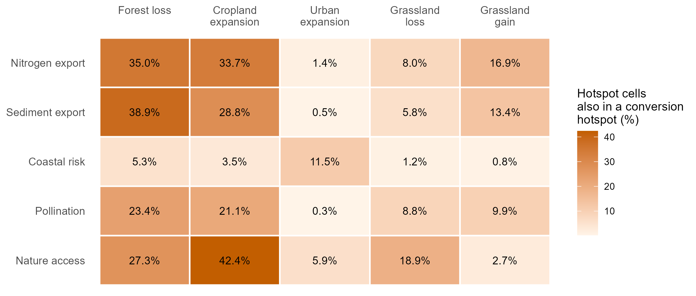{#fig-attribution-gap .quarto-figure-center}

```{r}
#| label: tbl-attribution-null
#| tbl-cap: "Observed versus expected overlap between ES hotspots and the land cover conversion driver union, when ES hotspots are placed at random within geographic blocks of decreasing size. Each block keeps its number of ES hotspot cells and driver-union cells."
#| echo: false

null_model <- read.csv("../../outputs/tables/attribution_null_model.csv")
null_tbl <- data.frame(
  `Random placement within` = ifelse(is.infinite(null_model$block_deg), "Whole grid",
                                     paste0(null_model$block_deg, "° blocks")),
  `Blocks` = format(null_model$n_blocks, big.mark = ","),
  `Expected overlap (% of ES hotspots)` = sprintf("%.1f%%", null_model$expected_pct_of_es),
  `Observed overlap (% of ES hotspots)` = sprintf("%.1f%%", null_model$observed_pct_of_es),
  `Observed / expected` = sprintf("%.1f", null_model$ratio_obs_exp),
  check.names = FALSE
)
knitr::kable(null_tbl, align = c("l", "r", "r", "r", "r"))
```

## Hotspot Sensitivity to the Change Metric

| Service | SPC hotspot cells | Also a hotspot by absolute change | At the SPC bound (±200%) | Median baseline of hotspot cells relative to all cells |
|---|---:|---:|---:|---:|
| Nitrogen Export | 68,632 | 57% | 0.5% | 0.70 |
| Sediment Export | 68,632 | 32% | 0.6% | 0.13 |
| Coastal Risk | 3,974 | 97% | 0.0% | 1.03 |
| Pollination | 68,632 | 35% | 15.3% | 0.06 |
| Nature Access | 67,731 | 43% | 16.3% | 0.71 |

: Overlap between hotspots defined by SPC (primary criterion) and by absolute change, using the same rank-based 5% rule and direction per service. The last column compares the median baseline provision of SPC hotspot cells with that of all evaluated cells; values below 1 indicate hotspots concentrated in low-baseline cells. Cells at the ±200% bound are those where the service disappeared from, or appeared in, the cell. {#tbl-hotspot-metric-overlap}

## Socioeconomic Profiling: Distribution Tests

For each service and socioeconomic variable, the distribution in hotspot cells was compared with that in background cells using a two-sample Kolmogorov–Smirnov test (Methods). @fig-ks-heatmap shows the size of each difference (colour) and its direction as Cliff's Delta (labels, as in @tbl-cliffs-delta).

{#fig-ks-heatmap .quarto-figure-center width="80%"}


## Regional Trajectories by World Bank Region

::: {#fig-annex-wb-trajectories layout-ncol=1}
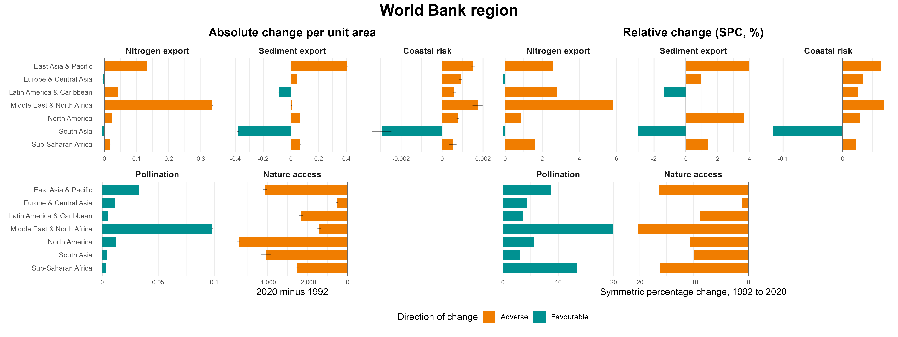

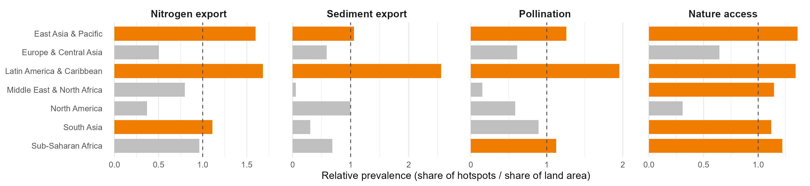

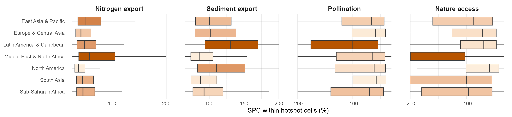
:::


## Regional Trajectories by Income Group

::: {#fig-annex-inc-trajectories layout-ncol=1}
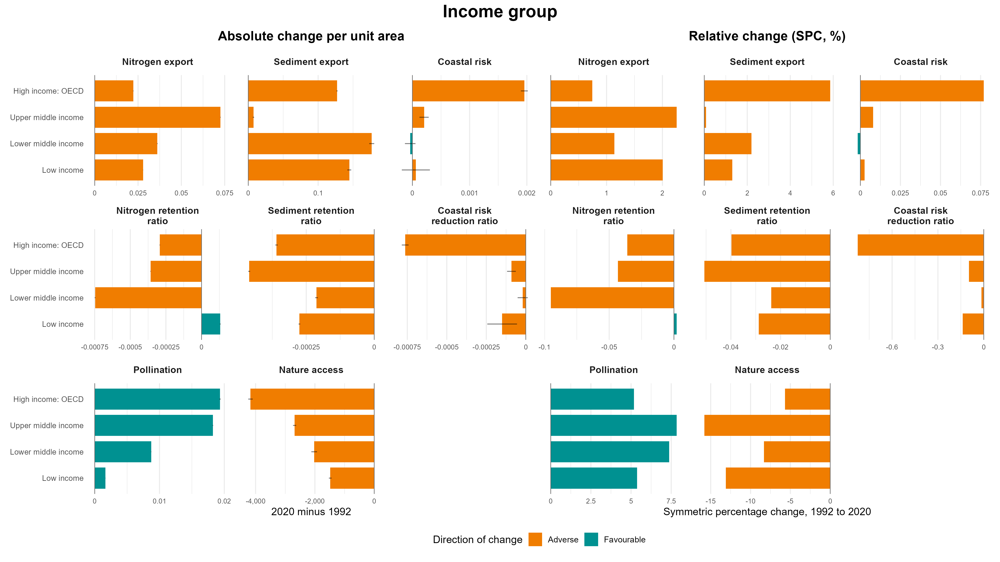


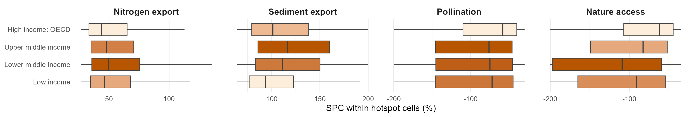
:::

## Geographic Distribution by Country

::: {#fig-annex-country-trajectories layout-ncol=1}

:::

