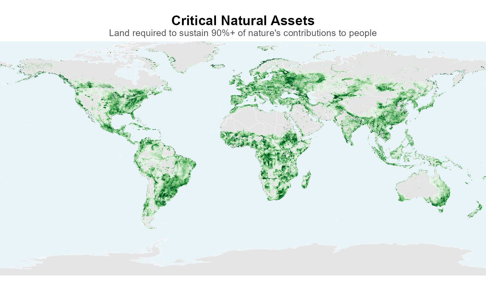
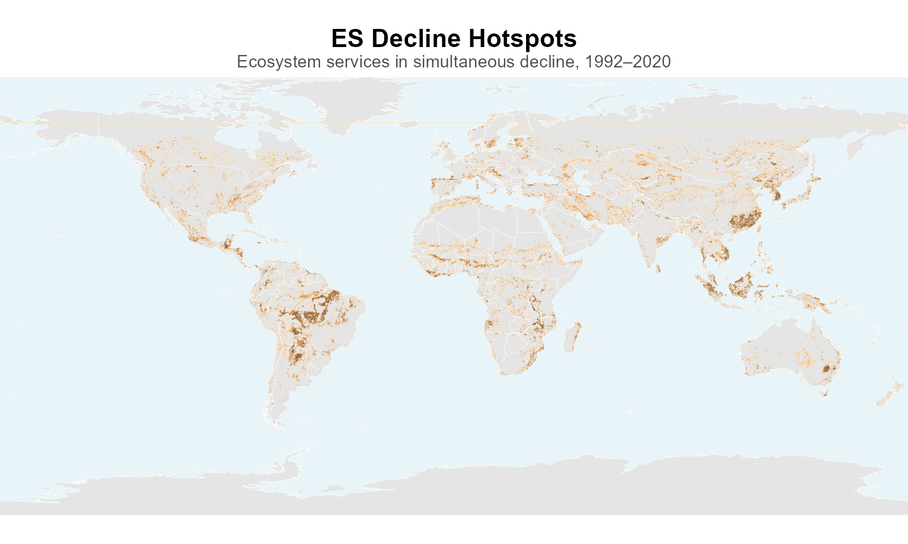
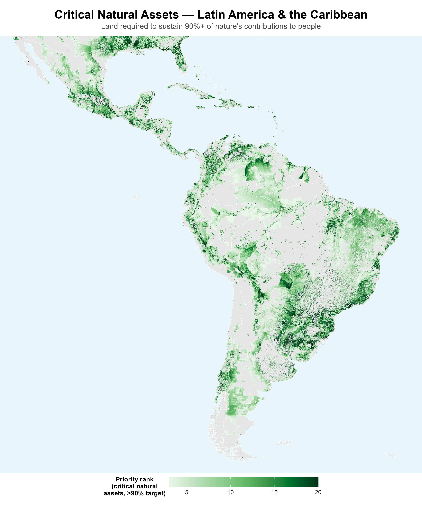

## A global approach to ecosystem service modeling {.smaller}

NatCap/WWF Global Science models ecosystem services worldwide — both where they're **most critical to protect or restore (opportunity)** and where they're **declining (risk)**:

::: {.columns}
::: {.column width="50%"}
{width="100%"}
:::
::: {.column width="50%"}
{width="100%"}
:::
:::

- **Multi-service, multi-resolution** — ecosystem service and natural-asset models at native 300m-to-2km resolution; both **critical natural asset** and **decline hotspot** have precise, threshold-based definitions.

::: {.notes}
Opening line (~10 sec): name who's on the work — Becky/Rich lend NatCap credibility even though they're not presenting. If someone else is presenting in the room while you support on Zoom, agree in advance who says this.

This slide is deliberately broader than just this one pipeline — it's the "our team does this at global scale, here are two concrete outputs" framing, not a methods lecture. This is a banker audience, not software developers or academics — don't lead with InVEST or the modeling stack; lead with what the maps *are*. ~45 seconds.

Opportunity leads, risk follows — both on this slide and in the next two slides' order. Establish what's valuable first, then show what's threatening that value; landing on risk cold, with no positive frame first, reads worse to a banker audience than the reverse.

**Definitions (moved off the slide for space, not dropped)**: **critical natural assets** are the land area required to sustain 90%+ of nature's contributions to people (Chaplin-Kramer et al. 2022). A **decline hotspot** is the 5% of locations where a service's condition is worsening most severely relative to its local baseline — for most services that's the sharpest decrease, but for a few "damage" indicators (sediment export, nitrogen export, coastal risk) the harmful direction is an *increase*, not a decrease. "Decline" means the service getting worse, not literally "the number went down" — see the risks slide's notes for why this matters for two of the three named services there.

Dropped the specific "8" ecosystem-service count from the visible bullet deliberately — with critical natural assets (12 NCPs) also on this slide now, citing "8" next to a different number invited a mismatch question that isn't the point. "Multi-service" carries the claim without a number that needs reconciling against a different model's count.

The two thumbnails exist specifically because the placeholder for this slot in Ryan's shared deck said "global analysis of critical services" — showing both at full global extent, small, before zooming into LAC on the next two slides, proves the "already global" claim visually instead of just asserting it.

If asked why critical natural assets look widespread and hotspots look sparse in the thumbnails: that's expected, not a scale mismatch — critical natural assets are a 90%-of-value threshold (much broader coverage), hotspots are the top 5% by definition (rare). Different definitions, both legitimate. Full explanation on the opportunities slide's notes.

If asked about resolution: 300m is the native modeling resolution everywhere; grid aggregation (10km for hotspots, native ~2km for critical natural assets) is a screening/analysis choice, not a technical limit.
:::

## Opportunities: critical natural assets in Latin America {.smaller}

::: {.columns}
::: {.column width="55%"}
- **Critical natural assets** = the land area required to sustain **90%+** of nature's contributions to people — a smaller footprint doing outsized work (Chaplin-Kramer et al. 2022, *Nature Ecology & Evolution*)
- Widespread across LAC's **forests, highlands, and coastal ecosystems** — many of these same valuable places are also where **ecosystem service decline is most intense**
- Complements the **SIPA case study** — global screening here, regional and local delivery there
- **Can be applied at finer spatial scales** — country level, or other administrative or priority units, as needed
:::
::: {.column width="45%"}
{height="620px"}
:::
:::

::: {.notes}
This is the "opportunity" half of the risk/opportunity pairing set up on slide 1 — land closing on what's worth protecting or restoring, before the next slide turns to what's declining. ~1.5-2 minutes.

**The connection to the next slide, worth making explicit if it doesn't land on its own**: critical natural assets are the most *valuable* places; decline hotspots are the places where *change* is most intense. They're related but not identical — the overlap between "valuable" and "changing fastest" is the strongest possible case for intervention, and that's the real story underneath both slides, not two disconnected facts.

**Why this map looks so much more widespread than the hotspots map, if asked**: this is not a scale mismatch, both maps use the identical bounding box, CRS, and output dimensions (verified directly). It's a real difference in what the two layers measure. Critical natural assets are a 90%-of-value threshold — much more of the land area, because most of nature's contributions to people come from a broad base, not just a thin extreme tail. Hotspots are the top 5% by definition (rare, by construction). Different definitions, both legitimate; don't let it read as an inconsistency.

**What the color scale actually means, if asked for technical detail**: values are a priority rank (1-20) from a joint optimization across all 12 local NCPs simultaneously — value 20 means the cell is still needed even at the most restrictive 5%-of-land solution, value 1 means it's only needed once the target expands to 100%. It is not a literal count of "how many services flag this cell," though high values do correlate with multi-service importance in practice, since an optimizer under a tight area budget can only afford cells that deliver many services at once. "Critical" = value > 2, the paper's own 90% threshold.

Data: Chaplin-Kramer et al. (2022), "Mapping the planet's critical natural assets," *Nature Ecology & Evolution*. https://doi.org/10.1038/s41559-022-01934-5. Raster: https://osf.io/whrq6/, local_NCP_all_targets (12 local-scale NCPs, national-scale optimization, matches the paper's Fig. 1).

The SIPA line is deliberately light — this is Jeff's case study, not something to characterize secondhand. Say it as a one-sentence connector and move on. If anyone asks for SIPA specifics, defer explicitly: "that's [Jeff]'s case study, happy to loop you in" — don't improvise an answer about a program you don't run.
:::

## Risks: Latin America's disproportionate ES decline {.smaller}

::: {.columns}
::: {.column width="55%"}
*What this capability can characterize, applied to Latin America:*

- LAC holds **22%** of the world's ES decline hotspots, while accounting for just **16%** of the world's land area — the most disproportionate burden of any world region (hotspots of *decline*, not of highest provision)
- Its **Sediment Export** hotspots — where sediment reaching waterways is rising fastest — alone make up **39%** of the world's total, the single largest region-service imbalance anywhere in our global dataset
- **Nitrogen Export** (rising fastest) and **Sediment Retention** (falling fastest) follow the same pattern — **26%** and **25%** of world hotspots respectively
- **Compound risk** — locations where multiple services decline together, a prioritization signal in its own right

**This capability can be applied at finer spatial scales** — country level, or other administrative or priority units, as needed.
:::
::: {.column width="45%"}
{height="620px"}
:::
:::

::: {.notes}
This slide carries the persuasion, and it's also the "beyond global" demonstration — we're not just describing LAC, we're showing that the same global pipeline can zoom into a region and characterize exactly what it finds there. Lead with LAC's Sediment Export line — "2.5 times what its land area alone would suggest" — and let it sit for a beat: "we didn't design this study around IDB; IDB's region simply already tops our global ranking on the exact services this workshop cares about." Then the compound-risk point: this isn't just one service under pressure in isolation, we can find and characterize where multiple services decline together — the map is illustrating that capability, not the point itself. Close by noting the same zoom-in works at country level or other spatial units — don't name a specific country here yet. ~2 minutes total for both halves.

**"Hotspot" on its own is genuinely ambiguous** — in some ES literature it means highest provision, here it always means the most severe detrimental change, not simply "the number went down." Say "decline hotspots" out loud at least once, even though the slide shortens to "hotspots" after the first bullet for readability.

**Directionality matters here, get this right if asked**: this pipeline explicitly classifies three services as "damage" indicators where an *increase* is the harmful direction — sediment export, nitrogen export, and coastal risk (confirmed directly in `scripts/mapping/make_faceted_maps.R`: `damages <- c("N_export", "Sed_export", "C_Risk")`, comment "Increase is Bad, Decrease is Good"). Every other service (pollination, nature access, the retention ratios) is the opposite — decrease is the harmful direction. Two of the three named services on this slide are damage-type: Sediment Export and Nitrogen Export hotspots are the sharpest *increases*, not decreases. Sediment Retention is the normal case — its hotspots are the sharpest decreases. Saying "sediment export declined" out loud would be factually backwards — it rose, and that's the bad outcome.

All four stats on this slide are now stated as two direct percentages (share of world hotspots vs. share of world land area) rather than ratios/multipliers — verified directly against source data, not estimated. Aggregate: `hotspots_global_pct.gpkg` (LAC: 48,530 of 220,767 world hotspot cells with a region assigned = 22.0%; 203,768 of 1,302,058 world land cells = 15.6%; ratio 1.40, exactly matching the figure previously used, just framed more concretely — like a "X% of species in Y% of land area" biodiversity stat instead of an abstract multiplier). Per-service: `data/processed/tables/regional_subsets/region_wb/hotspot_area_stats_region_wb.csv` (Sediment Export: LAC has 39.3% of world Sediment Export hotspots vs. 15.6% land share, ratio 2.51; Nitrogen Export: 25.8% vs. 15.6%, ratio 1.65; Sediment Retention: 25.1% vs. 15.6%, ratio 1.61). LAC still ranks #1 by a clear margin on the aggregate (East Asia & Pacific is second at 1.28×, South Asia and Sub-Saharan Africa near parity, everyone else below 1.0).

If asked for the raw ratios instead of percentages: LAC 1.40×, LAC Sediment Export 2.51×, Nitrogen Export 1.65×, Sediment Retention 1.61×; Peru Sediment Export 1.28× (Peru is not named on this slide — deliberately generic, see below).

Dropped the Pollination stat entirely — it's not part of the water/hydrology/sediment story this workshop cares about, so it read as padding rather than evidence.

Once the specific corridor name is confirmed with Jeff, decide whether to reintroduce a named country example here — currently deliberately generic pending that conversation.

**Note on scope**: per Becky's restructure (2026-07-10 feedback), this deck is now 3 slides total, integrated into a broader shared presentation, and this is the last of the three — the explicit "ask" (one pilot corridor, Peru as candidate) that used to close this deck was dropped along with the standalone proposal slide. If that ask still needs to be voiced live, it likely belongs in the broader shared deck now, not here — confirm with Becky/Ryan rather than assuming it's covered.
:::
