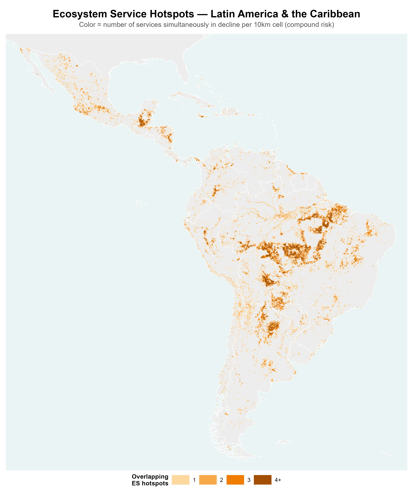

## An InVEST-based evidence base, already global, already reproducible {.smaller}

- **8 ecosystem services** modeled with InVEST — sediment retention & export, nitrogen retention & export, coastal risk reduction, pollination, nature access
- **1992–2020** change, at **1.3 million** 10km grid cells, worldwide
- Open-source, reproducible R/Python pipeline — built once, rerunnable at finer resolution or narrower geography
- Three outputs per hotspot: **WHERE** (spatial prioritization) · **WHO** (3.1B in-situ / 7.6B connected beneficiaries) · **WHY** (land-cover driver attribution)

> Same InVEST modeling architecture NatCap Alliance partners already use for valuation and planning. Supply is only half the picture — provision matters relative to who depends on it. Identifying and locating beneficiaries (the WHO layer) is what turns a biophysical map into a prioritization tool, not just a description of ecological change.

::: {.notes}
Opening line (~10 sec): name who's on the work — Becky/Rich lend NatCap credibility even though they're not presenting. If someone else is presenting in the room while you support on Zoom, agree in advance who says this.

Lead with the InVEST/NatCap Alliance line — it's the credibility hook for an IDB technical audience. Don't linger on methodology; the point of this slide is "this already exists, at global scale, and is extensible" — not a methods lecture. ~1.5 minutes.

If asked for detail: WHERE = top-5% relative-change cells per service; WHO = in-situ population plus downstream/travel-time-connected beneficiaries (serviceshed multiplier); WHY = overlay against land conversion drivers (forest loss, cropland/urban expansion, grassland dynamics) — keep the attribution numbers out of this deck, that finding is still under internal review.

If asked for a citation on the supply+demand point: Mandle et al. 2017 (PLOS ONE, "Assessing ecosystem service provision under climate change to support conservation and development planning in Myanmar") applied the same logic with the same InVEST tools. Useful to have ready, but don't lead with it — it's a 2017 single-country case study, and the framing point stands on its own without naming it.
:::

## Latin America shows the strongest water-related signal in our dataset {.smaller}

::: {.columns}
::: {.column width="55%"}
- LAC holds **40% more of the world's ES hotspots than its landmass alone would predict** (109,000 hotspot cells) — the most disproportionate burden of any world region
- Its **Sediment Export** hotspots run **2.5 times** what LAC's land area would predict — the single largest region-service imbalance anywhere in our global dataset
- **Nitrogen Export** and **Sediment Retention** are also well above expected — roughly **65%** and **61%** higher than LAC's land share alone would predict

**And down to Peru:** Sediment Export hotspots above expected levels there too, in an area where WWF and IDB already have conservation-corridor work underway.
:::
::: {.column width="45%"}
{height="620px"}
:::
:::

::: {.notes}
This slide carries the persuasion. Lead with LAC's Sediment Export line — "2.5 times what its land area alone would predict" — and let it sit for a beat: "we didn't design this study around IDB; IDB's region simply already tops our global ranking on the exact services this workshop cares about." Then drop down to Peru quickly: "and it's not just a regional average — it holds at the country we already have people on the ground in." Keep Peru's framing modest, not a second superlative. ~2 minutes total for both halves.

All figures are "share of hotspot area relative to share of land area" — say it in words, not as a bare ×, or it reads like an unexplained statistic. If asked for the raw ratios: LAC 1.40×, LAC Sediment Export 2.51×, Nitrogen Export 1.65×, Sediment Retention 1.61×; Peru Sediment Export 1.28×.

Peru's number (1.28×) is deliberately not compared side-by-side with LAC's regional number (2.51×) on the slide — a country will rarely match a regional aggregate exactly, and trying to explain that gap live (more concentrated in a smaller area? different land-use mix?) is a rabbit hole with no confident answer yet. If asked directly, say that plainly rather than guessing. Dropped the Pollination stat entirely — it's not part of the water/hydrology/sediment story this workshop cares about, so it read as padding rather than evidence.

Confirm the specific corridor name with Jeff before the 13th and say it here instead of "conservation-corridor work."
:::

## Proposal: one joint pilot, turning evidence into a feasibility-ready product {.smaller}

- Downscale the same pipeline to **one** IDB priority corridor — Peru as the starting candidate
- Overlay ES hotspots + driver attribution + beneficiary/serviceshed mapping directly onto candidate infrastructure sites
- Feeds straight into green/grey/hybrid cost-benefit comparison and standardized ES metrics — this workshop's own stated deliverables

> **The ask:** identify one pilot corridor as a concrete output of this workshop series, feeding directly into the 2026–2027 joint roadmap.

::: {.notes}
Close on the ask, not a summary. This is the slide that should land as "here is something we can actually agree to do in the room today" — tie it explicitly to the structured-discussion question "what concrete analytical products should be developed?" so it's easy for the facilitator to pick up. ~1.5–2 minutes, then hand back for Q&A.
:::
