# Part 1: Motivation {background-color="#004D1E"}

## Ecosystem Services Under Pressure

::: {.columns style="font-size: 0.82em; align-items: flex-start;"}
::: {.column width="50%"}

### Context
- Ecosystem services — pollination, water regulation, coastal protection — are declining globally
- Land cover change, climate change, and habitat degradation are the primary drivers
- Billions of people depend on ecosystem services for food security, water supply, and climate regulation
- Losses are **geographically uneven**: some regions and populations bear a disproportionate burden

:::

::: {.column width="50%"}

### Gaps in global change assessment
- *Where* is ES change most severe?
- *Who* bears the greatest burden of that change?
- *What* is driving it?
- Temporally explicit, spatially comparable, multi-service assessments remain scarce

:::
:::

::: {.notes}
- The left column is the situation: we have global evidence that ES are declining and that billions depend on them. This is well-established.
- The right column is the gap that motivates this work: we lack the spatial granularity to answer where, who, and what at global scale simultaneously.
- Chaplin-Kramer et al. (2019 Science) quantified global NCP change for the first time. Our work extends it: 1992–2020 trend, hotspot detection, socioeconomic profiling, and attribution.
- ~2 min
:::

---

## Our Framework: Four Questions

::: {.columns}
::: {.column width="25%"}

### WHAT?
How has the provision of ecosystem services changed — in direction, magnitude across regions?

:::

::: {.column width="25%"}

### WHERE?
The geography of change — where is decline most intense?

:::

::: {.column width="25%"}

### WHO?
Which populations are most exposed to ES provision loss, and at what scale?

:::

::: {.column width="25%"}

### WHY?
Is monitoring land cover change alone enough to track where ES provision is declining most?

:::
:::

::: {.notes}
- This four-pillar structure runs through the entire book and paper.
- WHAT: Path A, pixel-level global summaries.
- WHERE: Path B, 10km hotspot grid.
- WHO: KS socioeconomic profiling + serviceshed multiplier.
- WHY: Does land cover change alone capture where ES provision is declining most? Spatial co-occurrence of ES hotspots and LC conversion hotspots — the "monitoring gap" is the core finding.
:::

# Part 2: Methods {background-color="#004D1E"}

## Data Inputs: 1992 & 2020 Global Layers

::: {.columns style="font-size: 0.85em;"}
::: {.column width="34%"}

### Ecosystem Services
**InVEST models, 300m**

- Nitrogen Export & Retention
- Sediment Export & Retention
- Pollination
- Coastal Risk & Protection
- Nature Access

:::

::: {.column width="33%"}

### Land Cover
**ESA CCI + C3S, 300m**

- 1992 & 2020 endpoints
- Reclassified to 9 functional classes
- Source of both InVEST inputs and attribution analysis

:::

::: {.column width="33%"}

### Socioeconomic
**Gridded, 2020**

- Population (GHS-POP)
- GDP
- Human Development Index
- Gini coefficient

:::
:::

::: {.notes}
- Time period: 1992–2020 (28 years). Land cover at endpoints only — no annual transitions.
- ESA CCI has a minor processing-chain discontinuity at the 2015/2016 version boundary — acknowledged as a limitation.
- Land cover serves a dual role: primary InVEST input AND baseline for the spatial attribution analysis.
:::

---

## Eight Ecosystem Services

[Eight services across three thematic areas — all globally modelable with InVEST at consistent resolution.]{style="font-size: 0.8em;"}

::: {style="font-size: 0.78em;"}

| Theme | Service | What it measures |
|:---|:---|:---|
| **Habitat & Access** | Nature Access | Proximity to intact natural habitat — recreational, cultural, wellbeing value |
| | Pollination | Wild pollinator habitat support — food security for pollination-dependent crops |
| **Coastal Risk** | Coastal Protection | Wave energy attenuation by coastal habitats (mangroves, reefs, wetlands) |
| | Coastal Risk Reduction Ratio | Proportional reduction in coastal vulnerability from habitat presence |
| **Hydrological Regulation** | Nitrogen Export | Nutrient loading reaching waterways — indicator of water quality pressure |
| | Nitrogen Retention Ratio | Fraction of nutrient load filtered by the landscape |
| | Sediment Export | Erosion delivery to stream networks |
| | Sediment Retention Ratio | Fraction of potential erosion retained on-slope by vegetation |

:::

::: {.callout-note style="font-size: 0.75em;"}
**Why retention ratios?** A declining ratio signals the landscape is losing its filtering capacity even when absolute export volumes stay flat — a more sensitive indicator of functional degradation.
:::

::: {.notes}
- The export and ratio services are distinct: export tells you how much leaves the landscape; the ratio tells you how well the landscape is filtering what it generates. Both can move independently.
- Service selection follows Chaplin-Kramer et al. (2019) — these 8 cover the broadest human-nature interdependence dimensions that InVEST can model globally at consistent resolution.
- Retention ratios showed a distinct third socioeconomic typology in the KS analysis (moderate-to-higher HDI, lower GINI) — different from both coastal and terrestrial provisioning services. This distinction would be invisible if we only tracked export volumes.
:::

---

## Socioeconomic Context: The WHO Input Layers

{width="95%" fig-align="center"}

::: {.notes}
- Population and GDP: universal signal — hotspot cells are denser and wealthier than background across all 8 services. Not a distinguishing feature of any service type; just reflects where ecosystem services matter to people.
- HDI and GINI: the discriminating variables — coastal services cluster in higher-HDI settings; terrestrial provisioning services cluster in lower-HDI, higher-inequality settings.
- All four layers are 2020 values — a temporal mismatch with the 1992–2020 change window. Acknowledged limitation.
:::

---

## Spatial Framework & Analytical Groupings

[*Analysis unit: ~1.3 million 100 km² equal-area cells (IUCN AOO 10km grid) — results aggregated across four groupings*]{style="font-size: 0.78em;"}

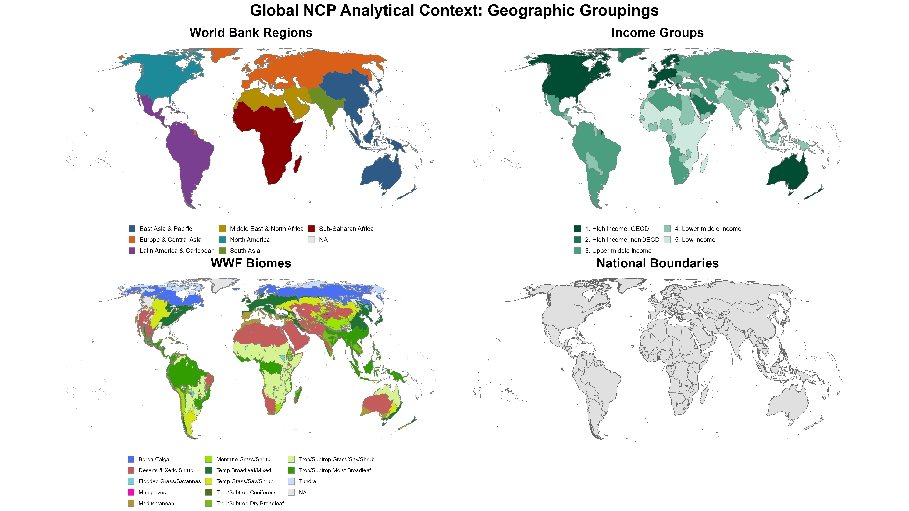{width="88%" fig-align="center"}

::: {.notes}
- The 10km equal-area grid is the key methodological choice: it puts large and small ecosystems on equal footing (no size bias).
- World Bank regions → geopolitical framing for policy audiences.
- Income groups → equity and adaptive capacity lens.
- Biomes → ecological framing for conservation audiences.
- Country → operational scale for national policy.
- Using all four avoids the arbitrary choice of a single aggregation and lets patterns emerge at multiple scales.
:::

---

## Why Two Pathways?

::: {.columns style="font-size: 0.84em; align-items: flex-start;"}
::: {.column width="50%"}

### Path A — Pixel-level (300m)
*Compare first, then aggregate*

- Each pixel compared 1992 → 2020 at native resolution
- Results summed to regions after comparison
- Preserves every individual gain and loss
- **Used for:** WHAT — global and regional trajectories

:::
::: {.column width="50%"}

### Path B — 10km equal-area grid
*Aggregate first, then compare*

- 300m rasters summarised into ~1.3M equal-area cells (100km² each) *before* computing change
- Equal-area projection: every cell = 100km² regardless of latitude
- Standardised units enable global hotspot ranking
- **Used for:** WHERE, WHO, WHY — hotspot detection and profiling

:::
:::

::: {.callout-note style="font-size: 0.75em; margin-top: 0.5em;"}
**Why not one path?** Averaging Path B cell values up to broad regions causes sign divergence between absolute and percentage change in some services — a MAUP artefact. Path A avoids this by never passing through an intermediate grid step.
:::

::: {.notes}
- This is the slide that explains the design decision that generates the most questions. The key is: the ORDER of aggregation vs. differencing matters.
- Path A: diff → aggregate. Path B: aggregate → diff. Different questions, different orders.
- The MAUP artefact: Jerónimo discovered this empirically — in some cases N export showed a positive SPC at the regional level via Path B but a negative absolute change via Path A. Both were mathematically correct at their respective scales. This is not an error; it is a genuine scale-dependence finding.
- Equal-area: a lat/lon grid at 10 arc-minutes would have cells ~50% smaller near 60°N than near the equator. The IUCN AOO equal-area grid removes that bias.
:::

---

## Analytical Pipeline

```{mermaid}
%%{init: {'flowchart': {'rankSpacing': 50, 'nodeSpacing': 25}, 'themeVariables': {'fontSize': '13px'}}}%%
flowchart TB
    RawES["InVEST ES Models\n300m · 1992 & 2020"]
    RawGrid["IUCN 10km Grid\nRegional Attributes"]
    RawLC["ESA CCI Land Cover\n300m · 1992 & 2020"]
    RawSoc["Socioeconomic Data\nPop · GDP · HDI"]

    IntA["Path A\nPixel-level"]
    MathA["Path A Metrics\nSPC & Abs. Δ"]

    IntB["Path B\n10km Grid"]
    MathB["Path B Metrics\nSPC & Abs. Δ"]

    MathLC["Land Cover\nTransitions"]
    MathSoc["KS Tests &\nSocioec. Profile"]
    MathBenef["Serviceshed\nRouting"]

    P1(["WHAT\nGlobal Trajectories"])
    P2(["WHERE\nHotspot Detection"])
    P3(["WHY\nMonitoring Gap"])
    P4(["WHO\nExposure & Multiplier"])

    RawES ==> IntA & IntB
    RawGrid ==> IntB & MathLC & MathSoc
    RawLC ==> MathLC
    RawSoc ==> MathSoc & MathBenef

    IntA ==> MathA ==> P1
    IntB ==> MathB ==> P2

    P2 ==> MathLC & MathSoc & MathBenef
    MathLC ==> P3
    MathSoc ==> P4
    MathBenef ==> P4

    classDef c_what fill:#007930,stroke:#004D1E,stroke-width:2px,color:#FFF;
    classDef c_where fill:#7B8327,stroke:#515619,stroke-width:2px,color:#FFF;
    classDef c_why fill:#F07D00,stroke:#A85700,stroke-width:2px,color:#FFF;
    classDef c_who fill:#F5D200,stroke:#B39900,stroke-width:2px,color:#333;

    class RawES,IntA,MathA,P1 c_what;
    class RawGrid,IntB,MathB,P2 c_where;
    class RawLC,MathLC,P3 c_why;
    class RawSoc,MathSoc,MathBenef,P4 c_who;
```

::: {.notes}
- Two parallel paths: Path A gives global pixel-level summaries (the "WHAT" chapter); Path B identifies local hotspots (WHERE, WHO, WHY).
- The hotspot output from Path B feeds three downstream analyses in parallel: attribution (LCC overlay), socioeconomic profiling (KS tests), and serviceshed routing (multiplier effect).
- All code is in R/Quarto notebooks; Python (Docker) handles the initial zonal extractions at 300m.
:::

---

## Key Metrics

::: {.columns}
::: {.column width="50%"}

### Symmetric Percentage Change (SPC)

<div style="font-size:0.75em">
$$\text{SPC} = \frac{T_{2020} - T_{1992}}{(|T_{2020}| + |T_{1992}|) / 2} \times 100$$
</div>

Normalised for baseline size; symmetric around zero; cross-service comparable. Bounded −200% (total loss) to +200% (new emergence).

:::

::: {.column width="50%"}

### Hotspot Definition
- **Relative** — ranked within each service's own distribution, not an absolute threshold
- **Most adverse 5%** per service *(direction is service-specific)*
- **Compound Risk** = 2+ services in worst-5% in the same cell
- Puts large ecosystems and small remnants on equal footing

:::
:::

---

## Land Cover Change Analysis

::: {.columns}
::: {.column width="50%"}

### Deriving LCC Metrics
- **Two endpoints**: ESA CCI (1992) → C3S (2020) at 300 m
- **Pontius contingency matrix** — separates Gross Loss, Gross Gain, and Exchange *(net change masks simultaneous loss and gain)*
- Per-pixel temporal comparison, then aggregated to the same 10 km equal-area grid
- Five drivers: forest loss, cropland expansion, urban expansion, wetland loss, grassland conversion

:::

::: {.column width="50%"}

### Co-occurrence Design
- **Symmetric threshold**: ES worst-5% (SPC) vs. LCC top-5% (gross conversion magnitude), on the same 10 km grid
- **Key question**: what share of ES hotspot cells co-occur with intense conversion — and what share don't? That complement is the *attribution gap*

:::
:::

::: {.notes}
- The Pontius approach matters: net change (forest in 1992 minus forest in 2020) would miss simultaneous clearing and regrowth in the same cell. Gross Loss captures what was converted regardless of what regrew.
- Both thresholds operate on the same grid so the comparison is apples-to-apples.
- The ~65.5% gap is a spatial co-occurrence finding, not a causal partition — moderate LCC may still be present in those cells, just below the top-5% threshold. The 34.5% that does overlap is nearly 10x the 4.1% background rate (odds ratio 12.2) — a strong, consistent positive association, true for every one of the five drivers individually.
:::

---

## Statistical Analysis: KS Tests + Cliff's Delta

::: {.columns}
::: {.column width="50%"}

**Hotspot cells** vs. **Median-background cells**
(47.5th–52.5th percentile of ES change — business-as-usual)

Test variables:
- Population density (GHS-POP 2020)
- GDP (gridded, 2020)
- Human Development Index (HDI)
- Gini coefficient

:::

::: {.column width="50%"}

**Two-step interpretation:**

1. *KS statistic + FDR-corrected p-value* → Do distributions differ?
2. *Cliff's Delta (δ)* → Direction and magnitude

Cliff's Delta = probability that a random hotspot cell has a **higher** value than a random background cell.
δ > 0: hotspot higher; δ < 0: hotspot lower.

**Large-n correction**: background = median 5% of landscape, not the full 1.5M-cell distribution.

:::
:::

::: {.notes}
- Why median background, not global mean? The comparison isolates what is distinctive about *intense* decline vs. *typical, stable* conditions.
- Cliff's Delta is the practical companion to KS: KS with 67,000 hotspot cells will be "significant" for almost any difference. Delta tells you the magnitude.
- δ = 0: distributions fully overlap (random chance). δ = ±1: complete separation. Our range: +0.47 to +0.66 for Pop/GDP.
- **On FDR (if asked):** Running 40 tests at once means ~2 would appear significant by chance alone. FDR correction adjusts the bar across all 40 together to limit false alarms. That 39/40 pass even after correction means the signal is real — the correction barely changed anything. The one non-significant result (Coastal Risk Reduction Ratio × agricultural plot intensity) makes ecological sense.
:::

# WHAT: Global Trajectories {background-color="#007930"}

## WHAT: Ecosystem Service Change, 1992–2020 {.smaller}

[*Path A · pixel-level global summaries, aggregated by World Bank region*]{style="font-size: 0.78em;"}

::: {.columns}
::: {.column width="42%"}
**Where: spatial pattern (% change)**

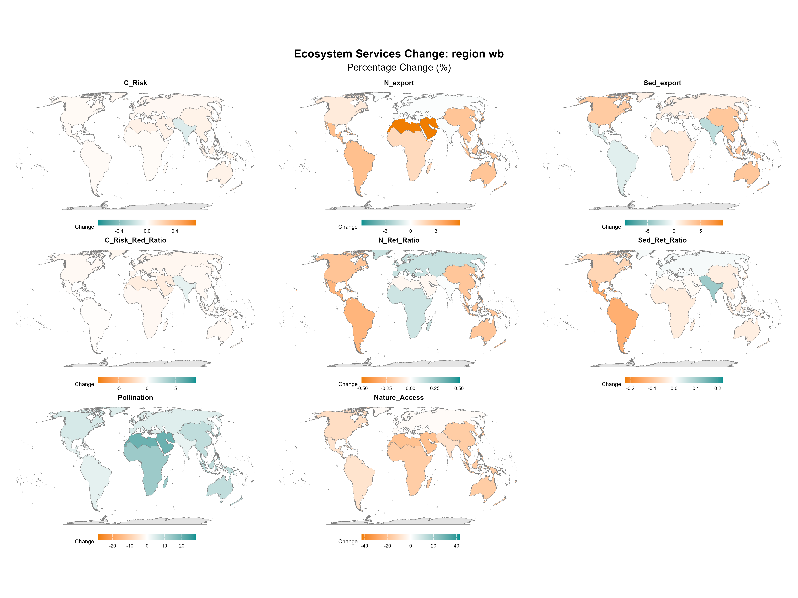{width="100%" fig-align="center"}
:::
::: {.column width="58%"}
**By region: magnitude (% change)**

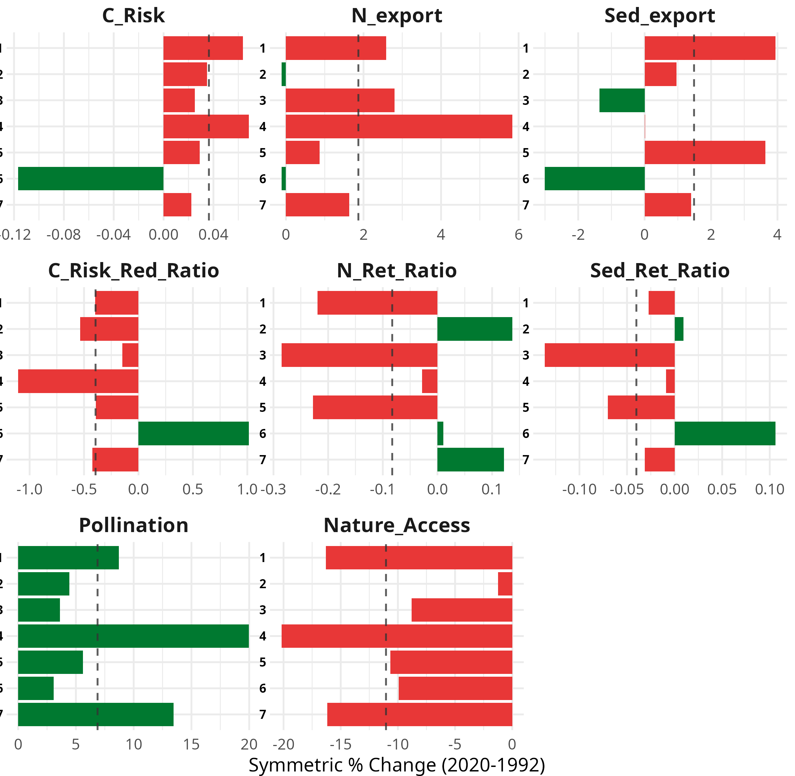{width="100%" fig-align="center"}
:::
:::

[World Bank regions: 1 East Asia & Pacific · 2 Europe & Central Asia · 3 Latin America & Caribbean · 4 Middle East & North Africa · 5 North America · 6 South Asia · 7 Sub-Saharan Africa]{style="font-size: 0.55em;"}

::: {.notes}
- Path A result: pixel-level summaries aggregated to WB region. Map and bars show the same percentage-change metric, two ways — spatial pattern on the left, region-by-region magnitude and direction on the right.
- Key message: absolute and percentage change are often *decoupled* (not shown here — see appendix/paper for the absolute-change panel). High absolute loss does not always mean high proportional stress — and vice versa.
- Sub-Saharan Africa and South Asia show the largest absolute losses in several services. Latin America & Caribbean shows high proportional (SPC) stress.
- This global WHAT sets the stage for WHERE: not all of this change is evenly distributed within regions.
:::

# WHERE: Geographic Hotspots {background-color="#004D1E"}

## WHERE: Hotspots Concentrate in Low- and Middle-Income Regions

[*Path B · 10km equal-area hotspot grid*]{style="font-size: 0.78em;"}

::: {.columns}
::: {.column width="56%"}

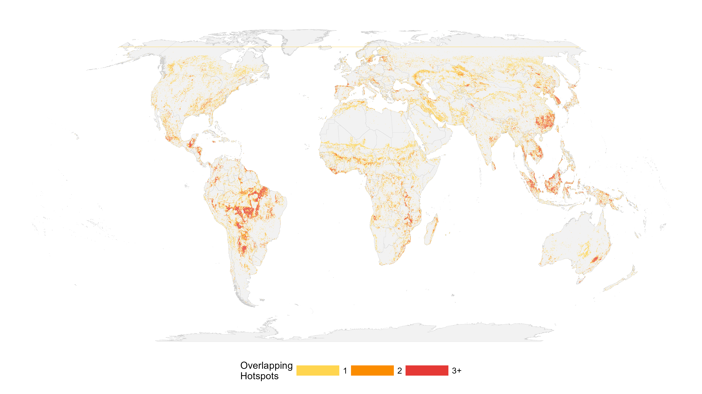{width="100%"}

:::

::: {.column width="44%"}

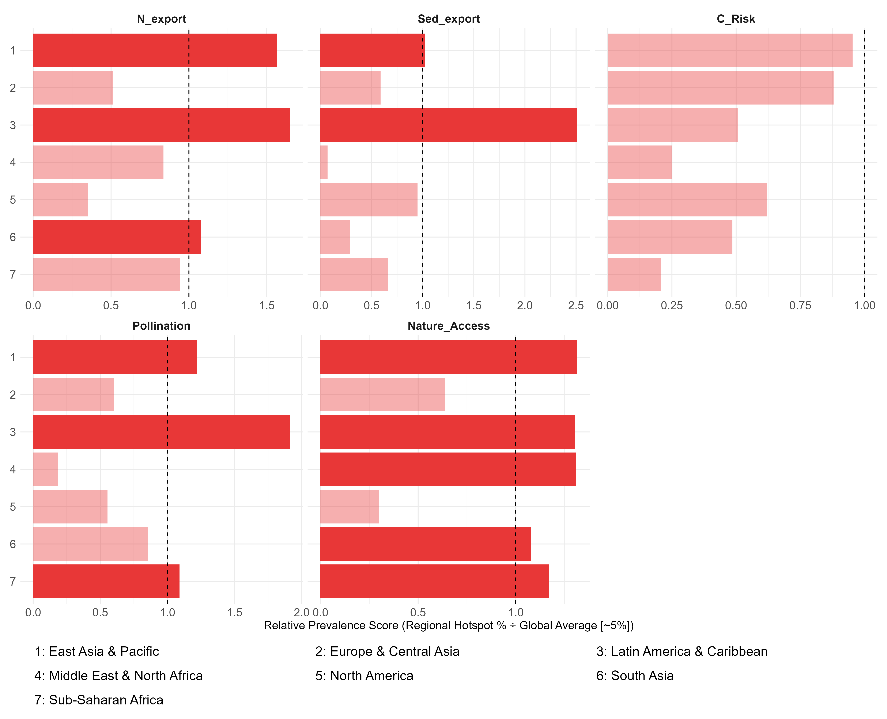{width="100%"}

:::
:::

::: {.notes}
- Left map: where the hotspot cells are. Darkest red = 3+ services declining simultaneously. Notice the clustering in Latin America, SE Asia, and Sub-Saharan Africa — not random scatter.
- Right chart: corrects for region size. LAC and EAP are the only regions above 1.0× overall (1.40× and 1.30× avg). **[VERIFY before presentation: the per-service values ~2.5× for LAC sediment export and 1.5–1.8× for EAP water quality — check against intensity chart directly]**
- Compound hotspot cells are the key conservation priority: maximum co-benefit across multiple services from a single intervention.
- ~90 seconds
:::

---

## WHERE: Compound Risk & Income Burden

::: {.columns}
::: {.column width="56%"}

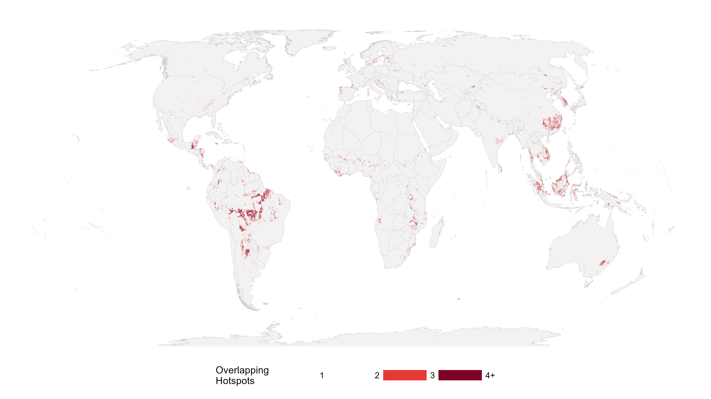{width="100%"}

:::

::: {.column width="44%"}

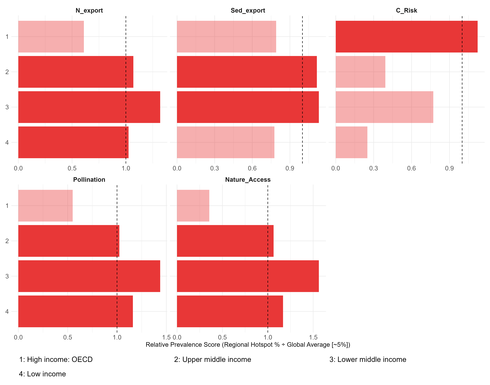{width="100%"}

:::
:::

::: {.notes}
- Left: compound risk geography. The most affected areas (3+ service decline) cluster in tropical Latin America, SE Asia, and parts of Sub-Saharan Africa.
- Right: the income burden is not random. Lower-middle income countries show 1.6× disproportionate hotspot intensity — they carry more than their share relative to land area.
- This combination map + income chart makes the equity case: the burden falls disproportionately on low- and middle-income countries — specifically lower-middle-income countries (least adaptive capacity, most nature-dependent economies) that bear the compound burden.
:::

# WHO: Exposed Populations {background-color="#007930"}

## WHO: Three Socioeconomic Typologies

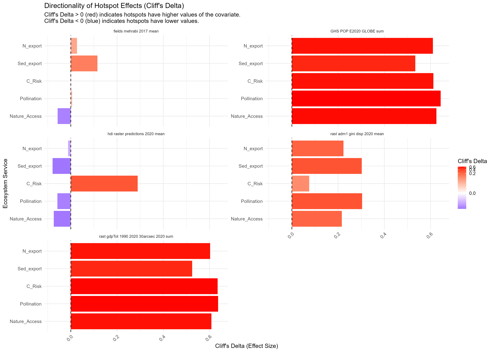{width="100%" fig-align="center"}

::: {.columns}
::: {.column width="33%"}

### Universal signal
**All 8 services:** higher population density and GDP (δ +0.47–0.66). Hotspots are embedded in human landscapes — not wilderness.

:::

::: {.column width="33%"}

### Coastal typology
**C_Risk, C_Risk_Red_Ratio:** higher HDI (+0.30). Declines concentrate in dense, developed coastlines.

:::

::: {.column width="33%"}

### Terrestrial vs. Retention
**Pollination, N/Sed export, Nature Access:** lower HDI, higher GINI (+0.22–0.30) — less-developed, more unequal.
**Retention ratios:** positive HDI, *lower* GINI (−0.11 to −0.18) — a third, structurally distinct pattern.

:::
:::

::: {.notes}
- Three typologies, not two. The old framing of "urban vs. agricultural" was wrong. Pollination is NOT concentrated in agricultural zones — agricultural plot intensity (fields_mehrabi) shows Cliff's Delta ≈ 0 across all services.
- The real split is HDI + GINI, not urban vs. rural.
- Coastal (C_Risk): higher HDI — dense, developed coastlines.
- Terrestrial provisioning (Pollination, N/Sed export, Nature Access): lower HDI + substantially higher GINI. Less adaptive capacity.
- Retention ratios (N_Ret_Ratio, Sed_Ret_Ratio): surprising reversal — lower inequality than background. Consistent with intensive but homogeneous agricultural regions (W. Europe, E. Asia) where nutrient retention is degrading from diffuse loads.
- Policy: one-size-fits-all fails across all three typologies.
- ~2 minutes
:::

---

## WHO: Population Exposure at Scale

::: {.columns style="align-items: flex-start; font-size: 0.76em;"}
::: {.column width="52%"}

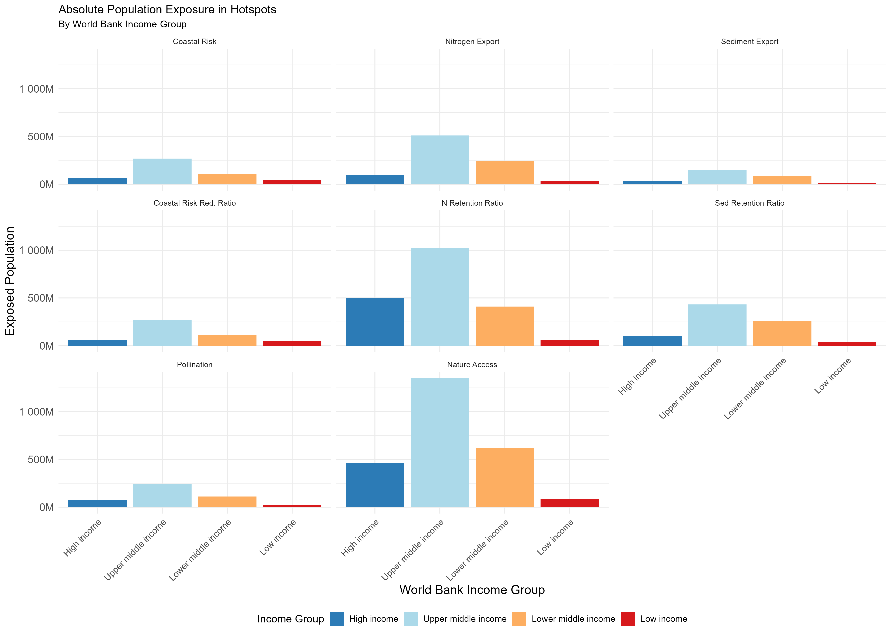{width="100%"}

[*Income group — best proxy for adaptive capacity: whether populations can respond to ES decline*]{style="font-size: 0.88em; font-style: italic;"}

:::

::: {.column width="48%"}

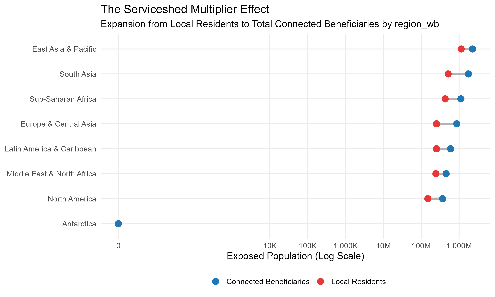{width="100%"}

:::
:::

::: {.columns style="font-size: 0.80em; margin-top: 0.4em;"}
::: {.column width="52%"}

**~3.1B** in-situ · **~1.2B** in compound risk zones · lower-middle income = **1.6× disproportionate intensity**, *least adaptive capacity*

:::

::: {.column width="48%"}

**~7.6B** total connected (**2.5× in-situ**) · compound cells (2+): **5× more** connected beneficiaries than in-situ residents · 3+ service cells: **8×** — most-stressed locations have the largest downstream footprint

:::
:::

::: {.notes}
- Income group over region/biome: income directly proxies adaptive capacity — lower-income groups have less fiscal space for ES-related adaptation. The WHO finding is not just about who is exposed but about who can respond.
- 3.1B is the verified in-situ count: distinct hotspot-count≥1 cells × GHS-POP 2020 (from 10k_change_calc.gpkg). Previous figure of 5,286M was a service-weighted sum (double-counted cells across multiple services) — corrected.
- Connected beneficiaries reach 7.6B through downstream hydrology and nature-access routing — nearly the full global population. Latin America, South Asia, and East Asia carry the largest absolute footprints.
- Compound risk cells (2+ services): connected beneficiaries (6B) are 5× the in-situ population (1.2B). For 3+ service cells the ratio is 8×. These are serviceshed multipliers — not density ratios. The most multiply-stressed locations also have the largest downstream exposure footprint.
:::

# WHY: The Monitoring Gap {background-color="#004D1E"}

## WHY: What Land Cover Change Looked Like, 1992–2020

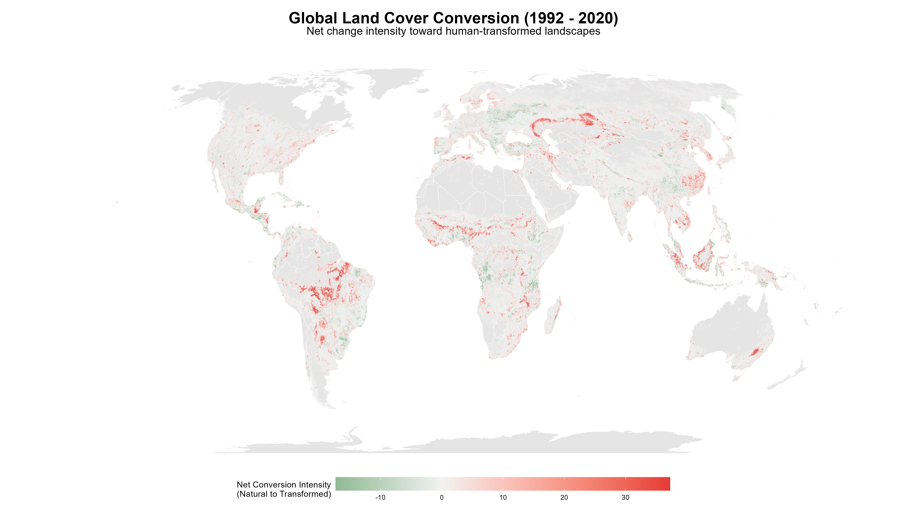{width="100%" fig-align="center"}

::: {.notes}
- This is the spatial pattern of LC change. The question the next slide addresses: do ES decline hotspots land in the same cells as this conversion?
- This map looks dramatic — and it turns out to be a real, strong signal: the attribution gap analysis shows ES decline is significantly more likely where conversion is most intense. The gap is about *coverage* (how much of ES decline this signal reaches), not about whether the signal is real.
- Keep this slide brief — it's setup for the gap finding, not the main result.
:::

---

## WHY: A Strong Signal, But Limited Reach

::: {.columns}
::: {.column width="50%"}
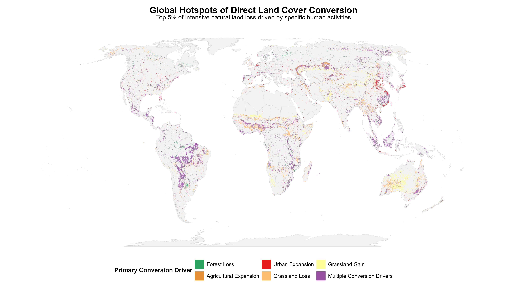{width="100%"}
:::
::: {.column width="50%"}
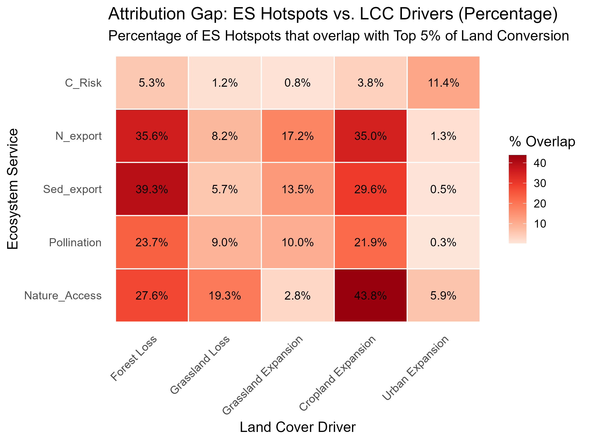{width="100%"}
:::
:::

::: {.columns}
::: {.column width="50%"}

### The Signal
- **34.5% of ES hotspot cells** co-occur with intense (top 5%) land cover conversion from any of 5 drivers combined (at the 10km grid scale) — vs. a **4.1% background rate** (odds ratio 12.2, risk ratio 8.3)
- Correct chance baseline for a 5-driver union: 8.2% of the grid (not the naive ~5% for a single driver — the drivers overlap each other spatially)
- Holds for **every driver individually**: odds ratios from 4.2 (Grassland Gain) to 44.0 (Cropland Expansion) — no offsetting or negative driver

:::

::: {.column width="50%"}

### Interpreting the Gap
- Even so, **65.5%** of ES hotspot cells do NOT co-occur with any of the 5 drivers — this is a coverage limit, not an absence of relationship
- The 65.5% does **not** mean those cells had zero land cover change — many had moderate conversion *below* the top-5% threshold
- **Important:** this is a co-occurrence finding, not a causal partition — the current design cannot distinguish mechanisms
- Conversion detection is a trustworthy signal where present, but it alone still misses most ES decline

:::
:::

::: {.notes}
- The attribution gap: we compare the top 5% of ES decline cells against the union of the top 5% of land cover conversion cells across 5 drivers — intense vs. intense.
- 34.5% of ES hotspot cells co-occur with the intense-LCC union — nearly 10x the 4.1% background rate, a strong and highly significant positive association (odds ratio 12.2). This corrects TWO earlier calculations: the original 24%/76% (stale, pre-5-driver file, looser threshold) and the 2026-07-07 "corrected" 8.2%/91.8% (which fixed that bug but introduced a new one — it joined LCC data to the ES grid using two grid-cell ID columns that share a name but index different, incompatible source grids; a nearest-centroid spatial crosswalk now fixes this).
- The 65.5% gap: those cells may still have moderate LCC, just not in the most intense 5% of any driver. We still cannot say "degradation is happening without conversion" — that's overclaiming what the spatial overlay can show — but we CAN now say conversion, where intense, is a real and strong predictor.
- Policy message: categorical land cover monitoring is trustworthy where it fires, but it still only reaches about a third of severe ES decline — you need direct ES monitoring to catch the rest. This is a more defensible, more literature-consistent story than either prior version.
- ~2 minutes
:::

# Regional Profiles {background-color="#004D1E"}

## Regional Hotspot Profiles

::: {.columns}
::: {.column width="50%"}

### Hotspot Intensity by World Bank Region
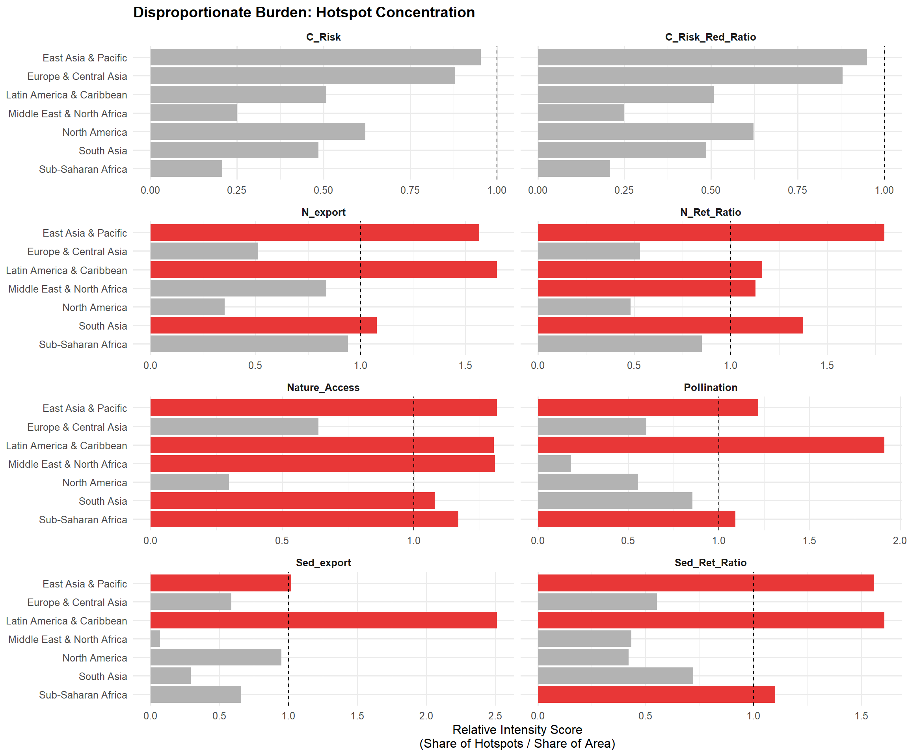{width="100%"}

:::

::: {.column width="50%"}

### Compound Risk by Region
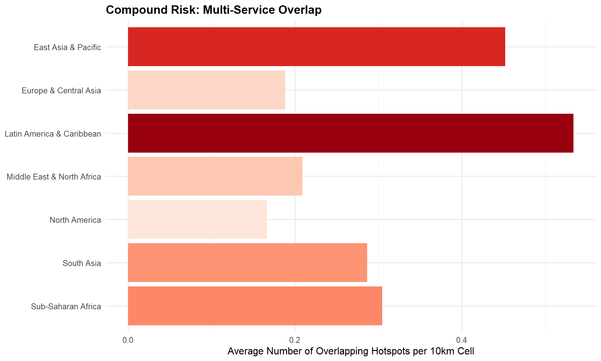{width="100%"}

:::
:::

::: {.notes}
- Regional profiles connect the global findings to specific contexts.
- Left: per-service relative intensity varies substantially across regions — not all services affect all regions equally.
- Right: compound risk distribution. Latin America and East Asia & Pacific carry the highest shares of multi-service decline cells.
- See Chapter 7 of the book for full per-country breakdowns and biome-stratified profiles.
:::

# Synthesis {background-color="#004D1E"}

## Synthesis: The Four Pillars

| Pillar | Finding | Policy Implication |
|--------|---------|-------------|
| **WHAT** | Ecosystem services declined measurably 1992–2020; absolute and proportional losses are decoupled by region | Change is real and geographically structured |
| **WHERE** | 252K hotspot cells cluster in low- and middle-income regions; lower-middle-income countries bear **1.6×** disproportionate burden | Geographic prioritization is feasible; equity lens is essential |
| **WHO** | Three typologies: coastal (higher HDI), terrestrial (lower HDI + higher GINI), retention (moderate HDI + lower GINI); **3.1 billion** in-situ | Typology-specific policy responses; scale demands systemic action |
| **WHY** | ES hotspots co-occur with intense (top 5%) land cover conversion at **34.5%** — nearly 10x the 4.1% background rate (odds ratio 12.2), true for every one of 5 drivers individually; but **65.5%** still show no such overlap; plausible mechanisms for the remainder include upstream cascades, sub-pixel change, and climate forcing — **but cannot be partitioned with current data** | Conversion monitoring is a reliable signal where present, but must be paired with direct ES monitoring for the majority of cases |

---

## Status & Open Questions

### Paper at advisor draft stage

::: {.columns}
::: {.column width="50%"}

**Completed:**
- Full 9-chapter book + paper draft complete
- Attribution gap reframed as co-occurrence throughout, and recomputed as a true 5-driver union — corrected twice: from a stale 76% gap (pre-5-driver file) to an incorrectly-computed 91.8% gap (grid-id mismatch bug) to the current, verified **65.5% gap / 34.5% co-occurrence** (odds ratio 12.2) — see `scripts/compute_attribution_true_union.R` and `scripts/build_lc_grid_fid_crosswalk.R`
- KS three-typology finding with Cliff's Delta
- Population numbers audited and corrected (3.1B in-situ)
- Regional profiles with real hotspot intensity data

:::

::: {.column width="50%"}

**Awaiting Becky's input:**

1. Were InVEST SDR/NDR runs performed with fixed or era-specific climate inputs?
2. Ch05 scatterplot: replace X-axis with per-driver panels, or drop entirely?
3. Literature cross-check for hotspot validation (Ch02 QA callout)
4. REDD+ / IPBES citations for LCC–ES relationship (Ch05)

**Next milestone:** Incorporate Becky's feedback → journal submission

:::
:::

# Thank You {background-color="#004D1E"}

**Questions?**

For technical details, methodology, and code:

- See `docs/methodology.md` and `docs/runbook.md`
- Repository: Global NCP (this project)
- Contact: Jerónimo Rodríguez Escobar (jeronimo.rodriguez@wwfus.org)

---

## Appendix: Hotspot Intensity Distribution by Region

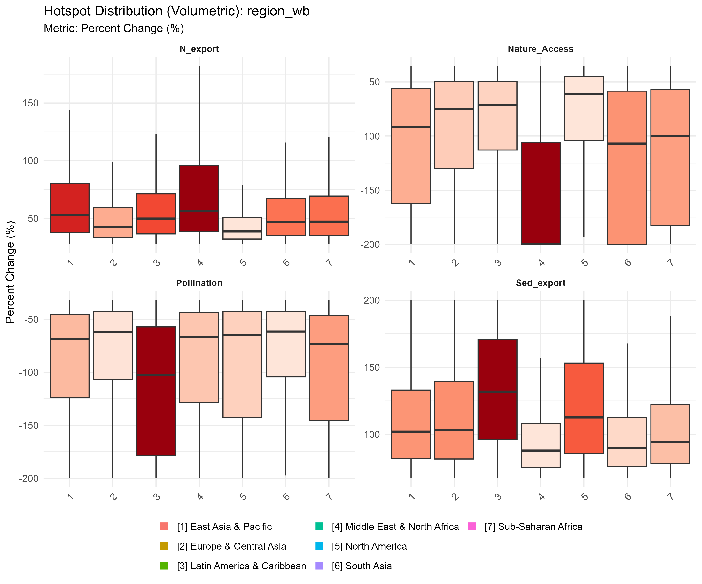{width="100%" fig-align="center"}

::: {.callout-note style="font-size: 0.72em;"}
**How to read:** All cells shown are already in the global top 5% — even the lightest boxes represent severe change. A **wide box** means hotspot severity is highly variable within the group (some cells near the threshold, others near complete functional loss). A **narrow box** means intensities are consistently high. Latin America [3] shows the widest and most intense boxes for Nature Access and Pollination — not just more hotspots, but more variable and more severe ones.
:::

::: {.notes}
- This chart answers: within the hotspot cells, are they uniformly intense or highly variable?
- Latin America dominates — high severity AND high variability. Some cells approaching SPC of -200% (near-complete loss) for Nature Access and Pollination.
- Direction matters: negative SPC = declining provision (Pollination, Nature Access); positive SPC = increasing export/risk (N_export, Sed_export).
- Full version across income groups and biomes is in Chapter 4 of the book.
:::

---

## Appendix: Technical Methods — Key Decisions

::: {.columns style="font-size: 0.82em; align-items: flex-start;"}
::: {.column width="50%"}

### Spatial standardisation
- InVEST rasters are in **WGS84** — pixel area varies with latitude
- **Volumetric services** (N export, Sed export): pre-normalised to **per hectare** before extraction, correcting for latitude-dependent pixel size
- **Index and ratio services** (Pollination, Retention Ratios, Nature Access, Coastal Risk): **dimensionless** — area correction would introduce spurious latitudinal gradients; not applied
- **Coastal Risk** (`C_Risk` = `Rt`): wave energy **per linear metre of shoreline** — not an area-based quantity; no per-ha correction

:::
::: {.column width="50%"}

### Aggregation at the grid-cell level
- All ES rasters extracted to 10km grid using **mean** (not sum)
- Rasters are already per-ha → mean gives a valid, comparable per-ha rate across equal-area cells
- For hotspot detection: SPC(mean, mean) = SPC(sum, sum) for equal-area cells — rankings are identical regardless of choice
- **Socioeconomic variables** (Population, GDP) use **sum** — these are absolute counts/totals, a different interpretation

### Equal-area grid
- IUCN AOO 10km grid uses an **equal-area projection**, not lat/lon
- Every cell = exactly 100 km² regardless of latitude
- Makes cross-regional comparisons valid without polar distortion

:::
:::

::: {.notes}
- This slide is a Q&A backup — not shown in the main flow.
- The per-hectare correction question comes up because InVEST runs in WGS84 for most services. The key point: correction was applied where it's meaningful (absolute quantities), not applied where it would distort (dimensionless values).
- The mean vs sum question: pragmatically, it doesn't affect hotspot results because SPC normalizes the values. The choice matters more for interpretability of the grid-cell values.
- Equal-area point: a standard lat/lon grid at 10 arc-minutes has cells ~50% smaller at 60°N than at the equator — that would bias hotspot counts toward the tropics by area alone.
:::

---

## Appendix: Methodology References

### Data & Tools
- **InVEST**: Sharp et al. (2020) — Natural Capital Project biophysical models
- **exactextract**: Fast raster zonal statistics (Python)
- **ESA CCI / C3S**: Land cover classification from satellite data (1992–2020)
- **Quarto + R**: Reproducible analysis and reporting

### Key Publications & Methods
- Chaplin-Kramer et al. (2019) *Science*: global NCP baseline — this paper extends it
- Pontius & Millones (2011) + Pontius (2022): land cover change transition matrix methodology
- Cliff (1993): Cliff's Delta effect size for ordinal data
- Benjamini & Hochberg (1995): false discovery rate correction
- Andam et al. (2008): ecosystem service spillover effects
- Kolmogorov & Smirnov: non-parametric distribution comparison

### Repository Structure
- `/analysis/`: Active Quarto notebooks (prepare → process → hotspots → KS tests)
- `/R/`: Core reusable functions (`plotting_functions.R`, `paths.R`)
- `/docs/`: Book, paper draft, methodology, and this presentation
