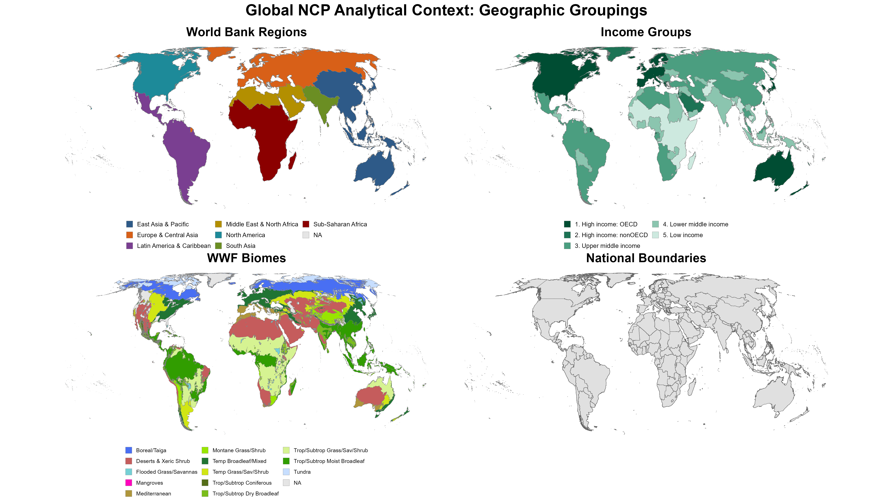
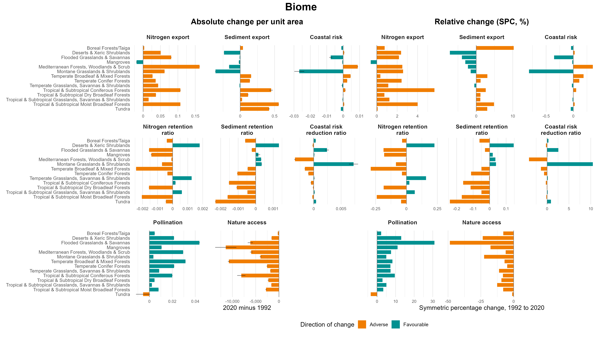
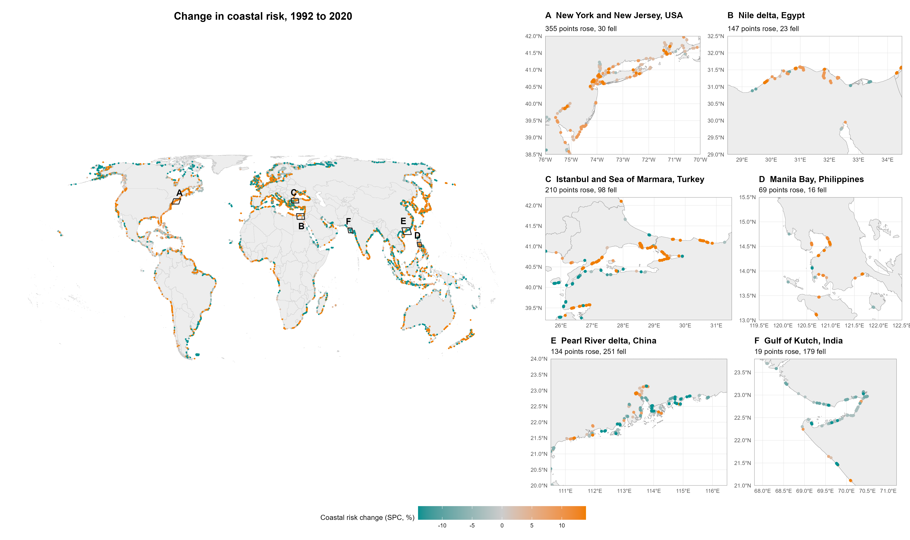
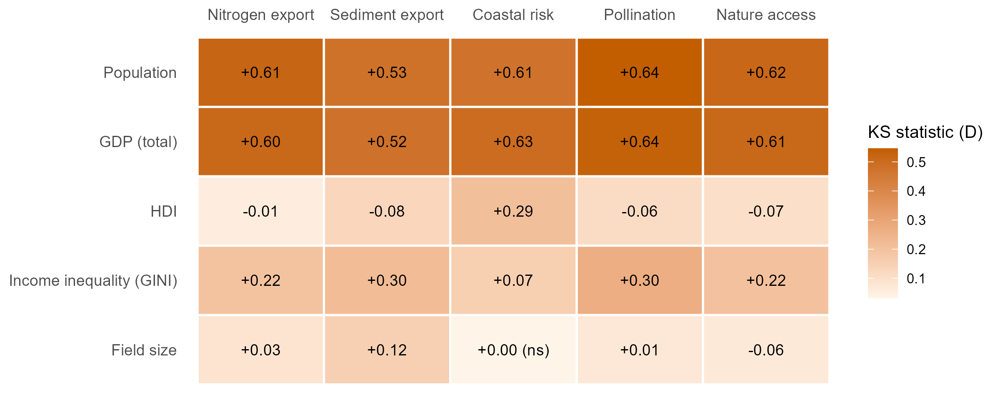
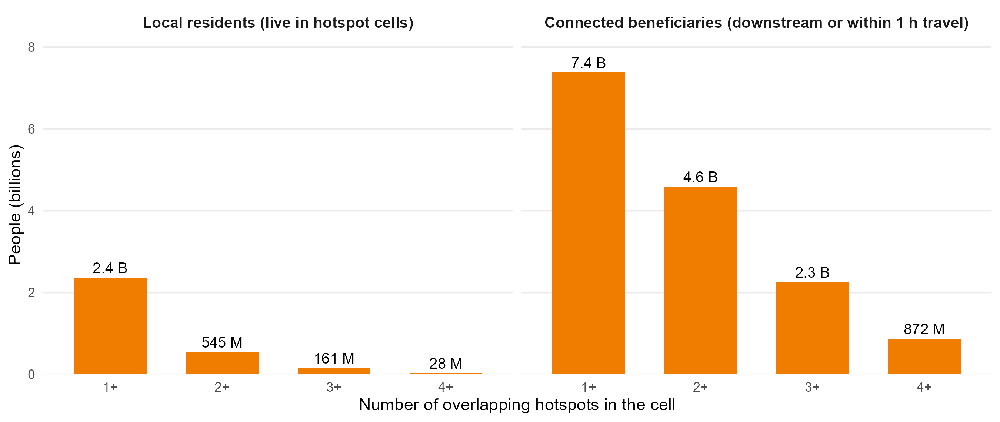

# Part 1: Motivation {background-color="#004D1E"}

## Ecosystem Services Under Pressure

::: {.columns style="font-size: 0.82em; align-items: flex-start;"}
::: {.column width="50%"}

### Context
- Ecosystem services such as pollination, water quality regulation and coastal protection are declining globally
- Billions of people depend on them for food, water and safety
- Losses are **geographically uneven**: some regions and populations carry a disproportionate share

:::

::: {.column width="50%"}

### What global assessments still lack
- *What* changed, measured consistently over time and across services?
- *Where* does decline concentrate?
- *Who* is exposed to it?
- A way to ask these questions again, with other services, dates or groupings, and get comparable answers

:::
:::

::: {.notes}
- Left column: the established situation. Right column: the gap.
- Chaplin-Kramer et al. (2019, Science) mapped global NCP and who depends on it. This work extends it to change over time (1992 to 2020), hotspot detection and socioeconomic profiling.
- The last bullet is the thread for the whole talk: the contribution is as much the machinery as the specific numbers.
- ~2 min
:::

---

## Three Questions, One Pipeline

::: {.columns}
::: {.column width="33%"}

### WHAT?
How did ecosystem service provision change between 1992 and 2020, in direction and magnitude?

:::

::: {.column width="33%"}

### WHERE?
Where is decline most intense, how often does it occur and how severe is it?

:::

::: {.column width="33%"}

### WHO?
Which populations live in or depend on the places where services declined most?

:::
:::

::: {.callout-note style="font-size: 0.75em; margin-top: 1em;"}
**What drives the change** (land cover, climate) is not answered here: a cell-by-cell overlay cannot follow the flow paths the models use. It is the next analysis, discussed at the end.
:::

::: {.notes}
- Three questions, same structure as the paper: WHAT = Path A (300 m pixels summed to groups), WHERE = Path B hotspots on the 10 km grid, WHO = socioeconomic profiling and population exposure.
- Earlier versions had a fourth pillar (WHY / land cover attribution). The paper now treats attribution as future work; the exploratory overlay is in the Supplement and comes back on one slide at the end.
:::

---

## Not One Answer: A Pipeline for Many Questions

::: {.columns style="font-size: 0.8em; align-items: flex-start;"}
::: {.column width="50%"}

### Everything is a parameter
- **Services**: any raster (InVEST or another model); five here
- **Dates**: any two snapshots; 1992 and 2020 here
- **Groupings**: any vector layer (regions, biomes, income groups, countries, basins, custom units)
- **Metric**: relative (SPC) or absolute change
- **Hotspot rule**: threshold and direction per service
- **Scale**: 300 m pixels, 10 km grid, or a finer regional grid

:::

::: {.column width="50%"}

### The same checks apply to every case
- Hotspot sensitivity to the change metric
- Null models for spatial co-occurrence
- Distribution tests (KS + Cliff's δ) for any covariate
- Population exposure through downstream and travel links

### Already reused
- Colombia (2026): country and biome cut, overlaid with critical natural assets
- Beneficiary-area masks: same tests on a different spatial unit

:::
:::

::: {.notes}
- This is the message to carry through the talk: the findings that follow are one run of a general pipeline. Change the question and the answer changes, and the pipeline shows how much.
- Examples later in the talk: relative and absolute change pick different leading biomes (WHAT); SPC and absolute hotspots overlap 32-97% depending on the service (WHERE); prevalence and severity point to different places (WHERE).
- Colombia: the same hotspot and prevalence machinery, run at country scale with biome groupings and a critical-asset overlay, for the WWF Colombia / ECLAC work.
- Global scope is an implementation choice, not an architectural constraint.
:::

# Part 2: Methods {background-color="#004D1E"}

## Data Inputs: 1992 & 2020 Global Layers

::: {.columns style="font-size: 0.85em;"}
::: {.column width="34%"}

### Ecosystem Services
**InVEST models, 300 m**

- Nitrogen export
- Sediment export
- Coastal risk
- Pollination
- Nature access

:::

::: {.column width="33%"}

### Land Cover
**ESA CCI + C3S, 300 m**

- 1992 & 2020 endpoints
- Main input to the InVEST runs
- Exploratory co-occurrence analysis (Supplement)

:::

::: {.column width="33%"}

### Socioeconomic
**Gridded, 2020**

- Population (GHS-POP)
- GDP
- Human Development Index
- Gini coefficient
- Agricultural field size

:::
:::

::: {.notes}
- Time period: 1992 to 2020 (28 years). Land cover at the endpoints only, no annual transitions.
- The same NDR, SDR and coastal vulnerability runs also give three ratios (nitrogen and sediment retention ratios, coastal risk reduction ratio). They are not used to define hotspots and are shown in the paper's Supplement only.
:::

---

## Five Ecosystem Services Define the Hotspots

::: {style="font-size: 0.78em;"}

| Theme | Service | What it measures | Adverse direction |
|:---|:---|:---|:---|
| **Habitat & Access** | Nature access | People's proximity to natural habitat | Decrease |
| | Pollination | Realized pollination on agriculture: pollinator-dependent crop production supported by nearby habitat (people fed / ha) | Decrease |
| **Coastal** | Coastal risk | Coastal vulnerability index at shoreline points, from habitats and exposure | Increase |
| **Water** | Nitrogen export | Nitrogen load delivered to streams | Increase |
| | Sediment export | Sediment load delivered to streams | Increase |

:::

::: {.callout-note style="font-size: 0.75em;"}
**Why export and risk, not retention?** They are what reaches people. A sediment retention *amount* can rise because land conversion generates more erosion to intercept, not because retention improved.
:::

::: {.notes}
- A cell is a hotspot for a service if it is in the most adverse 5% of that service's change.
- Pollination is realized pollination on agriculture, not habitat suitability. It can rise when pollinator-dependent cropland expands next to remaining habitat (comes back on the WHAT slides).
- Ratios are not hotspot variables: export and retention of the same pollutant are not independent, and a retention ratio also depends on the load arriving from upstream.
:::

---

## Socioeconomic Context: The WHO Input Layers

{height="580px" fig-align="center"}

::: {.notes}
- Population and GDP turn out to be high in hotspots of every service, so they do not distinguish services. HDI and Gini do (WHO section).
- All layers are 2020 values, a temporal mismatch with the 1992-2020 change window. Acknowledged limitation.
:::

---

## Spatial Framework & Analytical Groupings

[*Analysis unit: ~1.37 million evaluated 100 km² equal-area cells (IUCN AOO 10 km grid). Groupings are interchangeable inputs.*]{style="font-size: 0.78em;"}

{width="88%" fig-align="center"}

::: {.notes}
- The equal-area grid puts large and small ecosystems on equal footing.
- World Bank regions: policy framing. Income groups: equity lens. Biomes: ecological framing. Countries: operational scale.
- These four are the ones used in the paper; any other vector layer (a basin, a protected-area network, a jurisdiction) plugs in the same way.
:::

---

## Why Two Pathways?

::: {.columns style="font-size: 0.84em; align-items: flex-start;"}
::: {.column width="50%"}

### Path A: pixel level (300 m)
*Compare first, then aggregate*

- Each pixel compared 1992 → 2020 at native resolution
- Change summed to regions, biomes and income groups
- **Used for:** WHAT

:::
::: {.column width="50%"}

### Path B: 10 km equal-area grid
*Aggregate first, then compare*

- 300 m rasters summarised into ~1.37 M evaluated cells before computing change
- Every cell = 100 km², so cells can be ranked globally
- **Used for:** WHERE and WHO

:::
:::

::: {.callout-note style="font-size: 0.75em; margin-top: 0.5em;"}
**Why not one path?** The order of aggregation and differencing matters: averaging grid values up to broad regions can flip the sign between absolute and relative change (a MAUP effect). Path A avoids the intermediate grid.
:::

::: {.notes}
- Path A: diff then aggregate. Path B: aggregate then diff. Different questions, different orders.
- Found empirically: a mean of per-cell percentage changes can have the opposite sign to the change in totals for the same region. Both are correct at their scale; group results therefore use the SPC of group totals.
:::

---

## Analytical Pipeline

```{mermaid}
%%{init: {'flowchart': {'rankSpacing': 32, 'nodeSpacing': 18}, 'themeVariables': {'fontSize': '11px'}}}%%
flowchart TB
    RawES["InVEST ES Models<br/>300m · 1992 & 2020"]
    RawGrid["10km Grid +<br/>Grouping Layers"]
    RawSoc["Socioeconomic Data<br/>Pop · GDP · HDI · Gini"]

    IntA["Path A<br/>Pixel-level"]
    MathA["Path A Metrics<br/>SPC & Abs. Δ"]

    IntB["Path B<br/>10km Grid"]
    MathB["Path B Metrics<br/>SPC & Abs. Δ"]

    MathSoc["KS Tests &<br/>Socioec. Profile"]
    MathBenef["Serviceshed<br/>Routing"]

    P1(["WHAT<br/>Global Trajectories"])
    P2(["WHERE<br/>Hotspot Detection"])
    P4(["WHO<br/>Exposure & Profile"])

    RawES ==> IntA & IntB
    RawGrid ==> IntA & IntB & MathSoc
    RawSoc ==> MathSoc & MathBenef

    IntA ==> MathA ==> P1
    IntB ==> MathB ==> P2

    P2 ==> MathSoc & MathBenef
    MathSoc ==> P4
    MathBenef ==> P4

    classDef c_what fill:#007930,stroke:#004D1E,stroke-width:2px,color:#FFF;
    classDef c_where fill:#7B8327,stroke:#515619,stroke-width:2px,color:#FFF;
    classDef c_who fill:#F5D200,stroke:#B39900,stroke-width:2px,color:#333;

    class RawES,IntA,MathA,P1 c_what;
    class RawGrid,IntB,MathB,P2 c_where;
    class RawSoc,MathSoc,MathBenef,P4 c_who;
```

::: {.notes}
- Path A gives the group-level trajectories (WHAT); Path B identifies hotspots (WHERE), which feed the socioeconomic profiling and the exposure analysis (WHO).
- Python (Docker) does the zonal extraction at 300 m; R/Quarto does change, hotspots and tests. Configs, not code edits, change the services, groupings and thresholds.
:::

---

## Key Metrics

::: {.columns style="font-size: 0.85em;"}
::: {.column width="50%"}

### Symmetric Percentage Change (SPC)

<div style="font-size:0.75em">
$$\text{SPC} = \frac{T_{2020} - T_{1992}}{(|T_{2020}| + |T_{1992}|) / 2} \times 100$$
</div>

Relative to what the place provided over the period; symmetric around zero; comparable across services. Bounded −200% (service fell to zero) to +200% (new emergence).

:::

::: {.column width="50%"}

### Hotspot definition
- **Relative**: ranked within each service's own distribution
- **Most adverse 5%** per service (direction is service-specific)
- **Multi-service hotspot**: 2+ services in the most adverse 5% in the same cell
- **Relative prevalence**: a group's share of hotspots ÷ its share of the area where the service is modelled

:::
:::

---

## Statistical Analysis: KS Tests + Cliff's Delta

::: {.columns style="font-size: 0.8em;"}
::: {.column width="50%"}

**Hotspot cells** vs. **background cells**
(47.5th-52.5th percentile of each service's change: typical, stable conditions)

Test variables:
- Population (GHS-POP 2020)
- GDP
- Human Development Index (HDI)
- Gini coefficient
- Agricultural field size

:::

::: {.column width="50%"}

**Two-step interpretation:**

1. *KS statistic + FDR-corrected p-value*: do distributions differ?
2. *Cliff's Delta (δ)*: direction and magnitude

δ > 0: hotspot cells higher; δ < 0: lower. With up to ~68,000 cells per group, almost any difference is significant, so δ carries the interpretation.

:::
:::

::: {.notes}
- Background = the middle 5% of the change distribution, which keeps cells with large gains out of the comparison.
- 25 tests (5 services × 5 variables), Benjamini-Hochberg corrected. 24 of 25 differ; the exception is coastal risk × field size.
:::

# WHAT: Change Depends on How You Measure It {background-color="#007930"}

## WHAT: Global and Biome Trajectories, 1992-2020

[*Global, 1992-2020: N export +1.6% · sediment export +1.4% · nature access −8.7% · pollination +6.9% · coastal risk <0.1%*]{style="font-size: 0.6em;"}

{height="540px" fig-align="center"}

::: {.notes}
- Nature access fell in every biome and every region.
- The leading biome depends on the measure. Sediment export rose most in relative terms in Boreal Forests/Taiga (+10.3%, low baseline) but most in absolute terms per unit area in Tropical & Subtropical Moist Broadleaf Forests (+4.9% relative). Nature access fell most steeply in relative terms in Flooded Grasslands & Savannas (−48.6%) but lost the most per unit area in Mangroves and Temperate Broadleaf forests.
- Explore: neither ranking is "the" answer; they answer different questions (share of a place's own capacity vs largest quantities).
- Region and income-group versions are in the paper's Supplement.
:::

---

## WHAT: Absolute vs. Relative Change Map Different Places

::: {.columns}
::: {.column width="50%"}
{width="100%"}
:::
::: {.column width="50%"}
{width="100%"}
:::
:::

[Sediment export: in absolute terms the Amazon is a modest signal next to high-erosion Southeast Asia; in SPC it becomes the largest pattern globally, because the same physical change is large relative to a low baseline.]{style="font-size: 0.72em;"}

::: {.notes}
- Path B, native 10 km grid, before any hotspot threshold. Coastal risk is too thin to see at this scale; it gets its own slide.
- Explore: SPC flags fast, disproportionate change against each place's own baseline; absolute change flags where the most material moved. Which one should drive prioritization? (Back to this in the discussion.)
:::

---

## WHAT: A "Gain" That Signals Conversion

::: {.columns style="font-size: 0.82em; align-items: center;"}
::: {.column width="45%"}

- Pollination here is **realized pollination on agriculture**
- It rose in every region (+6.9% globally)
- Flooded Grasslands & Savannas: the **steepest nature access loss (−48.6%)** and the **largest pollination gain (+31.0%)**, in the same biome
- Reading: pollinator-dependent cropland expanding next to habitat that still remains

:::
::: {.column width="55%"}

::: {.callout-important}
A change in the "favourable" direction is not always good news. Each variable needs its own reading before it is aggregated.
:::

:::
:::

::: {.notes}
- This is the global-average trap: pollination going up looks like an improvement, but here it is the footprint of agricultural expansion into still-habitat-rich landscapes.
- Same logic for the sediment retention amount (rises with land-conversion erosion), which is why the paper uses export.
:::

---

## WHAT: Coastal Risk at the Shoreline

{height="560px" fig-align="center"}

::: {.notes}
- Coastal risk changed at 4.6% of 1.37 M shoreline points, and changes are small (within about ±18% SPC).
- Increases and decreases are spread along most coastlines in similar numbers (23,591 rose and 21,111 fell by at least 1%).
- Panels: New York/New Jersey, Nile delta, Istanbul/Sea of Marmara, Manila Bay (rose); Pearl River delta, Gulf of Kutch (fell).
:::

# WHERE: How Often and How Severe {background-color="#004D1E"}

## WHERE: Hotspots Cluster in Latin America and East Asia

[*189,932 hotspot cells (13.8% of 1.37 M evaluated cells)*]{style="font-size: 0.6em;"}

{height="290px" fig-align="center" fig-alt="Number of overlapping hotspots per 10 km cell"}

{width="72%" fig-align="center"}

::: {.notes}
- Hotspots cluster in space; they are not random scatter.
- Averaged over the four land-based services, relative prevalence is highest in Latin America & Caribbean (1.9) and East Asia & Pacific (1.3); Sub-Saharan Africa is at 1.0; Europe & Central Asia, North America and MENA around 0.6.
- Multi-service cells (darkest) are where a single intervention could address several declines.
- ~90 seconds
:::

---

## WHERE: Frequency and Severity Are Different Questions

::: {.columns style="align-items: flex-start;"}
::: {.column width="62%"}

{width="100%"}

{width="100%"}

:::
::: {.column width="38%" .fs66}

**Both frequent and severe**

- Tropical moist broadleaf forests, sediment: prevalence 3.0, median +124%
- Tropical coniferous forests, pollination: 3.0, median −102%; 30% lost it entirely

**Rare but severe**

- Deserts & xeric shrublands, nature access: prevalence 0.5, median −169%; **42% lost access entirely**

**Uniform severity**

- Nitrogen export: median +35% to +55% in every biome, so biomes differ only in frequency

:::
:::

::: {.notes}
- New in the 10-06 revision of the paper. Prevalence says where hotspots cluster; within-hotspot SPC says how bad they are.
- Two prioritization logics: go where hotspots are frequent (most cells, most co-benefit), or where they are rare but the service is lost outright.
- Flooded Grasslands & Savannas combine both for nature access (prevalence 1.8, median −132%, 34% total loss).
:::

---

## WHERE: Coastal Risk Hotspots

::: {.columns style="align-items: flex-start;"}
::: {.column width="62%"}

{width="100%"}

{width="100%"}

:::
::: {.column width="38%" .fs68}

- Measured against coastal cells only (coastal risk exists only there)
- Over-represented in **South Asia (1.8)**, **Sub-Saharan Africa (1.4)** and on **low-income coasts (1.3)**; under-represented in North America (0.6)
- Unlike land services: slightly over-represented on high-income OECD coasts (1.1)
- Low-income coasts and South Asia also have the **largest increases** (median +2.3% and +2.2%)
- Sub-Saharan Africa: more hotspots, but not more severe (+1.4%)

:::
:::

::: {.notes}
- Changes are small everywhere (medians 1-2.5%).
- About 40% of coastal risk hotspots fall in coastal cells outside the grouping layers, so these group results rest on ~60% of the hotspots.
- The earlier deck/paper figure (Mangroves 15×) used all land cells as the denominator; against coastal cells Mangroves are ~1.0.
:::

---

## WHERE: The Hotspot Set Depends on the Metric

::: {.columns style="font-size: 0.8em; align-items: center;"}
::: {.column width="45%"}

Share of SPC hotspot cells that are also hotspots when ranked by absolute change:

| Service | Overlap |
|:---|---:|
| Coastal risk | 97% |
| Nitrogen export | 57% |
| Nature access | 43% |
| Pollination | 35% |
| Sediment export | 32% |

:::
::: {.column width="55%"}

- Sediment export and pollination SPC hotspots fall mostly where baseline provision is low: a modest absolute change is a large share of local capacity
- SPC asks *which places lost the largest share of what they had*; absolute change asks *where the most material moved*
- The paper uses SPC as primary and reports the overlap as a sensitivity check; the pipeline can run either

:::
:::

::: {.notes}
- This is the "answers depend on the metric" point made concrete: for sediment export only a third of the hotspots survive a change of metric.
- Characterizing where and why the two criteria diverge is listed as future work in the paper.
:::

# WHO: Inequality, Not Just Poverty {background-color="#007930"}

## WHO: Hotspots by Income Group

::: {.columns style="align-items: flex-start;"}
::: {.column width="62%"}

{width="100%"}

{width="100%"}

:::
::: {.column width="38%" .fs68}

- Lower-middle-income countries: **15.6% of the land, 21% of hotspot cells** (25% for nature access)
- High-income OECD: 25% of the land, 15% of hotspot cells
- Per unit area, hotspots are **~2.3× as frequent** in lower-middle-income countries
- Nature access losses are also **deepest** there: median −109% vs −62% in high-income OECD; **22% vs 8%** of hotspots lost access entirely

:::
:::

::: {.notes}
- More frequent and more severe in the same income group: the two dimensions reinforce each other here, unlike some biomes.
- The 2.3× replaces the older 1.8× (which compared people, not land, and came from an earlier hotspot table).
:::

---

## WHO: Inequality Separates the Services

{height="360px" fig-align="center"}

::: {.columns style="font-size: 0.7em;"}
::: {.column width="50%"}

### Shared by all five services
Hotspots are more populated and higher-GDP (δ +0.52 to +0.64). Because this holds everywhere, it does not tell services apart.

### Land-based services
Higher inequality (Gini δ +0.22 to +0.30); HDI adds little (δ −0.01 to −0.08).

:::
::: {.column width="50%"}

### Coastal risk
Higher HDI (δ +0.29), small Gini rise (+0.08), yet over-represented on low-income coasts.

### Open question
Why inequality, and not development level or poverty? Candidates: frontier expansion, land tenure, governance of land conversion. None tested here.

:::
:::

::: {.notes}
- This is the slide to open up. Inequality within places, not average development, is what distinguishes where land-based services decline most.
- These are co-occurrence results, not causal. Testing mechanisms would need sub-national tenure/governance data or case comparisons.
- Field size (Mehrabi et al.) adds little: δ −0.06 to +0.12.
:::

---

## WHO: Exposure Reaches Beyond the Hotspots

{height="300px" fig-align="center"}

::: {.columns style="align-items: center; font-size: 0.72em;"}
::: {.column width="50%"}

```{=html}
<div class="stat-row">
  <div class="stat-callout">
    <span class="stat-value">2.4B</span>
    <span class="stat-label">live in a hotspot cell</span>
  </div>
  <div class="stat-callout accent">
    <span class="stat-value">7.4B</span>
    <span class="stat-label">connected downstream or within 1 h travel (92.5% of global population)</span>
  </div>
</div>
```

:::
::: {.column width="50%"}

- Hotspots cover **13.8%** of the evaluated land
- Connected beneficiaries outnumber residents **~3 : 1**, rising to ~30 : 1 in cells with 4+ hotspots
- Downstream: 5.9B · travel access: 7.2B
- Low-income countries: ~13% of the people connected

:::
:::

::: {.notes}
- Upper-middle-income countries have the most residents in hotspots (919 M); lower-middle-income the most connected beneficiaries (2,675 M).
- Explore: exposure is not impact. "Connected" means within 50 km downstream or 1 h travel of a hotspot; how much of the decline reaches each person is not measured.
- Population is LandScan 2023, applied to 1992-2020 change: a temporal mismatch, acknowledged.
- Numbers updated 10-07 to the current beneficiary run (07-29, five-service hotspots); the earlier 3.1B / 7.6B came from a June run on the old 8-variable hotspots.
:::

# What the Analysis Cannot Say Yet {background-color="#004D1E"}

## Drivers: Land Cover Does Not Explain Hotspots Cell by Cell

::: {.columns}
::: {.column width="45%"}
{width="100%"}
:::
::: {.column width="55%" .fs72}

- **63%** of hotspot cells show no intense land cover conversion in the same cell; 37% do
- Null model: placing hotspots at random within blocks of decreasing size, the overlap expected by chance rises from 9% (global) to 25% (0.5° blocks), so **part of the co-occurrence is regional co-location**, not same-cell
- Expected from the models: sediment and nutrient effects accumulate along flow paths; pollination and nature access depend on habitat within foraging or travel distance
- Next: a distance-decay test (count conversion in neighbouring cells), and model reruns holding land cover or climate fixed

:::
:::

::: {.notes}
- Exploratory, in the paper's Supplement. Not a causal partition.
- Climate inputs: if the 1992 and 2020 SDR/NDR runs used different climate, export could change with no land cover change. Open question to the model authors.
- Ask the lab: how would you attribute change that the models themselves propagate along flow paths?
:::

---

## The Answer Depends on the Question

::: {style="font-size: 0.8em;"}

| Choice | Example from this analysis |
|:---|:---|
| **Metric** | SPC and absolute change select 32-97% of the same hotspots, depending on the service |
| **Baseline** | Sediment export: Boreal forests lead in relative terms, tropical moist forests in absolute terms |
| **Grouping** | Lower-middle-income countries lead on land services; coastal risk is over-represented on low-income *and* high-income OECD coasts |
| **Dimension** | Deserts: few nature access hotspots, but the most severe ones |
| **Scale** | Mean of per-cell change and change of totals can differ in sign for the same region |

: {tbl-colwidths="[18,82]"}

:::

::: {.callout-note style="font-size: 0.78em;"}
These are not inconsistencies to resolve by choosing one measure. A credible assessment states its metric, baseline, grouping and scale and shows how sensitive its conclusions are to each. The pipeline makes those choices explicit and repeatable.
:::

::: {.notes}
- This is the closing message for the findings, and the reason the pipeline matters more than any single number.
- Regional applications (Amazon basin, Southeast Asia, Sub-Saharan Africa) can reuse it with locally calibrated InVEST inputs and a finer grid.
:::

# Synthesis {background-color="#004D1E"}

## Synthesis

::: {style="font-size: 0.7em;"}

| Question | Finding | Implication |
|:---|:---|:---|
| **WHAT** | N and sediment export rose (+1.6%, +1.4%), nature access fell (−8.7%, in every biome and region), pollination rose (+6.9%) partly through cropland expansion | Global averages hide opposite stories; each variable needs its own reading |
| **WHERE** | 189,932 hotspot cells, clustered in Latin America & Caribbean (1.9×) and East Asia & Pacific (1.3×); frequency and severity point to different places | Two prioritization logics: frequent hotspots vs rare total losses |
| **WHO** | ~2.3× as frequent per unit area in lower-middle-income countries; land-service hotspots in more unequal places (Gini δ +0.22 to +0.30); 2.4B residents, 7.4B connected | Inequality, not only income level, marks where exposure concentrates |
| **HOW** | Results move with metric, baseline, grouping and scale; the pipeline makes each choice explicit | Report sensitivity, not a single number; reuse the pipeline for regional questions |

: {tbl-colwidths="[10,52,38]"}

:::

---

## For Discussion

::: {style="font-size: 0.85em;"}

1. Is proportional loss (SPC) the right lens for prioritization, or should absolute change lead, or both?
2. What could link income inequality to ecosystem service decline, and how could we test it?
3. How should change be attributed when the models propagate it along flow paths?
4. Which regional application would be most useful next, and with which local inputs?

:::

::: {.notes}
- Leave ~5 minutes here. These are real open questions for the next phase, not rhetorical.
:::

---

## Status

::: {.columns style="font-size: 0.7em;"}
::: {.column width="50%"}

**Done**

- Paper draft revised and shared for PI review (October 2026)
- Five-service hotspot definition (export and risk), SPC as the primary metric
- Coastal risk prevalence measured against coastal cells
- Frequency vs severity of hotspots by biome, region and income group
- Metric sensitivity and null models for co-occurrence

:::

::: {.column width="50%"}

**Open**

- Climate inputs for the 1992 vs 2020 SDR/NDR runs (same or era-specific?)
- Every paper number traced to data by a verification script
- Driver attribution (distance-decay, fixed-input reruns): future work
- Hand-off: runbook, data documentation, regional worked example

:::
:::

# Thank You {background-color="#004D1E"}

**Questions?**

- Contact: Jerónimo Rodríguez Escobar (jeronimo.rodriguez@wwfus.org)

---

## Appendix: Within-Hotspot Change by Region

{width="100%" fig-align="center"}

::: {.notes}
- Middle East & North Africa: half of the nature access hotspots (51%) lost access entirely (median −200%).
- Latin America & Caribbean: the most severe pollination and sediment export hotspots (medians −99% and +130%).
:::

---

## Appendix: Technical Methods — Key Decisions

::: {.columns style="font-size: 0.74em; align-items: flex-start;"}
::: {.column width="50%"}

### Spatial standardisation
- InVEST rasters are in **WGS84** — pixel area varies with latitude
- **Volumetric services** (N export, Sed export): pre-normalised to **per hectare** before extraction, correcting for latitude-dependent pixel size
- **Already per-area or index values** (pollination in people fed/ha, nature access, retention ratios): no correction; an area correction would introduce spurious latitudinal gradients
- **Coastal risk** (`C_Risk` = `Rt`): exposure index at shoreline points, averaged to the grid; not an area-based quantity

:::
::: {.column width="50%"}

### Aggregation at the grid-cell level
- All ES rasters extracted to 10km grid using **mean** (not sum)
- Rasters are already per-ha → mean gives a valid, comparable per-ha rate across equal-area cells
- For hotspot detection: SPC(mean, mean) = SPC(sum, sum) for equal-area cells — rankings are identical regardless of choice
- **Socioeconomic variables** (Population, GDP) use **sum** — these are absolute counts/totals, a different interpretation

### Equal-area grid
- IUCN AOO 10km grid uses an **equal-area projection**, not lat/lon
- Every cell = exactly 100 km² regardless of latitude
- Makes cross-regional comparisons valid without polar distortion

:::
:::

::: {.notes}
- This slide is a Q&A backup — not shown in the main flow.
- The per-hectare correction question comes up because InVEST runs in WGS84 for most services. The key point: correction was applied where it's meaningful (absolute quantities), not applied where it would distort (dimensionless values).
- The mean vs sum question: pragmatically, it doesn't affect hotspot results because SPC normalizes the values. The choice matters more for interpretability of the grid-cell values.
- Equal-area point: a standard lat/lon grid at 10 arc-minutes has cells ~50% smaller at 60°N than at the equator — that would bias hotspot counts toward the tropics by area alone.
:::

---

## Appendix: Methodology References

::: {.columns style="font-size: 0.72em;"}
::: {.column width="50%"}

### Data & Tools
- **InVEST**: Sharp et al. (2020) — Natural Capital Project biophysical models
- **exactextract**: Fast raster zonal statistics (Python)
- **ESA CCI / C3S**: Land cover classification from satellite data (1992–2020)
- **Quarto + R**: Reproducible analysis and reporting

### Repository Structure
- `analysis/`: pipeline notebooks (process → hotspots → synthesis → KS tests)
- `R/`: reusable functions and the single service config (`service_config.R`)
- `scripts/mapping/`: paper figures · `analysis_configs/`: pipeline configs
- `docs/`: paper, book, methodology, runbook and this presentation

:::
::: {.column width="50%"}

### Key Publications & Methods
- Chaplin-Kramer et al. (2019) *Science*: global NCP baseline — this paper extends it
- Cliff (1993): Cliff's Delta effect size for ordinal data
- Benjamini & Hochberg (1995): false discovery rate correction
- Andam et al. (2008): ecosystem service spillover effects
- Kolmogorov & Smirnov: non-parametric distribution comparison

:::
:::
