# Part 1: Motivation {background-color="#004D1E"}

## What We Know, and What Is Missing

::: {.columns style="font-size: 0.82em; align-items: flex-start;"}
::: {.column width="50%"}

### Context
- Ecosystem services such as pollination, water quality regulation and coastal protection are declining globally [(Millennium Ecosystem Assessment, 2005; IPBES, 2019; Brauman et al., 2020)]{style="font-size: 0.8em;"}
- Billions of people depend on them for food, water, safety, health, and cultural and spiritual well-being [(Chaplin-Kramer et al., 2019, 2023)]{style="font-size: 0.8em;"}
- Losses are expected to be **geographically uneven**: where people's needs for nature are greatest, its ability to meet them is declining [(Chaplin-Kramer et al., 2019)]{style="font-size: 0.8em;"}

:::

::: {.column width="50%"}

### What global assessments still lack
- *What* changed, measured consistently over time and across services?
- *Where* does decline concentrate?
- *Who* is exposed to it?
- A way to ask these questions again, with other services, dates or groupings, and get comparable answers

::: {style="font-size: 0.62em; margin-top: 0.8em; color: #555;"}
Closest recent work: trends modelled from reconstructed land use and climate, 1900-2050 (Kim et al., 2024, *Science*); a composite supply-demand index by county, 2000-2020 (Peng et al., 2023). Neither combines observed land cover with per-service models at grid resolution, or links where change concentrates to the people exposed.
:::

:::
:::

::: {.notes}
- Left column: the established situation. Right column: the gap.
- If asked for numbers: the Millennium Ecosystem Assessment found about 60% of the 24 services it examined (15) degraded or used unsustainably; IPBES (2019) found 14 of the 18 categories of nature's contributions to people declined since 1970, mostly regulating and non-material ones.
- Dependence: at least 87% of the world's population lives in areas that benefit from critical natural assets for local contributions, while only 16% live on the lands holding them; those areas also contain 96% of the world's languages (Chaplin-Kramer et al., 2023, Nature Ecology & Evolution). Chaplin-Kramer et al. (2019, Science): up to 5 billion people face higher water pollution and insufficient pollination for nutrition under future land use and climate scenarios, especially in Africa and South Asia.
- Closest work, if asked: Kim et al. (2024, Science) is a multi-model ensemble driven by reconstructed land use and climate, so it gives modelled trends rather than change seen in satellite land cover; Peng et al. (2023, J. Cleaner Production) collapse services into one composite value index at county level. Our contribution is the combination: observed land cover, one process model per service, a 10 km grid, and the link to people.
- Unevenness is the weakest-established of the three bullets, and that is deliberate: earlier work shows it in snapshots and future scenarios, not as measured change over time. Measuring it is this paper's contribution (right column).
- Chaplin-Kramer et al. (2019, Science) mapped global NCP and who depends on it. This work extends it to change over time (1992 to 2020), hotspot detection and socioeconomic profiling.
- The last bullet is the thread for the whole talk: the contribution is as much the machinery as the specific numbers.
- ~2 min
:::

---

## Three Questions, One Pipeline {.questions}

::: {.columns}
::: {.column width="33%"}

### WHAT?
How did ecosystem service provision change between 1992 and 2020, in direction and magnitude?

:::

::: {.column width="33%"}

### WHERE?
Where is decline most intense, how often does it occur and how severe is it?

:::

::: {.column width="33%"}

### WHO?
Which populations live in or depend on the places where services declined most?

:::
:::

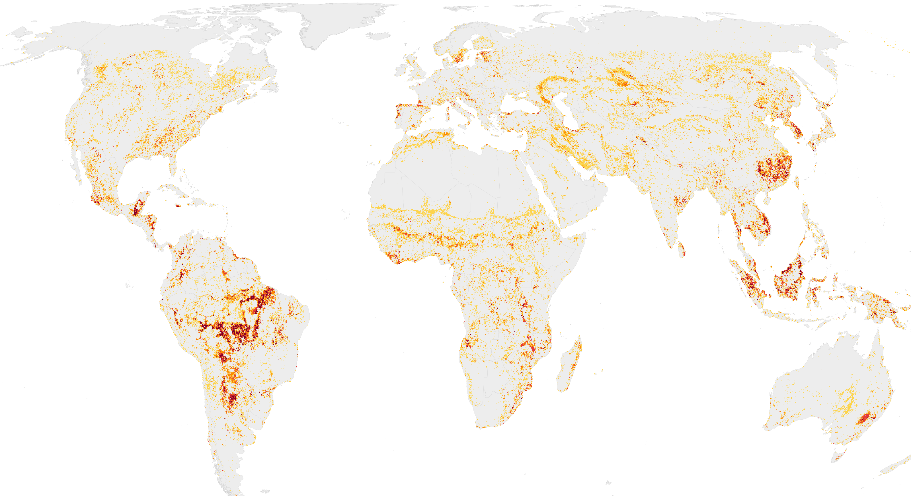{height="440px" fig-align="center"}

::: {.notes}
- Three questions, same structure as the paper: WHAT = Path A (native pixels summed to groups), WHERE = Path B hotspots on the 10 km grid, WHO = socioeconomic profiling and population exposure.
- The map: hotspots of decline, 1992-2020, darker where more services overlap (the paper's hotspot map, shown in full in the WHERE section).
- If someone asks about drivers (land cover, climate): not answered here; it is the next analysis and comes back at the end.
- Earlier versions had a fourth pillar (WHY / land cover attribution). The paper now treats attribution as future work; the exploratory overlay is in the Supplement and comes back on one slide at the end.
:::

---

## A Pipeline for Many Questions

::: {.columns style="font-size: 0.8em; align-items: flex-start;"}
::: {.column width="50%"}

### Every choice is an input
- **Services**: any raster (InVEST or another model); five here
- **Dates**: any two snapshots; 1992 and 2020 here (next: a yearly series, to follow trends rather than two endpoints)
- **Groupings**: any vector layer (regions, biomes, income groups, countries, basins, custom units, grids)
- **Metric**: relative (SPC) or absolute change
- **Hotspot rule**: threshold and direction per service
- **Scale**: 300 m pixels, 10 km grid, or a finer regional grid

:::

::: {.column width="50%"}

### The same checks apply to every case
- Hotspot sensitivity to the change metric
- Do hotspots differ from typical places in population, GDP, HDI or inequality? A test for whether, and an effect size for how much
- Population exposure through downstream and travel links

### Already reused
- Colombia (2026): country and biome cut, overlaid with critical natural assets
- An interactive explorer: change maps and hotspots for any country, region, biome or income group (shown at the end)

:::
:::

::: {.notes}
- This is the message to carry through the talk: the findings that follow are one run of a general pipeline. Change the question and the answer changes, and the pipeline shows how much.
- Examples later in the talk: relative and absolute change pick different leading biomes (WHAT); SPC and absolute hotspots overlap 32-57% depending on the service (WHERE); prevalence and severity point to different places (WHERE).
- Colombia: the same hotspot and prevalence machinery, run at country scale with biome groupings and a critical-asset overlay, for the WWF Colombia / ECLAC work.
- Global scope is an implementation choice, not an architectural constraint.
- Dates: ESA CCI land cover is yearly from 1992 to 2020, so a time series is possible; it needs a model run per year, which is the costly part.
- The "test + effect size" bullet is explained on the Statistical Analysis slide in Methods.
:::

# Part 2: Methods {background-color="#004D1E"}

## Data Inputs: 1992 & 2020 Global Layers

::: {.columns style="font-size: 0.66em;"}
::: {.column width="34%"}

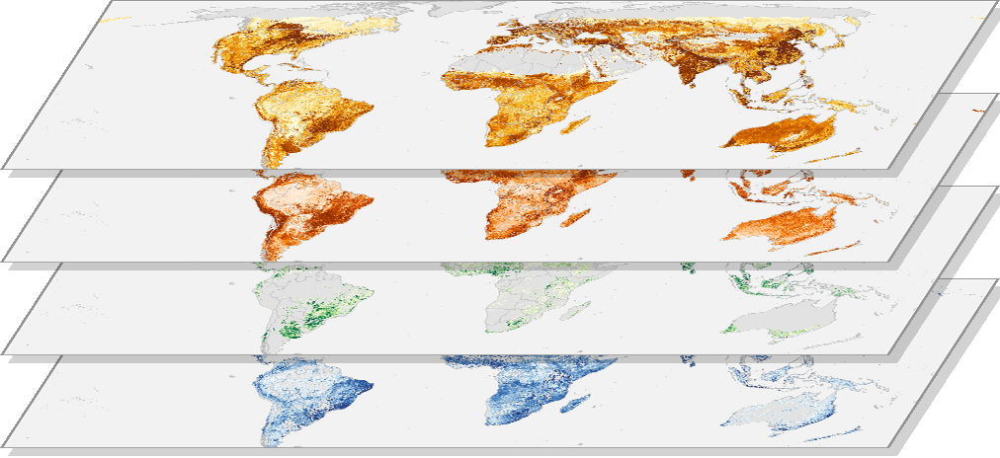{width="100%"}

### Ecosystem Services
**InVEST models, native resolution**

- Nitrogen export
- Sediment export
- Pollination
- Nature access
- Coastal risk (shoreline points, not shown)

300 m (2 km for nature access)

:::

::: {.column width="33%"}

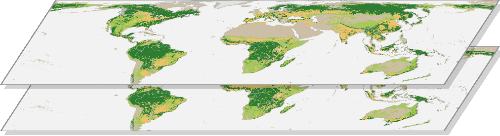{width="100%"}

### Land Cover
**ESA CCI + C3S, 300 m**

- 1992 & 2020 endpoints
- Main input to the InVEST runs
- Exploratory co-occurrence analysis (Supplement)

:::

::: {.column width="33%"}

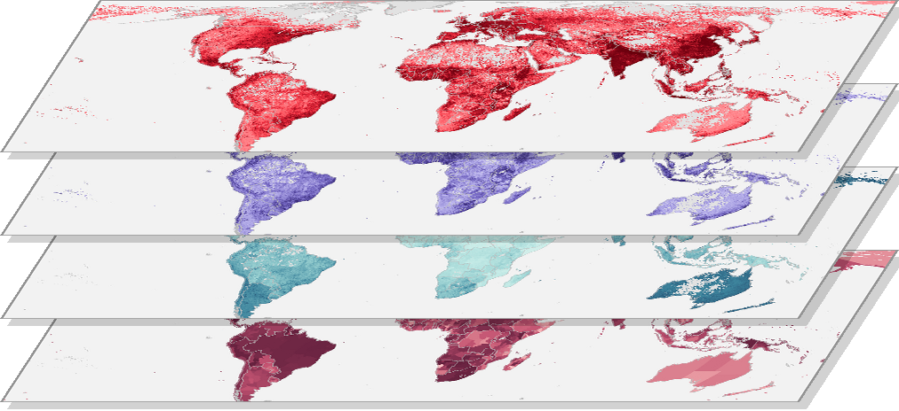{width="100%"}

### Socioeconomic
**Global gridded datasets, ~2020, summarised to the 10 km grid**

- Population: GHS-POP 2020 [(Schiavina et al., 2023)]{style="font-size: 0.8em;"}
- GDP [(Kummu et al., 2025)]{style="font-size: 0.8em;"}
- Human Development Index [(Sherman et al., 2026)]{style="font-size: 0.8em;"}
- Gini coefficient, subnational [(Kummu et al.)]{style="font-size: 0.8em;"}
- Agricultural field size [(Mehrabi et al., 2021)]{style="font-size: 0.8em;"}
- Exposure counts: LandScan 2023 [(ORNL)]{style="font-size: 0.8em;"}

:::
:::

::: {.notes}
- Time period: 1992 to 2020 (28 years). Land cover at the endpoints only, no annual transitions.
- The stacks are illustrations, listed top to bottom as in the text: services are 2020 InVEST outputs (colour by percentile); land cover is the dominant class per 10 km cell (forest, cropland, grassland, urban, other) rebuilt from the land cover change shares; socioeconomic layers are the 10 km grid values.
- Socioeconomic layers are snapshots around 2020, used to describe where hotspots are, not their change over time. TO CHECK LATER: the Gini citation "Kummu et al." is a placeholder. The layer is `rast_adm1_gini_disp_2020` (subnational Gini of disposable income), most likely from the Kummu group's dataset; confirm the exact reference before the paper is submitted.
- Two population sources: GHS-POP 2020 is the population variable in the socioeconomic tests; LandScan 2023 is used for all exposure counts (local residents and connected beneficiaries), because the beneficiary run was built on it. The explorer's "people in hotspots" uses GHS-POP, so its numbers differ slightly from the paper's.
- The same NDR, SDR and coastal vulnerability runs also give three ratios (nitrogen and sediment retention ratios, coastal risk reduction ratio). They are not used to define hotspots and are shown in the paper's Supplement only.
:::

---

## Five Ecosystem Services Define the Hotspots

::: {style="font-size: 0.78em;"}

| Theme | Service | What it measures | Adverse direction |
|:---|:---|:---|:---|
| **Habitat & Access** | Nature access | People's proximity to natural habitat | Decrease |
| | Pollination | Realized pollination on agriculture: pollinator-dependent crop production supported by nearby habitat (people fed / ha) | Decrease |
| **Coastal** | Coastal risk | Coastal vulnerability index at shoreline points, from habitats and exposure | Increase |
| **Water** | Nitrogen export | Nitrogen load delivered to streams | Increase |
| | Sediment export | Sediment load delivered to streams | Increase |

:::

::: {.callout-note style="font-size: 0.75em;"}
**Why export and risk, not retention?** They are what reaches people. A sediment retention *amount* can rise because land conversion generates more erosion to intercept, not because retention improved.
:::

::: {.notes}
- A cell is a hotspot for a service if it is in the most adverse 5% of that service's change.
- Pollination is realized pollination on agriculture, not habitat suitability. It can rise when pollinator-dependent cropland expands next to remaining habitat (comes back on the WHAT slides).
- Ratios are not hotspot variables: export and retention of the same pollutant are not independent, and a retention ratio also depends on the load arriving from upstream.
:::

---

## Socioeconomic Context: The WHO Input Layers

{height="580px" fig-align="center"}

::: {.notes}
- Population and GDP turn out to be high in hotspots of every service, so they do not distinguish services. HDI and Gini do (WHO section).
- All layers are 2020 values, a temporal mismatch with the 1992-2020 change window. Acknowledged limitation.
:::

---

## Spatial Framework & Analytical Groupings

[*Analysis unit: ~1.37 million evaluated 100 km² equal-area cells (IUCN AOO 10 km grid). Groupings are interchangeable inputs.*]{style="font-size: 0.78em;"}

{width="88%" fig-align="center"}

::: {.notes}
- The equal-area grid puts large and small ecosystems on equal footing.
- World Bank regions: policy framing. Income groups: equity lens. Biomes: ecological framing. Countries: operational scale.
- These four are the ones used in the paper; any other vector layer (a basin, a protected-area network, a jurisdiction) plugs in the same way.
:::

---

## Why Two Pathways?

::: {.columns style="font-size: 0.84em; align-items: flex-start;"}
::: {.column width="50%"}

### Path A: native pixels
*Compare first, then aggregate*

- Each pixel compared 1992 → 2020 at native resolution
- Change summed to regions, biomes and income groups
- **Used for:** WHAT

:::
::: {.column width="50%"}

### Path B: 10 km equal-area grid
*Aggregate first, then compare*

- Native rasters summarised into ~1.37 M evaluated cells before computing change
- Every cell = 100 km², so cells can be ranked globally
- **Used for:** WHERE and WHO

:::
:::

::: {.callout-note style="font-size: 0.75em; margin-top: 0.5em;"}
**Why not one path?** The order of aggregation and differencing matters: averaging grid values up to broad regions can flip the sign between absolute and relative change (a MAUP effect). Path A avoids the intermediate grid.
:::

::: {.notes}
- Path A: diff then aggregate. Path B: aggregate then diff. Different questions, different orders.
- Found empirically: a mean of per-cell percentage changes can have the opposite sign to the change in totals for the same region. Both are correct at their scale; group results therefore use the SPC of group totals.
:::

---

## Analytical Pipeline {.pipeline}

```{mermaid}
%%{init: {'flowchart': {'rankSpacing': 38, 'nodeSpacing': 70, 'padding': 16}, 'themeVariables': {'fontSize': '18px'}}}%%
flowchart TB
    subgraph Inputs[" "]
        direction LR
        RawES["InVEST ES Models<br/>300 m to 2 km · 1992 & 2020"]
        RawGrid["10km Grid +<br/>Grouping Layers"]
        RawSoc["Socioeconomic Data<br/>Pop · GDP · HDI · Gini"]
    end

    IntA["Path A<br/>Pixel-level"]
    MathA["Path A Metrics<br/>SPC & Abs. Δ"]
    P1(["WHAT<br/>Global Trajectories"])

    IntB["Path B<br/>10km Grid"]
    MathB["Path B Metrics<br/>SPC & Abs. Δ"]
    P2(["WHERE<br/>Hotspot Detection"])

    MathBenef["Serviceshed<br/>Routing"]
    MathSoc["KS Tests &<br/>Socioec. Profile"]
    P4(["WHO<br/>Exposure & Profile"])

    RawES ==> IntA & IntB
    RawGrid ==> IntA & IntB
    RawSoc ==> MathBenef & MathSoc

    IntA ==> MathA ==> P1
    IntB ==> MathB ==> P2

    P2 ==> MathBenef & MathSoc
    MathSoc ==> P4
    MathBenef ==> P4

    style Inputs fill:none,stroke:none

    classDef c_what fill:#007930,stroke:#004D1E,stroke-width:2px,color:#FFF;
    classDef c_where fill:#7B8327,stroke:#515619,stroke-width:2px,color:#FFF;
    classDef c_who fill:#F5D200,stroke:#B39900,stroke-width:2px,color:#333;

    class RawES,IntA,MathA,P1 c_what;
    class RawGrid,IntB,MathB,P2 c_where;
    class RawSoc,MathSoc,MathBenef,P4 c_who;
```

::: {.notes}
- Path A gives the group-level trajectories (WHAT); Path B identifies hotspots (WHERE), which feed the socioeconomic profiling and the exposure analysis (WHO).
- Python (Docker) does the zonal extraction at 300 m; R/Quarto does change, hotspots and tests. Configs, not code edits, change the services, groupings and thresholds.
:::

---

## Key Metrics

::: {.columns style="font-size: 0.85em;"}
::: {.column width="50%"}

### Symmetric Percentage Change (SPC)

<div style="font-size:0.75em">
$$\text{SPC} = \frac{T_{2020} - T_{1992}}{(|T_{2020}| + |T_{1992}|) / 2} \times 100$$
</div>

Relative to what the place provided over the period; symmetric around zero; comparable across services. Bounded −200% (service fell to zero) to +200% (new emergence).

:::

::: {.column width="50%"}

### Hotspot definition
- **Relative**: ranked within each service's own distribution
- **Most adverse 5%** per service (direction is service-specific)
- **Multi-service hotspot**: 2+ services in the most adverse 5% in the same cell
- **Relative prevalence**: a group's share of hotspots ÷ its share of the area where the service is modelled

:::
:::

---

## Statistical Analysis: KS Tests + Cliff's Delta

::: {.columns style="font-size: 0.8em;"}
::: {.column width="50%"}

**Hotspot cells** vs. **background cells**
(47.5th-52.5th percentile of each service's change: typical, stable conditions)

Test variables:

- Population (GHS-POP 2020)
- GDP
- Human Development Index (HDI)
- Gini coefficient
- Agricultural field size

:::

::: {.column width="50%"}

**Two-step interpretation:**

1. *Kolmogorov-Smirnov test* (FDR-corrected): are the values in hotspot cells and in background cells two different distributions?
2. *Cliff's Delta (δ)*: take one hotspot cell and one background cell at random; δ = P(hotspot higher) − P(background higher), from −1 to +1, 0 = no difference

With up to ~68,000 cells per group almost any difference is significant, so δ carries the interpretation.

**Used in WHO:** what kind of places hotspots are (more populated, richer, more unequal?).

:::
:::

::: {.notes}
- Background = the middle 5% of the change distribution, which keeps cells with large gains out of the comparison.
- 25 tests (5 services × 5 variables), Benjamini-Hochberg corrected. 24 of 25 differ; the exception is coastal risk × field size.
- In plain words: KS compares the whole shape of the two sets of values (e.g. Gini in hotspot cells vs Gini in stable cells), not only their means. With this many cells it says "different" almost always, so it is only the first filter.
- Cliff's δ reads as a comparison of random pairs: δ = 0 means a random hotspot cell is as likely to be higher as lower than a random background cell; δ = +0.25 means it is the higher one 25 percentage points more often than the lower one. (Converting to "x in 10 pairs" assumes few ties; Gini is subnational, so many cells share a value and that conversion would overstate it.)
- It works on ranks, so it is not distorted by skewed variables such as population and GDP.
:::

# Part 3: Results {background-color="#004D1E"}

# WHAT: Change Depends on How You Measure It {background-color="#007930"}

## WHAT: Absolute vs. Relative Change Map Different Places

::: {.panel-tabset style="font-size: 0.55em;"}

### Relative change (SPC)

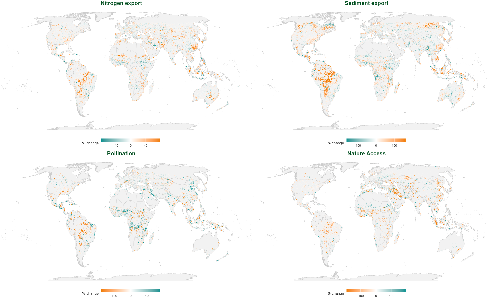{height="500px" fig-align="center"}

### Absolute change

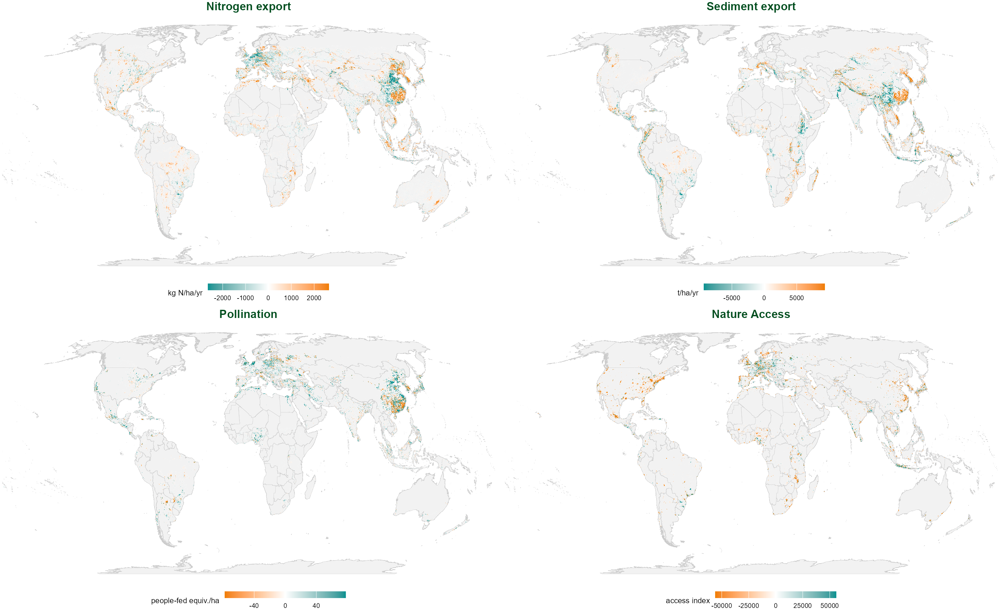{height="500px" fig-align="center"}

### Side by side

::: {.columns .tight-maps}
::: {.column width="50%"}
{width="100%"}
:::
::: {.column width="50%"}
{width="100%"}
:::
:::

:::

::: {.small-note}
Change per 10 km cell. Sediment export: in absolute terms the Amazon is a modest signal next to high-erosion Southeast Asia; in SPC it becomes the largest pattern globally, because the same physical change is large relative to a low baseline.
:::

::: {.notes}
- Path B, native 10 km grid, before any hotspot threshold. Deck copies of the paper's two figures with the white space between panels removed (images/*_tight.png). Coastal risk is too thin to see at this scale; it gets its own slide.
- SPC flags fast, disproportionate change against each place's own baseline; absolute change flags where the most material moved. The paper uses SPC as the main measure (Methods) and absolute change as a check.
:::

---

## WHAT: Global Change, Seen Through Different Groupings

[*Global, 1992-2020: N export +1.6% · sediment export +1.4% · nature access −8.7% · pollination +6.9% · coastal risk <0.1%. Left: absolute change per unit area; right: relative change (SPC). Orange = adverse, teal = favourable.*]{style="font-size: 0.55em;"}

::: {.panel-tabset style="font-size: 0.6em;"}

### Biome

{height="470px" fig-align="center"}

### World Bank region

{height="470px" fig-align="center"}

### Income group

{height="470px" fig-align="center"}

### Countries (largest changes)

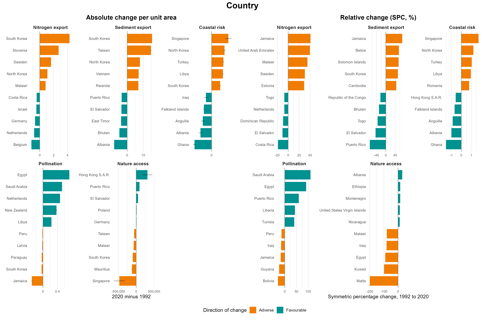{height="470px" fig-align="center"}

:::

::: {.notes}
- Nature access fell in every biome and every region.
- The leading biome depends on the measure. Sediment export rose most in relative terms in Boreal Forests/Taiga (+10.3%, low baseline) but most in absolute terms per unit area in Tropical & Subtropical Moist Broadleaf Forests (+4.9% relative). Nature access fell most steeply in relative terms in Flooded Grasslands & Savannas (−48.6%) but lost the most per unit area in Mangroves and Temperate Broadleaf forests.
- Explore: neither ranking is "the" answer; they answer different questions (share of a place's own capacity vs largest quantities).
- Tabs: the same native-pixel change, summed by biome, World Bank region, income group, and the countries with the five largest increases and decreases per service (smallest 10% of countries by evaluated area excluded). Same pipeline, only the grouping layer changes. Region, income and country versions are in the paper's Supplement.
:::

---

## WHAT: A "Gain" That Signals Conversion

::: {.columns style="font-size: 0.74em; align-items: center;"}
::: {.column width="44%"}

- Pollination here is **realized pollination on agriculture**
- It rose in every region (+6.9% globally)
- Flooded Grasslands & Savannas: the **steepest nature access loss (−48.6%)** and the **largest pollination gain (+31.0%)**, in the same biome
- Across all cells: the more of a cell became cropland, the larger the pollination gain and the deeper the loss of access to nature
- Reading: pollinator-dependent cropland expanding next to habitat that still remains

::: {.callout-important}
A change in the "favourable" direction is not always good news. Each variable needs its own reading before it is aggregated.
:::

:::
::: {.column width="56%"}

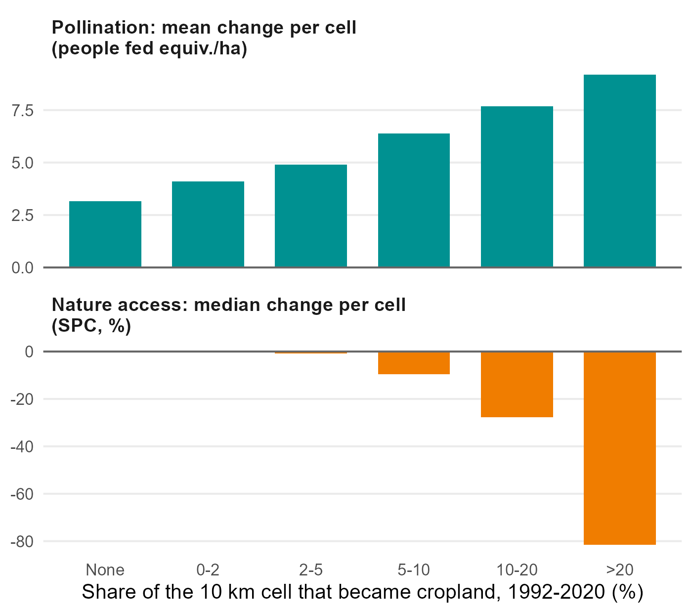{height="520px" fig-align="center"}

:::
:::

::: {.notes}
- This is the global-average trap: pollination going up looks like an improvement, but here it is the footprint of agricultural expansion into still-habitat-rich landscapes.
- Same logic for the sediment retention amount (rises with land-conversion erosion), which is why the paper uses export.
- Chart: 796,003 cells with both land cover change and pollination data (cells are grouped by the share that became cropland; script scripts/mapping/make_deck_pollination_cropland.R). Mean pollination change rises from +3.2 (no new cropland) to +9.2 people fed equiv./ha (>20% new cropland); median nature access change falls from 0 to −81.5%. Cells with no new cropland still gain a little, so cropland expansion is not the only reason pollination rose. Co-occurrence, not attribution.
- The share of cells where pollination rose is about a third in every group; what grows with cropland expansion is the size of the gain.
:::

---

## WHAT: Coastal Risk at the Shoreline

{height="530px" fig-align="center"}

::: {.small-note}
Windows chosen by **population**, not by change intensity: A-D are densely populated coasts where risk rose, E-F where it fell.
:::

::: {.notes}
- Coastal risk changed at 4.6% of 1.37 M shoreline points, and changes are small (within about ±18% SPC).
- Increases and decreases are spread along most coastlines in similar numbers (23,591 rose and 21,111 fell by at least 1%).
- Panels: New York/New Jersey, Nile delta, Istanbul/Sea of Marmara, Manila Bay (rose); Pearl River delta, Gulf of Kutch (fell).
- How the windows were chosen (rule in scripts/mapping/make_coastal_risk_zooms.R, 10-05): coastal 5-degree boxes ranked by the people (GHS-POP 2020) living in cells where coastal risk changed by 1% or more. A-D: the most populated boxes where it rose, one per continent; E-F: the two most populated where it fell. Ranking by size of change would have picked empty coasts, since changes are small and rises and falls are spread along most coastlines; ranking by people ties the figure to exposure. E-F show that risk did not only go up.
- If asked whether these are exactly the top boxes: approximately. A quick recompute on the 10 km grid puts Manila, New York/New Jersey, Istanbul and the Nile delta near the top, but Mumbai (6.5 M people) edges Manila (6.4 M), Lagos (3.5 M) edges the Nile delta (3.2 M), and Bangladesh (2.2 M) ranks above the Gulf of Kutch (about 1.9 M) for decreases. The differences are small and may come from box alignment or shoreline points vs grid cells; the original ranking was not saved. Safe wording: "densely populated coasts where risk rose or fell".
:::

# WHERE: How Often and How Severe {background-color="#004D1E"}

## WHERE: Hotspots Cluster in Latin America and East Asia {.tight-figs}

::: {.small-note}
*189,932 hotspot cells (13.8% of 1.37 M evaluated cells)*
:::

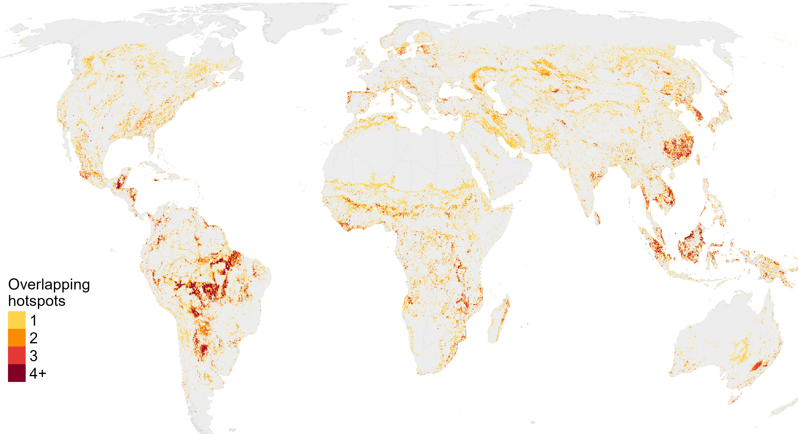{height="385px" fig-align="center" fig-alt="Number of overlapping hotspots per 10 km cell"}

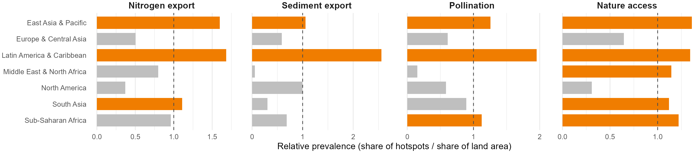{height="165px" fig-align="center"}

::: {.notes}
- Hotspots cluster in space; they are not random scatter.
- Averaged over the four land-based services, relative prevalence is highest in Latin America & Caribbean (1.9) and East Asia & Pacific (1.3); Sub-Saharan Africa is at 1.0; Europe & Central Asia, North America and MENA around 0.6.
- Multi-service cells (darkest) are where a single intervention could address several declines.
- Map: deck version of the paper's hotspot map, cropped to the land (no Antarctica), legend inside the frame; the paper's PNG has a stray line across the Arctic (to fix in the paper figure). Redrawn from the explorer data: 189,927 cells in at least one hotspot vs the paper's 189,932 (ties at the 5% cutoff; numbers-audit item).
- ~90 seconds
:::

---

## WHERE: Frequency and Severity Are Different Questions

::: {.columns style="align-items: flex-start;"}
::: {.column width="62%"}

{width="100%"}

{width="100%"}

:::
::: {.column width="38%" .fs56}

**How to read:** (a) how often hotspots occur; (b) how much the service changed in the typical hotspot cell

**Frequent and severe**

- *Sediment export* in tropical moist forests: 3× as many hotspots as area predicts; typical hotspot cell roughly **quadrupled** (SPC +124%)
- *Pollination* in tropical coniferous forests: 3×; typical cell lost **about two thirds** (−102%); 30% lost it all

**Rare but severe**

- *Nature access* in deserts & xeric shrublands: half as many hotspots as area predicts, but the typical one lost **over 90%** (−169%); **42% lost access entirely**

**Uniform severity**

- *Nitrogen export*: typical cell up 40-75% (+35% to +55%) in every biome; biomes differ only in frequency

:::
:::

::: {.notes}
- New in the 10-06 revision of the paper. Prevalence says where hotspots cluster; within-hotspot SPC says how bad they are.
- Converting SPC to a plain ratio: 2020/1992 = (200 + SPC) / (200 − SPC). +124% -> 4.3× (roughly quadrupled); −102% -> 0.32 (lost about two thirds); −169% -> 0.08 (lost over 90%); +35% -> 1.42 and +55% -> 1.76. SPC runs from −200% (service fell to zero) to +200% (appeared from zero). The conversion is monotonic, so it holds for medians.
- Source: outputs/tables/hotspot_spc_within_hotspots.csv (e.g. sediment export, tropical moist broadleaf: 30,621 hotspot cells, median +123.8%, IQR +90% to +166%).
- Two prioritization logics: go where hotspots are frequent (most cells, most co-benefit), or where they are rare but the service is lost outright.
- Flooded Grasslands & Savannas combine both for nature access (prevalence 1.8, median −132%, 34% total loss).
:::

---

## WHERE: Coastal Risk Hotspots

::: {.columns style="align-items: flex-start;"}
::: {.column width="62%"}

{width="100%"}

{width="100%"}

:::
::: {.column width="38%" .fs68}

- Measured against coastal cells only (coastal risk exists only there)
- Over-represented in **South Asia (1.8)**, **Sub-Saharan Africa (1.4)** and on **low-income coasts (1.3)**; under-represented in North America (0.6)
- Unlike land services: slightly over-represented on high-income OECD coasts (1.1)
- Low-income coasts and South Asia also have the **largest increases** (median +2.3% and +2.2%)
- Sub-Saharan Africa: more hotspots, but not more severe (+1.4%)

:::
:::

::: {.notes}
- Changes are small everywhere (medians 1-2.5%).
- About 40% of coastal risk hotspots fall in coastal cells outside the grouping layers, so these group results rest on ~60% of the hotspots.
- The earlier deck/paper figure (Mangroves 15×) used all land cells as the denominator; against coastal cells Mangroves are ~1.0.
:::

---

## WHERE: The Hotspot Set Depends on the Metric

::: {.columns style="align-items: flex-start;"}
::: {.column width="44%" .fs56}

Hotspots ranked by relative change (SPC) vs absolute change, each the 5% most adverse cells:

| Service | Overlap | 1992 level, SPC-only vs absolute-only | People, SPC-only / absolute-only |
|:---|---:|---:|---:|
| Nitrogen export | 57% | 25× lower | 191 M / 442 M |
| Nature access | 43% | 870× lower | 100 M / 975 M |
| Pollination | 35% | 1,000× lower | 108 M / 546 M |
| Sediment export | 32% | 1,300× lower | 66 M / 418 M |

- The overlap reads the same either way round: both sets are the same size
- **SPC only:** a large share of little, in low-provision landscapes (Amazon, boreal, drylands), mostly Latin America and Sub-Saharan Africa
- **Absolute only:** large amounts in high-provision, densely used landscapes (mountain ranges, East Asia, Europe), with 2-10× more people
- The metric changes **who** counts as exposed, not only where; the paper's WHO results use SPC

:::
::: {.column width="56%"}

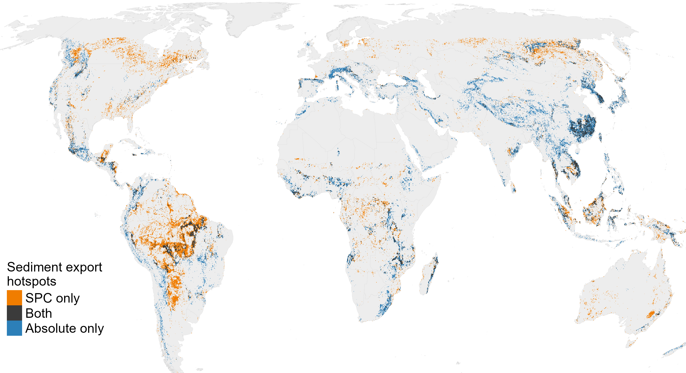{width="100%"}

:::
:::

::: {.notes}
- Overlap = share of SPC hotspot cells that are also hotspots by absolute change. Both rankings take the 5% most adverse of the same cells, so the two sets are the same size and the share is identical read the other way round (checked: 57/43/35/32% both ways).
- 1992 level: median baseline of the cells that are hotspots under only one metric, recovered from the two change columns (SPC = 200(b−a)/(a+b), abs = b−a). For sediment export, SPC-only hotspots started about 1,300 times lower than absolute-only ones.
- Typical change also differs: sediment export SPC-only hotspots rose by a median +111% SPC vs +22% for absolute-only; pollination −82% vs −9%.
- People: GHS-POP 2020 living in the cells (local residents), not the LandScan exposure counts.
- So SPC flags places losing a large share of what little they had (frontier landscapes); absolute change flags where the most material moved (productive, populated landscapes). Both are legitimate questions; the paper chose SPC and says so. A WHO analysis on absolute hotspots would shift toward East Asia, Europe and North America.
- Coastal risk is left out: it is a unitless exposure index between about 1 and 5 (shoreline points: median 2.4, 1st-99th percentile 1.4-4.4), so the two rankings coincide (97% overlap, Spearman 0.9999) and the row says nothing about the choice of metric.
- Source: scripts/mapping/make_deck_metric_overlap.R -> outputs/tables/hotspot_metric_overlap_profile.csv.
:::

# WHO: Inequality, Not Just Poverty {background-color="#007930"}

## WHO: Hotspots by Income Group {.tight-figs}

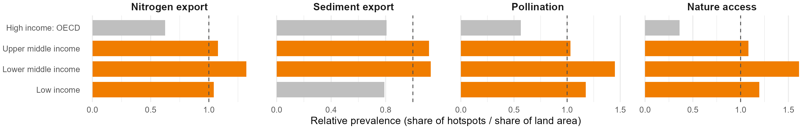{width="100%"}

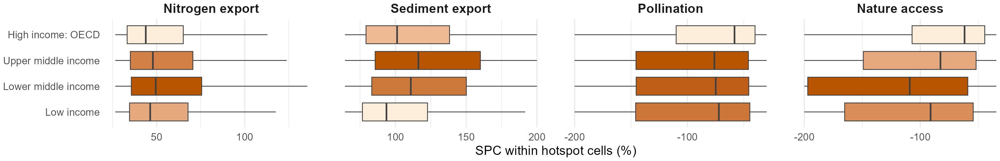{width="100%"}

::: {.columns style="font-size: 0.6em;"}
::: {.column width="50%"}
- Lower-middle-income countries: **15.6% of the land, 21% of hotspot cells** (25% for nature access)
- High-income OECD: 25% of the land, 15% of hotspot cells
:::
::: {.column width="50%"}
- Per unit area, hotspots are **~2.3× as frequent** in lower-middle-income countries
- Nature access losses are also **deepest** there: median −109% vs −62% in high-income OECD; **22% vs 8%** of hotspots lost access entirely
:::
:::

::: {.notes}
- More frequent and more severe in the same income group: the two dimensions reinforce each other here, unlike some biomes.
- The 2.3× replaces the older 1.8× (which compared people, not land, and came from an earlier hotspot table).
:::

---

## WHO: Inequality Separates the Services

{height="320px" fig-align="center"}

::: {.columns style="font-size: 0.7em;"}
::: {.column width="50%"}

### Shared by all five services
Hotspots are more populated and higher-GDP than typical cells (δ +0.52 to +0.64, a large difference). Because this holds everywhere, it does not tell services apart.

### Land-based services
Hotspots sit in more unequal places (Gini δ +0.22 to +0.30, smaller but consistent across the four); HDI barely differs (δ −0.01 to −0.08).

:::
::: {.column width="50%"}

### Coastal risk
Higher HDI (δ +0.29), small Gini rise (+0.08), yet over-represented on low-income coasts.

### Open question
Why inequality, and not development level or poverty? Candidates: frontier expansion, land tenure, governance of land conversion. None tested here.

:::
:::

::: {.notes}
- This is where the KS tests and Cliff's δ from Methods pay off: they are the evidence for "what kind of places are hotspots". Each cell of the heatmap compares hotspot cells with typical (stable) cells of the same service for one variable.
- Reading δ: compare a random hotspot cell with a random typical cell; δ is how much more often the hotspot cell is the higher one than the lower one. Gini +0.25: the hotspot cell is the more unequal one about 25 percentage points more often than the reverse. Population +0.6: 60 points more often.
- So the inequality signal is real but smaller than population and GDP (by the usual rule of thumb for δ, about 0.15-0.33 counts as small and above ~0.47 as large). Its value is that it differs between services, while population and GDP do not.
- This is the slide to open up. Inequality within places, not average development, is what distinguishes where land-based services decline most.
- These are co-occurrence results, not causal. Testing mechanisms would need sub-national tenure/governance data or case comparisons.
- Field size (Mehrabi et al.) adds little: δ −0.06 to +0.12.
:::

---

## WHO: Exposure Reaches Beyond the Hotspots

{height="300px" fig-align="center"}

::: {.columns style="align-items: center; font-size: 0.72em;"}
::: {.column width="50%"}

```{=html}
<div class="stat-row">
  <div class="stat-callout">
    <span class="stat-value">2.4B</span>
    <span class="stat-label">live in a hotspot cell</span>
  </div>
  <div class="stat-callout accent">
    <span class="stat-value">7.4B</span>
    <span class="stat-label">connected downstream or within 1 h travel (92.5% of global population)</span>
  </div>
</div>
```

:::
::: {.column width="50%"}

- Hotspots cover **13.8%** of the evaluated land
- Connected beneficiaries outnumber residents **~3 : 1**, rising to ~30 : 1 in cells with 4+ hotspots
- Downstream: 5.9B · travel access: 7.2B
- Low-income countries: ~13% of the people connected

:::
:::

::: {.notes}
- Upper-middle-income countries have the most residents in hotspots (919 M); lower-middle-income the most connected beneficiaries (2,675 M).
- Explore: exposure is not impact. "Connected" means within 50 km downstream or 1 h travel of a hotspot; how much of the decline reaches each person is not measured.
- Population is LandScan 2023, applied to 1992-2020 change: a temporal mismatch, acknowledged.
- Numbers updated 10-07 to the current beneficiary run (07-29, five-service hotspots); the earlier 3.1B / 7.6B came from a June run on the old 8-variable hotspots.
:::

# Part 4: Discussion {background-color="#004D1E"}

## The Answer Depends on the Question

::: {style="font-size: 0.8em;"}

| Choice | Example from this analysis |
|:---|:---|
| **Metric** | SPC and absolute change select 32-57% of the same hotspots, depending on the land service |
| **Baseline** | Sediment export: Boreal forests lead in relative terms, tropical moist forests in absolute terms |
| **Grouping** | Lower-middle-income countries lead on land services; coastal risk is over-represented on low-income *and* high-income OECD coasts |
| **Dimension** | Deserts: few nature access hotspots, but the most severe ones |
| **Scale** | Mean of per-cell change and change of totals can differ in sign for the same region |

: {tbl-colwidths="[18,82]"}

:::

::: {.callout-note style="font-size: 0.78em;"}
These are not inconsistencies to resolve by choosing one measure. A credible assessment states its metric, baseline, grouping and scale and shows how sensitive its conclusions are to each. The pipeline makes those choices explicit and repeatable.
:::

::: {.notes}
- This is the closing message for the findings, and the reason the pipeline matters more than any single number.
- Regional applications (Amazon basin, Southeast Asia, Sub-Saharan Africa) can reuse it with locally calibrated InVEST inputs and a finer grid.
:::

---

## Asking Your Own Question: The Change Explorer

::: {.columns style="font-size: 0.72em; align-items: flex-start;"}
::: {.column width="50%"}
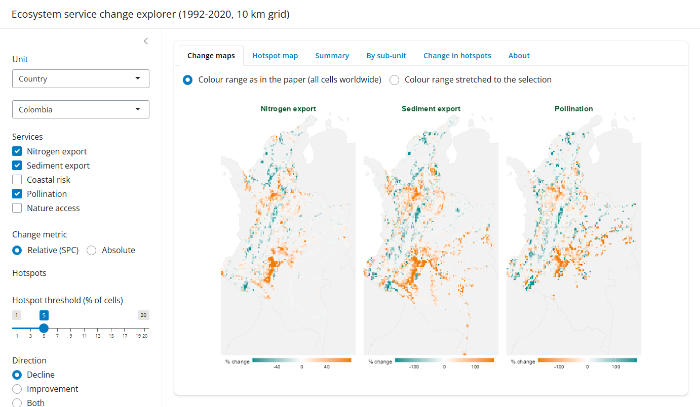{height="330px"}
:::
::: {.column width="50%"}
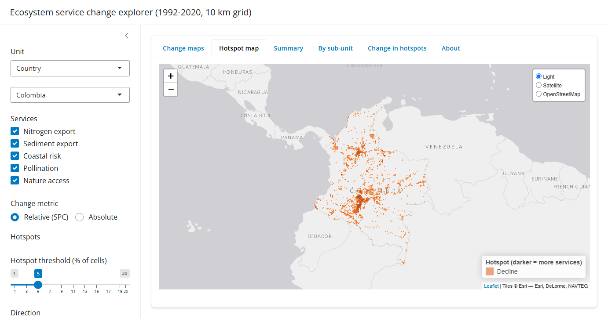{height="330px"}
:::
:::

::: {style="font-size: 0.6em;"}
- Any country, World Bank region, biome or income group; any subset of the five services
- Relative or absolute change; hotspot threshold, direction (decline or improvement) and reference (local or global)
- Prevalence by sub-unit, change within hotspots, people living in hotspots, cell download
- A prototype built on this repository's outputs: ideas for what it should show are welcome
:::

::: {.notes}
- Live demo if time allows (run `Rscript -e "shiny::runApp('scripts/dashboard')"` before the talk; the whole-world view takes ~15 s the first time). Screenshots are the fallback.
- Suggested demo: switch the reference from local to global (5% decline, all services, SPC). Share of cells in a hotspot of at least one service: Brazil 12.1% local vs 26.3% global (its extremes are the world's extremes); Germany 13.6% vs 6.8%; Colombia 12.5% vs 14.8%.
- Main point: it took a few days, not a project, because the pipeline outputs (the 10 km change grid and the native-pixel tables) already exist. I am not a web designer; the value is in the data behind it.
- Limits: local residents only. Connected beneficiaries (downstream, travel time) exist only for the global 5% decline set; other scenarios would need a new beneficiary run.
- Could be hosted (e.g. Posit Connect Cloud) if it would be useful to others.
:::

---

## Drivers: Land Cover Does Not Explain Hotspots Cell by Cell {.tight-figs}

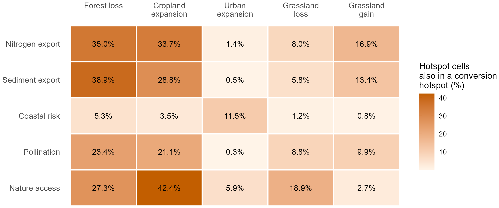{height="380px" fig-align="center"}

::: {.columns style="font-size: 0.6em;"}
::: {.column width="50%"}
- **63%** of hotspot cells show no intense land cover conversion in the same cell; 37% do
- Null model: placing hotspots at random within blocks of decreasing size, the overlap expected by chance rises from 9% (global) to 25% (0.5° blocks), so **part of the co-occurrence is regional co-location**, not same-cell
:::
::: {.column width="50%"}
- Expected from the models: sediment and nutrient effects accumulate along flow paths; pollination and nature access depend on habitat within foraging or travel distance
- Next: a distance-decay test (count conversion in neighbouring cells), and model reruns holding land cover or climate fixed
:::
:::

::: {.notes}
- Exploratory, in the paper's Supplement. Not a causal partition.
- Climate inputs: if the 1992 and 2020 SDR/NDR runs used different climate, export could change with no land cover change. Open question to the model authors.
- Ask the lab: how would you attribute change that the models themselves propagate along flow paths?
:::

# Part 5: Conclusions {background-color="#004D1E"}

## Synthesis

::: {style="font-size: 0.7em;"}

| Question | Finding | Implication |
|:---|:---|:---|
| **WHAT** | N and sediment export rose (+1.6%, +1.4%), nature access fell (−8.7%, in every biome and region), pollination rose (+6.9%) partly through cropland expansion | Global averages hide opposite stories; each variable needs its own reading |
| **WHERE** | 189,932 hotspot cells, clustered in Latin America & Caribbean (1.9×) and East Asia & Pacific (1.3×); frequency and severity point to different places | Two prioritization logics: frequent hotspots vs rare total losses |
| **WHO** | ~2.3× as frequent per unit area in lower-middle-income countries; land-service hotspots in more unequal places (Gini δ +0.22 to +0.30); 2.4B residents, 7.4B connected | Inequality, not only income level, marks where exposure concentrates |
| **HOW** | Results move with metric, baseline, grouping and scale; the pipeline makes each choice explicit | Report sensitivity, not a single number; reuse the pipeline for regional questions |

: {tbl-colwidths="[10,52,38]"}

:::

---

## For Discussion {visibility="hidden"}

::: {style="font-size: 0.85em;"}

1. Where would these maps and the pipeline be most useful: national planning, WWF priorities, ecosystem accounting, global assessments?
2. Decline concentrates in more unequal places. What would a follow-up study need to explain why?
3. What questions would you ask with the explorer, and who else should have it?
4. What would most improve the next round: a yearly series, locally calibrated models, or attributing change to its drivers?

:::

::: {.notes}
- Leave ~5 minutes here. Broad on purpose: the aim is to hear where the lab sees value and what to do next, not to settle technical choices.
- Q2 is future work, outside this paper's scope (the paper reports co-occurrence, not mechanism).
- Q3: invite people to try the explorer after the talk; collect ideas.
:::

---

## Status {visibility="hidden"}

::: {.columns style="font-size: 0.7em;"}
::: {.column width="50%"}

**Done**

- Paper draft revised and shared for PI review (October 2026)
- Five-service hotspot definition (export and risk), SPC as the primary metric
- Coastal risk prevalence measured against coastal cells
- Frequency vs severity of hotspots by biome, region and income group
- Metric sensitivity and null models for co-occurrence

:::

::: {.column width="50%"}

**Open**

- Climate inputs for the 1992 vs 2020 SDR/NDR runs (same or era-specific?)
- Every paper number traced to data by a verification script
- Driver attribution (distance-decay, fixed-input reruns): future work
- Hand-off: runbook, data documentation, regional worked example

:::
:::

# Thank You {background-color="#004D1E"}

**Questions?**

- Contact: Jerónimo Rodríguez Escobar (jeronimo.rodriguez@wwfus.org)

---

## Appendix: Within-Hotspot Change by Region

{width="100%" fig-align="center"}

::: {.notes}
- Middle East & North Africa: half of the nature access hotspots (51%) lost access entirely (median −200%).
- Latin America & Caribbean: the most severe pollination and sediment export hotspots (medians −99% and +130%).
:::

---

## Appendix: Technical Methods — Key Decisions

::: {.columns style="font-size: 0.74em; align-items: flex-start;"}
::: {.column width="50%"}

### Spatial standardisation
- InVEST rasters are in **WGS84** — pixel area varies with latitude
- **Volumetric services** (N export, Sed export): pre-normalised to **per hectare** before extraction, correcting for latitude-dependent pixel size
- **Already per-area or index values** (pollination in people fed/ha, nature access, retention ratios): no correction; an area correction would introduce spurious latitudinal gradients
- **Coastal risk** (`C_Risk` = `Rt`): exposure index at shoreline points, averaged to the grid; not an area-based quantity

:::
::: {.column width="50%"}

### Aggregation at the grid-cell level
- All ES rasters extracted to 10km grid using **mean** (not sum)
- Rasters are already per-ha → mean gives a valid, comparable per-ha rate across equal-area cells
- For hotspot detection: SPC(mean, mean) = SPC(sum, sum) for equal-area cells — rankings are identical regardless of choice
- **Socioeconomic variables** (Population, GDP) use **sum** — these are absolute counts/totals, a different interpretation

### Equal-area grid
- IUCN AOO 10km grid uses an **equal-area projection**, not lat/lon
- Every cell = exactly 100 km² regardless of latitude
- Makes cross-regional comparisons valid without polar distortion

:::
:::

::: {.notes}
- This slide is a Q&A backup — not shown in the main flow.
- The per-hectare correction question comes up because InVEST runs in WGS84 for most services. The key point: correction was applied where it's meaningful (absolute quantities), not applied where it would distort (dimensionless values).
- The mean vs sum question: pragmatically, it doesn't affect hotspot results because SPC normalizes the values. The choice matters more for interpretability of the grid-cell values.
- Equal-area point: a standard lat/lon grid at 10 arc-minutes has cells ~50% smaller at 60°N than at the equator — that would bias hotspot counts toward the tropics by area alone.
:::

---

## Appendix: Methodology References

::: {.columns style="font-size: 0.72em;"}
::: {.column width="50%"}

### Data & Tools
- **InVEST**: Sharp et al. (2020) — Natural Capital Project biophysical models
- **exactextract**: Fast raster zonal statistics (Python)
- **ESA CCI / C3S**: Land cover classification from satellite data (1992–2020)
- **Quarto + R**: Reproducible analysis and reporting

### Repository Structure
- `analysis/`: pipeline notebooks (process → hotspots → synthesis → KS tests)
- `R/`: reusable functions and the single service config (`service_config.R`)
- `scripts/mapping/`: paper figures · `analysis_configs/`: pipeline configs
- `docs/`: paper, book, methodology, runbook and this presentation

:::
::: {.column width="50%"}

### Key Publications & Methods
- Chaplin-Kramer et al. (2019) *Science*: global NCP baseline — this paper extends it
- Chaplin-Kramer et al. (2023) *Nature Ecology & Evolution*: critical natural assets
- Brauman et al. (2020) *PNAS*; IPBES (2019); Millennium Ecosystem Assessment (2005): global trends in nature's contributions
- Kim et al. (2024) *Science*; Peng et al. (2023) *J. Cleaner Production*: closest global trend studies
- Socioeconomic layers: Schiavina et al. (2023) GHS-POP; Kummu et al. (2025) *Sci. Data* GDP; Sherman et al. (2026) *Nat. Commun.* HDI; Mehrabi et al. (2021) *Nat. Sustain.* field size; ORNL (2024) LandScan 2023
- Cliff (1993): Cliff's Delta effect size for ordinal data
- Benjamini & Hochberg (1995): false discovery rate correction
- Andam et al. (2008): ecosystem service spillover effects
- Kolmogorov & Smirnov: non-parametric distribution comparison

:::
:::
