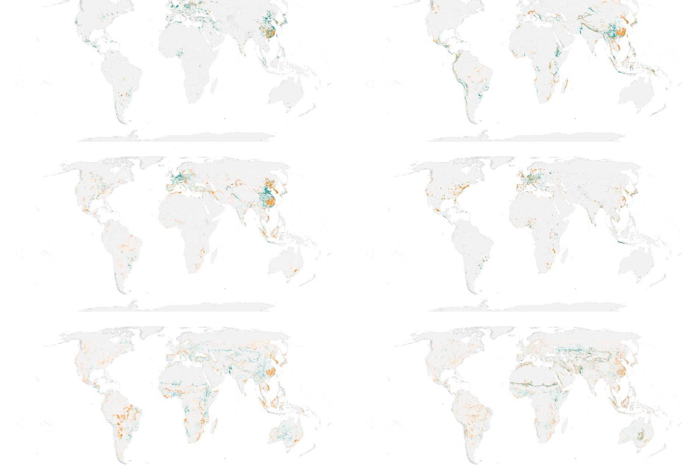
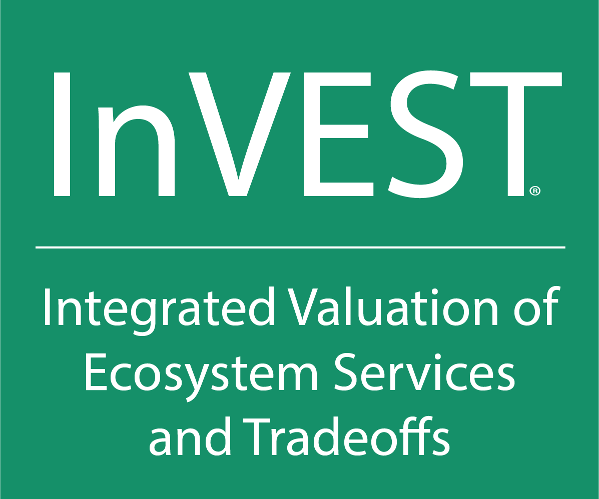
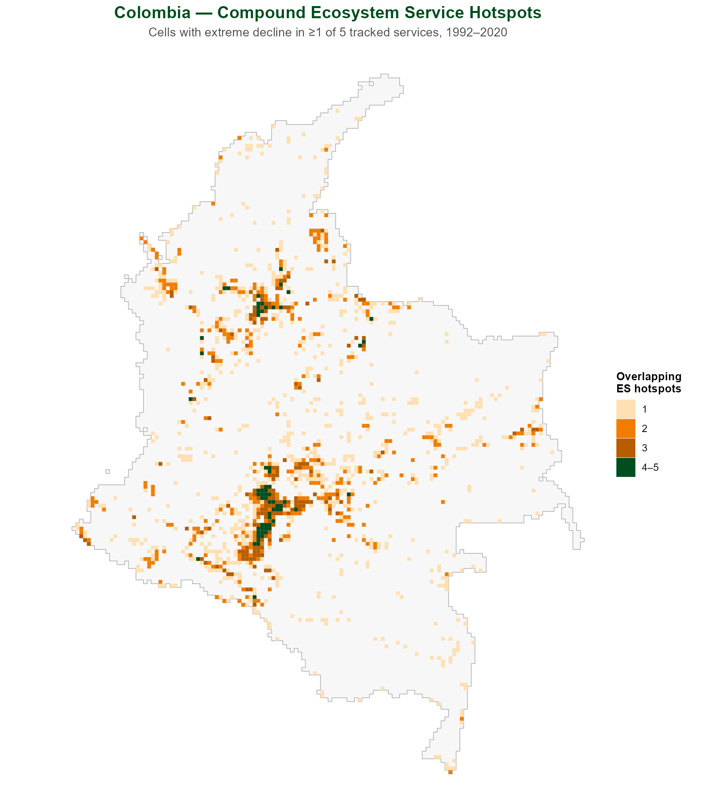
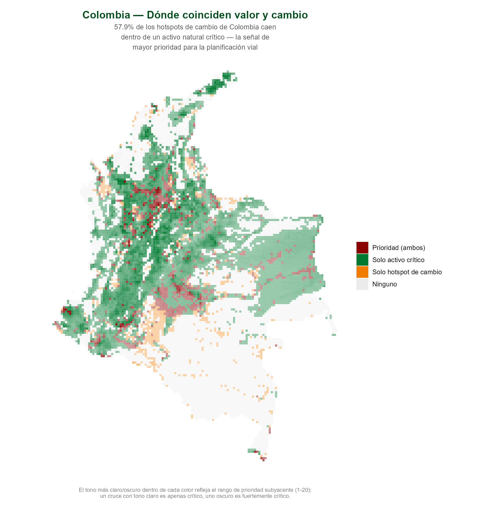

## La Alianza Natural Capital y WWF Global Science {.smaller}

- La Alianza Natural Capital nació hace ~20 años en Stanford y reúne a:
    - **WWF, Stanford, University of Minnesota, The Nature Conservancy, la Academia China de Ciencias y el Stockholm Resilience Centre**.
- Ha producido herramientas de código abierto para integrar el valor de la naturaleza en la toma de decisiones — p. ej. **InVEST**, RIOS, OPAL, ROOT y MESH.
- Global Science:
  - **CONVEI** — consorcio WWF/NASA/NOAA/USGS que valora datos de observación de la Tierra para la toma de decisiones, PI **Rebecca Chaplin-Kramer** — Global Biodiversity Lead Scientist.
  - **NatCap TEEMs** (U. of Minnesota) — modelos que integran economía, comercio y servicios ecosistémicos; lidera el proyecto de metodología para estimar el **GEP Global** (Producto Ecosistémico Bruto, el equivalente al PIB para el valor de la naturaleza).
  - **Conservation Navigator** — datos y análisis curados para apoyar la toma de decisiones de conservación.
- Marco general: **Roadmap 2030**, estrategia de WWF centrada en conservación con liderazgo local.


::: {.notes}
Transición hacia el siguiente slide (verbal, no en el texto): "el análisis que sigue —hotspots de cambio y activos naturales críticos— es la pieza que mejor conozco y donde más puedo aportar hoy, pero no es la única puerta de entrada a este ecosistema de trabajo."

Apertura (~30-40 seg): esta diapositiva es nueva (agregada 2026-08-18) — el objetivo es que Sandra vea que WWF Ciencia Global es más que "el análisis de hotspots," sin restarle tiempo al contenido central que sigue. No leer la lista completa en voz alta; usarla como apoyo visual mientras se habla del panorama general.

Todo lo anterior está verificado contra fuentes oficiales de WWF (2026-08-18), no inventado:
- Alianza Natural Capital y sus 6 instituciones socias: worldwildlife.org/our-work/science/the-natural-capital-alliance
- CONVEI (Collaborative Network for Valuing Earth Information), liderado por WWF con NASA/NOAA/USGS, dirigido por Becky: worldwildlife.org/our-work/science/convei. Becky es Global Biodiversity Lead Scientist de WWF (título verificado en worldwildlife.org/about/profiles/becky-chaplin-kramer); autoría del paper base (2019, Science) es contexto ya conocido del proyecto, no una búsqueda nueva. Deliberadamente NO se menciona aquí que es mi supervisora directa — el título slide ya la lista como coautora, y su trayectoria/credenciales aportan más que la relación jerárquica.
- NatCap TEEMs/Dept. de Economía Aplicada de UMN: GTAP-InVEST (modelo económico de comercio global + cambio de uso del suelo + InVEST): natcapteems.umn.edu
- Conservation Navigator (navigator.panda.org): worldwildlife.org/initiatives/creating-powerful-conservation-tools
- Roadmap 2030

Punto de conexión con Colombia: Roadmap 2030 y la hoja de ruta de conservación liderada localmente de WWF Colombia (ya mencionada en el slide de la oferta al final) son la misma lógica a dos escalas — vale la pena nombrarlo explícitamente si la conversación lo permite, refuerza que esto no es un pitch aislado sino parte de una estrategia coherente.

Sobre el GEP (agregado 2026-08-19, verificado vía búsqueda web contra naturalcapitalalliance.stanford.edu, seea.un.org y PNAS — no vía natcapteems.umn.edu, que devolvió error 403 al intentar acceder directamente):
- El nombre correcto es **GEP = Gross Ecosystem Product / Producto Ecosistémico Bruto** (no "Global Ecological Product" — corregir si se menciona mal en la conversación).
- Es un índice modelado sobre el PIB: agrega el valor económico total de los servicios ecosistémicos de un área en una sola métrica monetaria, calculado con modelos InVEST (p. ej. SDR para sedimentos, rendimiento hídrico mensual).
- Desarrollado y piloteado de escala urbana a nacional en China; ya adoptado formalmente por la Comisión de Estadística de la ONU como parte del sistema de contabilidad ecosistémica SEEA-EA (vía el proyecto NCAVES).
- NatCap TEEMs lidera el "Global GEP project" para escalarlo más allá de China — socios: NatCap Stanford, NatCap University of Minnesota, Academia China de Ciencias.

Reflexión propia sobre cómo mi trabajo podría conectar con esto (NO confirmado con el equipo de NatCap TEEMs — es mi propia interpretación, verificar con Becky antes de afirmarlo como hecho establecido si Sandra pregunta): el GEP tal como se calcula hoy es una fotografía puntual (el valor de los servicios en un año/lugar dado). Para saber si el GEP global está subiendo o bajando en el tiempo -o de forma desigual entre grupos de ingreso, como sugiere el ángulo de "green growth" del proyecto- se necesita justamente el tipo de análisis que hace este pipeline: cuantificación de cambio histórico en la magnitud de los servicios (1992-2020) con InVEST a escala global, más la estratificación por equidad/ingreso ya presente en el paper. Es decir, el GEP responde "¿cuánto vale la naturaleza hoy?" y este trabajo podría responder la pregunta complementaria "¿cómo está cambiando ese valor, y para quién?" No presentar esto como una integración ya acordada — es una idea a explorar, no un hecho verificado en reuniones de laboratorio.

Backup si preguntan por RIOS/OPAL/ROOT/MESH (no leer en voz alta, solo si preguntan — no hay tiempo para cubrir las 4 en detalle):
- RIOS (Resource Investment Optimization System) — diseño costo-efectivo de inversiones en servicios de cuencas hidrográficas: dónde invertir para proteger el agua.
- OPAL (Offset Portfolio Analyzer and Locator) — cuantifica impactos de proyectos de desarrollo y ayuda a ubicar/dimensionar compensaciones que devuelvan beneficios a las mismas comunidades afectadas.
- ROOT (Restoration Opportunities Optimization Tool) — optimiza trade-offs entre servicios ecosistémicos para encontrar dónde la inversión en restauración rinde más.
- MESH (Mapping Ecosystem Services to Human well-being) — plataforma para mapear y comparar la provisión de servicios ecosistémicos bajo distintos escenarios de manejo del paisaje.
Fuente: naturalcapitalalliance.stanford.edu/software/invest/natcap-partnership-software-tools

Si preguntan por CONVEI, NatCap TEEMs o Conservation Navigator en detalle: honestamente, el conocimiento de primera mano es limitado más allá de lo verificado aquí — mejor ofrecer conectar con la persona correcta (Becky para CONVEI) que improvisar detalles no confirmados.
:::

## Enfoque global, aplicable a múltiples escalas {.smaller}

::: {style="position: absolute; top: 50%; left: 50%; transform: translate(-50%, -50%); width: 123%; height: 102%; display: flex; align-items: center; justify-content: center; overflow: visible; pointer-events: none;"}
{style="width: 100%; height: 100%; object-fit: contain; opacity: 0.5;"}
:::

Analizamos dinámicas de servicios ecosistémicos a nivel mundial, identificando:

  - **Activos críticos** (oportunidad)
  - **Procesos de cambio** (declive/riesgo)

- **Detecta y analiza cambio**: convierte datos biofísicos en una señal clara: qué está cambiando, dónde y con qué severidad.
- **Métricas estandarizada**: hotspots, activos críticos, superposición de riesgo.
- **Se adapta a múltiples unidades espaciales**: país, región, cuenca, bioma.

::: {style="text-align: right; margin-top: 14px;"}
{style="height:100px; width:auto;"}
:::

::: {.notes}
Apertura (~15 seg): mencionar que Becky y Rich respaldan este trabajo aunque no estén presentes — da credibilidad de NatCap sin necesidad de explicarlo más.

Esta diapositiva es deliberadamente amplia — "nuestro equipo hace esto a escala global, y hoy lo traemos a Colombia" — no es una clase de metodología. Sandra ya conoce el apoyo técnico de WWF Colombia a los Lineamientos de Infraestructura Verde Vial (LIVV, política interministerial liderada por Mintransporte, no un documento de WWF); el gancho es que esta capa de evidencia complementa directamente esa agenda.

Bullets rediseñados (2026-08-19) para priorizar capacidades sobre detalle técnico — la resolución y el rango temporal son detalle de implementación, no el mensaje central para esta audiencia; disponibles aquí si preguntan:
- Resolución nativa: 300m (modelos InVEST), agregado a una grilla global de 10km para el análisis estadístico.
- Rango temporal: 1992–2020 — cambio histórico ya ocurrido (realizado), no proyecciones a futuro.
- Pipeline reproducible y multi-servicio, desarrollado a escala global y regional.

Sobre la frase de apertura (2026-08-13): confirmado en la página oficial de WWF sobre la Alianza Natural Capital (worldwildlife.org/our-work/science/the-natural-capital-alliance) que WWF es una de las instituciones socias nombradas explícitamente (junto a Stanford —sede—, University of Minnesota, The Nature Conservancy, la Academia China de Ciencias, Natural Capital Insights y el Stockholm Resilience Centre), no solo un colaborador informal. Científicos de WWF ayudaron a desarrollar InVEST y otras herramientas de la alianza (RIOS, OPAL, ROOT, MESH). Lo que NO está confirmado ni debe afirmarse en la reunión: los detalles internos de cómo este puesto postdoctoral específico se estructura formalmente como parte del aporte de WWF a la alianza — eso es una pregunta interna para Becky, no algo público. Si Sandra pregunta por el rol personal dentro de la alianza, responder en términos generales (parte del equipo de Ciencia Global de WWF que aplica las herramientas de NatCap) sin inventar detalles sobre la estructura formal del puesto.
:::

## Oportunidad: activos naturales críticos {.smaller}

::: {.columns}
::: {.column width="55%"}
```{=html}
<div class="stat-row">
  <div class="stat-callout">
    <span class="stat-value">2,93×</span>
    <span class="stat-label">intensidad relativa: % de activos críticos vs. % de tierra elegible global</span>
  </div>
</div>
```
- **Activo natural crítico** = área requerida para sostener el **90%+** de las contribuciones de la naturaleza a las personas (Chaplin-Kramer et al. 2022, *Nature Ecology & Evolution*).

```{=html}
<table class="mini-table">
<tr><th>Servicio</th><th>Qué representa como activo</th></tr>
<tr><td>Polinización</td><td>Hábitat que sostiene polinizadores</td></tr>
<tr><td>Retención de sedimentos</td><td>Hábitat que retiene sedimento antes de erosionarse</td></tr>
<tr><td>Retención de nitrógeno</td><td>Hábitat que retiene nutrientes antes de exportarse</td></tr>
<tr><td>Acceso a la naturaleza</td><td>Hábitat natural accesible para la población</td></tr>
<tr><td>Protección costera</td><td>Hábitat que reduce el riesgo costero</td></tr>
</table>
```
:::
::: {.column width="45%"}
{style="max-height:620px; width:auto; max-width:100%;"}
:::
:::

::: {.notes}
Este slide abre con oportunidad antes que riesgo — mismo orden que el deck de IADB Workshop 1. Establece que WWF no solo mapea problemas, también identifica dónde vale la pena invertir en protección/restauración.

Si preguntan por la metodología: optimización a escala nacional sobre 12 NCP locales simultáneamente: valor 20 = la celda sigue siendo necesaria incluso en la solución más restrictiva (5% del área), valor 1 = solo se necesita si el objetivo se expande al 100%. "Crítico" = valor > 2 (el umbral del 90% del paper original).

El 2,93× usa la máscara de tierra propia del ráster de Chaplin-Kramer et al. (no la grilla de 10km de este proyecto) como denominador de "tierra elegible" — metodológicamente separado del 0,87% usado en los hotspots de cambio, aunque el número final es coincidentemente similar. Aclarar si preguntan por qué ambos rondan ~0,87-0,88%.

Explicación completa del paper (verificada 2026-08-19 contra nature.com/articles/s41559-022-01934-5 y el repositorio de datos en OSF, osf.io/r5xz7 — no improvisar más allá de esto si preguntan más detalle):

- **Qué son**: "activos naturales críticos" = los ecosistemas (naturales y semi-naturales) que sostienen el 90% de la magnitud actual total de 14 tipos de contribuciones de la naturaleza a las personas (NCP) — 12 de alcance local (polinización, acceso a la naturaleza, protección costera, retención/exportación de nutrientes y sedimentos, etc.) y 2 de alcance global (almacenamiento de carbono, reciclaje de humedad). **Este proyecto usa específicamente la capa de los 12 NCP locales** (carpeta `local_NCP_all_targets` en los datos), no la versión combinada con las 2 globales.
- **Por qué importan (el hallazgo central del paper)**: los activos críticos para los 12 NCP locales cubren solo el **30% del área terrestre global** (24% de aguas territoriales) — es decir, una fracción relativamente pequeña de tierra sostiene la gran mayoría del valor que la naturaleza aporta directamente a las personas. Al incluir las 2 NCP globales (carbono, humedad), esa cifra sube a 44%. Es un argumento de priorización, no solo de descripción: protege ese 30-44% y proteges la mayor parte del beneficio.
- **Cómo se calculó**: optimización de conservación sistemática con el paquete R `prioritizr`, sobre 14 capas de NCP a ~2km de resolución (compiladas por Rachel Neugarten y Becky Chaplin-Kramer), reproyectadas a una grilla de área equivalente (Eckert IV) a varias resoluciones. La optimización se corrió repetidamente a presupuestos de área crecientes (5% del área hasta 100%), y cada celda recibió un "rango de prioridad" (1-20) según el presupuesto más pequeño en el que esa celda entra en la solución óptima — rango 20 = indispensable incluso en la solución más restringida; rango 1 = solo entra cuando el presupuesto casi no restringe nada.
- **Datos originales**: el ráster agregado que usa este proyecto (todas las NCP combinadas) está en `data/external/critical_natural_assets/`. Las 10 capas individuales "realized" (una por servicio/variante — polinización, protección costera, retención de nitrógeno a 50km y 500km, exportación de sedimentos a 50km y 500km, y acceso a la naturaleza en 4 variantes urbano/rural × 60min/360min) también están disponibles en OSF, no descargadas todavía en este repositorio (ver más abajo).
:::

## Dónde: Colombia concentra hotspots de cambio, no solo por su tamaño {.smaller}

::: {.columns}
::: {.column width="55%"}
```{=html}
<div class="stat-row">
  <div class="stat-callout">
    <span class="stat-value">1,60%</span>
    <span class="stat-label">Polinización — vs. 0,87% esperado</span>
  </div>
  <div class="stat-callout">
    <span class="stat-value">1,32%</span>
    <span class="stat-label">Exportación de sedimentos — vs. 0,87% esperado</span>
  </div>
</div>
```
- **Hotspot de cambio** = celda donde un servicio se deterioró con mayor severidad entre 1992 y 2020 (percentil 5% más severo) — *no* una celda de mayor provisión.
- Concentración más fuerte en el **eje cafetero, los Andes centrales y el piedemonte de la Orinoquía**.

```{=html}
<table class="mini-table">
<tr><th>Servicio</th><th>Qué mide</th></tr>
<tr><td>Polinización</td><td>Provisión de polinización por hábitat natural</td></tr>
<tr><td>Exportación de sedimentos</td><td>Sedimento exportado desde la cuenca (erosión)</td></tr>
<tr><td>Exportación de nitrógeno</td><td>Nitrógeno exportado desde la cuenca</td></tr>
<tr><td>Acceso a la naturaleza</td><td>Población con acceso cercano a hábitat natural</td></tr>
<tr><td>Riesgo costero</td><td>Nivel de riesgo costero (protección reducida)</td></tr>
</table>
```
:::
::: {.column width="45%"}
{style="max-height:620px; width:auto; max-width:100%;"}
:::
:::

::: {.notes}
Primero que todo, aclarar el término: son hotspots de CAMBIO en la provisión del servicio, no de mayor provisión — ambigüedad real en la literatura de SE, vale la pena decirlo en voz alta una vez al inicio de este slide.

Punto central: esto no es "Colombia es grande, por eso tiene muchos hotspots" — es una sobrerrepresentación real, corregida contra el área global donde cada servicio efectivamente aplica. Mencionar explícitamente que se hizo esta corrección (fue detectada y corregida hoy mismo para el servicio de riesgo costero) — demuestra rigor, no ocultarlo.

Si preguntan por qué solo 2 de los 5 servicios muestran esta sobrerrepresentación: Exportación de nitrógeno es esencialmente proporcional (0,90% vs 0,87%); Acceso a la naturaleza y Riesgo costero están de hecho subrepresentados en Colombia respecto al resto del mundo — ser honesto sobre esto fortalece la credibilidad del hallazgo en los otros dos.

Nota de direccionalidad: para Exportación de sedimentos, Exportación de nitrógeno y Riesgo costero, la dirección perjudicial es un AUMENTO, no una disminución — si alguien dice "sedimentos disminuyó" en la conversación, es lo contrario de lo que muestra el hallazgo.
:::

## Priorización: Donde coinciden valor y cambio {.smaller}

::: {.columns}
::: {.column width="55%"}
```{=html}
<div class="stat-row">
  <div class="stat-callout">
    <span class="stat-value">57,9%</span>
    <span class="stat-label">de los hotspots de cambio de Colombia caen dentro de un activo natural crítico</span>
  </div>
</div>
```
- Activos críticos = lugares de **mayor valor**. Hotspots de cambio = lugares de **cambio más severo**.
- De las **1.423** celdas que son hotspot de cambio en Colombia (12,5% del país), **824** también son un activo crítico.
- Aplica a proyectos viales, desarrollo agrícola, forestal, minero y energético.

:::
::: {.column width="45%"}
{style="max-height:620px; width:auto; max-width:100%;"}
:::
:::

::: {.notes}
Este es el slide central de todo el deck — el que responde "¿y entonces qué hacemos con esto?" Las dos diapositivas anteriores (oportunidad, dónde) preparan el terreno; esta las une. Punto de origen de este slide: la nota del propio deck de IADB Workshop 1 sobre la diapositiva de oportunidades — "el overlap entre 'valioso' y 'cambiando más rápido' es el caso más fuerte para la intervención" — ese punto se había mencionado ahí pero nunca se había calculado. Aquí sí se calculó, para Colombia específicamente.

Números exactos: 5.797 celdas de activo crítico (51,0% de Colombia), 1.423 celdas de hotspot de cambio (12,5%), 824 celdas son ambas cosas (7,2% de Colombia). La lectura útil es "de los hotspots, ¿cuántos son también críticos?" (57,9%) no al revés (14,2%) — porque los activos críticos cubren mucha más área por definición (umbral del 90%), así que casi cualquier cosa tiene alguna probabilidad de caer ahí; lo que realmente distingue es que más de la mitad de los hotspots — el conjunto más raro y más severo — caen específicamente en zonas de alto valor.

Metodología si preguntan: se usó la misma regla de mayoría (≥50% del área de la celda) ya usada para las máscaras de beneficiarios en el reporte interno de Becky — no una regla nueva inventada para este slide.

Sobre el sombreado por intensidad (agregado 2026-08-13): el mapa ya no usa un verde/rojo plano para "crítico" — la opacidad de cada celda refleja su rango de prioridad real (escala 1-20 del ráster de Chaplin-Kramer et al.), no solo si cruza el umbral binario (>2). Origen del cambio: al revisar el mapa de oportunidad (slide anterior) se notó que la Orinoquía se veía con tonos claros ahí, pero aparecía como verde sólido en este mapa cruzado — una verificación empírica confirmó que 66,8% de las celdas "críticas" de la Orinoquía apenas superan el umbral (rango <5), frente a 25,1% en el resto de Colombia; solo 5,9% de las celdas críticas de la Orinoquía son fuertemente críticas (rango ≥10), frente a 38,0% en el resto del país. Si preguntan por qué la Orinoquía se ve más pálida que los Andes: esa es exactamente la razón — es una región real pero con una señal de criticidad más marginal, no un error del mapa.
:::

## ¿Dónde se concentra el cambio? {.smaller}

::: {.columns}
::: {.column width="40%"}
```{=html}
<div class="stat-row">
  <div class="stat-callout">
    <span class="stat-value">1,27×</span>
    <span class="stat-label">Bosque húmedo tropical — Exportación de sedimentos</span>
  </div>
  <div class="stat-callout">
    <span class="stat-value">1,13×</span>
    <span class="stat-label">Manglares — Exportación de sedimentos</span>
  </div>
</div>
<div class="stat-row">
  <div class="stat-callout accent">
    <span class="stat-value">1,33×</span>
    <span class="stat-label">Sabanas/Llanos — Polinización</span>
  </div>
</div>
```
- **Dentro** de Colombia, ¿qué bioma concentra desproporcionadamente sus propios hotspots de cambio?
- **Exportación de sedimentos** concentra en bosque húmedo tropical y manglares — erosión/sedimentación en cuencas boscosas y zonas costeras.
- **Polinización** concentra en sabanas/Llanos, no en bosque húmedo (proporcional) — presión sobre paisajes agrícolas y de pastizal en la frontera de la Orinoquía.
:::
::: {.column width="60%"}
{style="max-height:820px; width:auto; max-width:100%;"}
:::
:::

::: {.notes}
Este slide muestra que "dónde" no es una sola historia — dos servicios sobrerrepresentados a nivel mundial tienen focos internos distintos dentro de Colombia. Sedimentos es una historia de bosque/costa; polinización es una historia de sabana/frontera agrícola. Relevante para Sandra porque conecta directamente con los Lineamientos de Infraestructura Verde Vial (LIVV): los corredores viales que cruzan la Orinoquía enfrentan un tipo de presión distinto a los que cruzan cuencas andinas boscosas.

Si preguntan por el mapa de biomas de referencia (no incluido en este slide por espacio): está en el reporte completo, `docs/reports/colombia_clec_report.qmd`.
:::

## Quién: el alcance llega a 3 de cada 4 colombianos {.smaller}

::: {.columns}
::: {.column width="55%"}
```{=html}
<div class="stat-row">
  <div class="stat-callout">
    <span class="stat-value">75,8%</span>
    <span class="stat-label">de la población colombiana en la zona de alcance</span>
  </div>
  <div class="stat-callout accent">
    <span class="stat-value">38,1M</span>
    <span class="stat-label">personas</span>
  </div>
</div>
```
- Aplicando buffers estandarizados (**50km río abajo** o **1 hora de tiempo de viaje**) a los hotspots de cambio de categoría cruzada combinada, el área de influencia alcanza a esa parte de la población colombiana.
- El nivel más estricto (4 o más de 5 servicios con cambio extremo simultáneo) alcanza al **35,5% — 17,9 millones de personas**.
- Los mismos parámetros de alcance usados en todo el análisis global — sin ajustes especiales para Colombia.
:::
::: {.column width="45%"}
{style="max-height:620px; width:auto; max-width:100%;"}
:::
:::

::: {.notes}
Este es el puente entre "dónde" y "por qué importa" — no es solo un problema ecológico localizado, es un problema con exposición humana masiva. 38,1 millones es una cifra que aterriza en cualquier audiencia.

Este mapa muestra densidad de población REAL (escala logarítmica) dentro de la zona de alcance — no la zona de alcance en sí. Si preguntan por la zona geográfica (el buffer de 50km/1hr) en lugar de la población: esa versión está en el reporte completo, con ambas capas en pestañas separadas.

Relación de co-ocurrencia, no causal — si preguntan, ser explícito: esto muestra dónde está la gente respecto a los hotspots de cambio, no prueba causalidad entre infraestructura y ese cambio.
:::

## Un ejemplo concreto: infraestructura vial {.smaller}

- De los sectores donde aplica esta priorización, la infraestructura vial ya tiene un vínculo directo: la **Exportación de sedimentos** —uno de los dos servicios con mayor concentración de hotspots de cambio en Colombia— está directamente relacionada con erosión y escorrentía inducidas por construcción vial.
- La lógica de evitar el daño desde la etapa de planificación coincide con los **Lineamientos de Infraestructura Verde Vial (LIVV)** — política interministerial colombiana (Mintransporte, Minambiente, ANI, INVIAS, DNP) con apoyo técnico de WWF Colombia y FCDS.
- Esta capa de evidencia puede funcionar como una señal de riesgo estandarizada y repetible para la selección temprana de corredores — no reemplaza el trabajo de campo de los LIVV, lo antecede.

::: {.notes}
Este es el slide que convierte el hallazgo técnico en una propuesta de valor para WWF Colombia específicamente — importante ser precisos: los LIVV son una política nacional liderada por Mintransporte, no un documento de WWF; el rol de WWF (junto con FCDS) fue apoyo técnico. El pitch no es "reemplacen su proceso" sino "aquí hay una capa de evidencia estandarizada que puede alimentar la etapa más temprana de ese proceso, antes de que se involucren los equipos de campo" — y WWF Colombia ya tiene una relación técnica establecida con esa política, lo cual es la entrada natural.

Si preguntan por ejemplos concretos: Autopista al Mar 1, corredores de Cundinamarca, Valle del Magdalena — estos ya están listados como casos de estudio en el curso post-CLEC, mencionar solo si la conversación lo amerita, no forzarlo.
:::

## La oferta {.smaller}

Colombia hoy existe únicamente dentro del agregado regional de América Latina y el Caribe — este es el primer corte con foco específicamente colombiano.

**La oferta concreta**: con el tiempo adecuado, podemos producir un corte Colombia-nacional del análisis de prioridad (activos críticos ∩ hotspots de cambio) a mayor detalle — Llanos/Orinoquía, zona de transición amazónica, páramos que abastecen a Bogotá — con la misma metodología estandarizada, y leído a través de una perspectiva de dinámicas de frontera agrícola con base en mi propia investigación doctoral sobre cambio de cobertura y uso del suelo en la Altillanura/Orinoquía colombiana, actualmente en preparación para publicación.

Más allá de este corte específico, el mismo pipeline puede sostener una **reportería continua para WWF Colombia** — informes recurrentes de beneficiarios, superposición con activos naturales críticos, y servicios en declive — enfocados específicamente en la huella de actividades de su hoja de ruta de conservación liderada localmente.

::: {.notes}
Cierre — esta es la diapositiva del "ask." No sobre-especificar el cronograma; dejar que Sandra defina el ritmo de la conversación. El punto de la investigación doctoral propia en la Orinoquía es lo que diferencia esta oferta de "otro consultor con un mapa" — es una combinación poco común de modelación biofísica global y experiencia directa con cambio de cobertura en la frontera agrícola de la región.

Si preguntan por más detalle de esta investigación: doctorado en Geografía (Temple University, defendido en 2025), clasificación de cobertura del suelo con random forest, trayectorias de cambio multitemporal, y evaluación de precisión estilo Olofsson, enfocado en la dinámica de expansión agrícola (palma, ganadería) en la Altillanura. El capítulo sobre dinámicas de frontera está en preparación para someterse a publicación — no mencionar cifras específicas todavía, el análisis aún no está en su forma final.

El segundo párrafo (reportería continua) viene directamente de la reunión interna con Becky de hoy — lo ve como el complemento institucional a la oferta personal de arriba: no solo "yo puedo profundizar este análisis," sino "el equipo de Ciencia Global de WWF puede sostener reportes recurrentes alineados con la agenda de conservación de WWF Colombia." Ambas cosas se refuerzan: la oferta personal demuestra la capacidad técnica específica; la oferta institucional demuestra que no depende de una sola persona.

Si la conversación se mueve hacia empleo/continuidad: mantener el tono como una propuesta de proyecto conjunto, no una solicitud personal — la propuesta se sostiene por sí misma en términos de valor para WWF Colombia.
:::
