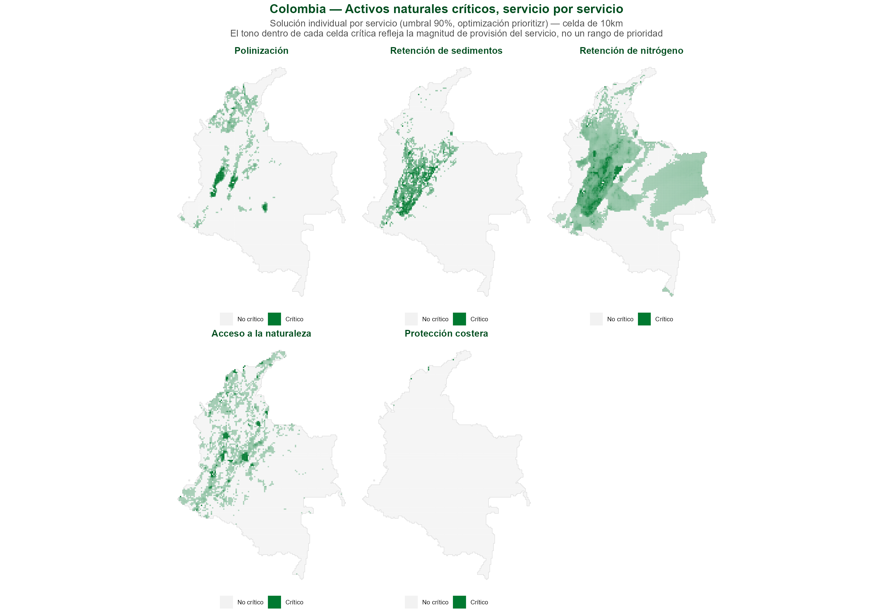
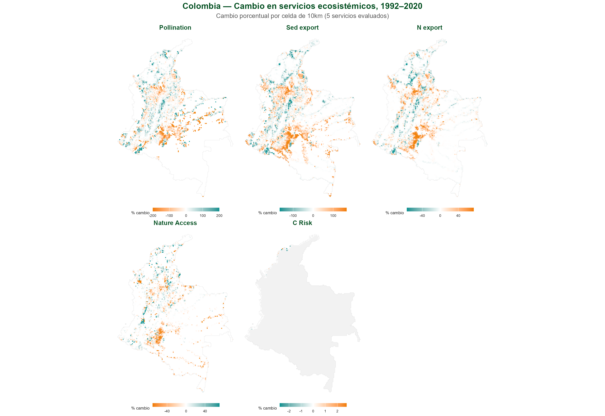

## La Alianza Natural Capital y WWF Global Science {.smaller}

- La Alianza Natural Capital nació hace ~20 años en Stanford y reúne a:
    - **WWF, Stanford, University of Minnesota, The Nature Conservancy, la Academia China de Ciencias y el Stockholm Resilience Centre**.
- Ha producido herramientas de código abierto para integrar el valor de la naturaleza en la toma de decisiones — p. ej. **InVEST**, RIOS, OPAL, ROOT y MESH.
- Global Science:
  - **CONVEI** — consorcio WWF/NASA/NOAA/USGS que valora datos de observación de la Tierra para la toma de decisiones, PI **Rebecca Chaplin-Kramer** — Global Biodiversity Lead Scientist.
  - **NatCap TEEMs** (U. of Minnesota) — modelos que integran economía, comercio y servicios ecosistémicos; lidera el proyecto de metodología para estimar el **GEP Global** (Producto Ecosistémico Bruto — un índice modelado sobre el PIB, para el valor de los servicios ecosistémicos).
  - **Conservation Navigator** — datos y análisis curados para apoyar la toma de decisiones de conservación.
- Marco general: **Roadmap 2030**.


::: {.notes}
Transición hacia el siguiente slide (verbal, no en el texto): "el análisis que sigue —hotspots de cambio y activos naturales críticos— es la pieza que mejor conozco y donde más puedo aportar hoy, pero no es la única puerta de entrada a este ecosistema de trabajo."

Apertura (~30-40 seg): esta diapositiva es nueva (agregada 2026-08-18) — el objetivo es que Sandra vea que WWF Ciencia Global es más que "el análisis de hotspots," sin restarle tiempo al contenido central que sigue. No leer la lista completa en voz alta; usarla como apoyo visual mientras se habla del panorama general.

Todo lo anterior está verificado contra fuentes oficiales de WWF (2026-08-18), no inventado:
- Alianza Natural Capital y sus 6 instituciones socias: worldwildlife.org/our-work/science/the-natural-capital-alliance
- CONVEI (Collaborative Network for Valuing Earth Information), liderado por WWF con NASA/NOAA/USGS, dirigido por Becky: worldwildlife.org/our-work/science/convei. Becky es Global Biodiversity Lead Scientist de WWF (título verificado en worldwildlife.org/about/profiles/becky-chaplin-kramer); autoría del paper base (2019, Science) es contexto ya conocido del proyecto, no una búsqueda nueva. Deliberadamente NO se menciona aquí que es mi supervisora directa — el título slide ya la lista como coautora, y su trayectoria/credenciales aportan más que la relación jerárquica.
- NatCap TEEMs/Dept. de Economía Aplicada de UMN: GTAP-InVEST (modelo económico de comercio global + cambio de uso del suelo + InVEST): natcapteems.umn.edu
- Conservation Navigator (navigator.panda.org): worldwildlife.org/initiatives/creating-powerful-conservation-tools
- Roadmap 2030

Punto de conexión con Colombia: Roadmap 2030 y la hoja de ruta de conservación liderada localmente de WWF Colombia (ya mencionada en el slide de la oferta al final) son la misma lógica a dos escalas — vale la pena nombrarlo explícitamente si la conversación lo permite, refuerza que esto no es un pitch aislado sino parte de una estrategia coherente.

Sobre el GEP (agregado 2026-08-19, verificado vía búsqueda web contra naturalcapitalalliance.stanford.edu, seea.un.org y PNAS — no vía natcapteems.umn.edu, que devolvió error 403 al intentar acceder directamente):
- El nombre correcto es **GEP = Gross Ecosystem Product / Producto Ecosistémico Bruto** (no "Global Ecological Product" — corregir si se menciona mal en la conversación).
- Es un índice modelado sobre el PIB: agrega el valor económico total de los servicios ecosistémicos de un área en una sola métrica monetaria, calculado con modelos InVEST (p. ej. SDR para sedimentos, rendimiento hídrico mensual).
- Desarrollado y piloteado de escala urbana a nacional en China; ya adoptado formalmente por la Comisión de Estadística de la ONU como parte del sistema de contabilidad ecosistémica SEEA-EA (vía el proyecto NCAVES).
- NatCap TEEMs lidera el "Global GEP project" para escalarlo más allá de China — socios: NatCap Stanford, NatCap University of Minnesota, Academia China de Ciencias.

Reflexión propia sobre cómo mi trabajo podría conectar con esto (NO confirmado con el equipo de NatCap TEEMs — es mi propia interpretación, verificar con Becky antes de afirmarlo como hecho establecido si Sandra pregunta): el GEP tal como se calcula hoy es una fotografía puntual (el valor de los servicios en un año/lugar dado). Para saber si el GEP global está subiendo o bajando en el tiempo -o de forma desigual entre grupos de ingreso, como sugiere el ángulo de "green growth" del proyecto- se necesita justamente el tipo de análisis que hace este pipeline: cuantificación de cambio histórico en la magnitud de los servicios (1992-2020) con InVEST a escala global, más la estratificación por equidad/ingreso ya presente en el paper. Es decir, el GEP responde "¿cuánto vale la naturaleza hoy?" y este trabajo podría responder la pregunta complementaria "¿cómo está cambiando ese valor, y para quién?" No presentar esto como una integración ya acordada — es una idea a explorar, no un hecho verificado en reuniones de laboratorio.

Backup si preguntan por RIOS/OPAL/ROOT/MESH (no leer en voz alta, solo si preguntan — no hay tiempo para cubrir las 4 en detalle):
- RIOS (Resource Investment Optimization System) — diseño costo-efectivo de inversiones en servicios de cuencas hidrográficas: dónde invertir para proteger el agua.
- OPAL (Offset Portfolio Analyzer and Locator) — cuantifica impactos de proyectos de desarrollo y ayuda a ubicar/dimensionar compensaciones que devuelvan beneficios a las mismas comunidades afectadas.
- ROOT (Restoration Opportunities Optimization Tool) — optimiza trade-offs entre servicios ecosistémicos para encontrar dónde la inversión en restauración rinde más.
- MESH (Mapping Ecosystem Services to Human well-being) — plataforma para mapear y comparar la provisión de servicios ecosistémicos bajo distintos escenarios de manejo del paisaje.
Fuente: naturalcapitalalliance.stanford.edu/software/invest/natcap-partnership-software-tools

Si preguntan por CONVEI, NatCap TEEMs o Conservation Navigator en detalle: honestamente, el conocimiento de primera mano es limitado más allá de lo verificado aquí — mejor ofrecer conectar con la persona correcta (Becky para CONVEI) que improvisar detalles no confirmados.
:::

## Sobre mi {.smaller}

- **Economista y PhD en Geografía y Estudios Urbanos** (Temple University, 2025), con foco en *land systems science*: un campo que integra monitoreo satelital de cambio de uso y cobertura del suelo (observación de la Tierra, SIG, machine learning) con teorías de rango medio, para explicar no solo qué cambia en el paisaje, sino cómo y para quién.
  - Tesis doctoral: uso y control de la tierra en la formación de una frontera de commodities — expansión del agronegocio en las sabanas orientales de Colombia durante el siglo XXI.
- Formación interdisciplinaria: BSc Economía (Universidad Nacional de Colombia), MSc Economía Agrícola (Humboldt Universität zu Berlin).
- Experiencia en Colombia: Instituto Alexander von Humboldt — gestión territorial de biodiversidad (2012–2016); Federación Nacional de Cafeteros; CENIPALMA.
- Monitoreo de biodiversidad y sensores remotos: NASA Earth Observations, Red de Observación de Biodiversidad de Colombia.
- Actualmente: postdoc en Ciencia Global de WWF/NatCap, trabajando activamente en el artículo científico que sustenta este análisis (hotspots globales de cambio en servicios ecosistémicos, 1992–2020).

::: {.notes}
Nueva diapositiva (agregada 2026-08-27), a partir del CV del usuario (versión 2025, autoreportado — el
usuario mismo advirtió que está desactualizado, revisar antes de enviar si algo cambió desde entonces).
Ubicada aquí — después de la Alianza, antes del enfoque técnico — para que Sandra vea primero el
contexto institucional, luego quién presenta dentro de ese contexto, y después el método.

Objetivo: mostrar que el trabajo no es solo "análisis espacial" sino que está anclado en formación
interdisciplinaria real (economía + ecología política + land systems science) y experiencia previa
directamente relevante para Colombia (Humboldt, cafeteros, CENIPALMA) — no presentar esto como
un CV completo, es una selección curada para esta audiencia.
:::

## Enfoque global, aplicable a múltiples escalas {.smaller}

::: {style="position: absolute; top: 50%; left: 50%; transform: translate(-50%, -50%); width: 123%; height: 102%; display: flex; align-items: center; justify-content: center; overflow: visible; pointer-events: none;"}
{style="width: 100%; height: 100%; object-fit: contain; opacity: 0.5;"}
:::

Analizamos dinámicas de servicios ecosistémicos a nivel mundial, identificando:

  - **Activos críticos** (oportunidad)
  - **Procesos de cambio** (declive/riesgo)

- **Detecta y analiza cambio**: convierte datos biofísicos en una señal clara: qué está cambiando, dónde y con qué severidad.
- **Métricas estandarizada**: hotspots, activos críticos, superposición de riesgo.
- **Se adapta a múltiples unidades espaciales**: país, región, cuenca, bioma.

Todo esto corre sobre **InVEST** (Integrated Valuation of Ecosystem Services and Tradeoffs) — el conjunto de modelos biofísicos de código abierto de la Alianza Natural Capital que traduce datos de suelo, clima y cobertura en servicios ecosistémicos cuantificados.

::: {style="text-align: right; margin-top: 14px;"}
{style="height:100px; width:auto;"}
:::

::: {.notes}
Apertura (~15 seg): mencionar que Becky y Rich respaldan este trabajo aunque no estén presentes — da credibilidad de NatCap sin necesidad de explicarlo más.

Esta diapositiva es deliberadamente amplia — "nuestro equipo hace esto a escala global, y hoy lo traemos a Colombia" — no es una clase de metodología. Sandra ya conoce el apoyo técnico de WWF Colombia a los Lineamientos de Infraestructura Verde Vial (LIVV, política interministerial liderada por Mintransporte, no un documento de WWF); el gancho es que esta capa de evidencia complementa directamente esa agenda.

Frase sobre InVEST agregada (2026-08-27) — el logo aparecía sin explicación, y el salto de "la Alianza Natural Capital" (slide anterior) a este enfoque específico se sentía abrupto sin nombrar la herramienta que lo hace posible. Definición (Integrated Valuation of Ecosystem Services and Tradeoffs) ya verificada en este proyecto, no nueva.

Bullets rediseñados (2026-08-19) para priorizar capacidades sobre detalle técnico — la resolución y el rango temporal son detalle de implementación, no el mensaje central para esta audiencia; disponibles aquí si preguntan:
- Resolución nativa: 300m (modelos InVEST), agregado a una grilla global de 10km para el análisis estadístico.
- Rango temporal: 1992–2020 — cambio histórico ya ocurrido (realizado), no proyecciones a futuro.
- Pipeline reproducible y multi-servicio, desarrollado a escala global y regional.

Sobre la frase de apertura (2026-08-13): confirmado en la página oficial de WWF sobre la Alianza Natural Capital (worldwildlife.org/our-work/science/the-natural-capital-alliance) que WWF es una de las instituciones socias nombradas explícitamente (junto a Stanford —sede—, University of Minnesota, The Nature Conservancy, la Academia China de Ciencias, Natural Capital Insights y el Stockholm Resilience Centre), no solo un colaborador informal. Científicos de WWF ayudaron a desarrollar InVEST y otras herramientas de la alianza (RIOS, OPAL, ROOT, MESH). Lo que NO está confirmado ni debe afirmarse en la reunión: los detalles internos de cómo este puesto postdoctoral específico se estructura formalmente como parte del aporte de WWF a la alianza — eso es una pregunta interna para Becky, no algo público. Si Sandra pregunta por el rol personal dentro de la alianza, responder en términos generales (parte del equipo de Ciencia Global de WWF que aplica las herramientas de NatCap) sin inventar detalles sobre la estructura formal del puesto.
:::

## Activos críticos, servicio por servicio {.smaller}

::: {style="text-align:center;"}
{style="height:648px; width:auto; max-width:1134px;"}
:::

::: {.notes}
Antes del agregado, así se ve el activo crítico de cada servicio por separado — misma metodología (umbral 90%, optimización `prioritizr`), aplicada a un solo servicio a la vez.

Slide nuevo (agregado 2026-08-20), puente hacia la diapositiva de "Oportunidad" que sigue — mismo patrón que el slide de cambio bruto antes de "Dónde": mostrar la textura completa, servicio por servicio, antes del número agregado (2,93×). Fuente: las 5 soluciones individuales de `prioritizr` del propio repositorio de datos del paper (OSF r5xz7, carpeta `solutions`), no un cálculo nuevo de este proyecto — ver `data/external/critical_natural_assets/per_service_solutions/README.md` para el mapeo de códigos de letra a servicio.

Notar la variación real entre servicios: retención de nitrógeno cubre casi todo el país (la más permisiva de las 5), protección costera casi nada (Colombia tiene poca costa relativa a su área total), polinización y retención de sedimentos se concentran en el eje andino. Esto es exactamente lo que un agregado de 12 NCP oculta — el 2,93× de la siguiente diapositiva es un promedio de patrones muy distintos entre sí, no todos los servicios "empujan" igual.

No profundizar demasiado aquí si el tiempo aprieta — el punto es visual/textural, no otro conjunto de cifras para memorizar.
:::

## Oportunidad: activos naturales críticos {.smaller}

::: {.columns}
::: {.column width="55%"}
```{=html}
<div class="stat-row">
  <div class="stat-callout">
    <span class="stat-value">2,93×</span>
    <span class="stat-label">intensidad relativa: % de activos críticos vs. % de tierra elegible global</span>
  </div>
</div>
```
- **Activo natural crítico** = área requerida para sostener el **90%+** de las contribuciones de la naturaleza a las personas (Chaplin-Kramer et al. 2022, *Nature Ecology & Evolution*).

```{=html}
<table class="mini-table">
<tr><th>Servicio</th><th>Qué representa como activo</th></tr>
<tr><td>Polinización</td><td>Hábitat que sostiene polinizadores</td></tr>
<tr><td>Retención de sedimentos</td><td>Hábitat que retiene sedimento antes de erosionarse</td></tr>
<tr><td>Retención de nitrógeno</td><td>Hábitat que retiene nutrientes antes de exportarse</td></tr>
<tr><td>Acceso a la naturaleza</td><td>Hábitat natural accesible para la población</td></tr>
<tr><td>Protección costera</td><td>Hábitat que reduce el riesgo costero</td></tr>
</table>
```
:::
::: {.column width="45%"}
{style="max-height:620px; width:auto; max-width:100%;"}
:::
:::

::: {.notes}
Este slide abre con oportunidad antes que riesgo — mismo orden que el deck de IADB Workshop 1. Establece que WWF no solo mapea problemas, también identifica dónde vale la pena invertir en protección/restauración.

Si preguntan por la metodología: optimización a escala nacional sobre 12 NCP locales simultáneamente: valor 20 = la celda sigue siendo necesaria incluso en la solución más restrictiva (5% del área), valor 1 = solo se necesita si el objetivo se expande al 100%. "Crítico" = valor > 2 (el umbral del 90% del paper original).

El 2,93× usa la máscara de tierra propia del ráster de Chaplin-Kramer et al. (no la grilla de 10km de este proyecto) como denominador de "tierra elegible" — metodológicamente separado del 0,87% usado en los hotspots de cambio, aunque el número final es coincidentemente similar. Aclarar si preguntan por qué ambos rondan ~0,87-0,88%.

Explicación completa del paper (verificada 2026-08-19 contra nature.com/articles/s41559-022-01934-5 y el repositorio de datos en OSF, osf.io/r5xz7 — no improvisar más allá de esto si preguntan más detalle):

- **Qué son**: "activos naturales críticos" = los ecosistemas (naturales y semi-naturales) que sostienen el 90% de la magnitud actual total de 14 tipos de contribuciones de la naturaleza a las personas (NCP) — 12 de alcance local (polinización, acceso a la naturaleza, protección costera, retención/exportación de nutrientes y sedimentos, etc.) y 2 de alcance global (almacenamiento de carbono, reciclaje de humedad). **Este proyecto usa específicamente la capa de los 12 NCP locales** (carpeta `local_NCP_all_targets` en los datos), no la versión combinada con las 2 globales.
- **Por qué importan (el hallazgo central del paper)**: los activos críticos para los 12 NCP locales cubren solo el **30% del área terrestre global** (24% de aguas territoriales) — es decir, una fracción relativamente pequeña de tierra sostiene la gran mayoría del valor que la naturaleza aporta directamente a las personas. Al incluir las 2 NCP globales (carbono, humedad), esa cifra sube a 44%. Es un argumento de priorización, no solo de descripción: protege ese 30-44% y proteges la mayor parte del beneficio.
- **Cómo se calculó**: optimización de conservación sistemática con el paquete R `prioritizr`, sobre 14 capas de NCP a ~2km de resolución (compiladas por Rachel Neugarten y Becky Chaplin-Kramer), reproyectadas a una grilla de área equivalente (Eckert IV) a varias resoluciones. La optimización se corrió repetidamente a presupuestos de área crecientes (5% del área hasta 100%), y cada celda recibió un "rango de prioridad" (1-20) según el presupuesto más pequeño en el que esa celda entra en la solución óptima — rango 20 = indispensable incluso en la solución más restringida; rango 1 = solo entra cuando el presupuesto casi no restringe nada.
- **Datos originales**: el ráster agregado que usa este proyecto (todas las NCP combinadas) está en `data/external/critical_natural_assets/`. Las 10 capas individuales "realized" (una por servicio/variante — polinización, protección costera, retención de nitrógeno a 50km y 500km, exportación de sedimentos a 50km y 500km, y acceso a la naturaleza en 4 variantes urbano/rural × 60min/360min) también están disponibles en OSF, no descargadas todavía en este repositorio (ver más abajo).
:::

## Ahora, el cambio en los NCP {.smaller}

::: {style="text-align:center;"}
{style="height:504px; width:auto; max-width:1260px;"}
:::

::: {.notes}
Slide nuevo (agregado 2026-08-20), pareja del slide de Colombia que sigue — mismo pipeline, misma metodología, mostrado primero a escala global y luego con el zoom puesto sobre Colombia. El punto es demostrar "así trabajamos" de forma visual antes de decirlo en palabras: no es un análisis diseñado para Colombia y luego generalizado, es al revés — un pipeline global aplicado a un país específico.

Fuente: mismo cálculo que colombia_change_5panel.png (siguiente slide), sin filtrar a Colombia — 1.372.447 celdas globales tras excluir Antártida/océano abierto/lagos/roca-hielo.

Si preguntan qué es SPC (corregido 2026-08-20, antes decía "cambio bruto" — impreciso, esto NO es una magnitud física sin procesar): "cambio porcentual simétrico" = (T2020 − T1992) / ((|T2020|+|T1992|)/2) × 100. Se usa en vez de un porcentaje simple sobre la línea base porque servicios con línea base cercana a cero producen porcentajes infinitos o inestables con la fórmula tradicional; el SPC está acotado entre -200% y +200%, así que es comparable entre servicios con escalas muy distintas. Es la misma métrica sobre la que se define el hotspot (el 5% más severo por magnitud de SPC).
:::

## Aplicado a Colombia {.smaller}

::: {style="text-align:center;"}
{style="height:620px; width:auto; max-width:1188px;"}
:::

::: {.notes}
Slide nuevo (agregado 2026-08-20), puente entre la definición de "activo crítico" y la de "hotspot de cambio" — antes de mostrar solo el 5% más severo (el siguiente slide), esto muestra la señal completa sin filtrar: cambio porcentual por celda para los 5 servicios evaluados, todo Colombia. Da textura y credibilidad al paso de extracción de hotspots que sigue — no es una caja negra, se puede ver el patrón espacial completo detrás del umbral.

Verde/teal = mejora; naranja = deterioro (la dirección varía por servicio — ver nota de direccionalidad en el siguiente slide). No es necesario explicar cada panel en detalle; el punto es mostrar la textura espacial general antes de pasar al umbral de hotspot.
:::

## Colombia concentra hotspots de cambio {.smaller}

::: {.columns}
::: {.column width="55%"}
```{=html}
<div class="stat-row">
  <div class="stat-callout">
    <span class="stat-value">1,60%</span>
    <span class="stat-label">Polinización — vs. 0,87% esperado</span>
  </div>
  <div class="stat-callout">
    <span class="stat-value">1,32%</span>
    <span class="stat-label">Exportación de sedimentos — vs. 0,87% esperado</span>
  </div>
</div>
```
- **Hotspot de cambio** = celda donde un servicio se deterioró con mayor severidad entre 1992 y 2020 (percentil 5% más severo) — *no* una celda de mayor provisión.
- Concentración más fuerte en **Meta, Caquetá y Antioquia** — casi empatados, muy por encima de cualquier otro departamento.

```{=html}
<table class="mini-table">
<tr><th>Servicio</th><th>Qué mide</th></tr>
<tr><td>Polinización</td><td>Provisión de polinización por hábitat natural</td></tr>
<tr><td>Exportación de sedimentos</td><td>Sedimento exportado desde la cuenca (erosión)</td></tr>
<tr><td>Exportación de nitrógeno</td><td>Nitrógeno exportado desde la cuenca</td></tr>
<tr><td>Acceso a la naturaleza</td><td>Población con acceso cercano a hábitat natural</td></tr>
<tr><td>Riesgo costero</td><td>Nivel de riesgo costero (protección reducida)</td></tr>
</table>
```
:::
::: {.column width="45%"}
{style="max-height:620px; width:auto; max-width:100%;"}
:::
:::

::: {.notes}
Primero que todo, aclarar el término: son hotspots de CAMBIO en la provisión del servicio, no de mayor provisión — ambigüedad real en la literatura de SE, vale la pena decirlo en voz alta una vez al inicio de este slide.

Punto central: esto no es "Colombia es grande, por eso tiene muchos hotspots" — es una sobrerrepresentación real, corregida contra el área global donde cada servicio efectivamente aplica. Mencionar explícitamente que se hizo esta corrección (fue detectada y corregida hoy mismo para el servicio de riesgo costero) — demuestra rigor, no ocultarlo.

Si preguntan por qué solo 2 de los 5 servicios muestran esta sobrerrepresentación: Exportación de nitrógeno es esencialmente proporcional (0,90% vs 0,87%); Acceso a la naturaleza y Riesgo costero están de hecho subrepresentados en Colombia respecto al resto del mundo — ser honesto sobre esto fortalece la credibilidad del hallazgo en los otros dos.

Nota de direccionalidad: para Exportación de sedimentos, Exportación de nitrógeno y Riesgo costero, la dirección perjudicial es un AUMENTO, no una disminución — si alguien dice "sedimentos disminuyó" en la conversación, es lo contrario de lo que muestra el hallazgo.

Corrección 2026-08-20: el texto anterior decía "eje cafetero, Andes centrales y piedemonte de la Orinoquía" — nunca verificado contra los datos reales, y resultó impreciso. Verificado hoy con un spatial join real (centroide de cada celda hotspot contra departamentos de Colombia, `rnaturalearth`): de 1.423 celdas hotspot nacionales, **Meta = 259, Caquetá = 204, Antioquia = 178** — el siguiente departamento (Guaviare) tiene solo 84. El eje cafetero no aparece entre los 15 departamentos con más celdas. Script de verificación no versionado (ejecutado ad-hoc en sesión), repetible con `data/processed/hotspots/pct/nev_name/hotspots_nev_name_Colombia_pct.gpkg` si se necesita reconfirmar.
:::

## Priorización: Donde coinciden valor y cambio {.smaller}

::: {.columns}
::: {.column width="55%"}
```{=html}
<div class="stat-row">
  <div class="stat-callout">
    <span class="stat-value">57,9%</span>
    <span class="stat-label">de los hotspots de cambio de Colombia caen dentro de un activo natural crítico</span>
  </div>
</div>
```
- Activos críticos = lugares de **mayor valor**. Hotspots de cambio = lugares de **cambio más severo**.
- De las **1.423** celdas que son hotspot de cambio en Colombia (12,5% del país), **824** también son un activo crítico.
- Aplica a proyectos viales, desarrollo agrícola, forestal, minero y energético.

:::
::: {.column width="45%"}
{style="max-height:620px; width:auto; max-width:100%;"}
:::
:::

::: {.notes}
Este es el slide central de todo el deck — el que responde "¿y entonces qué hacemos con esto?" Las dos diapositivas anteriores (oportunidad, dónde) preparan el terreno; esta las une. Punto de origen de este slide: la nota del propio deck de IADB Workshop 1 sobre la diapositiva de oportunidades — "el overlap entre 'valioso' y 'cambiando más rápido' es el caso más fuerte para la intervención" — ese punto se había mencionado ahí pero nunca se había calculado. Aquí sí se calculó, para Colombia específicamente.

Números exactos: 5.797 celdas de activo crítico (51,0% de Colombia), 1.423 celdas de hotspot de cambio (12,5%), 824 celdas son ambas cosas (7,2% de Colombia). La lectura útil es "de los hotspots, ¿cuántos son también críticos?" (57,9%) no al revés (14,2%) — porque los activos críticos cubren mucha más área por definición (umbral del 90%), así que casi cualquier cosa tiene alguna probabilidad de caer ahí; lo que realmente distingue es que más de la mitad de los hotspots — el conjunto más raro y más severo — caen específicamente en zonas de alto valor.

Metodología si preguntan: se usó la misma regla de mayoría (≥50% del área de la celda) ya usada para las máscaras de beneficiarios en el reporte interno de Becky — no una regla nueva inventada para este slide.

Si preguntan si tiene sentido metodológico cruzar activo crítico con hotspot de cambio (agregado 2026-08-20, verificado contra el texto del paper — Chaplin-Kramer et al. 2022): sí, es la misma lógica clásica de "valor × amenaza" usada en priorización de conservación desde los hotspots de biodiversidad de Myers (endemismo-valor ∩ pérdida de hábitat-amenaza) — no es una combinación arbitraria. Un matiz honesto si insisten: el activo crítico YA incorpora beneficiarios (población aguas abajo acumulada en la celda de retención para sedimento/nitrógeno, población en 1hr de viaje para acceso a la naturaleza, radio de vuelo de polinizadores/distancia de protección costera para polinización/protección costera — confirmado en el texto del paper, no es solo magnitud biofísica in situ). El hotspot de cambio de este proyecto NO tiene esa ponderación por beneficiarios — es puramente % de cambio local. El cruce entonces dice "un lugar cuyo valor ya refleja gente real servida también está cambiando rápido" — no literalmente "esos beneficiarios específicos están siendo afectados" (eso es lo que intenta responder por separado el slide "Quién", con su propio cálculo de exposición poblacional, no reconciliado formalmente con la ponderación interna del activo crítico). Punto pendiente de comentar con Becky, no una falla del análisis.

Sobre el sombreado por intensidad (agregado 2026-08-13): el mapa ya no usa un verde/rojo plano para "crítico" — la opacidad de cada celda refleja su rango de prioridad real (escala 1-20 del ráster de Chaplin-Kramer et al.), no solo si cruza el umbral binario (>2). Origen del cambio: al revisar el mapa de oportunidad (slide anterior) se notó que la Orinoquía se veía con tonos claros ahí, pero aparecía como verde sólido en este mapa cruzado — una verificación empírica confirmó que 66,8% de las celdas "críticas" de la Orinoquía apenas superan el umbral (rango <5), frente a 25,1% en el resto de Colombia; solo 5,9% de las celdas críticas de la Orinoquía son fuertemente críticas (rango ≥10), frente a 38,0% en el resto del país. Si preguntan por qué la Orinoquía se ve más pálida que los Andes: esa es exactamente la razón — es una región real pero con una señal de criticidad más marginal, no un error del mapa.
:::

## ¿Dónde se concentra el cambio? {.smaller}

::: {.columns}
::: {.column width="40%"}
```{=html}
<div class="stat-row">
  <div class="stat-callout">
    <span class="stat-value">1,27×</span>
    <span class="stat-label">Bosque húmedo tropical — Exportación de sedimentos</span>
  </div>
  <div class="stat-callout">
    <span class="stat-value">1,13×</span>
    <span class="stat-label">Manglares — Exportación de sedimentos</span>
  </div>
</div>
<div class="stat-row">
  <div class="stat-callout accent">
    <span class="stat-value">1,33×</span>
    <span class="stat-label">Sabanas/Llanos — Polinización</span>
  </div>
</div>
```
- **En Colombia**, ¿qué bioma concentra hotspots de cambio desproporcionadamente?
- **Exportación de sedimentos** se concentra en bosque húmedo tropical y manglares — erosión/sedimentación en cuencas boscosas y zonas costeras.
- **Polinización** concentra en sabanas/Llanos — presión sobre paisajes agrícolas y de pastizal en la Orinoquía.
:::
::: {.column width="60%"}
{style="max-height:820px; width:auto; max-width:100%;"}
:::
:::

::: {.notes}
Este slide muestra que "dónde" no es una sola historia — dos servicios sobrerrepresentados a nivel mundial tienen focos internos distintos dentro de Colombia. Sedimentos es una historia de bosque/costa; polinización es una historia de sabana/frontera agrícola. Relevante para Sandra porque conecta directamente con los Lineamientos de Infraestructura Verde Vial (LIVV): los corredores viales que cruzan la Orinoquía enfrentan un tipo de presión distinto a los que cruzan cuencas andinas boscosas.

Si preguntan por el mapa de biomas de referencia (no incluido en este slide por espacio): está en el reporte completo, `docs/reports/colombia_clec_report.qmd`.
:::

## Quién: los hotspots de cambio afectan a 3 de cada 4 colombianos {.smaller}

::: {.columns}
::: {.column width="55%"}
```{=html}
<div class="stat-row">
  <div class="stat-callout">
    <span class="stat-value">75,8%</span>
    <span class="stat-label">de la población colombiana expuesta a un hotspot de cambio</span>
  </div>
  <div class="stat-callout accent">
    <span class="stat-value">38,1M</span>
    <span class="stat-label">personas expuestas</span>
  </div>
</div>
<div class="stat-row">
  <div class="stat-callout">
    <span class="stat-value">35,5%</span>
    <span class="stat-label">expuesta al nivel más intenso (4-5 servicios simultáneos)</span>
  </div>
  <div class="stat-callout accent">
    <span class="stat-value">17,9M</span>
    <span class="stat-label">personas en ese nivel</span>
  </div>
</div>
```
- El área de influencia de los hotspots de cambio. Buffers estandarizados: **50km río abajo** o **1 hora de tiempo de viaje**.

:::
::: {.column width="45%"}
{style="max-height:620px; width:auto; max-width:100%;"}
:::
:::

::: {.notes}
Este es el puente entre "dónde" y "por qué importa" — no es solo un problema ecológico localizado, es un problema con exposición humana masiva. 38,1 millones es una cifra que aterriza en cualquier audiencia.

Este mapa muestra densidad de población REAL (escala logarítmica) dentro de la zona de alcance — no la zona de alcance en sí. Si preguntan por la zona geográfica (el buffer de 50km/1hr) en lugar de la población: esa versión está en el reporte completo, con ambas capas en pestañas separadas.

Relación de co-ocurrencia, no causal — si preguntan, ser explícito: esto muestra dónde está la gente respecto a los hotspots de cambio, no prueba causalidad entre infraestructura y ese cambio.
:::

## Caso específico: infraestructura vial {.smaller}

```{=html}
<div class="stat-row">
  <div class="stat-callout">
    <span class="stat-value">1,32%</span>
    <span class="stat-label">de Colombia en hotspots de exportación de sedimentos — vs. 0,87% esperado por azar</span>
  </div>
</div>
```
- **Exportación de sedimentos** es uno de los servicios con mayor concentración de hotspots en Colombia — directamente ligada a erosión y escorrentía inducidas por construcción vial y cambios de coberturas.
- **Oportunidad**: aplicar la metodologia para apoyar la evaluación de los impactos de corredores viales propuestos en términos de servicios ecosistémicos.
- Articualción con **LIVV**: una señal de riesgo estandarizada y repetible para la selección de corredores.

::: {.notes}
Este es el slide que convierte el hallazgo técnico en una propuesta de valor para WWF Colombia — reencuadrado 2026-08-20 de "ya existe un vínculo" (observación pasiva) a "podemos evaluar esto antes de construir" (oportunidad activa), a pedido explícito. No hace falta explicar qué son los LIVV ni quién los lidera — Sandra ya lo sabe. El pitch es: esta capa de evidencia puede alimentar la etapa más temprana de selección de corredores, antes de que se involucren los equipos de campo — no reemplaza ese proceso, lo antecede.

Si preguntan por ejemplos concretos: Autopista al Mar 1, corredores de Cundinamarca, Valle del Magdalena — estos ya están listados como casos de estudio en el curso post-CLEC, mencionar solo si la conversación lo amerita, no forzarlo.
:::

## Propuesta {.smaller}

No es solo repetir este análisis para Colombia — es fortalecer un vínculo directo con Global Science y aportar a la capacidad instalada en WWF Colombia:

::: {.columns}
::: {.column width="58%"}
- **Profundizar el corte Colombia**: ej. Llanos/Orinoquía, transición amazónica, páramos  — misma metodología.
- **Sostener reportería continua**: el mismo pipeline alimentando el seguimiento de la hoja de ruta de conservación liderada localmente de WWF Colombia — no depende de una sola persona.
- **Transferir el know-how, no solo el resultado**: pipeline de código abierto, reproducible en un IDE con flujos de trabajo asistidos por IA (agentic) — la meta es que el propio equipo en WWF Colombia pueda operarlo y expandirlo. Repositorio: [github.com/springinnovate/global_NCP](https://github.com/springinnovate/global_NCP)
:::
::: {.column width="42%"}
{style="max-height:340px; width:auto; max-width:100%;"}

::: {style="text-align:center; font-size:0.5em; color:#666; margin-top:-8px;"}
El mismo mapa nacional de la diapositiva "Dónde" — Meta es el departamento con más celdas de cambio del país, y mi propia área de estudio (Piedmont/Altillanura) queda dentro de él.
:::
:::
:::

::: {.notes}
Cierre — esta es la diapositiva del "ask." Reencuadrada 2026-08-27 (a pedido explícito, la versión anterior era demasiado vaga — "Colombia existe solo en el agregado LAC" no comunicaba nada por sí sola): ahora los tres ejes de la propuesta están en el slide mismo (profundizar el corte Colombia, sostener reportería institucional, transferir el know-how), y las notas abajo son solo el detalle para desarrollar en voz alta, no la sustancia del ask. No sobre-especificar el cronograma; dejar que Sandra defina el ritmo de la conversación.

Sobre el tercer punto (transferencia de know-how) — este es el diferenciador real frente a "otro consultor con un mapa": no es solo que yo pueda producir este análisis, es que el pipeline completo es reproducible por otra persona — código abierto, corre en un IDE, con flujos de trabajo asistidos por agentes de IA (no una caja negra ni un modelo propietario). El repositorio enlazado en el slide es público (`springinnovate/global_NCP`, verificado público 2026-08-27). Si preguntan qué significa "agentic" en la práctica: no es solo autocompletar código, es un flujo donde el propio equipo puede pedirle a un asistente que arme subsets de datos, corra validaciones, o redacte reportería, sin depender de que yo esté disponible.

El punto de la investigación doctoral propia en la Orinoquía es lo que diferencia además la oferta personal: es una combinación poco común de modelación biofísica global y experiencia directa con cambio de cobertura en la frontera agrícola de la región.

La oferta institucional (reportería continua — beneficiarios, superposición con activos naturales críticos, servicios en declive, enfocada en la huella de la hoja de ruta de conservación liderada localmente) viene directamente de la reunión interna con Becky: no depende de una sola persona, y es precisamente lo que la transferencia de know-how hace sostenible sin mí.

Si preguntan por más detalle de esta investigación: doctorado en Geografía (Temple University, defendido en 2025), clasificación de cobertura del suelo con random forest, trayectorias de cambio multitemporal, y evaluación de precisión estilo Olofsson, enfocado en la dinámica de expansión agrícola (palma, ganadería) en el **Piedmont/Altillanura** — precisión real, no toda la Orinoquía: excluye deliberadamente las sabanas inundables de Casanare/Arauca, una distinción metodológica, no una simplificación. El hallazgo más sólido y ya defendido (Capítulo 2 de la tesis, el de mayor prioridad, meta: listo para someter a publicación a fin de 2026): la accesibilidad y la idoneidad del suelo explican los patrones observados de expansión agrícola. No mencionar cifras nuevas del rebuild del pipeline en curso — solo lo ya defendido en el texto de la tesis es citable hoy (verificado 2026-08-19 contra `LC_orinoquia/docs/orinoquia_dissertation_handoff.md` — no improvisar más allá de esto).

**Estadístico "23%" retirado del slide (2026-08-27)**: el usuario, al revisar el mapa visualmente, notó que los hotspots parecen concentrarse más hacia Caquetá y el sur del Meta que hacia Piedmont/Altillanura propiamente dicho — dudando de la cifra pese a la cadena de verificación de abajo (2026-08-20). No hubo tiempo en sesión para re-verificar contra el polígono real, así que se retiró del slide en vez de dejarlo sin resolver. **No reintroducir esta cifra sin antes re-verificar** contra `LC_orinoquia/vectors/msk_pm_crs.geojson` y confirmar visualmente que las celdas atribuidas al polígono de estudio no son en realidad del clúster sur/Caquetá descrito en la nota de clustering más abajo.

Cadena de verificación previa del estadístico del área de estudio (corregido dos veces 2026-08-20, cadena completa documentada aquí porque es fácil repetir el mismo error — pero ver la nota de arriba, la cifra final de esta cadena es la que ahora está en duda): (1) la versión original decía "2 métodos, 1 geografía," afirmando que el hotspot map y la tesis señalaban "la misma geografía" de forma limpia e independiente — nunca verificado. (2) Primera corrección: spatial join contra departamentos de Colombia mostró que Meta SÍ es el departamento #1 en celdas hotspot nacional (259 de 1.423 = 18%) — pero el usuario correctamente señaló que Meta es un departamento grande (873 celdas totales en la grilla) y que esto podría ser solo un artefacto de tamaño, no concentración real. (3) Segunda corrección, la que quedó: se probaron dos cosas más. Primero, la tasa normalizada por tamaño (hotspots ÷ celdas totales del departamento) — Meta sigue liderando (29,7%), así que NO es solo artefacto de tamaño. Segundo, y más importante: se cruzaron las celdas hotspot contra el polígono REAL del área de estudio de la tesis (`LC_orinoquia/vectors/msk_pm_crs.geojson`, no un corte por latitud inventado) — de las 259 celdas hotspot "del Meta," solo **26 caen dentro del polígono real de Piedmont/Altillanura** (1,83% del total nacional, no 18%); las otras 233 están en el sur del Meta, cerca de la frontera con Caquetá/Guaviare, fuera del área que la tesis realmente estudia. Dentro del polígono real, la tasa de hotspots es 23% (26 de 113 celdas) vs. 12,5% nacional — un hallazgo real, verificado, y modesto, no la cifra departamental inflada. Si preguntan por qué el mapa nacional se sigue usando como imagen si el hallazgo es tan local: es honesto — el mapa da contexto nacional (dónde está Colombia en el patrón global), el 23% es un hallazgo aparte, más pequeño, dentro de esa imagen. No inflar uno para que combine mejor con el otro.

Nota metodológica para reutilizar esta verificación en el futuro: análisis de clustering (k-means, k=2) sobre las celdas de alta concentración (≥3 de 5 servicios) confirma la observación visual del usuario — hay genuinamente DOS clústeres nacionales dominantes, no tres: uno centrado en (-74,3°, 2,0°) que mezcla el sur del Meta con Caquetá/Guaviare/Putumayo (arco de deforestación amazónico), y otro centrado en (-74,3°, 6,7°) en Antioquia/Santander (Magdalena Medio/nordeste antioqueño). El departamento "Meta" como etiqueta administrativa oculta que la mayoría de sus celdas hotspot pertenecen geográficamente al primer clúster (sur), no a una zona distinta de piedemonte.

Si la conversación se mueve hacia empleo/continuidad: mantener el tono como una propuesta de proyecto conjunto, no una solicitud personal — la propuesta se sostiene por sí misma en términos de valor para WWF Colombia.
:::
