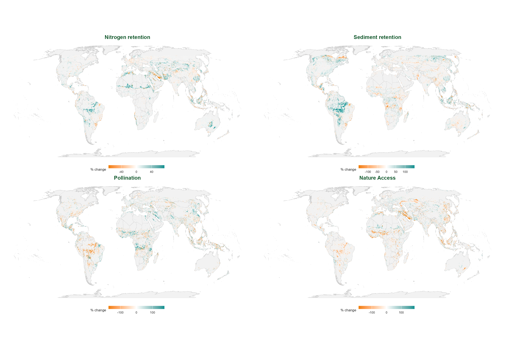

## The Natural Capital Alliance and WWF Global Science {.smaller}

- The Natural Capital Alliance started ~20 years ago at Stanford. It brings together **WWF, Stanford, the University of Minnesota, The Nature Conservancy, the Chinese Academy of Sciences, and the Stockholm Resilience Centre**.
- It has produced open-source tools focused on integrating the value of nature into real-world decisions — e.g. **InVEST**, RIOS, OPAL, ROOT, and MESH.
- Global Science:
  - **CONVEI** — a WWF/NASA/NOAA/USGS consortium valuing Earth observation data in decision-making, PI **Rebecca Chaplin-Kramer** — WWF's Global Biodiversity Lead Scientist.
  - **NatCap TEEMs** (U. of Minnesota) — models integrating economics, trade, and ecosystem services; leads the methodology project to estimate **Global GEP** (Gross Ecosystem Product — an index modeled on GDP, for the value of ecosystem services).
  - **Conservation Navigator** — curated data and analysis to support conservation decisions.
- Overarching framework: **Roadmap 2030**, WWF's strategy centered on locally-led conservation.


::: {.notes}
Transition to the next slide (verbal, not in the text): "the analysis that follows — change hotspots and critical natural assets — is the piece I know best and where I can contribute most today, but it's not the only entry point into this broader body of work."

Opening (~30-40 sec): this slide is new (added 2026-08-18) — the goal is for Sandra to see that WWF Global Science is more than "the hotspot analysis," without taking time away from the core content that follows. Don't read the full list aloud; use it as visual support while speaking to the bigger picture.

Everything above is verified against official WWF sources (2026-08-18), not invented:
- Natural Capital Alliance and its 6 partner institutions: worldwildlife.org/our-work/science/the-natural-capital-alliance
- CONVEI (Collaborative Network for Valuing Earth Information), led by WWF with NASA/NOAA/USGS, directed by Becky: worldwildlife.org/our-work/science/convei. Becky is WWF's Global Biodiversity Lead Scientist (title verified at worldwildlife.org/about/profiles/becky-chaplin-kramer); authorship of the base paper (2019, Science) is already-known project context, not a new lookup. Deliberately NOT mentioning here that she is my direct supervisor — the title slide already lists her as a co-author, and her track record/credentials carry more weight than the reporting relationship.
- NatCap TEEMs/UMN Dept. of Applied Economics: GTAP-InVEST (global trade economic model + land-use change + InVEST): natcapteems.umn.edu
- Conservation Navigator (navigator.panda.org): worldwildlife.org/initiatives/creating-powerful-conservation-tools
- Roadmap 2030

Connection point to Colombia: Roadmap 2030 and WWF Colombia's own locally-led conservation roadmap (already mentioned in the closing "offer" slide) are the same logic at two scales — worth naming explicitly if the conversation allows, it reinforces that this isn't a standalone pitch but part of a coherent strategy.

On GEP (added 2026-08-19, verified via web search against naturalcapitalalliance.stanford.edu, seea.un.org, and PNAS — not via natcapteems.umn.edu directly, which returned a 403 error):
- The correct name is **GEP = Gross Ecosystem Product** (not "Global Ecological Product" — correct it if misstated in conversation).
- It's an index modeled on GDP: aggregates the total economic value of an area's ecosystem services into a single monetary metric, calculated with InVEST models (e.g. SDR for sediment, monthly water yield).
- Developed and piloted from city to national scale in China; already formally adopted by the UN Statistical Commission as part of the SEEA-EA ecosystem accounting system (via the NCAVES project).
- NatCap TEEMs leads the "Global GEP project" to scale it beyond China — partners: NatCap Stanford, NatCap University of Minnesota, Chinese Academy of Sciences.

My own reflection on how my work might connect to this (NOT confirmed with the NatCap TEEMs team — this is my own interpretation, verify with Becky before stating it as an established fact if Sandra asks): GEP as currently calculated is a point-in-time snapshot (the value of services in a given year/place). To know whether global GEP is rising or falling over time — or unevenly across income groups, as the project's "green growth" angle suggests — you need exactly the kind of analysis this pipeline does: quantifying historical change in service magnitude (1992-2020) with InVEST at global scale, plus the equity/income stratification already in the paper. In other words, GEP answers "how much is nature worth today?" and this work could answer the complementary question "how is that value changing, and for whom?" Don't present this as an already-agreed integration — it's an idea worth exploring, not a fact confirmed in lab meetings.

Backup if asked about RIOS/OPAL/ROOT/MESH (don't read aloud, only if asked — no time to cover all 4 in detail):
- RIOS (Resource Investment Optimization System) — cost-effective design of watershed-service investments: where to invest to protect water.
- OPAL (Offset Portfolio Analyzer and Locator) — quantifies development-project impacts and helps locate/size offsets that return benefits to the same affected communities.
- ROOT (Restoration Opportunities Optimization Tool) — optimizes trade-offs among ecosystem services to find where restoration investment pays off most.
- MESH (Mapping Ecosystem Services to Human well-being) — a platform for mapping and comparing ecosystem service provision under different landscape-management scenarios.
Source: naturalcapitalalliance.stanford.edu/software/invest/natcap-partnership-software-tools

If asked about CONVEI, NatCap TEEMs, or Conservation Navigator in detail: honestly, first-hand knowledge is limited beyond what's verified here — better to offer to connect with the right person (Becky for CONVEI) than to improvise unconfirmed details.
:::

## About me {.smaller}

- **Economist and PhD in Geography and Urban Studies** (Temple University, 2025), focused on *land systems science*: a field that integrates satellite-based monitoring of land use and land cover change (Earth observation, GIS, machine learning) with middle-range theories, to explain not only what changes in the landscape, but how and for whom.
  - Doctoral thesis: land use and control in the making of a commodity frontier — agribusiness expansion in Colombia's eastern savannas during the 21st century.
- Interdisciplinary training: BSc Economics (Universidad Nacional de Colombia), MSc Agricultural Economics (Humboldt Universität zu Berlin).
- Experience in Colombia: Alexander von Humboldt Institute — territorial biodiversity management (2012–2016); National Federation of Coffee Growers; CENIPALMA.
- Biodiversity monitoring and remote sensing: NASA Earth Observations, Colombia's Biodiversity Observation Network.
- Currently: postdoc in WWF/NatCap Global Science, actively working on the scientific paper underlying this analysis (global hotspots of change in ecosystem services, 1992–2020).

::: {.notes}
New slide (added 2026-08-27), based on the user's CV (2025 version, self-reported — the user
themselves flagged it as outdated, review before sending if anything has changed since). Placed
here — after the Alliance, before the technical approach — so Sandra sees the institutional context
first, then who is presenting within that context, and then the method.

Goal: show that the work isn't just "spatial analysis" but is grounded in real interdisciplinary
training (economics + political ecology + land systems science) and prior experience directly
relevant to Colombia (Humboldt, coffee growers, CENIPALMA) — not presented as a full CV, this is a
curated selection for this audience.
:::

## A global approach, applicable at multiple scales {.smaller}

::: {style="position: absolute; top: 50%; left: 50%; transform: translate(-50%, -50%); width: 123%; height: 102%; display: flex; align-items: center; justify-content: center; overflow: visible; pointer-events: none;"}
{style="width: 100%; height: 100%; object-fit: contain; opacity: 0.5;"}
:::

We analyze ecosystem service dynamics at a global scale, identifying:

  - **Critical assets** (opportunity)
  - **Processes of change** (decline/risk)

- **Synthesizes and detects change**: turns historical biophysical data into a clear signal of what's changing, where, and how severely.
- **Quantifies with a standardized metric**: hotspots, critical assets, risk overlap — not just descriptive maps.
- **Adapts to any spatial unit**: country, region, watershed, biome — same methodology, no rebuilding from scratch.

All of this runs on **InVEST** (Integrated Valuation of Ecosystem Services and Tradeoffs) — the Natural Capital Alliance's open-source suite of biophysical models that translates soil, climate, and land-cover data into quantified ecosystem services.

::: {style="text-align: right; margin-top: 14px;"}
{style="height:100px; width:auto;"}
:::

::: {.notes}
Opening (~15 sec): mention that Becky and Rich back this work even though they aren't present — lends NatCap credibility without needing to explain further.

This slide is deliberately broad — "our team does this at a global scale, and today we're bringing it to Colombia" — it's not a methodology lecture. Sandra already knows about WWF Colombia's technical support for the Green Road Infrastructure Guidelines (LIVV, an interministerial policy led by Mintransporte, not a WWF document); the hook is that this evidence layer directly complements that agenda.

InVEST sentence added (2026-08-27) — the logo appeared with no explanation, and the jump from "the Natural Capital Alliance" (previous slide) to this specific approach felt abrupt without naming the tool that makes it possible. Definition (Integrated Valuation of Ecosystem Services and Tradeoffs) already verified in this project, not new.

Bullets redesigned (2026-08-19) to lead with capabilities over technical detail — resolution and time range are implementation detail, not the core message for this audience; here if asked:
- Native resolution: 300m (InVEST models), aggregated to a global 10km grid for the statistical analysis.
- Time range: 1992–2020 — historical change that has already happened (realized), not future projections.
- Reproducible, multi-service pipeline, developed at global and regional scale.

On the opening line (2026-08-13): confirmed on WWF's official Natural Capital Alliance page (worldwildlife.org/our-work/science/the-natural-capital-alliance) that WWF is one of the explicitly named partner institutions (alongside Stanford — the host institution —, the University of Minnesota, The Nature Conservancy, the Chinese Academy of Sciences, Natural Capital Insights, and the Stockholm Resilience Centre), not just an informal collaborator. WWF scientists helped develop InVEST and other alliance tools (RIOS, OPAL, ROOT, MESH). What is NOT confirmed and should NOT be asserted in the meeting: the internal details of how this specific postdoc position is formally structured as part of WWF's contribution to the alliance — that's an internal question for Becky, not something public. If Sandra asks about the personal role within the alliance, answer in general terms (part of the WWF Global Science team applying NatCap's tools) without inventing details about the position's formal structure.
:::

## Critical assets, service by service {.smaller}

::: {style="text-align:center;"}
{style="height:648px; width:auto; max-width:1134px;"}
:::

::: {.notes}
Before the aggregate, here's each service's own critical asset shown separately — same methodology (90% threshold, `prioritizr` optimization), applied to one service at a time.

New slide (added 2026-08-20), a bridge into the "Opportunity" slide that follows — same pattern as the raw-change slide before "Where": show the full texture, service by service, before the aggregate number (2.93×). Source: the paper's own 5 individual `prioritizr` solutions from its data repo (OSF r5xz7, `solutions` folder), not a new calculation from this project — see `data/external/critical_natural_assets/per_service_solutions/README.md` for the letter-code-to-service mapping.

Note the real variation across services: nitrogen retention covers nearly the whole country (the most permissive of the 5), coastal protection almost nothing (Colombia has little coastline relative to its total area), pollination and sediment retention concentrate along the Andean spine. This is exactly what a 12-NCP aggregate hides — the next slide's 2.93× is an average across very different patterns, not every service "pushing" equally.

Don't dwell on this too long if time is tight — the point is visual/textural, not another set of figures to memorize.
:::

## Opportunity: critical natural assets {.smaller}

::: {.columns}
::: {.column width="55%"}
```{=html}
<div class="stat-row">
  <div class="stat-callout">
    <span class="stat-value">2.93×</span>
    <span class="stat-label">relative intensity: % of critical assets vs. % of globally eligible land</span>
  </div>
</div>
```
- **Critical natural asset** = area required to sustain **90%+** of nature's contributions to people (Chaplin-Kramer et al. 2022, *Nature Ecology & Evolution*).

```{=html}
<table class="mini-table">
<tr><th>Service</th><th>What it represents as an asset</th></tr>
<tr><td>Pollination</td><td>Habitat that sustains pollinators</td></tr>
<tr><td>Sediment retention</td><td>Habitat that holds sediment before it erodes</td></tr>
<tr><td>Nitrogen retention</td><td>Habitat that holds nutrients before they're exported</td></tr>
<tr><td>Nature access</td><td>Natural habitat accessible to the population</td></tr>
<tr><td>Coastal protection</td><td>Habitat that reduces coastal risk</td></tr>
</table>
```
:::
::: {.column width="45%"}
{style="max-height:620px; width:auto; max-width:100%;"}
:::
:::

::: {.notes}
This slide opens with opportunity before risk — same ordering as the IADB Workshop 1 deck. It establishes that WWF doesn't just map problems, it also identifies where it's worth investing in protection/restoration.

If asked about methodology: national-scale optimization across 12 local NCPs simultaneously: a value of 20 = the cell remains necessary even under the most restrictive solution (5% of area), a value of 1 = only needed if the target expands to 100%. "Critical" = value > 2 (the original paper's 90% threshold).

The 2.93× figure uses Chaplin-Kramer et al.'s own land mask (not this project's 10km grid) as the "eligible land" denominator — methodologically separate from the 0.87% used in the change hotspots, even though the final number happens to be similar. Clarify if asked why both land around ~0.87-0.88%.

Full explanation from the paper (verified 2026-08-19 against nature.com/articles/s41559-022-01934-5 and the paper's OSF data repo, osf.io/r5xz7 — don't improvise beyond this if asked for more detail):

- **What they are**: "critical natural assets" = the ecosystems (natural and semi-natural) that sustain 90% of the current total magnitude of 14 types of nature's contributions to people (NCP) — 12 of local scope (pollination, nature access, coastal protection, nutrient/sediment retention and export, etc.) and 2 of global scope (carbon storage, moisture recycling). **This project specifically uses the 12-local-NCP layer** (folder `local_NCP_all_targets` in the data), not the version combined with the 2 global ones.
- **Why they matter (the paper's central finding)**: critical assets for the 12 local NCPs cover only **30% of global land area** (24% of territorial waters) — i.e., a relatively small fraction of land sustains the vast majority of the value nature delivers directly to people. Including the 2 global NCPs (carbon, moisture) raises that figure to 44%. It's a prioritization argument, not just a descriptive one: protect that 30-44% and you protect most of the benefit.
- **How it was calculated**: systematic conservation optimization with the R package `prioritizr`, over 14 NCP layers at ~2km resolution (compiled by Rachel Neugarten and Becky Chaplin-Kramer), reprojected to an equal-area grid (Eckert IV) at several resolutions. The optimization was run repeatedly at increasing area budgets (5% of area up to 100%), and each cell received a "priority rank" (1-20) based on the smallest budget at which that cell enters the optimal solution — rank 20 = indispensable even under the most restricted solution; rank 1 = only enters when the budget barely restricts anything.
- **Source data**: the aggregate raster this project uses (all NCPs combined) is in `data/external/critical_natural_assets/`. The 10 individual "realized" layers (one per service/variant — pollination, coastal protection, nitrogen retention at 50km and 500km, sediment export at 50km and 500km, and nature access in 4 urban/rural × 60min/360min variants) are also available on OSF, not yet downloaded into this repository at the time this slide was written (see below).
:::

## Now, the change in NCPs {.smaller}

::: {style="text-align:center;"}
{style="height:504px; width:auto; max-width:1260px;"}
:::

::: {.notes}
New slide (added 2026-08-20), pairs with the Colombia slide that follows — same pipeline, same methodology, shown first at global scale and then zoomed onto Colombia. The point is to demonstrate "how we work" visually before saying it in words: this isn't an analysis designed for Colombia and then generalized, it's the reverse — a global pipeline applied to a specific country.

Source: same calculation as colombia_change_5panel.png (next slide), not filtered to Colombia — 1,372,447 global cells after excluding Antarctica/open ocean/lakes/rock & ice.

If asked what SPC is (corrected 2026-08-20 — this slide previously said "raw change," which is inaccurate, this is not an unprocessed physical magnitude): "symmetric percentage change" = (T2020 − T1992) / ((|T2020|+|T1992|)/2) × 100. Used instead of a simple percentage-of-baseline because services with a near-zero baseline produce infinite or unstable percentages under the traditional formula; SPC is bounded between -200% and +200%, so it's comparable across services with very different scales. It's the same metric the hotspot definition itself is built on (the most severe 5% by SPC magnitude).
:::

## The starting point: here's what it looks like for Colombia {.smaller}

That same change, zoomed onto Colombia — per 10km cell, all of Colombia, 1992–2020. Before extracting hotspots (the most severe 5th percentile, next slide), here's the full signal.

::: {style="text-align:center;"}
{style="height:620px; width:auto; max-width:1188px;"}
:::

::: {.notes}
New slide (added 2026-08-20), a bridge between the "critical asset" definition and the "change hotspot" definition — before showing only the most severe 5% (the next slide), this shows the full unfiltered signal: percentage change per cell for the 5 services evaluated, all of Colombia. Gives texture and credibility to the hotspot-extraction step that follows — it's not a black box, you can see the full spatial pattern behind the threshold.

Green/teal = improvement; orange = decline (direction varies by service — see the directionality note on the next slide). No need to explain each panel in detail; the point is to show the overall spatial texture before moving to the hotspot threshold.
:::

## Where: Colombia concentrates change hotspots, not just because of its size {.smaller}

::: {.columns}
::: {.column width="55%"}
```{=html}
<div class="stat-row">
  <div class="stat-callout">
    <span class="stat-value">1.60%</span>
    <span class="stat-label">Pollination — vs. 0.87% expected</span>
  </div>
  <div class="stat-callout">
    <span class="stat-value">1.32%</span>
    <span class="stat-label">Sediment export — vs. 0.87% expected</span>
  </div>
</div>
```
- **Change hotspot** = a cell where a service declined most severely between 1992 and 2020 (the most severe 5th percentile) — *not* a cell of higher provision.
- Strongest concentration in **Meta, Caquetá, and Antioquia** — nearly tied, well above any other department.

```{=html}
<table class="mini-table">
<tr><th>Service</th><th>What it measures</th></tr>
<tr><td>Pollination</td><td>Pollination provided by natural habitat</td></tr>
<tr><td>Sediment export</td><td>Sediment exported from the watershed (erosion)</td></tr>
<tr><td>Nitrogen export</td><td>Nitrogen exported from the watershed</td></tr>
<tr><td>Nature access</td><td>Population with nearby access to natural habitat</td></tr>
<tr><td>Coastal risk</td><td>Level of coastal risk (reduced protection)</td></tr>
</table>
```
:::
::: {.column width="45%"}
{style="max-height:620px; width:auto; max-width:100%;"}
:::
:::

::: {.notes}
First, clarify the term: these are hotspots of CHANGE in service provision, not of higher provision — a real ambiguity in the ES literature, worth saying out loud once at the start of this slide.

Central point: this isn't "Colombia is big, so it has lots of hotspots" — it's real overrepresentation, corrected against the global area where each service actually applies. Explicitly mention that this correction was made (it was caught and fixed for the coastal-risk service this very day) — that demonstrates rigor, not something to hide.

If asked why only 2 of the 5 services show this overrepresentation: Nitrogen export is essentially proportional (0.90% vs. 0.87%); Nature access and Coastal risk are in fact underrepresented in Colombia relative to the rest of the world — being honest about this strengthens the credibility of the finding on the other two.

Directionality note: for Sediment export, Nitrogen export, and Coastal risk, the harmful direction is an INCREASE, not a decrease — if someone says "sediment decreased" in conversation, that's the opposite of what the finding shows.

Correction 2026-08-20: the previous text said "coffee axis, central Andes, and Orinoquía foothills" — never verified against the actual data, and turned out inaccurate. Verified today with a real spatial join (each hotspot cell's centroid against Colombian departments, `rnaturalearth`): of 1,423 national hotspot cells, **Meta = 259, Caquetá = 204, Antioquia = 178** — the next department (Guaviare) has only 84. The coffee axis doesn't appear among the top 15 departments by hotspot count. Verification script not version-controlled (run ad hoc this session), repeatable against `data/processed/hotspots/pct/nev_name/hotspots_nev_name_Colombia_pct.gpkg` if reconfirmation is needed.
:::

## Prioritization: where value and change coincide {.smaller}

::: {.columns}
::: {.column width="55%"}
```{=html}
<div class="stat-row">
  <div class="stat-callout">
    <span class="stat-value">57.9%</span>
    <span class="stat-label">of Colombia's change hotspots fall within a critical natural asset</span>
  </div>
</div>
```
- Critical assets = places of **highest value**. Change hotspots = places of **most severe change**.
- Of the **1,423** cells that are a change hotspot in Colombia (12.5% of the country), **824** are also a critical asset — that's where the 57.9% comes from.
- Applies to road, agricultural, forestry, mining, and energy projects.
:::
::: {.column width="45%"}
{style="max-height:620px; width:auto; max-width:100%;"}
:::
:::

::: {.notes}
This is the central slide of the whole deck — the one that answers "so what do we do with this?" The two previous slides (opportunity, where) set the stage; this one ties them together. Origin of this slide: the IADB Workshop 1 deck's own note on the opportunity slide — "the overlap between 'valuable' and 'changing fastest' is the strongest case for intervention" — that point had been mentioned there but never calculated. Here it was, for Colombia specifically.

Exact numbers: 5,797 critical-asset cells (51.0% of Colombia), 1,423 change-hotspot cells (12.5%), 824 cells are both (7.2% of Colombia). The useful reading is "of the hotspots, how many are also critical?" (57.9%) not the reverse (14.2%) — because critical assets cover far more area by definition (the 90% threshold), so almost anything has some chance of falling there; what actually stands out is that more than half of the hotspots — the rarer, more severe set — fall specifically in high-value zones.

Methodology if asked: used the same majority rule (≥50% of cell area) already used for the beneficiary masks in Becky's internal report — not a new rule invented for this slide.

If asked whether it makes methodological sense to cross critical asset with change hotspot (added 2026-08-20, verified against the paper's own text — Chaplin-Kramer et al. 2022): yes, it's the same classic "value × threat" logic used in conservation prioritization since Myers' biodiversity hotspots (endemism-value ∩ habitat-loss-threat) — not an arbitrary combination. One honest nuance if pressed: the critical asset ALREADY incorporates beneficiaries (downstream population accumulated onto the retaining cell for sediment/nitrogen, population within 1hr travel for nature access, pollinator flight radius/coastal protective distance for pollination/coastal protection — confirmed in the paper's text, not just in-situ biophysical magnitude). This project's change hotspot has NO beneficiary weighting of its own — it's purely local % change. So the overlap says "a place whose value already reflects real people served is also changing fast" — not literally "those specific beneficiaries are being harmed" (that's what the "Who" slide tries to answer separately, with its own population-exposure calculation, not formally reconciled with the critical asset's internal weighting). A point to raise with Becky, not a flaw in the analysis.

On the intensity shading (added 2026-08-13): the map no longer uses a flat green/red for "critical" — each cell's opacity reflects its actual priority rank (the 1-20 scale from the Chaplin-Kramer et al. raster), not just whether it crosses the binary threshold (>2). Origin of the change: while reviewing the opportunity map (previous slide) it was noticed that the Orinoquía appeared in lighter tones there, but showed up as solid green on this crossed map — an empirical check confirmed that 66.8% of the Orinoquía's "critical" cells barely clear the threshold (rank <5), versus 25.1% in the rest of Colombia; only 5.9% of the Orinoquía's critical cells are strongly critical (rank ≥10), versus 38.0% in the rest of the country. If asked why the Orinoquía looks paler than the Andes: that's exactly the reason — it's a real region but with a more marginal criticality signal, not a map error.
:::

## Where is change concentrated? {.smaller}

::: {.columns}
::: {.column width="40%"}
```{=html}
<div class="stat-row">
  <div class="stat-callout">
    <span class="stat-value">1.27×</span>
    <span class="stat-label">Tropical moist forest — Sediment export</span>
  </div>
  <div class="stat-callout">
    <span class="stat-value">1.13×</span>
    <span class="stat-label">Mangroves — Sediment export</span>
  </div>
</div>
<div class="stat-row">
  <div class="stat-callout accent">
    <span class="stat-value">1.33×</span>
    <span class="stat-label">Savannas/Llanos — Pollination</span>
  </div>
</div>
```
- A different question from the previous slide: **within** Colombia, which biome disproportionately concentrates its own change hotspots?
- **Sediment export** concentrates in tropical moist forest and mangroves — erosion/sedimentation in forested watersheds and coastal zones.
- **Pollination** concentrates in savannas/Llanos, not moist forest (proportional) — pressure on agricultural and grassland landscapes at the Orinoquía frontier.
:::
::: {.column width="60%"}
{style="max-height:820px; width:auto; max-width:100%;"}
:::
:::

::: {.notes}
This slide shows that "where" isn't a single story — two globally-overrepresented services have distinct internal foci within Colombia. Sediment is a forest/coast story; pollination is a savanna/agricultural-frontier story. Relevant for Sandra because it connects directly to the Green Road Infrastructure Guidelines (LIVV): road corridors crossing the Orinoquía face a different kind of pressure than those crossing forested Andean watersheds.

If asked about the reference biome map (not included on this slide for space): it's in the full report, `docs/reports/colombia_clec_report.qmd`.
:::

## Who: change hotspots affect 3 out of every 4 Colombians {.smaller}

::: {.columns}
::: {.column width="55%"}
```{=html}
<div class="stat-row">
  <div class="stat-callout">
    <span class="stat-value">75.8%</span>
    <span class="stat-label">of Colombia's population exposed to a change hotspot</span>
  </div>
  <div class="stat-callout accent">
    <span class="stat-value">38.1M</span>
    <span class="stat-label">people exposed</span>
  </div>
</div>
<div class="stat-row">
  <div class="stat-callout">
    <span class="stat-value">35.5%</span>
    <span class="stat-label">exposed to the strictest level (4-5 services simultaneously)</span>
  </div>
  <div class="stat-callout accent">
    <span class="stat-value">17.9M</span>
    <span class="stat-label">people at that level</span>
  </div>
</div>
```
- The reach zone of change hotspots — standardized buffers of **50km downstream** or **1 hour travel time** — covers that share of Colombia's population.
- The same reach parameters used throughout the global analysis — no special adjustments for Colombia.
:::
::: {.column width="45%"}
{style="max-height:620px; width:auto; max-width:100%;"}
:::
:::

::: {.notes}
This is the bridge between "where" and "why it matters" — not just a localized ecological problem, but one with massive human exposure. 38.1 million is a number that lands with any audience.

This map shows REAL population density (log scale) within the reach zone — not the reach zone itself. If asked about the geographic zone (the 50km/1hr buffer) rather than population: that version is in the full report, with both layers on separate tabs.

Co-occurrence relationship, not causal — if asked, be explicit: this shows where people are relative to change hotspots, it does not prove causality between infrastructure and that change.
:::

## A concrete opportunity: road infrastructure {.smaller}

```{=html}
<div class="stat-row">
  <div class="stat-callout">
    <span class="stat-value">1.32%</span>
    <span class="stat-label">of Colombia in sediment-export change hotspots — vs. 0.87% expected by chance</span>
  </div>
</div>
```
- **Sediment export** is one of the two services with the highest concentration of change hotspots in Colombia — directly tied to erosion and runoff induced by road construction.
- **The opportunity**: use this same layer to assess, before construction, the erosion/sedimentation risk of proposed road corridors — not just observe the pattern after the fact.
- Fits into the earliest stage of the **LIVV**: a standardized, repeatable risk signal for corridor selection.

::: {.notes}
This is the slide that turns the technical finding into a value proposition for WWF Colombia — reframed 2026-08-20 from "there's already a link" (passive observation) to "we can assess this before construction" (active opportunity), per explicit request. No need to explain what the LIVV is or who leads it — Sandra already knows. The pitch: this evidence layer can feed the earliest stage of corridor selection, before field teams get involved — it doesn't replace that process, it precedes it.

If asked for concrete examples: Autopista al Mar 1, Cundinamarca corridors, the Magdalena Valley — these are already listed as case studies in the post-CLEC course, mention only if the conversation warrants it, don't force it.
:::

## The offer {.smaller}

It's not just about repeating this analysis for Colombia — it's about strengthening a direct link with Global Science and contributing to installed capacity within WWF Colombia:

::: {.columns}
::: {.column width="58%"}
- **Deepen the Colombia cut**: e.g. the Llanos/Orinoquía, the Amazon transition zone, the páramos — same methodology.
- **Sustain ongoing reporting**: the same pipeline feeding WWF Colombia's tracking of its own locally-led conservation roadmap — doesn't depend on one person.
- **Transfer the know-how, not just the result**: an open-source pipeline, reproducible in an IDE with AI-assisted (agentic) workflows — the goal is for WWF Colombia's own team to be able to run and expand it. Repository: [github.com/springinnovate/global_NCP](https://github.com/springinnovate/global_NCP)
:::
::: {.column width="42%"}
{style="max-height:340px; width:auto; max-width:100%;"}

::: {style="text-align:center; font-size:0.5em; color:#666; margin-top:-8px;"}
The same national map from the "Where" slide — Meta is the department with the most change cells in the country, and my own study area (Piedmont/Altillanura) sits inside it.
:::
:::
:::

::: {.notes}
Closing — this is the "ask" slide. Reframed 2026-08-27 (per explicit request, the previous version was too vague — "Colombia exists only within the LAC aggregate" communicated nothing on its own): the proposal's three pillars are now on the slide itself (deepen the Colombia cut, sustain institutional reporting, transfer the know-how), and the notes below are just detail to develop out loud, not the substance of the ask. Don't over-specify the timeline; let Sandra set the pace of the conversation.

On the third point (know-how transfer) — this is the real differentiator from "another consultant with a map": it's not just that I can produce this analysis, it's that the full pipeline is reproducible by someone else — open source, runs in an IDE, with AI-agent-assisted workflows (not a black box or a proprietary model). The repository linked on the slide is public (`springinnovate/global_NCP`, confirmed public 2026-08-27). If asked what "agentic" means in practice: it's not just code autocomplete, it's a workflow where the team itself can ask an assistant to build data subsets, run validations, or draft reporting, without depending on my availability.

The point about my own doctoral research in the Orinoquía is what further differentiates the personal offer: it's an uncommon combination of global biophysical modeling and direct experience with land-cover change on the region's agricultural frontier.

The institutional offer (ongoing reporting — beneficiaries, overlap with critical natural assets, services in decline, focused on the footprint of the locally-led conservation roadmap) comes directly from the internal meeting with Becky: it doesn't depend on one person, and that's precisely what the know-how transfer makes sustainable without me.

If asked for more detail on this research: PhD in Geography (Temple University, defended 2025), random-forest land-cover classification, multi-temporal change trajectories, and Olofsson-style accuracy assessment, focused on agricultural expansion dynamics (oil palm, cattle ranching) in the **Piedmont/Altillanura** — a real precision, not all of the Orinoquía: it deliberately excludes Casanare/Arauca's flooded savannas, a methodological distinction, not a simplification. The strongest, already-defended finding (dissertation Chapter 2, top priority, target: submission-ready by end of 2026): accessibility and land suitability explain the observed agricultural expansion patterns. Don't cite new figures from the ongoing pipeline rebuild — only what's already defended in the dissertation text is citable today (verified 2026-08-19 against `LC_orinoquia/docs/orinoquia_dissertation_handoff.md` — don't improvise beyond this).

**"23%" statistic removed from the slide (2026-08-27)**: reviewing the map visually, the user noticed that the hotspots appear to concentrate more toward Caquetá and southern Meta than toward Piedmont/Altillanura proper — casting doubt on the figure despite the verification chain below (2026-08-20). There wasn't time in-session to re-verify against the real polygon, so it was pulled from the slide rather than left unresolved. **Don't reintroduce this figure without re-verifying** against `LC_orinoquia/vectors/msk_pm_crs.geojson` and visually confirming that the cells attributed to the study-area polygon aren't actually from the southern/Caquetá cluster described in the clustering note below.

Previous verification chain for the study-area statistic (corrected twice on 2026-08-20 — full chain documented here since this is an easy mistake to repeat, but see the note above: the final figure from this chain is the one now in doubt): (1) the original said "2 methods, 1 geography," claiming the hotspot map and the thesis pointed to "the same geography" cleanly and independently — never verified. (2) First correction: a spatial join against Colombian departments showed Meta IS the #1 department nationally by hotspot count (259 of 1,423 = 18%) — but the user correctly flagged that Meta is a large department (873 total grid cells), so this could just be a size artifact rather than real concentration. (3) Second correction, the one that stuck: two more checks were run. First, the size-normalized rate (hotspots ÷ total department cells) — Meta still leads (29.7%), so it's NOT just a size artifact. Second, and more important: hotspot cells were checked against the thesis's ACTUAL study-area polygon (`LC_orinoquia/vectors/msk_pm_crs.geojson`, not an invented latitude cutoff) — of Meta's 259 hotspot cells, only **26 fall inside the real Piedmont/Altillanura polygon** (1.83% of the national total, not 18%); the other 233 are in southern Meta, near the Caquetá/Guaviare border, outside the area the thesis actually studies. Within the real polygon, the hotspot rate is 23% (26 of 113 cells) vs. 12.5% nationally — a real, verified, modest finding, not the inflated department-wide figure. If asked why the national map is still used as the image when the finding is this local: that's the honest answer — the map gives national context (where Colombia sits in the global pattern), the 23% is a separate, smaller finding inside that image. Don't inflate either one to make them match better.

Methodological note for reusing this check later: k-means clustering (k=2) on the high-concentration cells (≥3 of 5 services) confirms the user's own visual read — there are genuinely TWO dominant national clusters, not three: one centered around (-74.3°, 2.0°) blending southern Meta with Caquetá/Guaviare/Putumayo (the Amazon deforestation arc), and another centered around (-74.3°, 6.7°) in Antioquia/Santander (Magdalena Medio/northeast Antioquia). "Meta" as an administrative label obscures that most of its hotspot cells geographically belong to the first (southern) cluster, not a distinct foothills zone.

If the conversation moves toward employment/continuity: keep the tone as a joint-project proposal, not a personal request — the proposal stands on its own in terms of value for WWF Colombia.
:::
