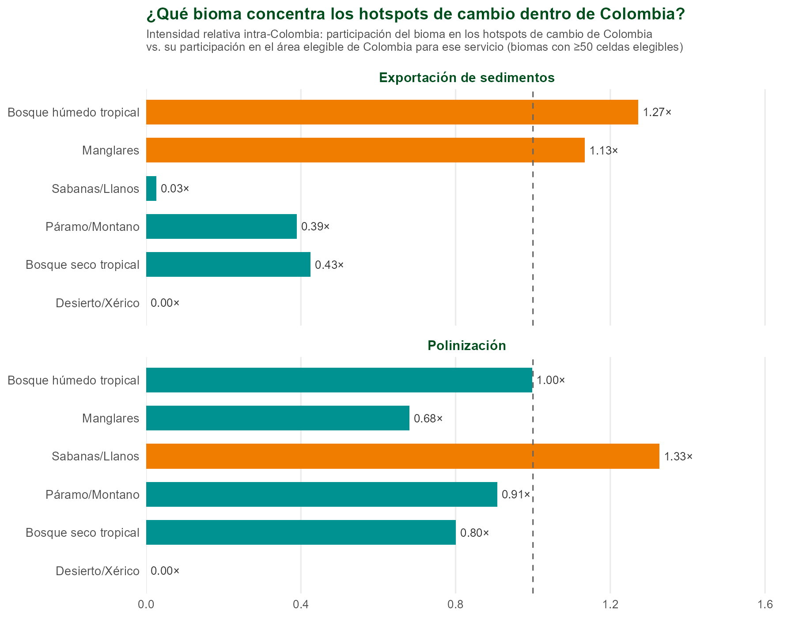
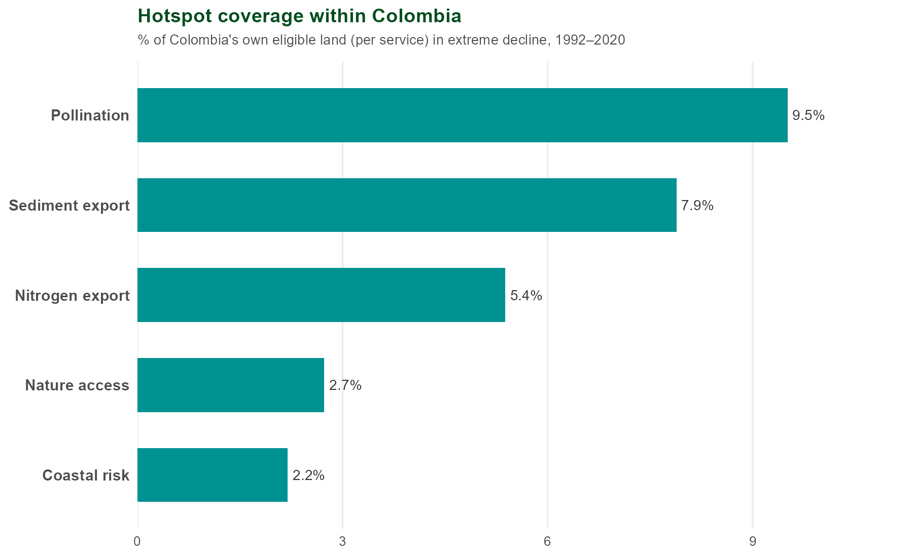

WWF — Ciencia Global · Análisis de Ecosistemas y Servicios (NCP)

  Preparado por Jerónimo Rodríguez Escobar
  Global Science, WWF
  

## Hallazgos clave

::: {.findings}
::: {.finding}
**Oportunidad.** Los activos naturales críticos de Colombia (el área requerida para sostener el 90%+ de las contribuciones de la naturaleza a las personas) están ampliamente distribuidos en los Andes, la Amazonía y las costas — un patrón mucho más extendido que el de los hotspots de cambio, que son puntuales por definición. Ambas capas juntas —dónde vale la pena proteger, dónde el cambio es más severo— son la base de la priorización.
:::
::: {.finding}
**Dónde.** Colombia concentra una proporción desproporcionada de los **hotspots globales de cambio en la provisión de servicios ecosistémicos** — celdas donde un servicio se deterioró con mayor severidad entre 1992 y 2020, *no* celdas de mayor provisión — particularmente en **Polinización (1,60%)** y **Exportación de sedimentos (1,32%)**, frente a una participación esperada de apenas 0,87% en ambos casos. Concentración real, no un artefacto del área del país.
:::
::: {.finding}
**Quién.** El área de influencia combinada de estos hotspots de cambio (50km río abajo o 1 hora de tiempo de viaje) alcanza al **75,8% de la población colombiana — 38,1 millones de personas**. El nivel más estricto (4 o más de los 5 servicios con cambio extremo simultáneo) alcanza al 35,5% (17,9 millones).
:::
::: {.finding}
**Por qué importa para infraestructura vial.** La exportación de sedimentos —directamente relacionada con erosión y escorrentía inducidas por construcción vial— es uno de los dos servicios con mayor concentración de hotspots de cambio en Colombia, y coincide con la lógica de las guías de Infraestructura Vial Alineada con la Biodiversidad (GRI) de WWF Colombia: entender el paisaje y la conectividad ecológica *antes* de decidir un trazado.
:::
:::

## El enfoque

> Identificar dónde la pérdida de servicios ecosistémicos (1992–2020) se concentra de forma desproporcionada, quién queda expuesto a esa pérdida, y por qué esa concentración es relevante para la planificación de infraestructura vial en Colombia.

| | |
|---|---|
| **Servicios evaluados** | 5 servicios ecosistémicos con InVEST a 300m de resolución, agregados a una grilla global de 10km: Polinización, Exportación de sedimentos, Exportación de nitrógeno, Acceso a la naturaleza, Riesgo costero. |
| **Definición de hotspot** | Celda en el percentil 5% de **cambio porcentual más severo en la provisión de un servicio**, respecto a su propia línea base 1992 — un hotspot de *cambio*, no de mayor provisión. La dirección que cuenta como perjudicial depende del servicio: para Exportación de sedimentos, Exportación de nitrógeno y Riesgo costero ("indicadores de daño"), un *aumento* es la dirección dañina; para Polinización y Acceso a la naturaleza, es una *disminución*. |
| **Intensidad relativa** | Comparación entre la participación de Colombia en los hotspots globales de cambio de un servicio y su participación en el área terrestre global *elegible* para ese mismo servicio — no una comparación con su tamaño territorial bruto (ver nota metodológica más abajo). |
| **Alcance de beneficiarios** | Una celda de 10km cuenta como "alcanzada" si está dentro de 50km río abajo (red de drenaje) o 1 hora de tiempo de viaje (red vial) de un hotspot de cambio — cualquiera de los dos criterios, no ambos a la vez. |

: {.terms tbl-colwidths="[25,75]"}

::: {.validation-note}
**Nota metodológica — por qué "% de hotspots vs. % de tierra elegible" y no un multiplicador simple.** Algunos servicios (como riesgo costero) solo tienen datos válidos en una franja costera angosta, no en todo el territorio. Comparar la participación de Colombia en los hotspots de ese servicio contra su participación en el área terrestre *total* del país sobrevaloraría la expectativa (Colombia es mayoritariamente interior: Amazonía, Andes, Llanos). Por eso cada barra de "tierra elegible" en los gráficos de abajo refleja solo el área donde ese servicio específico tiene datos, no el territorio completo del país.
:::

## Oportunidad: activos naturales críticos

::: {.map-card}

:::

Esta capa identifica dónde vale la pena **proteger o restaurar** — los Andes, la Amazonía y franjas costeras concentran la mayor prioridad. Es la contraparte de "oportunidad" a la capa de "riesgo" que sigue: juntas, muestran tanto lo que hay que conservar como dónde el cambio ya está ocurriendo con mayor severidad.

## Dónde: concentración de hotspots de cambio

::: {.map-card}

:::

::: {.map-card}

:::

## Profundizando: ¿qué bioma concentra el cambio dentro de Colombia?

Las secciones anteriores comparan a Colombia contra el resto del mundo. Esta pregunta es distinta:
**dentro de Colombia**, ¿qué bioma concentra desproporcionadamente los hotspots de cambio del
propio país?

::: {.map-card}

:::

::: {.map-card}

:::

Los dos servicios con sobrerrepresentación a nivel mundial no comparten el mismo patrón dentro de
Colombia. **Exportación de sedimentos** concentra su cambio en el **bosque húmedo tropical**
(1,27×) y, en menor medida, los **manglares** (1,13×) — coherente con procesos de erosión y
sedimentación en cuencas boscosas y zonas costeras. **Polinización**, en cambio, muestra su mayor
concentración en **sabanas/Llanos** (1,33×), no en el bosque húmedo tropical (que es
esencialmente proporcional, 1,00×) — un patrón distinto, consistente con presión sobre paisajes
agrícolas y de pastizal en la frontera de la Orinoquía, no solo sobre bosque. Ambos hallazgos
usan la misma corrección metodológica que el resto del reporte: el denominador es el área
elegible de cada servicio dentro de Colombia, no el área total del bioma.

## Análisis estadístico

::: {.map-card}

:::

Polinización y Exportación de sedimentos son los dos casos claros de sobrerrepresentación. Exportación de nitrógeno es esencialmente proporcional (0,90% vs. 0,87%). Acceso a la naturaleza y Riesgo costero están, de hecho, *subrepresentados* en Colombia respecto al resto del mundo.

::: {.map-card}

:::

## Quién: alcance de beneficiarios

::: {.map-card}

:::

| Categoría | % de población alcanzada | Personas |
|---|---|---|
| Categoría cruzada combinada | 75,8% | 38,1 millones |
| Nivel 4+ (4 o más de 5 servicios) | 35,5% | 17,9 millones |

: {.results}

Los parámetros de alcance (50km río abajo por red de drenaje, 1 hora de tiempo de viaje por red vial) son los mismos usados de forma estandarizada en todo el análisis global — no fueron ajustados especialmente para Colombia.

## La oferta

::: {.ask-card}
Colombia hoy existe únicamente dentro del agregado regional de América Latina y el Caribe — no hay todavía un corte nacional dedicado del pipeline. **La oferta concreta**: con el tiempo adecuado, es posible producir un corte Colombia-nacional de hotspots de cambio en servicios ecosistémicos y activos naturales críticos —Llanos/Orinoquía, zona de transición amazónica, páramos que abastecen a Bogotá— con la misma metodología estandarizada ya mostrada aquí, y leído a través de una perspectiva de dinámicas de frontera agrícola con base en investigación de campo propia en la Orinoquía colombiana.
:::

## Alcance y advertencias

| | |
|---|---|
| **Relación de co-ocurrencia, no causal** | Este análisis muestra *dónde* se concentran los hotspots de cambio en la provisión de servicios ecosistémicos y *quién* queda dentro del área de alcance — no establece una relación de causalidad entre infraestructura vial y esa pérdida. |
| **Riesgo costero** | Servicio válido únicamente en una franja costera angosta (182 celdas en Colombia, de 41.635 celdas costeras válidas a nivel global) — su intensidad relativa (0,24×) y baja cobertura reflejan esa geografía restringida, no un error de cálculo. |
| **Categorías de beneficiarios** | Se muestran aquí la categoría cruzada combinada y el nivel 4+, las mismas 3 categorías usadas en el reporte interno de disproporcionalidad socioeconómica (HDI/Gini/PIB) — no las 8 categorías posibles. |

: {.terms tbl-colwidths="[25,75]"}

Datos: <code>data/processed/tables/regional_subsets/nev_name/hotspot_area_stats_Colombia.csv</code>,
<code>data/processed/tables/colombia_beneficiary_population.csv</code>,
<code>data/processed/tables/colombia_biome_area_stats.csv</code> ·
Activos naturales críticos: Chaplin-Kramer et al. (2022), <i>Nature Ecology & Evolution</i>,
<a href="https://doi.org/10.1038/s41559-022-01934-5">doi.org/10.1038/s41559-022-01934-5</a> ·
Mapas: <code>outputs/plots/colombia_report/</code> ·
Metodología completa: <code>docs/methodology.md</code>

