<div class="eyebrow">WWF — Global Science</div>
<div class="meta">
  <span>Prepared by Jerónimo Rodríguez Escobar</span>
  <span>Global Science, WWF</span>
  <span></span>
</div>

This analysis identifies, for Colombia, which areas concentrate the greatest value for nature's
contributions to people (critical natural assets), where the most severe change (1992–2020) in
the provision of five ecosystem services concentrates, and where the two coincide — the most
useful signal for prioritizing land-use planning decisions.

| | |
|---|---|
| **Critical natural assets** | Land area required to sustain 90%+ of nature's contributions to people (Chaplin-Kramer et al. 2022) |
| **Services evaluated** | Pollination, Sediment export, Nitrogen export, Nature access, Coastal risk |

: {.terms tbl-colwidths="[25,75]"}

Key findings follow; the full methodology (how a change hotspot is defined, and why) comes after.

## Key findings

::: {.findings}
::: {.finding}
**Priority.** 57.9% of Colombia's ecosystem-service change hotspots coincide with a critical natural asset — places that simultaneously provide the greatest contributions of nature to people *and* where that change is most severe. This overlap is a direct signal for prioritizing where to avoid or mitigate impact — not just for road infrastructure: the same logic applies to agricultural, forestry, mining, energy, and industrial projects in general.
:::
::: {.finding}
**Where.** Of the five services evaluated, Colombia disproportionately concentrates the **global change hotspots** of two of them — **Pollination (1.60%)** and **Sediment export (1.32%)** — relative to the 0.87% of eligible global land it represents.
:::
::: {.finding}
**Who.** The combined reach of these change hotspots (50km downstream or up to 1 hour of travel time) reaches **75.8% of Colombia's population — 38.1 million people**. The strictest tier (4 or more of the 5 services with simultaneous extreme change) reaches 35.5% (17.9 million).
:::
::: {.finding}
**Application: road infrastructure.** Road infrastructure already has a direct link: sediment export — one of the two services with the highest concentration of change hotspots in Colombia — is directly related to erosion and runoff induced by road construction. The logic of avoiding harm from the planning stage onward aligns with the Green Road Infrastructure Guidelines (Lineamientos de Infraestructura Verde Vial, LIVV).
:::
:::

## Approach

> For Colombia, identify: which areas are most valuable for sustaining nature's contributions to people; where the most severe change in ecosystem-service provision (1992–2020) concentrates; where the two coincide; and who is exposed — as a basis for prioritizing land-use planning decisions, road-related or otherwise.

| | |
|---|---|
| **Critical natural assets** | National-scale optimization across 12 of nature's contributions to people (Chaplin-Kramer et al. 2022); a cell is "critical" if its priority rank exceeds the threshold that sustains 90% of total value (value > 2 on the original study's 0–20 scale). |
| **Services evaluated** | 5 ecosystem services modeled with InVEST at 300m resolution, aggregated to a global 10km grid: Pollination, Sediment export, Nitrogen export, Nature access, Coastal risk. |
| **Hotspot definition** | A cell in the top 5th percentile of **most severe percentage change in a service's provision**, relative to its own 1992 baseline — a *change* hotspot, not a highest-provision one. Which direction counts as harmful depends on the service: for Sediment export, Nitrogen export, and Coastal risk ("damage indicators"), an *increase* is the harmful direction; for Pollination and Nature access, it's a *decrease*. |
| **Overlap** | The critical-asset value, computed at native resolution (~2.5km), is aggregated to the 10km grid (≥50% of cell area) using the same rule applied to the beneficiary masks. |
| **Relative intensity** | Comparison between Colombia's share of a service's global change hotspots and its share of the eligible global land area for that same service — not a comparison against Colombia's raw land area. |
| **Beneficiary reach** | A 10km cell counts as "reached" if it falls within 50km downstream (drainage network) or 1 hour of travel time (road network) of a change hotspot — either criterion, not both at once. |

: {.terms tbl-colwidths="[25,75]"}

::: {.validation-note}
**Methodological note — why "% of hotspots vs. % of eligible land," not a simple multiplier.** Some services (like coastal risk) only have valid data along a narrow coastal strip, not across the whole territory. Comparing Colombia's share of that service's hotspots against its share of *total* land area would overstate the expectation (Colombia is mostly interior: Amazon, Andes, Llanos). That's why every "eligible land" bar below reflects only the area where that specific service has data, not the country's full territory.
:::

## Critical natural assets

::: {.map-card}
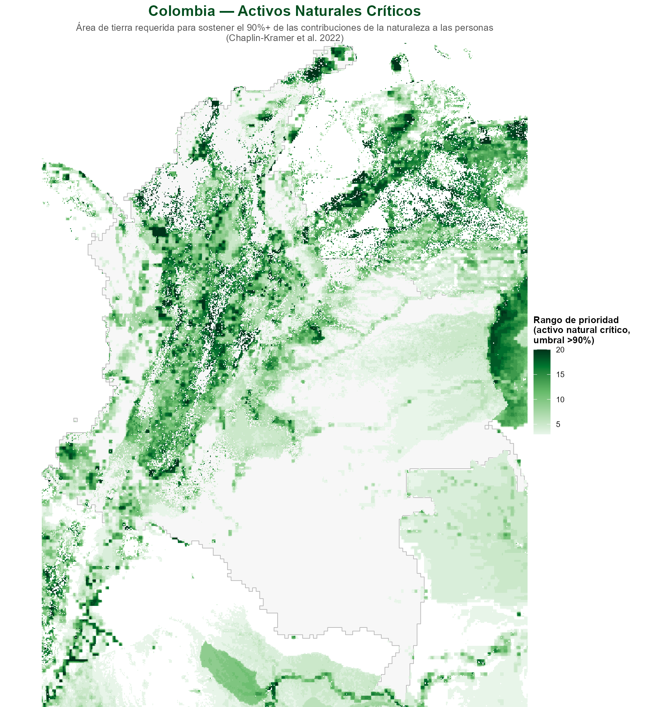
:::

This layer serves as a prioritization tool. The Andes, Amazon, and coastal strips concentrate the highest priority.

::: {.map-card}
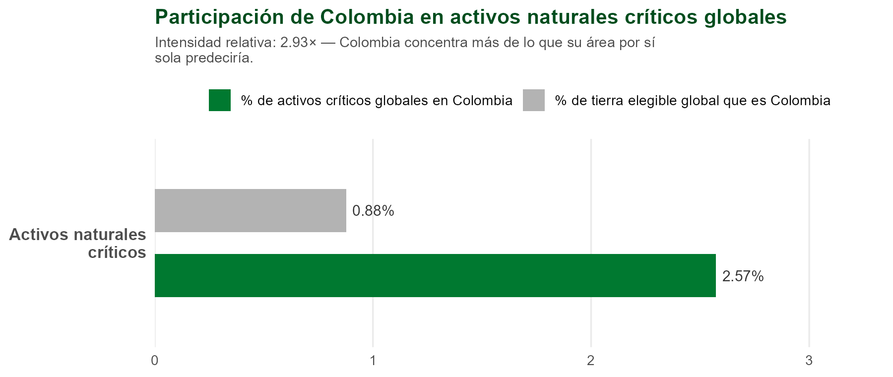
:::

**Colombia holds 2.57% of the world's critical natural assets while representing just 0.88% of eligible global land — a relative intensity of 2.93×**, higher than any of the change-hotspot findings.

::: {.map-card}
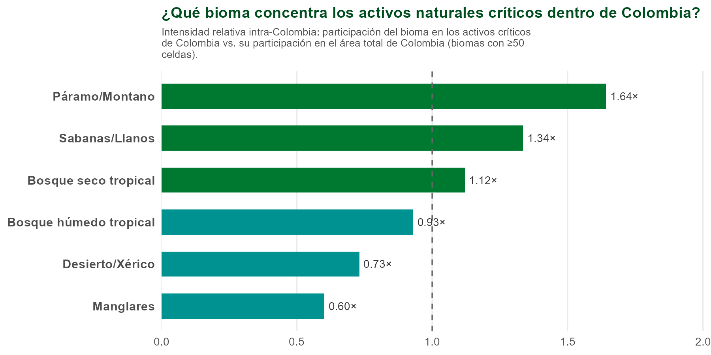
:::

Within Colombia, **páramo/montane** biomes concentrate the largest share of critical assets (1.64×), followed by **savanna/Llanos** (1.34×) — consistent with páramos' role as water regulators (páramos that supply Bogotá, among others).

## Where: change-hotspot concentration

::: {.map-card}
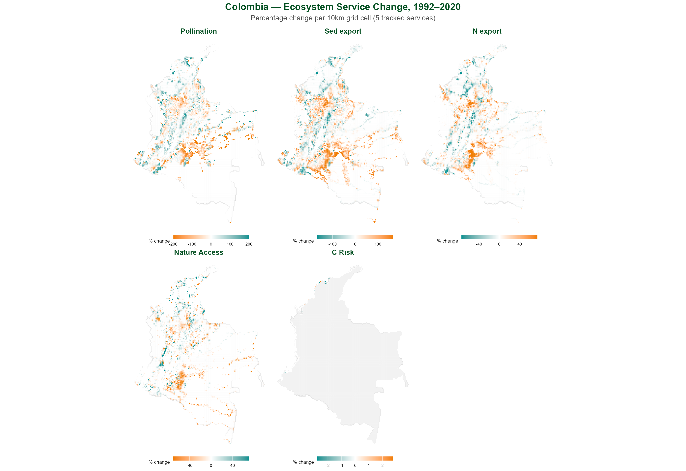
:::

::: {.map-card}

:::

## Priority: where value and change coincide

The coincidence between both layers — a place that is both valuable *and* undergoing severe change — sharpens prioritization:

::: {.map-card}
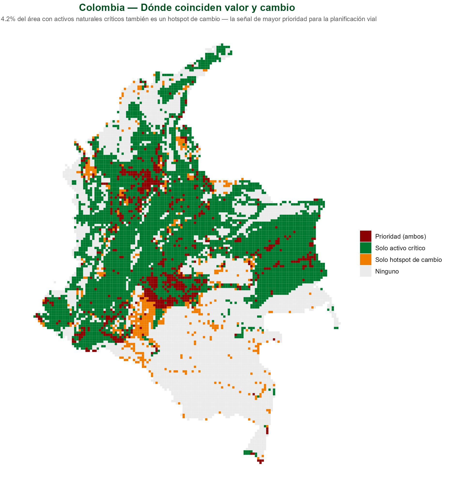
:::

| Metric | Value |
|---|---|
| Critical natural asset cells | 5,797 (51.0% of Colombia) |
| Change-hotspot cells | 1,423 (12.5% of Colombia) |
| Cells that are both ("Priority") | 824 (7.2% of Colombia) |
| **% of change hotspots that are also critical assets** | **57.9%** |
| % of critical assets that are also change hotspots | 14.2% |

: {.results}

**Nearly 6 in 10 of Colombia's change hotspots occur in a place that is also a critical natural asset.**

## Zoom in: which biome concentrates change within Colombia?

**Within Colombia**, which biome disproportionately concentrates the country's own change hotspots?

::: {.map-card}
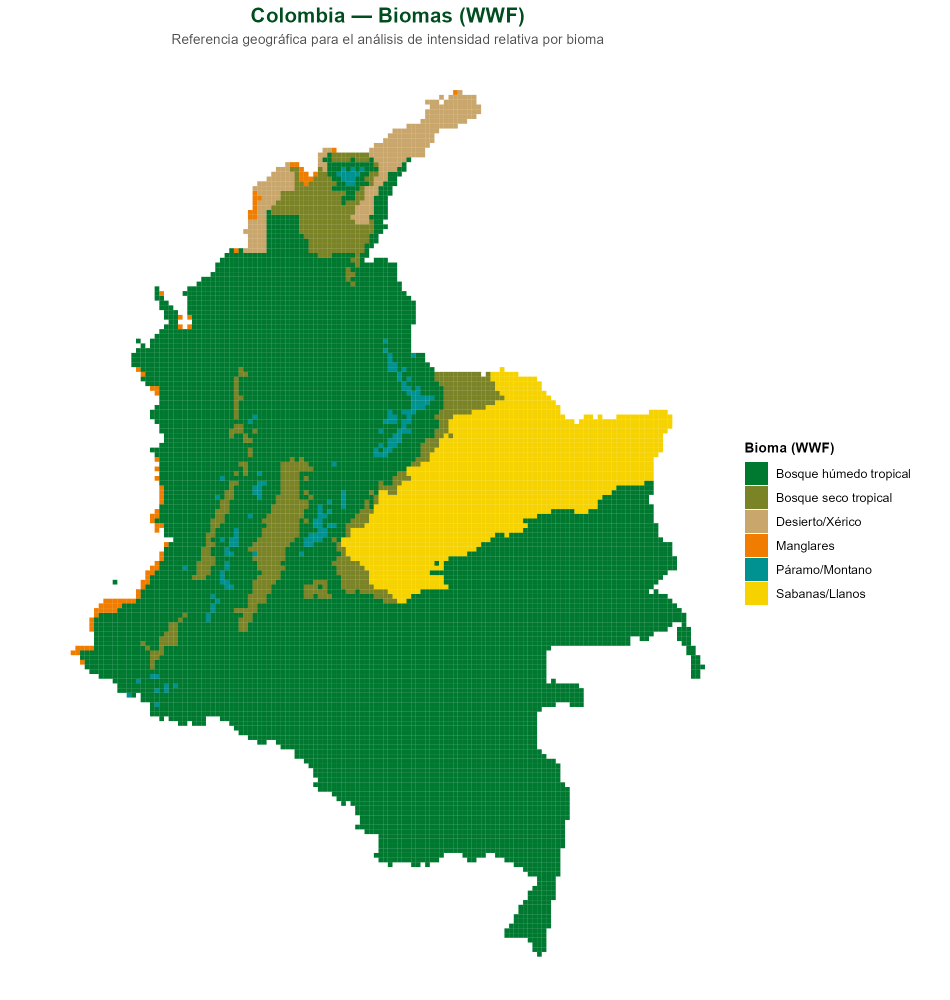
:::

```{=html}
<div class="chart-tabs">
  <input type="radio" name="biometab" id="tab-biome-focus" checked>
  <input type="radio" name="biometab" id="tab-biome-others">
  <div class="tab-labels">
    <label for="tab-biome-focus">Featured services</label>
    <label for="tab-biome-others">Other services</label>
  </div>
  <div class="panels">
    <div class="tab-panel panel-biome-focus">
      <div class="map-card">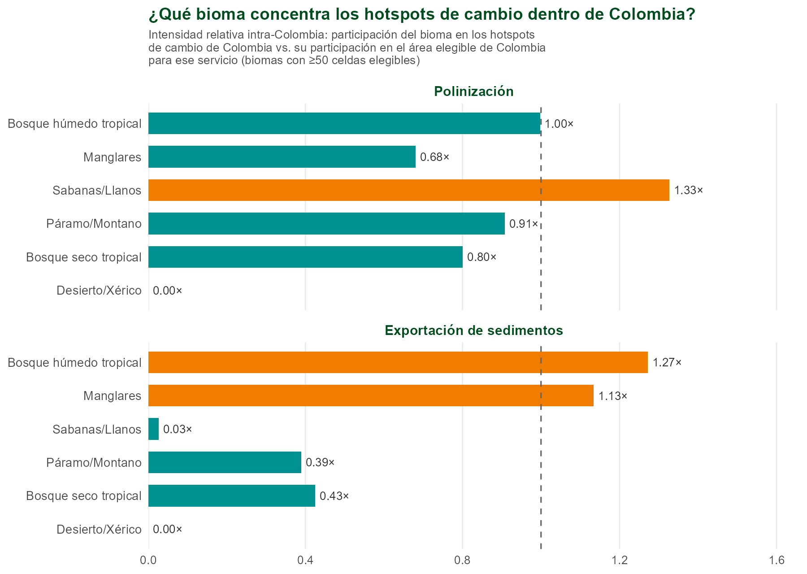</div>
    </div>
    <div class="tab-panel panel-biome-others">
      <div class="map-card">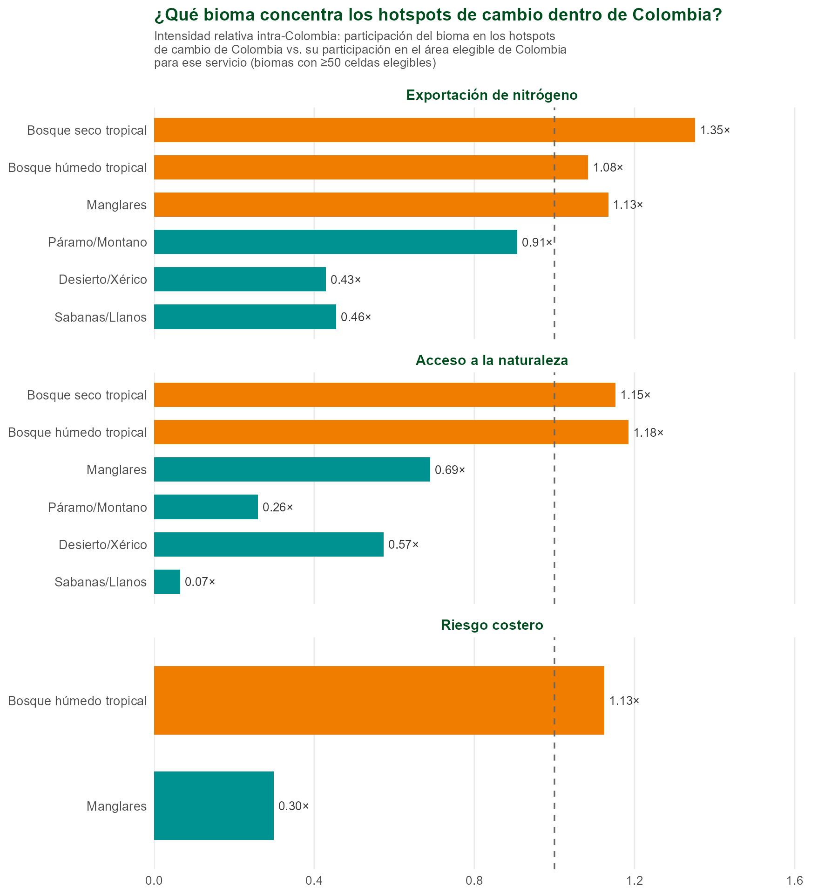</div>
    </div>
  </div>
</div>
```

- **Sediment export** concentrates its change in **tropical moist forest** (1.27×) and, to a lesser extent, **mangroves** (1.13×) — consistent with erosion/sedimentation processes in forested watersheds and coastal zones.
- **Pollination** shows its strongest concentration in **savanna/Llanos** (1.33×), not in tropical moist forest (essentially proportional, 1.00×) — a distinct pattern, consistent with pressure on agricultural and pasture landscapes at the Orinoquía frontier, not just on forest.
- Both findings use the same methodological correction as the rest of the report: the denominator is each service's eligible area within Colombia, not the biome's total area.

## Statistical analysis

```{=html}
<div class="chart-tabs">
  <input type="radio" name="stattab" id="tab-focus" checked>
  <input type="radio" name="stattab" id="tab-others">
  <div class="tab-labels">
    <label for="tab-focus">Featured services</label>
    <label for="tab-others">Other services</label>
  </div>
  <div class="panels">
    <div class="tab-panel panel-focus">
      <div class="map-card">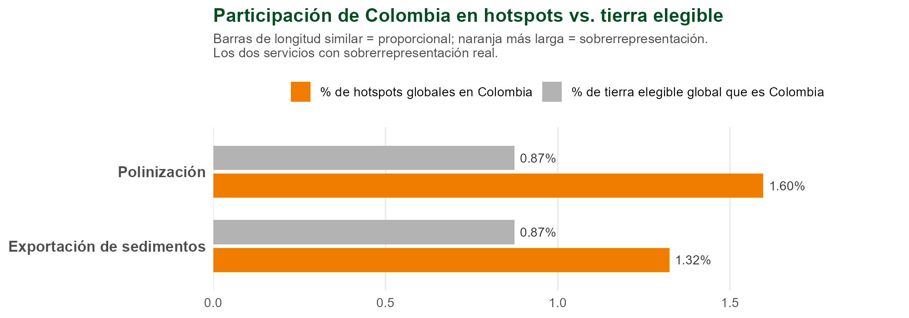</div>
      <div class="map-card">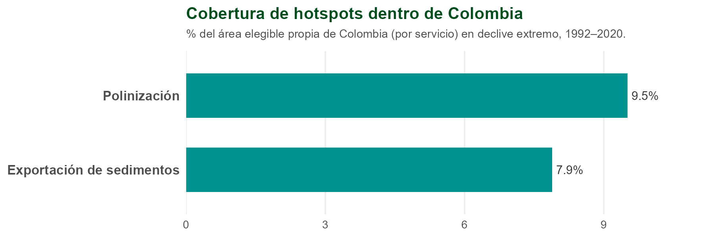</div>
    </div>
    <div class="tab-panel panel-others">
      <div class="map-card">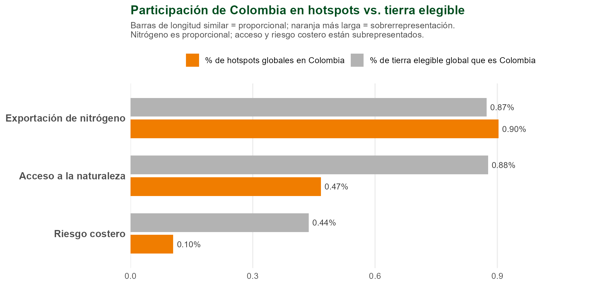</div>
      <div class="map-card">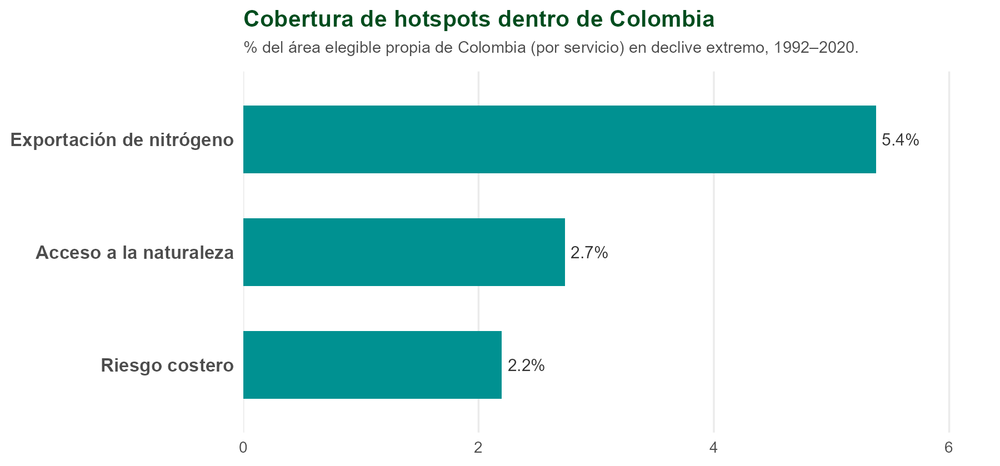</div>
    </div>
  </div>
</div>
```

## Who: beneficiary reach

<!-- TODO (2026-08-12, flagged by user): this section only covers population COUNT/reach.
     Still missing the other beneficiary-disproportionality variables (HDI, Gini, GDP) that
     the Phase 4 report (docs/reports/phase4_beneficiary_disproportionality_report.qmd) already
     tested globally -- Colombia doesn't have its own cut of that analysis yet. Deliberately
     deferred until after today's noon meeting; don't lose track of it. -->

```{=html}
<div class="chart-tabs">
  <input type="radio" name="benTab" id="tab-ben-zone" checked>
  <input type="radio" name="benTab" id="tab-ben-pop">
  <div class="tab-labels">
    <label for="tab-ben-zone">Reach zone</label>
    <label for="tab-ben-pop">Population density</label>
  </div>
  <div class="panels">
    <div class="tab-panel panel-ben-zone">
      <div class="map-card">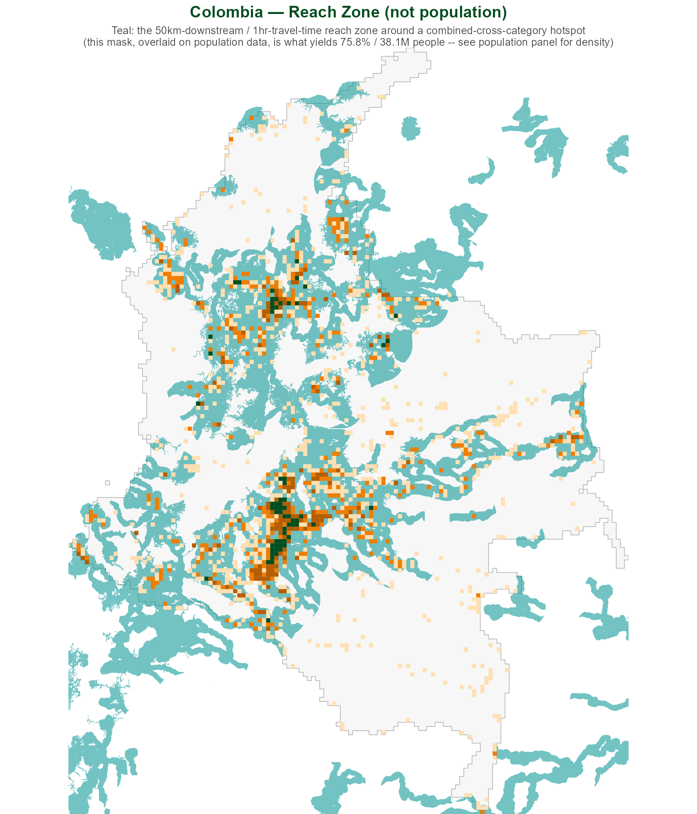</div>
      <p class="map-caption">Teal area: the reach zone —50km downstream or 1 hour of travel time from a combined cross-category change hotspot (at least one water-pathway change hotspot <em>and</em> at least one access-pathway one)— not population itself. The population figure (75.8%, 38.1 million people) is calculated by overlaying this geographic mask onto population data.</p>
    </div>
    <div class="tab-panel panel-ben-pop">
      <div class="map-card">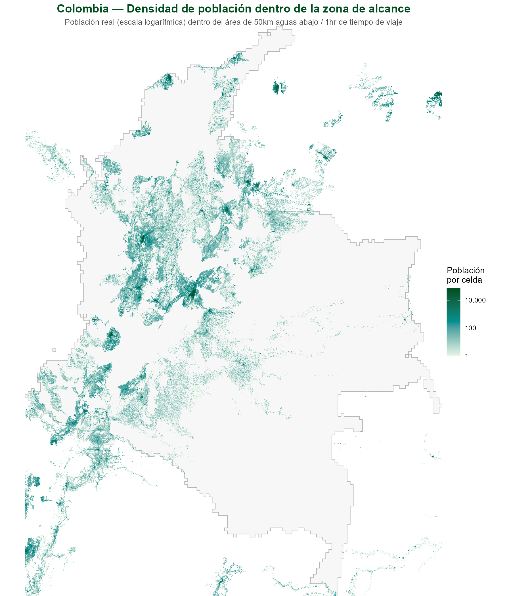</div>
      <p class="map-caption">Actual population (log scale) within the reach zone — this is the layer that actually shows where people are, not just where the geographic mask is.</p>
    </div>
  </div>
</div>
```

| Category | % of population reached | People |
|---|---|---|
| Combined cross-category | 75.8% | 38.1 million |
| Tier 4+ (4 or more of 5 services) | 35.5% | 17.9 million |

: {.results}

The reach parameters (50km downstream, 1 hour of travel time via road network) are the same ones used in the global analysis.

## Proposal

::: {.ask-card}

A dedicated Colombia-national cut of the priority analysis (critical assets ∩ change hotspots) can be produced at finer detail — Llanos/Orinoquía, the Amazon transition zone, páramos — using the same standardized methodology shown here, and read through a frontier-dynamics lens grounded in the author's own field research in the Colombian Orinoquía.
:::

## Scope and caveats

| | |
|---|---|
| **"Expected" is area-only** | Colombia's "expected" share (0.87% for Pollination and Sediment export) is strictly its proportion of *eligible* global land area for that service — a null model of spatial randomness, not a prediction based on real drivers (land use, agricultural intensity, deforestation history, population) that might better explain where change should concentrate. The comparison says "more than land area alone would predict," not "more than any richer model would predict." |
| **Co-occurrence, not causal** | This analysis shows *where* ecosystem-service change hotspots concentrate and *who* falls within the reach area — it does not establish a causal relationship between road infrastructure and that loss. |
| **Coastal risk** | This service is only valid along a narrow coastal strip (182 cells in Colombia, out of 41,635 valid coastal cells globally) — its relative intensity (0.24×) and low coverage reflect that restricted geography, not a calculation error. |
| **Beneficiary categories** | Shown here are the combined cross-category and tier 4+, the same 3 categories used in the internal socioeconomic-disproportionality report (HDI/Gini/GDP) — not all 8 possible categories. |

: {.terms tbl-colwidths="[25,75]"}

<div class="report-footer">
Data: <code>data/processed/tables/regional_subsets/nev_name/hotspot_area_stats_Colombia.csv</code>,
<code>data/processed/tables/colombia_beneficiary_population.csv</code>,
<code>data/processed/tables/colombia_biome_area_stats.csv</code>,
<code>data/processed/tables/colombia_priority_overlap_summary.csv</code> ·
Critical natural assets: Chaplin-Kramer et al. (2022), <i>Nature Ecology & Evolution</i>,
<a href="https://doi.org/10.1038/s41559-022-01934-5">doi.org/10.1038/s41559-022-01934-5</a> ·
Maps: <code>outputs/plots/colombia_report/</code> ·
Full methodology: <code>docs/methodology.md</code>
</div>
