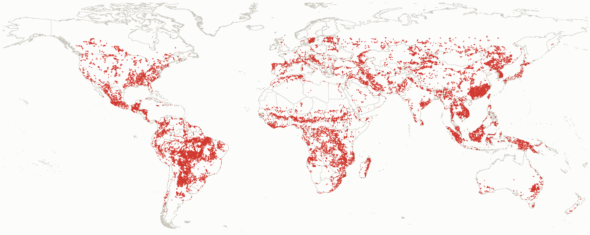
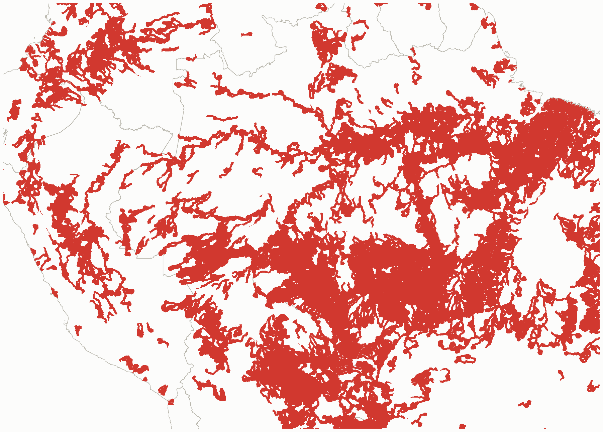
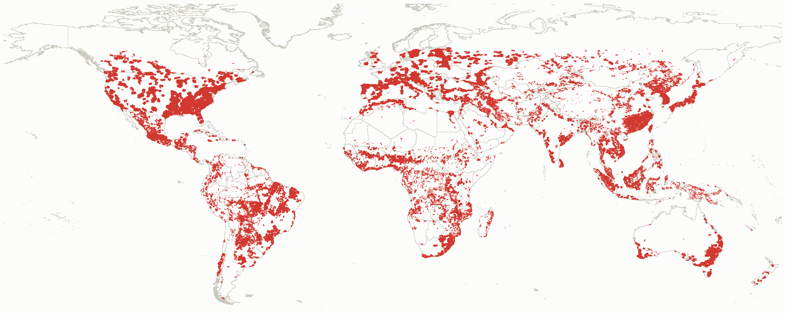
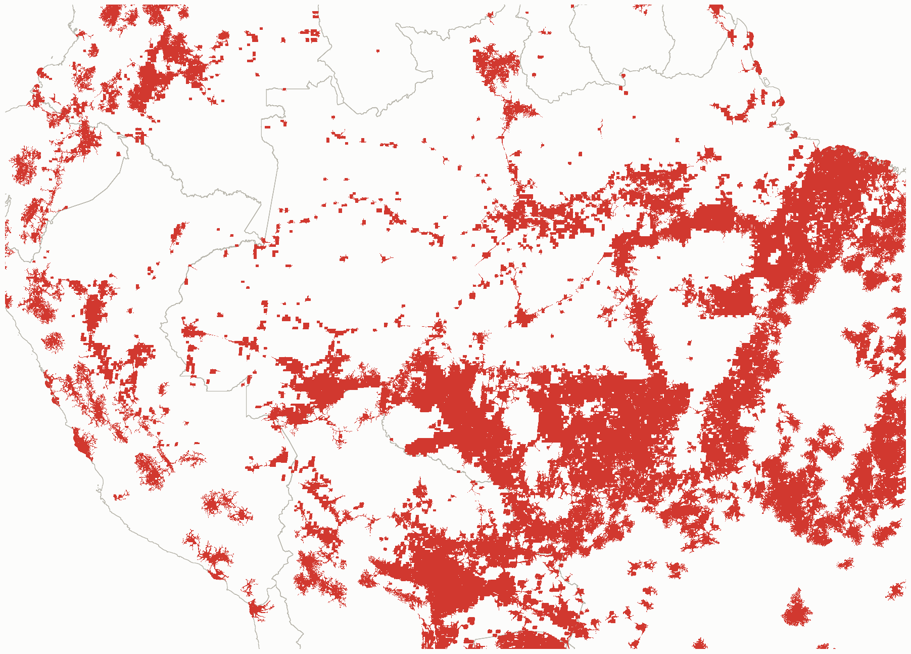
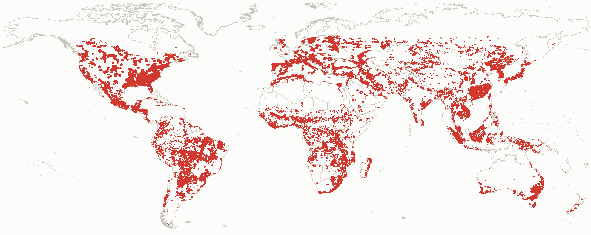
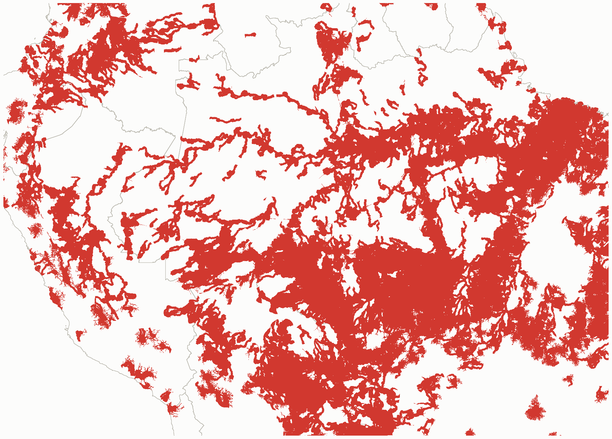
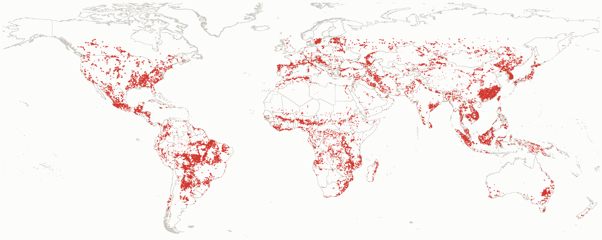
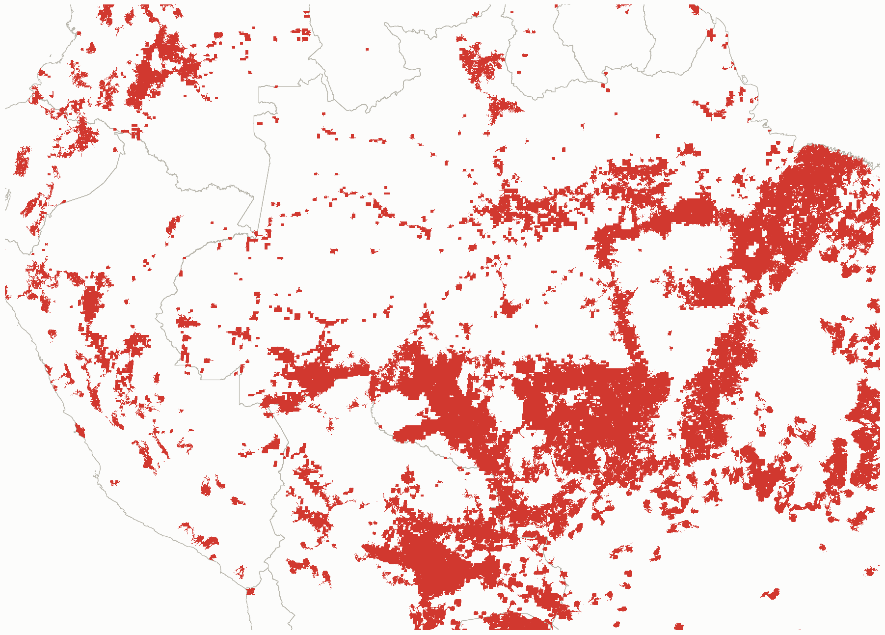

<div class="eyebrow">Global NCP Hotspot Analysis — Memo</div>
<div class="meta">
  <span>Prepared by Jerónimo Rodríguez Escobar</span>
  <span>Global Science, WWF</span>
  <span></span>
</div>

## Key findings

::: {.findings}
::: {.finding}
**Wealth & density.** Beneficiary areas are **substantially wealthier and more densely populated** than the rest of the landscape, consistently across all three category definitions tested. *(Cliff's δ 0.48–0.53, large effect — roughly 3–5× GDP, 2.5–3.5× population per cell.)*
:::
::: {.finding}
**Inequality.** Beneficiary areas skew toward **more unequal (higher-Gini)** regions — and that skew gets **stronger**, not weaker, in the most compound-risk cells (4+ services). *(δ 0.22 at combined-cross/3+, rising to 0.33 at 4+.)*
:::
::: {.finding}
**Development.** HDI shows **no meaningful relationship** in either direction — beneficiary status isn't tied to human development level. *(δ 0.04–0.10, negligible–small.)*
:::
:::

## Question

> Apply the union coverage masks to the HDI, Gini, and GDP rasters to test whether beneficiary areas — combined cross-category, or the 3+/4+ hotspot tiers — are disproportionately high or low compared to outside.

## Analysis Performed

| | |
|---|---|
| **Combined cross-category** | Cells that are simultaneously a water-pathway hotspot (nitrogen *or* sediment export) *and* an access-pathway hotspot (nature access, pollination, *or* coastal risk) — 23.6% of land, reaching ~4.1B people downstream or within travel-time range. |
| **3+ / 4+ services** | Cells where 3 (or 4) or more of the 5 tracked services hit extreme change at once — 12.8% / 4.4% of land, reaching ~2.3B / ~872M people respectively. |
| **Coverage rule** | A 10km cell counts as "inside" a beneficiary area if at least half its area falls within the downstream (50km) or travel-time (1 hour) buffer around a hotspot. |
| **Test** | Two-sample Kolmogorov–Smirnov test, comparing the full distribution of each variable inside vs. outside the mask, plus Cliff's delta as the effect-size measure (0 = no difference, 1 = complete separation). |

: {.terms tbl-colwidths="[25,75]"}

**Beneficiary categories.** 8 possible categories exist.

| Category | What it means | Used here? |
|---|---|---|
| Water-overlap | Cell has a water-pathway hotspot (sediment or nitrogen export) | No |
| Access-overlap | Cell has an access-pathway hotspot (nature access, pollination, or coastal risk) | No |
| **Combined cross-category** | Cell has *both* a water-pathway *and* an access-pathway hotspot at once | **Yes** |
| 1+ services | Cell has at least 1 of the 5 tracked services in extreme change | No |
| 2+ services | Cell has at least 2 of the 5 tracked services in extreme change | No |
| **3+ services** | Cell has at least 3 of the 5 tracked services in extreme change | **Yes** |
| **4+ services** | Cell has at least 4 of the 5 tracked services in extreme change | **Yes** |
| 5 services (all) | Cell has all 5 tracked services in extreme change at once | No — also nearly empty, 364 cells worldwide |

: {.results}

Population figures in this report (4.1B / 2.3B / 872M "people reached") come from **LandScan Global 2023** — a different population dataset than `GHS_POP_E2020_GLOBE_sum`, the population variable used in the HDI/Gini/GDP statistical test. 

**Combined cross-category** — at least 1 of the 2 water services *and* at least 1 of the 3 access services. The underlying extraction function (`derive_cross_combo()`, `R/get_hotspots.R`) can cross *any* named service groups with AND/OR logic, at any threshold.

**How a cell qualifies, step by step.** Two independent stages, each with its own AND/OR — easy to conflate "which services" with "which buffer." Diagram below shows the **union** version specifically — Stage 2's final gate is OR. The intersection alternative (see below) swaps that one gate to AND; Stage 1 is identical either way.

::: {.diagram-card}

:::

**What "reach" means.** For each category, a person counts as reached if they're within 50km downstream (river network) *or* within 1 hour's travel (roads) of any qualifying cell — either buffer counts, not both. 4.1B / 2.3B / 872M are this same "either buffer" reach applied to combined-cross-category / 3+ / 4+ cells respectively.


::: {.validation-note}
**Union ("either buffer") vs. intersection ("both buffers") — how much smaller is "both"?**

| Category | Union: land % / cells | Intersection: land % / cells | Intersection ÷ union |
|---|---|---|---|
| Combined cross-cat. | 23.6% / 321K | 10.2% / 139K | 43% |
| 3+ services | 12.8% / 174K | 5.2% / 71K | 41% |
| 4+ services | 4.4% / 60K | 1.6% / 22K | 37% |

Intersection is roughly 40% the size across all three categories — a consistent pattern. Whether the *statistical* results hold up under this stricter definition too is checked in the Effect size section below.
:::

**Extracted masks.** Combined cross-category, all 4 mask types, shown at their **source resolution (~0.93km / 30 arcsec)** Global extent (decimated for display) + zoomed Amazon/Andes inset (native resolution) for each.

```{=html}
<div class="map-tabs">
  <input type="radio" name="masktab" id="tab-ds" checked>
  <input type="radio" name="masktab" id="tab-tt">
  <input type="radio" name="masktab" id="tab-un">
  <input type="radio" name="masktab" id="tab-in">
  <div class="tab-labels">
    <label for="tab-ds">Downstream (50km)</label>
    <label for="tab-tt">Travel-time (1hr)</label>
    <label for="tab-un">Union (either)</label>
    <label for="tab-in">Intersection (both)</label>
  </div>
  <div class="panels">
    <div class="tab-panel panel-ds">
      <div class="map-card"></div>
      <div class="map-card"></div>
    </div>
    <div class="tab-panel panel-tt">
      <div class="map-card"></div>
      <div class="map-card"></div>
    </div>
    <div class="tab-panel panel-un">
      <div class="map-card"></div>
      <div class="map-card"></div>
    </div>
    <div class="tab-panel panel-in">
      <div class="map-card"></div>
      <div class="map-card"></div>
    </div>
  </div>
</div>
```

## Effect size by variable

Cliff's delta for each category, on a 0–1 scale. Reference ticks mark the conventional small / medium / large thresholds.

<!-- These 4 SVG panels are generated from data/processed/tables/ks_results_beneficiary_masks.csv —
     if the underlying numbers change, regenerate rather than hand-edit the coordinates. -->
```{=html}
<div class="chart-grid">
  <div class="panel">
    <div class="panel-title">GDP</div>
    <div class="panel-sub">rast_gdpTot_2020, cell sum</div>
    <svg viewBox="0 0 460 130" width="100%" role="img" aria-label="GDP Cliff's delta: Combined cross-category 0.53, 3+ services 0.53, 4+ services 0.49">
      <line x1="170" y1="0" x2="170" y2="120" stroke="var(--baseline)" stroke-width="1"/>
      <line x1="231" y1="0" x2="231" y2="120" stroke="var(--band-tick)" stroke-width="1" stroke-dasharray="2,3"/>
      <line x1="308" y1="0" x2="308" y2="120" stroke="var(--band-tick)" stroke-width="1" stroke-dasharray="2,3"/>
      <line x1="368" y1="0" x2="368" y2="120" stroke="var(--band-tick)" stroke-width="1" stroke-dasharray="2,3"/>
      <text x="170" y="128" class="bar-label">Combined cross-cat.</text>
      <rect x="170" y="14" width="222.1" height="20" rx="4" fill="var(--accent-in)"><title>Combined cross-category, GDP: δ=0.533</title></rect>
      <text x="0" y="28" class="bar-label">Combined cross-cat.</text>
      <text x="398" y="28" class="bar-value">0.53</text>
      <text x="0" y="68" class="bar-label">3+ services</text>
      <rect x="170" y="54" width="221.3" height="20" rx="4" fill="var(--accent-in)"><title>3+ services, GDP: δ=0.531</title></rect>
      <text x="398" y="68" class="bar-value">0.53</text>
      <text x="0" y="108" class="bar-label">4+ services</text>
      <rect x="170" y="94" width="203.8" height="20" rx="4" fill="var(--accent-in)"><title>4+ services, GDP: δ=0.489</title></rect>
      <text x="398" y="108" class="bar-value">0.49</text>
    </svg>
  </div>

  <div class="panel">
    <div class="panel-title">Population</div>
    <div class="panel-sub">GHS_POP 2020, cell sum</div>
    <svg viewBox="0 0 460 130" width="100%" role="img" aria-label="Population Cliff's delta: Combined cross-category 0.52, 3+ services 0.52, 4+ services 0.48">
      <line x1="170" y1="0" x2="170" y2="120" stroke="var(--baseline)" stroke-width="1"/>
      <line x1="231" y1="0" x2="231" y2="120" stroke="var(--band-tick)" stroke-width="1" stroke-dasharray="2,3"/>
      <line x1="308" y1="0" x2="308" y2="120" stroke="var(--band-tick)" stroke-width="1" stroke-dasharray="2,3"/>
      <line x1="368" y1="0" x2="368" y2="120" stroke="var(--band-tick)" stroke-width="1" stroke-dasharray="2,3"/>
      <text x="0" y="28" class="bar-label">Combined cross-cat.</text>
      <rect x="170" y="14" width="217.9" height="20" rx="4" fill="var(--accent-in)"><title>Combined cross-category, Population: δ=0.523</title></rect>
      <text x="398" y="28" class="bar-value">0.52</text>
      <text x="0" y="68" class="bar-label">3+ services</text>
      <rect x="170" y="54" width="215.4" height="20" rx="4" fill="var(--accent-in)"><title>3+ services, Population: δ=0.517</title></rect>
      <text x="398" y="68" class="bar-value">0.52</text>
      <text x="0" y="108" class="bar-label">4+ services</text>
      <rect x="170" y="94" width="200.0" height="20" rx="4" fill="var(--accent-in)"><title>4+ services, Population: δ=0.480</title></rect>
      <text x="398" y="108" class="bar-value">0.48</text>
    </svg>
  </div>

  <div class="panel">
    <div class="panel-title">Gini</div>
    <div class="panel-sub">rast_adm1_gini_disp_2020, cell mean</div>
    <svg viewBox="0 0 460 130" width="100%" role="img" aria-label="Gini Cliff's delta: Combined cross-category 0.22, 3+ services 0.22, 4+ services 0.33">
      <line x1="170" y1="0" x2="170" y2="120" stroke="var(--baseline)" stroke-width="1"/>
      <line x1="231" y1="0" x2="231" y2="120" stroke="var(--band-tick)" stroke-width="1" stroke-dasharray="2,3"/>
      <line x1="308" y1="0" x2="308" y2="120" stroke="var(--band-tick)" stroke-width="1" stroke-dasharray="2,3"/>
      <line x1="368" y1="0" x2="368" y2="120" stroke="var(--band-tick)" stroke-width="1" stroke-dasharray="2,3"/>
      <text x="0" y="28" class="bar-label">Combined cross-cat.</text>
      <rect x="170" y="14" width="90.4" height="20" rx="4" fill="var(--accent-in)"><title>Combined cross-category, Gini: δ=0.217</title></rect>
      <text x="398" y="28" class="bar-value">0.22</text>
      <text x="0" y="68" class="bar-label">3+ services</text>
      <rect x="170" y="54" width="90.4" height="20" rx="4" fill="var(--accent-in)"><title>3+ services, Gini: δ=0.217</title></rect>
      <text x="398" y="68" class="bar-value">0.22</text>
      <text x="0" y="108" class="bar-label">4+ services</text>
      <rect x="170" y="94" width="136.7" height="20" rx="4" fill="var(--accent-in)"><title>4+ services, Gini: δ=0.328</title></rect>
      <text x="398" y="108" class="bar-value">0.33</text>
    </svg>
  </div>

  <div class="panel">
    <div class="panel-title">HDI</div>
    <div class="panel-sub">hdi_raster_predictions_2020, cell mean</div>
    <svg viewBox="0 0 460 130" width="100%" role="img" aria-label="HDI Cliff's delta: Combined cross-category 0.08, 3+ services 0.10, 4+ services 0.04">
      <line x1="170" y1="0" x2="170" y2="120" stroke="var(--baseline)" stroke-width="1"/>
      <line x1="231" y1="0" x2="231" y2="120" stroke="var(--band-tick)" stroke-width="1" stroke-dasharray="2,3"/>
      <line x1="308" y1="0" x2="308" y2="120" stroke="var(--band-tick)" stroke-width="1" stroke-dasharray="2,3"/>
      <line x1="368" y1="0" x2="368" y2="120" stroke="var(--band-tick)" stroke-width="1" stroke-dasharray="2,3"/>
      <text x="0" y="28" class="bar-label">Combined cross-cat.</text>
      <rect x="170" y="14" width="35.0" height="20" rx="4" fill="var(--accent-in)"><title>Combined cross-category, HDI: δ=0.084</title></rect>
      <text x="398" y="28" class="bar-value">0.08</text>
      <text x="0" y="68" class="bar-label">3+ services</text>
      <rect x="170" y="54" width="43.3" height="20" rx="4" fill="var(--accent-in)"><title>3+ services, HDI: δ=0.104</title></rect>
      <text x="398" y="68" class="bar-value">0.10</text>
      <text x="0" y="108" class="bar-label">4+ services</text>
      <rect x="170" y="94" width="14.6" height="20" rx="4" fill="var(--accent-in)"><title>4+ services, HDI: δ=0.035</title></rect>
      <text x="398" y="108" class="bar-value">0.04</text>
    </svg>
  </div>
</div>
<div class="chart-legend">
  <div class="item"><span class="swatch" style="background:var(--accent-in)"></span> Cliff's delta (beneficiary higher than outside)</div>
  <div class="item" style="color:var(--muted)">Dashed ticks: 0.15 / small · 0.33 / medium · 0.47 / large</div>
</div>
```

::: {.validation-note}
**Robustness check: same deltas under the intersection definition?** (See "What was tested" for the area comparison this follows up on.)

| Variable | Union δ | Intersection δ | Robust? |
|---|---|---|---|
| GDP | 0.49–0.53 | 0.51–0.54 | Yes |
| Population | 0.48–0.52 | 0.50–0.54 | Yes |
| Gini | 0.22–0.33 | 0.22–0.38 | Yes — stronger |
| HDI | 0.04–0.10 | −0.01–0.04 | No — sign flips at 4+ |

GDP, Population, and Gini: essentially unchanged between union and intersection. HDI: already the smallest effect under union (δ 0.04–0.10); it shrinks toward zero and crosses to slightly negative at the 4+ tier. A real null effect would look like this — small and inconsistent in sign — so this is what "no relationship" confirmed a second way looks like, not a new or different finding.

Full numbers: `data/processed/tables/union_vs_intersection_comparison.csv`.
:::

## Distribution comparison

What the KS test actually compares — the middle 80% (q10-q90) of each group's values, not just the summary Cliff's delta. Thick line = range, tick = median.

<!-- Generated from ks_results_beneficiary_masks.csv's q10/median/q90 columns — regenerate, don't hand-edit. -->
```{=html}
<div class="chart-grid">
  <div class="panel">
    <div class="panel-title">GDP</div>
    <div class="panel-sub">log scale — q10-q90 range, tick = median</div>
    <svg viewBox="0 0 460 112" width="100%" role="img" aria-label="GDP distribution comparison, inside vs outside beneficiary mask">
      <line x1="266.6" y1="13" x2="398.4" y2="13" stroke="var(--accent-in)" stroke-width="6" stroke-linecap="round" opacity="0.85"/>
      <line x1="351.4" y1="8" x2="351.4" y2="18" stroke="var(--accent-in)" stroke-width="2"/>
      <line x1="150.0" y1="27" x2="372.7" y2="27" stroke="var(--accent-out)" stroke-width="6" stroke-linecap="round" opacity="0.85"/>
      <line x1="255.6" y1="22" x2="255.6" y2="32" stroke="var(--accent-out)" stroke-width="2"/>
      <text x="0" y="17" class="bar-label">Combined cross-cat.</text>
      <text x="408" y="17" class="bar-value" style="font-size:9.5px;">$7.2M</text>
      <text x="408" y="31" class="bar-value" style="font-size:9.5px;fill:var(--muted);font-weight:400;">$4K</text>
      <line x1="293.1" y1="47" x2="400.0" y2="47" stroke="var(--accent-in)" stroke-width="6" stroke-linecap="round" opacity="0.85"/>
      <line x1="355.5" y1="42" x2="355.5" y2="52" stroke="var(--accent-in)" stroke-width="2"/>
      <line x1="150.0" y1="61" x2="377.8" y2="61" stroke="var(--accent-out)" stroke-width="6" stroke-linecap="round" opacity="0.85"/>
      <line x1="280.9" y1="56" x2="280.9" y2="66" stroke="var(--accent-out)" stroke-width="2"/>
      <text x="0" y="51" class="bar-label">3+ services</text>
      <text x="408" y="51" class="bar-value" style="font-size:9.5px;">$9.8M</text>
      <text x="408" y="65" class="bar-value" style="font-size:9.5px;fill:var(--muted);font-weight:400;">$29K</text>
      <line x1="297.9" y1="81" x2="400.0" y2="81" stroke="var(--accent-in)" stroke-width="6" stroke-linecap="round" opacity="0.85"/>
      <line x1="354.6" y1="76" x2="354.6" y2="86" stroke="var(--accent-in)" stroke-width="2"/>
      <line x1="150.0" y1="95" x2="381.3" y2="95" stroke="var(--accent-out)" stroke-width="6" stroke-linecap="round" opacity="0.85"/>
      <line x1="294.4" y1="90" x2="294.4" y2="100" stroke="var(--accent-out)" stroke-width="2"/>
      <text x="0" y="85" class="bar-label">4+ services</text>
      <text x="408" y="85" class="bar-value" style="font-size:9.5px;">$9.2M</text>
      <text x="408" y="99" class="bar-value" style="font-size:9.5px;fill:var(--muted);font-weight:400;">$82K</text>
    </svg>
  </div>

  <div class="panel">
    <div class="panel-title">Population</div>
    <div class="panel-sub">log scale — q10-q90 range, tick = median</div>
    <svg viewBox="0 0 460 112" width="100%" role="img" aria-label="Population distribution comparison, inside vs outside beneficiary mask">
      <line x1="150.0" y1="13" x2="397.0" y2="13" stroke="var(--accent-in)" stroke-width="6" stroke-linecap="round" opacity="0.85"/>
      <line x1="316.3" y1="8" x2="316.3" y2="18" stroke="var(--accent-in)" stroke-width="2"/>
      <line x1="150.0" y1="27" x2="357.6" y2="27" stroke="var(--accent-out)" stroke-width="6" stroke-linecap="round" opacity="0.85"/>
      <line x1="150.0" y1="22" x2="150.0" y2="32" stroke="var(--accent-out)" stroke-width="2"/>
      <text x="0" y="17" class="bar-label">Combined cross-cat.</text>
      <text x="408" y="17" class="bar-value" style="font-size:9.5px;">849.3</text>
      <text x="408" y="31" class="bar-value" style="font-size:9.5px;fill:var(--muted);font-weight:400;">0.2</text>
      <line x1="195.6" y1="47" x2="398.5" y2="47" stroke="var(--accent-in)" stroke-width="6" stroke-linecap="round" opacity="0.85"/>
      <line x1="323.0" y1="42" x2="323.0" y2="52" stroke="var(--accent-in)" stroke-width="2"/>
      <line x1="150.0" y1="61" x2="366.0" y2="61" stroke="var(--accent-out)" stroke-width="6" stroke-linecap="round" opacity="0.85"/>
      <line x1="169.5" y1="56" x2="169.5" y2="66" stroke="var(--accent-out)" stroke-width="2"/>
      <text x="0" y="51" class="bar-label">3+ services</text>
      <text x="408" y="51" class="bar-value" style="font-size:9.5px;">1,116</text>
      <text x="408" y="65" class="bar-value" style="font-size:9.5px;fill:var(--muted);font-weight:400;">2.2</text>
      <line x1="205.1" y1="81" x2="400.0" y2="81" stroke="var(--accent-in)" stroke-width="6" stroke-linecap="round" opacity="0.85"/>
      <line x1="322.2" y1="76" x2="322.2" y2="86" stroke="var(--accent-in)" stroke-width="2"/>
      <line x1="150.0" y1="95" x2="371.4" y2="95" stroke="var(--accent-out)" stroke-width="6" stroke-linecap="round" opacity="0.85"/>
      <line x1="197.7" y1="90" x2="197.7" y2="100" stroke="var(--accent-out)" stroke-width="2"/>
      <text x="0" y="85" class="bar-label">4+ services</text>
      <text x="408" y="85" class="bar-value" style="font-size:9.5px;">1,080</text>
      <text x="408" y="99" class="bar-value" style="font-size:9.5px;fill:var(--muted);font-weight:400;">6.9</text>
    </svg>
  </div>

  <div class="panel">
    <div class="panel-title">Gini</div>
    <div class="panel-sub">linear scale — q10-q90 range, tick = median</div>
    <svg viewBox="0 0 460 112" width="100%" role="img" aria-label="Gini distribution comparison, inside vs outside beneficiary mask">
      <line x1="199.3" y1="13" x2="361.4" y2="13" stroke="var(--accent-in)" stroke-width="6" stroke-linecap="round" opacity="0.85"/>
      <line x1="249.4" y1="8" x2="249.4" y2="18" stroke="var(--accent-in)" stroke-width="2"/>
      <line x1="176.7" y1="27" x2="338.1" y2="27" stroke="var(--accent-out)" stroke-width="6" stroke-linecap="round" opacity="0.85"/>
      <line x1="230.1" y1="22" x2="230.1" y2="32" stroke="var(--accent-out)" stroke-width="2"/>
      <text x="0" y="17" class="bar-label">Combined cross-cat.</text>
      <text x="408" y="17" class="bar-value" style="font-size:9.5px;">0.355</text>
      <text x="408" y="31" class="bar-value" style="font-size:9.5px;fill:var(--muted);font-weight:400;">0.321</text>
      <line x1="201.7" y1="47" x2="361.4" y2="47" stroke="var(--accent-in)" stroke-width="6" stroke-linecap="round" opacity="0.85"/>
      <line x1="251.7" y1="42" x2="251.7" y2="52" stroke="var(--accent-in)" stroke-width="2"/>
      <line x1="179.0" y1="61" x2="339.9" y2="61" stroke="var(--accent-out)" stroke-width="6" stroke-linecap="round" opacity="0.85"/>
      <line x1="230.7" y1="56" x2="230.7" y2="66" stroke="var(--accent-out)" stroke-width="2"/>
      <text x="0" y="51" class="bar-label">3+ services</text>
      <text x="408" y="51" class="bar-value" style="font-size:9.5px;">0.359</text>
      <text x="408" y="65" class="bar-value" style="font-size:9.5px;fill:var(--muted);font-weight:400;">0.322</text>
      <line x1="207.4" y1="81" x2="361.9" y2="81" stroke="var(--accent-in)" stroke-width="6" stroke-linecap="round" opacity="0.85"/>
      <line x1="268.7" y1="76" x2="268.7" y2="86" stroke="var(--accent-in)" stroke-width="2"/>
      <line x1="179.5" y1="95" x2="340.3" y2="95" stroke="var(--accent-out)" stroke-width="6" stroke-linecap="round" opacity="0.85"/>
      <line x1="234.1" y1="90" x2="234.1" y2="100" stroke="var(--accent-out)" stroke-width="2"/>
      <text x="0" y="85" class="bar-label">4+ services</text>
      <text x="408" y="85" class="bar-value" style="font-size:9.5px;">0.389</text>
      <text x="408" y="99" class="bar-value" style="font-size:9.5px;fill:var(--muted);font-weight:400;">0.328</text>
    </svg>
  </div>

  <div class="panel">
    <div class="panel-title">HDI</div>
    <div class="panel-sub">linear scale — q10-q90 range, tick = median</div>
    <svg viewBox="0 0 460 112" width="100%" role="img" aria-label="HDI distribution comparison, inside vs outside beneficiary mask">
      <line x1="186.3" y1="13" x2="367.1" y2="13" stroke="var(--accent-in)" stroke-width="6" stroke-linecap="round" opacity="0.85"/>
      <line x1="286.1" y1="8" x2="286.1" y2="18" stroke="var(--accent-in)" stroke-width="2"/>
      <line x1="174.8" y1="27" x2="352.9" y2="27" stroke="var(--accent-out)" stroke-width="6" stroke-linecap="round" opacity="0.85"/>
      <line x1="280.2" y1="22" x2="280.2" y2="32" stroke="var(--accent-out)" stroke-width="2"/>
      <text x="0" y="17" class="bar-label">Combined cross-cat.</text>
      <text x="408" y="17" class="bar-value" style="font-size:9.5px;">0.674</text>
      <text x="408" y="31" class="bar-value" style="font-size:9.5px;fill:var(--muted);font-weight:400;">0.661</text>
      <line x1="196.1" y1="47" x2="368.8" y2="47" stroke="var(--accent-in)" stroke-width="6" stroke-linecap="round" opacity="0.85"/>
      <line x1="287.5" y1="42" x2="287.5" y2="52" stroke="var(--accent-in)" stroke-width="2"/>
      <line x1="175.7" y1="61" x2="355.0" y2="61" stroke="var(--accent-out)" stroke-width="6" stroke-linecap="round" opacity="0.85"/>
      <line x1="281.0" y1="56" x2="281.0" y2="66" stroke="var(--accent-out)" stroke-width="2"/>
      <text x="0" y="51" class="bar-label">3+ services</text>
      <text x="408" y="51" class="bar-value" style="font-size:9.5px;">0.677</text>
      <text x="408" y="65" class="bar-value" style="font-size:9.5px;fill:var(--muted);font-weight:400;">0.663</text>
      <line x1="223.5" y1="81" x2="351.9" y2="81" stroke="var(--accent-in)" stroke-width="6" stroke-linecap="round" opacity="0.85"/>
      <line x1="280.9" y1="76" x2="280.9" y2="86" stroke="var(--accent-in)" stroke-width="2"/>
      <line x1="176.9" y1="95" x2="357.9" y2="95" stroke="var(--accent-out)" stroke-width="6" stroke-linecap="round" opacity="0.85"/>
      <line x1="282.4" y1="90" x2="282.4" y2="100" stroke="var(--accent-out)" stroke-width="2"/>
      <text x="0" y="85" class="bar-label">4+ services</text>
      <text x="408" y="85" class="bar-value" style="font-size:9.5px;">0.663</text>
      <text x="408" y="99" class="bar-value" style="font-size:9.5px;fill:var(--muted);font-weight:400;">0.666</text>
    </svg>
  </div>
</div>
<div class="chart-legend">
  <div class="item"><span class="swatch" style="background:var(--accent-in)"></span> Inside beneficiary mask</div>
  <div class="item"><span class="swatch" style="background:var(--accent-out)"></span> Outside beneficiary mask</div>
</div>
```

## Output numbers

Median value per 10km cell, inside the beneficiary mask vs. outside it. GDP and population totals are extensive (summed per cell), so medians read low relative to the totals above — most cells are small, a few are enormous.

| Variable | Category | Median, inside | Median, outside | Cliff's δ |
|---|---|---|---|---|
| GDP | Combined cross-cat. | $7.16M | $3.9K | **0.53** |
| | 3+ services | $9.83M | $28.5K | **0.53** |
| | 4+ services | $9.19M | $81.9K | **0.49** |
| Population | Combined cross-cat. | 849 | 0.19 | **0.52** |
| | 3+ services | 1,116 | 2.2 | **0.52** |
| | 4+ services | 1,080 | 6.9 | **0.48** |
| Gini | Combined cross-cat. | 0.355 | 0.321 | **0.22** |
| | 3+ services | 0.359 | 0.322 | **0.22** |
| | 4+ services | 0.389 | 0.328 | **0.33** |
| HDI | Combined cross-cat. | 0.674 | 0.661 | **0.08** |
| | 3+ services | 0.677 | 0.663 | **0.10** |
| | 4+ services | 0.663 | 0.666 | **0.04** |

: {.results}

All 12 differences are statistically significant at p < 0.001 (two-sided KS test, Benjamini–Hochberg corrected) — sample sizes range from ~60K to ~320K beneficiary cells against ~1.0–1.3M non-beneficiary cells, so even the smaller HDI effect is not noise.

## Discussion

**GDP and population** are the strongest signals by a wide margin (δ ≈ 0.48–0.53, the "large effect" band) — beneficiary cells roughly 3–5× higher in per-cell GDP and 2.5–3.5× higher in per-cell population than the rest. These masks already cover a large share of total land area. MBuffers are built around where hotspots are, and hotspots concentrate around where people already live and build economic activity.

**Gini** is the least obvious result but  probably the most useful: beneficiary areas skew toward more unequal regions, not less, and — unlike GDP and population — that effect *grows* at the most exclusive tier (δ 0.22 at combined-cross and 3+, rising to 0.33 at 4+). The people gaining the most concentrated ecosystem-service benefit are disproportionately in places with more internal inequality, not fewer.

**Why GDP flattens while Gini keeps climbing, at the same tier.** GDP measures average wealth level; Gini measures how unequally that wealth is distributed within a place — different dimensions. GDP's gap doesn't grow at the 4+ tier (δ 0.53 → 0.49) — the wealth relationship is already near its ceiling by "combined cross" / "3+," and the most severe compound-risk cells aren't concentrated *even more* in rich places. Gini's gap does grow (0.22 → 0.33) at that same tier. So the story isn't "compound risk concentrates in rich places" — GDP alone would show that as a strengthening trend too, and it doesn't. It's specifically "compound risk concentrates in unequal places," a distinct, more distributional signal that GDP by itself would miss entirely.

**HDI** shows essentially no relationship (δ ≈ 0.04–0.10, negligible to small) — human development level doesn't meaningfully predict beneficiary status either way.

This is a co-occurrence pattern, not a causal claim — the test says where these buffers geographically land relative to wealth, population, inequality, and development, not why. It doesn't imply the ecosystem service itself is delivered unequally by design; it says the buffers currently fall in places that are already wealthier, denser, and more unequal than the rest of the landscape.

## Scope & caveats

| | |
|---|---|
| **Coverage threshold** | ≥50% of a cell's area is a modeling choice (majority rule). Not sensitivity-tested this round — happy to re-run at a different threshold if it matters for the paper. |
| **Categories tested** | Combined cross-category and the 3+/4+ compound tiers only, per your ask. Water-only and access-only masks weren't run through this test but the same pipeline extends to them directly if useful. |
| **Spatial extent** | Rich's buffer rasters stop at ~77°N — a small amount of high-Arctic land falls outside their extent and is treated as "not covered." Negligible effect on the results given how little land that represents. |

: {.terms tbl-colwidths="[25,75]"}

<div class="report-footer">
Full results table: `data/processed/tables/ks_results_beneficiary_masks.csv` &nbsp;·&nbsp; Notebook: `analysis/KS_tests_beneficiary_masks.qmd` &nbsp;·&nbsp; Plots: `outputs/plots/ks_beneficiary_masks/`
</div>
