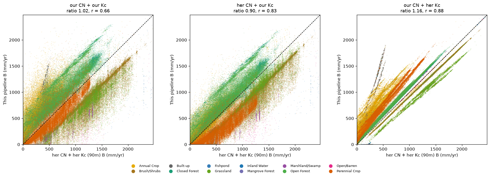
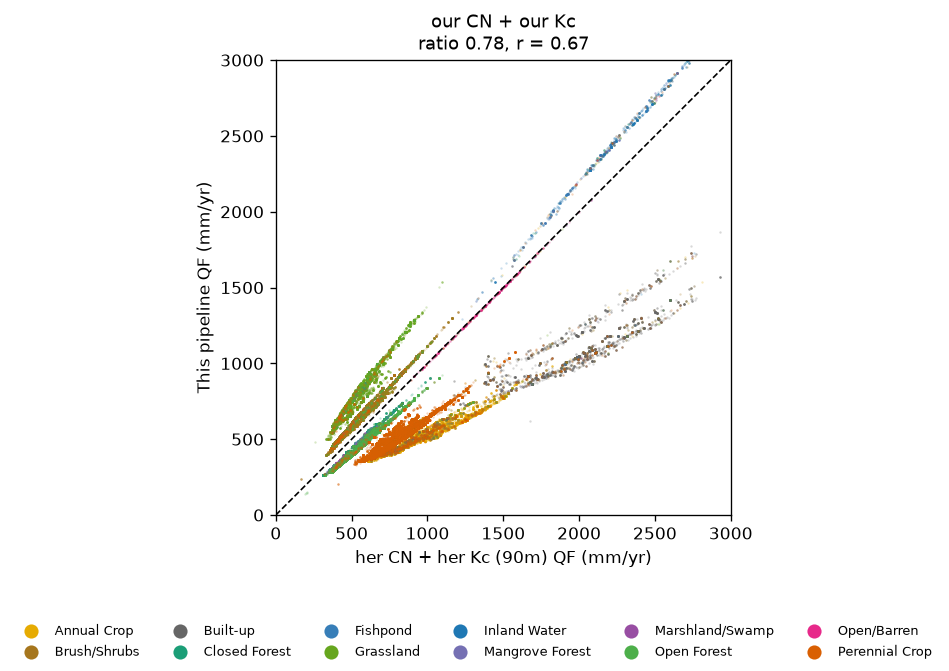
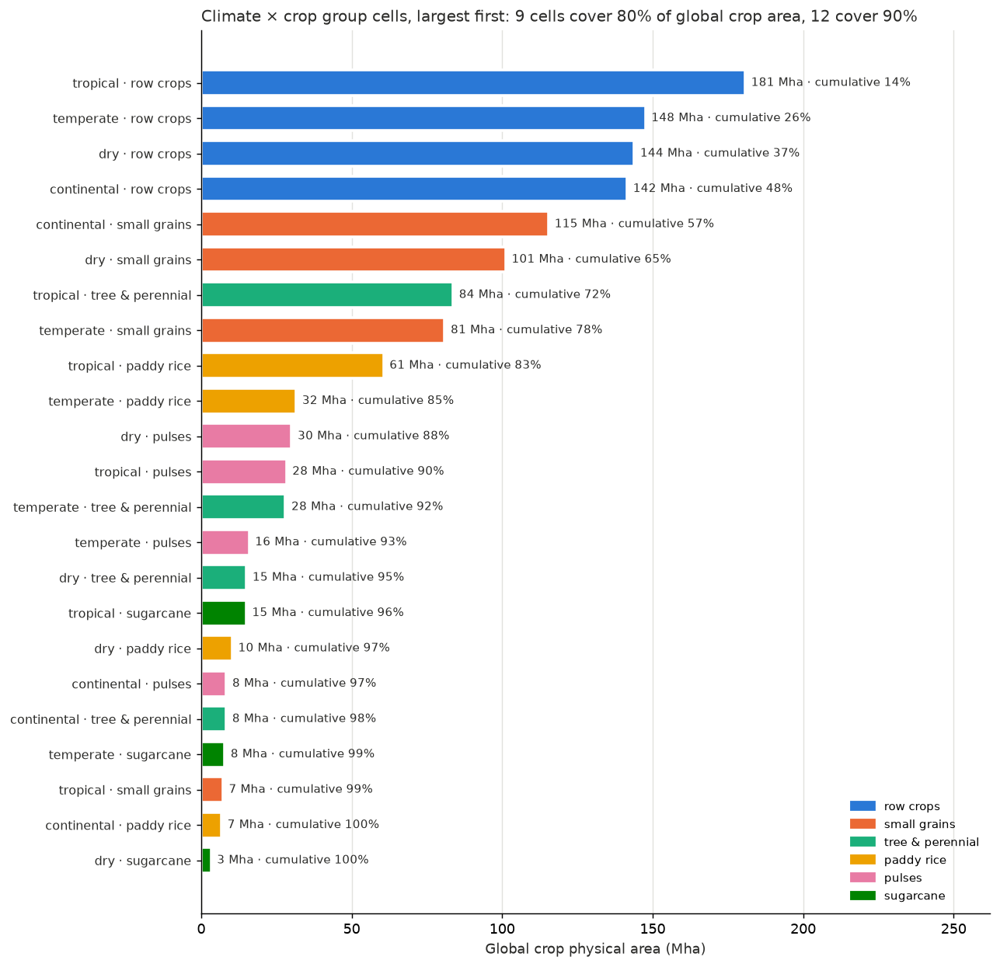

::: eyebrow
Global NCP — SWY Status Memo
:::

::: meta
Prepared by Jerónimo Rodríguez Escobar Global Science, WWF 
:::

::: {.report-footer style="margin-bottom: 1.5em;"}
**Reference run** = WWF-SIPA's own CN and Kc run through this project's pipeline on the 90m DEM. It reproduces WWF-SIPA's original 30m run closely (r=0.92 for quickflow and baseflow) and sits on the same grid as every other run here, so comparisons against it isolate the CN/Kc choice. **Our run** = the same pipeline and inputs with this project's CN and Kc.
:::
## Question

WWF-SIPA ran this model for the Philippines with CN and Kc values set for that region. We built CN and Kc from public global sources instead (GCN250 curve numbers; MODIS-based crop coefficients from published flux-tower calibrations) and ran the same model with everything else held equal: land cover, rainfall, ET0, rain events, soil, routing.

Two questions: **(1) does the pipeline run the model correctly? (2) where our results differ, why, and can global data close the gap?**

## Main outcome

**(1) The pipeline works.** WWF-SIPA's own CN and Kc, run through our pipeline at 90m, reproduce their 30m results closely (r=0.92 for quickflow and baseflow). That run is now the reference for everything below.

**(2) The remaining gap is concentrated in cropland.** With our CN and our current Kc (per pixel, plus a paddy rice Kc on annual crop), baseflow is 1.03x the reference overall (r=0.66), and quickflow 0.78x (r=0.67). Most classes are close or moderately off (forest about 1.3x). Annual crop, a fifth of the area and mostly paddy rice, is the exception: baseflow 2.0x the reference, quickflow about half. Most of that is CN: GCN250's cropland CN sits about 10 points below WWF-SIPA's, which matches the TR-55 row-crop value. Neither table describes bunded, flooded paddy fields.

This is a model-to-model comparison, not a validation against observations. Whether WWF-SIPA's run has itself been validated against Philippine hydrology is still an open question.

::: diagram-card
```{mermaid}
%%| label: fig-workflow-philippines-report
%%| fig-cap: "Philippines Kc/CN comparison, status 2026-09-25: shared inputs, the reference run, our parameter chain, the result, and next steps."
%%{init: {'themeVariables': {'fontSize': '16px'}, 'flowchart': {'rankSpacing': 55, 'nodeSpacing': 35, 'padding': 15, 'subGraphTitleMargin': {'top': 10, 'bottom': 10}}}}%%
flowchart TD
    subgraph SHARED["Shared by every run: WWF-SIPA inputs + our 90m grid"]
        LULC["WWF-SIPA LULC<br/>12 classes"]:::done
        CLIM["Precipitation + ET0<br/>30-yr CMIP6 climatology"]:::done
        RAINEV["Spatially distributed rain events<br/>(3 inspring bugs patched)"]:::done
        SOIL["Soil group: HYSOGs250m"]:::done
        DEM["SRTMGL3 DEM, 90m<br/>grid-nested to WWF-SIPA's grid"]:::done
    end

    subgraph REF["Reference: WWF-SIPA parameters"]
        HER30["WWF-SIPA's own 30m run"]:::done
        REFRUN["Her CN + Kc through our pipeline (09h)<br/>reproduces the 30m run, r=0.92<br/>= reference for all comparisons"]:::done
    end

    subgraph OURS["Our parameters (global data)"]
        CN["CN: GCN250 via ESA crosswalk<br/>+ HYSOGs soil group per pixel (07b)"]:::done
        KCF["Kc forest: Negrón Juárez 2008 (07d)"]:::done
        KCG["Kc grass/shrub: Oliveira 2015 (07e)"]:::done
        KCN["Kc other classes: Kamble on NDVI,<br/>per pixel (07g, fixes EVI error)"]:::done
        KCP["Kc paddy: FAO-56 rice + Sacks calendar<br/>+ MapSPAM rice share (07h)"]:::done
        OURRUN["Our current run (09n)"]:::done
    end

    subgraph RESULT["Comparison against the reference (20)"]
        OVERALL["Baseflow 1.03x overall (r=0.66)<br/>forest ~1.3x, most classes close"]:::done
        CROP["Gap concentrated in annual crop (2.0x)<br/>her CN alone brings it to 1.25x:<br/>cropland CN is the main open problem"]:::done
    end

    subgraph NEXT["Next"]
        CROPCN["Cropland CN (runoff):<br/>main remaining gap"]:::todo
        TABLE["Global cropland table:<br/>Köppen x crop group x water regime<br/>scoped: 9 cells = 80% of crop area"]:::progress
        REPO["Move SWY to its own repo<br/>for handover"]:::todo
    end

    LULC --> CN
    LULC --> OURRUN
    SHARED --> REFRUN
    HER30 -.->|check| REFRUN
    KCF --> OURRUN
    KCG --> OURRUN
    KCN --> OURRUN
    KCP --> OURRUN
    CN --> OURRUN
    SHARED --> OURRUN
    REFRUN --> OVERALL
    OURRUN --> OVERALL
    OVERALL --> CROP
    CROP --> CROPCN
    CROP --> TABLE

    subgraph LEGEND["Legend"]
        direction LR
        LDONE["Done"]:::done
        LPROG["Started / scoped"]:::progress
        LTODO["Not started"]:::todo
    end

    classDef done fill:#c8e6c9,stroke:#2e7d32,color:#1b1b1b
    classDef progress fill:#fff9c4,stroke:#f9a825,color:#1b1b1b
    classDef todo fill:#f5f5f5,stroke:#9e9e9e,color:#1b1b1b
```
:::

## Methodology

Kc is computed per pixel for each month from MODIS MOD13A3 (1km, 2020, QA-filtered; pixels with bad QA take their class's mean for that month) and passed to inspring as 12 monthly rasters. The default for every vegetated class is the Kamble et al. (2013) NDVI regression, which was fit on US High Plains row crops (temperate, semi-arid) and is outside its calibration domain in the Philippines. Classes are moved off that default as better-matched calibrations are found. So far this has mostly improved agreement with the reference (clearly for forest and paddy rice; little effect for grassland and shrubs), and more classes can be added the same way. Current state:

| Classes | Kc method | Inputs | Our Kc, annual mean (5-95%) | WWF-SIPA Kc |
|---|---|---|---|---|
| Closed / open forest | Negrón Juárez et al. (2008): ET = 2.7 + 0.05·EVI^1.75·(Rn − 140), Kc = ET / ET0; Amazon flux-tower fit, constants unchanged | EVI, net radiation (NASA POWER), ET0 (TerraClimate) | 0.84 (0.61-1.03) / 0.83 (0.66-0.99) | 1.00 |
| Brush-shrubs / grassland | Oliveira et al. (2015): Kc = 10.36·(1 − e^(−12.31·EVI)) − 9.74; Brazilian cerrado flux fit | EVI | 0.59 / 0.55 | 0.43 |
| Perennial crop | Kamble default. Checked against FAO-56 tree-crop Kc (coconut as palm trees, banana, sugarcane, cacao, coffee, rubber) weighted by MapSPAM 2020 crop mix: 0.985, the same on average as Kamble. Results shown use Kamble. A run with the tree-crop Kc moves perennial crop baseflow from 0.88x to 0.91x the reference and leaves other classes unchanged, but shifts individual perennial pixels by about −85 to +128 mm/yr (38% change by more than 50 mm/yr) | NDVI; MapSPAM | 0.99 (0.84-1.09) | 0.70 |
| Annual crop | Paddy rice: FAO-56 rice curve on the Sacks et al. (2010) calendar, weighted by MapSPAM 2020 rice share; Kamble on NDVI for the rest | NDVI, Sacks, MapSPAM | 0.88 | 0.91 |
| Mangrove / marsh / barren | Kamble default (no better-matched calibration yet) | NDVI | 0.88 / 0.91 / 0.62 | 1.10 / 0.47 / 0 |
| Built-up / water, fishpond | fixed | none | 0.10 / 1.05 | 0 |

CN comes from GCN250 (Jaafar et al. 2019), which gives four values per ESA land-cover class, one for each hydrologic soil group (A, sandy and fast-draining, to D, clay and slow-draining). Each of WWF-SIPA's 12 classes is mapped to its closest ESA class, and the HYSOGs250m soil map picks the soil-group column per pixel, so CN varies within a class. Water classes are fixed at CN 100. Higher CN means more rain runs off as quickflow; the last column shows the effect, against the reference run.

| Class | Mapped to ESA class | Our CN (A/B/C/D) | WWF-SIPA CN (A/B/C/D) | Our quickflow vs reference |
|---|---|---|---|---:|
| Annual crop | 10 Cropland, rainfed | 57/68/75/78 | 67/78/85/89 | **0.56x** |
| Perennial crop | 30 Mosaic cropland (>50%) | 49/64/74/79 | 65/75/82/86 | **0.65x** |
| Closed / open forest | 50 Broadleaf evergreen tree cover | 31/56/70/77 | 36/60/73/79 (open: 37.5/60.5/73.5/80) | 0.85x / 0.82x |
| Mangrove / marsh | 50 Broadleaf evergreen tree cover | 31/56/70/77 | 36/60/73/79 | 0.85x / 0.84x |
| Brush / shrubs | 120 Shrubland | 48/66/77/83 | 39/61/74/81 | 1.14x |
| Grassland | 130 Grassland | 54/71/81/86 | 39/61/74/80 | 1.40x |
| Built-up | 190 Urban | 70/82/88/91 | 98/98/98/98 | **0.55x** |
| Open / barren | 200 Bare areas | 77/86/91/94 | 77/86/91/94 | 0.99x |
| Inland water / fishpond | fixed | 100 | 99 | 1.04x / 1.08x |

Where our CN is below WWF-SIPA's (crops, built-up, forest), quickflow comes out lower; where it's above (grassland, shrubs), higher. The two crop classes and built-up are furthest off. Mangrove and marsh have no ESA class of their own that fits, so both use the forest row (as WWF-SIPA's table also does); CN's rainfall-runoff premise fits tidal and flood-pulse hydrology poorly either way. Full methodology, literature and the crosswalk: `docs/swy/swy_methods.qmd`.

## Comparison



<div class="map-tabs">
<input type="radio" name="cmp-tabs" id="tab-cmp-b" checked>
<input type="radio" name="cmp-tabs" id="tab-cmp-qf">
<div class="tab-labels">
<label for="tab-cmp-b">B</label>
<label for="tab-cmp-qf">QF</label>
</div>
<div class="panels">
<div class="tab-panel panel-cmp-b">

</div>
<div class="tab-panel panel-cmp-qf">
<p class="map-caption">Quickflow depends on CN only; Kc doesn't enter it. Every run with WWF-SIPA's CN therefore has exactly the reference's quickflow, and every run with our CN has the same quickflow as each other, so one panel covers all of them.</p>

</div>
</div>
</div>

## Decomposing the gap

Swapping CN and Kc one at a time, all against the reference run:

| Combination | QF ratio | QF r | B ratio | B r |
|---|---:|---:|---:|---:|
| **Our CN + our Kc** | 0.78 | 0.67 | **1.03** | **0.66** |
| WWF-SIPA CN + our Kc | 1.00 | 1.00 | 0.90 | 0.83 |
| Our CN + WWF-SIPA Kc | 0.78 | 0.67 | 1.16 | **0.88** |

Baseflow by land-cover class, our CN + our Kc against the reference:

| Class | Share of area | B ratio | QF ratio |
|---|---:|---:|---:|
| Perennial crop | 24% | 0.88 | 0.65 |
| Annual crop | 21% | **1.99** | **0.56** |
| Brush/shrubs | 20% | 0.68 | 1.14 |
| Open forest | 16% | 1.38 | 0.82 |
| Closed forest | 7% | 1.29 | 0.85 |
| Grassland | 7% | 0.62 | 1.40 |

QF is set by CN alone, and our CN gives less quickflow than WWF-SIPA's on both crop classes. Baseflow is what remains after quickflow and evapotranspiration, so it reflects both parameters. Swapping in WWF-SIPA's CN alone brings annual crop baseflow from 2.28x to 1.25x the reference; swapping in their Kc alone only to 1.91x. CN carries most of the cropland gap. Kc accounts for the rest of the pattern: with WWF-SIPA's CN, forest sits above the reference (our Kc 0.84 against their flat 1.0) and perennial crop below it (0.99 against 0.70). A paddy rice Kc for annual crop (FAO-56 rice curve on the Sacks calendar, weighted by MapSPAM rice share) brings annual crop to 1.99x, about as far as WWF-SIPA's whole Kc does; what remains for cropland is CN.

## Where this puts us — path to a global run

**Accomplished.** The pipeline reproduces WWF-SIPA's results with their parameters. Global-data parameters get most land-cover classes within about 30% of their regionally-set run, with per-pixel Kc from published calibrations for forest, grassland/shrub and everything else. The remaining gap is traced to one place: cropland CN, mostly paddy rice.

**What a global run still needs.** A universal calibrated parameter set isn't realistic: the CN literature is mostly site calibrations that don't combine into a global product. The proposal instead:

1. **Global defaults** for all land, as used here (GCN250 CN, satellite-based Kc per pixel).
2. **Targeted corrections for cropland only**, from a lookup table keyed by Köppen climate group × crop group × water regime, with CN from the matching TR-55 cropland rows (plus a paddy entry) and Kc from FAO-56 crop curves on the Sacks calendar, blended per pixel by MapSPAM crop share. The paddy Kc tested here is this method in miniature.
3. **A sensitivity range** on outputs instead of a single "right" parameter set, and a test of whether the between-period change signal holds across it.
4. **Site studies and regional runs as test cases** for the table, not inputs to it.

**The cropland table is small.** Overlaying MapSPAM 2020 crop area (1,274 Mha) on Köppen climate groups, 9 climate × crop cells cover 80% of global crop area and 12 cover 90%. Paddy rice is about 8% of global crop area, almost all tropical and temperate. Full plan: `docs/swy/global_cropland_parameterization_plan.md`.



| Gap | Status |
|---|---|
| Forest Kc | Negrón Juárez et al. (2008) in place; forest baseflow about 1.3x the reference |
| Grassland / shrub Kc | Oliveira et al. (2015) in place; small effect |
| Cropland Kc | Done for paddy (FAO-56 rice on the Sacks calendar, MapSPAM-weighted): annual crop Kc 0.88, close to WWF-SIPA's 0.91 |
| Cropland / paddy CN | Largest remaining gap; to be handled by the cropland table above |
| Kamble default classes | Perennial crop checked against FAO-56 tree crops (same Kc on average, about 1.0; WWF-SIPA uses 0.70); tree-crop run done: perennial crop 0.88x → 0.91x, local shifts of up to about ±100 mm/yr. Mangrove, marsh and barren still on the default, all small classes |
| Tropical CN correction | Calero Mosquera et al. (2021): measured Andean catchment, mostly coffee and pasture, standard CN overestimates runoff; Fábrega et al. (2012): tropical rainforest CN varies with storm size. Both read; not yet integrated. A correction would lower CN below both ours and WWF-SIPA's, so it can only be judged against observed streamflow |
| Mangrove / flooded-grassland CN | No usable literature; CN's rainfall-runoff premise doesn't fit tidal or flood-pulse hydrology |

**Validation against observations** remains a separate track, and depends on whether WWF-SIPA's baseline has itself been validated.

## Findings

Six reproducible bugs found in `springinnovate/inspring` while building this, verified against current upstream: broken packaging (deleted `requirements.txt`, `setup.py` missing a subpackage), three bugs blocking spatially distributed rain events, and a nearest-neighbor resampling bug that caused a checkerboard artifact. Also an undocumented per-pixel CN/Kc raster-override path (the mechanism used here for Kc), which has a nodata-handling bug of its own. Details and draft issues: `docs/swy/inspring_github_issues_draft.md`.

## Open items

| \# | Item |
|---|---|
| 1 | Cropland table: download MapSPAM irrigated/rainfed layers, fill the ~12 largest climate × crop cells, test on the Philippines |
| 2 | Paddy Kc: add a dry-season rice crop where irrigated double-cropping is likely |
| 3 | Agree with WWF-SIPA on how cropland parameters are built for a global run |
| 4 | Confirm with WWF-SIPA the source of their crop CN and Kc |
| 5 | Build a tropical CN correction (Calero Mosquera 2021; Fábrega 2012) |
| 6 | Investigate why aggregated `vri_sum` reads exactly 0.0 |

## References

Allen, R. G., Pereira, L. S., Raes, D., & Smith, M. (1998). *Crop Evapotranspiration: Guidelines for Computing Crop Water Requirements*. FAO Irrigation and Drainage Paper 56. FAO, Rome.

Beck, H. E., Zimmermann, N. E., McVicar, T. R., Vergopolan, N., Berg, A., & Wood, E. F. (2018). Present and future Köppen-Geiger climate classification maps at 1-km resolution. *Scientific Data*, 5, 180214.

Calero Mosquera, D., Hoyos Villada, F., & Torres Prieto, E. (2021). Runoff Curve Number (CN Model) Evaluation Under Tropical Conditions. *Earth Sciences Research Journal*, 25(4), 397–404.

Fábrega, J. R., Pinzón, R., Vallester, E., & Vega, D. (2012). Rainfall – CN (Curve Number) relationships in a tropical rainforest microbasin within the Panamá Canal watershed. *Revista Facultad de Ingeniería Universidad de Antioquia*, 62, 170–176.

Jaafar, H. H., Ahmad, F. A., & El Beyrouthy, N. (2019). GCN250, New Global Gridded Curve Numbers for Hydrologic Modeling and Design. *Scientific Data*, 6, 145.

Kamble, B., Kilic, A., & Hubbard, K. (2013). Estimating Crop Coefficients Using Remote Sensing-Based Vegetation Index. *Remote Sensing*, 5(4), 1588–1602.

Negrón Juárez, R. I., Goulden, M. L., Myneni, R. B., Fu, R., Bernardes, S., & Gao, H. (2008). An Empirical Approach to Retrieving Monthly Evapotranspiration Over Amazonia. *International Journal of Remote Sensing*, 29(24), 7045–7063.

Oliveira, P. T. S., Wendland, E., Nearing, M. A., Scott, R. L., Rosolem, R., & da Rocha, H. R. (2015). The Water Balance Components of Undisturbed Tropical Woodlands in the Brazilian Cerrado. *Hydrology and Earth System Sciences*, 19, 2899–2910.

Ross, C. W., Prihodko, L., Anchang, J. Y., Kumar, S. S., Ji, W., & Hanan, N. P. (2018). Global Hydrologic Soil Groups (HYSOGs250m) for Curve Number-Based Runoff Modeling. *ORNL DAAC*.

Sacks, W. J., Deryng, D., Foley, J. A., & Ramankutty, N. (2010). Crop planting dates: an analysis of global patterns. *Global Ecology and Biogeography*, 19(5), 607–620.

SPAM 2020 v2.0: International Food Policy Research Institute (2024). *Global Spatially-Disaggregated Crop Production Statistics Data for 2020*. Harvard Dataverse, doi:10.7910/DVN/SWPENT.

::: report-footer
Full technical detail and chronological reasoning: `docs/swy/research_notes.md`. Run and figure dictionary: `docs/reports/swy/FIGURES.md`. Permanent methods reference: `docs/swy/swy_methods.qmd`.
:::
