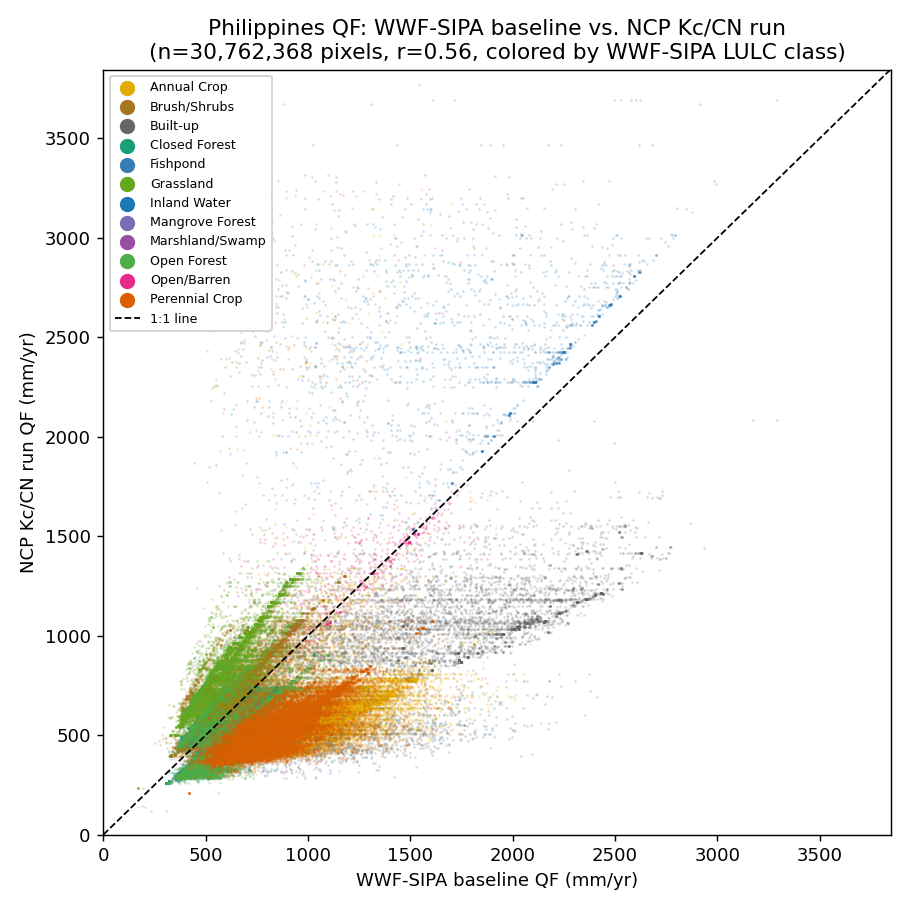
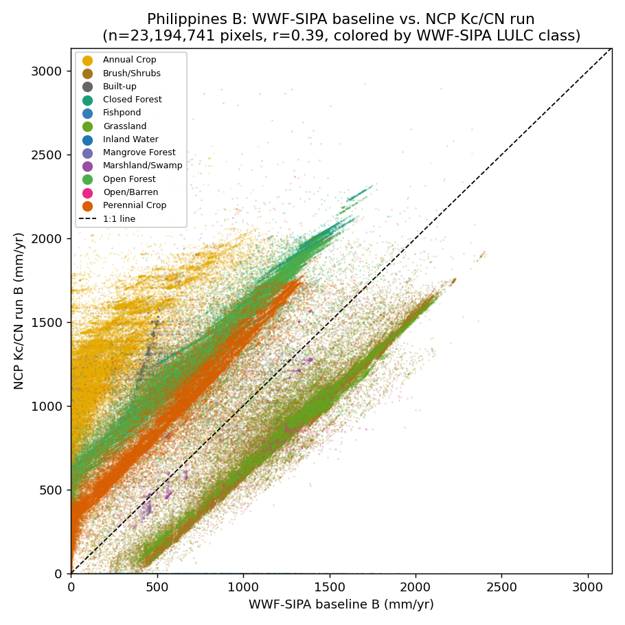
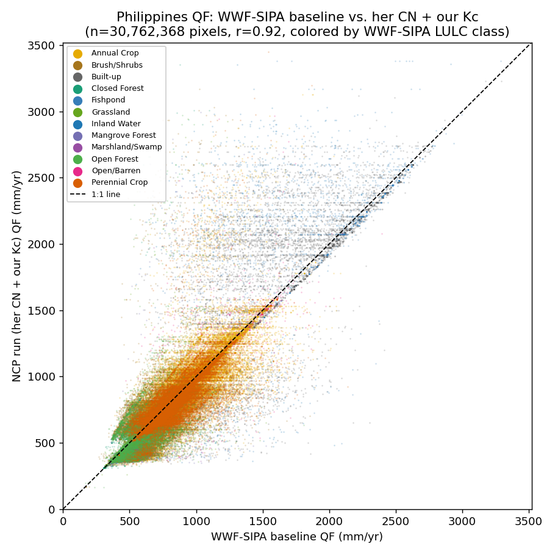
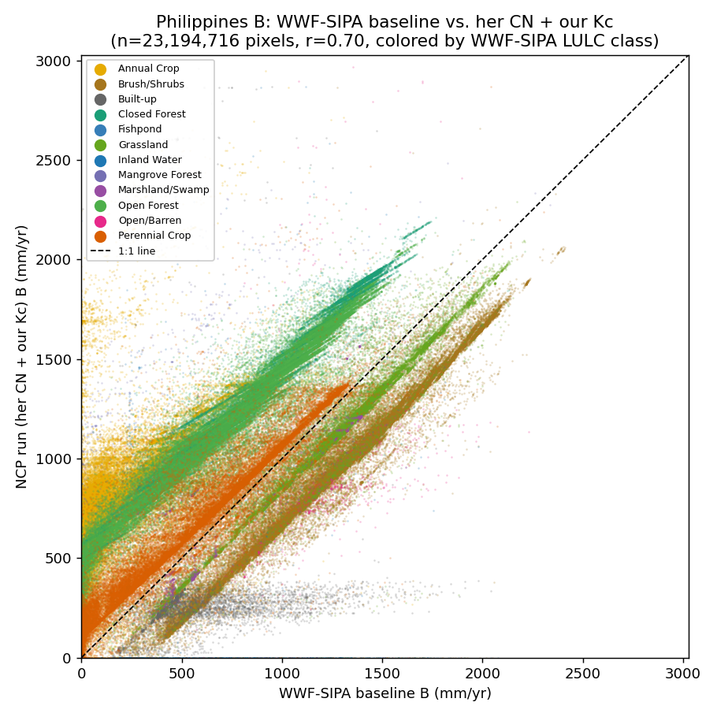
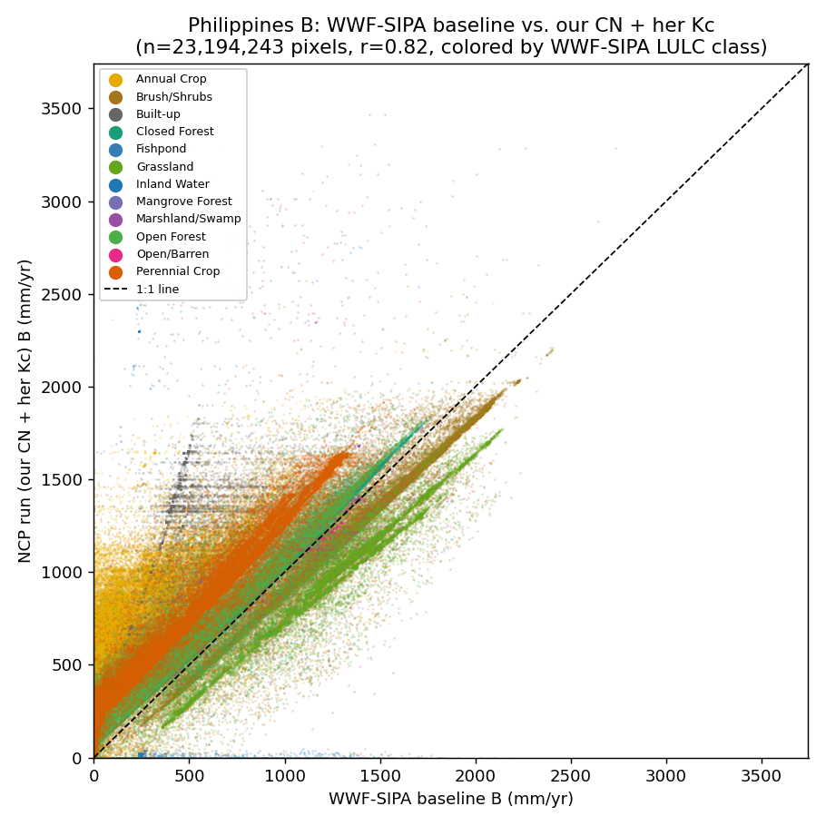
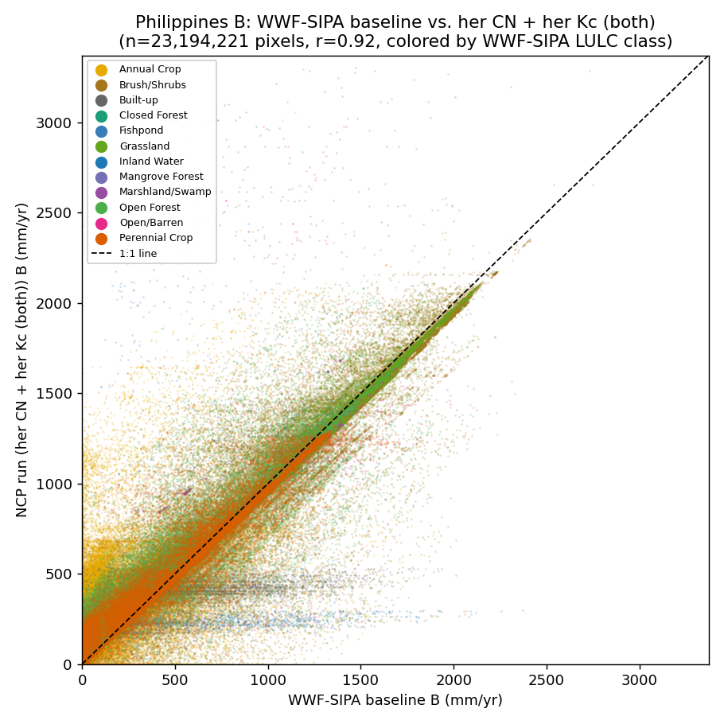

::: eyebrow
Global NCP — SWY Status Memo
:::

::: meta
Prepared by Jerónimo Rodríguez Escobar Global Science, WWF 
:::

::: {.report-footer style="margin-bottom: 1.5em;"}
**WWF-SIPA baseline** = the original Philippines run, WWF-SIPA's own Kc/CN parametrization. **NCP Kc/CN run** = this project's isolated-variable run — same inputs, this project's own Kc/CN substituted in.
:::

## Question

WWF-SIPA had already run this same model for the Philippines using their own CN and Kc values derived for that specific region. We built our own CN and Kc instead, from public, global, peer-reviewed sources (GCN250-style curve numbers, an EVI-based crop-coefficient regression), then ran the *same model*, keeping everything else equal (land cover, rainfall, soil, routing).

I wanted to check two things: **(1) is the pipeline running the model correctly? (2) if our results differ, can we say why?**

## Main outcome

**(1) The pipeline works.** When we feed our own pipeline WWF-SIPA's *exact* CN and Kc values — the only remaining difference is the DEM, used at a coarser resolution for speed — it reproduces the results almost exactly (r=0.92 for both quickflow and baseflow).

**(2) The gap is explained.** Quickflow, using this project's own CN/Kc, comes out at 77% of WWF-SIPA's value (r=0.56). The whole difference is explained by CN choice alone. Baseflow comes out at 148% of WWF-SIPA's and weakly correlated (r=0.39). This project's CN and Kc are both lower than WWF-SIPA's, and both push water *toward* recharge/baseflow rather than away from it (less runoff, less evapotranspiration), so a lower quickflow and a higher baseflow are an expected pair of outcomes.

I ran multiple validation checks (registration, resampling artifacts, grid alignment, valid-pixel coverage, a full parameter audit against WWF-SIPA's `.ini`) to rule out bugs.

This is a model-to-model comparison — this project's output against WWF-SIPA's output — not a comparison against anything observed. Right now I don't know whether SIPAs model has been validated as an accurate representation of Philippine hydrology, and how good as a benchmark are.

::: diagram-card
```{mermaid}
%%| label: fig-workflow-philippines-report
%%| fig-cap: "Philippines Kc/CN comparison: WWF-SIPA baseline vs. NCP Kc/CN run, both paths side by side."
%%{init: {'themeVariables': {'fontSize': '16px'}, 'flowchart': {'rankSpacing': 55, 'nodeSpacing': 35, 'padding': 15, 'subGraphTitleMargin': {'top': 10, 'bottom': 10}}}}%%
flowchart TD
    subgraph SHARED["Matched to WWF-SIPA's own configuration"]
        LULC["WWF-SIPA LULC<br/>12-class typology"]:::done
        PRECIP["Precipitation + ET0<br/>30-yr CMIP6 climatology"]:::done
        RAINEV["Real spatially-distributed rain events"]:::done
        SOIL["Hydrologic soil group<br/>raw ORNL DAAC HYSOGs250m"]:::done
    end

    subgraph BASELINE["WWF-SIPA baseline path"]
        BASECNKC["WWF-SIPA's own Kc/CN"]:::done
        BASERUN["WWF-SIPA baseline run<br/>complete, output shared"]:::done
    end

    subgraph NCPPATH["NCP Kc/CN path — the one deliberate difference"]
        DEM["NCP's own SRTMGL3 DEM, 90m<br/>grid-nested exactly to her grid"]:::done
        CROSSWALK["NCP Kc/CN: ESA-crosswalk CN<br/>+ EVI-regression Kc"]:::done
        NCPRUN["inspring.execute()<br/>complete"]:::done
    end

    subgraph FACTORIAL["Factorial decomposition"]
        SWAP["Swap CN/Kc independently<br/>through the same pipeline"]:::done
        ATTRIB["QF gap = CN alone (r=0.92)<br/>B gap = CN + Kc together (r=0.92)"]:::done
    end

    subgraph COMPARE["Direct comparison"]
        PIXEL["Pixel-wise comparison<br/>explicit valid-in-both mask"]:::done
        FINDING["No unexplained residual —<br/>entire gap traces to CN/Kc choice"]:::done
    end

    LULC --> BASECNKC
    LULC --> CROSSWALK
    PRECIP --> BASERUN
    PRECIP --> NCPRUN
    RAINEV --> BASERUN
    RAINEV --> NCPRUN
    SOIL --> BASERUN
    SOIL --> NCPRUN
    BASECNKC --> BASERUN
    DEM --> NCPRUN
    CROSSWALK --> NCPRUN
    BASERUN --> PIXEL
    NCPRUN --> PIXEL
    NCPRUN --> SWAP --> ATTRIB
    PIXEL --> FINDING
    ATTRIB --> FINDING

    classDef done fill:#c8e6c9,stroke:#2e7d32,color:#1b1b1b
```
:::

## Methodology

CN and Kc both come from a lucode-indexed table: CN from a hand-built crosswalk of WWF-SIPA's 12-class land cover onto GCN250 (Jaafar et al. 2019); Kc from a vegetation-index regression (Kamble et al. 2013), run on EVI to avoid NDVI's known saturation in dense canopy (Corbari et al. 2017; Glenn et al. 2011). As a result, forested classes get a substantially lower Kc than WWF-SIPA's flat 1.0. Every other input (LULC, precipitation, ET0, real rain events, hydrologic soil group, routing parameters) matches WWF-SIPA's own configuration; only CN and Kc are the deliberate variable under test. Full methodology, literature, and the CN crosswalk table: `docs/swy/swy_methods.qmd`.

**Still pending**:

- no tropical-specific CN correction (both runs share this gap).

- Kc uses a uniform vegetation-index regression rather than a region/hemisphere-aware FAO-56 crop calendar.

- Mangrove and flooded-grassland CN have no real literature basis.

## Comparison







## Decomposing the gap:

A small factorial: swap in WWF-SIPA's own CN alone, Kc alone, and both together, each through this project's own pipeline, everything else fixed.

| Combination                       | QF ratio |     QF r | B ratio |      B r |
|-----------------------------------|---------:|---------:|--------:|---------:|
| This project's CN + Kc            |     0.77 |     0.56 |    1.48 |     0.39 |
| WWF-SIPA's CN + this project's Kc |     0.99 | **0.92** |    1.27 |     0.70 |
| This project's CN + WWF-SIPA's Kc |     0.77 |     0.56 |    1.21 | **0.82** |
| WWF-SIPA's CN + Kc together       |     0.99 | **0.92** |    1.04 | **0.92** |









**QF's gap is essentially all CN.** CN alone reproduces SIPA QF almost exactly.

**B's gap is explained by CN and Kc together.** Correcting either one alone leaves a real, structured residual. Each land-cover class sits on its own line, but the different classes' lines are offset from each other and from the 1:1 line by different amounts. The last plot shows every class converging back onto the 1:1 line, r=0.92.

Baseflow depends on the water left over after both quickflow (CN) and evapotranspiration (Kc) are accounted for, so correcting only one still leaves the other's distortion in the water balance.

## Where this puts us — path to a global run

This exercise confirmed the pipeline is sound and fully attributed the observed gap to the CN/Kc choice. But it's a model-to-model comparison, not a validation against reality, so it doesn't by itself answer whether this project's global-product approach is *good enough* to run worldwide. Two separate tracks follow from that, and they don't depend on each other:

**Track A — known deficiencies worth fixing regardless of any validation outcome.** These aren't justified by this comparison; they're justified by other, independent literature that already checked them against real measurements:

| Gap | Status | Why fix it anyway |
|------------------------|------------------------|------------------------|
| No tropical-specific CN correction | Literature identified (Calero Mosquera et al. 2021; Fábrega et al. 2012), not yet integrated | Their own studies found standard CN overestimates tropical runoff — independent of what WWF-SIPA's Philippines numbers show |
| No region/hemisphere-aware crop calendar for Kc | Current method (VI-regression) is calendar-agnostic by construction | Corbari et al. (2017) *measured* real forest Kc lower than this regression predicts — an observational finding, not a model comparison |
| Mangrove / flooded-grassland CN | No usable literature found; structural mismatch between CN's rainfall-runoff premise and tidal/flood-pulse hydrology | Low-stakes here (mangrove is a terminal, tidal-outlet position) but flooded grasslands are often mid-basin and could bias routed results elsewhere (e.g. the Llanos) |

**Track B — real validation, a separate and harder undertaking.** Needs validation data. Has WWF-SIPA's own baseline been validated?

DEM sourcing (this test used this project's own SRTMGL3 by default, unconfirmed against WWF-SIPA's choice).

## Findings

Six real, reproducible bugs found in `springinnovate/inspring` while building this — verified against a fresh clone of current upstream, not stale complaints about already-fixed code (last commit touching the relevant file: 2025-02-11). Broken packaging (deleted `requirements.txt`, `setup.py` missing a subpackage), three bugs blocking real spatially-distributed rain events, and the nearest-neighbor resampling bug behind this week's checkerboard chase. Plus one genuinely useful undocumented feature: a per-pixel CN/Kc/root_depth raster-override path, with a real nodata-handling bug of its own. Full detail, proposed fixes, and draft GitHub issues: `docs/swy/inspring_github_issues_draft.md`.

## Open items

| \# | Item |
|------------------------------------|------------------------------------|
| 1 | Confirm with WWF-SIPA whether the DEM assumption (SRTM) is correct |
| 2 | Investigate why aggregated `vri_sum` reads exactly 0.0 |
| 3 | Region-correct FAO-56 cropland Kc and build a tropical CN correction — the two real prerequisites for scaling beyond this one test case |
| 4 | Send this write-up to WWF-SIPA |

## References

Corbari, C., Ravazzani, G., Galvagno, M., Cremonese, E., & Mancini, M. (2017). Assessing Crop Coefficients for Natural Vegetated Areas Using Satellite Data and Eddy Covariance Stations. *Sensors*, 17(11), 2664.

Glenn, E. P., Neale, C. M. U., Hunsaker, D. J., & Nagler, P. L. (2011). Vegetation Index-Based Crop Coefficients to Estimate Evapotranspiration by Remote Sensing in Agricultural and Natural Ecosystems. *Hydrological Processes*, 25(26), 4050–4062.

Jaafar, H. H., Ahmad, F. A., & El Beyrouthy, N. (2019). GCN250, New Global Gridded Curve Numbers for Hydrologic Modeling and Design. *Scientific Data*, 6, 145.

Kamble, B., Kilic, A., & Hubbard, K. (2013). Estimating Crop Coefficients Using Remote Sensing-Based Vegetation Index. *Remote Sensing*, 5(4), 1588–1602.

Calero Mosquera, D., Hoyos Villada, F., & Torres Prieto, E. (2021). Runoff Curve Number (CN Model) Evaluation Under Tropical Conditions. *Earth Sciences Research Journal*, 25(4), 397–404.

Fábrega, D. (2012). Rainfall–CN (Curve Number) Relationships in a Tropical Rainforest Microbasin Within the Panamá Canal Watershed. *Earth Sciences Research Journal*.

Ross, C. W., Prihodko, L., Anchang, J. Y., Kumar, S. S., Ji, W., & Hanan, N. P. (2018). Global Hydrologic Soil Groups (HYSOGs250m) for Curve Number-Based Runoff Modeling. *ORNL DAAC*.

::: report-footer
Full technical detail, chronological reasoning, and every fix along the way: `docs/swy/research_notes.md`. Permanent methods reference: `docs/swy/swy_methods.qmd`.
:::