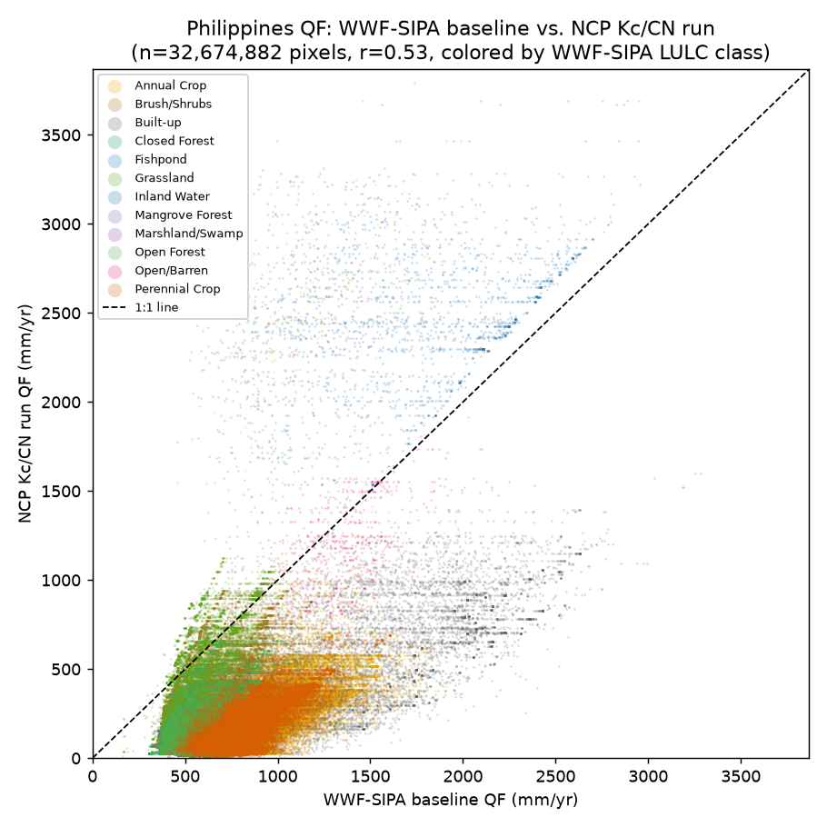
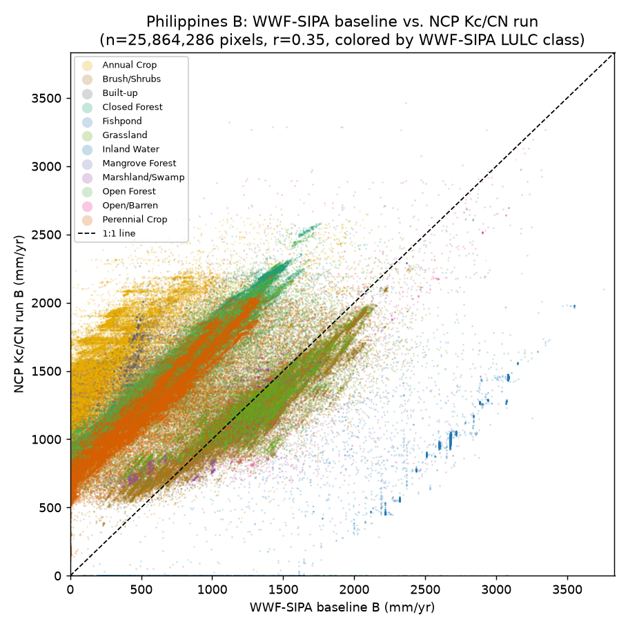

<div class="eyebrow">Global NCP — SWY Status Memo</div>
<div class="meta">
  <span>Prepared by Jerónimo Rodríguez Escobar</span>
  <span>Global Science, WWF</span>
  <span></span>
</div>

<div class="report-footer" style="margin-bottom: 1.5em;">
**WWF-SIPA baseline** = the original Philippines run, WWF-SIPA's own Kc/CN parametrization.
**NCP Kc/CN run** = this project's isolated-variable run — the same WWF-SIPA inputs (LULC, climate
stack), this project's own Kc/CN substituted in.
</div>

## Where we stand

::: {.findings}
::: {.finding}
**This is a new model run, not a table update.** SWY has not been run globally yet, because a
single global calibration isn't feasible. Producing an output means assembling every real input
and running the model from scratch.
:::
::: {.finding}
**CN and Kc come only from the lucode-indexed CSV biophysical table** — `inspring` has no
raster-override capability for either factor; that is the only path this codebase offers. Three
real bugs live in `inspring` itself: a dead `root_depth` parameter, and two in the
`user_defined_rain_events_dir` code path (one patched, one still open — see "Findings for Rich"
below).
:::
::: {.finding}
**The Philippines comparison is complete, and the result is a real, substantial gap between the
two runs that is not a uniform shift.** The gap varies too much by land-cover class to have one
single cause, and one variable (baseflow) flips direction entirely between the two runs. See
below.
:::
:::

## Question

> Is this project's own CN/Kc parametrization, built from public, peer-reviewed global products,
> close to — or meaningfully different from — an existing, independently-built regional
> parametrization (WWF-SIPA's own Philippines baseline)? And if different, is the difference
> explainable by one factor or several?

## Curve number: the harder parameter, and where the gap actually is

InVEST's own documentation is explicit that there's no global shortcut for CN — it depends on soil
group, cover type, and moisture condition, and region-specific values are preferred over blanket
defaults. **GCN250** solves the bulk of this: a purpose-built, peer-reviewed global CN product
combining land cover and soil hydrologic group. Its own authors are candid that it differentiates by
land-cover granularity, not by region-specific values *within* one land-cover class — and that the
underlying method is least validated in forested/humid environments, which is exactly this
project's LAC focus.

| Biome | Status |
|---|---|
| Tropical moist broadleaf forest | Real candidate literature found (Calero Mosquera et al. 2021, Fábrega et al. 2012) — both directly confirm the standard method overestimates runoff under tropical conditions. Patch is buildable. |
| Mangroves | No usable literature found after three separate search passes — documented as a structural limitation of the CN method rather than an unfilled literature gap: these are **tide-flooded** systems, and CN's rainfall-runoff premise doesn't describe what's driving water movement here. Low-stakes for this comparison specifically — see the Philippines section below. |
| Flooded grasslands / savannas | Same missing-CN-number problem, but a **different mechanism**: these are **river-overflow-flooded** (seasonal inundation), not tidal. Same underlying failure mode as mangroves — a flood-pulse-dominated system CN's premise wasn't built for — just a different flood driver. The Colombian Llanos is the real, motivated test case for this specifically. |

: {.results}

::: {.validation-note}
CN is close to the dominant source of variance in this model's output, not a minor calibration
knob: in Hamel et al. (2020)'s own sensitivity analysis, quickflow changed by **factors of
10–13×** between antecedent-moisture CN settings in one basin — a real candidate explanation for
the gap in the comparison below.
:::

::: {.validation-note}
`inspring`'s SWY implementation takes CN only from the lucode-indexed CSV biophysical table, the
same convention as stock InVEST — there is no raster-override path. GCN250 being a per-pixel
product doesn't change that; using it here means computing a per-lucode-class CN value, a real
resolution cost the table format imposes.
:::

## Crop coefficient: a real open question, not a solved one

The pipeline computes Kc uniformly for all vegetated classes via a linear NDVI/EVI regression
(Kamble et al. 2013: `Kc = 1.457×VI − 0.1725`). A direct, well-grounded objection was raised early
on: **Kamble's regression was calibrated entirely on agricultural crops** (US High Plains cropping
systems), never on forest, grassland, or any natural vegetation — applying it to forest is an
extrapolation outside its validated domain, not a like-for-like use. The specific mechanism:
**NDVI saturates in dense canopy** (around LAI≈3), so a linear fit built on agricultural NDVI
ranges could underestimate Kc once extrapolated to saturated forest NDVI.

Checked against two more sources:

- **Corbari et al. (2017)** measured real Kc at four eddy-covariance sites (pasture, deciduous
  forest, evergreen conifer forest — none tropical). Result: measured forest Kc came in **lower**
  than standard FAO/LAI-based assumptions, not higher. Even their highest real-measured forest
  value is less than half what the Kamble regression predicts at forest-level NDVI (~0.85–0.90 →
  Kc≈1.07–1.14) — a sizeable discrepancy worth flagging regardless of which direction is ultimately
  right.
- **Glenn et al. (2011)** confirms the saturation mechanism directly: NDVI saturates around
  LAI≈3, EVI/SAVI don't, and EVI is established in this literature as better-correlated with
  ground-measured ET for dense canopy specifically because of this.

**Switched from NDVI to EVI for the Philippines comparison** (same MOD13A3.061 product, different
layer — no new data source needed). Closed Forest Kc, computed via EVI, comes out at 0.52–0.70
through the year — well below the WWF-SIPA baseline's flat 1.0, and in the same direction as
Corbari et al.'s real measurements. See below.

Unrelated to the above, still true: **cropland Kc** uses the same VI-based regression rather than
FAO-56 (no region-correct crop calendar built yet). **Non-vegetated** classes (water, wetlands,
bare soil, built) use fixed values from InVEST's own guidance, unaffected by any of the above.

## Philippines comparison — WWF-SIPA's own inputs, isolated-variable test

The comparison uses WWF-SIPA's own Philippines baseline inputs directly
(`data/swy/philippines/INPUTS_SP/`, 1.7GB) — the WWF-SIPA DEM (assumed SRTM, not actually
delivered — still needs confirmation), the WWF-SIPA LULC, the WWF-SIPA real 30-year CMIP6 climate
stack — with this project's own Kc/CN substituted in. This design was chosen specifically so the
comparison isolates the Kc/CN parametrization rather than also differing in climate inputs (an
earlier from-scratch approach using this project's own single-year CHIRPS/TerraClimate/MODIS 2020
data would not have been directly comparable to WWF-SIPA's 30-year climatology).

::: {.diagram-card}
```{mermaid}
%%| label: fig-workflow-philippines-report
%%| fig-cap: "Philippines Kc/CN comparison: WWF-SIPA baseline vs. NCP Kc/CN run, both paths side by side."
%%{init: {'themeVariables': {'fontSize': '16px'}, 'flowchart': {'rankSpacing': 55, 'nodeSpacing': 35, 'padding': 15, 'subGraphTitleMargin': {'top': 10, 'bottom': 10}}}}%%
flowchart TD
    subgraph SHARED["Reused directly from the WWF-SIPA INPUTS_SP folder, 2026-09-14"]
        LULC["WWF-SIPA LULC<br/>12-class typology, UTM 32651<br/>reprojected to WGS84 for the NCP run"]:::done
        PRECIP["Precipitation<br/>30-yr CMIP6 climatology (1985-2014, p50)"]:::done
        ET0["ET0<br/>Global-AI_PET_v3 / CGIAR-CSI"]:::done
        RAINEV["Real spatially-distributed rain events<br/>monthly rasters"]:::done
    end

    subgraph BASELINE["WWF-SIPA baseline path — already run, output shared earlier"]
        BASECNKC["WWF-SIPA's own Kc/CN<br/>biophysical_template_PH_revised.csv<br/>+ CN_A-D raster overrides"]:::done
        BASERUN["WWF-SIPA baseline run<br/>completed earlier, output shared 2026-09-14"]:::done
    end

    subgraph NCPPATH["NCP Kc/CN path — this project, 2026-09-14/15"]
        DEM["NCP's own SRTMGL3 DEM<br/>not in WWF-SIPA inputs — assumed,<br/>still needs confirmation"]:::progress
        CROSSWALK["NCP Kc/CN biophysical table<br/>hand-built 12-class to ESA CN crosswalk<br/>plus EVI-regression Kc<br/>07b_build_biophysical_table_becky_inputs.py"]:::done
        PLACEHOLDER["Flat 18-events/month placeholder<br/>real product blocked — 2 inspring bugs,<br/>one patched, one deliberately deferred"]:::blocked
        NCPRUN["inspring.execute()<br/>NCP Kc/CN run<br/>COMPLETE, 2026-09-14/15"]:::done
    end

    subgraph COMPARE["Direct comparison, 2026-09-15"]
        PIXEL["Pixel-wise comparison<br/>WWF-SIPA resampled to NCP's coarser grid"]:::done
        MAPS["Interactive map + scatter plots<br/>colored by WWF-SIPA LULC class"]:::done
        FINDING["Finding: QF ratio 0.20-1.31 by class,<br/>non-uniform — CN/Kc a real contributor<br/>B flips direction entirely — unexplained"]:::done
    end

    LULC --> BASECNKC
    LULC --> CROSSWALK
    PRECIP --> BASERUN
    PRECIP --> NCPRUN
    ET0 --> BASERUN
    ET0 --> NCPRUN
    RAINEV --> BASERUN
    RAINEV -.-> PLACEHOLDER
    BASECNKC --> BASERUN
    DEM --> NCPRUN
    CROSSWALK --> NCPRUN
    PLACEHOLDER --> NCPRUN
    BASERUN --> PIXEL
    NCPRUN --> PIXEL
    PIXEL --> MAPS --> FINDING

    subgraph LEGEND["Legend"]
        direction LR
        LDONE["Done"]:::done
        LPROG["In progress / unconfirmed"]:::progress
        LBLOCK["Blocked"]:::blocked
    end

    classDef done fill:#c8e6c9,stroke:#2e7d32,color:#1b1b1b
    classDef progress fill:#fff9c4,stroke:#f9a825,color:#1b1b1b
    classDef blocked fill:#ffcdd2,stroke:#c62828,color:#1b1b1b
```
:::

Full detail in `docs/swy/swy_methods.qmd`'s "Test design: Philippines" section:

- The WWF-SIPA LULC is a custom 12-class typology, not ESA CCI — crosswalked by hand to this
  project's own ESA-keyed CN table.
- Closed Forest Kc, recomputed via this project's own EVI-regression method instead of the
  WWF-SIPA flat per-class value, comes out substantially lower (0.52–0.70 vs. flat 1.0) —
  independent evidence in the same direction as Corbari et al. (2017)'s real forest Kc
  measurements discussed above.
- The WWF-SIPA LULC is in UTM meters; every other input is WGS84 degrees — reprojected before the
  run. The real WWF-SIPA rain-events product hit two `inspring` bugs (see "Findings for Rich"
  below), so this run uses a flat placeholder instead. ET0 filenames were normalized before the
  run (a casing inconsistency would otherwise have scrambled month order).

**Model run status: COMPLETE.** Full spatial coverage, exit code 0. Headline numbers: QF mean
257.3mm/yr, AET mean 834.6mm/yr, aggregate `qb` 1321.0mm/yr — all physically plausible, and `qb`
lands in the same order of magnitude as this project's earlier Borneo test run's own aggregate
(1705mm/yr, kept here only as a brief cross-basin sanity check, not a detailed comparison). A
flow-accumulation anomaly recurs here too (11.5% of `L_sum` pixels show runaway values), worse
than the ~5% seen in the Borneo run — consistent with, not proof of, a flat-tidal-coastal-terrain
hypothesis, since an archipelago has far more coastline per unit area than a single landmass. One
new, unexplained item: the aggregated `vri_sum` field reads exactly 0.0 — flagged, not yet
investigated. Full numbers and the water-balance sanity check are in `swy_methods.qmd`.

## NCP Kc/CN run output and WWF-SIPA comparison — interactive preview

The WWF-SIPA project's own baseline output was already shared with this project
(`data/swy/philippines/rich_shared/workspace_swy_wwf_PH_baseline_historical_climate/`). QF and B
below compare it against the NCP run pixel-for-pixel, not just report the NCP numbers in
isolation; AET and L_sum have no WWF-SIPA counterpart to compare against (that output was never
saved on their side), so they're included as NCP-run-only layers, toggleable but outside the
click-to-compare popup.



::: {.validation-note}
**The gap is real and substantial, and it is not a uniform shift.** Aggregate: WWF-SIPA QF mean
732.8mm/yr vs. NCP 257.3mm/yr (NCP is ~35% of the WWF-SIPA value); WWF-SIPA B mean 653.1mm/yr vs.
NCP 1333.6mm/yr (NCP is ~177% of the WWF-SIPA value — the *opposite* direction from QF). Pixel-wise
correlation is moderate, not strong (QF r=0.53, B r=0.35).

**Broken down by the WWF-SIPA LULC class, the NCP/WWF-SIPA ratio varies far too much to be one
uniform cause** (QF ratio ranges from 0.195 for Marshland/Swamp to 1.307 for Inland Water; B ratio
ranges from 0.408 for Fishpond to 5.526 for Annual Crop). A single spatially-flat swap — like this
run's rain-events placeholder, which has zero spatial variation by construction — would be
expected to produce something closer to a uniform multiplicative shift across land-cover types.
This pattern argues the CN/Kc crosswalk differences (which genuinely do vary by class — see the
crosswalk table in `swy_methods.qmd`) are contributing real, class-specific variance on top of
whatever the rain-events substitution contributes uniformly. **Not a clean isolated-variable
result** — several things changed at once (Kc, CN, rain events, resolution), and this comparison
can't yet cleanly separate their individual contributions.

**B's direction-reversal is the most surprising single finding here.** QF is lower in the NCP run
almost everywhere, but B is higher in the NCP run almost everywhere — opposite directions.
Candidate explanations, none confirmed: the ~11.5% `L_sum` flow-accumulation anomaly in the NCP
run could be systematically inflating routed quantities like B; or a real difference in local
recharge (`L`) between the two runs, not directly checkable since the WWF-SIPA saved output has no
`L` raster, only `L_avail`. Open item — see below.
:::





## Findings for Rich, from actually trying to build and run `inspring`

Concrete and reproducible, not "it didn't work":

1. **`inspring`'s own `Dockerfile` fails immediately** on `pip3 install -r requirements.txt` —
   that file was deleted from the repo in 2022 and never replaced.
2. **`setup.py`'s `packages` list omits `inspring.seasonal_water_yield`** — a normal `pip install
   .` compiles the Cython extension but the Python module itself isn't importable afterward.
   Worked around (not fixed upstream) via `python setup.py build_ext --inplace` + `PYTHONPATH`
   pointed at the source tree directly.
3. **In `seasonal_water_yield.execute()`, `interpolate_list` is sized before the
   `user_defined_rain_events_dir` block extends the alignment lists by 12 more rasters** — any
   call using that parameter (real, spatially-distributed rain events instead of a flat
   placeholder table) crashes immediately with a length-mismatch error. Patched via a small source
   patch applied during the Docker image build.
4. **A second bug in the same code path, not patched**: `n_events_path_list` is built from bare
   filenames (no directory prefix) and that same list is reused as both the alignment *input* and
   *output* target — a naive fix risks `align_and_resize_raster_stack` writing reprojected rasters
   back out on top of the original source files. Real feature-completion work, not a one-line fix.
   This project's Philippines comparison run uses a flat rain-events placeholder instead of the
   real WWF-SIPA product as a direct result.
5. The *current* upstream `ecoshard` (not an older pinned fork commit) works fine — its bundled
   `ecoshard.geoprocessing` (with `routing`) and `ecoshard.taskgraph` have the API `inspring`
   expects.
6. This project's own existing Docker image already had everything `inspring` actually needs —
   built on top of that rather than `inspring`'s own broken Dockerfile.

Items 1, 2, and 3 are small, well-scoped, non-scientific fixes — real candidates for a short PR
back to `springinnovate/inspring`, not yet attempted. Item 4 needs a real design decision before
it's PR-ready.

## Open items

| # | Item | Blocked on |
|---|---|---|
| 1 | Confirm with WWF-SIPA whether the DEM assumption (standard SRTM) is correct | Awaiting reply |
| 2 | Get the real WWF-SIPA rain-events product working (blocked on Findings-for-Rich item 4) | Real feature-completion work on `inspring`, not yet done |
| 3 | Explain the B (baseflow) direction-reversal between the two runs | Real diagnostic work, not yet started |
| 4 | Investigate why aggregated `vri_sum` reads exactly 0.0 | Real diagnostic work, not yet started |
| 5 | Obtain and read Juarez et al. (2008), Amazonia — the only tropical-forest Kc-VI precedent found so far | Not yet obtained |
| 6 | Investigate the L_sum flow-accumulation anomaly (11.5% of pixels here, ~5% in the earlier Borneo run) — plausibly SRTM noise in flat tidal terrain | Real diagnostic work, not blocking the headline "it runs" finding |
| 7 | Region-correct FAO-56 cropland Kc (current run uses the VI regression uniformly instead) | Crop-calendar research |
| 8 | Mangrove / flooded-grassland CN patch — needs a documented position | Internal decision; low-stakes for this specific comparison (see the Philippines section) |
| 9 | Send the results write-up to WWF-SIPA | Draft ready, review in progress |

: {.terms tbl-colwidths="[10,60,30]"}

## References

Allen, R. G., Pereira, L. S., Raes, D., & Smith, M. (1998). *Crop Evapotranspiration — Guidelines
for Computing Crop Water Requirements*. Food and Agriculture Organization of the United Nations.
[http://www.fao.org/3/X0490E/x0490e0b.htm](http://www.fao.org/3/X0490E/x0490e0b.htm)

Calero Mosquera, D., Hoyos Villada, F., & Torres Prieto, E. (2021). Runoff Curve Number (CN Model)
Evaluation Under Tropical Conditions. *Earth Sciences Research Journal*, 25(4), 397–404.

Corbari, C., Ravazzani, G., Galvagno, M., Cremonese, E., & Mancini, M. (2017). Assessing Crop
Coefficients for Natural Vegetated Areas Using Satellite Data and Eddy Covariance Stations.
*Sensors*, 17(11), 2664. [https://doi.org/10.3390/s17112664](https://doi.org/10.3390/s17112664)

Fábrega, D. (2012). Rainfall–CN (Curve Number) Relationships in a Tropical Rainforest Microbasin
Within the Panamá Canal Watershed. *Earth Sciences Research Journal*.
[http://www.scielo.org.co/scielo.php?script=sci_arttext&pid=S0120-62302012000100017](http://www.scielo.org.co/scielo.php?script=sci_arttext&pid=S0120-62302012000100017)

Glenn, E. P., Neale, C. M. U., Hunsaker, D. J., & Nagler, P. L. (2011). Vegetation Index-Based Crop
Coefficients to Estimate Evapotranspiration by Remote Sensing in Agricultural and Natural
Ecosystems. *Hydrological Processes*, 25(26), 4050–4062.
[https://doi.org/10.1002/hyp.8392](https://doi.org/10.1002/hyp.8392)

Guswa, A. J., Hamel, P., & Meyer, K. (2018). Curve Number Approach to Estimate Monthly and Annual
Direct Runoff. *Journal of Hydrologic Engineering*, 23(2).
[https://doi.org/10.1061/(ASCE)HE.1943-5584.0001606](https://doi.org/10.1061/(ASCE)HE.1943-5584.0001606)

Hamel, P., Valencia, J., Schmitt, R., Shrestha, M., Piman, T., Sharp, R. P., Francesconi, W., &
Guswa, A. J. (2020). Modeling Seasonal Water Yield for Landscape Management: Applications in Peru
and Myanmar. *Journal of Environmental Management*, 270, 110792.
[https://doi.org/10.1016/j.jenvman.2020.110792](https://doi.org/10.1016/j.jenvman.2020.110792)

Kamble, B., Kilic, A., & Hubbard, K. (2013). Estimating Crop Coefficients Using Remote
Sensing-Based Vegetation Index. *Remote Sensing*, 5(4), 1588–1602.

Mandle, L., Wolny, S., Bhagabati, N., Helsingen, H., Hamel, P., Bartlett, R., & De Mel, M. (2017).
Assessing Ecosystem Service Provision Under Climate Change to Support Conservation and Development
Planning in Myanmar. *PLOS ONE*, 12(9), e0184951.
[https://doi.org/10.1371/journal.pone.0184951](https://doi.org/10.1371/journal.pone.0184951)

<div class="report-footer">
Full chronological research log, with the reasoning behind each decision:
<code>docs/swy/research_notes.md</code>. Permanent methods reference, kept current with every
finding above: <code>docs/swy/swy_methods.qmd</code>.
</div>
