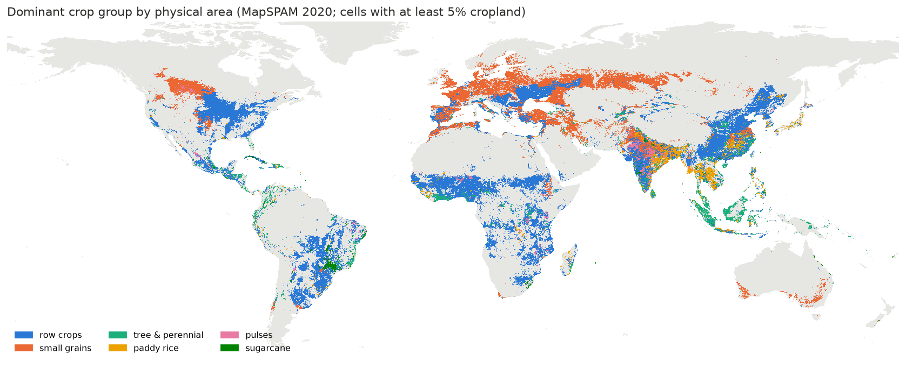
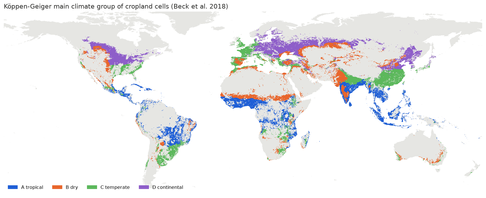

# SWY global run: cropland parameterization plan (draft, 2026-09-25)

Proposal for how CN and Kc could be set for cropland in a global Seasonal Water Yield run, based on
the Philippines comparison against WWF-SIPA's run. Draft for discussion with Becky; nothing here
is built beyond the scoping step.

## What the Philippines comparison established

- **The pipeline is sound.** WWF-SIPA's own CN and Kc, run through this pipeline at 90m, reproduce
  their 30m run (r=0.92 for quickflow and baseflow). That run is the reference for everything below.
- **Global data gets most classes close.** With GCN250 CN and per-pixel monthly Kc from published
  calibrations (Negrón Juárez 2008 forest, Oliveira 2015 grassland/shrub, Kamble 2013 on NDVI
  elsewhere), baseflow is 1.06x the reference overall; forest is about 1.3x, most other classes
  closer.
- **The error concentrates in cropland, and there it's mostly CN.** Annual crop (mostly paddy rice)
  baseflow is 2.28x the reference. Swapping in WWF-SIPA's CN alone brings it to 1.25x; swapping in
  their Kc alone, to 1.91x. Their annual crop CN (67/78/85/89) is the TR-55 row-crop value; GCN250
  cropland is about 10 points lower, rainfed or irrigated.
- **Cropland Kc scales globally already.** A paddy Kc built from the FAO-56 rice curve, the Sacks
  et al. (2010) planting calendar and MapSPAM rice share brings annual crop Kc from 0.81 to 0.88
  (WWF-SIPA: 0.91). All three sources are global.

## Why not a universal calibrated parameter set

The CN literature is mostly site calibrations (e.g. Yu et al. 2025 on Chinese slope plots; Calero
Mosquera 2021 and Fábrega 2012 in the tropics). Each tells us how far the handbook tables can be
off at a place; they don't combine into a global product. The plan below uses them as test cases
for a simple global table, not as inputs to it.

## Proposed approach

1. **Global defaults** for all land: GCN250 CN with HYSOGs250m soil groups; per-pixel monthly Kc
   from satellite vegetation indices with the best-matching published calibration per land-cover
   type (as in the Philippines run).
2. **A cropland lookup table** keyed by climate × crop group × water regime:

   | Key | Source | Classes |
   |---|---|---|
   | Climate | Köppen-Geiger 1km (Beck et al. 2018) | 4 main groups with cropland (A tropical, B dry, C temperate, D continental); subgroups only where needed |
   | Crop group | MapSPAM 2020, 46 crops | 6 groups: row crops, small grains, tree & perennial, paddy rice, pulses, sugarcane |
   | Water regime | MapSPAM irrigated / rainfed layers (not downloaded yet) | rainfed, irrigated, paddy |

   - **CN per cell:** start from the matching TR-55 cropland row (row crops / small grain /
     close-seeded legumes; treatment and hydrologic condition), apply climate adjustments where
     literature supports them, and give paddy its own entry (bunded, flooded fields store water
     that the standard tables don't account for).
   - **Kc per crop:** FAO-56 crop curves placed by the Sacks calendar per pixel, climate-adjusted
     mid-season Kc (FAO-56's humidity/wind correction), gaps in the calendar filled by climate zone.
   - **Per pixel:** CN and Kc are blended by MapSPAM crop share, as in the Philippines paddy test,
     and passed to inspring as per-pixel rasters (the raster-override route already in use).
3. **Sensitivity range instead of a single answer:** run with low and high CN/Kc per cell and
   report how much outputs move. Because the paper reports change between periods, test whether
   the change signal holds across that range; a consistent parameter bias partly cancels in a
   difference.
4. **Validation cells:** each site study and each regional run (WWF-SIPA's Philippines run first)
   becomes a check of the table's prediction against measured or independently-parameterized
   runoff.

## Scoping result: the table is small

MapSPAM 2020 crop area overlaid on Köppen main groups (`Python_scripts/swy_global_scoping/`),
1,274 Mha of crop physical area:

- **9 climate × crop cells cover 80% of global crop area, 12 cover 90%** (4 climate groups ×
  6 crop groups; 41 cells at the 30-class Köppen level for 90%).
- Largest cells: tropical row crops (181 Mha), temperate, dry and continental row crops (142-148
  Mha each), continental and dry small grains (115 and 101 Mha), tropical tree crops (84 Mha),
  temperate small grains (81 Mha), tropical paddy rice (61 Mha).
- Paddy rice is about 8% of global crop area (109 Mha physical), almost all tropical and
  temperate, and dominant exactly where the Philippines error came from.

Caveats: "row crops" is a broad group (maize, soy, cassava, vegetables…) that may need splitting;
"paddy rice" includes upland rice until the irrigated/rainfed split is in; the climate key is the
cell's majority Köppen class at 5 arcmin.

## Steps, in order

1. Download MapSPAM's irrigated/rainfed layers; rerun the scoping with water regime as the third key.
2. Fill the ~12 largest cells with TR-55-based CN and FAO-56 Kc parameters, with a stated range per
   cell; leave the rest at defaults with wide ranges.
3. Build the per-pixel CN/Kc raster generator (generalizing `07g`/`07h`), test it on the
   Philippines against the reference.
4. Pick 2-3 more test regions with independent runs or measured runoff, one per major climate group.
5. Sensitivity runs; check whether the between-period change signal is robust.

## Questions for Becky

- Is this the level of accuracy the global run needs, or is a specific use case driving a tighter
  target?
- Does WWF-SIPA (or another group) have regional runs elsewhere we could use as test cases?
- Where did WWF-SIPA's crop CN and Kc come from, and how did they treat paddy?
