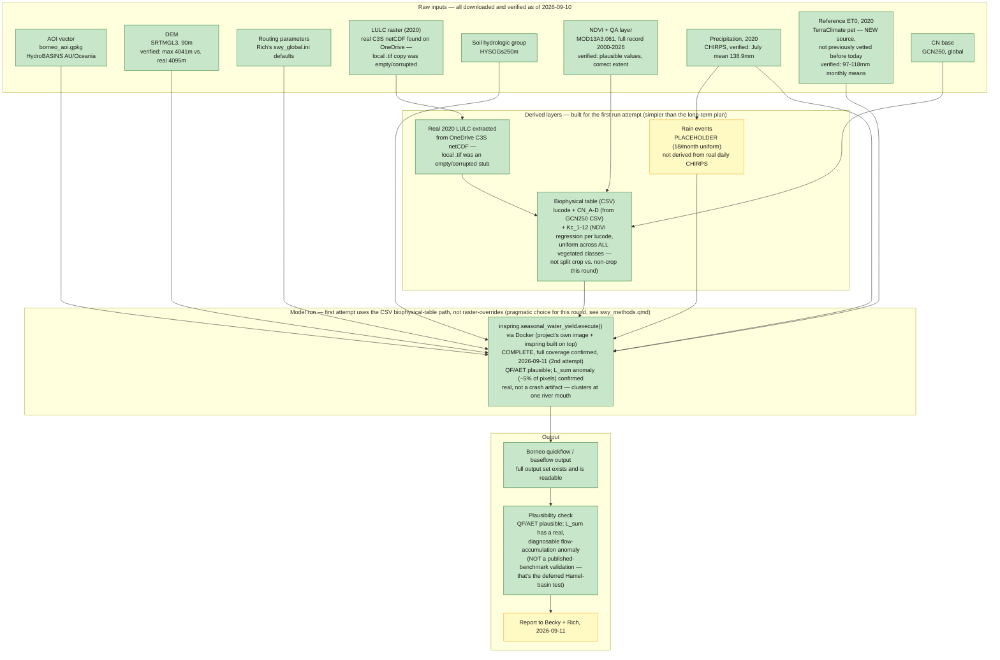

# SWY Borneo test: workflow and status

Working diagram for the whole Borneo SWY pipeline, kept current as things move. Status colors:
🟩 done · 🟨 in progress / partial · 🟥 not started or blocked. Update this alongside `HANDOFF.md`
and `research_notes.md` rather than letting it drift — this is the map, those are the log.

## Reading the current bottleneck (updated 2026-09-11)

**Every raw input is downloaded and content-verified**, and **the first actual model run has been
submitted** — see `Python_scripts/swy_borneo_run/` for the full, consolidated, re-runnable
pipeline (scripts 01-09) and its `README.md` for the exact known compromises in this run. Check
`docs/swy/research_notes.md`'s latest entry for the real outcome before assuming success or
failure either way.

**What changed from the raster-override plan described earlier in this file's history**: for
this first attempt, the simpler CSV `biophysical_table_path` was used instead of `inspring`'s
raster-override args (`cn_a/b/c/d_path`, `kc_1...12_path`) — already fully built, lower risk for
a first pass under real time pressure. The Kc regression was applied uniformly across all
vegetated classes (including cropland) rather than splitting cropland out to FAO-56, since
region-correct crop-calendar timing isn't built yet — a real, documented simplification, not an
oversight. The raster-override path remains the architecturally better long-term approach (see
`swy_methods.qmd`) and biome-specific CN patches (tropical forest buildable; mangroves and
flooded savannas still open gaps) are worth layering on in a follow-up round — neither was a
blocker Becky set for this test.

**Real environment finding along the way**: `inspring`'s own Dockerfile is broken (missing
`requirements.txt`, confirmed by actually running the build) and its `setup.py` has a real
packaging bug (`inspring.seasonal_water_yield` missing from the `packages` list). Both worked
around, not fixed upstream — real candidates for a small PR back to Rich later. This project's
own existing Docker image already had everything needed to build `inspring` once bypassing its
own broken Dockerfile.

## Philippines comparison — WWF-SIPA baseline vs. NCP Kc/CN run

**Pipeline diagram (both paths side by side): `docs/swy/workflow_philippines.md`** — kept as its
own file rather than a second diagram in this one, so the Borneo-focused status report and the
Philippines-focused one can each embed only the diagram relevant to them.

The ask: reuse the WWF-SIPA project's real Philippines baseline inputs (LULC, 30-year CMIP6
climate stack) but swap in this project's own Kc/CN methodology — an isolated-variable comparison,
not a from-scratch rebuild. Its `INPUTS_SP/` folder (1.7GB) landed 2026-09-14 evening. Full
methodology, the CN crosswalk table, and the real Kc finding (forest Kc from EVI regression comes
in well below the WWF-SIPA flat per-class values, same direction as @corbari2017's real
measurements) are in `swy_methods.qmd`'s "Test design: Philippines" section — this entry tracks
pipeline status only.

Real problems found and fixed same day, each documented in `swy_methods.qmd` and (for the two
`inspring` bugs) `Python_scripts/swy_borneo_run/Dockerfile`:

- The WWF-SIPA LULC uses a custom 12-class typology, not ESA CCI — confirmed, crosswalked by hand.
- CRS mismatch (that LULC in UTM 32651 meters; everything else WGS84 degrees) — `inspring`'s own
  alignment step doesn't reproject across CRSs; fixed by reprojecting it first.
- Two real upstream `inspring` bugs in the `user_defined_rain_events_dir` code path — one patched
  (Dockerfile), one deferred (real data-loss risk if rushed) — this run uses the flat placeholder
  rain-events table instead of the real WWF-SIPA spatially-distributed product as a result.
- ET0 filename casing bug (`et0_v3_0X.tif` vs `et0_V3_0X.tif`) would have silently scrambled month
  order — fixed via a normalized staging copy.

**Status: COMPLETE, 2026-09-14 late evening, full spatial coverage, exit code 0.** Headline
results: QF mean 257.3mm/yr, AET mean 834.6mm/yr, aggregate `qb` 1321.0mm/yr — all physically
plausible, same order of magnitude as Borneo's own `qb` (1705mm/yr). The Borneo `L_sum`
flow-accumulation anomaly recurs here, worse (11.5% of pixels vs. Borneo's ~5%) — consistent with,
not proof of, the coastal-terrain hypothesis given an archipelago's much higher coastline-to-area
ratio. One new, unexplained oddity: aggregated `vri_sum` reads exactly 0.0, not yet investigated.
Full numbers and caveats in `swy_methods.qmd`'s "Test design: Philippines" → "Result" section.
