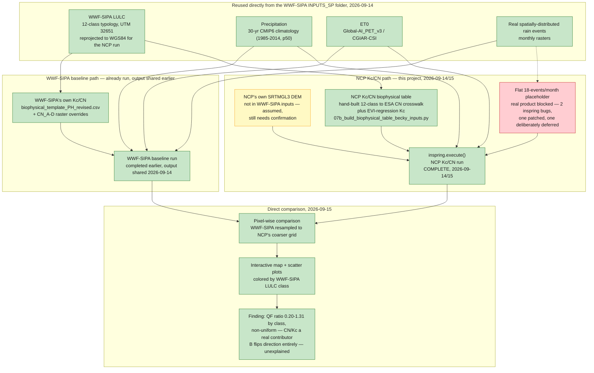

# SWY Philippines comparison: workflow and status

Working diagram for the Philippines Kc/CN comparison — both paths side by side, so the shared
inputs and the two divergence points (DEM, Kc/CN, rain events) are visible at a glance. Status
colors: 🟩 done · 🟨 in progress / partial or unconfirmed · 🟥 blocked. Update this alongside
`HANDOFF.md` and `research_notes.md` rather than letting it drift — this is the map, those are the
log. Terminology: **WWF-SIPA baseline** = the original run, WWF-SIPA's own Kc/CN. **NCP Kc/CN
run** = this project's isolated-variable run, same WWF-SIPA inputs with this project's own Kc/CN
substituted in.

## Reading the diagram

**Two divergence points, both real and both flagged elsewhere in the comparison's caveats**: the
DEM (WWF-SIPA's inputs never included one — this project assumed standard SRTM, unconfirmed with
WWF-SIPA) and the rain events (WWF-SIPA's baseline presumably used the real spatially-distributed
product directly; the NCP run tried to reuse that same file and hit two real upstream `inspring`
bugs, falling back to a flat placeholder instead). Both are genuine, unintended departures from a
clean isolated-variable test — not modeling choices, real software/data compatibility problems,
documented in `swy_methods.qmd`'s "Real technical problems found and how each was handled."

**The LULC and climate stack are the one thing held constant** — reused directly, unmodified in
classification (only reprojected geometrically). That's what makes the CN/Kc crosswalk finding
meaningful at all: whatever else changed, the land-cover input itself didn't.

Full numbers, the crosswalk table, and the scatter-plot analysis: `swy_methods.qmd`'s "Test
design: Philippines" section and `docs/reports/swy_status_report.qmd`.
