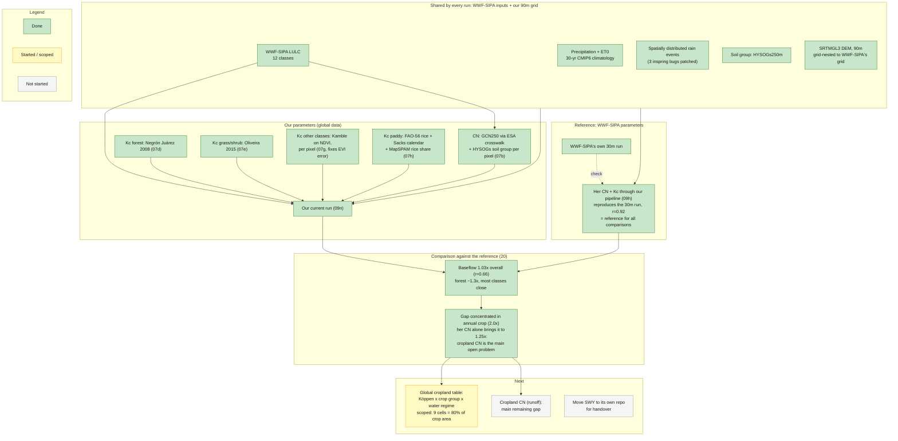

# SWY Philippines comparison: workflow and status

Working diagram for the Philippines Kc/CN comparison, status 2026-09-25. Status colors: 🟩 done ·
🟨 started / scoped · ⬜ not started. Update this alongside `HANDOFF.md` and `research_notes.md`;
this is the map, those are the log. Run and figure dictionary: `docs/reports/swy/FIGURES.md`.

## Reading the diagram

**Every run shares the same inputs and the same 90m grid.** The only thing that differs between
runs is CN and Kc. WWF-SIPA's own CN and Kc, run through this pipeline (09h), reproduce their 30m
run (r=0.92 for quickflow and baseflow), so the pipeline and resolution are ruled out and 09h is
the reference for every comparison.

**Our parameters come from global data.** CN from GCN250; Kc per pixel and per month from MODIS,
using the closest published calibration for each land-cover type, plus a paddy rice Kc for annual
crop.

**The result points to one place.** Overall baseflow is close to the reference (1.03x), but annual
crop is 2.0x, and swapping in WWF-SIPA's CN alone brings it to 1.25x. Cropland CN is the main open
problem; the global cropland table (climate x crop group x water regime) is the proposed way to
handle it at global scale, scoped in `docs/swy/global_cropland_parameterization_plan.md`.

Full numbers and figures: `docs/reports/swy/swy_status_report.qmd`.
