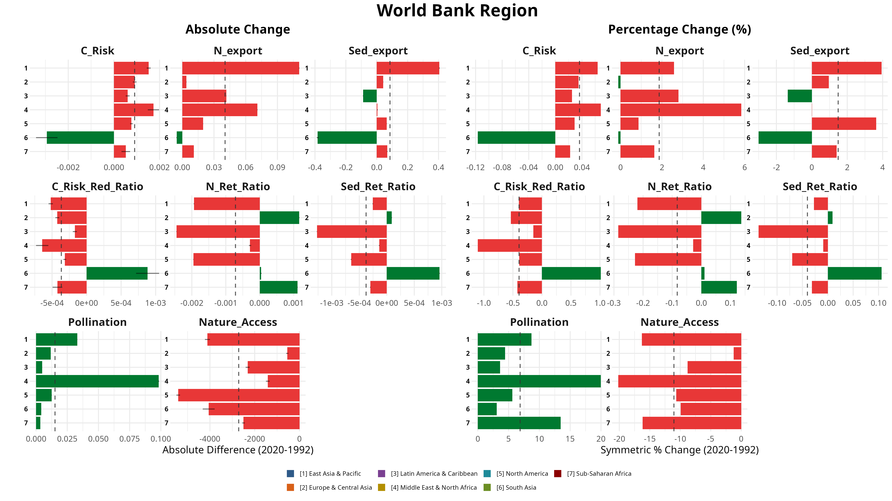
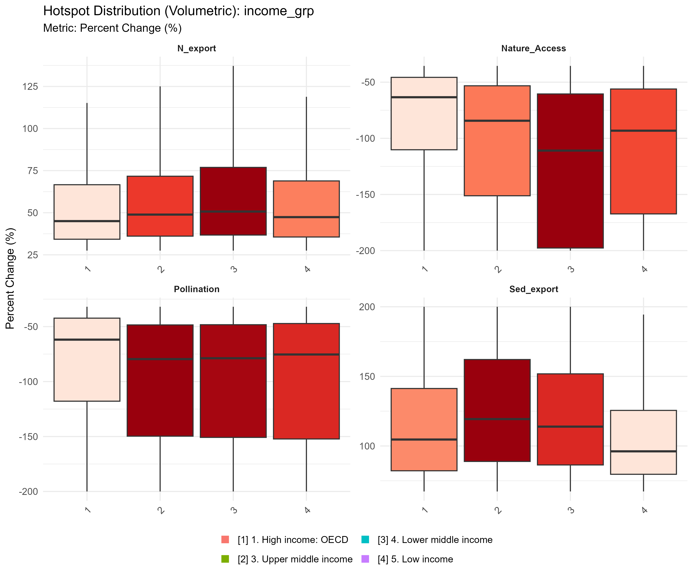
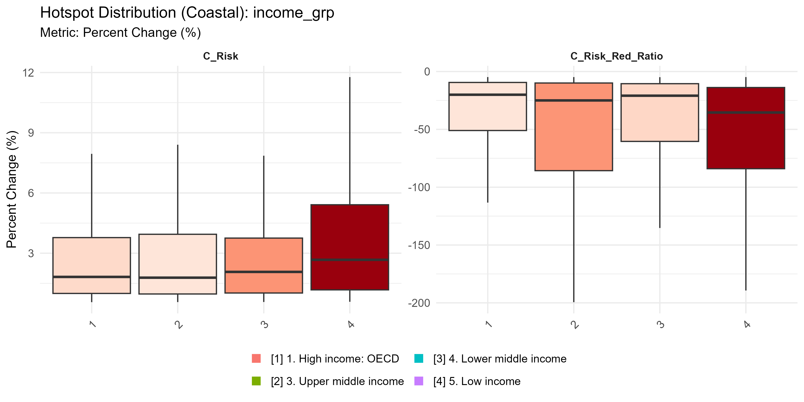

# Abstract

Ecosystem services—the ecological processes and structural configurations through which natural ecosystems sustain and fulfill human life—are declining globally, but their spatial concentration, affected populations, and underlying driving mechanisms remain poorly understood. We analyze overarching regional trajectories and localized changes for eight distinct biophysical service variables across 1.69 million 100 $\text{km}^2$ equal-area grid cells worldwide between 1992 and 2020. Integrating the Integrated Valuation of Ecosystem Services and Tradeoffs (InVEST) modeling framework, European Space Agency Climate Change Initiative (ESA CCI) land cover records, and gridded socioeconomic covariates, we identify approximately 250,000 unique grid cells experiencing at least one extreme ecosystem service decline hotspot (defined as the extreme 5% of relative change values calculated via Symmetric Percentage Change per service). 

Our spatial diagnostics reveal three primary systemic trends: (1) marked geographic clustering of multi-service hotspots predominantly within Latin America and the East Asia-Pacific regions; (2) highly differentiated human exposure across administrative income tiers, with lower-middle-income nations experiencing roughly 1.6 times higher localized hotspot intensity than high-income countries; and (3) a profound spatial attribution gap wherein approximately 76% of identified hotspots exhibit zero intersection with macro-scale land cover conversion. This attribution complexity strongly implies that sub-pixel, in-situ ecosystem degradation vastly outpaces outright land conversion as a primary driver of global nature futures decline. These findings highlight an urgent need for targeted, context-specific conservation and landscape management strategies that explicitly account for spatial concentration, downstream demographic exposure, and non-conversion degradation pathways.

**Keywords:** Ecosystem services, Spatial hotspots, Land-use change, Socioeconomic profiling, Nature futures, Global assessment

---

# Introduction

## Ecosystem Services at Risk
Ecosystem services represent the structural components, biophysical functions, and ecological processes through which natural landscapes generate direct and indirect benefits for human societies (Daily et al., 2009). Despite their foundational role in supporting global economic stability, food security, and climate resilience, critical landscape functions—including wild pollination, hydrological regulation, and coastal risk mitigation—are undergoing unprecedented systemic declines worldwide (Millennium Ecosystem Assessment, 2005; IPBES, 2019). Current macro-ecological estimates indicate that upwards of 1.1 billion vulnerable individuals rely directly on local ecosystem configurations for their immediate subsistence and natural resource-based livelihoods (Chaplin-Kramer et al., 2019; Fedele et al., 2021). However, the highly localized geographic configurations of these changes, alongside the precise demographic identities of vulnerable populations, remain starkly under-characterized at the global scale.

## Spatial Prioritization Challenge
Developing equitable mitigation frameworks is fundamentally constrained by a compounding set of resource, institutional, and informational bottlenecks [citation here]. Conservation investments and climate adaptation funds are severely limited [source]; however, the challenge extends beyond financial scarcity. Decision-makers lack access to spatially explicit, globally consistent, and computationally reproducible metrics capable of diagnosing where ecosystem service capacity is declining most acutely (WHERE), which specific segments of human society are most vulnerable (WHO), and what precise biophysical or anthropogenic mechanisms drive observed losses (WHY). [i need to back all these claims with sources] 

This persistent diagnostic gap frequently results in misallocated resource flows [example], where broad national or continental aggregations can hide local vulnerabilities and exacerbate environmental injustices. Without a standardized, high-resolution baseline tracking relative changes through time, implementing proactive, landscape-level interventions remains practically unfeasible. A reproducible global assessment that structurally links biophysical service models with high-resolution satellite observations and fine-scale demographic grids is urgently required to shift international policy from reactive remediation to targeted spatial prioritization. **Note**: I need to make explicit how this work can contribute to the GEP analysis and itnegrated with the rest of the work being done at NatCap, as well as to inform platforms like IPBES...Need to ask becvky

## Research Objectives
This study addresses four structurally linked research questions:
1. What are the overarching global and macro-regional trajectories of absolute and relative ecosystem service change?
2. Where are the localized hotspots of extreme ecosystem service decline geographically concentrated?
3. Who is directly exposed to these localized declines, and how does human vulnerability scale when transitioning from local in-situ populations to connected downstream serviceshed beneficiaries?
4. Why are these services declining—can localized losses be attributed to explicit satellite-detected land cover conversion, or are they driven by hidden, in-situ habitat degradation? [this is mabe aiming too high. thati aa ctually one of the findings, LC change/ the attribution gap, only explains a part of all what is happening, but it is not the only driver. I need to be careful here to not overstate this finding, but also to make it clear that it is a very important one. I need to make sure that the framing of this question is accurate and does not imply that we are claiming that all decline is due to degradation, but rather that a significant portion of it is not explained by land cover change, which suggests that degradation is a major driver.]

---

# Methods

## Data Sources and Study Design
To evaluate global ecosystem dynamics, we established a 28-year temporal scope spanning from 1992 to 2020. This specific window was selected to leverage the maximum continuous historical baseline provided by the European Space Agency Climate Change Initiative (ESA CCI) land cover time series [get the right citation], allowing us to capture long-term structural landscape trajectories preceding and following the transition into the Sustainable Development Goal (SDG) era [source]. The spatial scope encompasses all terrestrial landmasses, partitioned into a standardized equal-area grid of 1,689,609 cells ($100\text{ km}^2$ each), utilizing the IUCN Area of Occupancy (AOO) structural backbone grid [add source to the AOO grid].

### Biophysical Modeling of Ecosystem Services
We used eight simulated continuous ecosystem service variables at a native 300-meter spatial resolution using the InVEST (Integrated Valuation of Ecosystem Services and Tradeoffs) biophysical software suite (Sharp et al., 2020, add the TNC work for which this was produced). To ensure comparisons of volumetric ecosystem services were physically meaningful across latitudes, we standardized all extensive variables (e.g., nitrogen and sediment export) to a per-hectare basis prior to grid aggregation, while intensive variables (e.g., risk ratios) were retained in native index units. Additionally, coastal risk indices were calculated natively in the vector domain before rasterization to prevent floating-point interpolation errors along complex shorelines. The modeled suite targets three core thematic areas of human-nature interdependence:

1. **Local & Habitat Services:** *Nature access* (modeled as a spatial proxy of human proximity to intact natural habitat matrices) and *pollination* (evaluated as landscape-level habitat suitability and foraging range support for wild pollinator guilds).
2. **Coastal Risk Mitigation:** *Coastal protection* (simulated as absolute open-ocean wave energy attenuation by marine and coastal vegetative barriers) and the *coastal risk reduction ratio* (the proportional reduction in socio-ecological vulnerability directly mitigated by the presence of protective coastal habitats).
3. **Hydrological Regulation:** *Nitrogen export* (total annual nutrient loading delivered to surface waterways), *nitrogen retention ratio* (the relative landscape efficiency in trapping and filtering overland nutrient flows), *sediment export* (total annual sediment yield reaching stream networks), and the *sediment retention ratio* (the structural capacity of the landscape matrix to intercept and retain upslope soil erosion). [consider adding the way ratios are calculated and why]

### Ancillary Datasets and Harmonization
To cross-examine biophysical changes with external socioeconomic and land-use drivers, we compiled and harmonized a suite of global gridded covariates to the 10-km IUCN grid template. Population exposure was extracted from the Global Human Settlement Layer (GHSL-POP), localized urban footprints from GHSL-BUILT, gross domestic product from the World Bank gridded economic layers, human development metrics from the United Nations Development Programme (UNDP-HDI), and agricultural landscape metrics (plot area and intensity) from Mehrabi et al. [fix citations]

The 300-meter ESA CCI land cover dataset serves a dual role within this pipeline: it functions both as a primary categorical input driving the underlying InVEST biophysical models and as an independent baseline for the downstream spatial attribution analysis. To systematically categorize structural land-use shifts across the 28-year window, land cover transitions were cross-tabulated into square contingency matrices tracking gross loss, gross gain, and exchange—avoiding the masking effects of simple net change metrics (Pontius and Millones, 2011, Pontius & Santacruz 2014). ...National boundaries, sub-national administrative units, and cross-cutting global biomes were integrated via an expert-reviewed correspondence table (`ee_correspondence`),  ensuring seamless spatial alignment across all physical and political geographies. 

It is important to nore that because the ESA CCI land cover dataset serves both as  primary structural input for the biophysical InVEST models and as the baseline for the downstream driver analysis, the two steps are mathematically linked [need to explain that it is an input to run the Invest models and also to assess the effect, so one would expect a lot of correltion between them. even, someone could mention that any reñationship here can be seen as "banal". However, rather than compromising the independence of the attribution analysis, this shared structural baseline provides a underestimation of the attribution gap; with mismatchs possibly representing the cases in which  sub-pixel variations or continuous thematic variables (such as? i don't even know how the models are run actually, all this time i have jsut reliedon already processed rasters, but i need to understand how the models are run and how the land cover data is used as an input, and how it can be used to override the categorical land-use signals natively embedded within the models. This needs clarity but i think i am finally udnerstnading this. 

## Analysis Pipeline

### Regional Trajectories versus Grid-Level Hotspots
The analytical workflow implements a dual-pathway structure designed to resolve distinct scales of landscape modification. To evaluate broad, systemic macro-regional trajectories (the "WHAT"), we computed pixel-by-pixel modifications across the native 300-meter continuous rasters and subsequently aggregated these absolute and relative differences directly to expansive geographic zones (global biomes and World Bank income classes). This pathway preserves large-scale trends across major earth systems. 

Conversely, to isolate localized intensities of severe environmental decline (the "WHERE"), baseline (1992) and future (2020) biophysical rasters were spatially aggregated via zonal statistics to the 10-km equal-area grid *prior* to executing per-cell change calculations. This dual framework ensures that extreme localized declines are not mathematically erased or muted by broad regional averaging.

::: {#fig-workflow}
```{mermaid}
%%{init: {'flowchart': {'rankSpacing': 300, 'nodeSpacing': 30}}}%%
flowchart LR
    %% Subgraph Styling
    style INPUTS fill:#F8F9FA,stroke:#D3D3D3,stroke-width:2px
    style PROCESSING fill:#F8F9FA,stroke:#D3D3D3,stroke-width:2px
    style OUTPUTS fill:#F8F9FA,stroke:#D3D3D3,stroke-width:2px

    %% Input Layer
    subgraph INPUTS [" "]
        direction TB
        RawES["<span style='font-size: 38px;'><b>Global InVEST ES Models</b></span> <br/> <span style='font-size: 32px;'>300m Rasters <i>(1992 & 2020)</i></span>"]
        RawGrid["<span style='font-size: 38px;'><b>IUCN AOO 10km Master Grid</b></span> <br/> <span style='font-size: 32px;'><i>Vector with Subregional Attributes</i></span>"]
        RawLC["<span style='font-size: 38px;'><b>ESA CCI Land Cover</b></span> <br/> <span style='font-size: 32px;'>300m Rasters <i>(1992 & 2020)</i></span>"]
        RawSoc["<span style='font-size: 38px;'><b>Socioeconomic Data</b></span> <br/> <span style='font-size: 32px;'>Rasters <i>(Pop, GDP, HDI)</i></span>"]
    end

    %% Processing Layer
    subgraph PROCESSING [" "]
        direction TB
        IntA["<span style='font-size: 38px;'><b>Path A: Global Trajectories</b></span> <br/> <span style='font-size: 32px;'>Zonal Summaries <i>(1992 & 2020)</i></span>"]
        MathA["<span style='font-size: 38px;'><b>Path A Metrics</b></span> <br/> <span style='font-size: 32px;'>SPC & Absolute Difference</span>"]

        IntB["<span style='font-size: 38px;'><b>Path B: Grid Analysis</b></span> <br/> <span style='font-size: 32px;'>10km Zonal Summaries <i>(1992 & 2020)</i></span>"]
        MathB["<span style='font-size: 38px;'><b>Path B Metrics</b></span> <br/> <span style='font-size: 32px;'>SPC & Absolute Difference</span>"]

        MathLC["<span style='font-size: 38px;'><b>Land Cover Transitions</b></span> <br/> <span style='font-size: 32px;'>Reclassified LC Contingency <br/> Matrices per 10km Gridcell</span>"]
        MathSoc["<span style='font-size: 38px;'><b>Socioeconomic Stats & KS Tests</b></span> <br/> <span style='font-size: 32px;'>10km Grid Aggregation <br/> & Statistical Profiling</span>"]
    end

    %% Outputs Layer
    subgraph OUTPUTS [" "]
        direction TB
        P1["<span style='font-size: 38px;'><b>WHAT: Global Trajectories</b></span> <br/> <i style='font-size: 32px; font-weight: normal;'>Bar Charts, Summary Tables, <br/> & Cartographies (GPKGs)</i>"]
        P2["<span style='font-size: 38px;'><b>WHERE: Hotspot Detection (Top/Bottom 5%)</b></span> <br/> <i style='font-size: 32px; font-weight: normal;'>Abs & SPC GPKGs, Synthesis Maps, <br/> & Distribution Plots</i>"]
        P3["<span style='font-size: 38px;'><b>WHY: Attribution Gap</b></span> <br/> <i style='font-size: 32px; font-weight: normal;'>LCC Overlap CSVs, Heatmaps, <br/> Scatterplots, & Driver Maps</i>"]
        P4["<span style='font-size: 38px;'><b>WHO: Equity & Exposure</b></span> <br/> <i style='font-size: 32px; font-weight: normal;'>KS Test Plots & <br/> Population Exposure CSVs</i>"]
    end

    %% Logical Connections
    RawGrid ==> IntB
    RawGrid ==> MathLC
    RawGrid ==> MathSoc

    RawES ==> IntA
    RawES ==> IntB

    IntA ==> MathA
    IntB ==> MathB

    MathA ==> P1
    MathB ==> P2

    %% Downstream Analysis from Hotspots (P2)
    P2 ==> P3
    RawLC ==> MathLC
    MathLC ==> P3

    P2 ==> P4
    RawSoc ==> MathSoc
    MathSoc ==> P4

    %% Layout Guides
    RawSoc ~~~ MathSoc
    IntA ~~~ P1

    %% CANONICAL COLOR CLASSES (Matching Circular Diagram)
    classDef c_what fill:#007930,stroke:#004D1E,stroke-width:3px,color:#FFF;
    classDef c_where fill:#7B8327,stroke:#515619,stroke-width:3px,color:#FFF;
    classDef c_why fill:#F07D00,stroke:#A85700,stroke-width:3px,color:#FFF;
    classDef c_who fill:#F5D200,stroke:#B39900,stroke-width:3px,color:#333;

    %% Pillar Assignments
    class RawES,IntA,MathA,P1 c_what;
    class RawGrid,IntB,MathB,P2 c_where;
    class RawLC,MathLC,P3 c_why;
    class RawSoc,MathSoc,P4 c_who;
```
The dual-pathway analytical workflow. Path A calculates global and regional trajectories from pixel-level differences, addressing the 'WHAT' question. Path B aggregates data to a 10-km grid to identify and analyze localized hotspots, addressing the 'WHERE', 'WHO', and 'WHY' questions.
:::

### Zonal Summaries and Symmetric Percentage Change (SPC)
Per-cell absolute changes within the 10-km grid were computed as:

$$\Delta S = S_{2020} - S_{1992}$$

To calculate relative changes through time without introducing severe scale errors or mathematical inflation near zero-baselines, we utilized Symmetric Percentage Change (SPC):

$$SPC = \frac{S_{2020} - S_{1992}}{(|S_{2020}| + |S_{1992}|) / 2} \times 100$$

SPC treats gains and losses symmetrically and bounds all resulting outputs strictly between $-200\%$ and $+200\%$. This mathematical bound effectively dampens the artificial distortions and division-by-zero errors that standard relative change equations generate when baseline landscape capacities ($S_{1992}$) approach zero (Berry & Ayers, 2006).

### Hotspot Identification
Ecosystem service change hotspots are defined as grid cells falling within the extreme 5th percentile of relative change (SPC) values per service type over the 28-year period. Directionality was customized to match environmental degradation across distinct service architectures: for services where an increase denotes landscape damage (e.g., *Nitrogen Export*, *Sediment Export*), the upper 5% of the SPC distribution was extracted; for services where a decrease signifies loss of function (e.g., *Pollination*, *Nature Access*, *Retention Ratios*), the lower 5% was utilized. Utilizing statistical percentiles rather than rigid, arbitrary absolute thresholds guarantees complete comparability across disparate biophysical variables measured in fundamentally different units (e.g., kilograms of exported nutrient versus dimensionless protection ratios) [back this claim].

### Socioeconomic Profiling and Spatial Statistics
To statistically isolate the human dimensions of these hotspots, we compared the underlying distributions of socioeconomic covariates inside hotspot cells against a balanced background landscape utilizing two-sample Kolmogorov-Smirnov (KS) tests:

$$D = \max_x |F_{\text{hotspot}}(x) - F_{\text{non-hotspot}}(x)|$$

Given the very large sample size of our global grid ($n \approx 1.69\text{ million}$ cells), which artificially inflates standard $p$-values, we utilized Cliff's Delta ($\delta$) effect-size metrics to evaluate the true practical magnitude and direction of the statistical distributions. To mitigate sample size imbalances and interference from regions experiencing extreme opposite changes (i.e., service gains), hotspots were compared strictly against the "business-as-usual" median landscape (the 47.5th to 52.5th percentiles of change) [back this claim]. All $p$-values were further adjusted using a Benjamini-Hochberg False Discovery Rate (FDR) correction to account for multiple simultaneous testing conditions across the covariate matrix.

### Spatial Attribution Analysis
To isolate the operational drivers of decline, we executed a spatial overlay analysis between the finalized hotspot grids and areas of land cover conversion. Utilizing specific land cover transitions, we  explored distinct direct drivers such as forest loss, agricultural expansion, and grassland loss. We calculated the **"attribution gap"** as the total proportion of biophysical ecosystem service hotspots that exhibited zero spatial overlap with any major land-use transition at the 300-meter scale. A high attribution gap serves as a strong, spatially explicit proxy indicating that sub-pixel, in-situ habitat degradation (e.g., understory thinning, selective canopy removal, chemical intensification) represents the dominant mechanism driving loss of service, bypassing traditional satellite land-use detection.

---

# Results

## Global and Regional Trajectories
The macro-regional pathway highlights a decoupling between absolute volumetric changes and relative functional shifts. Continental summaries show massive absolute volume losses concentrated within expansive, high-baseline tropical forest biomes, representing a systemic drawdown of global ecological capital. Concurrently, evaluating percentage changes across intermediate or arid biomes reveals widespread, low-magnitude landscape transitions that point to a generalized destabilization of global landscape regulation functions over the 28-year window.

{#fig-regional-trajectories .quarto-figure-center}

## Global Hotspot Distribution
At the grid scale, we identified approximately 250,000 unique cells experiencing at least one extreme ecosystem service hotspot. These zones exhibit intense geographic clustering. Latin America and the Caribbean display an enrichment score of 1.40×, indicating a disproportionate concentration of multi-service decline relative to global land area. The East Asia-Pacific region exhibits a comparable enrichment score of 1.30×. In stark contrast, South Asia and Sub-Saharan Africa show low relative hotspot densities (0.78–0.80× enrichment), while highly industrialized zones across Europe, Central Asia, and North America show the lowest relative intensities ($<0.65\times$ enrichment), reflecting highly stabilized—and historically altered—base landscapes.

::: {#fig-hotspot-dist}
{width="100%"}

{width="100%"}

Global Compound Risk (Hotness) and Relative Intensity. The map (top) shows the count of overlapping negative hotspots in a single 10km cell. The bar chart (bottom) shows the disproportionate burden of hotspots relative to a region's size.
:::

## Socioeconomic Profiling: KS Diagnostics
{#fig-socioeconomic-context .quarto-figure-center}

The spatial KS tests reveal that 47 out of 48 service-by-covariate combinations (97.9%) exhibit highly significant distributional differences between hotspot and background populations ($p < 0.05$ after strict FDR correction). Cliff’s Delta metrics cleanly separate these dynamics into two distinct socioeconomic typologies:
* **Infrastructure-Driven Typologies:** Hotspots tracking declines in *Nature Access*, *Coastal Protection*, and *Sediment Retention* are heavily associated with high baseline population densities, expanding built-up footprints, and high localized GDP profiles, directly implicating aggressive urban infrastructural expansion.
* **Agricultural-Driven Typologies:** Hotspots tracking *Pollination* losses and accelerated *Nitrogen Export* are strongly coupled with low population densities and elevated agricultural plot intensity, isolating chemical crop intensification as the primary driver of rural landscape decline.

::: {#fig-ks-diagnostics}
{width="100%"}

{width="100%"}

Socioeconomic profiling of hotspots. The KS statistic heatmap (top) quantifies the magnitude of difference between hotspot and background populations, while the Cliff's Delta plot (bottom) shows the direction of that difference.
:::

### Hotspot Magnitude by Income Group
Beyond identifying where hotspots are, it is critical to analyze the magnitude of change within them. Boxplots of the Symmetric Percentage Change (SPC) values for hotspots reveal significant variation across both ecosystem services and socioeconomic strata. For volumetric services like *Pollination* and *Nature Access*, hotspots in high-income countries, while less frequent, often exhibit a wider range of extreme changes. This suggests that when declines do occur in these regions, they can be particularly severe. Conversely, hotspots in lower-income nations, though more widespread, show a more compressed distribution of change, indicating a more systemic, chronic level of degradation.

::: {#fig-boxplots-income}
{width="100%"}

{width="100%"}

Distribution of Hotspot Magnitudes. The boxplots show the distribution of Symmetric Percentage Change (SPC) values for cells identified as hotspots, broken down by income group. This highlights how the intensity of change within hotspots varies across different socioeconomic contexts.
:::

## Population Exposure and the Serviceshed Multiplier Effect
We estimate that approximately 7.9 billion people live within, or depend directly upon, the spatial footprint of these hotspots. While upper-middle-income countries encompass the largest absolute volume of exposed citizens, lower-middle-income countries experience the highest relative hotspot intensity—experiencing an exposure profile roughly 1.6 times more severe than OECD nations. Low-income states account for approximately 4.2% of the immediate spatial exposure.

Crucially, when expanding our analysis from local, in-situ populations to connected downstream beneficiaries via regional **servicesheds**, we observe an extraordinary scale expansion. For compound hotspots (grid cells experiencing two or more overlapping service declines), the immediate in-situ residential footprint is approximately 8.6 million people. However, when tracing the down-gradient hydrological flow paths and ecological service delivery footprints connecting these specific cells, the total population reliant on these impaired upstream grids expands to over 6.0 billion individuals. This represents a massive 700x serviceshed multiplier effect, demonstrating that highly localized environmental degradation possesses the capacity to cascade into extensive regional vulnerabilities. This profound spatial expansion reinforces the necessity of moving beyond localized, in-situ demographic impact metrics, aligning with macro-ecological frameworks relying on explicit upstream-downstream directional servicesheds to delineate the true socio-ecological footprint of upstream landscape degradation (Brauman et al., 2007; Keeler et al., 2012).

{#fig-pop-exposure .quarto-figure-center}

## The Spatial Attribution Gap
Our spatial overlay analysis reveals that major land cover transitions intersect with an average of only 24% of identified ecosystem service hotspots. The remaining **76% of hotspots constitute a profound spatial attribution gap**, exhibiting zero intersection with satellite-detected categorical land-use change. Among the explicitly captured transitions, the dominant contributors are forest conversion (19.8%), cropland expansion (19.0%), and grassland loss (7.7%). 

The magnitude of this 76% gap confirms that standard macro-scale satellite classifications are largely blind to the primary drivers of environmental decline. This strong analytical signal indicates that global ecosystem service loss is fundamentally driven by sub-pixel, in-situ landscape degradation—including selective logging, understory clearance, heavy fertilizer application, and localized edaphic degradation—which structurally compromises biophysical flow capacities while leaving the macro-level vegetation classification completely unchanged.

{#fig-attribution-gap .quarto-figure-center}

---

# Discussion

## Geographic Clustering Enables Prioritization
The intense geographic concentration of hotspots within specific sub-regions of Latin America and East Asia proves that global environmental decline is highly non-uniform, opening clear pathways for optimized resource deployment. Targeted interventions within high-intensity nations—such as South Korea, Malaysia, Guatemala, and Jamaica—can maximize conservation return on investment. However, because the precise spatial configurations of these hotspots vary significantly by service type, executing blanket, generalized conservation frameworks will likely fail; interventions must transition toward multi-tier spatial management plans tailored to localized biophysical outputs.

## Differentiated Vulnerability Tiers
Socioeconomic profiling confirms that global environmental decline cannot be managed as a singular crisis; it operates via highly differentiated exposure pathways. Urban populations face acute, localized vulnerabilities tied directly to structural infrastructural safety (e.g., loss of coastal protection and natural runoff moderation), requiring targeted urban green-infrastructure integration. Concurrently, rural and marginalized agrarian communities face direct threats to food security and long-term economic solvency due to systemic pollination collapse and agricultural water degradation. Conservation architectures must therefore abandon uniform paradigms and align directly with the specific socioeconomic realities of the exposed populations.

## Attribution Complexity: The Degradation Dominance
The 76% attribution gap fundamentally challenges the long-standing assumption in global modeling that categorical land cover conversion serves as an accurate proxy for overall ecosystem service health. Crucially, this gap emerges despite the systemic endogeneity of our workflow, where the InVEST models rely directly on categorical land-use classifications to determine biophysical output coefficients. 
The fact that nearly three-quarters of extreme functional service declines bypass explicit spatial intersections with macro-scale land transitions provides an ironclad signal that sub-pixel landscape degradation—operating below the detection thresholds of 300-meter optical sensors—is the dominant mechanism driving global environmental vulnerability (Vancutsem et al., 2021). Relying strictly on protected-area boundaries designed to halt absolute deforestation will prove structurally insufficient if the internal habitat matrix continues to undergo severe in-situ functional degradation.

## Pipeline Limitations and Analytical Uncertainties
We explicitly acknowledge several bounding limitations within this pipeline:
1. **Temporal Discretization:** Relying on two discrete temporal snapshots (1992 and 2020) effectively masks complex intermediate non-linearities, land-use oscillations, and short-term recovery dynamics.
2. **Model Decoupling:** The InVEST modeling engines utilized do not fully decouple climate-driven meteorological variations from direct, anthropogenically driven land-use changes.
3. **Attribution Independence:** Because the categorical ESA CCI land cover data acts concurrently as a core baseline input for the biophysical models and as the basis for the driver overlay analysis, the attribution gap must be interpreted as a highly structured indicator of sub-pixel degradation rather than a completely independent empirical validation. Extensive, localized field validation remains an irreplaceable requirement, particularly within high-intensity tropical and sub-tropical hotspot zones.

---

# Conclusions
This global assessment structurally integrates high-resolution biophysical models, multi-decadal satellite land cover matrices, and gridded socioeconomic layers to map the macro-geography of environmental decline. Our findings demonstrate that global ecosystem service loss is highly concentrated within Latin America and East Asia, offering clear entry points for targeted international conservation allocation. We prove that socio-ecological vulnerability is deeply stratified, exposing urban and rural populations to fundamentally distinct risk profiles, and we show that localized upstream habitat impairment scales via a 700x serviceshed multiplier effect to threaten billions of downstream beneficiaries. 

Finally, the prominent 76% spatial attribution gap demonstrates that the preservation of macro-level land classifications is entirely insufficient to guarantee the maintenance of ecosystem functions. Future research frameworks must prioritize the empirical field-validation of global biophysical models, integrate high-resolution structural degradation sensors, explicitly isolate climate-driven flow variations, and pursue the active co-production of local management knowledge with vulnerable land managers and indigenous communities at the frontlines of global landscape change.

---

# References

- Berry, D. A., & Ayers, G. D. (2006). Symmetrized percent change for treatment comparisons. *The American Statistician*, 60(1), 27-31.
- Brauman, K. A., Daily, G. C., Duarte, T. K. E., & Mooney, H. A. (2007). The nature and value of ecosystem services: an hydrological perspective. *Annual Review of Environment and Resources*, 32(1), 67-98.
- Chaplin-Kramer, R., Sharp, R. P., Mandle, L., Sim, S., Johnson, J. A., Mueller, I., ... & Daily, G. C. (2019). Global modeling of nature’s contributions to people. *Science*, 366(6462), 255-258.
- Daily, G. C., Polasky, S., Goldstein, J., Kareiva, P. M., Mooney, H. A., Pejchar, L., ... & Shallenberger, R. (2009). Mainstream conservation into practical decisions. *Frontiers in Ecology and the Environment*, 7(1), 21-28.
- Fedele, G., Donatti, C. I., Bornacelly, I., & Hole, D. G. (2021). Nature-dependent people: Mapping human direct reliance on ecosystem services globally. *Global Environmental Change*, 71, 102368.
- IPBES. (2019). *Global assessment report on biodiversity and ecosystem services of the Intergovernmental Science-Policy Platform on Biodiversity and Ecosystem Services*. IPBES secretariat, Bonn, Germany.
- Keeler, B. L., Polasky, S., Brauman, K. A., Johnson, J. A., Finlay, J. C., O'Neill, A., ... & Dalzell, B. (2012). Linking water quality and human well-being on a global scale. *Proceedings of the National Academy of Sciences*, 109(45), 18619-18624.
- Millennium Ecosystem Assessment. (2005). *Ecosystems and Human Well-being: Synthesis*. Island Press, Washington, DC.
- Pontius, R. G., & Millones, M. (2011). Death to Kappa: birth of quantity disagreement and allocation disagreement for accuracy assessment. *International Journal of Remote Sensing*, 32(15), 4407-4429.
- Sharp, R., Douglass, J., Wolny, S., Arkema, K., Bernhardt, J., Bierbower, W., ... & Wyatt, K. (2020). *InVEST User’s Guide*. The Natural Capital Project, Stanford University, University of Minnesota, World Wildlife Fund, and The Nature Conservancy.
- Vancutsem, C., Achard, F., Pekel, J. F., Vieilledent, G., Carboni, S., Simonetti, D., ... & Eva, H. D. (2021). Long-term (1990–2019) forest degradation and deforestation in the moist tropics of South Asia, Southeast Asia and Latin America. *Nature*, 591(7848), 115-122.

---

# Annex: Supplemental Figures

This annex contains supplemental figures that provide additional detail and context for the analyses presented in the main body of the paper.

## Regional Trajectories by Biome

::: {#fig-annex-biome-trajectories layout-ncol=1}


Ecosystem Service Change by WWF Biome. These charts show the absolute and relative change trajectories for each of the eight services across major global biomes.
:::

## Methodological Note: 10km Grid Aggregation (Path B)

The regional trajectory charts in the main text are derived from "Path A," which calculates pixel-by-pixel differences before aggregating to regions. This avoids spatial aggregation artifacts. For methodological transparency, the charts below show the same regional trajectories calculated via "Path B," where data is first aggregated to the 10km grid and then averaged. Note the subtle differences, particularly potential "sign-flips" in percentage change, which are a known feature of spatial aggregation (Modifiable Areal Unit Problem) and are discussed in the full technical documentation.

::: {#fig-annex-path-b-trajectories layout-ncol=1}


Path B Regional Trajectories. These charts show the regional change trajectories as calculated from the 10km grid averages.
:::