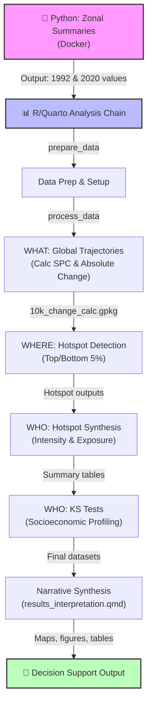

# Global NCP
## Understanding Ecosystem Service Hotspots

*Where is nature changing, who is affected, and where is action most needed?*

---

# Part 1: WHY {background-color="#004D1E"}
## Why Are We Doing This?

---

## The Problem: Global Ecosystem Change

::: {.columns}
::: {.column width="50%"}

### The Challenge
- **Rapid land use change** is transforming Earth's ecosystems
- **Ecosystem services** (pollination, coastal protection, water purification) are declining
- **Impacts are uneven** across regions and populations
- **Decision-makers lack clarity** on where and how to act

:::

::: {.column width="50%"}

### Why It Matters
- 1.1 billion people depend directly on ecosystem services
- Biodiversity loss is accelerating globally
- Climate change compounds existing pressures
- Conservation resources are limited—prioritization is critical

:::
:::

---

## Three Critical Questions

::: {.columns}
::: {.column width="33%"}

### **WHERE?**
Identify geographic hotspots—where is ecosystem service provision declining most rapidly

:::

::: {.column width="33%"}

### **WHO?**
Determine who is affected—which populations face exposure to service loss or environmental risk

:::

::: {.column width="33%"}

### **WHY?**
Understand drivers—what physical mechanisms (land use, degradation, urbanization) explain the change

:::
:::

---

## Project Goals

1. **Global Scale, Policy Relevance**
   - Analyze ecosystem services across all land on Earth using consistent methods
   - Support conservation planning, sustainable development, and climate action

2. **Transparency & Reproducibility**
   - Open-source methodology using InVEST, ESA, and public socioeconomic data
   - Documented pipeline allows peer review, replication, and adaptation

3. **Decision Support**
   - Combine spatial (hotspot) and socioeconomic analysis (KS tests)
   - Link outcomes directly to policy frameworks (income groups, regions, biomes)

---

# Part 2: HOW {background-color="#7B8327"}
## How Did We Do It?

---

## Data Sources: Global Layers (1992 & 2020)

::: {.columns}
::: {.column width="50%"}

### Ecosystem Services
- **InVEST Models** (360m resolution)
  - Nitrogen Export (NDR)
  - Sediment Retention (SDR)
  - Pollination
  - Coastal Protection

:::

::: {.column width="50%"}

### Supporting Data
- **ESA CCI Land Cover** (reclassified: Transformed/Natural)
- **IUCN AOO 10km Grid** (Master spatial unit with attributes)
- **Socioeconomic Layers** (Population, GDP, HDI)

:::
:::

---

## The Two-Path Analysis Structure

### **Path A: Global Trajectories**
- Raw pixel-level change summaries
- Use: Global "WHAT" narrative

### **Path B: Grid Analysis** (Canonical for hotspots)
1. **Zonal summaries** (1992 & 2020) → aggregate rasters to 10km grid cells
2. **Grid-level differencing** → calculate absolute and percentage change per cell
3. **Hotspot identification** → flag extreme 5% tail of distribution
4. **Regional synthesis** → aggregate hotspots to countries, regions, income groups

::: {.callout-note}
Why aggregation *then* differencing? Because Path B produces the "difference of the aggregates" — more intuitive for hotspot detection.
:::

---

## Key Analytical Metrics

::: {.columns}
::: {.column width="50%"}

### Change Metrics
- **Absolute Change** (T2020 - T1992)
  - Units: service units (e.g., kg N/ha/year)
  
- **Symmetric Percentage Change (SPC)**
  - Formula: $\frac{T2020 - T1992}{(|T2020| + |T1992|) / 2} \times 100$
  - Advantage: Treats increases and decreases symmetrically

:::

::: {.column width="50%"}

### Hotspot Definition
- **Relative Extreme**, not absolute threshold
- **Top/Bottom 5%** of SPC distribution per service
- **"Worry Spots"** = steepest decline in service provision
- **Compound Risk** = multi-service hotspots in same location

:::
:::

---

## Statistical Analysis: Socioeconomic Profiling

### Kolmogorov-Smirnov (KS) Tests

**Purpose:** Compare distributions of population characteristics

::: {.columns}
::: {.column width="50%"}

**Hotspot populations** vs. **Global median**

Test variables:
- Population density
- Built-up area %
- GDP per capita
- HDI

:::

::: {.column width="50%"}

**Interpretation:**
- *Significant p-value* → Distributions differ
- *Effect size* → Magnitude of difference
- **Result:** Socioeconomic profile of affected communities

:::
:::

---

## Analysis Pipeline Overview

---

# Part 3: WHAT {background-color="#F07D00"}
## What Is the Data Showing Us?

---

## Key Finding 1: Geographic Clustering

### Ecosystem Service Hotspots Are Not Random

::: {.columns}
::: {.column width="50%"}

### Geographic Pattern
- **Strong clustering** in the Global South
- **Epicenters of hotness** in:
  - Latin America & Caribbean
  - East Asia & Pacific
  - Sub-Saharan Africa

:::

::: {.column width="50%"}

### Disproportionate Burden
- Global South has **vast disproportionate share** of ES decline
- Despite representing smaller fraction of Earth's land
- Creates **zones of compound risk** with multiple simultaneous service failures

:::
:::

---

## Key Finding 2: Socioeconomic Profile

### Who Is Affected? (KS Test Results)

::: {.columns}
::: {.column width="50%"}

### The Urbanization/Wealth Correlation
- Hotspots of **Nature Access loss, Coastal Risk, Sediment Retention** occur in cells with:
  - ✓ Higher population density
  - ✓ Higher built-up area
  - ✓ **Higher GDP** than global median

**Interpretation:** ES decline is tied to urbanization and economic development

:::

::: {.column width="50%"}

### The Rural Divide
- Hotspots of **Pollination loss, Nitrogen Export increase** concentrated in:
  - ✓ Lower population density
  - ✓ Highly agricultural contexts
  - ✓ Lower urbanization

**Interpretation:** Agricultural intensification and rural land-use change are key drivers

:::
:::

---

## Key Finding 3: The Attribution Gap

### Land Cover Hotspots vs. ES Hotspots

::: {.columns}
::: {.column width="50%"}

### The Gap Exists
- Many ES hotspots **do NOT overlap** with top-5% land cover conversion
- Within same 10km cell: service decline ≠ major land cover change
- **Implication:** Degradation is equally important to conversion

:::

::: {.column width="50%"}

### What This Means
- **Degradation mechanisms** (e.g., reduced pollinator habitat, nutrient depletion) matter
- **Upstream drivers** (land cover change outside the cell) drive service loss
- Simple "conversion detection" insufficient for ES management

:::
:::

---

## Key Finding 4: Population Exposure

### Scale of Human Impact

::: {.columns}
::: {.column width="50%"}

### Who Is Exposed?
- **Majority of people** exposed to ES hotspots live in:
  - Upper Middle-Income countries
  - Lower Middle-Income countries

:::

::: {.column width="50%"}

### Absolute Numbers Matter
- Relative socioeconomic profile (KS tests) shows correlation
- **Absolute population** reveals true scale of impact
- Guides resource allocation and intervention prioritization

:::
:::

---

## Synthesis: The Four Pillars

| Pillar | Finding | Implication |
|--------|---------|-------------|
| **WHAT** | Global ES decline is measurable and regionally aggregated | Change is real, not noise |
| **WHERE** | Hotspots cluster in Global South, creating compound risk zones | Geographic prioritization is possible |
| **WHO** | Affects both urbanized (wealth effect) and rural (agricultural) communities | One-size-fits-all policy insufficient |
| **WHY** | Attribution gap: degradation ≥ conversion in importance | Need comprehensive ecosystem management |

---

## Next Steps: Interpretation Phase

### Moving Forward With Co-Authors

1. **Validate findings** against literature and expert knowledge
2. **Deepen narratives** for specific services and regions
3. **Develop policy implications** (conservation priorities, adaptation strategies)
4. **Prepare for publication** (figures, methods documentation, supplementary materials)

---

# Thank You

**Questions?**

For technical details, methodology, and code:
- 📖 See: `docs/methodology.md`, `docs/runbook.md`
- 💻 Repository: Global NCP (this project)
- 👤 Contact: Jerónimo Rodríguez Escobar (jeronimo.rodriguez@wwfus.org)

---

## Appendix: Methodology References

### Data & Tools
- **InVEST**: Natural Capital Project models for ecosystem services
- **exactextract**: Fast raster zonal statistics (Python)
- **ESA CCI**: Land cover classification from satellite data
- **Quarto + R**: Reproducible analysis and reporting

### Key Publications & Methods
- Pontius & Santacruz (2014): Land cover change transition matrix methodology
- Kolmogorov-Smirnov tests: Non-parametric distribution comparison
- Symmetric Percentage Change: Handles directionality symmetrically

### Repository Structure
- `/analysis/`: 7 active Quarto notebooks (prepare → process → hotspots → KS tests → interpret)
- `/R/`: Core reusable functions
- `/scripts/`: Utility scripts (mapping, monitoring)
- `/docs/`: Detailed technical documentation

